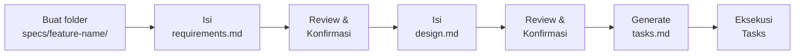

# Specs Folder

> [!NOTE]
> **Source of Truth**
>
> - Workflow Spec-Driven Development: #[[file:docs/14-spec-driven-development.md]]
> - Template PRD: #[[file:docs/04-template-prd-user-story.md]]
> - Template TDD: #[[file:docs/06-template-technical-design-document.md]]

## Tujuan Folder Ini

Folder `.kiro/specs/` adalah tempat menyimpan spesifikasi teknis untuk fitur yang sedang dikembangkan. Setiap fitur memiliki subfolder sendiri berisi dokumen requirements, design, dan task breakdown.

## Struktur per Feature

```text
.kiro/specs/
├── _templates/              # Template kosong untuk dipakai ulang
│   ├── requirements.md
│   ├── design.md
│   ├── tasks.md
│   ├── srs.md
│   └── adr.md
├── order-management/        # Contoh: fitur Order Management
│   ├── requirements.md      # What & Why — user stories, acceptance criteria
│   ├── design.md            # How — arsitektur, API contracts, DB schema
│   └── tasks.md             # Task breakdown untuk eksekusi
└── user-authentication/     # Contoh: fitur Authentication
    ├── requirements.md
    ├── design.md
    └── tasks.md
```

## Workflow



1. **Buat folder spec** — `.kiro/specs/<feature-name>/`
2. **Isi `requirements.md`** — Definisikan user stories, acceptance criteria, constraints
3. **Konfirmasi requirements** — Review bersama stakeholder / Tech Lead
4. **Isi `design.md`** — Technical design, API spec, DB schema, ADR jika perlu
5. **Konfirmasi design** — Pastikan feasible dan sesuai arsitektur
6. **Buat `tasks.md`** — Breakdown design menjadi tasks kecil yang executable
7. **Eksekusi tasks** — Implementasi code mengikuti urutan tasks

## Lifecycle

| Fase | Status Spec |
|---|---|
| Sebelum implementasi | Aktif — sedang ditulis atau di-review |
| Selama implementasi | Referensi aktif — tasks di-checklist |
| Setelah PR merged | Archived atau dihapus (history ada di Git) |

## Referensi Templates

Template kosong tersedia di subfolder `_templates/`:

| Template | Sumber | Kegunaan |
|---|---|---|
| `requirements.md` | #[[file:docs/04-template-prd-user-story.md]] | User stories & acceptance criteria |
| `srs.md` | #[[file:docs/05-template-srs.md]] | Software Requirements Specification formal |
| `design.md` | #[[file:docs/06-template-technical-design-document.md]] | Technical design decisions |
| `tasks.md` | Derived dari workflow SDD | Task breakdown checklist |
| `adr.md` | #[[file:docs/07-template-adr.md]] | Architecture Decision Record |

## Penerapan di Repo SOP Ini

> [!TIP]
> Dalam konteks repo SOP (Markdown-only), "feature" berarti dokumen SOP baru atau revisi besar. Workflow-nya tetap sama:
> spec folder → requirements (scope, outline) → design (struktur heading) → tasks (penulisan per section).
