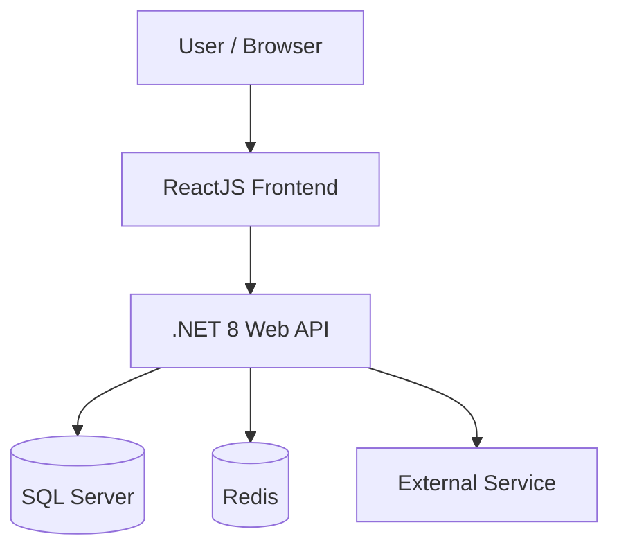
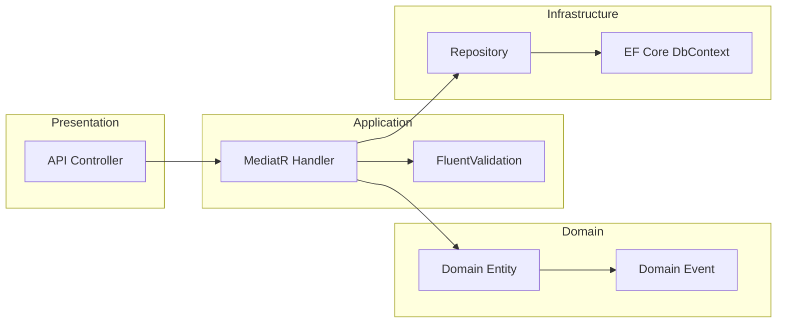
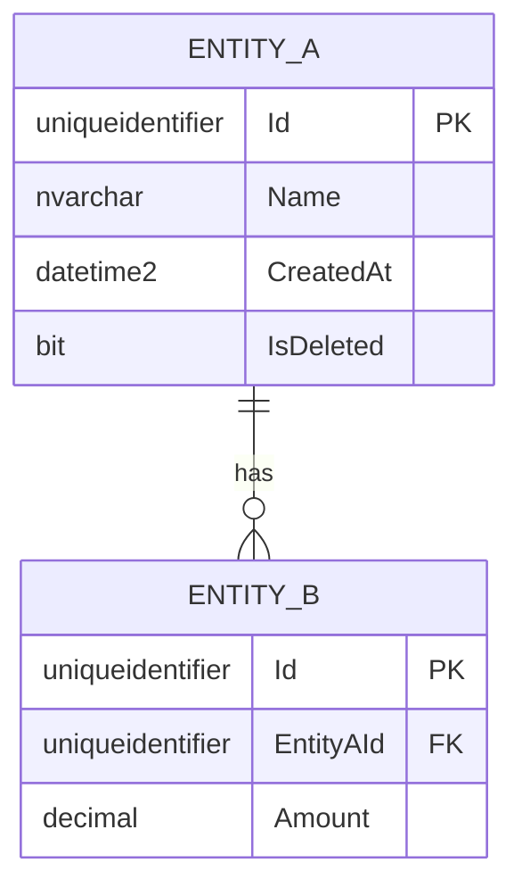

# [Nama Feature] — Technical Design Document

> [!NOTE]
> **Source of Truth**
>
> - Template TDD lengkap: #[[file:docs/06-template-technical-design-document.md]]

---

## 1. Executive Summary & Context

### 1.1 Problem Statement

<!-- Masalah teknis yang akan diselesaikan -->

### 1.2 Proposed Solution

<!-- Ringkasan solusi yang dipilih (1-2 paragraf) -->

### 1.3 Scope

| In Scope | Out of Scope |
|---|---|
| <!-- Item --> | <!-- Item --> |
| <!-- Item --> | <!-- Item --> |

---

## 2. Architecture & High-Level Design

### 2.1 System Context Diagram



<!-- Sesuaikan diagram dengan konteks sistem yang sebenarnya -->

### 2.2 Component Diagram



### 2.3 Key Design Decisions

<!-- Ringkasan keputusan arsitektur penting. Jika kompleks, buat ADR terpisah. -->

| Keputusan | Pilihan | Alasan |
|---|---|---|
| <!-- Decision --> | <!-- Choice --> | <!-- Reasoning --> |

---

## 3. Database Design

### 3.1 Entity Relationship Diagram



### 3.2 Schema DDL

```sql
-- Table: [NamaTable]
CREATE TABLE [dbo].[NamaTable] (
    [Id] UNIQUEIDENTIFIER NOT NULL DEFAULT NEWSEQUENTIALID(),
    -- Tambahkan kolom
    CONSTRAINT [PK_NamaTable] PRIMARY KEY CLUSTERED ([Id])
);

-- Indexes
CREATE NONCLUSTERED INDEX [IX_NamaTable_Column]
ON [dbo].[NamaTable] ([Column]) INCLUDE ([OtherColumn]);
```

### 3.3 Migration Plan

| Step | Script | Backward Compatible | Rollback |
|---|---|---|---|
| 1 | <!-- Migration name --> | Yes/No | <!-- Rollback approach --> |

---

## 4. API Design & Integration Contracts

### 4.1 Endpoints

| Method | Path | Description | Auth |
|---|---|---|---|
| `POST` | `/api/v1/resource` | Create resource | `[Authorize]` |
| `GET` | `/api/v1/resource/{id}` | Get by ID | `[Authorize]` |
| `PUT` | `/api/v1/resource/{id}` | Update resource | `[Authorize]` |
| `DELETE` | `/api/v1/resource/{id}` | Soft delete | `[Authorize(Policy = "Admin")]` |

### 4.2 Request/Response Models

```csharp
// Request
public record CreateResourceRequest(
    string Name,
    decimal Amount,
    Guid CategoryId
);

// Response
public record ResourceResponse(
    Guid Id,
    string Name,
    decimal Amount,
    DateTime CreatedAt
);
```

---

## 5. Security & Compliance

| Aspek | Implementasi |
|---|---|
| Authentication | <!-- JWT / OAuth2 / dll --> |
| Authorization | <!-- Policy-based / Role-based --> |
| Input Validation | <!-- FluentValidation rules --> |
| Data Protection | <!-- Encryption at rest / in transit --> |
| Audit Trail | <!-- Audit logging approach --> |

---

## 6. Performance & Scalability Considerations

| Concern | Strategy | Target |
|---|---|---|
| Response time | <!-- Caching, async, query optimization --> | < 200ms p95 |
| Throughput | <!-- Horizontal scaling, connection pooling --> | <!-- Target RPS --> |
| Data growth | <!-- Archiving, partitioning --> | <!-- Volume estimation --> |

---

## 7. Testing & QA Plan

| Level | Scope | Tools |
|---|---|---|
| Unit Test | Domain + Application layer | xUnit, NSubstitute, FluentAssertions |
| Integration Test | API endpoints + DB | WebApplicationFactory, TestContainers |
| E2E Test | Critical user flows | Playwright |

---

## 8. Rollback & Deployment Strategy

### 8.1 Deployment Steps

1. <!-- Step 1 -->
2. <!-- Step 2 -->
3. <!-- Step 3 -->

### 8.2 Rollback Plan

| Trigger | Action | Estimated Time |
|---|---|---|
| HTTP 5xx > 5% | <!-- Rollback action --> | <!-- Time --> |
| DB migration failure | <!-- Rollback action --> | <!-- Time --> |

### 8.3 Feature Flags

<!-- Jika menggunakan feature flags, dokumentasikan di sini -->

| Flag Name | Default | Description |
|---|---|---|
| <!-- flag --> | `false` | <!-- Description --> |
