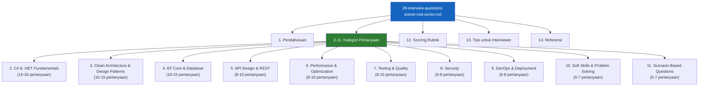
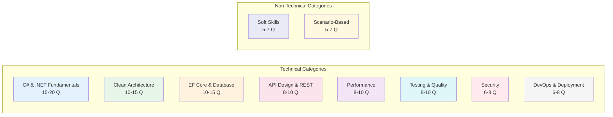
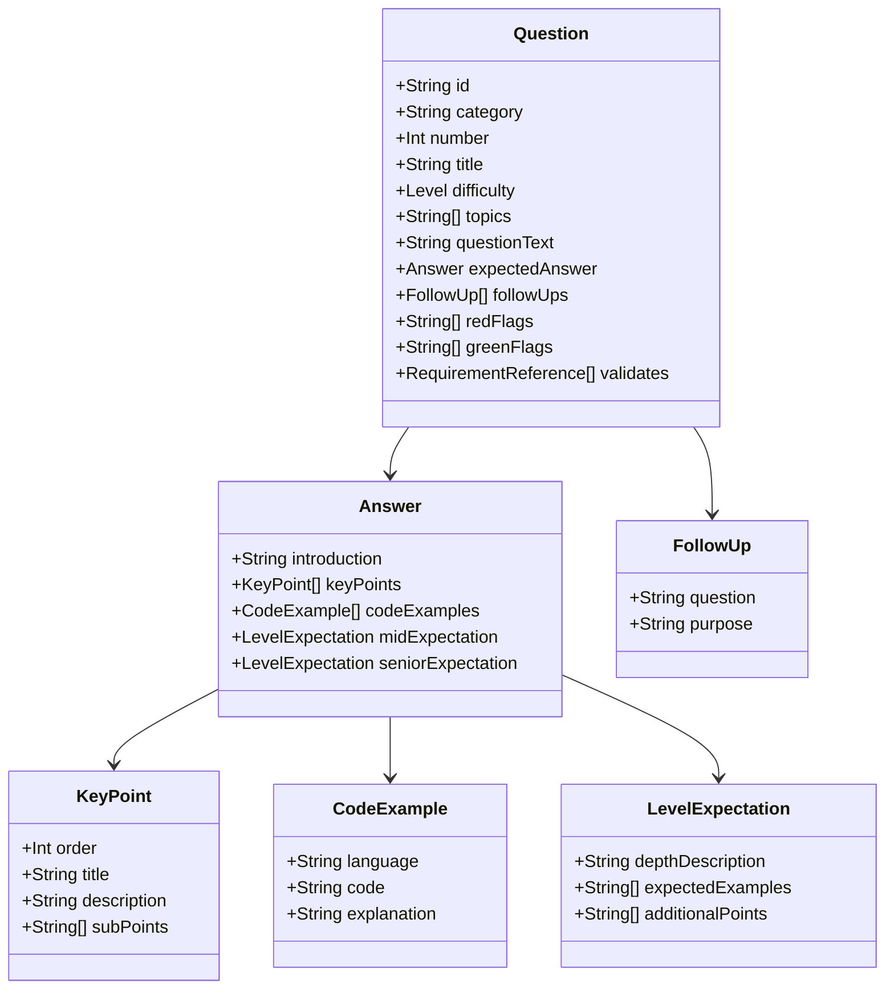
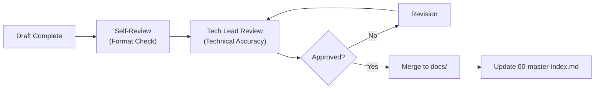

# Interview Questions .NET Mid-Senior — Technical Design Document

> [!NOTE]
> **Source of Truth**
>
> - Requirements: #[[file:.kiro/specs/interview-questions-dotnet-mid-senior/requirements.md]]
> - Template TDD: #[[file:docs/06-template-technical-design-document.md]]
> - Master Index: #[[file:docs/00-master-index.md]]

---

## 1. Executive Summary & Context

### 1.1 Problem Statement

Proses interview untuk kandidat .NET Developer level Mid to Senior saat ini tidak terstandarisasi. Tech Lead dan Hiring Manager sering kali mengandalkan pertanyaan improvisasi yang hasilnya tidak konsisten. Hal ini menyebabkan:

- Assessment yang tidak objektif antar interviewer
- Red flags yang terlewat karena tidak ada panduan systematic
- Kesulitan membedakan ekspektasi jawaban Mid vs Senior
- Waktu interview yang tidak efisien karena distribusi pertanyaan tidak terencana

### 1.2 Proposed Solution

Membuat dokumen SOP `28-interview-questions-dotnet-mid-senior.md` yang berisi **80-100 pertanyaan interview** dengan **jawaban detail** yang mencakup:

- 10 kategori teknis + 2 kategori non-teknis
- Format pertanyaan terstruktur dengan level kesulitan, jawaban, follow-up, dan red flags
- Scoring rubrik yang objektif membedakan Mid vs Senior
- Tips untuk interviewer tentang cara menggali jawaban

### 1.3 Scope

| In Scope | Out of Scope |
|---|---|
| Pertanyaan untuk .NET 8, C# 12, SQL Server 2022, EF Core 8.0 | Pertanyaan untuk .NET Framework versi lama |
| Jawaban detail dengan poin-poin kunci dan contoh kode | Jawaban singkat tanpa penjelasan |
| Pertanyaan teknis + soft skills + scenario-based | Latihan coding live (coding test) |
| Scoring rubrik untuk interview | Template offer letter atau salary negotiation |
| Referensi ke dokumen SOP terkait | Panduan onboarding setelah hire |

---

## 2. Architecture & High-Level Design

### 2.1 Document Structure Overview



### 2.2 Question Format Structure

Setiap pertanyaan mengikuti format terstruktur yang konsisten:

```markdown
### Q[Kategori]-[Nomor]: [Judul Pertanyaan]

**Level:** Mid / Senior / Both
**Topik:** [Topik spesifik dalam kategori]

**Pertanyaan:**
[Pertanyaan lengkap dalam Bahasa Indonesia, istilah teknis dalam English]

**Jawaban yang Diharapkan:**

> [!NOTE]
> Poin-poin kunci yang harus disebutkan kandidat.

1. **Poin Kunci 1**
   - Penjelasan detail...
   - Contoh jika relevan:
   ```csharp
   // Contoh kode
   ```

2. **Poin Kunci 2**
   - Penjelasan detail...

3. **Poin Kunci 3**
   - Penjelasan detail...

**Ekspektasi Mid vs Senior:**

| Aspek | Mid Level | Senior Level |
|---|---|---|
| Kedalaman | [Ekspektasi untuk Mid] | [Ekspektasi untuk Senior] |
| Contoh | [Contoh konkret yang diharapkan dari Mid] | [Contoh konkret yang diharapkan dari Senior] |

**Follow-up Questions:**
- "Bagaimana jika [scenario]?"
- "Apa trade-off dari pendekatan tersebut?"

**Red Flags:**
- ❌ Tidak bisa menjelaskan [konsep dasar]
- ❌ Memberikan jawaban yang [indikator salah]

**Green Flags:**
- ✅ Mampu menjelaskan [indikator bagus]
- ✅ Memberikan contoh dari [pengalaman nyata]
```

### 2.3 Key Design Decisions

| Keputusan | Pilihan | Alasan |
|---|---|---|
| Format pertanyaan | Terstruktur dengan template tetap | Memudahkan pembacaan dan konsistensi antar pertanyaan |
| Jumlah pertanyaan | 80-100 pertanyaan | Cukup untuk interview 1-2 jam dengan variasi topik |
| Bahasa jawaban | Bahasa Indonesia dengan istilah teknis English | Konsisten dengan konvensi penulisan SOP |
| Level kesulitan | Mid / Senior / Both | Memudahkan interviewer memilih pertanyaan sesuai target level |
| Jawaban detail | Poin-poin kunci + contoh kode | Memberikan panduan objektif untuk assessment |
| Follow-up questions | Disertakan setiap pertanyaan | Membantu interviewer menggali lebih dalam |
| Red/Green flags | Disertakan setiap pertanyaan | Mempermudah identifikasi kandidat bagus/buruk |

---

## 3. Components and Interfaces

### 3.1 Section Components

Dokumen terdiri dari beberapa section utama dengan tanggung jawab yang jelas:

| Section | Fungsi | Konten Utama |
|---|---|---|
| Pendahuluan | Orientasi | Tujuan, target kandidat, cara penggunaan |
| Kategori Pertanyaan | Assessment | 80-100 pertanyaan terstruktur |
| Scoring Rubrik | Penilaian | Kriteria objektif Mid vs Senior |
| Tips Interviewer | Panduan | Cara bertanya, follow-up, red flags |
| Referensi | Sumber | Link ke dokumentasi dan SOP terkait |

### 3.2 Question Categories Detail



### 3.3 Distribution per Level

| Kategori | Total | Mid Focus | Senior Focus | Both |
|---|---|---|---|---|
| C# & .NET Fundamentals | 18 | 8 | 6 | 4 |
| Clean Architecture & Design Patterns | 12 | 4 | 5 | 3 |
| EF Core & Database | 12 | 5 | 4 | 3 |
| API Design & REST | 9 | 4 | 3 | 2 |
| Performance & Optimization | 9 | 3 | 4 | 2 |
| Testing & Quality | 9 | 4 | 3 | 2 |
| Security | 7 | 3 | 3 | 1 |
| DevOps & Deployment | 7 | 3 | 3 | 1 |
| Soft Skills & Problem Solving | 6 | 2 | 2 | 2 |
| Scenario-Based Questions | 6 | 2 | 2 | 2 |
| **TOTAL** | **95** | **38** | **35** | **22** |

---

## 4. Data Models

### 4.1 Question Entity Model

Setiap pertanyaan memiliki struktur data yang konsisten:



### 4.2 Category Enumeration

```markdown
| Kode | Kategori | Prefix Pertanyaan | Contoh ID |
|---|---|---|---|
| FUND | C# & .NET Fundamentals | Q-FUND- | Q-FUND-001 |
| ARCH | Clean Architecture & Design Patterns | Q-ARCH- | Q-ARCH-001 |
| DATA | EF Core & Database | Q-DATA- | Q-DATA-001 |
| API | API Design & REST | Q-API- | Q-API-001 |
| PERF | Performance & Optimization | Q-PERF- | Q-PERF-001 |
| TEST | Testing & Quality | Q-TEST- | Q-TEST-001 |
| SEC | Security | Q-SEC- | Q-SEC-001 |
| DEVOPS | DevOps & Deployment | Q-DEVOPS- | Q-DEVOPS-001 |
| SOFT | Soft Skills & Problem Solving | Q-SOFT- | Q-SOFT-001 |
| SCEN | Scenario-Based Questions | Q-SCEN- | Q-SCEN-001 |
```

### 4.3 Level Definition Model

```markdown
| Level | Kode | Karakteristik | Ekspektasi Interview |
|---|---|---|---|
| Mid | `mid` | 2-4 tahun pengalaman, mandiri dengan guidance minimal | Memahami konsep, bisa menjelaskan dengan contoh sederhana |
| Senior | `senior` | 5+ tahun pengalaman, bisa lead dan mentoring | Memahami trade-off, bisa memberikan contoh kompleks dari production |
| Both | `both` | Relevan untuk semua level | Jawaban berbeda dalam kedalaman dan kompleksitas |
```

---

## 5. Correctness Properties

> [!NOTE]
> Fitur ini adalah dokumen content (Markdown), bukan aplikasi dengan logic yang bisa di-test dengan property-based testing. PBT tidak applicable untuk fitur ini.

**Assessment**: Property-Based Testing **TIDAK** appropriate untuk fitur ini karena:

1. **Content-only nature** — Dokumen ini adalah kumpulan pertanyaan dan jawaban dalam format Markdown, bukan fungsi dengan input/output
2. **No executable code** — Tidak ada logic yang perlu di-verifikasi dengan generated inputs
3. **Manual review required** — Kualitas pertanyaan dan jawaban memerlukan review manusia (subject matter expert)
4. **Subjective correctness** — "Keputusan" jawaban yang benar adalah domain knowledge, bukan invariant yang bisa di-test

**Alternative Testing Strategy:**

| Aspek | Metode Verifikasi |
|---|---|
| Kelengkapan pertanyaan | Checklist manual terhadap requirements |
| Konsistensi format | Template matching (lint/fmt check) |
| Akurasi teknis | Review oleh Tech Lead / Senior Developer |
| Konsistensi bahasa | Proofreading sesuai konvensi penulisan SOP |
| Referensi valid | Link checking untuk semua URL referensi |

---

## 6. Error Handling

Tidak applicable — ini adalah dokumen konten, bukan aplikasi.

---

## 7. Testing Strategy

### 7.1 Verification Approach

Karena ini adalah dokumen content, "testing" dilakukan melalui review process:

| Level | Scope | Reviewer |
|---|---|---|
| Format Check | Struktur heading, code blocks, alerts | Author self-review |
| Technical Accuracy | Kebenaran jawaban, relevansi pertanyaan | Tech Lead / Senior Developer |
| Completeness | Kelengkapan kategori sesuai requirements | Engineering Manager |
| Consistency | Konsistensi format, bahasa, style | Peer Review |

### 7.2 Quality Checklist untuk Setiap Pertanyaan

```markdown
- [ ] Pertanyaan menggunakan Bahasa Indonesia (istilah teknis English)
- [ ] Level kesulitan terdefinisi (Mid/Senior/Both)
- [ ] Topik terdefinisi dengan jelas
- [ ] Jawaban memiliki minimal 3 poin kunci
- [ ] Contoh kode (jika ada) menggunakan fenced code block dengan language tag
- [ ] Ekspektasi Mid vs Senior terdefinisi
- [ ] Follow-up questions minimal 2 pertanyaan
- [ ] Red flags minimal 2 item
- [ ] Green flags minimal 2 item
- [ ] Format konsisten dengan template
```

### 7.3 Review Process



---

## 8. Implementation Considerations

### 8.1 Writing Guidelines

Mengikuti konvensi penulisan SOP dari `docs/00-master-index.md`:

| Aspek | Aturan |
|---|---|
| Bahasa prosa | Bahasa Indonesia |
| Istilah teknis | English (tidak diterjemahkan) |
| Heading | H1 untuk judul dokumen, H2 untuk section, H3 untuk sub-section |
| Code blocks | Fenced dengan language tag (`csharp`, `sql`, `bash`) |
| Alerts | GitHub-style, maksimal 3-4 per dokumen |
| Line length | Maksimal 120 karakter |

### 8.2 Example Questions (Template Illustration)

Berikut adalah contoh konkret pertanyaan per kategori untuk mengilustrasikan format:

---

#### **Contoh 1: C# & .NET Fundamentals**

### Q-FUND-005: Async/Await dan Deadlock

**Level:** Both
**Topik:** Async programming, synchronization context, deadlock prevention

**Pertanyaan:**
Jelaskan bagaimana deadlock bisa terjadi saat menggunakan `async/await` di aplikasi .NET, dan bagaimana cara mencegahnya?

**Jawaban yang Diharapkan:**

> [!NOTE]
> Kandidat harus mampu menjelaskan synchronization context dan penyebab deadlock.

1. **Penyebab Deadlock**
   - Deadlock terjadi ketika method `async` di-call secara synchronous dengan `.Result` atau `.Wait()`
   - Synchronization context mencoba kembali ke thread yang sama yang sedang di-block
   - Thread tidak bisa melanjutkan karena menunggu task selesai, task tidak bisa selesai karena menunggu thread

   ```csharp
   // KODE BERBAHAYA - Bisa deadlock
   public ActionResult GetCustomer(int id)
   {
       var customer = _customerService.GetCustomerAsync(id).Result; // DEADLOCK RISK
       return Ok(customer);
   }
   ```

2. **Cara Mencegah Deadlock**
   - Gunakan `async/await` sepanjang call stack ("async all the way")
   - Konfigurasi `ConfigureAwait(false)` di library code
   - Jangan pernah pakai `.Result` atau `.Wait()` di code yang memiliki synchronization context

   ```csharp
   // SOLUSI 1: Async all the way
   public async Task<ActionResult> GetCustomer(int id)
   {
       var customer = await _customerService.GetCustomerAsync(id);
       return Ok(customer);
   }
   
   // SOLUSI 2: ConfigureAwait(false) di library
   public async Task<Customer> GetCustomerAsync(int id)
   {
       return await _dbContext.Customers
           .FirstOrDefaultAsync(c => c.Id == id)
           .ConfigureAwait(false);
   }
   ```

3. **Synchronization Context**
   - ASP.NET (legacy), WPF, WinForms memiliki synchronization context
   - ASP.NET Core tidak memiliki synchronization context (aman dari deadlock jenis ini)
   - Tetapi best practice tetap "async all the way" untuk konsistensi

**Ekspektasi Mid vs Senior:**

| Aspek | Mid Level | Senior Level |
|---|---|---|
| Kedalaman | Menjelaskan deadlock dasar dan solusi `ConfigureAwait(false)` | Menjelaskan synchronization context secara detail, perbedaan ASP.NET vs ASP.NET Core |
| Contoh | Memberikan contoh kode deadlock sederhana | Memberikan contoh dari production issue yang pernah di-debug, menyarankan analyzer/tools |

**Follow-up Questions:**
- "Kapan sebaiknya tidak menggunakan `ConfigureAwait(false)`?"
- "Bagaimana cara mendeteksi potential deadlock di existing codebase?"

**Red Flags:**
- ❌ Tidak bisa menjelaskan penyebab deadlock
- ❌ Tidak mengetahui `ConfigureAwait(false)`
- ❌ Menganggap async/await selalu aman tanpa memahami konteks

**Green Flags:**
- ✅ Mampu menjelaskan synchronization context
- ✅ Menyebutkan analyzer seperti `Microsoft.CodeAnalysis.FxCopAnalyzers`
- ✅ Memberikan contoh dari pengalaman production debugging

---

#### **Contoh 2: Clean Architecture & Design Patterns**

### Q-ARCH-003: Dependency Injection dan Captive Dependency

**Level:** Senior
**Topik:** Dependency Injection, service lifetime, captive dependency

**Pertanyaan:**
Apa itu captive dependency dalam Dependency Injection? Mengapa ini menjadi masalah dan bagaimana cara mendeteksinya?

**Jawaban yang Diharapkan:**

> [!NOTE]
> Senior developer harus memahami implikasi service lifetime terhadap aplikasi.

1. **Definisi Captive Dependency**
   - Terjadi ketika service dengan lifetime lebih panjang depend pada service dengan lifetime lebih pendek
   - Contoh: Singleton depend pada Scoped service
   - Scoped service akan "tertawan" (captive) dalam Singleton, tidak pernah di-dispose

2. **Mengapa Masalah?**
   - Scoped service yang ditawan tidak akan di-dispose sampai Singleton di-dispose (biasanya application shutdown)
   - Resource leak: database connection, file handle, tidak dilepas
   - State corruption: Scoped service yang seharusnya fresh per request, malah di-share antar request

   ```csharp
   // MASALAH: Captive Dependency
   services.AddSingleton<IReportGenerator, ReportGenerator>();
   services.AddScoped<IDatabaseContext, DatabaseContext>();
   
   // ReportGenerator (Singleton) inject DatabaseContext (Scoped)
   // DatabaseContext akan tertawan seumur hidup aplikasi!
   public class ReportGenerator : IReportGenerator
   {
       private readonly IDatabaseContext _db; // CAPTIVE DEPENDENCY!
       
       public ReportGenerator(IDatabaseContext db)
       {
           _db = db;
       }
   }
   ```

3. **Solusi**
   - Re-design: Sesuaikan lifetime atau refactor dependency
   - Factory pattern: Inject `Func<IDatabaseContext>` atau `IServiceScopeFactory`

   ```csharp
   // SOLUSI 1: Factory Pattern
   public class ReportGenerator : IReportGenerator
   {
       private readonly IServiceScopeFactory _scopeFactory;
       
       public ReportGenerator(IServiceScopeFactory scopeFactory)
       {
           _scopeFactory = scopeFactory;
       }
       
       public async Task<Report> GenerateAsync()
       {
           using var scope = _scopeFactory.CreateScope();
           var db = scope.ServiceProvider.GetRequiredService<IDatabaseContext>();
           // db akan di-dispose setelah using block
           return await GenerateReportAsync(db);
       }
   }
   
   // Registration
   services.AddSingleton<IReportGenerator, ReportGenerator>();
   services.AddScoped<IDatabaseContext, DatabaseContext>();
   ```

**Ekspektasi Senior:**

| Aspek | Ekspektasi |
|---|---|
| Kedalaman | Memahami lifetime hierarchy dan implikasinya ke resource management |
| Contoh | Memberikan contoh production issue yang pernah dihadapi |
| Tools | Menyebutkan runtime validation atau static analysis untuk detect captive dependency |

**Follow-up Questions:**
- "Bagaimana cara memvalidasi DI configuration saat startup?"
- "Tools apa yang bisa membantu detect captive dependency secara otomatis?"

**Red Flags:**
- ❌ Tidak memahami perbedaan Singleton, Scoped, Transient
- ❌ Tidak bisa menjelaskan mengapa captive dependency berbahaya

**Green Flags:**
- ✅ Menyebutkan `ValidateScopes` di `ServiceProviderOptions`
- ✅ Memberikan contoh dari production debugging
- ✅ Menyarankan tools seperti `Scrutor` atau runtime validation

---

#### **Contoh 3: EF Core & Database**

### Q-DATA-008: N+1 Query Problem

**Level:** Both
**Topik:** Query optimization, EF Core includes, performance

**Pertanyaan:**
Jelaskan apa itu N+1 query problem di Entity Framework Core. Bagaimana cara mendeteksinya dan apa solusinya?

**Jawaban yang Diharapkan:**

> [!NOTE]
> N+1 adalah salah satu masalah paling umum di ORM. Kandidat wajib memahami ini.

1. **Penjelasan N+1 Problem**
   - 1 query untuk mengambil data parent (N records)
   - N query tambahan untuk mengambil data related per record
   - Total N+1 query, yang seharusnya bisa 1 query dengan JOIN

   ```csharp
   // N+1 PROBLEM
   var orders = await _dbContext.Orders.ToListAsync(); // 1 query
   
   foreach (var order in orders) // N iterations
   {
       var items = await _dbContext.OrderItems
           .Where(i => i.OrderId == order.Id)
           .ToListAsync(); // N queries!
   }
   // Total: 1 + N queries
   ```

2. **Solusi dengan Eager Loading**
   - Gunakan `.Include()` untuk eager load related data
   - Semua data diambil dalam satu query dengan JOIN

   ```csharp
   // SOLUSI: Eager Loading
   var orders = await _dbContext.Orders
       .Include(o => o.OrderItems)
       .ThenInclude(i => i.Product)
       .ToListAsync(); // 1 query dengan JOIN
   
   // Total: 1 query
   ```

3. **Cara Mendeteksi**
   - Logging SQL query ke console/file dengan `EnableSensitiveDataLogging()`
   - Gunakan tools: SQL Server Profiler, Application Insights, MiniProfiler
   - Review code yang loop over navigation properties

   ```csharp
   // Konfigurasi logging untuk development
   builder.Services.AddDbContext<AppDbContext>(options =>
       options.UseSqlServer(connectionString)
              .EnableSensitiveDataLogging()
              .LogTo(Console.WriteLine, LogLevel.Information));
   ```

**Ekspektasi Mid vs Senior:**

| Aspek | Mid Level | Senior Level |
|---|---|---|
| Kedalaman | Menjelaskan N+1 dan solusi `.Include()` | Menjelaskan trade-off eager vs lazy vs explicit loading, cartesian explosion |
| Tools | Menyebutkan logging atau profiler | Menyebutkan MiniProfiler, Application Insights, SQL profiling |
| Contoh | Contoh sederhana | Memberikan contoh production optimization, menyarankan benchmark |

**Follow-up Questions:**
- "Apa kekurangan dari eager loading jika ada terlalu banyak Includes?"
- "Bagaimana cara menangani N+1 di scenario lazy loading?"

**Red Flags:**
- ❌ Tidak mengetahui N+1 problem
- ❌ Tidak bisa menjelaskan solusi `.Include()`
- ❌ Menganggap lazy loading selalu solusi (padahal bisa memperparah N+1)

**Green Flags:**
- ✅ Menyebutkan cartesian explosion dengan multiple Includes
- ✅ Menjelaskan perbedaan eager, lazy, dan explicit loading
- ✅ Memberikan contoh tools untuk profiling

---

#### **Contoh 4: Security**

### Q-SEC-002: SQL Injection Prevention

**Level:** Mid
**Topik:** SQL injection, parameterized query, secure coding

**Pertanyaan:**
Bagaimana cara mencegah SQL injection di aplikasi .NET? Jelaskan dengan contoh kode yang benar dan yang salah.

**Jawaban yang Diharapkan:**

> [!IMPORTANT]
> SQL injection adalah vulnerability critical. Kandidat wajib memahami cara mencegahnya.

1. **Prinsip Utama: Parameterized Query**
   - NEVER concatenate user input ke SQL string
   - SELALU gunakan parameter untuk user input
   - EF Core otomatis parameterize LINQ queries

2. **Contoh Kode Salah (Vulnerable)**

   ```csharp
   // VULNERABLE - SQL Injection
   public async Task<User> GetUserByName(string name)
   {
       var sql = $"SELECT * FROM Users WHERE Name = '{name}'";
       return await _dbContext.Users
           .FromSqlRaw(sql)
           .FirstOrDefaultAsync();
   }
   
   // Input: "admin' OR '1'='1"
   // Result: SELECT * FROM Users WHERE Name = 'admin' OR '1'='1'
   // Semua user akan di-return!
   ```

3. **Contoh Kode Benar (Secure)**

   ```csharp
   // SECURE - Parameterized Query dengan EF Core LINQ
   public async Task<User> GetUserByName(string name)
   {
       return await _dbContext.Users
           .Where(u => u.Name == name) // Otomatis parameterized
           .FirstOrDefaultAsync();
   }
   
   // SECURE - Parameterized Query dengan FromSqlRaw
   public async Task<User> GetUserByName(string name)
   {
       return await _dbContext.Users
           .FromSqlRaw("SELECT * FROM Users WHERE Name = {0}", name)
           .FirstOrDefaultAsync();
   }
   
   // SECURE - Menggunakan SqlParameter (lebih explicit)
   public async Task<User> GetUserByName(string name)
   {
       var param = new SqlParameter("@name", name);
       return await _dbContext.Users
           .FromSqlRaw("SELECT * FROM Users WHERE Name = @name", param)
           .FirstOrDefaultAsync();
   }
   ```

**Follow-up Questions:**
- "Apakah LINQ query di EF Core aman dari SQL injection? Mengapa?"
- "Bagaimana dengan stored procedure? Apakah aman?"

**Red Flags:**
- ❌ Tidak mengetahui SQL injection
- ❌ Masih menganggap string concatenation acceptable dengan "proper validation"
- ❌ Tidak bisa memberikan contoh parameterized query

**Green Flags:**
- ✅ Menjelaskan bahwa EF Core LINQ otomatis parameterize
- ✅ Menyebutkan OWASP Top 10
- ✅ Memberikan contoh input malicious yang di-block

---

### 8.3 Scoring Rubrik Design

Scoring rubrik membedakan ekspektasi Mid vs Senior dengan format:

```markdown
## 12. Scoring Rubrik

### 12.1 Overall Assessment Scale

| Score | Level | Kriteria Umum |
|---|---|---|
| 1 | Does Not Meet | Tidak bisa menjawab pertanyaan dasar, banyak red flags |
| 2 | Partially Meets | Bisa menjawab dengan bantuan, pemahaman surface-level |
| 3 | Meets (Mid) | Memenuhi ekspektasi Mid level, bisa bekerja mandiri |
| 4 | Exceeds (Senior) | Memenuhi ekspektasi Senior level, bisa lead dan mentor |
| 5 | Exceptional | Di atas ekspektasi Senior, thought leader, innovative |

### 12.2 Category-Specific Rubrik

Untuk setiap kategori, ada breakdown detail:

| Kategori | Does Not Meet (1) | Meets Mid (3) | Meets Senior (4) |
|---|---|---|---|
| C# & .NET Fundamentals | Tidak pahami async, LINQ dasar | Pahami async/await, bisa debug deadlock | Pahami memory model, GC, advanced optimization |
| Clean Architecture | Tidak pahami DI, layering | Bisa implement Clean Architecture | Bisa buat ADR, trade-off analysis |
| EF Core & Database | Tidak pahami N+1, tracking | Bisa optimize query, pahami migrations | Bisa design schema, performance tuning |
| ... | ... | ... | ... |

### 12.3 Decision Matrix

| Scenario | Rekomendasi |
|---|---|
| Score rata-rata < 2.5 | Reject |
| Score rata-rata 2.5 - 3.0 | Mid Level (dengan mentoring) |
| Score rata-rata 3.0 - 3.5 | Strong Mid / Weak Senior |
| Score rata-rata > 3.5 | Senior Level |
| Score > 4.0 (dengan contoh exceptional) | Senior / Lead candidate |
```

---

## 9. References

### 9.1 SOP Internal References

| Dokumen | Relevansi |
|---|---|
| `00-master-index.md` | Konvensi penulisan, struktur dokumen |
| `02-kiro-setup-and-configuration.md` | Tech stack, Kiro rules |
| `08-template-code-review-checklist.md` | Topik untuk pertanyaan code review |
| `12-template-clean-architecture-dotnet8.md` | Topik untuk pertanyaan arsitektur |
| `22-unit-testing-strategy.md` | Topik untuk pertanyaan testing |
| `09-template-sql-review-checklist.md` | Topik untuk pertanyaan database |

### 9.2 External References

| Sumber | URL |
|---|---|
| .NET 8 Documentation | https://learn.microsoft.com/en-us/dotnet/core/whats-new/dotnet-8 |
| C# 12 Features | https://learn.microsoft.com/en-us/dotnet/csharp/whats-new/csharp-12 |
| EF Core 8 Documentation | https://learn.microsoft.com/en-us/ef/core/what-is-new/ef-core-8 |
| Clean Architecture by Robert Martin | Book reference |
| OWASP Top 10 | https://owasp.org/www-project-top-ten/ |
| Microsoft Architecture Guides | https://learn.microsoft.com/en-us/azure/architecture/ |

---

## 10. Implementation Notes

### 10.1 Task Breakdown Preview

Setelah design ini di-approve, `tasks.md` akan berisi breakdown seperti:

```markdown
- [ ] 1. Tulis section Pendahuluan (tujuan, target kandidat, cara penggunaan)
- [ ] 2. Tulis 18 pertanyaan C# & .NET Fundamentals dengan jawaban detail
- [ ] 3. Tulis 12 pertanyaan Clean Architecture & Design Patterns dengan jawaban detail
- [ ] 4. Tulis 12 pertanyaan EF Core & Database dengan jawaban detail
- [ ] 5. Tulis 9 pertanyaan API Design & REST dengan jawaban detail
- [ ] 6. Tulis 9 pertanyaan Performance & Optimization dengan jawaban detail
- [ ] 7. Tulis 9 pertanyaan Testing & Quality dengan jawaban detail
- [ ] 8. Tulis 7 pertanyaan Security dengan jawaban detail
- [ ] 9. Tulis 7 pertanyaan DevOps & Deployment dengan jawaban detail
- [ ] 10. Tulis 6 pertanyaan Soft Skills & Problem Solving dengan jawaban detail
- [ ] 11. Tulis 6 pertanyaan Scenario-Based dengan jawaban detail
- [ ] 12. Tulis Scoring Rubrik dengan kriteria objektif
- [ ] 13. Tulis Tips untuk Interviewer
- [ ] 14. Tulis Referensi dengan link valid
- [ ] 15. Update 00-master-index.md dengan entry dokumen baru
```

### 10.2 Estimasi Waktu

| Aktivitas | Estimasi |
|---|---|
| Tulis Pendahuluan | 30 menit |
| Tulis 95 pertanyaan + jawaban | 16-20 jam |
| Tulis Scoring Rubrik | 1 jam |
| Tulis Tips Interviewer | 1 jam |
| Tulis Referensi | 30 menit |
| Review dan revisi | 2-3 jam |
| **Total** | **20-25 jam** |

---

*Dokumen Design ini adalah blueprint untuk implementasi `28-interview-questions-dotnet-mid-senior.md`.*
