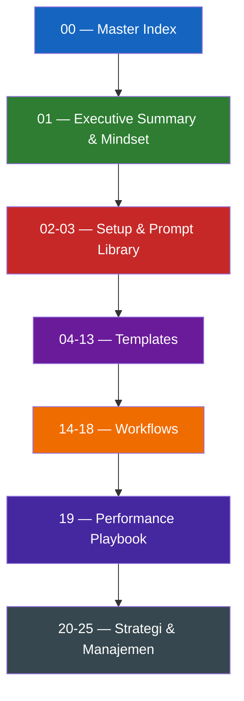

# Struktur Repo & Konvensi Penamaan

> [!NOTE]
> **Source of Truth**
>
> - Daftar lengkap dokumen & nomor: #[[file:docs/00-master-index.md]] (section "Table of Contents")
> - Konvensi penulisan: #[[file:docs/00-master-index.md]] (section "Konvensi Penulisan")

## Pola Penamaan File

> [!IMPORTANT]
> Setiap dokumen SOP di root **wajib** mengikuti format: `NN-kebab-case-judul.md`

| Komponen | Aturan | Contoh |
|---|---|---|
| `NN` | Dua digit, 0-padded, urut menaik | `00`, `07`, `25` |
| Separator | Strip tunggal | `-` |
| Judul | kebab-case (lowercase, hubung pakai strip) | `template-prd-user-story` |
| Ekstensi | `.md` lowercase | `.md` |

Contoh valid: `04-template-prd-user-story.md`, `19-playbook-performance-tuning-sql.md`

> [!WARNING]
> Jangan pakai underscore (`_`), CamelCase, atau spasi. Jangan duplikat nomor — setiap nomor unik.

## Kategori berdasarkan Nomor



| Range | Kategori | Saat Menambah Dokumen Baru |
|---|---|---|
| `00` | Indeks | Tidak ditambah, hanya satu |
| `01` | Mindset & strategi | Hanya jika ada paradigma baru |
| `02-03` | Setup & prompt | Tambah jika ada tool baru |
| `04-13` | Template engineering | Lanjutkan dari nomor terakhir |
| `14-18` | Workflow | Lanjutkan dari nomor terakhir |
| `19` | Playbook teknis | Lanjutkan dari nomor terakhir |
| `20-25` | Strategi manajemen | Lanjutkan dari nomor terakhir |

## Aturan Tambah Dokumen Baru

Saat membuat dokumen SOP baru (misal `26-template-security-review.md`):

1. Pakai nomor berikutnya yang available (lihat `00-master-index.md` untuk yang terbaru)
2. Update tabel "Table of Contents" di `00-master-index.md`
3. Update changelog di `00-master-index.md` (section "Changelog")
4. Tambah ke "Index A-Z" di `00-master-index.md` jika topik baru
5. Buat PR dengan reviewer minimal 1 Tech Lead

## Struktur Folder Repo

```
kiro-engineering-sop/
├── 00-master-index.md             # Wajib di-update tiap nambah dokumen
├── 01-25 *.md                     # Dokumen SOP
├── README.md                      # Public-facing repo description
├── .gitignore
├── .vscode/                       # Lokal saja, di-ignore
└── .kiro/                         # Konteks untuk Kiro, mereferensikan root
    ├── steering/                  # Aturan otomatis ke setiap chat
    ├── specs/                     # Spec untuk fitur SOP yang sedang dikerjakan
    ├── prompts/                   # Library prompt yang dapat dipanggil
    └── hooks/                     # Otomasi event-driven (opsional)
```

## Yang Tidak Boleh

> [!CAUTION]
> - Tidak ada file `.md` di root tanpa prefix nomor (kecuali `README.md`)
> - Tidak boleh skip nomor (jangan langsung loncat dari `25` ke `30`)
> - Tidak boleh ubah nomor dokumen yang sudah ada — itu breaking change untuk link eksternal
> - Jika dokumen lama tidak relevan, mark sebagai `Deprecated` di header tetapi pertahankan filenya
