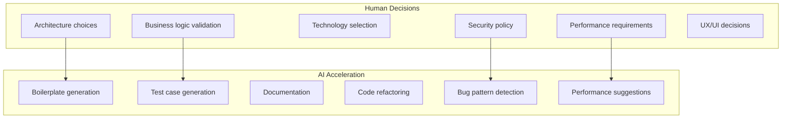

# Prinsip Kerja & Anti-Patterns

> [!NOTE]
> **Source of Truth**
>
> - 10 prinsip kerja dengan Kiro: #[[file:docs/01-executive-summary-and-mindset.md]] (section "10 Prinsip Kerja dengan Kiro")
> - Anti-patterns: #[[file:docs/01-executive-summary-and-mindset.md]] (section "Anti-Patterns yang Harus Dihindari")

## 10 Prinsip Kerja dengan Kiro

| # | Prinsip | Esensi |
|---|---------|--------|
| 1 | Spec First, Code Second | Selalu mulai dengan spesifikasi yang jelas sebelum meminta AI menulis code |
| 2 | Trust but Verify | Percaya output AI, tapi verifikasi — terutama business logic, security, data access |
| 3 | Context is King | Semakin banyak context yang diberikan ke Kiro, semakin baik outputnya |
| 4 | Iterate, Don't Regenerate | Perbaiki output AI secara iteratif, jangan regenerate dari awal |
| 5 | Encode Knowledge, Don't Repeat | Instruksi yang sering diulang harus di-encode ke steering file |
| 6 | Small Tasks, Better Results | Pecah task besar menjadi task-task kecil yang focused |
| 7 | Review AI Code Like Human Code | Code dari AI harus melalui review yang sama dengan code manual |
| 8 | Learn from AI Output | Gunakan output AI sebagai learning tool — pelajari patterns baru |
| 9 | AI for Acceleration, Human for Direction | AI mempercepat execution, arah tetap di tangan manusia |
| 10 | Continuous Improvement of Prompts | Track, evaluate, dan improve prompt secara berkelanjutan |

## Pembagian Tanggung Jawab

## Anti-Patterns yang Harus Dihindari

| # | Anti-Pattern | Gejala | Pencegahan |
|---|---|---|---|
| 1 | Blind Copy-Paste | Bugs di production yang seharusnya tertangkap di review | Selalu review output, jalankan tests, verify logic |
| 2 | Vague Prompting | Output generic, tidak sesuai project standards | Gunakan prompt library, berikan context spesifik |
| 3 | Over-Reliance on AI | Developer tidak bisa explain code yang mereka "tulis" | Gunakan AI sebagai accelerator, bukan pengganti pemahaman |
| 4 | Ignoring AI Warnings | Security vulnerabilities, performance issues | Treat AI warnings serius, investigate setiap warning |
| 5 | One-Shot Prompting for Complex Features | Output incomplete, inconsistent, error-prone | Pecah jadi tasks kecil (Prinsip 6), iterate |
| 6 | No Steering Files | Setiap developer dapat output AI yang berbeda style | Setup `.kiro/` folder dengan steering files |
| 7 | AI-Generated Tests Without Verification | Tests pass tapi tidak actually test business logic | Review setiap test — cek assertions meaningful |
| 8 | Prompt Hoarding | Knowledge silos, inconsistent quality antar developer | Share prompts ke library bersama |
| 9 | Skipping the Spec | Feature tidak sesuai requirement, banyak rework | Ikuti spec-driven workflow: spec → design → tasks → code |
| 10 | Not Updating Steering Files | AI suggestions tidak sesuai current architecture | Review steering files setiap sprint |

## Area Wajib Verifikasi Manual

> [!WARNING]
> Area berikut TIDAK BOLEH langsung di-accept dari output AI tanpa review manual yang menyeluruh.

| Area | Risk Level | Alasan |
|---|---|---|
| Authentication / Authorization | Critical | Security breach |
| Financial calculations | Critical | Money loss |
| Data migration scripts | Critical | Data loss |
| SQL queries (production) | High | Performance impact |
| API contracts / DTOs | High | Breaking changes |
| Error messages | Medium | UX / information leak |
| Logging | Medium | Compliance / debugging |

## Penerapan di Repo SOP Ini

> [!TIP]
> Dalam konteks repo SOP (Markdown-only), prinsip-prinsip ini tetap berlaku:
>
> - **Spec First**: Tentukan scope dan outline sebelum menulis dokumen baru
> - **Trust but Verify**: Cross-check code samples di SOP terhadap best practices terkini
> - **Context is King**: Referensikan dokumen lain yang relevan menggunakan `#[[file:...]]`
> - **Small Tasks**: Pecah dokumen besar menjadi beberapa section/file jika melebihi 200 baris per section
