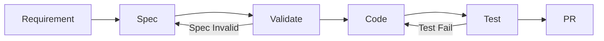
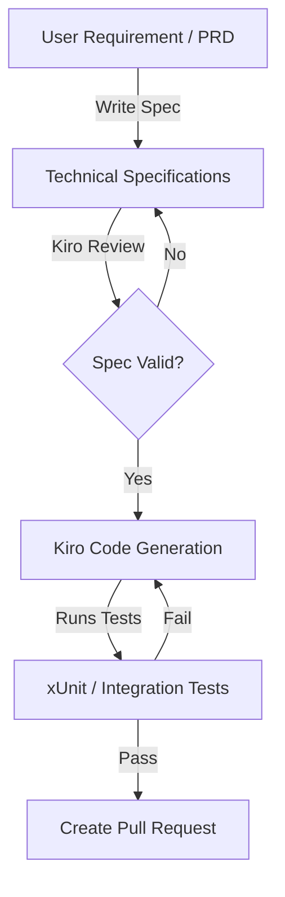

# Spec-Driven Development Workflow

> [!NOTE]
> **Source of Truth**
>
> - Workflow SDD: #[[file:docs/14-spec-driven-development.md]]
> - Template PRD: #[[file:docs/04-template-prd-user-story.md]]
> - Template SRS: #[[file:docs/05-template-srs.md]]
> - Template TDD: #[[file:docs/06-template-technical-design-document.md]]
> - Template ADR: #[[file:docs/07-template-adr.md]]

## Alur Spec-Driven Development



## Struktur Folder Spec

Setiap feature memiliki folder di `.kiro/specs/` dengan struktur:

```text
.kiro/specs/<feature-name>/
├── requirements.md    # What & Why — acceptance criteria
├── design.md          # How — technical design decisions
└── tasks.md           # Task breakdown untuk eksekusi
```

## Mapping File Spec ke Template

| File Spec | Template Source | Konten Utama |
|---|---|---|
| `requirements.md` | #[[file:docs/04-template-prd-user-story.md]], #[[file:docs/05-template-srs.md]] | User stories, acceptance criteria, constraints |
| `design.md` | #[[file:docs/06-template-technical-design-document.md]], #[[file:docs/07-template-adr.md]] | Architecture decisions, API contracts, DB schema |
| `tasks.md` | — (generated from design) | Checklist tasks yang actionable |

## Workflow Langkah demi Langkah

1. **Buat folder spec** — `.kiro/specs/<feature-name>/`
2. **Isi `requirements.md`** — Definisikan user stories dan acceptance criteria
3. **Konfirmasi requirements** — Review bersama stakeholder/Tech Lead
4. **Isi `design.md`** — Technical design, API spec, DB schema, ADR jika perlu
5. **Konfirmasi design** — Pastikan design feasible dan sesuai arsitektur
6. **Buat `tasks.md`** — Breakdown design menjadi tasks kecil yang executable
7. **Eksekusi tasks** — Implementasi code mengikuti urutan tasks

> [!WARNING]
> Jangan langsung loncat dari requirements ke code. Tahap design adalah checkpoint kritis untuk memastikan arsitektur dan approach sudah benar sebelum investasi waktu coding.

## Kiro Spec Workflow Diagram



## Penerapan di Repo SOP Ini

> [!TIP]
> Dalam konteks repo SOP ini, "feature" berarti dokumen SOP baru atau revisi besar terhadap dokumen existing. Workflow-nya:
>
> 1. Buat spec di `.kiro/specs/<nama-dokumen>/`
> 2. Definisikan scope, outline, dan target audiens di `requirements.md`
> 3. Tentukan struktur heading dan referensi di `design.md`
> 4. Breakdown penulisan menjadi tasks di `tasks.md`
> 5. Tulis dokumen mengikuti tasks, update `00-master-index.md` di akhir
