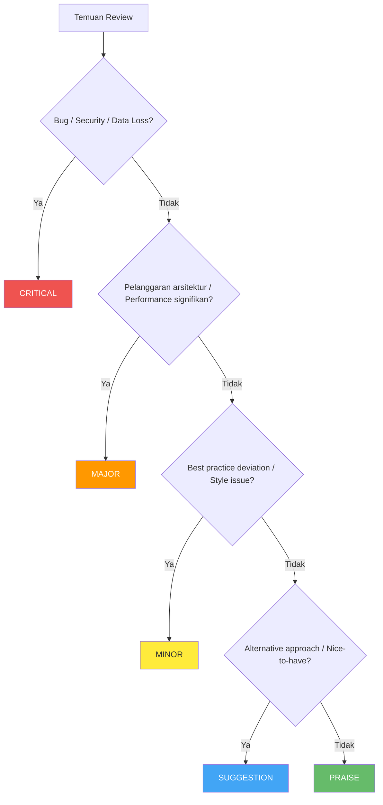

# Standar Code Review

> [!NOTE]
> **Source of Truth**
>
> - Checklist lengkap: #[[file:docs/08-template-code-review-checklist.md]]

## 5 Pertanyaan Utama Code Review

Setiap code review harus menjawab:

1. **Correctness** — Apakah kode melakukan apa yang seharusnya?
2. **Clarity** — Apakah developer lain bisa memahami tanpa penjelasan tambahan?
3. **Consistency** — Apakah kode mengikuti konvensi yang disepakati?
4. **Completeness** — Apakah semua edge case ditangani?
5. **Confidence** — Apakah kode ini aman untuk di-deploy ke production?

## Tingkat Severity

| Level | Label | Emoji | Tindakan | Contoh |
|---|---|---|---|---|
| Critical | `[CRITICAL]` | :red_circle: | **WAJIB diperbaiki** sebelum merge | SQL injection, hardcoded credentials, race condition |
| Major | `[MAJOR]` | :orange_circle: | **WAJIB diperbaiki** sebelum merge | Missing error handling, N+1 query, missing validation |
| Minor | `[MINOR]` | :yellow_circle: | Sebaiknya diperbaiki, bisa di-track sebagai tech debt | Naming convention, missing XML docs |
| Suggestion | `[SUGGESTION]` | :large_blue_circle: | Opsional, diskusi terbuka | Alternative design pattern, refactoring idea |
| Praise | `[PRAISE]` | :green_circle: | Tidak perlu tindakan, apresiasi | Clean abstraction, clever optimization |

> [!WARNING]
> PR **TIDAK BOLEH** di-merge jika masih ada temuan `CRITICAL` atau `MAJOR` yang belum di-resolve.

## Alur Keputusan Severity



## Checklist Umum

### Readability & Naming

- [ ] Nama variabel deskriptif dan bermakna
- [ ] Nama method menjelaskan apa yang dilakukan
- [ ] Tidak ada magic numbers/strings
- [ ] Panjang method tidak lebih dari 30 baris
- [ ] Nesting depth tidak lebih dari 3 level

### SOLID Principles

- [ ] Single Responsibility: class hanya punya satu alasan berubah
- [ ] Open/Closed: extensible tanpa modifikasi
- [ ] Dependency Inversion: depend on abstractions

### Error Handling

- [ ] Tidak ada empty `catch` blocks
- [ ] Tidak catch `Exception` generik tanpa alasan
- [ ] Error messages tidak mengekspos internal details
- [ ] Null checks dilakukan untuk parameter publik

### Security

- [ ] Tidak ada hardcoded credentials/secrets
- [ ] Input selalu divalidasi dan di-sanitize
- [ ] Tidak ada SQL injection vulnerability
- [ ] Authentication/Authorization ter-enforce

### Performance

- [ ] Tidak ada N+1 query problem
- [ ] Pagination diimplementasikan untuk list endpoints
- [ ] Async/await digunakan untuk I/O operations
- [ ] `IDisposable` resources di-dispose dengan benar

## Format Komentar Review

```markdown
<emoji> [LEVEL] Judul singkat

Penjelasan masalah.

**Saat ini:**
```<lang>
// code yang bermasalah
```

**Seharusnya:**
```<lang>
// solusi yang direkomendasikan
```

Referensi: [link jika ada]
```

## Self-Review Checklist Sebelum Submit PR

- [ ] Code sudah di-compile/build tanpa error
- [ ] Semua tests pass secara lokal
- [ ] Tidak ada `console.log` / `Debug.WriteLine` yang tertinggal
- [ ] Tidak ada hardcoded values
- [ ] PR description sudah diisi dengan jelas
- [ ] Screenshot ditambahkan jika ada perubahan UI
- [ ] Migration script tersedia jika ada perubahan DB
