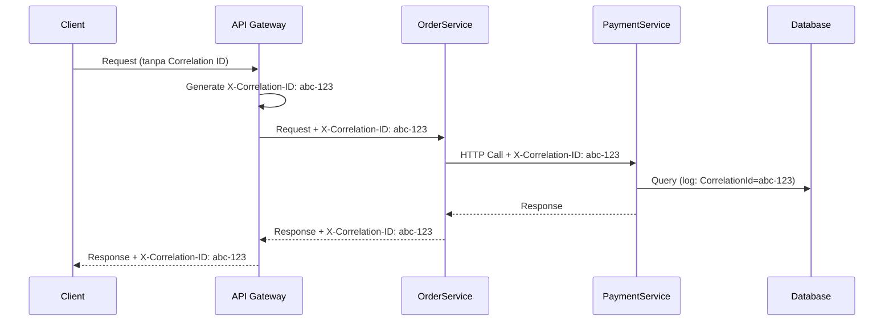

# Standar Logging & Observability

> [!NOTE]
> **Source of Truth**
>
> - Template logging: #[[file:11-template-logging-observability.md]]
> - Rule 8 (Logging): #[[file:02-kiro-setup-and-configuration.md]] (section "Rules")

## Prinsip Inti

| Aspek | Standar |
|---|---|
| Logger injection | Inject `ILogger<T>` via constructor — tidak pakai static logger |
| Format | Structured logging dengan Serilog — gunakan message template, bukan string interpolation |
| Sensitive data | TIDAK BOLEH log password, token, PII, credit card |
| Correlation | Setiap request harus membawa `X-Correlation-ID` untuk distributed tracing |

## Log Levels

| Level | Kapan Digunakan | Contoh |
|---|---|---|
| `Verbose` | Detail internal, hanya saat deep debugging | Loop iteration values |
| `Debug` | Development troubleshooting | Method entry/exit dengan parameter values |
| `Information` | Business events yang normal | Order created, User logged in |
| `Warning` | Situasi tidak ideal tapi recoverable | Retry attempt, fallback triggered |
| `Error` | Kegagalan yang memerlukan attention | Unhandled exception, external service failure |
| `Fatal` | Aplikasi tidak bisa lanjut | Database connection lost, out of memory |

## Structured Logging — Good vs Bad

```csharp
// BAD — String interpolation, kehilangan structured data
_logger.LogInformation($"Order {orderId} created by user {userId}");

// GOOD — Message template, properti terindeks
_logger.LogInformation("Order {OrderId} created by user {UserId}", orderId, userId);
```

```csharp
// BAD — Catch tanpa log
try { await ProcessAsync(); }
catch (Exception) { }

// GOOD — Log exception dengan context
try { await ProcessAsync(); }
catch (Exception ex)
{
    _logger.LogError(ex, "Failed to process order {OrderId}", orderId);
    throw;
}
```

## Correlation ID

Setiap request yang masuk ke API harus memiliki Correlation ID. Jika client tidak mengirim header `X-Correlation-ID`, middleware generate GUID baru. ID ini diteruskan ke semua service downstream dan di-enrich ke Serilog context.



## Yang TIDAK BOLEH di-Log

| Kategori | Contoh Data | Mitigasi |
|---|---|---|
| Credentials | Password, API keys, connection strings | Mask atau exclude dari log context |
| PII | Email, nomor telepon, alamat | Gunakan hash atau ID reference saja |
| Financial | Credit card number, CVV | PCI-DSS compliance — tidak boleh ter-record |
| Health data | Diagnosis, medical records | HIPAA — restricted |
| Token | JWT, refresh token, session ID | Log hanya claim yang tidak sensitif |

## Health Checks

| Dependency | Endpoint | Interval | Timeout |
|---|---|---|---|
| SQL Server | `/health` | 30 detik | 5 detik |
| Redis | `/health` | 30 detik | 3 detik |
| External API | `/health` | 60 detik | 10 detik |
| Disk space | `/health` | 60 detik | 1 detik |

Health check wajib di-register di `Program.cs` dan di-expose pada endpoint `/health` untuk load balancer dan monitoring.

## Frontend Logging (ReactJS)

- Implementasikan **Error Boundary** di level root dan per-feature boundary
- Error yang tertangkap dikirim ke backend via `POST /api/v1/logs/frontend`
- Payload minimal: `message`, `stack`, `componentStack`, `url`, `timestamp`
- Gunakan external service (Sentry / Application Insights) untuk production monitoring

## Penerapan di Repo SOP Ini

> [!TIP]
> Standar logging ini TIDAK berlaku saat mengedit repo SOP (Markdown-only). Dokumen ini menjadi referensi saat menulis atau me-review code samples di dalam SOP yang menyangkut logging dan observability.
