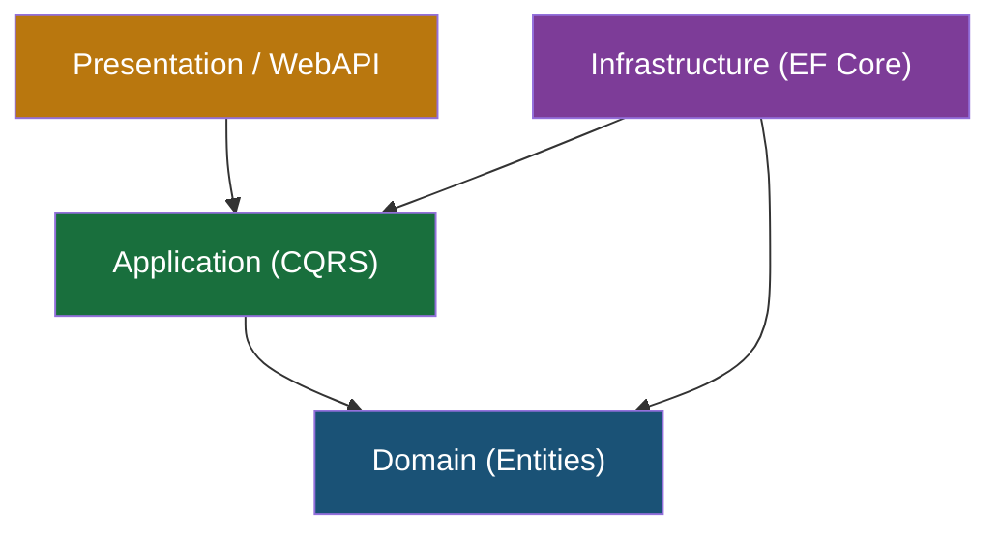

# .NET 8 / C# Rules

> [!NOTE]
> **Source of Truth**
>
> - 25 Kiro Rules lengkap: #[[file:docs/02-kiro-setup-and-configuration.md]] (section "25 Recommended Kiro Rules")
> - Clean Architecture template: #[[file:docs/12-template-clean-architecture-dotnet8.md]]
> - Code review checklist .NET: #[[file:docs/08-template-code-review-checklist.md]] (section ".NET 8 Specific Checklist")

## Architecture Pattern

> [!IMPORTANT]
> Project menggunakan **Clean Architecture** dengan 4 layer. Dependency rule: lapisan luar depend ke dalam, **tidak pernah sebaliknya**.

| Layer | Boleh Depend Ke | Tidak Boleh Depend Ke |
|---|---|---|
| Domain | Tidak ada (innermost) | Application, Infrastructure, Presentation |
| Application | Domain | Infrastructure, Presentation |
| Infrastructure | Domain, Application | Presentation |
| Presentation | Application, Infrastructure | — |

## CQRS dengan MediatR

| Aspek | Konvensi |
|---|---|
| Command naming | `{Action}{Entity}Command` — `CreateOrderCommand` |
| Handler naming | `{Action}{Entity}CommandHandler` |
| Query naming | `Get{Entity/Entities}Query` |
| Return type | `Result<T>` untuk mutations, `Result<T>` atau `Result<PaginatedList<T>>` untuk queries |
| Satu handler per file | Wajib |
| Queries tidak boleh modify state | Wajib |

## Naming Conventions

| Elemen | Gaya | Contoh |
|---|---|---|
| Class | PascalCase | `OrderService` |
| Interface | `I` + PascalCase | `IOrderRepository` |
| Method | PascalCase + suffix `Async` | `GetOrderByIdAsync` |
| Property | PascalCase | `OrderTotal` |
| Private field | `_camelCase` | `_orderRepository` |
| Parameter | camelCase | `orderId` |
| Constant | PascalCase | `MaxRetryCount` |

## Entity Base

Semua entities inherit dari `BaseEntity` / `AuditableEntity`:

- `Id` → `Guid` (bukan auto-increment integer)
- Audit fields: `CreatedAt`, `CreatedBy`, `UpdatedAt`, `UpdatedBy`
- Soft delete: `IsDeleted`, `DeletedAt`, `DeletedBy`
- Audit fields di-set via `SaveChangesInterceptor`

## Validation

- Setiap Request/Command DTO **wajib** punya `AbstractValidator<T>`
- Naming: `{RequestName}Validator`
- Validation dijalankan via MediatR Pipeline Behavior
- Register: `AddValidatorsFromAssemblyContaining<>`

## EF Core Configuration

- Fluent API only (bukan Data Annotations)
- Satu configuration file per entity: `{EntityName}Configuration.cs`
- String properties **wajib** `MaxLength`
- Decimal properties **wajib** `Precision`
- Global query filter: `.HasQueryFilter(e => !e.IsDeleted)`
- Migration naming: `YYYYMMDDHHMMSS_{DescriptiveAction}`

## Exception Handling

- Custom exceptions inherit dari `BaseException`
- Hierarchy: `NotFoundException` (404), `ValidationException` (400), `ConflictException` (409), `BusinessRuleException` (422)
- Global handler via `IExceptionHandler` (.NET 8)
- Return `ProblemDetails` (RFC 7807) untuk error response

## Dependency Injection

| Lifetime | Penggunaan | Contoh |
|---|---|---|
| Scoped | Request-level services | Application services, DbContext |
| Singleton | Stateless shared services | Cache, FeatureFlag |
| Transient | Lightweight stateless | Factories, DateTimeProvider |

> [!WARNING]
> - Tidak boleh inject `IServiceProvider` langsung (Service Locator anti-pattern)
> - Singleton tidak boleh depend pada Scoped (captive dependency)
> - Tidak boleh pakai `.Result` atau `.Wait()` (sync-over-async = deadlock)

## Async/Await

- Semua I/O operations wajib `async`
- `CancellationToken` wajib di-propagate di semua method async
- Tidak boleh `async void` (kecuali event handler)
- `Task.WhenAll` untuk parallel independent operations

## Performance

- API response target: < 200ms (p95)
- Database query target: < 100ms (p95)
- Pagination wajib untuk list endpoints (max 100 items)
- `AsNoTracking()` untuk read-only queries
- Response caching untuk data yang jarang berubah

## Yang Tidak Berlaku di Repo SOP Ini

> [!NOTE]
> Repo `kiro-engineering-sop` tidak mengandung file `.cs`. Rules ini berlaku saat Kiro **menulis kode C#** di project lain yang mereferensikan SOP ini.
