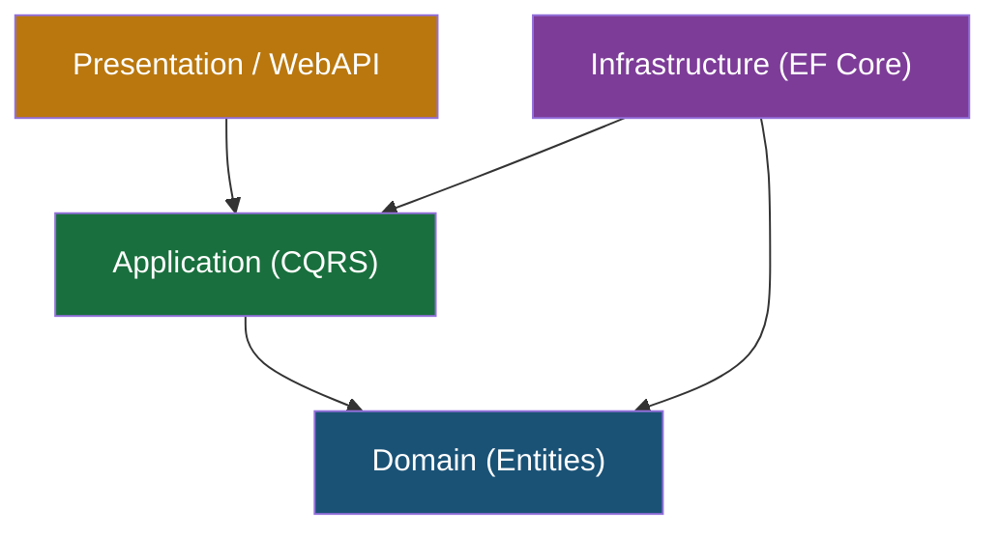

# .NET 8 / C# Rules

> [!NOTE]
> **Source of Truth**
>
> - 25 Kiro Rules lengkap: #[[file:docs/02-kiro-setup-and-configuration.md]] (section "25 Recommended Kiro Rules")
> - Clean Architecture template: #[[file:docs/12-template-clean-architecture-dotnet8.md]]
> - Code review checklist .NET: #[[file:docs/08-template-code-review-checklist.md]] (section ".NET 8 Specific Checklist")
> - Performance & memory budget: #[[file:docs/10a-api-performance-review-checklist.md]]

## Architecture Pattern

> [!IMPORTANT]
> Project menggunakan **Clean Architecture** dengan 4 layer. Dependency rule: lapisan luar depend ke dalam, **tidak pernah sebaliknya**.

```mermaid
graph TB
    API["Presentation / WebAPI"] --> APP["Application (CQRS)"]
    INFRA["Infrastructure (EF Core)"] --> APP
    APP --> DOM["Domain (Entities)"]
    INFRA --> DOM

    style DOM fill:#1a5276,color:#fff
    style APP fill:#196f3d,color:#fff
    style INFRA fill:#7d3c98,color:#fff
    style API fill:#b9770e,color:#fff
```

| Layer | Boleh Depend Ke | Tidak Boleh Depend Ke |
|---|---|---|
| Domain | Tidak ada (innermost) | Application, Infrastructure, Presentation |
| Application | Domain | Infrastructure, Presentation |
| Infrastructure | Domain, Application | Presentation |
| Presentation | Application, Infrastructure | — |

## CQRS dengan MediatR

| Aspek | Konvensi |
|---|---|
| Command naming | `{Action}{Entity}Command` — `CreateOrderCommand` |
| Handler naming | `{Action}{Entity}CommandHandler` |
| Query naming | `Get{Entity/Entities}Query` |
| Return type | `Result<T>` untuk mutations, `Result<T>` atau `Result<PaginatedList<T>>` untuk queries |
| Satu handler per file | Wajib |
| Queries tidak boleh modify state | Wajib |

## Naming Conventions

| Elemen | Gaya | Contoh |
|---|---|---|
| Class | PascalCase | `OrderService` |
| Interface | `I` + PascalCase | `IOrderRepository` |
| Method | PascalCase + suffix `Async` | `GetOrderByIdAsync` |
| Property | PascalCase | `OrderTotal` |
| Private field | `_camelCase` | `_orderRepository` |
| Parameter | camelCase | `orderId` |
| Constant | PascalCase | `MaxRetryCount` |

## Entity Base

Semua entities inherit dari `BaseEntity` / `AuditableEntity`:

- `Id` → `Guid` (bukan auto-increment integer)
- Audit fields: `CreatedAt`, `CreatedBy`, `UpdatedAt`, `UpdatedBy`
- Soft delete: `IsDeleted`, `DeletedAt`, `DeletedBy`
- Audit fields di-set via `SaveChangesInterceptor`

## Validation

- Setiap Request/Command DTO **wajib** punya `AbstractValidator<T>`
- Naming: `{RequestName}Validator`
- Validation dijalankan via MediatR Pipeline Behavior
- Register: `AddValidatorsFromAssemblyContaining<>`

## EF Core Configuration

- Fluent API only (bukan Data Annotations)
- Satu configuration file per entity: `{EntityName}Configuration.cs`
- String properties **wajib** `MaxLength`
- Decimal properties **wajib** `Precision`
- Global query filter: `.HasQueryFilter(e => !e.IsDeleted)`
- Migration naming: `YYYYMMDDHHMMSS_{DescriptiveAction}`

## Exception Handling

- Custom exceptions inherit dari `BaseException`
- Hierarchy: `NotFoundException` (404), `ValidationException` (400), `ConflictException` (409), `BusinessRuleException` (422)
- Global handler via `IExceptionHandler` (.NET 8)
- Return `ProblemDetails` (RFC 7807) untuk error response

## Dependency Injection

| Lifetime | Penggunaan | Contoh |
|---|---|---|
| Scoped | Request-level services | Application services, DbContext |
| Singleton | Stateless shared services | Cache, FeatureFlag |
| Transient | Lightweight stateless | Factories, DateTimeProvider |

> [!WARNING]
> - Tidak boleh inject `IServiceProvider` langsung (Service Locator anti-pattern)
> - Singleton tidak boleh depend pada Scoped (captive dependency)
> - Tidak boleh pakai `.Result` atau `.Wait()` (sync-over-async = deadlock)

## Async/Await

- Semua I/O operations wajib `async`
- `CancellationToken` wajib di-propagate di semua method async
- Tidak boleh `async void` (kecuali event handler)
- `Task.WhenAll` untuk parallel independent operations

## Performance

### Target Latency

| Metrik | Target |
|---|---|
| API response | < 200ms (p95) |
| Database query | < 100ms (p95) |

### Enam Bottleneck yang Wajib Dihindari

| # | Bottleneck | Aturan | Severity |
|---|---|---|---|
| 1 | N+1 query | Projection ke DTO di dalam `.Select()` — bukan loop `FindAsync` per baris | Major |
| 2 | Multiple `SaveChanges` | Satu `SaveChangesAsync()` per use case, di akhir transaksi | Major |
| 3 | Sync-over-async | Dilarang `.Result`, `.Wait()`, `.GetAwaiter().GetResult()` | Critical |
| 4 | LINQ to Objects | Jangan `.ToList()` sebelum `.Where()` — filter harus terjadi di database | Major |
| 5 | JSON serialization | `System.Text.Json` Source Generator untuk payload besar | Minor |
| 6 | Alokasi memori | `StringBuilder` untuk konkatenasi dalam loop, hindari boxing | Minor |

### EF Core Query Rules

| Aturan | Alasan |
|---|---|
| `.AsNoTracking()` untuk read-only queries | Melewati change tracker |
| `.AsSplitQuery()` saat multiple `Include` | Mencegah cartesian explosion |
| `.Select()` ke DTO, jangan tarik entity utuh | Mengurangi data transfer |
| `Any()` bukan `Count() > 0` untuk existence check | Berhenti di baris pertama |
| `ExecuteUpdateAsync` / `ExecuteDeleteAsync` untuk bulk | Tanpa materialisasi entity ke memory |
| `Take()` atau pagination wajib di setiap query list | Mencegah unbounded result set |

### Memory Budget

| # | Metrik | Ambang | Severity |
|---|---|---|---|
| P-01 | Working set (p95) | ≤ 70% dari container memory limit | Minor |
| P-02 | Buffer / array ≥ 85 KB | Wajib `ArrayPool<T>` | Major |
| P-03 | Percentage of time in GC | ≤ 5% | Minor |
| P-04 | Gen 2 collection count | Tidak naik linear terhadap jumlah request | Minor |
| P-05 | Payload atau file > 10 MB | Ikuti tabel keputusan — pagination, background job, atau batch keyset | Major |
| P-06 | Result set query | Maksimal 100 item per page | Major |

> [!IMPORTANT]
> P-02, P-05, dan P-06 berlaku sejak hari pertama — bisa diverifikasi langsung dari kode. P-01 dan P-03 adalah **nilai default**: project ini mengukur sendiri lalu mencatat angkanya sebagai ADR, dan selama belum diukur keduanya tidak dipakai menolak PR. Penjelasan lengkap, dasar penetapan angka, dan contoh kode setiap metrik ada di #[[file:docs/10a-api-performance-review-checklist.md]] section 7.

### Streaming & Export Besar

`AsAsyncEnumerable()` polos **bukan** solusi payload besar — ia menurunkan memory tapi menahan koneksi database selama seluruh durasi response dan tetap memindai tabel penuh. Pilih sesuai volume:

| Volume / Sifat | Pendekatan |
|---|---|
| ≤ 100 item | Pagination biasa |
| Besar, tidak harus realtime | Background job + object storage + `202 Accepted` |
| Besar, harus satu request | Batch keyset **dan** concurrency limiter |

Implementasi lengkap — kode batch keyset, alur background job, isolasi connection pool, dan tradeoff-nya — ada di #[[file:docs/10a-api-performance-review-checklist.md]] section 8.

### Caching

Empat layer caching (Response, In-Memory, Distributed/Redis, Client) beserta format cache key dan aturan invalidation mengikuti Rule 22 di #[[file:docs/02-kiro-setup-and-configuration.md]]. Jangan cache authentication data, real-time data, dan PII.

## Yang Tidak Berlaku di Repo SOP Ini

> [!NOTE]
> Repo `kiro-engineering-sop` tidak mengandung file `.cs`. Rules ini berlaku saat Kiro **menulis kode C#** di project lain yang mereferensikan SOP ini.
