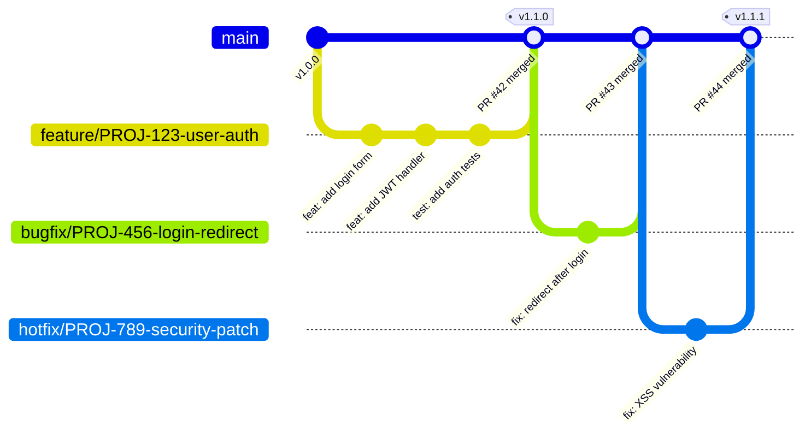

# Standar GitHub Flow & Git Conventions

> [!NOTE]
> **Source of Truth**
>
> - GitHub Flow & PR Strategy: #[[file:15-workflow-github-flow.md]]
> - Rule 17 (Git): #[[file:02-kiro-setup-and-configuration.md]] (section "Rules")

## GitHub Flow



## Branch Naming

Format: `<type>/<ticket-id>-<short-description>`

### Tipe Branch

| Prefix | Penggunaan | Lifetime | Contoh |
|---|---|---|---|
| `feature/` | Fitur baru | 1-5 hari | `feature/PROJ-123-user-authentication` |
| `bugfix/` | Perbaikan bug non-urgent | 1-2 hari | `bugfix/PROJ-456-login-redirect-loop` |
| `hotfix/` | Perbaikan urgent production | < 4 jam | `hotfix/PROJ-789-xss-vulnerability` |
| `release/` | Persiapan release | 1-2 hari | `release/v2.1.0` |
| `chore/` | Maintenance, dependency update | 1 hari | `chore/PROJ-101-update-dotnet-sdk` |
| `docs/` | Dokumentasi saja | 1 hari | `docs/PROJ-102-api-documentation` |
| `refactor/` | Refactoring tanpa behavior change | 1-3 hari | `refactor/PROJ-103-extract-auth-service` |

### Aturan

- Lowercase semua
- Separator: hyphen (`-`)
- Wajib ada ticket ID (kecuali `release/` dan `chore/` tanpa ticket)
- Wajib ada deskripsi singkat setelah ticket ID

## Conventional Commits

Format:

```text
<type>(<scope>): <description>

[optional body]

[optional footer(s)]
```

### Tipe Commit

| Type | Deskripsi | Contoh |
|---|---|---|
| `feat` | Fitur baru | `feat(auth): add JWT refresh token` |
| `fix` | Bug fix | `fix(api): handle null reference in UserService` |
| `docs` | Dokumentasi | `docs(readme): update API documentation` |
| `style` | Formatting (bukan CSS) | `style(api): fix indentation in controllers` |
| `refactor` | Refactoring | `refactor(data): extract repository pattern` |
| `perf` | Performance improvement | `perf(query): optimize user search query` |
| `test` | Penambahan/perbaikan test | `test(auth): add unit tests for login` |
| `build` | Build system | `build(deps): upgrade to .NET 8.0.3` |
| `ci` | CI configuration | `ci(github): add PR validation workflow` |
| `chore` | Maintenance | `chore(deps): update NuGet packages` |

### Scope Options

| Scope | Area |
|---|---|
| `api` | Backend API (.NET) |
| `web` | Frontend (ReactJS) |
| `db` | Database (SQL Server) |
| `auth` | Authentication & Authorization |
| `infra` | Infrastructure & DevOps |
| `test` | Test infrastructure |
| `deps` | Dependencies |
| `config` | Configuration |

### Contoh Commit Messages

```text
feat(api): implement keyset pagination for user list endpoint

- Add keyset pagination using UserID as cursor
- Support configurable page size (default: 20, max: 100)
- Include total count in response headers

Closes #PROJ-123
```

```text
fix(db): resolve deadlock in order processing

Root cause: Two transactions acquiring locks in different order
on Orders and OrderItems tables.

Solution: Standardize lock acquisition order and add ROWLOCK hint.

Fixes #PROJ-456
```

```text
perf(api): optimize GetUserProfile response time

- Replace N+1 query pattern with eager loading
- Add Redis caching with 5-minute TTL

Benchmark: P50 230ms → 12ms, P99 1.2s → 45ms

Relates-to #PROJ-789
```

## PR Size Guidelines

| Kategori | Lines Changed | Review Time | Defect Rate |
|---|---|---|---|
| XS | 1-10 lines | 5 min | Very Low |
| S | 11-50 lines | 15 min | Low |
| M | 51-200 lines | 30 min | Medium |
| L | 201-400 lines | 1 hour | High |
| XL | 401-1000 lines | 2 hours | Very High |
| XXL | 1000+ lines | Reject/Split | Extremely High |

> [!WARNING]
> PR dengan lebih dari **400 lines** harus dipecah menjadi beberapa PR yang lebih kecil. Defect rate meningkat secara eksponensial setelah 200 lines of change.

### Strategi Memecah PR Besar

```text
# Contoh: Feature User Registration (800 lines total)

PR #1: Database schema & migrations (100 lines)
PR #2: Backend domain & data layer (200 lines)
PR #3: Backend API endpoints (150 lines)
PR #4: Frontend components (200 lines)
PR #5: Integration tests & documentation (150 lines)
```

## Merge Strategy

| Strategi | Kapan Digunakan |
|---|---|
| **Squash merge** (default) | Feature branches — commit history clean di `main` |
| Merge commit | Release branches — preserve full history |
| Rebase | Hanya untuk update branch dari `main` sebelum merge |

> [!IMPORTANT]
> Squash merge adalah default. Semua commits di feature branch di-squash menjadi satu commit di `main` dengan message yang mengikuti Conventional Commits format.

## Branch Protection Rules

| Rule | `main` branch |
|---|---|
| Require PR | Ya |
| Require CI passing | Ya |
| Require approvals | Minimum 2 |
| Dismiss stale reviews | Ya |
| Require up-to-date branch | Ya |
| No direct push | Ya |
| No force push | Ya |
| Require linear history | Ya (squash merge) |
