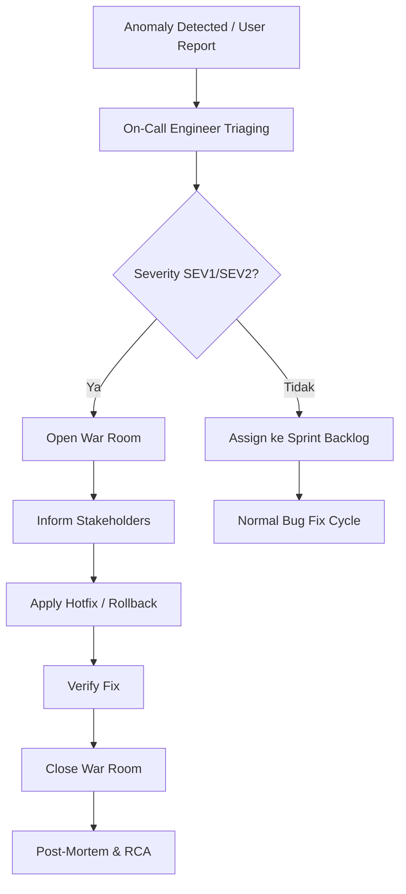

# Incident Management Playbook

> [!NOTE]
> **Source of Truth**
>
> - Prosedur lengkap dan detail: #[[file:docs/17-workflow-incident-management.md]]

## Severity Classification

| Level | Deskripsi | SLA Respon | SLA Resolusi | Contoh |
|---|---|---|---|---|
| **SEV1** — Critical | Seluruh sistem mati total, bisnis inti terhenti, data bocor | 15 Menit | 2 Jam | Deadlock massal SQL Server, API Gateway down, JWT token leak |
| **SEV2** — Major | Fitur penting terganggu, tidak ada workaround mudah | 30 Menit | 6 Jam | Modul Checkout tidak berfungsi bagi mayoritas user |
| **SEV3** — Moderate | Masalah fungsional kecil, ada workaround | 2 Jam | 24 Jam | Report PDF gagal generate, tapi Excel tersedia |
| **SEV4** — Minor | Kosmetik, typo UI, request non-urgent | 24 Jam | Next Release | Typo text di tombol frontend |

## Incident Response Workflow



## Communication Template (Slack/Teams)

Gunakan format berikut saat posting incident alert:

```text
🚨 INCIDENT ALERT [SEVx] 🚨
Incident: [Deskripsi singkat masalah]
Status: INVESTIGATING | MITIGATING | RESOLVED
Impact: [Dampak ke user/bisnis]
Lead Handler: [Nama On-Call Engineer]
War Room: [Link channel/meeting]
Next Update: YYYY-MM-DD HH:MM WIB (max 30 menit dari sekarang)
```

## Common Production Scenarios

| Skenario | Penyebab Umum | Quick Mitigation |
|---|---|---|
| DB CPU SQL Server 100% | Missing index, stale statistics, parameter sniffing | 1. Identifikasi query via DMV 2. `sp_recompile` SP terkait 3. Buat index `WITH (ONLINE = ON)` |
| OOM .NET Web API | Static cache tak terkendali, Singleton abuse, unmanaged resource leak | 1. `dotnet-dump collect -p [PID]` 2. Analisis dump 3. Rolling restart container |
| API Gateway Timeout | Downstream service lambat, connection pool exhausted | 1. Check health endpoint dependencies 2. Circuit breaker activation 3. Scale out instances |
| Frontend Blank Page | Build error, CDN cache stale, env var salah | 1. Verify CDN deployment 2. Purge cache 3. Check browser console errors |

## Post-Mortem Template (Outline)

Wajib dibuat dalam 48 jam setelah insiden SEV1/SEV2 dimitigasi.

```markdown
# INCIDENT POST-MORTEM: [Deskripsi Singkat]

**Tanggal:** YYYY-MM-DD
**Durasi:** [e.g., 1 jam 15 menit]
**Lead Investigator:** [Nama]
**Severity:** [SEV1 / SEV2]

## 1. Executive Summary
[Ringkasan insiden, dampak, dan resolusi]

## 2. Timeline Kejadian
- HH:MM — Alert terdeteksi
- HH:MM — Investigasi dimulai
- HH:MM — War Room dibuka
- HH:MM — Fix diterapkan
- HH:MM — War Room ditutup

## 3. Root Cause Analysis (5 Whys)
1. Mengapa X terjadi? Karena...
2. Mengapa Y? Karena...
3. ...

## 4. Action Items
- [ ] [Tindakan pencegahan] (Owner: ..., Target: YYYY-MM-DD)
- [ ] [Improvement monitoring] (Owner: ..., Target: YYYY-MM-DD)
```

> [!WARNING]
> Setiap insiden SEV1/SEV2 yang tidak memiliki post-mortem dalam 48 jam akan di-escalate ke Engineering Manager.
