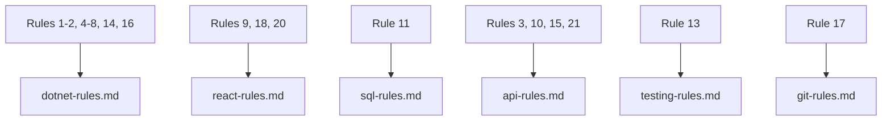

# 25 Kiro Rules — Ringkasan Lengkap

> [!NOTE]
> **Source of Truth**
>
> - Detail implementasi setiap rule: #[[file:02-kiro-setup-and-configuration.md]] (section "25 Recommended Kiro Rules")
> - Implementasi per-domain ada di steering files: `dotnet-rules.md`, `react-rules.md`, `sql-rules.md`, `api-rules.md`, `testing-rules.md`, `git-rules.md`

## Ringkasan

Berikut adalah 25 rules yang direkomendasikan untuk project .NET 8 + ReactJS + SQL Server. Rules ini di-encode ke dalam steering files agar Kiro selalu menghasilkan output yang konsisten dengan standar tim.

## Tabel Rules by Domain

### Architecture (Rules 1-2)

| # | Rule | Ringkasan |
|---|---|---|
| 1 | Architecture Pattern | Clean Architecture dengan 4 layer: Domain → Application → Infrastructure → Presentation |
| 2 | CQRS Pattern | Command/Query separation via MediatR dengan naming convention yang ketat |

### API (Rules 3, 10, 15, 21)

| # | Rule | Ringkasan |
|---|---|---|
| 3 | API Response Standard | Semua endpoint return `ApiResponse<T>` wrapper (Success, Message, Data, Errors) |
| 10 | API Endpoint Naming | REST naming: plural nouns, lowercase hyphens, versioned URL `/api/v{n}/` |
| 15 | Error Message Standards | User-friendly messages, error codes untuk frontend, localization-ready |
| 21 | API Versioning | Versioning via URL path, support N-1, breaking changes wajib bump version |

### Data & Infrastructure (Rules 4, 6, 11, 22, 23, 24)

| # | Rule | Ringkasan |
|---|---|---|
| 4 | Entity Base Class | Semua entities inherit `BaseEntity` (Guid Id, audit fields, soft delete) |
| 6 | EF Core Configuration | Fluent API only, satu config per entity, global query filter soft delete |
| 11 | SQL Server Standards | Parameterized queries wajib, index FK, avoid `SELECT *`, SP naming: `usp_` |
| 22 | Caching Strategy | 4 layers (Response, In-Memory, Distributed/Redis, Client/TanStack Query) |
| 23 | File Upload Standards | Max 10MB, whitelist types, cloud storage, content-based validation |
| 24 | Background Job Standards | Jobs harus idempotent, retry policy, support cancellation |

### Backend Logic (Rules 5, 7, 8, 14, 16)

| # | Rule | Ringkasan |
|---|---|---|
| 5 | Validation Standard | FluentValidation per request DTO, dijalankan via MediatR Pipeline Behavior |
| 7 | Exception Handling | `IExceptionHandler` (.NET 8), custom exception hierarchy, correlation ID |
| 8 | Logging Standards | Inject `ILogger<T>`, structured logging Serilog, jangan log sensitive data |
| 14 | DTO and Mapping | Request/Response/Command/Query naming, Mapster mapping, max 2-level nesting |
| 16 | Dependency Injection | Layer-specific extension methods, lifetime guidelines (Scoped/Transient/Singleton) |

### Frontend (Rules 9, 18, 20)

| # | Rule | Ringkasan |
|---|---|---|
| 9 | React Component Standards | Functional only, TypeScript strict, one component per file, folder structure |
| 18 | React Hook Conventions | Prefix `use`, explicit return types, centralized query keys |
| 20 | Frontend State Management | Decision matrix: TanStack Query (server), Zustand (global), RHF (forms) |

### Testing (Rule 13)

| # | Rule | Ringkasan |
|---|---|---|
| 13 | Testing Standards | xUnit + NSubstitute + FluentAssertions (.NET), Vitest + RTL (React), AAA pattern, 80% coverage |

### Security (Rule 12)

| # | Rule | Ringkasan |
|---|---|---|
| 12 | Authentication & Authorization | JWT (15min access, 7d refresh), httpOnly cookies, policy-based auth |

### DevOps & Documentation (Rules 17, 19, 25)

| # | Rule | Ringkasan |
|---|---|---|
| 17 | Git Commit Messages | Conventional Commits format: `type(scope): description` |
| 19 | Performance Guidelines | API < 200ms p95, DB < 100ms, LCP < 2.5s, bundle < 250KB gzipped |
| 25 | Code Documentation | XML docs (.NET public API), JSDoc (React exports), document WHY not WHAT |

## Mapping ke Steering Files

> [!TIP]
> Steering files dengan `inclusion: auto` di-load otomatis pada setiap chat session. Rules di atas sudah ter-encode di masing-masing file sehingga Kiro selalu mengikuti standar ini tanpa perlu prompt manual.
