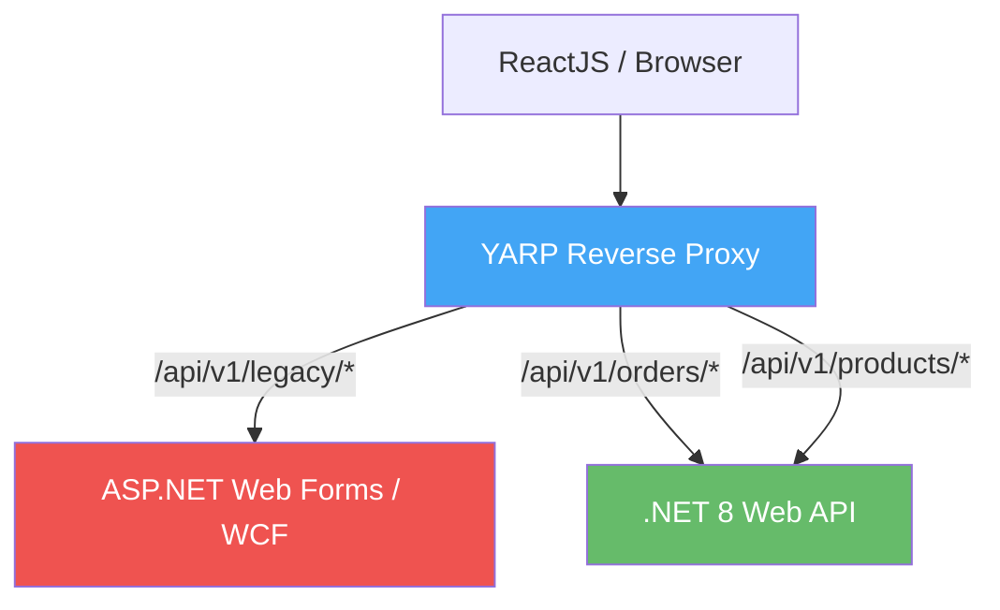
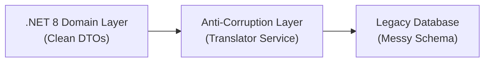

# Legacy Systems Refactoring Guide

> [!NOTE]
> **Source of Truth**
>
> - Playbook lengkap: #[[file:docs/24-refactoring-legacy-systems.md]]

## Legacy Assessment Matrix

Evaluasi setiap modul legacy menggunakan matriks berikut sebelum memutuskan strategi modernisasi:

| Kompleksitas Bisnis | Kualitas Kode | Strategi | Deskripsi |
|---|---|---|---|
| **Tinggi** | **Buruk** | Strangler Fig Pattern | Rewrite bertahap per modul, alihkan traffic via Reverse Proxy |
| **Rendah** | **Buruk** | Rebuild (Rewrite Total) | Buat ulang dari awal — risiko rendah karena bisnis logic sederhana |
| **Tinggi** | **Baik** | Refactor / Rehost | Upgrade framework ke .NET 8, pertahankan struktur logic existing |
| **Rendah** | **Baik** | Retain (Pertahankan) | Biarkan berjalan — stabil, jarang diubah |

## Strangler Fig Pattern dengan YARP



### Cara Kerja

1. Deploy aplikasi .NET 8 baru di samping aplikasi legacy
2. Konfigurasi YARP sebagai reverse proxy di depan keduanya
3. Migrasikan satu modul pada satu waktu ke sistem baru
4. Alihkan routing di YARP dari legacy ke modern secara bertahap
5. Setelah semua modul termigrasikan, matikan aplikasi legacy

## Anti-Corruption Layer (ACL)

Saat sistem .NET 8 baru perlu berkomunikasi dengan database legacy yang skemanya berantakan, gunakan Anti-Corruption Layer:



ACL adalah service C# khusus yang:
- Menerjemahkan data model legacy menjadi DTO modern yang bersih
- Mencegah domain logic .NET 8 terpolusi oleh skema legacy
- Menjadi satu-satunya titik kontak dengan sistem lama

## Kiro Prompts untuk Legacy Refactoring

### Prompt: Convert Synchronous ke Async

```text
Convert the following legacy synchronous C# code into modern asynchronous
.NET 8 code using TAP (Task-based Asynchronous Pattern).
Ensure:
1. All database calls use async equivalents.
2. Accept CancellationToken and propagate to DB calls.
3. Use file-scoped namespaces and primary constructor syntax.
Legacy code:
[Paste Legacy Code Here]
```

### Prompt: Migrasi Stored Procedure ke EF Core

```text
I have a legacy SQL Server Stored Procedure with business logic.
Port this logic into a C# Application Layer Command Handler
(.NET 8, MediatR, EF Core).
Analyze the SQL logic and generate the C# class equivalents.
SP code:
[Paste SQL SP Here]
```

### Prompt: ADO.NET ke EF Core

```text
Convert this legacy ADO.NET raw SQL code into modern EF Core 8 LINQ.
Use AsNoTracking for read-only, proper DTO projection via Select,
and CancellationToken propagation.
Legacy code:
[Paste ADO.NET Code Here]
```

> [!IMPORTANT]
> Jangan pernah melakukan big-bang migration. Selalu migrasikan satu modul pada satu waktu, validasi di Staging, lalu alihkan traffic secara bertahap.
