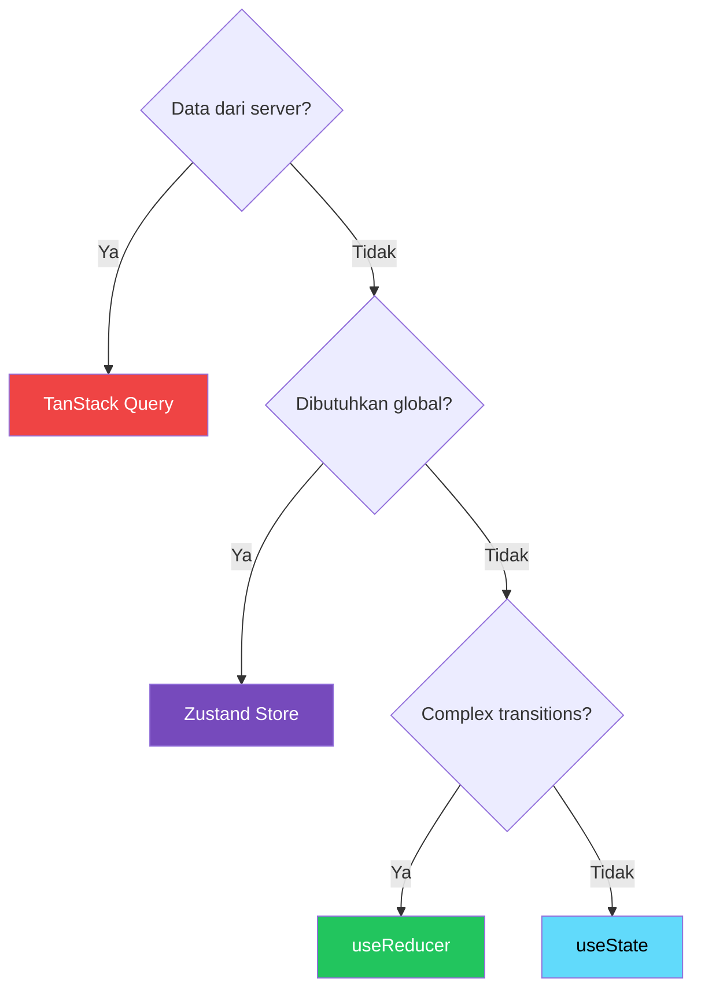

# ReactJS / TypeScript Rules

> [!NOTE]
> **Source of Truth**
>
> - Standar frontend lengkap: #[[file:docs/13-template-reactjs-frontend-standard.md]]
> - State management rules: #[[file:docs/02-kiro-setup-and-configuration.md]] (Rule 20 — State Management)
> - React Hook conventions: #[[file:docs/02-kiro-setup-and-configuration.md]] (Rule 18 — React Hook Conventions)
> - Component standards: #[[file:docs/02-kiro-setup-and-configuration.md]] (Rule 9 — React Component Standards)

## Prinsip Arsitektur

> [!IMPORTANT]
> Frontend diorganisasi **feature-based**, bukan file-type-based. File yang saling terkait ditempatkan berdekatan.

| Prinsip | Deskripsi |
|---|---|
| Feature-Based | Organisasi per fitur/domain |
| Colocation | File terkait dalam folder yang sama |
| Single Responsibility | Setiap komponen/hook punya 1 tanggung jawab |
| Composition over Inheritance | Hooks dan composition, bukan class |
| Type Safety | TypeScript strict — **no `any` allowed** |
| Server ≠ Client State | TanStack Query untuk server, Zustand untuk client |

## Folder Structure

```text
src/
├── app/               # Shell, providers, routes
├── components/
│   ├── ui/            # Atomic reusable (Button, Input, Modal)
│   ├── layout/        # Header, Sidebar, Footer
│   └── shared/        # Composite shared (DataTable, FileUpload)
├── features/          # ← INTI: satu folder per fitur
│   └── <feature>/
│       ├── api/       # API calls
│       ├── components/
│       ├── hooks/
│       ├── pages/
│       ├── stores/    # Zustand (jika perlu)
│       ├── types/
│       └── index.ts   # Public API
├── hooks/             # Shared custom hooks
├── lib/               # Library config (axios, query-client)
├── stores/            # Global stores (UI, notification)
├── types/             # Global types
└── utils/             # Pure utility functions
```

## Naming Conventions

| Elemen | Gaya | Contoh |
|---|---|---|
| Component | PascalCase | `OrderDetails.tsx` |
| Hook | `use` + CamelCase | `useOrdersQuery.ts` |
| Store | `<domain>.store.ts` | `auth.store.ts` |
| Type file | `<domain>.types.ts` | `product.types.ts` |
| Utility | camelCase | `formatCurrency.ts` |
| Constants | UPPER_SNAKE_CASE | `MAX_PAGE_SIZE` |
| Props interface | `{ComponentName}Props` | `ButtonProps` |

## Component Rules

- Functional components **only** (no class components)
- TypeScript strict mode — no `any`
- One component per file (with associated types)
- Props interface defined above component
- `forwardRef` untuk komponen yang perlu ref forwarding
- Max component length: 150 baris

## State Management Decision



> [!WARNING]
> **Jangan** duplikasi server state ke Zustand/Context. TanStack Query sudah handle caching, refetching, background updates.

## TanStack Query Conventions

| Hook | Format | Contoh |
|---|---|---|
| Query (list) | `use{Entities}Query` | `useOrdersQuery` |
| Query (detail) | `use{Entity}Query` | `useOrderQuery` |
| Mutation | `use{Action}{Entity}Mutation` | `useCreateOrderMutation` |
| Query keys | Centralized di `queryKeys.ts` | `queryKeys.orders.list(params)` |

## Forms

- **React Hook Form** + **Zod** untuk semua form
- Schema Zod terpisah di `*.schema.ts`
- Error messages dalam bahasa yang configurable
- Disable submit button saat submitting

## Offline Storage & API Integration

- Gunakan **IndexedDB** dengan library `idb` untuk penyimpanan data offline skala besar dan berstruktur.
- Hindari duplikasi data server state (dari TanStack Query) ke dalam IndexedDB secara manual kecuali untuk keperluan offline sync khusus.
- Konfigurasikan instance Axios tunggal (`apiClient`) untuk komunikasi API dan gunakan request/response interceptors untuk menangani silent JWT refresh token.

## Testing Standards

- Gunakan **Vitest** dan **React Testing Library** (RTL) untuk menulis unit test dan integration test pada level komponen.
- Gunakan **Playwright** untuk melakukan E2E testing pada alur pengguna utama (seperti *checkout*, *authentication*, *critical forms*).
- Ikuti AAA pattern (*Arrange, Act, Assert*) dan gunakan mock data yang konsisten (menggunakan MSW jika memungkinkan).

## Performance

| Target | Nilai |
|---|---|
| LCP | < 2.5s |
| INP | < 200ms |
| Initial JS bundle (gzipped) | < 250KB |
| Lazy load | Semua route-level pages |

- `React.memo` dan `useMemo` secara strategis (bukan untuk semua)
- `useCallback` untuk functions passed as props
- Virtualization untuk list > 100 items

## Yang Tidak Berlaku di Repo SOP Ini

> [!NOTE]
> Repo ini Markdown-only — tidak ada `.tsx`/`.ts` files. Rules ini berlaku saat Kiro menulis kode React.
