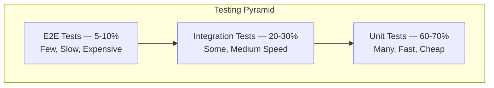

# Standar Unit Testing

> [!NOTE]
> **Source of Truth**
>
> - Unit Testing Strategy: #[[file:22-unit-testing-strategy.md]]
> - Rule 13 (Testing): #[[file:02-kiro-setup-and-configuration.md]] (section "Rules")

## Testing Pyramid



## .NET Testing Stack

| Tool | Fungsi | Versi |
|---|---|---|
| xUnit | Test framework | latest |
| NSubstitute | Mocking library | latest |
| FluentAssertions | Readable assertions | latest |
| AutoFixture | Test data generation | latest |
| Bogus | Realistic fake data | latest |
| TestContainers | Integration test infrastructure | latest |
| Coverlet | Code coverage collector | latest |

## React Testing Stack

| Tool | Fungsi | Versi |
|---|---|---|
| Vitest | Test runner (Vite-native) | latest |
| React Testing Library | Component testing | latest |
| MSW (Mock Service Worker) | API mocking | latest |
| Playwright | E2E testing | latest |

## Naming Convention

Format: `MethodUnderTest_Scenario_ExpectedBehavior`

```csharp
// GOOD
[Fact]
public async Task Handle_WithValidCommand_ShouldCreateOrderAndReturnSuccess()

[Fact]
public async Task Handle_WithInvalidCustomerId_ShouldReturnNotFoundError()

[Fact]
public async Task Handle_WithEmptyItems_ShouldReturnValidationError()

// BAD
[Fact]
public void Test1()  // Non-descriptive

[Fact]
public void CreateOrder()  // Tidak describe scenario/expected behavior
```

## AAA Pattern (Arrange-Act-Assert)

Setiap test method terdiri dari 3 bagian yang jelas:

```csharp
[Fact]
public void Create_WithValidData_ShouldInitializeCorrectly()
{
    // Arrange — Setup test data dan dependencies
    var customer = new Customer(1, "John Doe", "john@example.com");
    var items = new List<OrderItem>
    {
        OrderItem.Create(productId: 1, quantity: 2, unitPrice: 50_000m)
    };

    // Act — Execute method yang di-test
    var order = Order.Create(customer, items, "Jl. Sudirman No. 1");

    // Assert — Verify expected outcome
    order.Should().NotBeNull();
    order.CustomerId.Should().Be(1);
    order.Items.Should().HaveCount(1);
    order.TotalAmount.Should().Be(100_000m);
    order.Status.Should().Be(OrderStatus.Pending);
}
```

## Coverage Targets

| Layer | Target Coverage | Prioritas |
|---|---|---|
| Domain (Entities, Value Objects) | >= 90% | Tinggi — pure business logic |
| Application (Handlers, Services) | >= 85% | Tinggi — orchestration logic |
| Infrastructure (Repositories) | >= 70% | Medium — via integration tests |
| Presentation (Controllers) | >= 60% | Medium — thin layer, integration test preferred |
| Frontend Components | >= 75% | Medium — behavior testing |
| Frontend Hooks/Utils | >= 85% | Tinggi — reusable logic |

> [!IMPORTANT]
> Coverage yang tinggi tanpa test yang bermakna sama saja dengan tidak punya test. Fokus pada **meaningful assertions** yang memvalidasi business behavior.

## Ciri Test yang Baik

| Aspek | Standar |
|---|---|
| Meaningful assertions | Assert business behavior, bukan implementation detail |
| Test behavior, not implementation | Jika refactor internal tidak mengubah behavior, test tidak boleh break |
| Edge cases | Null, empty, boundary values, concurrent access |
| Independent | Test tidak bergantung pada urutan eksekusi test lain |
| Fast | Unit test harus selesai dalam hitungan millisecond |
| Deterministic | Hasil selalu sama — tidak flaky |

## Yang Harus Dihindari

> [!CAUTION]
> Hindari pola berikut dalam penulisan test.

| Anti-Pattern | Masalah | Solusi |
|---|---|---|
| Testing implementation details | Test break saat refactor padahal behavior tidak berubah | Test public API dan observable behavior |
| Flaky tests | Unreliable, tim kehilangan trust pada test suite | Hindari time-dependent logic, gunakan deterministic data |
| Testing third-party code | Bukan tanggung jawab kita | Mock external dependencies, test integrasi-nya secara terpisah |
| Shared mutable state | Test saling mempengaruhi | Fresh instance per test, gunakan fixtures dengan benar |
| Too many assertions | Sulit identifikasi penyebab failure | Satu concern per test, pisahkan jika perlu |
| No assertion | Test selalu pass — false confidence | Setiap test HARUS punya assertion yang meaningful |
