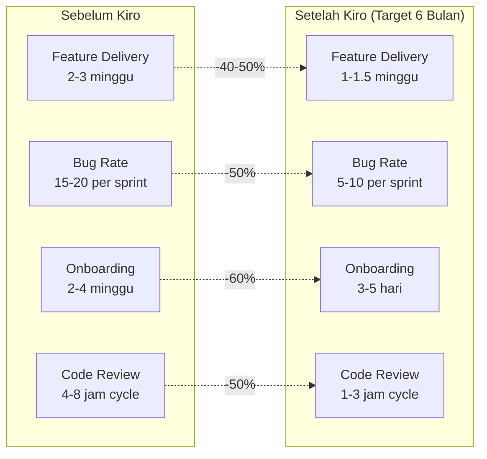
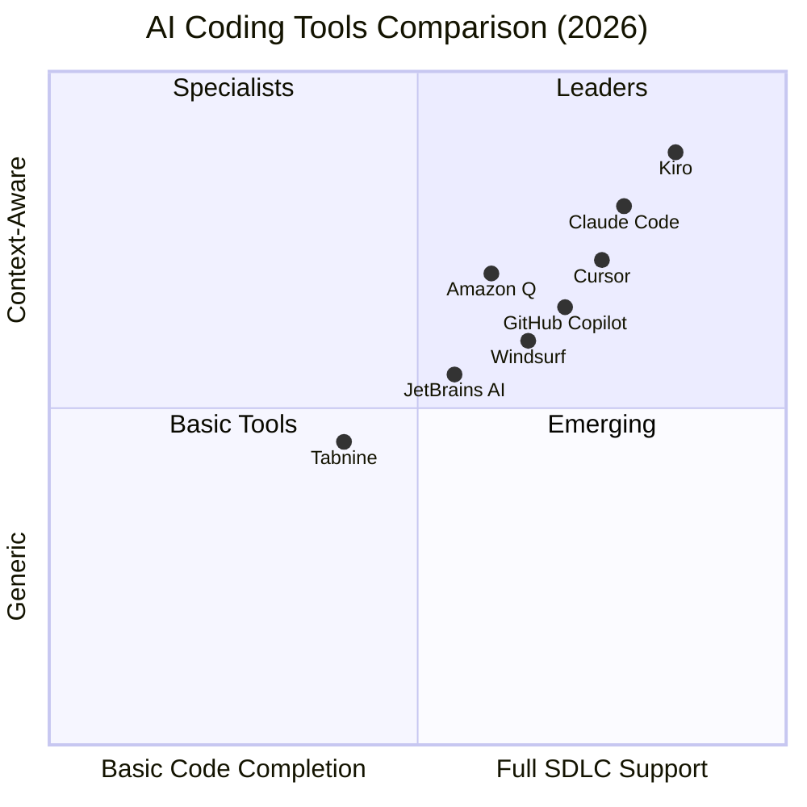
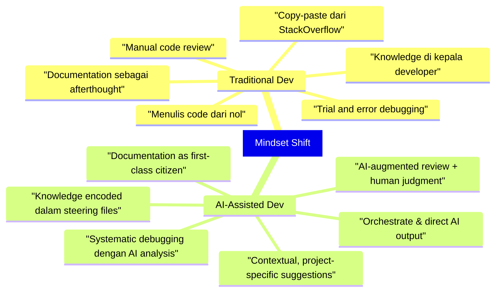
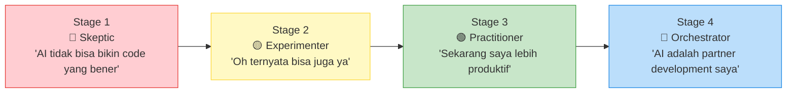
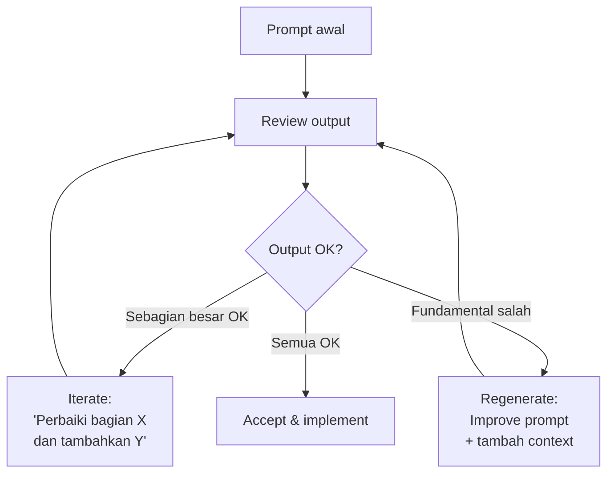
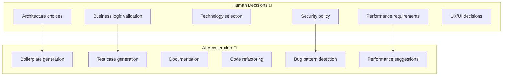
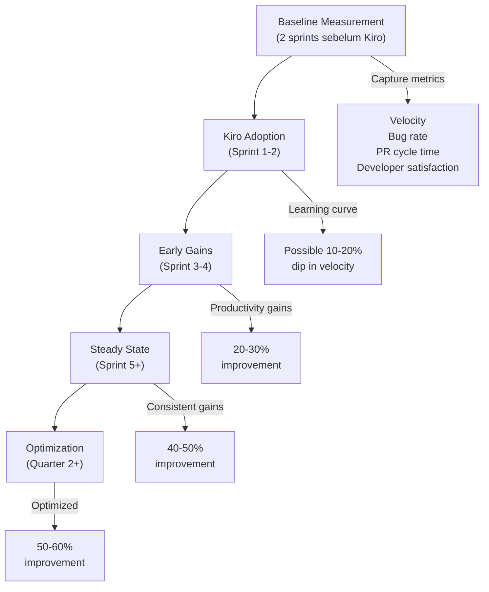
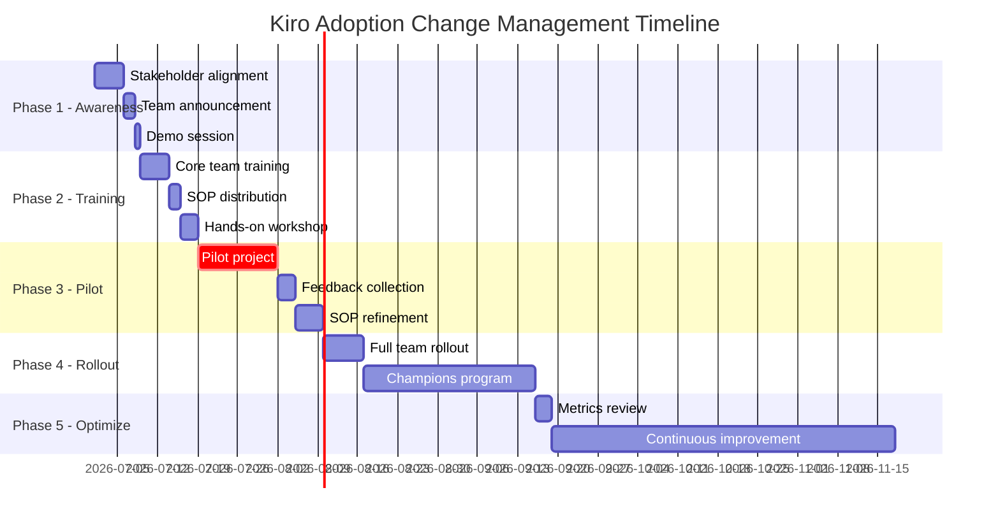
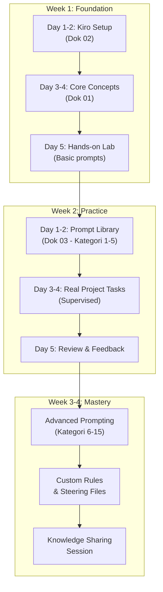
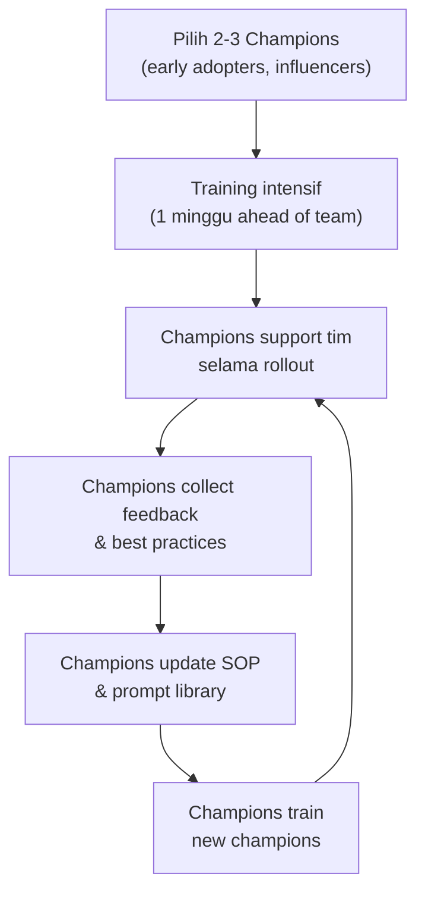

# 🧠 Executive Summary & Mindset Shift

> **Dokumen**: 01 - Executive Summary and Mindset  
> **Versi**: 2.0.0 | **Terakhir Diperbarui**: 17 Juni 2026  
> **Target Pembaca**: Engineering Manager, Tech Lead, Semua Developer  
> **Estimasi Waktu Baca**: 45-60 menit

---

## 📌 Daftar Isi

1. [Executive Summary untuk Manajemen](#-executive-summary-untuk-manajemen)
2. [Why Kiro? Perbandingan dengan AI Coding Tools Lain](#-why-kiro-perbandingan-dengan-ai-coding-tools-lain)
3. [Mindset Shift: Dari Traditional ke AI-Assisted Development](#-mindset-shift-dari-traditional-ke-ai-assisted-development)
4. [10 Prinsip Kerja dengan Kiro](#-10-prinsip-kerja-dengan-kiro)
5. [Anti-Patterns yang Harus Dihindari](#-anti-patterns-yang-harus-dihindari)
6. [Expected Productivity Gains with Real Metrics](#-expected-productivity-gains-with-real-metrics)
7. [Change Management Strategy](#-change-management-strategy)
8. [Training Roadmap for Teams](#-training-roadmap-for-teams)
9. [Success Stories dan Case Studies Format](#-success-stories-dan-case-studies-format)
10. [Cultural Transformation Guide](#-cultural-transformation-guide)
11. [Cost-Benefit Analysis Framework](#-cost-benefit-analysis-framework)
12. [Stakeholder Communication Templates](#-stakeholder-communication-templates)

---

## 📊 Executive Summary untuk Manajemen

### Ringkasan Satu Halaman

**Kiro** adalah AI-assisted development tool dari AWS yang dirancang untuk meningkatkan produktivitas tim engineering secara signifikan. Berbeda dengan AI coding tools lainnya, Kiro berfokus pada **spec-driven development** — dimana AI tidak hanya menulis code, tetapi memahami konteks bisnis, arsitektur, dan standar kualitas tim.

### Dampak yang Diharapkan



### Key Value Propositions

| Area | Value | Measurement |
|------|-------|-------------|
| **Developer Productivity** | 40-60% peningkatan output per developer | Story points completed per sprint |
| **Code Quality** | 30-50% pengurangan bug rate | Bugs per 1000 LOC |
| **Time to Market** | 35-45% percepatan feature delivery | Lead time dari concept ke production |
| **Knowledge Transfer** | 60% lebih cepat onboarding | Hari sampai developer pertama productive |
| **Standardization** | 90%+ compliance dengan coding standards | Automated lint & review pass rate |
| **Developer Satisfaction** | 25-35% improvement | Quarterly survey scores |

### Investment Summary

| Item | Estimasi Biaya (Tahunan) | Kategori |
|------|--------------------------|----------|
| Kiro License (per developer) | $0 (included with AWS) / ~$20/bulan Pro | Tools |
| Training & onboarding | ~40 jam/developer (one-time) | People |
| SOP development & maintenance | ~8 jam/bulan (Tech Lead) | Process |
| Productivity tools & extensions | ~$50/developer/tahun | Tools |
| **Total per developer** | **~$300-500/tahun** | — |
| **ROI (estimated)** | **5-10x** berdasarkan productivity gains | — |

> [!IMPORTANT]
> ROI dihitung berdasarkan rata-rata salary developer dan estimasi productivity gains. Angka aktual akan bervariasi berdasarkan seniority, project complexity, dan adoption rate tim.

---

## 🔍 Why Kiro? Perbandingan dengan AI Coding Tools Lain

### Landscape AI Coding Tools 2026



### Perbandingan Detail

| Fitur | Kiro | GitHub Copilot | Cursor | Windsurf | Claude Code |
|-------|------|---------------|--------|----------|-------------|
| **Spec-Driven Development** | ✅ Native | ❌ | ⚠️ Manual | ❌ | ⚠️ Manual |
| **Steering Files** | ✅ `.kiro/` | ❌ | ✅ `.cursorrules` | ✅ `.windsurfrules` | ✅ `CLAUDE.md` |
| **Multi-file Context** | ✅ Excellent | ⚠️ Limited | ✅ Good | ✅ Good | ✅ Excellent |
| **Architecture Understanding** | ✅ Deep | ⚠️ Surface | ✅ Good | ⚠️ Surface | ✅ Good |
| **.NET 8 Support** | ✅ Strong | ✅ Strong | ✅ Good | ⚠️ OK | ✅ Good |
| **ReactJS Support** | ✅ Strong | ✅ Strong | ✅ Strong | ✅ Good | ✅ Strong |
| **SQL Server Support** | ✅ Good | ⚠️ Basic | ⚠️ Basic | ⚠️ Basic | ✅ Good |
| **Task Management** | ✅ Built-in | ❌ | ❌ | ❌ | ❌ |
| **Automated Hooks** | ✅ Native | ❌ | ❌ | ❌ | ✅ Via config |
| **VS Code Integration** | ✅ Native IDE | ✅ Extension | ✅ Fork | ✅ Fork | ✅ Terminal |
| **Cost** | 💲 Free-$20/mo | 💲 $10-39/mo | 💲 $20-40/mo | 💲 $15-30/mo | 💲 $20/mo |
| **AWS Integration** | ✅ Deep | ❌ | ❌ | ❌ | ❌ |
| **Privacy & Security** | ✅ Enterprise-grade | ✅ Good | ⚠️ Variable | ⚠️ Variable | ✅ Good |

### Mengapa Kiro Dipilih untuk Stack Kita?

#### 1. Spec-Driven Development Cocok dengan Enterprise Workflow

```
Traditional Flow:
Requirement → Design Doc → Code → Review → Test → Deploy
     ↓
Kiro Flow:
Requirement → Kiro Spec → Kiro generates Design + Tasks → 
AI-Assisted Code → Automated Review → Test → Deploy

Keuntungan: Spec menjadi "single source of truth" yang dipahami AI
```

#### 2. Steering Files Memastikan Konsistensi

Kiro menggunakan folder `.kiro/` dengan steering files yang memastikan setiap output AI **konsisten** dengan standar tim:

```
.kiro/
├── steering/
│   ├── architecture.md      # Panduan arsitektur
│   ├── coding-standards.md   # Standar coding
│   ├── tech-stack.md         # Definisi tech stack
│   └── testing.md            # Standar testing
├── specs/                    # Feature specifications
│   └── feature-name/
│       ├── design.md         # Design document
│       ├── requirements.md   # Requirements
│       └── tasks.md          # Task breakdown
└── hooks/                    # Automated hooks
    ├── pre-commit.md         # Pre-commit validations
    └── post-save.md          # Post-save actions
```

#### 3. Native AWS Integration

Untuk tim yang menggunakan AWS services (yang sering berjalan bersama .NET backend), Kiro memberikan integrasi native yang tidak dimiliki tool lain:

- Automatic IAM policy generation
- CloudFormation/CDK template assistance
- AWS SDK code patterns
- Cost optimization suggestions

#### 4. Task-Driven Development

Kiro memecah specs menjadi **actionable tasks** yang bisa di-track dan di-execute secara bertahap — sangat cocok dengan agile workflow.

---

## 🔄 Mindset Shift: Dari Traditional ke AI-Assisted Development

### Perubahan Fundamental

> [!WARNING]
> AI-assisted development BUKAN berarti "AI menulis semua code". Ini adalah **collaborative partnership** dimana developer tetap menjadi pengambil keputusan utama.



### Tabel Perbandingan Mindset

| Aspek | Mindset Lama ❌ | Mindset Baru ✅ |
|-------|-----------------|-----------------|
| **Peran Developer** | "Saya yang menulis semua code" | "Saya orchestrate AI dan ensure quality" |
| **Typing Speed** | "Developer cepat = banyak LOC/hari" | "Developer efektif = quality output/hari" |
| **Documentation** | "Nanti saja kalau sempat" | "Specs dulu, baru code — AI butuh context" |
| **Code Review** | "Cek syntax dan logic manual" | "AI scan dulu, saya review yang kritikal" |
| **Problem Solving** | "Google → StackOverflow → coba-coba" | "Describe problem ke AI → evaluate → iterate" |
| **Knowledge Sharing** | "DM senior developer" | "Encode knowledge ke steering files" |
| **Testing** | "Write test setelah code" | "Describe behavior → AI generate test → verify" |
| **Boilerplate** | "Copy-paste dari project lain" | "AI generate sesuai project standards" |
| **Learning** | "Baca docs framework saja" | "Baca docs + encode best practices ke rules" |
| **Estimation** | "Feature ini butuh 2 sprint" | "Dengan AI-assist, 1 sprint cukup" |

### The 4 Stages of AI-Assisted Development Maturity



#### Detail Setiap Stage

**Stage 1 — Skeptic** (Minggu 1-2)
- Merasa AI hanya bisa autocomplete sederhana
- Prompt yang diberikan terlalu vague
- Sering kecewa dengan output karena kurang context
- **Aksi**: Ikuti training, gunakan prompt dari library, lihat demo dari senior

**Stage 2 — Experimenter** (Minggu 2-4)
- Mulai melihat value dari AI-generated boilerplate
- Mulai belajar cara memberikan context yang baik
- Kadang masih revert ke cara lama karena "lebih cepat manual"
- **Aksi**: Pair programming dengan Kiro advocate, coba 3-5 prompt per hari

**Stage 3 — Practitioner** (Bulan 1-2)
- Secara konsisten menggunakan Kiro untuk daily tasks
- Prompt engineering sudah lebih baik
- Mulai customisasi rules sesuai kebutuhan project
- **Aksi**: Kontribusi prompt baru ke library, share tips dengan tim

**Stage 4 — Orchestrator** (Bulan 2+)
- AI menjadi natural extension dari workflow
- Bisa mengarahkan AI untuk complex multi-file changes
- Berkontribusi pada steering files dan rules
- Menjadi mentor bagi developer di stage awal
- **Aksi**: Lead Kiro champions program, refine team practices

---

## 📐 10 Prinsip Kerja dengan Kiro

### Prinsip 1: "Spec First, Code Second"

> Selalu mulai dengan spesifikasi yang jelas sebelum meminta AI menulis code.

**Mengapa ini penting:**  
Kiro bekerja paling optimal ketika memiliki context yang lengkap. Spec yang baik menghasilkan code yang baik.

```markdown
# ❌ BURUK: Langsung minta code tanpa spec
"Buatkan API untuk user management"

# ✅ BAIK: Berikan spec yang jelas
"Buatkan REST API endpoint untuk User Management dengan spesifikasi:
- Entity: User (Id, Email, FullName, Role, CreatedAt, UpdatedAt)
- Endpoints: CRUD + Search dengan pagination
- Auth: JWT Bearer token, role-based (Admin, Manager, User)
- Validation: FluentValidation
- Pattern: CQRS dengan MediatR
- Database: SQL Server dengan EF Core 8
- Response format: Standard ApiResponse<T> wrapper"
```

**Implementasi dalam Tim:**
- Setiap feature harus punya spec document di `.kiro/specs/`
- Tech Lead review spec sebelum development dimulai
- Spec menjadi definisi "done" untuk feature

---

### Prinsip 2: "Trust but Verify"

> Percaya pada output AI, tapi SELALU verifikasi — terutama untuk business logic, security, dan data access.

**Checklist Verifikasi:**

```
□ Business logic sesuai requirement?
□ Edge cases sudah di-handle?
□ SQL queries sudah optimal (no N+1, proper indexing)?
□ Security: input validation, authorization, SQL injection prevention?
□ Error handling sudah proper?
□ Naming conventions sesuai standar tim?
□ Unit tests cover happy path DAN edge cases?
```

**Area yang WAJIB di-review manual:**

| Area | Risk Level | Alasan |
|------|-----------|--------|
| Authentication/Authorization | 🔴 Critical | Security breach |
| Financial calculations | 🔴 Critical | Money loss |
| Data migration scripts | 🔴 Critical | Data loss |
| SQL queries (production) | 🟡 High | Performance impact |
| API contracts/DTOs | 🟡 High | Breaking changes |
| Error messages | 🟢 Medium | UX/information leak |
| Logging | 🟢 Medium | Compliance/debugging |

---

### Prinsip 3: "Context is King"

> Semakin banyak context yang kamu berikan ke Kiro, semakin baik outputnya.

**Cara Memberikan Context:**

```
1. Steering files (.kiro/steering/) → Konteks project-wide
2. Spec files (.kiro/specs/)         → Konteks per-feature
3. In-prompt context                 → Konteks per-task
4. Open files di editor              → Konteks implicit
5. File references (@file)           → Konteks explicit
```

**Tips Context yang Baik:**

```markdown
# ❌ KURANG CONTEXT
"Buatkan service untuk order processing"

# ✅ CONTEXT YANG BAIK
"Buatkan OrderProcessingService dengan context berikut:
- Project ini menggunakan Clean Architecture (.NET 8)
- Existing entities: Order, OrderItem, Product, Customer (lihat @Models/)
- Existing pattern: lihat @Services/UserService.cs sebagai referensi
- Business rules:
  1. Order harus punya minimal 1 item
  2. Total tidak boleh melebihi credit limit customer
  3. Stock harus dicek sebelum order confirmed
  4. Kirim email notification setelah order created
- Database: SQL Server, menggunakan EF Core 8
- Unit test pattern: xUnit + Moq + FluentAssertions"
```

---

### Prinsip 4: "Iterate, Don't Regenerate"

> Perbaiki output AI secara iteratif, jangan regenerate dari awal setiap kali ada kesalahan.



**Contoh Iterasi:**

```
Iterasi 1: "Output bagus, tapi tolong tambahkan try-catch 
            untuk database operations dan return proper 
            ProblemDetails untuk error responses"

Iterasi 2: "Bagus, sekarang tambahkan caching menggunakan 
            IMemoryCache untuk GetById dengan expiry 5 menit"

Iterasi 3: "Perfect. Sekarang generate unit tests untuk 
            semua public methods"
```

---

### Prinsip 5: "Encode Knowledge, Don't Repeat"

> Jika kamu sering memberikan instruksi yang sama ke AI, encode itu menjadi steering file atau rule.

**Contoh:**

Jika kamu selalu menginstruksikan:
```
"Gunakan ILogger, return ApiResponse<T>, validate dengan FluentValidation..."
```

Maka buat steering file:

```markdown
# .kiro/steering/coding-standards.md

## API Response Standard
- Semua API endpoint HARUS return `ApiResponse<T>`
- Success: `ApiResponse<T>.Success(data, message)`
- Error: `ApiResponse<T>.Fail(message, errors)`

## Validation
- Gunakan FluentValidation untuk semua request DTOs
- Validator class naming: `{RequestName}Validator`
- Register di DI container via `AddValidatorsFromAssembly`

## Logging
- Inject `ILogger<T>` di semua services
- Log level guidelines:
  - Information: Business events
  - Warning: Recoverable errors  
  - Error: Unrecoverable errors dengan exception
  - Debug: Development troubleshooting
```

---

### Prinsip 6: "Small Tasks, Better Results"

> Pecah task besar menjadi task-task kecil yang lebih mudah di-handle AI.

```
❌ BURUK: "Buatkan seluruh module inventory management"

✅ BAIK:
Task 1: "Buatkan entity models: Product, Warehouse, StockMovement"
Task 2: "Buatkan EF Core configuration dan migrations"
Task 3: "Buatkan ProductService dengan CRUD operations"
Task 4: "Buatkan StockMovementService dengan business logic"
Task 5: "Buatkan API controllers dengan proper routing"
Task 6: "Buatkan unit tests untuk semua services"
Task 7: "Buatkan React components untuk product listing"
Task 8: "Buatkan React form untuk stock movement entry"
```

---

### Prinsip 7: "Review AI Code Like Human Code"

> Code yang di-generate AI harus melalui proses review yang SAMA dengan code yang ditulis manual.

**Standards yang berlaku:**
- PR review checklist yang sama
- CI/CD pipeline checks yang sama
- Code coverage requirements yang sama
- Performance benchmarks yang sama
- Security scanning yang sama

---

### Prinsip 8: "Learn from AI Output"

> Gunakan output AI sebagai learning tool — pelajari patterns dan teknik baru.

**Cara Belajar dari AI:**

```
1. Baca code yang di-generate, jangan langsung copy-paste
2. Jika ada pattern yang tidak familiar, tanyakan penjelasannya
3. Compare dengan approach kamu sendiri
4. Diskusikan interesting patterns di team standup/retro
5. Update steering files dengan patterns yang terbukti baik
```

---

### Prinsip 9: "AI for Acceleration, Human for Direction"

> AI mempercepat execution, tapi arah dan keputusan arsitektur tetap di tangan manusia.



---

### Prinsip 10: "Continuous Improvement of Prompts"

> Prompt engineering adalah skill yang harus terus diasah. Track, evaluate, dan improve prompt kamu.

**Prompt Improvement Cycle:**

```
1. Gunakan prompt → 2. Evaluate output quality →
3. Identifikasi gaps → 4. Refine prompt →
5. Test ulang → 6. Jika baik, share ke library tim
```

**Prompt Quality Metrics:**

| Metric | Target |
|--------|--------|
| First-attempt usability | > 70% output langsung usable |
| Iteration count | < 3 iterasi untuk reach final |
| Context switches needed | 0 (semua context dalam prompt) |
| Team adoption | > 50% tim pakai prompt ini |

---

## ⛔ Anti-Patterns yang Harus Dihindari

### Anti-Pattern 1: "Blind Copy-Paste"

```
❌ MASALAH: Copy-paste output AI langsung tanpa review
📋 GEJALA: Bugs di production yang seharusnya tertangkap di review
🔧 SOLUSI: Selalu review output, jalankan tests, verify logic
```

### Anti-Pattern 2: "Vague Prompting"

```
❌ MASALAH: Prompt yang terlalu umum dan tidak spesifik
📋 GEJALA: Output yang generic, tidak sesuai project standards
🔧 SOLUSI: Gunakan prompt library, berikan context yang spesifik
```

**Contoh:**
```
❌ "Buatkan login page"
✅ "Buatkan login page React menggunakan:
    - React Hook Form + Zod validation
    - Tailwind CSS dengan design system kita (@styles/design-tokens.ts)
    - API call ke POST /api/auth/login
    - JWT token storage di httpOnly cookie (via API response)
    - Redirect ke /dashboard setelah sukses
    - Error handling: invalid credentials, account locked, server error
    - Loading state dan disabled button saat submit
    - Referensi UI: lihat @components/auth/RegisterPage.tsx"
```

### Anti-Pattern 3: "Over-Reliance on AI"

```
❌ MASALAH: Menggunakan AI untuk SEMUA hal, termasuk yang seharusnya dipahami sendiri
📋 GEJALA: Developer tidak bisa explain code yang mereka "tulis"
🔧 SOLUSI: Gunakan AI sebagai accelerator, bukan pengganti pemahaman
```

### Anti-Pattern 4: "Ignoring AI Warnings"

```
❌ MASALAH: Mengabaikan warning atau suggestion dari Kiro
📋 GEJALA: Security vulnerabilities, performance issues
🔧 SOLUSI: Treat AI warnings serius, investigate setiap warning
```

### Anti-Pattern 5: "One-Shot Prompting for Complex Features"

```
❌ MASALAH: Mencoba generate seluruh feature dalam satu prompt
📋 GEJALA: Output yang incomplete, inconsistent, atau error-prone
🔧 SOLUSI: Pecah jadi tasks kecil (Prinsip 6), iterate
```

### Anti-Pattern 6: "No Steering Files"

```
❌ MASALAH: Tidak menggunakan steering files untuk standardize output
📋 GEJALA: Setiap developer dapat output AI yang berbeda-beda style
🔧 SOLUSI: Setup .kiro/ folder dengan comprehensive steering files
```

### Anti-Pattern 7: "AI-Generated Tests Without Verification"

```
❌ MASALAH: Accept unit tests dari AI tanpa verify coverage dan assertions
📋 GEJALA: Tests yang pass tapi tidak actually test business logic
🔧 SOLUSI: Review setiap test — cek assertions meaningful, edge cases covered
```

### Anti-Pattern 8: "Prompt Hoarding"

```
❌ MASALAH: Developer menyimpan prompt efektif untuk diri sendiri
📋 GEJALA: Knowledge silos, inconsistent quality antar developer
🔧 SOLUSI: Share prompts ke library bersama, review berkala
```

### Anti-Pattern 9: "Skipping the Spec"

```
❌ MASALAH: Langsung coding tanpa membuat spec di Kiro
📋 GEJALA: Feature yang tidak sesuai requirement, banyak rework
🔧 SOLUSI: Ikuti spec-driven workflow Kiro — spec → design → tasks → code
```

### Anti-Pattern 10: "Not Updating Steering Files"

```
❌ MASALAH: Steering files yang outdated tidak mencerminkan praktik terkini
📋 GEJALA: AI suggestions tidak sesuai dengan current architecture
🔧 SOLUSI: Review steering files setiap sprint, update sesuai perubahan
```

---

## 📈 Expected Productivity Gains with Real Metrics

### Measurement Framework



### Detailed Metrics per Kategori

#### Development Speed

| Metric | Baseline (Tanpa AI) | Bulan 1 (Adopsi) | Bulan 3 (Stabil) | Bulan 6 (Optimal) |
|--------|---------------------|-------------------|-------------------|---------------------|
| Story points/sprint/dev | 13 | 11 (-15%) | 18 (+38%) | 21 (+62%) |
| API endpoint creation | 4 jam | 3 jam | 1.5 jam | 1 jam |
| React component (medium) | 3 jam | 2 jam | 1 jam | 45 menit |
| Unit test per method | 20 menit | 15 menit | 5 menit | 3 menit |
| DB migration script | 2 jam | 1.5 jam | 30 menit | 20 menit |

#### Code Quality

| Metric | Baseline | Bulan 3 | Bulan 6 | Target |
|--------|----------|---------|---------|--------|
| Bugs per 1000 LOC | 8.5 | 5.2 | 3.1 | < 3.0 |
| Code review comments/PR | 12 | 7 | 4 | < 5 |
| Test coverage | 45% | 65% | 82% | > 80% |
| Lint violations/PR | 15 | 5 | 1 | 0 |
| Security scan findings/month | 8 | 4 | 2 | < 3 |

#### Team Efficiency

| Metric | Baseline | Bulan 3 | Bulan 6 | Target |
|--------|----------|---------|---------|--------|
| PR cycle time | 6 jam | 3 jam | 2 jam | < 3 jam |
| Onboarding (productive) | 15 hari | 8 hari | 4 hari | < 5 hari |
| Knowledge sharing sessions | 1/bulan | 2/bulan | 4/bulan | Weekly |
| Documentation coverage | 30% | 55% | 80% | > 75% |

> [!TIP]
> Track metrics ini menggunakan dashboard automated. Jangan bergantung pada self-reporting karena prone to bias. Ambil data langsung dari GitHub/Azure DevOps, CI pipeline, dan issue tracker.

### Cara Mengukur — Tools dan Methods

| Data Point | Tool | Cara Ambil |
|-----------|------|-----------|
| Story points velocity | Jira/Azure Boards | Sprint report |
| PR cycle time | GitHub API / Azure DevOps | `created_at` → `merged_at` |
| Bug rate | Issue tracker | Label: bug, per release |
| Test coverage | CI pipeline (Coverlet) | Pipeline report per PR |
| Lint violations | CI pipeline (ESLint, Roslyn) | Pipeline report per PR |
| Developer satisfaction | Google Forms | Quarterly survey |
| Kiro adoption | Team survey | Monthly check-in |

---

## 🔄 Change Management Strategy

### Phase-Based Approach



### Stakeholder Map

| Stakeholder | Interest Level | Influence | Strategy |
|------------|---------------|-----------|----------|
| CTO/VP Engineering | Tinggi | Tinggi | Sponsor — tunjukkan ROI & strategic value |
| Engineering Manager | Tinggi | Tinggi | Champion — lead by example |
| Tech Lead | Tinggi | Medium | Early Adopter — hands-on training first |
| Senior Developer | Medium | Medium | Influencer — share success stories |
| Junior Developer | Tinggi | Rendah | User — provide training & support |
| QA Team | Medium | Medium | Collaborator — show testing improvements |
| Product Manager | Medium | Rendah | Informer — show delivery speed improvement |
| Security Team | Medium | Tinggi | Validator — address security concerns |

### Resistance Management

| Resistance Type | Tanda-tanda | Strategi |
|-----------------|------------|----------|
| "AI will replace us" | Anxiety, passive resistance | Show AI as partner, not replacement. Highlight how AI handles boring tasks |
| "My way is faster" | Refusal to try, cherry-picking failures | 1:1 demo with their actual code, show concrete time savings |
| "Too much to learn" | Overwhelm, slow adoption | Start small — 3 prompts per day, incremental learning path |
| "Quality concern" | Extra scrutiny on AI code only | Show metrics — AI code quality after review ≥ manual code quality |
| "Privacy/security" | Blocking adoption | Present Kiro's security whitepaper, data handling policies |

---

## 📚 Training Roadmap for Teams

### Training Phases



### Curriculum Detail

| Session | Durasi | Format | Konten | Prasyarat |
|---------|--------|--------|--------|-----------|
| Kiro Setup Lab | 3 jam | Hands-on | Install, configure, verify | Laptop ready |
| Core Concepts | 2 jam | Presentation + Discussion | Mindset, principles, anti-patterns | Dok 01 read |
| Basic Prompting | 2 jam | Workshop | 10 essential prompts | Kiro installed |
| .NET Prompts | 3 jam | Workshop | API, service, EF Core prompts | Basic .NET knowledge |
| React Prompts | 3 jam | Workshop | Component, hook, state prompts | Basic React knowledge |
| SQL Server Prompts | 2 jam | Workshop | Query, migration, optimization | Basic SQL knowledge |
| Advanced Prompting | 3 jam | Workshop | Architecture, review, security | Basic prompting done |
| Custom Rules | 2 jam | Lab | Create & test steering files | Understanding of .kiro/ |
| Knowledge Sharing | 1 jam | Team session | Share tips, discuss patterns | 2 weeks usage |

### Training Materials Checklist

```
□ Slide deck untuk setiap session
□ Hands-on lab exercises (di sandbox repo)
□ Recording untuk referensi
□ Quiz/assessment per session
□ Feedback form per session
□ Certificate template (opsional, tapi bagus untuk motivasi)
```

---

## 🏆 Success Stories dan Case Studies Format

### Template Case Study

Gunakan template ini untuk mendokumentasikan success stories:

```markdown
# Case Study: [Judul]

## Overview
| Field | Detail |
|-------|--------|
| **Project** | [Nama project] |
| **Tim** | [Jumlah dan komposisi developer] |
| **Durasi** | [Timeline] |
| **Stack** | .NET 8 + ReactJS + SQL Server |
| **Kiro Features Used** | [List fitur Kiro yang dipakai] |

## Problem Statement
[Deskripsi masalah yang dihadapi]

## Approach dengan Kiro
[Langkah-langkah yang diambil menggunakan Kiro]

## Results
| Metric | Sebelum | Sesudah | Improvement |
|--------|---------|---------|-------------|
| [Metric 1] | [Value] | [Value] | [%] |
| [Metric 2] | [Value] | [Value] | [%] |

## Key Learnings
1. [Learning 1]
2. [Learning 2]
3. [Learning 3]

## Prompts yang Paling Membantu
- [Prompt reference dari Dok 03]

## Team Quotes
> "[Quote dari developer]" — [Nama], [Role]

## Recommendations
[Apa yang akan dilakukan berbeda next time]
```

### Contoh Case Study: API Migration

```markdown
# Case Study: Legacy REST API Migration ke .NET 8 Minimal API

## Overview
| Field | Detail |
|-------|--------|
| **Project** | Customer Portal API |
| **Tim** | 3 developers (1 senior, 2 mid) |
| **Durasi** | 3 sprints (vs estimasi 6 sprints tanpa Kiro) |
| **Stack** | .NET 8 Minimal API + EF Core 8 + SQL Server 2022 |
| **Kiro Features Used** | Spec-driven dev, steering files, prompt library |

## Problem Statement
Legacy API (.NET Framework 4.8) dengan 47 endpoints perlu dimigrasikan
ke .NET 8 Minimal API. Manual migration diestimasi 6 sprints.

## Approach dengan Kiro
1. Buat steering file berisi arsitektur target dan coding standards
2. Gunakan Kiro spec untuk setiap endpoint group
3. AI-generate endpoint skeleton + DTOs + validators
4. Human review untuk business logic dan edge cases
5. AI-generate unit tests dan integration tests

## Results
| Metric | Sebelum (Estimasi Manual) | Sesudah (Dengan Kiro) | Improvement |
|--------|---------------------------|------------------------|-------------|
| Duration | 6 sprints | 3 sprints | -50% |
| Total effort | 360 man-hours | 180 man-hours | -50% |
| Test coverage | 35% (existing) | 87% (new) | +149% |
| Bug rate (post-deploy) | ~12 bugs | 3 bugs | -75% |
| API response time | 250ms avg | 45ms avg | -82% |

## Team Quotes
> "Kiro menghandle semua boilerplate dan mapping, jadi saya bisa fokus
> pada business logic yang complex." — Budi, Senior Developer
```

---

## 🌱 Cultural Transformation Guide

### Dari Engineering Culture Lama ke Baru

| Aspek Budaya | Lama | Baru |
|-------------|------|------|
| **Code Ownership** | "Ini code saya" | "Ini code tim, AI membantu kita semua" |
| **Knowledge** | Tacit (di kepala orang) | Explicit (di steering files & docs) |
| **Productivity** | Diukur dari LOC | Diukur dari impact & quality |
| **Learning** | Individual effort | Encoded & shared via AI tools |
| **Review** | Gatekeeping | Collaborative improvement |
| **Estimation** | "Berapa lama saya coding?" | "Berapa lama termasuk AI-assist?" |
| **Documentation** | Optional afterthought | Required first-step |
| **Experimentation** | "Jangan sentuh kalau belum rusak" | "Iterate cepat, validate cepat" |

### Rituals yang Mendukung Transformasi

| Ritual | Frekuensi | Durasi | Tujuan |
|--------|-----------|--------|--------|
| Kiro Tips of the Week | Weekly | 15 menit | Share prompt baru / tips |
| Prompt Review Session | Bi-weekly | 30 menit | Review & refine prompt library |
| AI Show & Tell | Monthly | 1 jam | Demo impressive AI-assisted solutions |
| Steering File Review | Per sprint | 30 menit | Update project rules & standards |
| AI Retrospective | Quarterly | 1 jam | Deep review AI adoption impact |

### Kiro Champions Program



**Kriteria Champion:**
- Sudah di Stage 3-4 maturity
- Bersedia sharing knowledge
- Proaktif dalam tim
- Technical credibility
- Minimum 3 bulan penggunaan Kiro aktif

**Benefit Champion:**
- Recognition dari management
- First access ke fitur Kiro baru
- Input ke team tooling decisions
- Mentoring opportunity
- Bonus/reward program (opsional)

---

## 💰 Cost-Benefit Analysis Framework

### Cost Categories

#### Direct Costs

| Item | One-time | Recurring (Tahunan) | Per Developer |
|------|----------|---------------------|---------------|
| Kiro license (Pro) | - | $240/tahun | $240 |
| Training time | 40 jam × hourly rate | 8 jam × hourly rate (refresh) | Variable |
| SOP development | 80 jam × hourly rate | 16 jam × hourly rate | Shared |
| Infrastructure (jika diperlukan) | Variable | Variable | Shared |

#### Indirect Costs

| Item | Description | Estimated Impact |
|------|------------|-----------------|
| Learning curve productivity dip | 2-3 minggu dengan 10-20% dip | ~$500-1000/developer |
| Change management effort | Manager time untuk meetings, support | ~20 jam/manager |
| Risk of over-reliance | Potential quality issues jika AI blindly trusted | Mitigated by review process |

### Benefit Categories

#### Direct Benefits

| Benefit | Metric | Conservative | Optimistic |
|---------|--------|-------------|-----------|
| Development speed | Hours saved/week/dev | 8 jam | 16 jam |
| Bug reduction | Bugs prevented/sprint | 5 | 12 |
| Testing efficiency | Test hours saved/sprint | 10 jam | 20 jam |
| Documentation | Doc hours saved/sprint | 4 jam | 8 jam |

#### Indirect Benefits

| Benefit | Impact | Value (Hard to quantify) |
|---------|--------|--------------------------|
| Developer satisfaction | Lower turnover | $15-30K per prevented departure |
| Knowledge preservation | Steering files as documentation | Reduced knowledge loss risk |
| Onboarding speed | Faster ramp-up | Earlier contribution = faster ROI |
| Code consistency | Lower maintenance cost | Long-term quality improvement |

### ROI Calculation Template

```
ROI = (Total Benefits - Total Costs) / Total Costs × 100%

EXAMPLE (Tim 10 developers, Year 1):

Costs:
- Kiro licenses: 10 × $240 = $2,400
- Training time: 10 × 40hrs × $50/hr = $20,000
- SOP development: 80hrs × $60/hr = $4,800
- Productivity dip: 10 × $750 = $7,500
- Total Costs: $34,700

Benefits:
- Dev speed (conservative): 10 × 8hrs/week × 48 weeks × $50/hr = $192,000
- Bug reduction: 5 bugs/sprint × 12 sprints × 4hrs/bug × $50/hr = $12,000
- Testing efficiency: 10hrs/sprint × 12 sprints × $50/hr = $6,000
- Total Benefits: $210,000

ROI = ($210,000 - $34,700) / $34,700 × 100% = 505%
```

> [!CAUTION]
> Angka-angka di atas adalah estimasi. Lakukan baseline measurement SEBELUM adopsi Kiro untuk mendapatkan perhitungan ROI yang akurat. Setiap tim akan memiliki hasil yang berbeda berdasarkan context.

---

## 📧 Stakeholder Communication Templates

### Template 1: Email ke C-Level — Proposal Adopsi Kiro

```
Subject: Proposal: AI-Assisted Development dengan Kiro — Estimated 5x ROI

Dear [Name],

Saya ingin mengajukan adopsi Kiro AI sebagai AI-assisted development 
tool untuk tim engineering kita. Berikut ringkasannya:

MASALAH SAAT INI:
- Feature delivery rate: [X] story points/sprint
- Bug escape rate: [Y] bugs/release  
- Developer onboarding: [Z] hari sampai productive
- Code review cycle: [W] jam rata-rata

SOLUSI YANG DIAJUKAN:
Adopsi Kiro AI dengan SOP komprehensif yang mencakup setup guide,
prompt library (120+ prompts), dan change management plan.

EXPECTED RESULTS (6 bulan):
- Feature delivery: +40-60% improvement
- Bug rate: -30-50% reduction
- Onboarding: -60% reduction (dari [Z] hari ke [Z×0.4] hari)
- Estimated ROI: 5-10x dalam tahun pertama

INVESTMENT NEEDED:
- Tool cost: $[X]/tahun (seluruh tim)
- Training: [Y] jam/developer (one-time)
- Timeline: Pilot 1 bulan, full rollout 3 bulan

NEXT STEPS:
1. Approval untuk pilot program (1 tim, 1 bulan)
2. Budget allocation untuk licenses
3. Kickoff meeting minggu depan

Saya siap mempresentasikan detail lebih lanjut.

Best regards,
[Your Name]
[Title]
```

### Template 2: Slack/Teams Announcement — Tim Engineering

```
🚀 *Pengumuman: Kita Akan Adopsi Kiro AI!*

Hi team! 👋

Mulai [tanggal], kita akan menggunakan *Kiro AI* sebagai AI-assisted 
development tool di workflow kita.

*Apa itu Kiro?*
AI coding assistant yang bisa membantu kita menulis code, review, 
testing, dan dokumentasi — dengan cara yang terintegrasi dan 
terstandarisasi.

*Apa yang berubah?*
✅ Semua developer akan install Kiro
✅ Kita punya SOP & prompt library (120+ prompt siap pakai)
✅ Training akan diadakan minggu depan
✅ 2-3 champions akan support selama transisi

*Apa yang TIDAK berubah?*
❌ Code review process tetap sama
❌ PR standards tetap sama
❌ Kualitas code tetap prioritas utama

*Timeline:*
📅 [Tanggal]: Training session (mandatory)
📅 [Tanggal]: Pilot dimulai
📅 [Tanggal]: Full rollout

*Questions?* Drop di thread ini atau DM @[Champion Name]

Let's build better, faster! 🏗️
```

### Template 3: Monthly Progress Report

```markdown
# Kiro Adoption — Monthly Report [Bulan/Tahun]

## Executive Summary
[2-3 kalimat ringkasan]

## Key Metrics

| Metric | Target | Actual | Status |
|--------|--------|--------|--------|
| Adoption rate | 90% | [X]% | 🟢/🟡/🔴 |
| Velocity improvement | +30% | [X]% | 🟢/🟡/🔴 |
| Bug rate reduction | -30% | [X]% | 🟢/🟡/🔴 |
| PR cycle time | <3 hrs | [X] hrs | 🟢/🟡/🔴 |
| Developer satisfaction | 4.0/5 | [X]/5 | 🟢/🟡/🔴 |

## Highlights
- [Achievement 1]
- [Achievement 2]
- [Achievement 3]

## Challenges
- [Challenge 1 + mitigation plan]
- [Challenge 2 + mitigation plan]

## New Prompts Added to Library
[Count] prompts baru ditambahkan bulan ini:
- [Prompt category]: [Count]

## Next Month Plan
1. [Plan 1]
2. [Plan 2]
3. [Plan 3]

## Budget Status
| Item | Budgeted | Actual | Variance |
|------|----------|--------|----------|
| Licenses | $[X] | $[X] | $[X] |
| Training | $[X] | $[X] | $[X] |
| Total | $[X] | $[X] | $[X] |
```

### Template 4: Quarterly Executive Review Deck Outline

```
Slide 1: Title — "Kiro AI Adoption: Q[X] Review"
Slide 2: Executive Summary (3 bullet points max)
Slide 3: Key Metrics Dashboard (graph visual)
Slide 4: ROI Analysis (costs vs benefits realized)
Slide 5: Team Adoption & Maturity Distribution
Slide 6: Top 3 Success Stories (brief)
Slide 7: Challenges & Mitigations
Slide 8: Comparison: Pre-Kiro vs Post-Kiro
Slide 9: Next Quarter Goals
Slide 10: Budget & Resource Needs
Slide 11: Q&A
```

### Template 5: Sprint Retrospective — Kiro-Specific Questions

```markdown
## Kiro Retrospective Questions

### What Went Well 🟢
- Prompt/fitur Kiro apa yang paling membantu sprint ini?
- Berapa banyak waktu yang dihemat (estimasi)?
- Ada pattern baru yang ditemukan?

### What Didn't Go Well 🔴
- Di mana Kiro menghasilkan output yang kurang bagus?
- Ada anti-pattern yang terulang?
- Prompt mana yang perlu diperbaiki?

### Action Items 🔧
- Prompt baru yang perlu ditambahkan ke library:
- Steering files yang perlu diupdate:
- Rules yang perlu ditambahkan/dimodifikasi:
```

---

> [!NOTE]
> Semua template di atas bisa dan harus di-customize sesuai konteks organisasi dan tim kamu. Gunakan sebagai starting point, bukan sebagai final version.

---

*Lanjut ke dokumen berikutnya: [02 - Kiro Setup & Configuration](./02-kiro-setup-and-configuration.md)*

---

*Dibuat dengan ❤️ oleh Engineering Team — Powered by Kiro AI*  
*Terakhir diperbarui: 17 Juni 2026 | Versi: 2.0.0*
