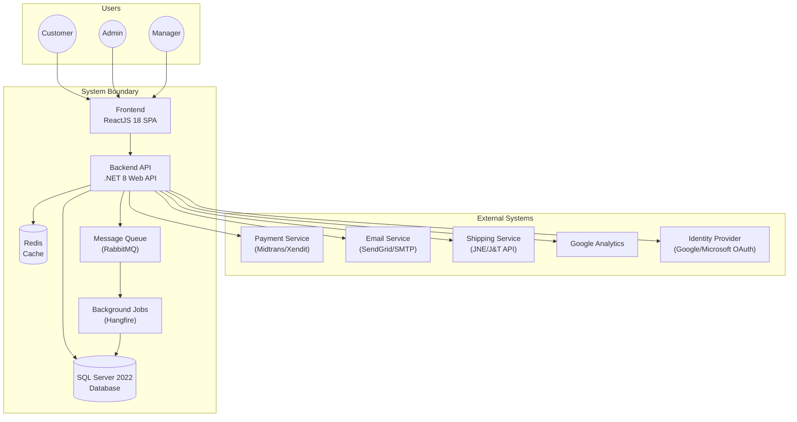
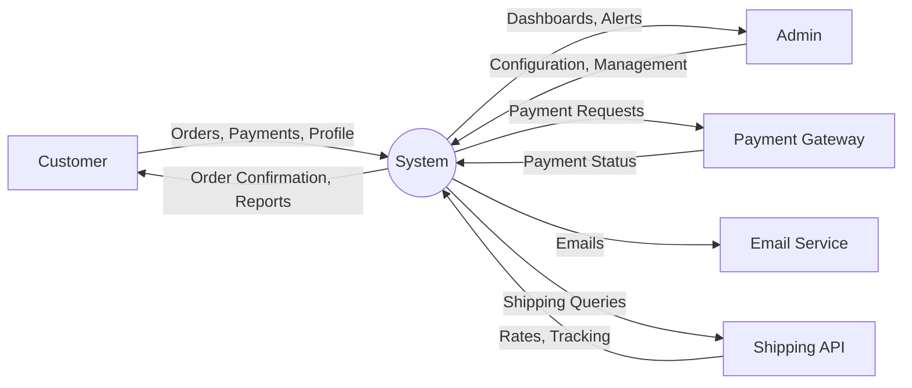
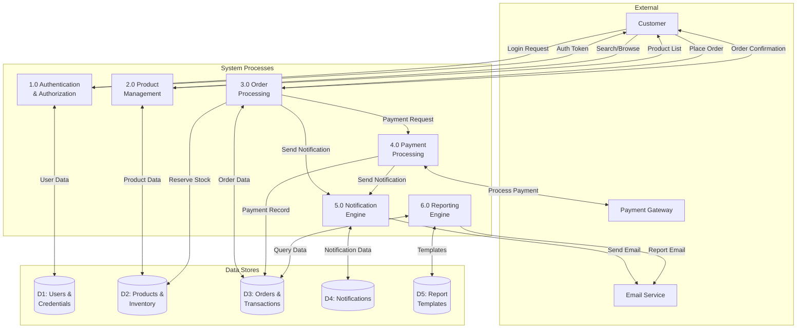
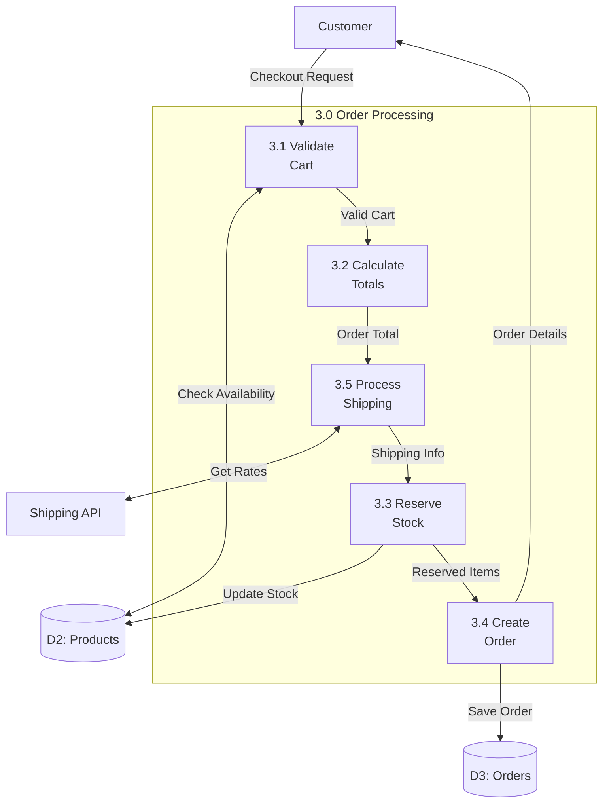
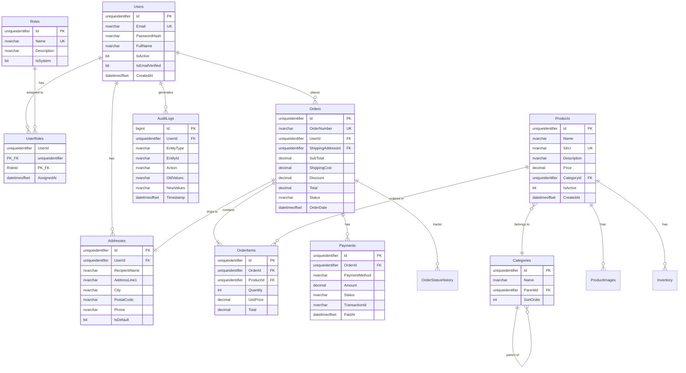
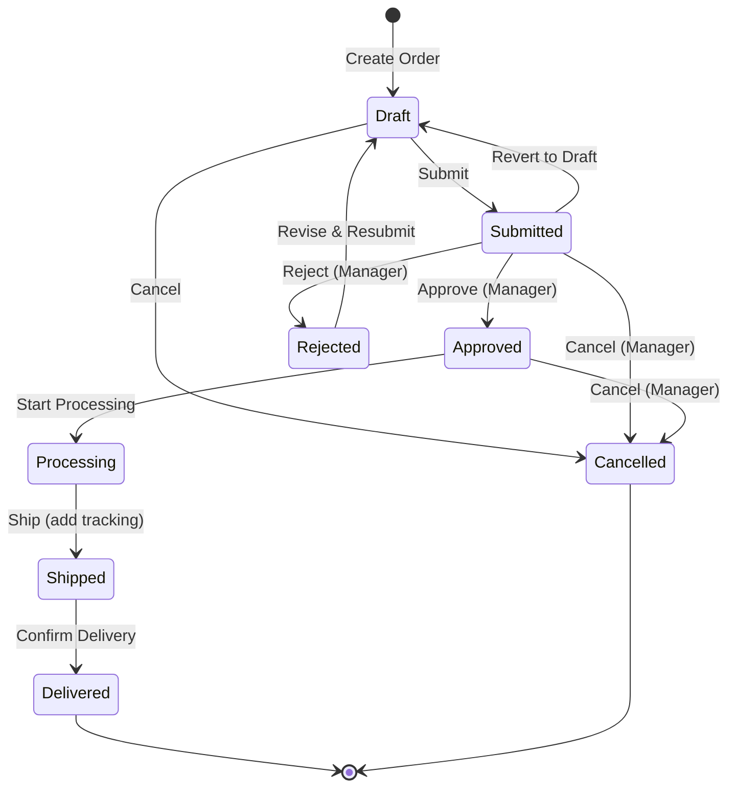

```mermaid
graph TD
    SYS["[Nama Sistem]"]

    SYS --> AUTH["Authentication &<br/>Authorization Module"]
    SYS --> USER["User Management<br/>Module"]
    SYS --> PROD["Product/Entity<br/>Management Module"]
    SYS --> ORDER["Order/Transaction<br/>Processing Module"]
    SYS --> RPT["Reporting &<br/>Analytics Module"]
    SYS --> NOTIF["Notification<br/>Module"]
    SYS --> ADMIN["Administration<br/>Module"]

    AUTH --> A1["Login/Logout"]
    AUTH --> A2["Registration"]
    AUTH --> A3["Password Management"]
    AUTH --> A4["OAuth Integration"]
    AUTH --> A5["MFA"]

    USER --> U1["Profile Management"]
    USER --> U2["Role Management"]
    USER --> U3["Preferences"]

    PROD --> P1["CRUD Operations"]
    PROD --> P2["Search & Filter"]
    PROD --> P3["Categories"]
    PROD --> P4["Media Management"]

    ORDER --> O1["Cart Management"]
    ORDER --> O2["Checkout Process"]
    ORDER --> O3["Payment Processing"]
    ORDER --> O4["Order Tracking"]

    RPT --> R1["Dashboard"]
    RPT --> R2["Report Builder"]
    RPT --> R3["Scheduled Reports"]
    RPT --> R4["Data Export"]

    NOTIF --> N1["In-App Notifications"]
    NOTIF --> N2["Email Notifications"]
    NOTIF --> N3["Push Notifications"]

    ADMIN --> AD1["System Configuration"]
    ADMIN --> AD2["Audit Logs"]
    ADMIN --> AD3["Health Monitoring"]
```

# 📄 Template: Software Requirements Specification (SRS)

> **Versi:** 2.0
> **Terakhir Diperbarui:** 2026-06-17
> **Standar Acuan:** IEEE 830-1998 (Modified)
> **Tech Stack:** .NET 8 · ReactJS 18 · SQL Server 2022
> **Maintainer:** Engineering Lead

---

## Daftar Isi

- [Bagian A — Template SRS Lengkap](#bagian-a--template-srs-lengkap)
- [Bagian B — Contoh SRS Terisi Lengkap](#bagian-b--contoh-srs-terisi-lengkap)
- [Bagian C — Traceability Matrix](#bagian-c--traceability-matrix)
- [Bagian D — Requirements Validation Checklist](#bagian-d--requirements-validation-checklist)

---

# Bagian A — Template SRS Lengkap

> [!IMPORTANT]
> SRS adalah dokumen kontrak antara business stakeholder dan engineering team. Setiap requirement HARUS testable, unambiguous, dan traceable. Gunakan template ini sebagai baseline dan sesuaikan dengan kebutuhan proyek.

## Cover Page Template

```markdown
┌──────────────────────────────────────────────────────────────┐
│                                                              │
│              SOFTWARE REQUIREMENTS SPECIFICATION             │
│                                                              │
│                    [NAMA SISTEM/PRODUK]                       │
│                                                              │
│                      Version [X.Y]                           │
│                                                              │
│──────────────────────────────────────────────────────────────│
│                                                              │
│  Document ID    : SRS-[PROJECT]-[YYYY]-[NNN]                 │
│  Prepared by    : [Nama Team/Individu]                       │
│  Organization   : [Nama Organisasi]                          │
│  Date           : [YYYY-MM-DD]                               │
│  Status         : Draft / In Review / Approved / Superseded  │
│                                                              │
│──────────────────────────────────────────────────────────────│
│                                                              │
│  CONFIDENTIALITY NOTICE                                      │
│  This document contains proprietary information.             │
│  Distribution is limited to authorized personnel only.       │
│                                                              │
│──────────────────────────────────────────────────────────────│
│                                                              │
│  Approved by:                                                │
│  ___________________  ___________  ______                    │
│  Name                 Role         Date                      │
│                                                              │
│  ___________________  ___________  ______                    │
│  Name                 Role         Date                      │
│                                                              │
│  ___________________  ___________  ______                    │
│  Name                 Role         Date                      │
│                                                              │
└──────────────────────────────────────────────────────────────┘
```

---

## Revision History Table

```markdown
| Version | Date       | Author           | Description of Changes        | Reviewed By    |
|---------|------------|------------------|-------------------------------|----------------|
| 0.1     | YYYY-MM-DD | [Author]         | Initial draft                 | -              |
| 0.2     | YYYY-MM-DD | [Author]         | Added functional requirements | [Reviewer]     |
| 0.3     | YYYY-MM-DD | [Author]         | Incorporated review feedback  | [Reviewer]     |
| 1.0     | YYYY-MM-DD | [Author]         | Baseline approved version     | [All Approvers]|
| 1.1     | YYYY-MM-DD | [Author]         | Added [specific change]       | [Reviewer]     |
```

---

## Table of Contents Template

```markdown
## Table of Contents

1. [Introduction](#1-introduction)
   1.1 [Purpose](#11-purpose)
   1.2 [Scope](#12-scope)
   1.3 [Definitions, Acronyms, and Abbreviations](#13-definitions-acronyms-and-abbreviations)
   1.4 [References](#14-references)
   1.5 [Overview](#15-overview)

2. [Overall Description](#2-overall-description)
   2.1 [Product Perspective](#21-product-perspective)
   2.2 [Product Functions](#22-product-functions)
   2.3 [User Characteristics](#23-user-characteristics)
   2.4 [Constraints](#24-constraints)
   2.5 [Assumptions and Dependencies](#25-assumptions-and-dependencies)

3. [Specific Requirements](#3-specific-requirements)
   3.1 [External Interface Requirements](#31-external-interface-requirements)
   3.2 [Functional Requirements](#32-functional-requirements)
   3.3 [Performance Requirements](#33-performance-requirements)
   3.4 [Design Constraints](#34-design-constraints)
   3.5 [Software System Attributes](#35-software-system-attributes)

4. [Data Dictionary](#4-data-dictionary)

5. [Data Flow Diagrams](#5-data-flow-diagrams)

6. [Entity Relationship Diagrams](#6-entity-relationship-diagrams)

7. [Appendices](#7-appendices)
```

---

## 1. Introduction

### 1.1 Purpose

```markdown
### 1.1 Purpose

Dokumen Software Requirements Specification (SRS) ini mendefinisikan
requirement fungsional dan non-fungsional untuk [Nama Sistem].
Dokumen ini ditujukan untuk:

- **Product Managers**: Sebagai referensi scope dan prioritas fitur
- **Development Team**: Sebagai panduan implementasi
- **QA Team**: Sebagai dasar pembuatan test cases
- **Stakeholders**: Sebagai dokumen persetujuan formal
- **Operations Team**: Sebagai referensi kebutuhan infrastruktur

Dokumen ini mengikuti standar IEEE 830-1998 dengan modifikasi untuk
konteks pengembangan Agile.
```

### 1.2 Scope

```markdown
### 1.2 Scope

**Nama Produk:** [Nama Sistem]
**Version:** [X.Y]

#### Dalam Scope
[Deskripsi lengkap tentang apa yang dicakup sistem ini]

1. [Fitur/modul 1]
2. [Fitur/modul 2]
3. [Fitur/modul 3]

#### Luar Scope
[Deskripsi eksplisit tentang apa yang TIDAK dicakup]

1. [Item luar scope 1]
2. [Item luar scope 2]

#### Benefits & Objectives
| Objective | Measurable Target | Timeline |
|-----------|-------------------|----------|
| [Obj 1]   | [Target]          | [Date]   |
| [Obj 2]   | [Target]          | [Date]   |
```

### 1.3 Definitions, Acronyms, and Abbreviations

```markdown
### 1.3 Definitions, Acronyms, and Abbreviations

| Term      | Definition                                                |
|-----------|-----------------------------------------------------------|
| API       | Application Programming Interface                        |
| CRUD      | Create, Read, Update, Delete                              |
| DTO       | Data Transfer Object                                      |
| EF Core   | Entity Framework Core - ORM for .NET                      |
| JWT       | JSON Web Token - authentication token standard            |
| MFA       | Multi-Factor Authentication                               |
| RBAC      | Role-Based Access Control                                 |
| REST      | Representational State Transfer                           |
| SPA       | Single Page Application                                   |
| SSR       | Server-Side Rendering                                     |
| TDD       | Technical Design Document                                 |
| UAT       | User Acceptance Testing                                   |
| UX        | User Experience                                           |
| [Term]    | [Project-specific definition]                             |
```

### 1.4 References

```markdown
### 1.4 References

| # | Document | Version | Date | Source |
|---|----------|---------|------|--------|
| 1 | Product Requirements Document | 1.0 | YYYY-MM-DD | [Link] |
| 2 | Technical Design Document | 1.0 | YYYY-MM-DD | [Link] |
| 3 | UI/UX Design Specification | 2.0 | YYYY-MM-DD | [Figma Link] |
| 4 | API Design Guidelines | 1.0 | YYYY-MM-DD | [Link] |
| 5 | Database Schema Document | 1.0 | YYYY-MM-DD | [Link] |
| 6 | Security Requirements | 1.0 | YYYY-MM-DD | [Link] |
| 7 | .NET 8 Documentation | - | - | https://learn.microsoft.com/dotnet |
| 8 | ReactJS Documentation | 18.x | - | https://react.dev |
| 9 | SQL Server 2022 Documentation | - | - | https://learn.microsoft.com/sql |
```

### 1.5 Overview

```markdown
### 1.5 Overview

Dokumen ini diorganisir sebagai berikut:

- **Section 2** memberikan deskripsi umum sistem termasuk perspektif produk,
  fungsi utama, karakteristik pengguna, batasan, dan asumsi.

- **Section 3** mendefinisikan requirement spesifik termasuk interface
  eksternal, requirement fungsional per fitur, requirement performa,
  batasan desain, dan atribut kualitas sistem.

- **Section 4** berisi data dictionary yang mendokumentasikan semua
  entitas data dalam sistem.

- **Section 5** menyajikan data flow diagrams yang menggambarkan
  aliran data dalam sistem.

- **Section 6** menyajikan entity relationship diagrams yang
  menggambarkan struktur data.

- **Section 7** berisi appendices termasuk mockups, wireframes,
  dan dokumen pendukung lainnya.
```

---

## 2. Overall Description

### 2.1 Product Perspective

```markdown
### 2.1 Product Perspective

[Nama Sistem] adalah [tipe sistem: web application / enterprise system / dll]
yang [deskripsi hubungan dengan sistem lain atau posisi dalam ekosistem].

#### 2.1.1 System Context Diagram
```



```markdown
#### 2.1.2 System Interfaces
| Interface | Type | Protocol | Description |
|-----------|------|----------|-------------|
| Payment Gateway | External API | HTTPS/REST | Payment processing |
| Email Service | External API | SMTP/API | Transactional emails |
| Shipping API | External API | HTTPS/REST | Shipping rate calculation |
| OAuth Provider | External API | HTTPS/OAuth 2.0 | Social login |
| Analytics | External SDK | HTTPS | User behavior tracking |

#### 2.1.3 Hardware Interfaces
| Component | Specification | Purpose |
|-----------|--------------|---------|
| Web Server | Azure App Service (P1v3) / On-prem IIS | Host .NET 8 API |
| Database Server | Azure SQL / On-prem SQL Server 2022 | Data storage |
| Redis Server | Azure Cache for Redis (C1) | Caching & sessions |
| CDN | Azure CDN / Cloudflare | Static asset delivery |

#### 2.1.4 Software Interfaces
| Software | Version | Interface | Purpose |
|----------|---------|-----------|---------|
| .NET Runtime | 8.0 LTS | N/A | Backend runtime |
| Node.js | 20 LTS | N/A | Frontend build tooling |
| SQL Server | 2022 | TDS Protocol | Primary database |
| Redis | 7.x | RESP Protocol | Caching layer |
| RabbitMQ | 3.12+ | AMQP 0-9-1 | Message queuing |
```

### 2.2 Product Functions

```markdown
### 2.2 Product Functions

Berikut adalah ringkasan fungsi utama sistem yang dikelompokkan per modul:

#### Module Map
```



```markdown
| Module | Key Functions | Priority |
|--------|---------------|----------|
| Authentication & Authorization | Login, Registration, OAuth, MFA, RBAC | P0 |
| User Management | Profile CRUD, Role assignment, Preferences | P0 |
| [Domain Module 1] | [List functions] | P1 |
| [Domain Module 2] | [List functions] | P1 |
| Reporting & Analytics | Dashboard, Report builder, Export | P1 |
| Notification | In-app, Email, Push notifications | P2 |
| Administration | System config, Audit logs, Health monitoring | P1 |
```

### 2.3 User Characteristics

```markdown
### 2.3 User Characteristics

| User Type | Count | Technical Level | Access Level | Usage Pattern | Training Needed |
|-----------|-------|-----------------|--------------|---------------|-----------------|
| End User / Customer | 10,000+ | Low-Medium | Limited (own data) | Daily, 15-30 min | Self-service / in-app tutorial |
| Back-office Staff | 50-100 | Medium | Departmental | 8 hrs/day | 2-day training |
| Manager | 20-30 | Medium | Departmental + Reports | 2-3 hrs/day | 1-day training |
| Admin | 3-5 | High | Full access | As needed | In-depth technical training |
| API Consumer (External) | 5-10 | High (Developer) | API-specific | Automated | API documentation |
```

### 2.4 Constraints

```markdown
### 2.4 Constraints

#### 2.4.1 Technical Constraints
| # | Constraint | Rationale |
|---|-----------|-----------|
| TC-01 | Backend must use .NET 8 LTS | Corporate technology standard |
| TC-02 | Database must be SQL Server 2022 | Existing enterprise license |
| TC-03 | Frontend must use ReactJS 18 | Team expertise and ecosystem |
| TC-04 | Must deploy to [Azure / On-prem] | Infrastructure policy |
| TC-05 | Must support modern browsers (Chrome 90+, Firefox 90+, Safari 15+, Edge 90+) | User base analysis |
| TC-06 | API must follow RESTful design principles | Architecture standard |
| TC-07 | Must use HTTPS for all communications | Security policy |

#### 2.4.2 Business Constraints
| # | Constraint | Rationale |
|---|-----------|-----------|
| BC-01 | Must comply with [regulatory standard] | Legal requirement |
| BC-02 | Must support Bahasa Indonesia and English | User base |
| BC-03 | Budget cap: Rp [X] for development | Financial constraint |
| BC-04 | Must go live by [date] | Business commitment |
| BC-05 | Must integrate with existing [system] | Business process dependency |

#### 2.4.3 Regulatory Constraints
| # | Constraint | Standard | Impact |
|---|-----------|----------|--------|
| RC-01 | Personal data protection | UU PDP (Indonesia) | Data handling, consent, retention |
| RC-02 | Payment data security | PCI DSS | Payment processing architecture |
| RC-03 | Accessibility | WCAG 2.1 Level AA | UI/UX design |
```

### 2.5 Assumptions and Dependencies

```markdown
### 2.5 Assumptions and Dependencies

#### Assumptions
| # | Assumption | Impact if Invalid |
|---|-----------|-------------------|
| AS-01 | Users have stable internet (min 1 Mbps) | May need offline mode |
| AS-02 | SQL Server license covers read replicas | Need budget for additional license |
| AS-03 | Payment gateway uptime ≥ 99.9% | Need fallback payment method |
| AS-04 | Team has .NET 8 and ReactJS expertise | Need training budget |
| AS-05 | Current database can handle 2x growth | Need capacity planning |
| AS-06 | Third-party APIs maintain backward compatibility | Need API versioning strategy |

#### Dependencies
| # | Dependency | Type | Status | Risk if Unavailable |
|---|-----------|------|--------|---------------------|
| DP-01 | Payment Gateway API | External Service | Active | Cannot process payments |
| DP-02 | Email Service | External Service | Active | Cannot send notifications |
| DP-03 | Identity Provider (OAuth) | External Service | Active | Social login unavailable |
| DP-04 | Shipping API | External Service | Active | Cannot calculate shipping |
| DP-05 | [Internal System] API | Internal Service | In Development | Feature delay |
```

---

## 3. Specific Requirements

### 3.1 External Interface Requirements

#### 3.1.1 User Interfaces

```markdown
#### 3.1.1 User Interfaces

##### UI-001: Login Page
| Field | Detail |
|-------|--------|
| **Screen ID** | UI-001 |
| **Screen Name** | Login Page |
| **Type** | Form |
| **Access** | Public (unauthenticated) |
| **Mockup** | [Figma Link] |
| **Responsive** | Yes (Mobile, Tablet, Desktop) |

**Layout Description:**
- Centered card layout with company logo
- Email input field with validation
- Password input field with show/hide toggle
- "Remember me" checkbox
- "Login" primary button
- "Forgot Password?" link
- Social login buttons (Google, Microsoft)
- "Don't have an account? Register" link
- Footer with privacy policy and terms links

**Input Fields:**
| Field | Type | Required | Validation | Max Length |
|-------|------|----------|------------|-----------|
| Email | email | Yes | RFC 5322 format | 255 |
| Password | password | Yes | Min 8 characters | 128 |
| Remember Me | checkbox | No | N/A | N/A |

**Behavior:**
| Action | Response |
|--------|----------|
| Valid login | Redirect to dashboard, set auth cookie |
| Invalid credentials | Show error "Invalid email or password", clear password |
| Account locked | Show lockout message with unlock options |
| Network error | Show "Connection error. Please try again." |
| Enter key press | Submit form |

##### UI-002: [Screen Name]
[Same format as above for each screen]
```

#### 3.1.2 Hardware Interfaces

```markdown
#### 3.1.2 Hardware Interfaces

| Interface ID | Description | Protocol | Data Format |
|-------------|-------------|----------|-------------|
| HW-001 | Barcode scanner for inventory | USB HID / Keyboard wedge | ASCII string |
| HW-002 | Receipt printer | ESC/POS | Binary |
| HW-003 | File upload via web browser | HTTP multipart | Binary (max 50MB) |
```

#### 3.1.3 Software Interfaces

```markdown
#### 3.1.3 Software Interfaces

##### SI-001: Payment Gateway Integration
| Field | Detail |
|-------|--------|
| **Interface ID** | SI-001 |
| **System** | Midtrans Payment Gateway |
| **Type** | REST API |
| **Protocol** | HTTPS |
| **Authentication** | Server Key (API Key) |
| **Base URL** | `https://api.midtrans.com/v2` |
| **Timeout** | 30 seconds |
| **Retry Policy** | 3 retries with exponential backoff |

**Endpoints Used:**
| Method | Endpoint | Purpose |
|--------|----------|---------|
| POST | `/charge` | Create payment transaction |
| GET | `/v2/{order_id}/status` | Check transaction status |
| POST | `/v2/{order_id}/cancel` | Cancel transaction |
| POST | `/v2/{order_id}/refund` | Refund transaction |

**Webhook:**
| Event | URL | Description |
|-------|-----|-------------|
| payment.success | `POST /api/webhooks/midtrans` | Payment completed |
| payment.failed | `POST /api/webhooks/midtrans` | Payment failed |
| payment.expired | `POST /api/webhooks/midtrans` | Payment expired |

**Error Handling:**
| HTTP Status | Action |
|-------------|--------|
| 200-201 | Process response |
| 400 | Log error, show user-friendly message |
| 401 | Alert DevOps (API key issue) |
| 404 | Transaction not found, retry |
| 500+ | Retry with backoff, alert if persistent |
```

#### 3.1.4 Communication Interfaces

```markdown
#### 3.1.4 Communication Interfaces

| Interface ID | Type | Protocol | Port | Description |
|-------------|------|----------|------|-------------|
| CI-001 | HTTP/HTTPS | TCP | 80/443 | Web application traffic |
| CI-002 | WebSocket | WSS | 443 | Real-time notifications (SignalR) |
| CI-003 | SMTP | TCP | 587 | Outbound email |
| CI-004 | AMQP | TCP | 5672 | Message queue (RabbitMQ) |
| CI-005 | TDS | TCP | 1433 | SQL Server connection |
| CI-006 | RESP | TCP | 6379 | Redis connection |
```

---

### 3.2 Functional Requirements

> [!NOTE]
> Setiap functional requirement menggunakan format **FR-[Module]-[NNN]**. Requirement diorganisir per modul/fitur dengan detail lengkap termasuk input, processing, output, dan error handling.

```markdown
### 3.2 Functional Requirements

#### 3.2.1 Authentication Module

##### FR-AUTH-001: User Login
| Field | Detail |
|-------|--------|
| **Requirement ID** | FR-AUTH-001 |
| **Title** | User Login with Email and Password |
| **Priority** | Must Have (P0) |
| **Source** | PRD-2026-001, Section 5.1.1 |
| **Related Use Case** | UC-001 |
| **Related User Story** | US-001 |

**Description:**
Sistem harus memungkinkan pengguna yang sudah terdaftar untuk login
menggunakan email dan password.

**Input:**
| Parameter | Type | Required | Validation |
|-----------|------|----------|------------|
| email | string | Yes | Valid email format (RFC 5322) |
| password | string | Yes | Min 8 chars, max 128 chars |
| rememberMe | boolean | No | Default: false |

**Processing:**
1. Validate input format
2. Check if user exists by email (case-insensitive)
3. Verify password hash using bcrypt
4. Check if account is active (not locked, not disabled)
5. Check if account lockout is in effect
6. Generate JWT token (access + refresh)
7. Log successful login to audit trail
8. Update last_login_at timestamp

**Output:**
| Condition | Response |
|-----------|----------|
| Success | HTTP 200, JWT token in httpOnly cookie, user profile in body |
| Invalid credentials | HTTP 401, generic error "Invalid email or password" |
| Account locked | HTTP 403, lockout message with remaining time |
| Account disabled | HTTP 403, "Account has been disabled" |
| Validation error | HTTP 400, field-level error messages |
| Server error | HTTP 500, generic error message |

**Business Rules:**
| Rule ID | Rule |
|---------|------|
| BR-AUTH-001 | After 5 consecutive failed attempts, lock account for 15 minutes |
| BR-AUTH-002 | JWT access token expires in 60 minutes |
| BR-AUTH-003 | JWT refresh token expires in 7 days |
| BR-AUTH-004 | Password comparison must be timing-safe |
| BR-AUTH-005 | All login attempts must be logged (success and failure) |

**API Specification:**
```

```
POST /api/v1/auth/login
Content-Type: application/json

Request:
{
  "email": "user@example.com",
  "password": "SecureP@ss123",
  "rememberMe": true
}

Response (200 OK):
{
  "userId": "550e8400-e29b-41d4-a716-446655440000",
  "email": "user@example.com",
  "fullName": "John Doe",
  "roles": ["User", "Manager"],
  "permissions": ["read:reports", "write:orders"],
  "tokenExpiry": "2026-06-17T15:30:00Z"
}

Set-Cookie: access_token=eyJhbG...; HttpOnly; Secure; SameSite=Strict; Path=/
Set-Cookie: refresh_token=eyJhbG...; HttpOnly; Secure; SameSite=Strict; Path=/api/v1/auth

Response (401 Unauthorized):
{
  "error": {
    "code": "INVALID_CREDENTIALS",
    "message": "Invalid email or password"
  }
}
```

```markdown
##### FR-AUTH-002: User Registration
[Same detailed format as above]

##### FR-AUTH-003: Password Reset
[Same detailed format]

##### FR-AUTH-004: Token Refresh
[Same detailed format]

##### FR-AUTH-005: Logout
[Same detailed format]

---

#### 3.2.2 [Domain Module] Requirements

##### FR-[MOD]-001: [Feature Name]
| Field | Detail |
|-------|--------|
| **Requirement ID** | FR-[MOD]-001 |
| **Title** | [Descriptive title] |
| **Priority** | [Must/Should/Could/Won't] |
| **Source** | [PRD reference] |
| **Related Use Case** | [UC reference] |
| **Related User Story** | [US reference] |

**Description:**
[Detailed description of what the system must do]

**Input:**
| Parameter | Type | Required | Validation |
|-----------|------|----------|------------|
| [param] | [type] | [Y/N] | [Rules] |

**Processing:**
1. [Step 1]
2. [Step 2]

**Output:**
| Condition | Response |
|-----------|----------|
| Success | [Response] |
| Error | [Error response] |

**Business Rules:**
| Rule ID | Rule |
|---------|------|
| [ID] | [Rule] |

**API Specification:**
[Endpoint, request, response details]
```

---

### 3.3 Performance Requirements

```markdown
### 3.3 Performance Requirements

#### 3.3.1 Response Time Requirements
| Requirement ID | Description | Target | Measurement | Priority |
|---------------|-------------|--------|-------------|----------|
| PR-001 | API response time (simple queries) | < 200ms (P95) | Server-side measured | Must Have |
| PR-002 | API response time (complex queries) | < 1,000ms (P95) | Server-side measured | Must Have |
| PR-003 | Page initial load time (FCP) | < 1.5s | Lighthouse | Must Have |
| PR-004 | Page interactive time (TTI) | < 3.0s | Lighthouse | Must Have |
| PR-005 | Search results return time | < 500ms (P95) | End-to-end | Must Have |
| PR-006 | Report generation time (< 10K rows) | < 5s | Server-side | Must Have |
| PR-007 | Report generation time (> 10K rows) | < 60s (async) | Background job | Should Have |
| PR-008 | File upload processing | < 30s for 50MB file | Server-side | Must Have |
| PR-009 | Real-time notification delivery | < 2s from trigger | End-to-end | Should Have |

#### 3.3.2 Throughput Requirements
| Requirement ID | Description | Target | Priority |
|---------------|-------------|--------|----------|
| PR-010 | Concurrent active users | 500 simultaneous | Must Have |
| PR-011 | API requests per second | 1,000 RPS sustained | Must Have |
| PR-012 | Peak API requests per second | 5,000 RPS (burst) | Should Have |
| PR-013 | Database transactions per second | 2,000 TPS | Must Have |
| PR-014 | Background job throughput | 100 jobs/minute | Should Have |
| PR-015 | WebSocket connections | 1,000 concurrent | Should Have |

#### 3.3.3 Capacity Requirements
| Requirement ID | Description | Target | Priority |
|---------------|-------------|--------|----------|
| PR-020 | Database size (year 1) | Up to 100 GB | Must Have |
| PR-021 | Database size (year 3) | Up to 500 GB | Should Have |
| PR-022 | File storage | Up to 1 TB | Must Have |
| PR-023 | Log retention | 90 days online, 1 year archived | Must Have |
| PR-024 | Audit log retention | 7 years | Must Have |
| PR-025 | User base | 50,000 registered users | Must Have |

#### 3.3.4 Resource Utilization
| Requirement ID | Description | Target | Priority |
|---------------|-------------|--------|----------|
| PR-030 | CPU utilization (normal) | < 60% average | Must Have |
| PR-031 | CPU utilization (peak) | < 85% | Must Have |
| PR-032 | Memory utilization | < 75% | Must Have |
| PR-033 | Database connection pool | Max 200 connections | Must Have |
| PR-034 | Redis memory | < 2 GB | Should Have |
```

---

### 3.4 Design Constraints

```markdown
### 3.4 Design Constraints

#### 3.4.1 Architecture Constraints
| Constraint ID | Description | Rationale |
|--------------|-------------|-----------|
| DC-001 | Must follow Clean Architecture pattern | ADR-001: Maintainability and testability |
| DC-002 | Must use CQRS for complex modules | ADR-005: Separation of read/write models |
| DC-003 | Must use Repository pattern for data access | ADR-002: Abstraction of data layer |
| DC-004 | Frontend must follow feature-based folder structure | Team convention |
| DC-005 | All communication must go through API Gateway | Security and observability |

#### 3.4.2 Technology Constraints
| Constraint ID | Technology | Version | Rationale |
|--------------|-----------|---------|-----------|
| DC-010 | .NET | 8.0 LTS | Corporate standard, LTS support until Nov 2026 |
| DC-011 | C# | 12 | Latest stable with .NET 8 |
| DC-012 | ASP.NET Core | 8.0 | Web API framework |
| DC-013 | Entity Framework Core | 8.0 | ORM, corporate standard |
| DC-014 | ReactJS | 18.x | Frontend framework |
| DC-015 | TypeScript | 5.x | Type safety for frontend |
| DC-016 | SQL Server | 2022 | Primary database, enterprise license |
| DC-017 | Redis | 7.x | Caching and session management |
| DC-018 | RabbitMQ | 3.12+ | Message queuing |
| DC-019 | Serilog | Latest | Structured logging |
| DC-020 | xUnit | Latest | Unit testing (.NET) |
| DC-021 | Jest + RTL | Latest | Unit testing (React) |

#### 3.4.3 Coding Standards
| Area | Standard | Reference |
|------|----------|-----------|
| C# Naming | Microsoft C# Naming Conventions | [Link] |
| C# Style | .editorconfig enforced | Repository root |
| TypeScript/React | Airbnb React Style Guide (modified) | .eslintrc |
| SQL | [Team SQL naming conventions] | Wiki |
| API Naming | RESTful naming conventions | API Design Guide |
| Git | Conventional Commits | [Link] |
| Branch | GitFlow (main, develop, feature/*, bugfix/*, release/*) | [Link] |
```

---

### 3.5 Software System Attributes

#### 3.5.1 Reliability

```markdown
#### 3.5.1 Reliability

| Requirement ID | Description | Target | Measurement |
|---------------|-------------|--------|-------------|
| RL-001 | Mean Time Between Failures (MTBF) | > 720 hours (30 days) | Incident tracking |
| RL-002 | Mean Time To Recovery (MTTR) | < 1 hour | Incident tracking |
| RL-003 | Data integrity | Zero data loss | Backup verification |
| RL-004 | Transaction reliability | ACID compliant | Database configuration |
| RL-005 | Error rate | < 0.1% of requests | APM monitoring |

**Reliability Strategies:**
- Database transactions with proper isolation levels
- Retry policies with exponential backoff for external services
- Circuit breaker pattern for external API calls
- Idempotent API design for critical operations
- Database backup: Full daily, differential every 4 hours, log every 15 minutes
- Point-in-time recovery capability
```

#### 3.5.2 Availability

```markdown
#### 3.5.2 Availability

| Requirement ID | Description | Target | Allowed Downtime |
|---------------|-------------|--------|------------------|
| AV-001 | Overall system availability | 99.5% | ~43.8 hours/year |
| AV-002 | Core services (auth, CRUD) | 99.9% | ~8.76 hours/year |
| AV-003 | Reporting services | 99.0% | ~87.6 hours/year |
| AV-004 | Planned maintenance window | Sunday 02:00-06:00 WIB | 4 hours/week max |

**Availability Strategies:**
- Health check endpoints for all services
- Auto-scaling based on CPU/memory thresholds
- Database failover with AlwaysOn Availability Groups
- Redis sentinel for cache high availability
- Zero-downtime deployments via blue-green / rolling updates
- Graceful degradation: disable non-critical features under load
```

#### 3.5.3 Security

```markdown
#### 3.5.3 Security

| Requirement ID | Category | Description | Priority |
|---------------|----------|-------------|----------|
| SC-001 | Authentication | All API endpoints must require authentication (except public endpoints) | Must Have |
| SC-002 | Authentication | Support JWT-based authentication with httpOnly cookies | Must Have |
| SC-003 | Authentication | Support MFA (TOTP-based) for admin accounts | Should Have |
| SC-004 | Authorization | Role-Based Access Control (RBAC) on all resources | Must Have |
| SC-005 | Authorization | Resource-level authorization (users can only access own data) | Must Have |
| SC-006 | Data Protection | All PII must be encrypted at rest (TDE for SQL Server) | Must Have |
| SC-007 | Data Protection | All communication must use TLS 1.2+ | Must Have |
| SC-008 | Data Protection | Passwords must be hashed with bcrypt (cost factor ≥ 12) | Must Have |
| SC-009 | Input Validation | All input must be validated and sanitized (prevent SQL injection, XSS) | Must Have |
| SC-010 | Input Validation | Parameterized queries only (no string concatenation for SQL) | Must Have |
| SC-011 | Audit | All data modifications must be logged in audit trail | Must Have |
| SC-012 | Audit | All authentication events must be logged | Must Have |
| SC-013 | Rate Limiting | API rate limiting: 100 requests/minute per user | Must Have |
| SC-014 | Rate Limiting | Login rate limiting: 5 attempts/15 minutes per IP | Must Have |
| SC-015 | Headers | Security headers: HSTS, CSP, X-Frame-Options, X-Content-Type-Options | Must Have |
| SC-016 | CORS | CORS whitelist for allowed origins only | Must Have |
| SC-017 | Dependencies | Regular dependency vulnerability scanning (Dependabot/Snyk) | Must Have |
| SC-018 | Session | Session timeout: 30 minutes inactive, absolute 8 hours | Must Have |

**OWASP Top 10 Mitigation:**
| OWASP Risk | Mitigation Strategy |
|------------|---------------------|
| A01 Broken Access Control | RBAC + resource-level auth + unit tests for auth rules |
| A02 Cryptographic Failures | TLS 1.2+, AES-256 at rest, bcrypt for passwords |
| A03 Injection | Parameterized queries, input validation, output encoding |
| A04 Insecure Design | Threat modeling, security review in design phase |
| A05 Security Misconfiguration | Hardened configurations, automated security scanning |
| A06 Vulnerable Components | Automated dependency scanning, regular updates |
| A07 Authentication Failures | MFA, account lockout, secure session management |
| A08 Data Integrity Failures | Signed tokens, integrity checks, CI/CD security |
| A09 Logging Failures | Comprehensive audit logging, log monitoring |
| A10 SSRF | URL whitelist, network segmentation |
```

#### 3.5.4 Maintainability

```markdown
#### 3.5.4 Maintainability

| Requirement ID | Description | Target |
|---------------|-------------|--------|
| MT-001 | Code coverage (unit tests) | ≥ 80% for business logic |
| MT-002 | Code coverage (integration tests) | ≥ 60% for API endpoints |
| MT-003 | Cyclomatic complexity per method | ≤ 10 |
| MT-004 | Max lines per method | ≤ 50 lines |
| MT-005 | Max lines per file | ≤ 500 lines |
| MT-006 | Technical debt ratio | ≤ 5% (SonarQube) |
| MT-007 | Documentation coverage | All public APIs documented |
| MT-008 | Deployment frequency | Capability for daily deployment |
| MT-009 | Lead time for changes | < 1 day from commit to production |
| MT-010 | Change failure rate | < 5% |
```

#### 3.5.5 Portability

```markdown
#### 3.5.5 Portability

| Requirement ID | Description | Target |
|---------------|-------------|--------|
| PO-001 | Container support | Must run in Docker container |
| PO-002 | Cloud portability | Must support Azure and AWS deployment |
| PO-003 | Database portability | Use EF Core abstractions (minimize raw SQL) |
| PO-004 | Configuration | Environment-based configuration (no hardcoded values) |
| PO-005 | OS portability | .NET 8 supports Windows, Linux, macOS |
```

---

## 4. Data Dictionary

```markdown
## 4. Data Dictionary

> [!NOTE]
> Data dictionary mendokumentasikan SEMUA entitas data dalam sistem beserta atributnya. Setiap tabel/entitas harus dicatat di sini.

### 4.1 Entity: Users
| Column | Data Type | Nullable | Default | Description | Constraints |
|--------|-----------|----------|---------|-------------|-------------|
| Id | uniqueidentifier | No | NEWSEQUENTIALID() | Primary key | PK |
| Email | nvarchar(255) | No | - | User email address | UNIQUE, Index |
| NormalizedEmail | nvarchar(255) | No | - | Uppercase email for lookups | UNIQUE, Index |
| PasswordHash | nvarchar(500) | No | - | bcrypt hashed password | - |
| FullName | nvarchar(100) | No | - | User's full name | - |
| PhoneNumber | nvarchar(20) | Yes | NULL | Phone number | - |
| AvatarUrl | nvarchar(500) | Yes | NULL | Profile picture URL | - |
| IsActive | bit | No | 1 | Account active status | - |
| IsEmailVerified | bit | No | 0 | Email verification status | - |
| LockoutEnd | datetimeoffset | Yes | NULL | Account lockout expiry | - |
| AccessFailedCount | int | No | 0 | Consecutive failed login attempts | - |
| LastLoginAt | datetimeoffset | Yes | NULL | Last successful login timestamp | - |
| CreatedAt | datetimeoffset | No | SYSDATETIMEOFFSET() | Record creation timestamp | - |
| CreatedBy | uniqueidentifier | Yes | NULL | Creator user ID | FK → Users.Id |
| UpdatedAt | datetimeoffset | Yes | NULL | Last update timestamp | - |
| UpdatedBy | uniqueidentifier | Yes | NULL | Last updater user ID | FK → Users.Id |
| IsDeleted | bit | No | 0 | Soft delete flag | Index |

**Indexes:**
| Index Name | Columns | Type | Filter |
|------------|---------|------|--------|
| IX_Users_Email | NormalizedEmail | Unique, Nonclustered | WHERE IsDeleted = 0 |
| IX_Users_IsActive | IsActive, CreatedAt | Nonclustered | WHERE IsDeleted = 0 |

### 4.2 Entity: Roles
| Column | Data Type | Nullable | Default | Description | Constraints |
|--------|-----------|----------|---------|-------------|-------------|
| Id | uniqueidentifier | No | NEWSEQUENTIALID() | Primary key | PK |
| Name | nvarchar(50) | No | - | Role name | UNIQUE |
| NormalizedName | nvarchar(50) | No | - | Uppercase role name | UNIQUE |
| Description | nvarchar(255) | Yes | NULL | Role description | - |
| IsSystem | bit | No | 0 | System role (cannot be deleted) | - |
| CreatedAt | datetimeoffset | No | SYSDATETIMEOFFSET() | Creation timestamp | - |

### 4.3 Entity: UserRoles
| Column | Data Type | Nullable | Default | Description | Constraints |
|--------|-----------|----------|---------|-------------|-------------|
| UserId | uniqueidentifier | No | - | User reference | PK, FK → Users.Id |
| RoleId | uniqueidentifier | No | - | Role reference | PK, FK → Roles.Id |
| AssignedAt | datetimeoffset | No | SYSDATETIMEOFFSET() | When role was assigned | - |
| AssignedBy | uniqueidentifier | No | - | Who assigned the role | FK → Users.Id |

### 4.4 Entity: AuditLogs
| Column | Data Type | Nullable | Default | Description | Constraints |
|--------|-----------|----------|---------|-------------|-------------|
| Id | bigint | No | IDENTITY(1,1) | Primary key (auto-increment) | PK |
| UserId | uniqueidentifier | Yes | NULL | User who made the change | FK → Users.Id |
| EntityType | nvarchar(100) | No | - | Type of entity changed | Index |
| EntityId | nvarchar(100) | No | - | ID of entity changed | Index |
| Action | nvarchar(20) | No | - | Create/Update/Delete | Index |
| OldValues | nvarchar(max) | Yes | NULL | Previous values (JSON) | - |
| NewValues | nvarchar(max) | Yes | NULL | New values (JSON) | - |
| IpAddress | nvarchar(45) | Yes | NULL | Client IP address | - |
| UserAgent | nvarchar(500) | Yes | NULL | Client User-Agent | - |
| Timestamp | datetimeoffset | No | SYSDATETIMEOFFSET() | When change occurred | Index |

**Indexes:**
| Index Name | Columns | Type |
|------------|---------|------|
| IX_AuditLogs_Entity | EntityType, EntityId | Nonclustered |
| IX_AuditLogs_User | UserId, Timestamp DESC | Nonclustered |
| IX_AuditLogs_Timestamp | Timestamp DESC | Nonclustered |

### 4.5 Entity: [Domain Entity]
[Same format for each entity in the system]
```

---

## 5. Data Flow Diagrams

```markdown
## 5. Data Flow Diagrams

### 5.1 Context Diagram (Level 0)
```



```markdown
### 5.2 Level 1 DFD - Major Processes
```



```markdown
### 5.3 Level 2 DFD - Order Processing Detail
```



---

## 6. Entity Relationship Diagrams



---

## 7. Appendices

```markdown
## 7. Appendices

### Appendix A: Wireframes & Mockups
| Screen | Link | Status |
|--------|------|--------|
| Login Page | [Figma - Login](link) | Approved |
| Registration Page | [Figma - Register](link) | Approved |
| Dashboard | [Figma - Dashboard](link) | In Review |
| Product Listing | [Figma - Products](link) | Approved |
| Product Detail | [Figma - Product Detail](link) | Approved |
| Checkout Flow | [Figma - Checkout](link) | In Review |
| Admin Panel | [Figma - Admin](link) | Draft |

### Appendix B: API Endpoint Summary
| Method | Endpoint | Module | Auth Required | Rate Limit |
|--------|----------|--------|---------------|------------|
| POST | /api/v1/auth/login | Auth | No | 5/15min |
| POST | /api/v1/auth/register | Auth | No | 3/hour |
| POST | /api/v1/auth/refresh | Auth | Yes | 10/min |
| POST | /api/v1/auth/logout | Auth | Yes | 10/min |
| GET | /api/v1/users/me | Users | Yes | 60/min |
| PUT | /api/v1/users/me | Users | Yes | 20/min |
| GET | /api/v1/products | Products | No | 100/min |
| GET | /api/v1/products/{id} | Products | No | 100/min |
| GET | /api/v1/products/search | Products | No | 60/min |
| POST | /api/v1/cart/items | Cart | Yes | 30/min |
| GET | /api/v1/cart | Cart | Yes | 60/min |
| POST | /api/v1/orders | Orders | Yes | 10/min |
| GET | /api/v1/orders | Orders | Yes | 30/min |
| GET | /api/v1/orders/{id} | Orders | Yes | 30/min |
| POST | /api/v1/reports/generate | Reports | Yes (Manager+) | 5/min |
| POST | /api/v1/reports/export | Reports | Yes (Manager+) | 3/min |

### Appendix C: Error Code Registry
| Error Code | HTTP Status | Message | Description |
|-----------|-------------|---------|-------------|
| AUTH_001 | 401 | Invalid credentials | Wrong email or password |
| AUTH_002 | 403 | Account locked | Too many failed attempts |
| AUTH_003 | 403 | Account disabled | Admin disabled account |
| AUTH_004 | 401 | Token expired | JWT token expired |
| AUTH_005 | 403 | Insufficient permissions | RBAC violation |
| VAL_001 | 400 | Validation failed | Input validation error |
| VAL_002 | 400 | Invalid format | Data format error |
| BIZ_001 | 422 | Item out of stock | Stock insufficient |
| BIZ_002 | 422 | Order limit exceeded | Max order limit reached |
| BIZ_003 | 422 | Payment declined | Payment gateway declined |
| SYS_001 | 500 | Internal server error | Unhandled exception |
| SYS_002 | 503 | Service unavailable | Dependency down |
| SYS_003 | 429 | Rate limit exceeded | Too many requests |

### Appendix D: Glossary
| Term | Definition |
|------|-----------|
| Cart | Temporary collection of products user intends to purchase |
| Checkout | Process of completing a purchase (address → shipping → payment → confirm) |
| Order | Confirmed purchase transaction with assigned order number |
| SKU | Stock Keeping Unit - unique product identifier |
| MoSCoW | Prioritization: Must, Should, Could, Won't |
| PII | Personally Identifiable Information |
| TDE | Transparent Data Encryption (SQL Server) |
```

---

# Bagian B — Contoh SRS Terisi Lengkap

> [!TIP]
> Berikut adalah contoh sebagian SRS yang sudah terisi untuk sistem **"OrderHub" — Internal Order Management System** menggunakan .NET 8 + ReactJS + SQL Server 2022.

## Contoh: OrderHub SRS (Excerpt)

```markdown
# SOFTWARE REQUIREMENTS SPECIFICATION
# OrderHub — Internal Order Management System
# Version 1.0

Document ID    : SRS-ORDERHUB-2026-001
Prepared by    : Engineering Team
Organization   : PT Teknologi Maju
Date           : 2026-06-17
Status         : Approved

---

## 1. Introduction

### 1.1 Purpose
Dokumen SRS ini mendefinisikan requirement lengkap untuk OrderHub, sebuah
sistem manajemen order internal yang menggantikan proses manual berbasis
spreadsheet. Sistem ini akan digunakan oleh tim sales, operations, dan
manajemen untuk mengelola lifecycle order dari pembuatan hingga pengiriman.

### 1.2 Scope
**Nama Produk:** OrderHub
**Version:** 1.0

OrderHub adalah web-based application yang terdiri dari:
- .NET 8 Web API backend
- ReactJS 18 SPA frontend
- SQL Server 2022 database
- Redis caching layer
- Hangfire background job processor

#### Dalam Scope
1. Order CRUD (Create, Read, Update, Delete with soft-delete)
2. Customer management
3. Product catalog management
4. Order workflow (Draft → Submitted → Approved → Processing → Shipped → Delivered)
5. Role-based access (Sales, Operations, Manager, Admin)
6. Reporting dashboard with basic charts
7. Export to Excel/PDF
8. Email notifications for order status changes
9. Audit trail for all data modifications

#### Luar Scope
1. E-commerce storefront (public-facing)
2. Payment processing (handled by finance system)
3. Warehouse management (WMS)
4. Mobile native application
5. Real-time inventory synchronization with WMS

### 1.3 Definitions
| Term | Definition |
|------|-----------|
| OrderHub | The internal order management system being specified |
| Order | A business transaction representing a customer purchase |
| Line Item | Individual product entry within an order |
| Workflow | Sequence of status transitions an order goes through |
| Approval | Manager sign-off required for orders above threshold |

---

## 3. Specific Requirements (Excerpt)

### 3.2 Functional Requirements

#### 3.2.1 Order Management Module

##### FR-ORD-001: Create New Order
| Field | Detail |
|-------|--------|
| **Requirement ID** | FR-ORD-001 |
| **Title** | Create New Order |
| **Priority** | Must Have (P0) |
| **Source** | PRD-ORDERHUB-2026-001, Section 5.1 |

**Description:**
Sales staff harus dapat membuat order baru dengan memilih customer,
menambahkan produk (line items) dengan quantity dan harga, serta
menyimpan sebagai draft atau langsung submit.

**Input:**
| Parameter | Type | Required | Validation |
|-----------|------|----------|------------|
| customerId | GUID | Yes | Must exist in Customers table, must be active |
| items | Array<OrderItemDto> | Yes | Min 1 item, max 100 items |
| items[].productId | GUID | Yes | Must exist in Products table, must be active |
| items[].quantity | int | Yes | Min 1, max 99,999 |
| items[].unitPrice | decimal | Yes | Min 0.01, max 999,999,999.99, default from product price |
| items[].discount | decimal | No | Min 0, max unitPrice * quantity |
| notes | string | No | Max 1,000 characters |
| saveAsDraft | boolean | No | Default: false |

**Processing:**
1. Validate authenticated user has role "Sales" or "Admin"
2. Validate customer exists and is active
3. For each line item:
   a. Validate product exists and is active
   b. Validate quantity > 0
   c. Calculate line total: (quantity × unitPrice) - discount
4. Calculate order subtotal (sum of line totals)
5. Calculate tax (11% PPN)
6. Calculate order total (subtotal + tax)
7. Generate order number: ORD-{YYYYMMDD}-{sequential 4-digit}
8. If saveAsDraft = true: set status to "Draft"
9. If saveAsDraft = false: set status to "Submitted"
10. If total > Rp 50,000,000: flag for manager approval
11. Save to database in transaction
12. Create audit log entry
13. If status = "Submitted": send email notification to Operations team

**Output:**
```
POST /api/v1/orders
Content-Type: application/json
Authorization: Bearer {token}

Request:
{
  "customerId": "a1b2c3d4-...",
  "items": [
    {
      "productId": "e5f6g7h8-...",
      "quantity": 10,
      "unitPrice": 150000.00,
      "discount": 50000.00
    },
    {
      "productId": "i9j0k1l2-...",
      "quantity": 5,
      "unitPrice": 250000.00,
      "discount": 0
    }
  ],
  "notes": "Urgent delivery requested",
  "saveAsDraft": false
}

Response (201 Created):
{
  "id": "m3n4o5p6-...",
  "orderNumber": "ORD-20260617-0042",
  "status": "Submitted",
  "customer": {
    "id": "a1b2c3d4-...",
    "name": "PT Maju Bersama"
  },
  "items": [
    {
      "id": "q7r8s9t0-...",
      "product": { "id": "e5f6g7h8-...", "name": "Widget A", "sku": "WDG-001" },
      "quantity": 10,
      "unitPrice": 150000.00,
      "discount": 50000.00,
      "lineTotal": 1450000.00
    },
    {
      "id": "u1v2w3x4-...",
      "product": { "id": "i9j0k1l2-...", "name": "Gadget B", "sku": "GDG-002" },
      "quantity": 5,
      "unitPrice": 250000.00,
      "discount": 0,
      "lineTotal": 1250000.00
    }
  ],
  "subTotal": 2700000.00,
  "tax": 297000.00,
  "total": 2997000.00,
  "requiresApproval": false,
  "notes": "Urgent delivery requested",
  "createdAt": "2026-06-17T14:30:00Z",
  "createdBy": {
    "id": "y5z6a7b8-...",
    "name": "Ahmad Sales"
  }
}
```

**Business Rules:**
| Rule ID | Rule |
|---------|------|
| BR-ORD-001 | Order number format: ORD-{YYYYMMDD}-{NNNN} (sequential per day) |
| BR-ORD-002 | Orders with total > Rp 50,000,000 require manager approval |
| BR-ORD-003 | Sales can only modify own orders in Draft status |
| BR-ORD-004 | Discount per line item cannot exceed line total |
| BR-ORD-005 | Tax rate: 11% PPN (configurable in system settings) |
| BR-ORD-006 | Maximum 100 line items per order |

##### FR-ORD-002: Order Status Workflow
| Field | Detail |
|-------|--------|
| **Requirement ID** | FR-ORD-002 |
| **Title** | Order Status Workflow Transitions |
| **Priority** | Must Have (P0) |

**Allowed Status Transitions:**
| From Status | To Status | Allowed Roles | Additional Conditions |
|-------------|-----------|---------------|----------------------|
| Draft | Submitted | Sales, Admin | All required fields filled |
| Draft | Cancelled | Sales, Admin | - |
| Submitted | Approved | Manager, Admin | - |
| Submitted | Rejected | Manager, Admin | Rejection reason required |
| Submitted | Draft | Sales, Admin | Revert to draft for editing |
| Approved | Processing | Operations, Admin | - |
| Processing | Shipped | Operations, Admin | Tracking number required |
| Shipped | Delivered | Operations, Admin | Delivery date required |
| Submitted | Cancelled | Manager, Admin | Cancellation reason required |
| Approved | Cancelled | Manager, Admin | Cancellation reason required |
```



```markdown
##### FR-ORD-003: Order Search and Filter
[Full detail following same format]

##### FR-ORD-004: Order Export
[Full detail following same format]
```

---

### 3.3 Performance Requirements (Filled Example)

```markdown
### 3.3 Performance Requirements

| ID | Description | Target | Current Baseline |
|----|-------------|--------|------------------|
| PR-001 | Order creation API response | < 300ms (P95) | N/A (new system) |
| PR-002 | Order listing with pagination | < 200ms (P95) | N/A |
| PR-003 | Order search (full-text) | < 500ms (P95) | N/A |
| PR-004 | Dashboard load time | < 2s (P95) | N/A |
| PR-005 | Report generation (< 5K rows) | < 5s | N/A |
| PR-006 | Excel export (< 50K rows) | < 30s | N/A |
| PR-007 | Concurrent active users | 100 simultaneous | N/A |
| PR-008 | Database size (year 1) | Up to 50 GB | N/A |
```

---

# Bagian C — Traceability Matrix

> [!IMPORTANT]
> Traceability matrix memastikan setiap requirement dapat di-trace dari **business need → PRD → SRS → Design → Code → Test**. Ini adalah alat utama untuk requirement coverage verification.

## Template Traceability Matrix

```markdown
## Requirements Traceability Matrix

### Forward Traceability (Requirements → Implementation)

| Req ID | PRD Ref | SRS Section | Use Case | User Story | Design Ref | Code Module | Test Case | Status |
|--------|---------|-------------|----------|------------|------------|-------------|-----------|--------|
| FR-AUTH-001 | PRD-001 §5.1.1 | §3.2.1 | UC-001 | US-001 | TDD §4.1 | Auth.Service | TC-AUTH-001..005 | Implemented |
| FR-AUTH-002 | PRD-001 §5.1.2 | §3.2.1 | UC-002 | US-006 | TDD §4.1 | Auth.Service | TC-AUTH-010..015 | Implemented |
| FR-ORD-001 | PRD-001 §5.2.1 | §3.2.2 | UC-010 | US-020 | TDD §4.2 | Order.Service | TC-ORD-001..010 | In Progress |
| FR-ORD-002 | PRD-001 §5.2.2 | §3.2.2 | UC-011 | US-021 | TDD §4.2 | Order.Service | TC-ORD-011..020 | In Progress |
| FR-RPT-001 | PRD-001 §5.3.1 | §3.2.3 | UC-025 | US-040 | TDD §4.3 | Report.Service | TC-RPT-001..008 | Not Started |
| NFR-001 | PRD-001 §5.5 | §3.3 | - | - | TDD §7 | Infrastructure | TC-PERF-001..005 | Not Started |
| NFR-002 | PRD-001 §5.5 | §3.5.3 | - | - | TDD §6 | Infrastructure | TC-SEC-001..010 | Not Started |

### Coverage Summary
| Category | Total Requirements | Designed | Implemented | Tested | Coverage |
|----------|-------------------|----------|-------------|--------|----------|
| Functional (Auth) | 5 | 5 | 5 | 4 | 80% |
| Functional (Order) | 8 | 6 | 4 | 2 | 25% |
| Functional (Report) | 4 | 2 | 0 | 0 | 0% |
| Non-Functional | 10 | 5 | 3 | 1 | 10% |
| **Total** | **27** | **18** | **12** | **7** | **26%** |

### Backward Traceability (Test → Requirements)
[Verify every test case traces back to at least one requirement]

| Test Case ID | Tests Requirement(s) | Test Type | Automated | Last Run | Result |
|-------------|---------------------|-----------|-----------|----------|--------|
| TC-AUTH-001 | FR-AUTH-001 | Unit | Yes | 2026-06-17 | Pass |
| TC-AUTH-002 | FR-AUTH-001 | Integration | Yes | 2026-06-17 | Pass |
| TC-AUTH-003 | FR-AUTH-001, SC-014 | Security | No | 2026-06-15 | Pass |
| TC-ORD-001 | FR-ORD-001 | Unit | Yes | 2026-06-17 | Pass |
| TC-ORD-002 | FR-ORD-001, BR-ORD-002 | Integration | Yes | 2026-06-17 | Fail |
```

---

# Bagian D — Requirements Validation Checklist

> [!WARNING]
> Setiap requirement HARUS melewati checklist validasi ini sebelum dianggap "approved". Requirement yang tidak memenuhi kriteria harus direvisi.

## Checklist Validasi Individual Requirement

```markdown
## Requirement Validation Checklist

### Untuk setiap requirement, pastikan:

#### Correctness (Kebenaran)
- [ ] Requirement menggambarkan kebutuhan user/bisnis yang sebenarnya
- [ ] Requirement telah divalidasi dengan stakeholder
- [ ] Tidak ada konflik dengan requirement lain
- [ ] Referensi ke standard/regulasi sudah benar

#### Unambiguity (Tidak Ambigu)
- [ ] Hanya ada SATU interpretasi yang mungkin
- [ ] Tidak menggunakan kata-kata ambigu: "appropriate", "suitable", "etc.", "and/or"
- [ ] Semua istilah teknis sudah didefinisikan di glossary
- [ ] Semua angka/batas sudah spesifik (tidak "fast", tapi "< 200ms")

#### Completeness (Kelengkapan)
- [ ] Semua input sudah didefinisikan (type, format, validation)
- [ ] Semua output sudah didefinisikan (format, content)
- [ ] Error/exception handling sudah didefinisikan
- [ ] Edge cases sudah diidentifikasi
- [ ] Default values sudah ditentukan

#### Consistency (Konsistensi)
- [ ] Tidak bertentangan dengan requirement lain dalam dokumen
- [ ] Terminologi konsisten dengan glossary
- [ ] Format penulisan konsisten dengan template
- [ ] Numbering/ID mengikuti konvensi

#### Verifiability (Dapat Diverifikasi)
- [ ] Requirement dapat di-test (ada kriteria pass/fail yang jelas)
- [ ] Performance targets memiliki threshold numerik
- [ ] Tidak menggunakan kata "user-friendly" tanpa kriteria terukur
- [ ] Test case dapat ditulis berdasarkan requirement ini

#### Traceability (Dapat Ditelusuri)
- [ ] Bisa di-trace ke business need/PRD
- [ ] Memiliki unique ID
- [ ] Referensi ke use case/user story sudah benar
- [ ] Akan bisa di-trace ke design, code, dan test case

#### Feasibility (Dapat Diimplementasi)
- [ ] Secara teknis memungkinkan dengan tech stack yang ditentukan
- [ ] Tidak memerlukan teknologi yang belum tersedia
- [ ] Sesuai dengan timeline yang ditentukan
- [ ] Sesuai dengan budget yang tersedia

#### Necessity (Diperlukan)
- [ ] Requirement benar-benar diperlukan (bukan nice-to-have tanpa label)
- [ ] Priority sudah ditentukan (MoSCoW)
- [ ] Jika dihapus, ada dampak yang teridentifikasi
```

## Checklist Validasi Keseluruhan SRS

```markdown
## SRS Document Validation Checklist

### Structural Completeness
- [ ] Cover page terisi lengkap
- [ ] Revision history up-to-date
- [ ] Table of contents akurat (semua section referenced)
- [ ] Semua section dari template terisi (atau marked "N/A" dengan justifikasi)
- [ ] Glossary lengkap (semua istilah teknis didefinisikan)
- [ ] Reference list lengkap dan valid

### Content Quality
- [ ] Semua functional requirements memiliki: ID, description, input, output, business rules
- [ ] Semua non-functional requirements memiliki: measurable targets
- [ ] Performance requirements memiliki: P95/P99 targets, measurement method
- [ ] Security requirements mengcover OWASP Top 10
- [ ] Data dictionary mencakup SEMUA tabel/entitas
- [ ] ERD konsisten dengan data dictionary
- [ ] DFD konsisten dengan functional requirements

### Cross-Reference Validation
- [ ] Setiap FR referenced di traceability matrix
- [ ] Setiap use case memiliki FR yang corresponding
- [ ] Setiap user story memiliki FR yang corresponding
- [ ] Data entities di ERD sesuai dengan data dictionary
- [ ] API endpoints di appendix sesuai dengan FR details

### Stakeholder Review
- [ ] Business stakeholder telah review dan menyetujui scope
- [ ] Technical lead telah review feasibility
- [ ] QA lead telah review testability
- [ ] Security officer telah review security requirements
- [ ] UX designer telah review UI requirements
- [ ] All review comments telah di-resolve

### Sign-off
- [ ] Semua required approvals telah diperoleh
- [ ] Approved version telah di-baseline (version 1.0)
- [ ] Distribution list telah diinformasikan
- [ ] Document telah disimpan di document management system
```

---

> [!TIP]
> **Kiro Integration** — Gunakan prompt berikut di Kiro untuk membantu mereview SRS:
> ```
> Review this SRS document for completeness and consistency.
> Check for ambiguous requirements, missing edge cases,
> conflicting specifications, and untestable criteria.
> Provide a validation report with severity ratings.
> ```

---

## Revision History

| Versi | Tanggal | Author | Perubahan |
|-------|---------|--------|-----------|
| 1.0 | 2026-06-17 | Engineering Team | Initial creation |
| 2.0 | 2026-06-17 | Engineering Team | Added filled example, traceability matrix, validation checklist |
