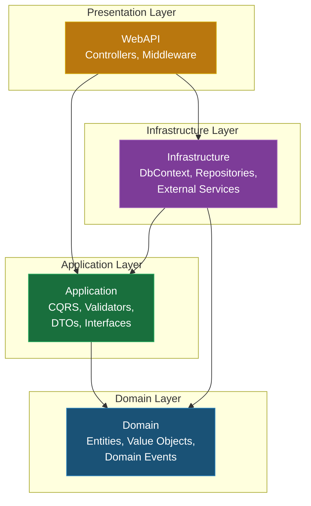
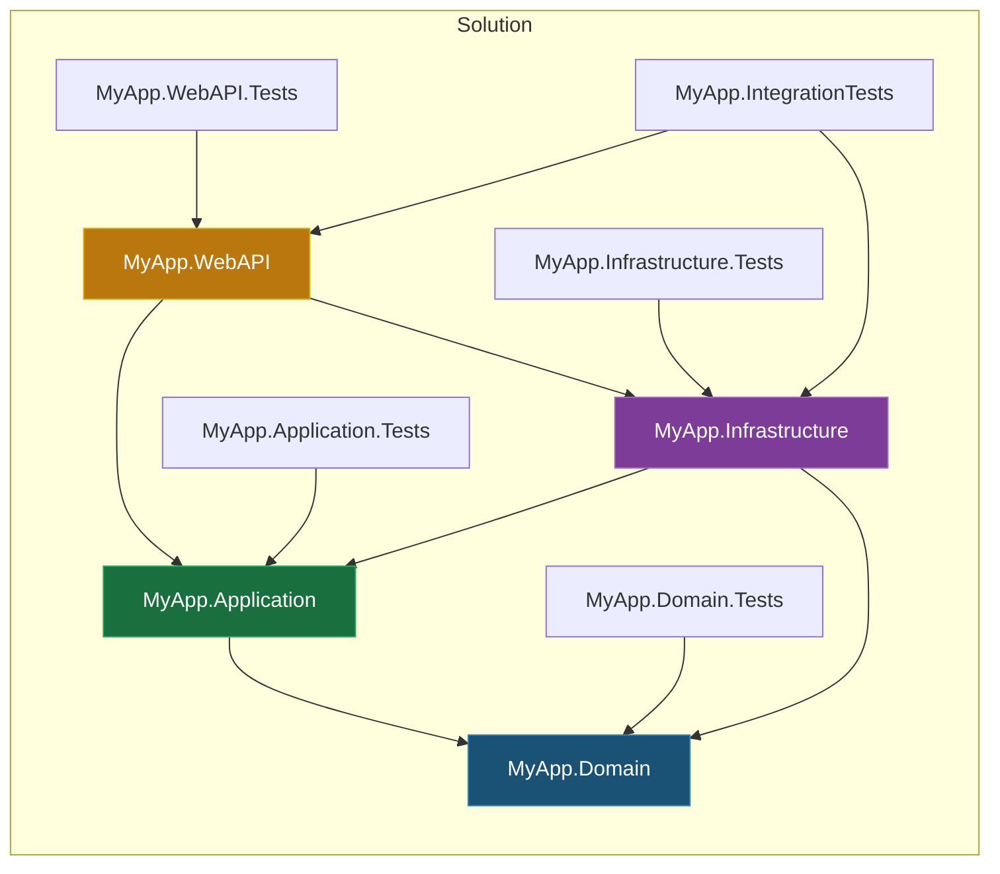

# 📐 Template: Clean Architecture — .NET 8

> **Versi**: 2.0
> **Terakhir Diperbarui**: 2026-06-17
> **Stack**: .NET 8 · C# 12 · SQL Server 2022 · MediatR · FluentValidation · AutoMapper
> **Maintainer**: Engineering Team Lead

---

## Daftar Isi

1. [Ringkasan Arsitektur](#1-ringkasan-arsitektur)
2. [Struktur Proyek](#2-struktur-proyek)
3. [Domain Layer](#3-domain-layer)
4. [Application Layer](#4-application-layer)
5. [Infrastructure Layer](#5-infrastructure-layer)
6. [Presentation Layer (API)](#6-presentation-layer-api)
7. [Cross-Cutting Concerns](#7-cross-cutting-concerns)
8. [Struktur Testing](#8-struktur-testing)
9. [Docker & CI/CD](#9-docker--cicd)
10. [Referensi & Appendix](#10-referensi--appendix)

---

## 1. Ringkasan Arsitektur

Clean Architecture memisahkan kode menjadi lapisan-lapisan dengan dependency rule yang ketat: **lapisan luar bergantung ke lapisan dalam, tidak pernah sebaliknya**. Arsitektur ini memastikan domain logic tetap independen dari framework, database, dan UI.

### 1.1 Diagram Dependency



### 1.2 Prinsip Utama

| Prinsip | Penjelasan |
|---------|-----------|
| **Dependency Rule** | Dependencies hanya mengarah ke dalam (Domain tidak bergantung pada apapun) |
| **Domain-Centric** | Business logic hidup di Domain dan Application layer |
| **Infrastructure Agnostic** | Database, API eksternal bisa diganti tanpa mengubah business logic |
| **Testable** | Setiap layer dapat di-test secara independen |
| **CQRS** | Command dan Query dipisah untuk clarity dan scalability |

> [!IMPORTANT]
> Setiap developer WAJIB memahami dependency rule sebelum menulis kode. Pelanggaran terhadap aturan ini akan ditolak saat code review.

---

## 2. Struktur Proyek

### 2.1 Solution File Organization

```
src/
├── MyApp.sln
│
├── Core/
│   ├── MyApp.Domain/                    # Domain Layer — Entity, Value Object, Domain Event
│   │   ├── Common/                      # Base classes (AuditableEntity, ValueObject)
│   │   ├── Entities/                    # Domain entities
│   │   ├── ValueObjects/                # Value objects (Email, Money, Address)
│   │   ├── Events/                      # Domain events
│   │   ├── Exceptions/                  # Domain-specific exceptions
│   │   ├── Enums/                       # Domain enumerations
│   │   ├── Specifications/              # Specification pattern implementations
│   │   └── MyApp.Domain.csproj
│   │
│   └── MyApp.Application/              # Application Layer — Use Cases, CQRS
│       ├── Common/
│       │   ├── Behaviors/               # MediatR pipeline behaviors
│       │   ├── Exceptions/              # Application exceptions
│       │   ├── Interfaces/              # Abstraction contracts
│       │   ├── Mappings/                # AutoMapper profiles
│       │   ├── Models/                  # Shared DTOs and models
│       │   └── Security/                # Authorization attributes
│       ├── Features/
│       │   ├── Products/
│       │   │   ├── Commands/
│       │   │   │   ├── CreateProduct/
│       │   │   │   │   ├── CreateProductCommand.cs
│       │   │   │   │   ├── CreateProductCommandHandler.cs
│       │   │   │   │   └── CreateProductCommandValidator.cs
│       │   │   │   ├── UpdateProduct/
│       │   │   │   └── DeleteProduct/
│       │   │   ├── Queries/
│       │   │   │   ├── GetProductById/
│       │   │   │   ├── GetProducts/
│       │   │   │   └── SearchProducts/
│       │   │   └── DTOs/
│       │   │       ├── ProductDto.cs
│       │   │       └── ProductDetailDto.cs
│       │   ├── Orders/
│       │   ├── Customers/
│       │   └── Auth/
│       ├── DependencyInjection.cs
│       └── MyApp.Application.csproj
│
├── Infrastructure/
│   ├── MyApp.Infrastructure/            # Infrastructure Layer — Persistence, External Services
│   │   ├── Persistence/
│   │   │   ├── Configurations/          # EF Core Fluent API configurations
│   │   │   ├── Interceptors/            # EF Core interceptors
│   │   │   ├── Migrations/              # Database migrations
│   │   │   ├── Repositories/            # Repository implementations
│   │   │   ├── ApplicationDbContext.cs
│   │   │   └── UnitOfWork.cs
│   │   ├── Services/
│   │   │   ├── Caching/                 # Redis/Memory cache implementations
│   │   │   ├── Email/                   # Email service
│   │   │   ├── FileStorage/             # File storage (Azure Blob, Local)
│   │   │   ├── Identity/               # Identity & JWT
│   │   │   └── Messaging/              # Message queue implementations
│   │   ├── DependencyInjection.cs
│   │   └── MyApp.Infrastructure.csproj
│   │
│   └── MyApp.Infrastructure.Shared/     # Shared infrastructure utilities
│       └── MyApp.Infrastructure.Shared.csproj
│
├── Presentation/
│   └── MyApp.WebAPI/                    # Presentation Layer — API Controllers
│       ├── Controllers/                 # API controllers
│       ├── Filters/                     # Action filters
│       ├── Middleware/                   # Custom middleware
│       ├── Extensions/                  # Service extensions
│       ├── Models/                       # API request/response models
│       ├── Properties/
│       │   └── launchSettings.json
│       ├── appsettings.json
│       ├── appsettings.Development.json
│       ├── Program.cs
│       └── MyApp.WebAPI.csproj
│
└── tests/
    ├── MyApp.Domain.Tests/
    ├── MyApp.Application.Tests/
    ├── MyApp.Infrastructure.Tests/
    ├── MyApp.WebAPI.Tests/
    └── MyApp.IntegrationTests/
```

### 2.2 Penjelasan Setiap Folder

| Folder | Layer | Fungsi |
|--------|-------|--------|
| `Domain/Common/` | Domain | Base class untuk entities dan value objects |
| `Domain/Entities/` | Domain | Business entities utama |
| `Domain/ValueObjects/` | Domain | Immutable objects tanpa identity |
| `Domain/Events/` | Domain | Domain events untuk inter-aggregate communication |
| `Domain/Specifications/` | Domain | Reusable query specifications |
| `Application/Common/Behaviors/` | Application | MediatR pipeline behaviors (validation, logging) |
| `Application/Common/Interfaces/` | Application | Contracts / abstractions |
| `Application/Features/` | Application | Organized by feature — CQRS commands & queries |
| `Infrastructure/Persistence/` | Infrastructure | EF Core, migrations, repositories |
| `Infrastructure/Services/` | Infrastructure | External service implementations |
| `Presentation/Controllers/` | Presentation | API endpoints |
| `Presentation/Middleware/` | Presentation | HTTP pipeline middleware |

### 2.3 Project References Diagram



### 2.4 Solution File (.sln)

```xml
<!-- MyApp.sln — Visual Studio Solution -->
Microsoft Visual Studio Solution File, Format Version 12.00
# Visual Studio Version 17

Project("{2150E333-8FDC-42A3-9474-1A3956D46DE8}") = "Core", "Core", "{GUID-1}"
EndProject
Project("{2150E333-8FDC-42A3-9474-1A3956D46DE8}") = "Infrastructure", "Infrastructure", "{GUID-2}"
EndProject
Project("{2150E333-8FDC-42A3-9474-1A3956D46DE8}") = "Presentation", "Presentation", "{GUID-3}"
EndProject
Project("{2150E333-8FDC-42A3-9474-1A3956D46DE8}") = "Tests", "Tests", "{GUID-4}"
EndProject

Project("{FAE04EC0-301F-11D3-BF4B-00C04F79EFBC}") = "MyApp.Domain", "src\Core\MyApp.Domain\MyApp.Domain.csproj", "{GUID-5}"
EndProject
Project("{FAE04EC0-301F-11D3-BF4B-00C04F79EFBC}") = "MyApp.Application", "src\Core\MyApp.Application\MyApp.Application.csproj", "{GUID-6}"
EndProject
Project("{FAE04EC0-301F-11D3-BF4B-00C04F79EFBC}") = "MyApp.Infrastructure", "src\Infrastructure\MyApp.Infrastructure\MyApp.Infrastructure.csproj", "{GUID-7}"
EndProject
Project("{FAE04EC0-301F-11D3-BF4B-00C04F79EFBC}") = "MyApp.WebAPI", "src\Presentation\MyApp.WebAPI\MyApp.WebAPI.csproj", "{GUID-8}"
EndProject
```

---

## 3. Domain Layer

Domain layer adalah jantung dari aplikasi. Layer ini berisi business logic murni, tidak bergantung pada framework, database, atau teknologi apapun.

### 3.1 Project File

```xml
<!-- MyApp.Domain.csproj -->
<Project Sdk="Microsoft.NET.Sdk">
  <PropertyGroup>
    <TargetFramework>net8.0</TargetFramework>
    <ImplicitUsings>enable</ImplicitUsings>
    <Nullable>enable</Nullable>
    <TreatWarningsAsErrors>true</TreatWarningsAsErrors>
  </PropertyGroup>

  <!-- Domain layer TIDAK BOLEH memiliki dependency ke package external apapun -->
  <!-- Kecuali MediatR.Contracts untuk INotification (domain events) -->
  <ItemGroup>
    <PackageReference Include="MediatR.Contracts" Version="2.0.1" />
  </ItemGroup>
</Project>
```

> [!WARNING]
> Domain layer **TIDAK BOLEH** memiliki dependency ke EF Core, ASP.NET Core, atau library infrastructure lainnya. Jika Anda merasa perlu menambahkan dependency, kemungkinan besar kode tersebut seharusnya berada di layer lain.

### 3.2 Entity Base Classes

```csharp
// Domain/Common/BaseEntity.cs
namespace MyApp.Domain.Common;

/// <summary>
/// Base entity dengan ID dan domain events support.
/// Semua entity harus inherit dari class ini.
/// </summary>
public abstract class BaseEntity<TId> where TId : notnull
{
    public TId Id { get; protected set; } = default!;

    private readonly List<BaseEvent> _domainEvents = [];

    public IReadOnlyCollection<BaseEvent> DomainEvents => _domainEvents.AsReadOnly();

    public void AddDomainEvent(BaseEvent domainEvent)
    {
        _domainEvents.Add(domainEvent);
    }

    public void RemoveDomainEvent(BaseEvent domainEvent)
    {
        _domainEvents.Remove(domainEvent);
    }

    public void ClearDomainEvents()
    {
        _domainEvents.Clear();
    }

    public override bool Equals(object? obj)
    {
        if (obj is not BaseEntity<TId> other)
            return false;

        if (ReferenceEquals(this, other))
            return true;

        if (GetType() != other.GetType())
            return false;

        if (EqualityComparer<TId>.Default.Equals(Id, default) ||
            EqualityComparer<TId>.Default.Equals(other.Id, default))
            return false;

        return EqualityComparer<TId>.Default.Equals(Id, other.Id);
    }

    public override int GetHashCode()
    {
        return (GetType().ToString() + Id).GetHashCode();
    }

    public static bool operator ==(BaseEntity<TId>? a, BaseEntity<TId>? b)
    {
        if (a is null && b is null) return true;
        if (a is null || b is null) return false;
        return a.Equals(b);
    }

    public static bool operator !=(BaseEntity<TId>? a, BaseEntity<TId>? b)
    {
        return !(a == b);
    }
}
```

```csharp
// Domain/Common/AuditableEntity.cs
namespace MyApp.Domain.Common;

/// <summary>
/// Entity dengan audit trail otomatis.
/// Semua entity yang perlu tracking created/modified harus inherit dari class ini.
/// </summary>
public abstract class AuditableEntity<TId> : BaseEntity<TId> where TId : notnull
{
    public DateTimeOffset CreatedAt { get; set; }
    public string? CreatedBy { get; set; }
    public DateTimeOffset? LastModifiedAt { get; set; }
    public string? LastModifiedBy { get; set; }
}
```

```csharp
// Domain/Common/ISoftDeletable.cs
namespace MyApp.Domain.Common;

/// <summary>
/// Interface untuk entity yang mendukung soft delete.
/// EF Core global query filter akan otomatis exclude entity yang sudah di-delete.
/// </summary>
public interface ISoftDeletable
{
    bool IsDeleted { get; set; }
    DateTimeOffset? DeletedAt { get; set; }
    string? DeletedBy { get; set; }
}
```

```csharp
// Domain/Common/BaseEvent.cs
using MediatR;

namespace MyApp.Domain.Common;

/// <summary>
/// Base class untuk semua domain events.
/// </summary>
public abstract class BaseEvent : INotification
{
    public DateTimeOffset OccurredOn { get; } = DateTimeOffset.UtcNow;
    public string EventType => GetType().Name;
}
```

### 3.3 Value Objects

```csharp
// Domain/Common/ValueObject.cs
namespace MyApp.Domain.Common;

/// <summary>
/// Base class untuk Value Objects.
/// Value objects dibandingkan berdasarkan nilai (value equality), bukan identity.
/// </summary>
public abstract class ValueObject
{
    protected abstract IEnumerable<object?> GetEqualityComponents();

    public override bool Equals(object? obj)
    {
        if (obj is null || obj.GetType() != GetType())
            return false;

        var other = (ValueObject)obj;

        return GetEqualityComponents()
            .SequenceEqual(other.GetEqualityComponents());
    }

    public override int GetHashCode()
    {
        return GetEqualityComponents()
            .Select(x => x?.GetHashCode() ?? 0)
            .Aggregate((x, y) => x ^ y);
    }

    public static bool operator ==(ValueObject? left, ValueObject? right)
    {
        if (left is null && right is null) return true;
        if (left is null || right is null) return false;
        return left.Equals(right);
    }

    public static bool operator !=(ValueObject? left, ValueObject? right)
    {
        return !(left == right);
    }
}
```

```csharp
// Domain/ValueObjects/Email.cs
namespace MyApp.Domain.ValueObjects;

using System.Text.RegularExpressions;
using MyApp.Domain.Common;
using MyApp.Domain.Exceptions;

/// <summary>
/// Value object untuk email address dengan built-in validation.
/// </summary>
public sealed partial class Email : ValueObject
{
    public string Value { get; }

    private Email(string value)
    {
        Value = value.Trim().ToLowerInvariant();
    }

    public static Email Create(string email)
    {
        if (string.IsNullOrWhiteSpace(email))
            throw new DomainValidationException("Email", "Email tidak boleh kosong.");

        email = email.Trim().ToLowerInvariant();

        if (email.Length > 256)
            throw new DomainValidationException("Email", "Email tidak boleh lebih dari 256 karakter.");

        if (!EmailRegex().IsMatch(email))
            throw new DomainValidationException("Email", $"Format email '{email}' tidak valid.");

        return new Email(email);
    }

    [GeneratedRegex(@"^[^@\s]+@[^@\s]+\.[^@\s]+$", RegexOptions.Compiled)]
    private static partial Regex EmailRegex();

    protected override IEnumerable<object?> GetEqualityComponents()
    {
        yield return Value;
    }

    public override string ToString() => Value;

    public static implicit operator string(Email email) => email.Value;
}
```

```csharp
// Domain/ValueObjects/Money.cs
namespace MyApp.Domain.ValueObjects;

using MyApp.Domain.Common;
using MyApp.Domain.Exceptions;

/// <summary>
/// Value object untuk representasi uang dengan currency.
/// Mendukung operasi aritmatika dasar.
/// </summary>
public sealed class Money : ValueObject
{
    public decimal Amount { get; }
    public string Currency { get; }

    private Money(decimal amount, string currency)
    {
        Amount = amount;
        Currency = currency.ToUpperInvariant();
    }

    public static Money Create(decimal amount, string currency = "IDR")
    {
        if (string.IsNullOrWhiteSpace(currency))
            throw new DomainValidationException("Currency", "Currency tidak boleh kosong.");

        if (currency.Length != 3)
            throw new DomainValidationException("Currency", "Currency harus 3 karakter (ISO 4217).");

        if (amount < 0)
            throw new DomainValidationException("Amount", "Amount tidak boleh negatif.");

        return new Money(Math.Round(amount, 2), currency);
    }

    public static Money Zero(string currency = "IDR") => new(0, currency);

    public Money Add(Money other)
    {
        EnsureSameCurrency(other);
        return new Money(Amount + other.Amount, Currency);
    }

    public Money Subtract(Money other)
    {
        EnsureSameCurrency(other);
        var result = Amount - other.Amount;
        if (result < 0)
            throw new DomainValidationException("Money", "Hasil pengurangan tidak boleh negatif.");
        return new Money(result, Currency);
    }

    public Money Multiply(decimal factor)
    {
        return new Money(Math.Round(Amount * factor, 2), Currency);
    }

    private void EnsureSameCurrency(Money other)
    {
        if (Currency != other.Currency)
            throw new DomainValidationException("Money",
                $"Tidak bisa operasi antara {Currency} dan {other.Currency}.");
    }

    public static Money operator +(Money a, Money b) => a.Add(b);
    public static Money operator -(Money a, Money b) => a.Subtract(b);
    public static Money operator *(Money a, decimal factor) => a.Multiply(factor);

    protected override IEnumerable<object?> GetEqualityComponents()
    {
        yield return Amount;
        yield return Currency;
    }

    public override string ToString() => $"{Currency} {Amount:N2}";
}
```

```csharp
// Domain/ValueObjects/Address.cs
namespace MyApp.Domain.ValueObjects;

using MyApp.Domain.Common;

/// <summary>
/// Value object untuk alamat lengkap.
/// </summary>
public sealed class Address : ValueObject
{
    public string Street { get; }
    public string City { get; }
    public string Province { get; }
    public string PostalCode { get; }
    public string Country { get; }

    private Address(string street, string city, string province, string postalCode, string country)
    {
        Street = street;
        City = city;
        Province = province;
        PostalCode = postalCode;
        Country = country;
    }

    public static Address Create(
        string street, string city, string province,
        string postalCode, string country = "Indonesia")
    {
        ArgumentException.ThrowIfNullOrWhiteSpace(street);
        ArgumentException.ThrowIfNullOrWhiteSpace(city);
        ArgumentException.ThrowIfNullOrWhiteSpace(province);
        ArgumentException.ThrowIfNullOrWhiteSpace(postalCode);

        return new Address(street.Trim(), city.Trim(), province.Trim(),
            postalCode.Trim(), country.Trim());
    }

    protected override IEnumerable<object?> GetEqualityComponents()
    {
        yield return Street;
        yield return City;
        yield return Province;
        yield return PostalCode;
        yield return Country;
    }

    public override string ToString() =>
        $"{Street}, {City}, {Province} {PostalCode}, {Country}";
}
```

### 3.4 Domain Entities (Contoh Lengkap)

```csharp
// Domain/Entities/Product.cs
namespace MyApp.Domain.Entities;

using MyApp.Domain.Common;
using MyApp.Domain.Enums;
using MyApp.Domain.Events;
using MyApp.Domain.Exceptions;
using MyApp.Domain.ValueObjects;

/// <summary>
/// Aggregate root untuk Product.
/// Semua modifikasi terhadap product harus melalui method di class ini.
/// </summary>
public sealed class Product : AuditableEntity<Guid>, ISoftDeletable
{
    // ---- Properties ----
    public string Name { get; private set; } = null!;
    public string Description { get; private set; } = string.Empty;
    public string Sku { get; private set; } = null!;
    public Money Price { get; private set; } = null!;
    public int StockQuantity { get; private set; }
    public ProductStatus Status { get; private set; }
    public Guid CategoryId { get; private set; }

    // Navigation properties
    public Category Category { get; private set; } = null!;

    // Soft delete
    public bool IsDeleted { get; set; }
    public DateTimeOffset? DeletedAt { get; set; }
    public string? DeletedBy { get; set; }

    // Collections
    private readonly List<ProductImage> _images = [];
    public IReadOnlyCollection<ProductImage> Images => _images.AsReadOnly();

    private readonly List<ProductTag> _tags = [];
    public IReadOnlyCollection<ProductTag> Tags => _tags.AsReadOnly();

    // ---- Factory Method ----
    private Product() { } // EF Core needs this

    public static Product Create(
        string name,
        string description,
        string sku,
        decimal price,
        string currency,
        int stockQuantity,
        Guid categoryId)
    {
        if (string.IsNullOrWhiteSpace(name))
            throw new DomainValidationException("Name", "Nama produk tidak boleh kosong.");

        if (name.Length > 200)
            throw new DomainValidationException("Name", "Nama produk maksimal 200 karakter.");

        if (string.IsNullOrWhiteSpace(sku))
            throw new DomainValidationException("SKU", "SKU tidak boleh kosong.");

        if (stockQuantity < 0)
            throw new DomainValidationException("StockQuantity", "Stock tidak boleh negatif.");

        var product = new Product
        {
            Id = Guid.NewGuid(),
            Name = name.Trim(),
            Description = description?.Trim() ?? string.Empty,
            Sku = sku.Trim().ToUpperInvariant(),
            Price = Money.Create(price, currency),
            StockQuantity = stockQuantity,
            Status = ProductStatus.Draft,
            CategoryId = categoryId
        };

        product.AddDomainEvent(new ProductCreatedEvent(product.Id, product.Name, product.Sku));

        return product;
    }

    // ---- Domain Methods ----
    public void UpdateDetails(string name, string description)
    {
        if (string.IsNullOrWhiteSpace(name))
            throw new DomainValidationException("Name", "Nama produk tidak boleh kosong.");

        Name = name.Trim();
        Description = description?.Trim() ?? string.Empty;

        AddDomainEvent(new ProductUpdatedEvent(Id, Name));
    }

    public void UpdatePrice(decimal newPrice, string currency)
    {
        var oldPrice = Price;
        Price = Money.Create(newPrice, currency);

        AddDomainEvent(new ProductPriceChangedEvent(Id, oldPrice.Amount, Price.Amount, Price.Currency));
    }

    public void AddStock(int quantity)
    {
        if (quantity <= 0)
            throw new DomainValidationException("Quantity", "Quantity harus positif.");

        StockQuantity += quantity;

        AddDomainEvent(new ProductStockUpdatedEvent(Id, StockQuantity));
    }

    public void RemoveStock(int quantity)
    {
        if (quantity <= 0)
            throw new DomainValidationException("Quantity", "Quantity harus positif.");

        if (StockQuantity < quantity)
            throw new InsufficientStockException(Id, Sku, StockQuantity, quantity);

        StockQuantity -= quantity;

        if (StockQuantity == 0)
            AddDomainEvent(new ProductOutOfStockEvent(Id, Sku));

        AddDomainEvent(new ProductStockUpdatedEvent(Id, StockQuantity));
    }

    public void Activate()
    {
        if (Status == ProductStatus.Active)
            return;

        if (Price.Amount <= 0)
            throw new DomainValidationException("Price", "Harga harus lebih dari 0 untuk mengaktifkan produk.");

        Status = ProductStatus.Active;
        AddDomainEvent(new ProductActivatedEvent(Id));
    }

    public void Deactivate()
    {
        Status = ProductStatus.Inactive;
    }

    public void AddImage(string url, string altText, int displayOrder)
    {
        if (_images.Count >= 10)
            throw new DomainValidationException("Images", "Maksimal 10 gambar per produk.");

        var image = ProductImage.Create(Id, url, altText, displayOrder);
        _images.Add(image);
    }

    public void RemoveImage(Guid imageId)
    {
        var image = _images.FirstOrDefault(i => i.Id == imageId)
            ?? throw new EntityNotFoundException(nameof(ProductImage), imageId);

        _images.Remove(image);
    }

    public void AddTag(string tagName)
    {
        if (_tags.Any(t => t.Name.Equals(tagName, StringComparison.OrdinalIgnoreCase)))
            return; // Idempotent — no exception, just skip

        _tags.Add(ProductTag.Create(Id, tagName));
    }
}
```

```csharp
// Domain/Entities/Category.cs
namespace MyApp.Domain.Entities;

using MyApp.Domain.Common;

public sealed class Category : AuditableEntity<Guid>
{
    public string Name { get; private set; } = null!;
    public string? Description { get; private set; }
    public Guid? ParentCategoryId { get; private set; }

    // Navigation
    public Category? ParentCategory { get; private set; }
    private readonly List<Category> _subCategories = [];
    public IReadOnlyCollection<Category> SubCategories => _subCategories.AsReadOnly();

    private readonly List<Product> _products = [];
    public IReadOnlyCollection<Product> Products => _products.AsReadOnly();

    private Category() { }

    public static Category Create(string name, string? description = null, Guid? parentCategoryId = null)
    {
        ArgumentException.ThrowIfNullOrWhiteSpace(name);

        return new Category
        {
            Id = Guid.NewGuid(),
            Name = name.Trim(),
            Description = description?.Trim(),
            ParentCategoryId = parentCategoryId
        };
    }

    public void UpdateName(string name)
    {
        ArgumentException.ThrowIfNullOrWhiteSpace(name);
        Name = name.Trim();
    }
}
```

```csharp
// Domain/Entities/ProductImage.cs
namespace MyApp.Domain.Entities;

using MyApp.Domain.Common;

public sealed class ProductImage : BaseEntity<Guid>
{
    public Guid ProductId { get; private set; }
    public string Url { get; private set; } = null!;
    public string AltText { get; private set; } = string.Empty;
    public int DisplayOrder { get; private set; }

    private ProductImage() { }

    internal static ProductImage Create(Guid productId, string url, string altText, int displayOrder)
    {
        ArgumentException.ThrowIfNullOrWhiteSpace(url);

        return new ProductImage
        {
            Id = Guid.NewGuid(),
            ProductId = productId,
            Url = url.Trim(),
            AltText = altText?.Trim() ?? string.Empty,
            DisplayOrder = displayOrder
        };
    }
}
```

```csharp
// Domain/Entities/ProductTag.cs
namespace MyApp.Domain.Entities;

using MyApp.Domain.Common;

public sealed class ProductTag : BaseEntity<Guid>
{
    public Guid ProductId { get; private set; }
    public string Name { get; private set; } = null!;

    private ProductTag() { }

    internal static ProductTag Create(Guid productId, string name)
    {
        ArgumentException.ThrowIfNullOrWhiteSpace(name);

        return new ProductTag
        {
            Id = Guid.NewGuid(),
            ProductId = productId,
            Name = name.Trim().ToLowerInvariant()
        };
    }
}
```

### 3.5 Domain Enums

```csharp
// Domain/Enums/ProductStatus.cs
namespace MyApp.Domain.Enums;

public enum ProductStatus
{
    Draft = 0,
    Active = 1,
    Inactive = 2,
    Discontinued = 3
}
```

### 3.6 Domain Events

```csharp
// Domain/Events/ProductCreatedEvent.cs
namespace MyApp.Domain.Events;

using MyApp.Domain.Common;

public sealed record ProductCreatedEvent(
    Guid ProductId,
    string ProductName,
    string Sku) : BaseEvent;

// Domain/Events/ProductUpdatedEvent.cs
public sealed record ProductUpdatedEvent(
    Guid ProductId,
    string ProductName) : BaseEvent;

// Domain/Events/ProductPriceChangedEvent.cs
public sealed record ProductPriceChangedEvent(
    Guid ProductId,
    decimal OldPrice,
    decimal NewPrice,
    string Currency) : BaseEvent;

// Domain/Events/ProductStockUpdatedEvent.cs
public sealed record ProductStockUpdatedEvent(
    Guid ProductId,
    int NewStockQuantity) : BaseEvent;

// Domain/Events/ProductActivatedEvent.cs
public sealed record ProductActivatedEvent(
    Guid ProductId) : BaseEvent;

// Domain/Events/ProductOutOfStockEvent.cs
public sealed record ProductOutOfStockEvent(
    Guid ProductId,
    string Sku) : BaseEvent;
```

### 3.7 Domain Exceptions

```csharp
// Domain/Exceptions/DomainValidationException.cs
namespace MyApp.Domain.Exceptions;

public class DomainValidationException : DomainException
{
    public string PropertyName { get; }

    public DomainValidationException(string propertyName, string message)
        : base(message)
    {
        PropertyName = propertyName;
    }
}

// Domain/Exceptions/DomainException.cs
public class DomainException : Exception
{
    public DomainException(string message) : base(message) { }
    public DomainException(string message, Exception innerException)
        : base(message, innerException) { }
}

// Domain/Exceptions/EntityNotFoundException.cs
public class EntityNotFoundException : DomainException
{
    public EntityNotFoundException(string entityName, object id)
        : base($"Entity '{entityName}' dengan ID '{id}' tidak ditemukan.") { }
}

// Domain/Exceptions/InsufficientStockException.cs
public class InsufficientStockException : DomainException
{
    public Guid ProductId { get; }
    public string Sku { get; }
    public int AvailableStock { get; }
    public int RequestedQuantity { get; }

    public InsufficientStockException(Guid productId, string sku, int available, int requested)
        : base($"Stok tidak cukup untuk produk '{sku}'. Tersedia: {available}, Diminta: {requested}")
    {
        ProductId = productId;
        Sku = sku;
        AvailableStock = available;
        RequestedQuantity = requested;
    }
}
```

### 3.8 Specification Pattern

```csharp
// Domain/Specifications/ISpecification.cs
namespace MyApp.Domain.Specifications;

using System.Linq.Expressions;

/// <summary>
/// Specification pattern untuk membuat reusable query predicates.
/// </summary>
public interface ISpecification<T>
{
    Expression<Func<T, bool>> Criteria { get; }
    List<Expression<Func<T, object>>> Includes { get; }
    List<string> IncludeStrings { get; }
    Expression<Func<T, object>>? OrderBy { get; }
    Expression<Func<T, object>>? OrderByDescending { get; }
    int? Take { get; }
    int? Skip { get; }
    bool IsPagingEnabled { get; }
}

// Domain/Specifications/BaseSpecification.cs
public abstract class BaseSpecification<T> : ISpecification<T>
{
    public Expression<Func<T, bool>> Criteria { get; }
    public List<Expression<Func<T, object>>> Includes { get; } = [];
    public List<string> IncludeStrings { get; } = [];
    public Expression<Func<T, object>>? OrderBy { get; private set; }
    public Expression<Func<T, object>>? OrderByDescending { get; private set; }
    public int? Take { get; private set; }
    public int? Skip { get; private set; }
    public bool IsPagingEnabled { get; private set; }

    protected BaseSpecification(Expression<Func<T, bool>> criteria)
    {
        Criteria = criteria;
    }

    protected void AddInclude(Expression<Func<T, object>> includeExpression)
    {
        Includes.Add(includeExpression);
    }

    protected void AddInclude(string includeString)
    {
        IncludeStrings.Add(includeString);
    }

    protected void ApplyPaging(int skip, int take)
    {
        Skip = skip;
        Take = take;
        IsPagingEnabled = true;
    }

    protected void ApplyOrderBy(Expression<Func<T, object>> orderByExpression)
    {
        OrderBy = orderByExpression;
    }

    protected void ApplyOrderByDescending(Expression<Func<T, object>> orderByDescExpression)
    {
        OrderByDescending = orderByDescExpression;
    }
}
```

```csharp
// Domain/Specifications/ProductSpecifications.cs
namespace MyApp.Domain.Specifications;

using MyApp.Domain.Entities;
using MyApp.Domain.Enums;

public sealed class ActiveProductsSpec : BaseSpecification<Product>
{
    public ActiveProductsSpec()
        : base(p => p.Status == ProductStatus.Active && !p.IsDeleted)
    {
        AddInclude(p => p.Category);
        AddInclude(p => p.Images);
        ApplyOrderBy(p => p.Name);
    }
}

public sealed class ProductsByCategorySpec : BaseSpecification<Product>
{
    public ProductsByCategorySpec(Guid categoryId)
        : base(p => p.CategoryId == categoryId && !p.IsDeleted)
    {
        AddInclude(p => p.Category);
        AddInclude(p => p.Images);
        ApplyOrderBy(p => p.Name);
    }
}

public sealed class ProductSearchSpec : BaseSpecification<Product>
{
    public ProductSearchSpec(string? searchTerm, Guid? categoryId, int page, int pageSize)
        : base(p =>
            !p.IsDeleted &&
            (string.IsNullOrEmpty(searchTerm) ||
             p.Name.Contains(searchTerm) ||
             p.Description.Contains(searchTerm) ||
             p.Sku.Contains(searchTerm)) &&
            (!categoryId.HasValue || p.CategoryId == categoryId.Value))
    {
        AddInclude(p => p.Category);
        AddInclude(p => p.Images);
        ApplyOrderByDescending(p => p.CreatedAt);
        ApplyPaging((page - 1) * pageSize, pageSize);
    }
}

public sealed class LowStockProductsSpec : BaseSpecification<Product>
{
    public LowStockProductsSpec(int threshold = 10)
        : base(p => p.StockQuantity <= threshold &&
                     p.Status == ProductStatus.Active &&
                     !p.IsDeleted)
    {
        ApplyOrderBy(p => p.StockQuantity);
    }
}
```

---

## 4. Application Layer

Application layer berisi use case / business workflow. Layer ini mengorkestrasikan domain objects dan infrastructure services melalui CQRS pattern menggunakan MediatR.

### 4.1 Project File

```xml
<!-- MyApp.Application.csproj -->
<Project Sdk="Microsoft.NET.Sdk">
  <PropertyGroup>
    <TargetFramework>net8.0</TargetFramework>
    <ImplicitUsings>enable</ImplicitUsings>
    <Nullable>enable</Nullable>
  </PropertyGroup>

  <ItemGroup>
    <PackageReference Include="AutoMapper" Version="13.0.1" />
    <PackageReference Include="AutoMapper.Extensions.Microsoft.DependencyInjection" Version="12.0.1" />
    <PackageReference Include="FluentValidation" Version="11.9.0" />
    <PackageReference Include="FluentValidation.DependencyInjectionExtensions" Version="11.9.0" />
    <PackageReference Include="MediatR" Version="12.2.0" />
    <PackageReference Include="Microsoft.Extensions.Logging.Abstractions" Version="8.0.1" />
  </ItemGroup>

  <ItemGroup>
    <ProjectReference Include="..\MyApp.Domain\MyApp.Domain.csproj" />
  </ItemGroup>
</Project>
```

### 4.2 Common Interfaces

```csharp
// Application/Common/Interfaces/IApplicationDbContext.cs
namespace MyApp.Application.Common.Interfaces;

using Microsoft.EntityFrameworkCore;
using MyApp.Domain.Entities;

/// <summary>
/// Abstraction untuk database context.
/// Didefinisikan di Application layer, diimplementasikan di Infrastructure layer.
/// </summary>
public interface IApplicationDbContext
{
    DbSet<Product> Products { get; }
    DbSet<Category> Categories { get; }
    DbSet<ProductImage> ProductImages { get; }
    DbSet<ProductTag> ProductTags { get; }

    Task<int> SaveChangesAsync(CancellationToken cancellationToken = default);
}
```

```csharp
// Application/Common/Interfaces/IRepository.cs
namespace MyApp.Application.Common.Interfaces;

using MyApp.Domain.Common;
using MyApp.Domain.Specifications;

/// <summary>
/// Generic repository interface.
/// </summary>
public interface IRepository<T, TId>
    where T : BaseEntity<TId>
    where TId : notnull
{
    Task<T?> GetByIdAsync(TId id, CancellationToken cancellationToken = default);
    Task<IReadOnlyList<T>> GetAllAsync(CancellationToken cancellationToken = default);
    Task<IReadOnlyList<T>> GetAsync(ISpecification<T> spec, CancellationToken cancellationToken = default);
    Task<int> CountAsync(ISpecification<T> spec, CancellationToken cancellationToken = default);
    Task<T?> FirstOrDefaultAsync(ISpecification<T> spec, CancellationToken cancellationToken = default);
    Task<T> AddAsync(T entity, CancellationToken cancellationToken = default);
    void Update(T entity);
    void Delete(T entity);
}

/// <summary>
/// Specific repository interface untuk Product dengan custom methods.
/// </summary>
public interface IProductRepository : IRepository<Product, Guid>
{
    Task<bool> IsSkuUniqueAsync(string sku, CancellationToken cancellationToken = default);
    Task<Product?> GetBySkuAsync(string sku, CancellationToken cancellationToken = default);
    Task<IReadOnlyList<Product>> GetByCategoryAsync(Guid categoryId, CancellationToken cancellationToken = default);
}
```

```csharp
// Application/Common/Interfaces/IUnitOfWork.cs
namespace MyApp.Application.Common.Interfaces;

public interface IUnitOfWork : IDisposable
{
    IProductRepository Products { get; }
    IRepository<Category, Guid> Categories { get; }
    Task<int> SaveChangesAsync(CancellationToken cancellationToken = default);
    Task BeginTransactionAsync(CancellationToken cancellationToken = default);
    Task CommitTransactionAsync(CancellationToken cancellationToken = default);
    Task RollbackTransactionAsync(CancellationToken cancellationToken = default);
}
```

```csharp
// Application/Common/Interfaces/ICurrentUserService.cs
namespace MyApp.Application.Common.Interfaces;

public interface ICurrentUserService
{
    string? UserId { get; }
    string? UserName { get; }
    bool IsAuthenticated { get; }
    bool IsInRole(string role);
    IEnumerable<string> Roles { get; }
}
```

```csharp
// Application/Common/Interfaces/IDateTimeProvider.cs
namespace MyApp.Application.Common.Interfaces;

public interface IDateTimeProvider
{
    DateTimeOffset Now { get; }
    DateTimeOffset UtcNow { get; }
}

// Application/Common/Interfaces/ICacheService.cs
public interface ICacheService
{
    Task<T?> GetAsync<T>(string key, CancellationToken cancellationToken = default);
    Task SetAsync<T>(string key, T value, TimeSpan? expiry = null, CancellationToken cancellationToken = default);
    Task RemoveAsync(string key, CancellationToken cancellationToken = default);
    Task RemoveByPrefixAsync(string prefix, CancellationToken cancellationToken = default);
}

// Application/Common/Interfaces/IEmailService.cs
public interface IEmailService
{
    Task SendAsync(string to, string subject, string body, CancellationToken cancellationToken = default);
    Task SendTemplatedAsync(string to, string templateName, object model, CancellationToken cancellationToken = default);
}

// Application/Common/Interfaces/IFileStorageService.cs
public interface IFileStorageService
{
    Task<string> UploadAsync(Stream fileStream, string fileName, string contentType, CancellationToken cancellationToken = default);
    Task<Stream> DownloadAsync(string filePath, CancellationToken cancellationToken = default);
    Task DeleteAsync(string filePath, CancellationToken cancellationToken = default);
    Task<string> GetPresignedUrlAsync(string filePath, TimeSpan expiry);
}
```

### 4.3 Common Models

```csharp
// Application/Common/Models/PaginatedList.cs
namespace MyApp.Application.Common.Models;

/// <summary>
/// Generic paginated list untuk query results.
/// </summary>
public class PaginatedList<T>
{
    public IReadOnlyList<T> Items { get; }
    public int PageNumber { get; }
    public int TotalPages { get; }
    public int TotalCount { get; }
    public int PageSize { get; }

    public PaginatedList(IReadOnlyList<T> items, int count, int pageNumber, int pageSize)
    {
        PageNumber = pageNumber;
        TotalPages = (int)Math.Ceiling(count / (double)pageSize);
        TotalCount = count;
        PageSize = pageSize;
        Items = items;
    }

    public bool HasPreviousPage => PageNumber > 1;
    public bool HasNextPage => PageNumber < TotalPages;

    public static PaginatedList<T> Empty(int pageSize = 10)
        => new([], 0, 1, pageSize);
}

// Application/Common/Models/Result.cs
public class Result
{
    public bool IsSuccess { get; }
    public string? Error { get; }
    public List<string> Errors { get; }

    protected Result(bool isSuccess, string? error, List<string>? errors = null)
    {
        IsSuccess = isSuccess;
        Error = error;
        Errors = errors ?? [];
    }

    public static Result Success() => new(true, null);
    public static Result Failure(string error) => new(false, error);
    public static Result Failure(List<string> errors) => new(false, errors.FirstOrDefault(), errors);
    public static Result<T> Success<T>(T value) => new(value, true, null);
    public static Result<T> Failure<T>(string error) => new(default, false, error);
}

public class Result<T> : Result
{
    public T? Value { get; }

    internal Result(T? value, bool isSuccess, string? error)
        : base(isSuccess, error)
    {
        Value = value;
    }
}
```

### 4.4 CQRS — Commands

```csharp
// Application/Features/Products/Commands/CreateProduct/CreateProductCommand.cs
namespace MyApp.Application.Features.Products.Commands.CreateProduct;

using MediatR;
using MyApp.Application.Common.Models;
using MyApp.Application.Features.Products.DTOs;

public sealed record CreateProductCommand : IRequest<Result<ProductDto>>
{
    public string Name { get; init; } = null!;
    public string Description { get; init; } = string.Empty;
    public string Sku { get; init; } = null!;
    public decimal Price { get; init; }
    public string Currency { get; init; } = "IDR";
    public int StockQuantity { get; init; }
    public Guid CategoryId { get; init; }
    public List<string>? Tags { get; init; }
}
```

```csharp
// Application/Features/Products/Commands/CreateProduct/CreateProductCommandValidator.cs
namespace MyApp.Application.Features.Products.Commands.CreateProduct;

using FluentValidation;
using MyApp.Application.Common.Interfaces;

public sealed class CreateProductCommandValidator : AbstractValidator<CreateProductCommand>
{
    private readonly IProductRepository _productRepository;

    public CreateProductCommandValidator(IProductRepository productRepository)
    {
        _productRepository = productRepository;

        RuleFor(x => x.Name)
            .NotEmpty().WithMessage("Nama produk wajib diisi.")
            .MaximumLength(200).WithMessage("Nama produk maksimal 200 karakter.");

        RuleFor(x => x.Sku)
            .NotEmpty().WithMessage("SKU wajib diisi.")
            .MaximumLength(50).WithMessage("SKU maksimal 50 karakter.")
            .Matches(@"^[A-Z0-9\-]+$").WithMessage("SKU hanya boleh mengandung huruf kapital, angka, dan tanda hubung.")
            .MustAsync(BeUniqueSku).WithMessage("SKU sudah digunakan.");

        RuleFor(x => x.Price)
            .GreaterThanOrEqualTo(0).WithMessage("Harga tidak boleh negatif.");

        RuleFor(x => x.Currency)
            .NotEmpty().WithMessage("Currency wajib diisi.")
            .Length(3).WithMessage("Currency harus 3 karakter (ISO 4217).");

        RuleFor(x => x.StockQuantity)
            .GreaterThanOrEqualTo(0).WithMessage("Stok tidak boleh negatif.");

        RuleFor(x => x.CategoryId)
            .NotEmpty().WithMessage("Kategori wajib dipilih.");
    }

    private async Task<bool> BeUniqueSku(string sku, CancellationToken cancellationToken)
    {
        return await _productRepository.IsSkuUniqueAsync(sku, cancellationToken);
    }
}
```

```csharp
// Application/Features/Products/Commands/CreateProduct/CreateProductCommandHandler.cs
namespace MyApp.Application.Features.Products.Commands.CreateProduct;

using AutoMapper;
using MediatR;
using Microsoft.Extensions.Logging;
using MyApp.Application.Common.Interfaces;
using MyApp.Application.Common.Models;
using MyApp.Application.Features.Products.DTOs;
using MyApp.Domain.Entities;

public sealed class CreateProductCommandHandler
    : IRequestHandler<CreateProductCommand, Result<ProductDto>>
{
    private readonly IUnitOfWork _unitOfWork;
    private readonly IMapper _mapper;
    private readonly ILogger<CreateProductCommandHandler> _logger;
    private readonly ICacheService _cacheService;

    public CreateProductCommandHandler(
        IUnitOfWork unitOfWork,
        IMapper mapper,
        ILogger<CreateProductCommandHandler> logger,
        ICacheService cacheService)
    {
        _unitOfWork = unitOfWork;
        _mapper = mapper;
        _logger = logger;
        _cacheService = cacheService;
    }

    public async Task<Result<ProductDto>> Handle(
        CreateProductCommand request,
        CancellationToken cancellationToken)
    {
        _logger.LogInformation("Creating product with SKU: {Sku}", request.Sku);

        // Validate category exists
        var category = await _unitOfWork.Categories
            .GetByIdAsync(request.CategoryId, cancellationToken);

        if (category is null)
        {
            return Result.Failure<ProductDto>(
                $"Kategori dengan ID '{request.CategoryId}' tidak ditemukan.");
        }

        // Create domain entity
        var product = Product.Create(
            name: request.Name,
            description: request.Description,
            sku: request.Sku,
            price: request.Price,
            currency: request.Currency,
            stockQuantity: request.StockQuantity,
            categoryId: request.CategoryId);

        // Add tags if provided
        if (request.Tags is { Count: > 0 })
        {
            foreach (var tag in request.Tags)
            {
                product.AddTag(tag);
            }
        }

        // Persist
        await _unitOfWork.Products.AddAsync(product, cancellationToken);
        await _unitOfWork.SaveChangesAsync(cancellationToken);

        // Invalidate cache
        await _cacheService.RemoveByPrefixAsync("products:", cancellationToken);

        _logger.LogInformation("Product created successfully. ID: {ProductId}, SKU: {Sku}",
            product.Id, product.Sku);

        var dto = _mapper.Map<ProductDto>(product);
        return Result.Success(dto);
    }
}
```

```csharp
// Application/Features/Products/Commands/UpdateProduct/UpdateProductCommand.cs
namespace MyApp.Application.Features.Products.Commands.UpdateProduct;

using MediatR;
using MyApp.Application.Common.Models;
using MyApp.Application.Features.Products.DTOs;

public sealed record UpdateProductCommand : IRequest<Result<ProductDto>>
{
    public Guid Id { get; init; }
    public string Name { get; init; } = null!;
    public string Description { get; init; } = string.Empty;
    public decimal Price { get; init; }
    public string Currency { get; init; } = "IDR";
}
```

```csharp
// Application/Features/Products/Commands/UpdateProduct/UpdateProductCommandHandler.cs
namespace MyApp.Application.Features.Products.Commands.UpdateProduct;

using AutoMapper;
using MediatR;
using Microsoft.Extensions.Logging;
using MyApp.Application.Common.Interfaces;
using MyApp.Application.Common.Models;
using MyApp.Application.Features.Products.DTOs;

public sealed class UpdateProductCommandHandler
    : IRequestHandler<UpdateProductCommand, Result<ProductDto>>
{
    private readonly IUnitOfWork _unitOfWork;
    private readonly IMapper _mapper;
    private readonly ILogger<UpdateProductCommandHandler> _logger;
    private readonly ICacheService _cacheService;

    public UpdateProductCommandHandler(
        IUnitOfWork unitOfWork,
        IMapper mapper,
        ILogger<UpdateProductCommandHandler> logger,
        ICacheService cacheService)
    {
        _unitOfWork = unitOfWork;
        _mapper = mapper;
        _logger = logger;
        _cacheService = cacheService;
    }

    public async Task<Result<ProductDto>> Handle(
        UpdateProductCommand request,
        CancellationToken cancellationToken)
    {
        var product = await _unitOfWork.Products
            .GetByIdAsync(request.Id, cancellationToken);

        if (product is null)
            return Result.Failure<ProductDto>($"Produk dengan ID '{request.Id}' tidak ditemukan.");

        product.UpdateDetails(request.Name, request.Description);
        product.UpdatePrice(request.Price, request.Currency);

        _unitOfWork.Products.Update(product);
        await _unitOfWork.SaveChangesAsync(cancellationToken);

        await _cacheService.RemoveByPrefixAsync("products:", cancellationToken);
        await _cacheService.RemoveAsync($"products:{request.Id}", cancellationToken);

        _logger.LogInformation("Product updated. ID: {ProductId}", product.Id);

        return Result.Success(_mapper.Map<ProductDto>(product));
    }
}
```

```csharp
// Application/Features/Products/Commands/DeleteProduct/DeleteProductCommand.cs
namespace MyApp.Application.Features.Products.Commands.DeleteProduct;

using MediatR;
using MyApp.Application.Common.Models;

public sealed record DeleteProductCommand(Guid Id) : IRequest<Result>;
```

```csharp
// Application/Features/Products/Commands/DeleteProduct/DeleteProductCommandHandler.cs
namespace MyApp.Application.Features.Products.Commands.DeleteProduct;

using MediatR;
using Microsoft.Extensions.Logging;
using MyApp.Application.Common.Interfaces;
using MyApp.Application.Common.Models;

public sealed class DeleteProductCommandHandler : IRequestHandler<DeleteProductCommand, Result>
{
    private readonly IUnitOfWork _unitOfWork;
    private readonly ILogger<DeleteProductCommandHandler> _logger;
    private readonly ICacheService _cacheService;

    public DeleteProductCommandHandler(
        IUnitOfWork unitOfWork,
        ILogger<DeleteProductCommandHandler> logger,
        ICacheService cacheService)
    {
        _unitOfWork = unitOfWork;
        _logger = logger;
        _cacheService = cacheService;
    }

    public async Task<Result> Handle(DeleteProductCommand request, CancellationToken cancellationToken)
    {
        var product = await _unitOfWork.Products.GetByIdAsync(request.Id, cancellationToken);

        if (product is null)
            return Result.Failure($"Produk dengan ID '{request.Id}' tidak ditemukan.");

        _unitOfWork.Products.Delete(product);
        await _unitOfWork.SaveChangesAsync(cancellationToken);

        await _cacheService.RemoveByPrefixAsync("products:", cancellationToken);

        _logger.LogInformation("Product deleted. ID: {ProductId}", request.Id);

        return Result.Success();
    }
}
```

### 4.5 CQRS — Queries

```csharp
// Application/Features/Products/Queries/GetProductById/GetProductByIdQuery.cs
namespace MyApp.Application.Features.Products.Queries.GetProductById;

using MediatR;
using MyApp.Application.Common.Models;
using MyApp.Application.Features.Products.DTOs;

public sealed record GetProductByIdQuery(Guid Id) : IRequest<Result<ProductDetailDto>>;
```

```csharp
// Application/Features/Products/Queries/GetProductById/GetProductByIdQueryHandler.cs
namespace MyApp.Application.Features.Products.Queries.GetProductById;

using AutoMapper;
using MediatR;
using MyApp.Application.Common.Interfaces;
using MyApp.Application.Common.Models;
using MyApp.Application.Features.Products.DTOs;

public sealed class GetProductByIdQueryHandler
    : IRequestHandler<GetProductByIdQuery, Result<ProductDetailDto>>
{
    private readonly IUnitOfWork _unitOfWork;
    private readonly IMapper _mapper;
    private readonly ICacheService _cacheService;

    public GetProductByIdQueryHandler(
        IUnitOfWork unitOfWork,
        IMapper mapper,
        ICacheService cacheService)
    {
        _unitOfWork = unitOfWork;
        _mapper = mapper;
        _cacheService = cacheService;
    }

    public async Task<Result<ProductDetailDto>> Handle(
        GetProductByIdQuery request,
        CancellationToken cancellationToken)
    {
        // Check cache first
        var cacheKey = $"products:{request.Id}";
        var cached = await _cacheService.GetAsync<ProductDetailDto>(cacheKey, cancellationToken);
        if (cached is not null)
            return Result.Success(cached);

        var product = await _unitOfWork.Products.GetByIdAsync(request.Id, cancellationToken);

        if (product is null)
            return Result.Failure<ProductDetailDto>(
                $"Produk dengan ID '{request.Id}' tidak ditemukan.");

        var dto = _mapper.Map<ProductDetailDto>(product);

        // Cache for 5 minutes
        await _cacheService.SetAsync(cacheKey, dto, TimeSpan.FromMinutes(5), cancellationToken);

        return Result.Success(dto);
    }
}
```

```csharp
// Application/Features/Products/Queries/GetProducts/GetProductsQuery.cs
namespace MyApp.Application.Features.Products.Queries.GetProducts;

using MediatR;
using MyApp.Application.Common.Models;
using MyApp.Application.Features.Products.DTOs;

public sealed record GetProductsQuery : IRequest<PaginatedList<ProductDto>>
{
    public string? SearchTerm { get; init; }
    public Guid? CategoryId { get; init; }
    public int PageNumber { get; init; } = 1;
    public int PageSize { get; init; } = 10;
    public string? SortBy { get; init; }
    public bool SortDescending { get; init; }
}
```

```csharp
// Application/Features/Products/Queries/GetProducts/GetProductsQueryHandler.cs
namespace MyApp.Application.Features.Products.Queries.GetProducts;

using AutoMapper;
using MediatR;
using MyApp.Application.Common.Interfaces;
using MyApp.Application.Common.Models;
using MyApp.Application.Features.Products.DTOs;
using MyApp.Domain.Specifications;

public sealed class GetProductsQueryHandler
    : IRequestHandler<GetProductsQuery, PaginatedList<ProductDto>>
{
    private readonly IUnitOfWork _unitOfWork;
    private readonly IMapper _mapper;

    public GetProductsQueryHandler(IUnitOfWork unitOfWork, IMapper mapper)
    {
        _unitOfWork = unitOfWork;
        _mapper = mapper;
    }

    public async Task<PaginatedList<ProductDto>> Handle(
        GetProductsQuery request,
        CancellationToken cancellationToken)
    {
        var spec = new ProductSearchSpec(
            request.SearchTerm,
            request.CategoryId,
            request.PageNumber,
            request.PageSize);

        var products = await _unitOfWork.Products.GetAsync(spec, cancellationToken);
        var totalCount = await _unitOfWork.Products.CountAsync(spec, cancellationToken);

        var dtos = _mapper.Map<IReadOnlyList<ProductDto>>(products);

        return new PaginatedList<ProductDto>(dtos, totalCount, request.PageNumber, request.PageSize);
    }
}
```

### 4.6 DTOs

```csharp
// Application/Features/Products/DTOs/ProductDto.cs
namespace MyApp.Application.Features.Products.DTOs;

public sealed record ProductDto
{
    public Guid Id { get; init; }
    public string Name { get; init; } = null!;
    public string Sku { get; init; } = null!;
    public decimal Price { get; init; }
    public string Currency { get; init; } = null!;
    public int StockQuantity { get; init; }
    public string Status { get; init; } = null!;
    public string CategoryName { get; init; } = null!;
    public string? ThumbnailUrl { get; init; }
    public DateTimeOffset CreatedAt { get; init; }
}

// Application/Features/Products/DTOs/ProductDetailDto.cs
public sealed record ProductDetailDto
{
    public Guid Id { get; init; }
    public string Name { get; init; } = null!;
    public string Description { get; init; } = string.Empty;
    public string Sku { get; init; } = null!;
    public decimal Price { get; init; }
    public string Currency { get; init; } = null!;
    public int StockQuantity { get; init; }
    public string Status { get; init; } = null!;
    public Guid CategoryId { get; init; }
    public string CategoryName { get; init; } = null!;
    public IReadOnlyList<ProductImageDto> Images { get; init; } = [];
    public IReadOnlyList<string> Tags { get; init; } = [];
    public DateTimeOffset CreatedAt { get; init; }
    public DateTimeOffset? LastModifiedAt { get; init; }
}

public sealed record ProductImageDto
{
    public Guid Id { get; init; }
    public string Url { get; init; } = null!;
    public string AltText { get; init; } = string.Empty;
    public int DisplayOrder { get; init; }
}
```

### 4.7 AutoMapper Profiles

```csharp
// Application/Common/Mappings/ProductMappingProfile.cs
namespace MyApp.Application.Common.Mappings;

using AutoMapper;
using MyApp.Application.Features.Products.DTOs;
using MyApp.Domain.Entities;

public sealed class ProductMappingProfile : Profile
{
    public ProductMappingProfile()
    {
        CreateMap<Product, ProductDto>()
            .ForMember(dest => dest.Price, opt => opt.MapFrom(src => src.Price.Amount))
            .ForMember(dest => dest.Currency, opt => opt.MapFrom(src => src.Price.Currency))
            .ForMember(dest => dest.Status, opt => opt.MapFrom(src => src.Status.ToString()))
            .ForMember(dest => dest.CategoryName, opt => opt.MapFrom(src => src.Category.Name))
            .ForMember(dest => dest.ThumbnailUrl,
                opt => opt.MapFrom(src =>
                    src.Images.OrderBy(i => i.DisplayOrder).Select(i => i.Url).FirstOrDefault()));

        CreateMap<Product, ProductDetailDto>()
            .ForMember(dest => dest.Price, opt => opt.MapFrom(src => src.Price.Amount))
            .ForMember(dest => dest.Currency, opt => opt.MapFrom(src => src.Price.Currency))
            .ForMember(dest => dest.Status, opt => opt.MapFrom(src => src.Status.ToString()))
            .ForMember(dest => dest.CategoryName, opt => opt.MapFrom(src => src.Category.Name))
            .ForMember(dest => dest.Tags, opt => opt.MapFrom(src => src.Tags.Select(t => t.Name).ToList()));

        CreateMap<ProductImage, ProductImageDto>();
    }
}
```

```csharp
// Application/Common/Mappings/IMapFrom.cs
namespace MyApp.Application.Common.Mappings;

using AutoMapper;

/// <summary>
/// Interface marker untuk automatic mapping configuration.
/// </summary>
public interface IMapFrom<T>
{
    void Mapping(Profile profile) => profile.CreateMap(typeof(T), GetType());
}

// Application/Common/Mappings/MappingProfile.cs
public class MappingProfile : Profile
{
    public MappingProfile()
    {
        ApplyMappingsFromAssembly(typeof(MappingProfile).Assembly);
    }

    private void ApplyMappingsFromAssembly(System.Reflection.Assembly assembly)
    {
        var mapFromType = typeof(IMapFrom<>);

        var mappingMethodName = nameof(IMapFrom<object>.Mapping);

        var types = assembly.GetExportedTypes()
            .Where(t => t.GetInterfaces().Any(i =>
                i.IsGenericType && i.GetGenericTypeDefinition() == mapFromType))
            .ToList();

        foreach (var type in types)
        {
            var instance = Activator.CreateInstance(type);
            var methodInfo = type.GetMethod(mappingMethodName)
                ?? type.GetInterface(mapFromType.Name)?.GetMethod(mappingMethodName);

            methodInfo?.Invoke(instance, [this]);
        }
    }
}
```

### 4.8 MediatR Pipeline Behaviors

```csharp
// Application/Common/Behaviors/ValidationBehavior.cs
namespace MyApp.Application.Common.Behaviors;

using FluentValidation;
using MediatR;

/// <summary>
/// MediatR pipeline behavior untuk automatic validation.
/// Setiap request yang memiliki validator akan divalidasi sebelum handler dieksekusi.
/// </summary>
public sealed class ValidationBehavior<TRequest, TResponse>
    : IPipelineBehavior<TRequest, TResponse>
    where TRequest : IRequest<TResponse>
{
    private readonly IEnumerable<IValidator<TRequest>> _validators;

    public ValidationBehavior(IEnumerable<IValidator<TRequest>> validators)
    {
        _validators = validators;
    }

    public async Task<TResponse> Handle(
        TRequest request,
        RequestHandlerDelegate<TResponse> next,
        CancellationToken cancellationToken)
    {
        if (!_validators.Any())
            return await next();

        var context = new ValidationContext<TRequest>(request);

        var validationResults = await Task.WhenAll(
            _validators.Select(v => v.ValidateAsync(context, cancellationToken)));

        var failures = validationResults
            .Where(r => r.Errors.Count != 0)
            .SelectMany(r => r.Errors)
            .ToList();

        if (failures.Count != 0)
            throw new ValidationException(failures);

        return await next();
    }
}
```

```csharp
// Application/Common/Behaviors/LoggingBehavior.cs
namespace MyApp.Application.Common.Behaviors;

using System.Diagnostics;
using MediatR;
using Microsoft.Extensions.Logging;
using MyApp.Application.Common.Interfaces;

/// <summary>
/// Logs semua MediatR requests dengan informasi user dan execution time.
/// </summary>
public sealed class LoggingBehavior<TRequest, TResponse>
    : IPipelineBehavior<TRequest, TResponse>
    where TRequest : IRequest<TResponse>
{
    private readonly ILogger<LoggingBehavior<TRequest, TResponse>> _logger;
    private readonly ICurrentUserService _currentUser;

    public LoggingBehavior(
        ILogger<LoggingBehavior<TRequest, TResponse>> logger,
        ICurrentUserService currentUser)
    {
        _logger = logger;
        _currentUser = currentUser;
    }

    public async Task<TResponse> Handle(
        TRequest request,
        RequestHandlerDelegate<TResponse> next,
        CancellationToken cancellationToken)
    {
        var requestName = typeof(TRequest).Name;
        var userId = _currentUser.UserId ?? "Anonymous";
        var userName = _currentUser.UserName ?? "Anonymous";

        _logger.LogInformation(
            "[START] {RequestName} by {UserId} ({UserName}) — {@Request}",
            requestName, userId, userName, request);

        var stopwatch = Stopwatch.StartNew();

        try
        {
            var response = await next();
            stopwatch.Stop();

            _logger.LogInformation(
                "[END] {RequestName} completed in {ElapsedMs}ms",
                requestName, stopwatch.ElapsedMilliseconds);

            return response;
        }
        catch (Exception ex)
        {
            stopwatch.Stop();

            _logger.LogError(ex,
                "[ERROR] {RequestName} failed after {ElapsedMs}ms — {ErrorMessage}",
                requestName, stopwatch.ElapsedMilliseconds, ex.Message);

            throw;
        }
    }
}
```

```csharp
// Application/Common/Behaviors/PerformanceBehavior.cs
namespace MyApp.Application.Common.Behaviors;

using System.Diagnostics;
using MediatR;
using Microsoft.Extensions.Logging;

/// <summary>
/// Warns ketika request execution melebihi threshold (default 500ms).
/// </summary>
public sealed class PerformanceBehavior<TRequest, TResponse>
    : IPipelineBehavior<TRequest, TResponse>
    where TRequest : IRequest<TResponse>
{
    private readonly ILogger<PerformanceBehavior<TRequest, TResponse>> _logger;
    private const int ThresholdMs = 500;

    public PerformanceBehavior(ILogger<PerformanceBehavior<TRequest, TResponse>> logger)
    {
        _logger = logger;
    }

    public async Task<TResponse> Handle(
        TRequest request,
        RequestHandlerDelegate<TResponse> next,
        CancellationToken cancellationToken)
    {
        var stopwatch = Stopwatch.StartNew();
        var response = await next();
        stopwatch.Stop();

        if (stopwatch.ElapsedMilliseconds > ThresholdMs)
        {
            _logger.LogWarning(
                "[PERF] {RequestName} took {ElapsedMs}ms (threshold: {Threshold}ms) — {@Request}",
                typeof(TRequest).Name, stopwatch.ElapsedMilliseconds, ThresholdMs, request);
        }

        return response;
    }
}
```

### 4.9 Application DI Registration

```csharp
// Application/DependencyInjection.cs
namespace MyApp.Application;

using System.Reflection;
using FluentValidation;
using MediatR;
using Microsoft.Extensions.DependencyInjection;
using MyApp.Application.Common.Behaviors;

public static class DependencyInjection
{
    public static IServiceCollection AddApplicationServices(this IServiceCollection services)
    {
        // AutoMapper
        services.AddAutoMapper(Assembly.GetExecutingAssembly());

        // FluentValidation — auto-register all validators
        services.AddValidatorsFromAssembly(Assembly.GetExecutingAssembly());

        // MediatR — auto-register all handlers
        services.AddMediatR(cfg =>
        {
            cfg.RegisterServicesFromAssembly(Assembly.GetExecutingAssembly());

            // Pipeline behaviors (order matters!)
            cfg.AddBehavior(typeof(IPipelineBehavior<,>), typeof(LoggingBehavior<,>));
            cfg.AddBehavior(typeof(IPipelineBehavior<,>), typeof(ValidationBehavior<,>));
            cfg.AddBehavior(typeof(IPipelineBehavior<,>), typeof(PerformanceBehavior<,>));
        });

        return services;
    }
}
```

---

## 5. Infrastructure Layer

Infrastructure layer mengimplementasikan semua abstraksi yang didefinisikan di Application layer. Layer ini berisi detail teknis: database, file system, email, caching, dll.

### 5.1 Project File

```xml
<!-- MyApp.Infrastructure.csproj -->
<Project Sdk="Microsoft.NET.Sdk">
  <PropertyGroup>
    <TargetFramework>net8.0</TargetFramework>
    <ImplicitUsings>enable</ImplicitUsings>
    <Nullable>enable</Nullable>
  </PropertyGroup>

  <ItemGroup>
    <PackageReference Include="Microsoft.EntityFrameworkCore.SqlServer" Version="8.0.8" />
    <PackageReference Include="Microsoft.EntityFrameworkCore.Tools" Version="8.0.8" />
    <PackageReference Include="Microsoft.Extensions.Caching.StackExchangeRedis" Version="8.0.8" />
    <PackageReference Include="Microsoft.AspNetCore.Authentication.JwtBearer" Version="8.0.8" />
    <PackageReference Include="Azure.Storage.Blobs" Version="12.19.1" />
    <PackageReference Include="MailKit" Version="4.3.0" />
  </ItemGroup>

  <ItemGroup>
    <ProjectReference Include="..\..\Core\MyApp.Application\MyApp.Application.csproj" />
    <ProjectReference Include="..\..\Core\MyApp.Domain\MyApp.Domain.csproj" />
  </ItemGroup>
</Project>
```

### 5.2 DbContext

```csharp
// Infrastructure/Persistence/ApplicationDbContext.cs
namespace MyApp.Infrastructure.Persistence;

using System.Reflection;
using MediatR;
using Microsoft.EntityFrameworkCore;
using MyApp.Application.Common.Interfaces;
using MyApp.Domain.Common;
using MyApp.Domain.Entities;
using MyApp.Infrastructure.Persistence.Interceptors;

public sealed class ApplicationDbContext : DbContext, IApplicationDbContext
{
    private readonly IMediator _mediator;
    private readonly AuditableEntityInterceptor _auditableInterceptor;

    public ApplicationDbContext(
        DbContextOptions<ApplicationDbContext> options,
        IMediator mediator,
        AuditableEntityInterceptor auditableInterceptor)
        : base(options)
    {
        _mediator = mediator;
        _auditableInterceptor = auditableInterceptor;
    }

    // DbSets
    public DbSet<Product> Products => Set<Product>();
    public DbSet<Category> Categories => Set<Category>();
    public DbSet<ProductImage> ProductImages => Set<ProductImage>();
    public DbSet<ProductTag> ProductTags => Set<ProductTag>();

    protected override void OnModelCreating(ModelBuilder modelBuilder)
    {
        // Apply all configurations from assembly
        modelBuilder.ApplyConfigurationsFromAssembly(Assembly.GetExecutingAssembly());

        // Global query filter for soft delete
        foreach (var entityType in modelBuilder.Model.GetEntityTypes())
        {
            if (typeof(ISoftDeletable).IsAssignableFrom(entityType.ClrType))
            {
                modelBuilder.Entity(entityType.ClrType)
                    .HasQueryFilter(
                        GenerateSoftDeleteFilter(entityType.ClrType));
            }
        }

        base.OnModelCreating(modelBuilder);
    }

    protected override void OnConfiguring(DbContextOptionsBuilder optionsBuilder)
    {
        optionsBuilder.AddInterceptors(_auditableInterceptor);
        base.OnConfiguring(optionsBuilder);
    }

    public override async Task<int> SaveChangesAsync(CancellationToken cancellationToken = default)
    {
        // Dispatch domain events before saving
        await DispatchDomainEventsAsync(cancellationToken);

        return await base.SaveChangesAsync(cancellationToken);
    }

    private async Task DispatchDomainEventsAsync(CancellationToken cancellationToken)
    {
        var entities = ChangeTracker
            .Entries<BaseEntity<Guid>>()
            .Where(e => e.Entity.DomainEvents.Count != 0)
            .Select(e => e.Entity)
            .ToList();

        var domainEvents = entities
            .SelectMany(e => e.DomainEvents)
            .ToList();

        entities.ForEach(e => e.ClearDomainEvents());

        foreach (var domainEvent in domainEvents)
        {
            await _mediator.Publish(domainEvent, cancellationToken);
        }
    }

    private static LambdaExpression GenerateSoftDeleteFilter(Type type)
    {
        var parameter = System.Linq.Expressions.Expression.Parameter(type, "e");
        var property = System.Linq.Expressions.Expression.Property(parameter, nameof(ISoftDeletable.IsDeleted));
        var condition = System.Linq.Expressions.Expression.Equal(property,
            System.Linq.Expressions.Expression.Constant(false));
        var lambda = System.Linq.Expressions.Expression.Lambda(condition, parameter);
        return lambda;
    }
}
```

### 5.3 Entity Configurations (Fluent API)

```csharp
// Infrastructure/Persistence/Configurations/ProductConfiguration.cs
namespace MyApp.Infrastructure.Persistence.Configurations;

using Microsoft.EntityFrameworkCore;
using Microsoft.EntityFrameworkCore.Metadata.Builders;
using MyApp.Domain.Entities;
using MyApp.Domain.ValueObjects;

public sealed class ProductConfiguration : IEntityTypeConfiguration<Product>
{
    public void Configure(EntityTypeBuilder<Product> builder)
    {
        builder.ToTable("Products");

        builder.HasKey(p => p.Id);

        builder.Property(p => p.Id)
            .ValueGeneratedNever();

        builder.Property(p => p.Name)
            .HasMaxLength(200)
            .IsRequired();

        builder.Property(p => p.Description)
            .HasMaxLength(2000);

        builder.Property(p => p.Sku)
            .HasMaxLength(50)
            .IsRequired();

        builder.HasIndex(p => p.Sku)
            .IsUnique()
            .HasDatabaseName("IX_Products_Sku");

        builder.HasIndex(p => p.Name)
            .HasDatabaseName("IX_Products_Name");

        builder.HasIndex(p => p.Status)
            .HasDatabaseName("IX_Products_Status");

        // Value Object — Owned entity
        builder.OwnsOne(p => p.Price, priceBuilder =>
        {
            priceBuilder.Property(m => m.Amount)
                .HasColumnName("Price")
                .HasColumnType("decimal(18,2)")
                .IsRequired();

            priceBuilder.Property(m => m.Currency)
                .HasColumnName("Currency")
                .HasMaxLength(3)
                .IsRequired();
        });

        builder.Property(p => p.StockQuantity)
            .IsRequired()
            .HasDefaultValue(0);

        builder.Property(p => p.Status)
            .HasConversion<string>()
            .HasMaxLength(20)
            .IsRequired();

        // Relationships
        builder.HasOne(p => p.Category)
            .WithMany(c => c.Products)
            .HasForeignKey(p => p.CategoryId)
            .OnDelete(DeleteBehavior.Restrict);

        builder.HasMany(p => p.Images)
            .WithOne()
            .HasForeignKey(i => i.ProductId)
            .OnDelete(DeleteBehavior.Cascade);

        builder.HasMany(p => p.Tags)
            .WithOne()
            .HasForeignKey(t => t.ProductId)
            .OnDelete(DeleteBehavior.Cascade);

        // Soft Delete
        builder.Property(p => p.IsDeleted)
            .HasDefaultValue(false);

        builder.HasIndex(p => p.IsDeleted)
            .HasDatabaseName("IX_Products_IsDeleted")
            .HasFilter("[IsDeleted] = 0");

        // Audit
        builder.Property(p => p.CreatedAt).IsRequired();
        builder.Property(p => p.CreatedBy).HasMaxLength(256);
        builder.Property(p => p.LastModifiedBy).HasMaxLength(256);

        // Ignore domain events
        builder.Ignore(p => p.DomainEvents);
    }
}
```

```csharp
// Infrastructure/Persistence/Configurations/CategoryConfiguration.cs
namespace MyApp.Infrastructure.Persistence.Configurations;

using Microsoft.EntityFrameworkCore;
using Microsoft.EntityFrameworkCore.Metadata.Builders;
using MyApp.Domain.Entities;

public sealed class CategoryConfiguration : IEntityTypeConfiguration<Category>
{
    public void Configure(EntityTypeBuilder<Category> builder)
    {
        builder.ToTable("Categories");

        builder.HasKey(c => c.Id);
        builder.Property(c => c.Id).ValueGeneratedNever();

        builder.Property(c => c.Name)
            .HasMaxLength(100)
            .IsRequired();

        builder.Property(c => c.Description)
            .HasMaxLength(500);

        builder.HasIndex(c => c.Name)
            .IsUnique()
            .HasDatabaseName("IX_Categories_Name");

        // Self-referencing relationship for hierarchy
        builder.HasOne(c => c.ParentCategory)
            .WithMany(c => c.SubCategories)
            .HasForeignKey(c => c.ParentCategoryId)
            .OnDelete(DeleteBehavior.Restrict)
            .IsRequired(false);

        builder.Ignore(c => c.DomainEvents);
    }
}
```

### 5.4 Interceptors

```csharp
// Infrastructure/Persistence/Interceptors/AuditableEntityInterceptor.cs
namespace MyApp.Infrastructure.Persistence.Interceptors;

using Microsoft.EntityFrameworkCore;
using Microsoft.EntityFrameworkCore.ChangeTracking;
using Microsoft.EntityFrameworkCore.Diagnostics;
using MyApp.Application.Common.Interfaces;
using MyApp.Domain.Common;

public sealed class AuditableEntityInterceptor : SaveChangesInterceptor
{
    private readonly ICurrentUserService _currentUser;
    private readonly IDateTimeProvider _dateTime;

    public AuditableEntityInterceptor(
        ICurrentUserService currentUser,
        IDateTimeProvider dateTime)
    {
        _currentUser = currentUser;
        _dateTime = dateTime;
    }

    public override InterceptionResult<int> SavingChanges(
        DbContextEventData eventData,
        InterceptionResult<int> result)
    {
        UpdateEntities(eventData.Context);
        return base.SavingChanges(eventData, result);
    }

    public override ValueTask<InterceptionResult<int>> SavingChangesAsync(
        DbContextEventData eventData,
        InterceptionResult<int> result,
        CancellationToken cancellationToken = default)
    {
        UpdateEntities(eventData.Context);
        return base.SavingChangesAsync(eventData, result, cancellationToken);
    }

    private void UpdateEntities(DbContext? context)
    {
        if (context is null) return;

        foreach (var entry in context.ChangeTracker.Entries())
        {
            // Auditable entities
            if (entry.Entity is AuditableEntity<Guid> auditable)
            {
                if (entry.State == EntityState.Added)
                {
                    auditable.CreatedAt = _dateTime.UtcNow;
                    auditable.CreatedBy = _currentUser.UserId;
                }

                if (entry.State is EntityState.Added or EntityState.Modified)
                {
                    auditable.LastModifiedAt = _dateTime.UtcNow;
                    auditable.LastModifiedBy = _currentUser.UserId;
                }
            }

            // Soft deletable entities
            if (entry is { State: EntityState.Deleted, Entity: ISoftDeletable softDeletable })
            {
                entry.State = EntityState.Modified;
                softDeletable.IsDeleted = true;
                softDeletable.DeletedAt = _dateTime.UtcNow;
                softDeletable.DeletedBy = _currentUser.UserId;
            }
        }
    }
}
```

### 5.5 Repository Implementations

```csharp
// Infrastructure/Persistence/Repositories/BaseRepository.cs
namespace MyApp.Infrastructure.Persistence.Repositories;

using Microsoft.EntityFrameworkCore;
using MyApp.Application.Common.Interfaces;
using MyApp.Domain.Common;
using MyApp.Domain.Specifications;

public class BaseRepository<T, TId> : IRepository<T, TId>
    where T : BaseEntity<TId>
    where TId : notnull
{
    protected readonly ApplicationDbContext _context;
    protected readonly DbSet<T> _dbSet;

    public BaseRepository(ApplicationDbContext context)
    {
        _context = context;
        _dbSet = context.Set<T>();
    }

    public virtual async Task<T?> GetByIdAsync(TId id, CancellationToken cancellationToken = default)
    {
        return await _dbSet.FindAsync([id], cancellationToken);
    }

    public virtual async Task<IReadOnlyList<T>> GetAllAsync(CancellationToken cancellationToken = default)
    {
        return await _dbSet.ToListAsync(cancellationToken);
    }

    public virtual async Task<IReadOnlyList<T>> GetAsync(
        ISpecification<T> spec,
        CancellationToken cancellationToken = default)
    {
        return await ApplySpecification(spec).ToListAsync(cancellationToken);
    }

    public virtual async Task<int> CountAsync(
        ISpecification<T> spec,
        CancellationToken cancellationToken = default)
    {
        return await ApplySpecification(spec, true).CountAsync(cancellationToken);
    }

    public virtual async Task<T?> FirstOrDefaultAsync(
        ISpecification<T> spec,
        CancellationToken cancellationToken = default)
    {
        return await ApplySpecification(spec).FirstOrDefaultAsync(cancellationToken);
    }

    public virtual async Task<T> AddAsync(T entity, CancellationToken cancellationToken = default)
    {
        await _dbSet.AddAsync(entity, cancellationToken);
        return entity;
    }

    public virtual void Update(T entity)
    {
        _dbSet.Attach(entity);
        _context.Entry(entity).State = EntityState.Modified;
    }

    public virtual void Delete(T entity)
    {
        _dbSet.Remove(entity);
    }

    private IQueryable<T> ApplySpecification(ISpecification<T> spec, bool countOnly = false)
    {
        return SpecificationEvaluator<T>.GetQuery(_dbSet.AsQueryable(), spec, countOnly);
    }
}
```

```csharp
// Infrastructure/Persistence/Repositories/SpecificationEvaluator.cs
namespace MyApp.Infrastructure.Persistence.Repositories;

using Microsoft.EntityFrameworkCore;
using MyApp.Domain.Specifications;

public static class SpecificationEvaluator<T> where T : class
{
    public static IQueryable<T> GetQuery(
        IQueryable<T> inputQuery,
        ISpecification<T> specification,
        bool countOnly = false)
    {
        var query = inputQuery;

        // Apply criteria
        query = query.Where(specification.Criteria);

        if (countOnly) return query;

        // Apply includes
        query = specification.Includes
            .Aggregate(query, (current, include) => current.Include(include));

        query = specification.IncludeStrings
            .Aggregate(query, (current, include) => current.Include(include));

        // Apply ordering
        if (specification.OrderBy is not null)
            query = query.OrderBy(specification.OrderBy);
        else if (specification.OrderByDescending is not null)
            query = query.OrderByDescending(specification.OrderByDescending);

        // Apply paging
        if (specification.IsPagingEnabled)
        {
            if (specification.Skip.HasValue)
                query = query.Skip(specification.Skip.Value);
            if (specification.Take.HasValue)
                query = query.Take(specification.Take.Value);
        }

        return query;
    }
}
```

```csharp
// Infrastructure/Persistence/Repositories/ProductRepository.cs
namespace MyApp.Infrastructure.Persistence.Repositories;

using Microsoft.EntityFrameworkCore;
using MyApp.Application.Common.Interfaces;
using MyApp.Domain.Entities;

public sealed class ProductRepository : BaseRepository<Product, Guid>, IProductRepository
{
    public ProductRepository(ApplicationDbContext context) : base(context) { }

    public override async Task<Product?> GetByIdAsync(Guid id, CancellationToken cancellationToken = default)
    {
        return await _dbSet
            .Include(p => p.Category)
            .Include(p => p.Images.OrderBy(i => i.DisplayOrder))
            .Include(p => p.Tags)
            .FirstOrDefaultAsync(p => p.Id == id, cancellationToken);
    }

    public async Task<bool> IsSkuUniqueAsync(string sku, CancellationToken cancellationToken = default)
    {
        return !await _dbSet
            .AnyAsync(p => p.Sku == sku.ToUpperInvariant(), cancellationToken);
    }

    public async Task<Product?> GetBySkuAsync(string sku, CancellationToken cancellationToken = default)
    {
        return await _dbSet
            .Include(p => p.Category)
            .Include(p => p.Images)
            .FirstOrDefaultAsync(p => p.Sku == sku.ToUpperInvariant(), cancellationToken);
    }

    public async Task<IReadOnlyList<Product>> GetByCategoryAsync(
        Guid categoryId,
        CancellationToken cancellationToken = default)
    {
        return await _dbSet
            .Include(p => p.Category)
            .Include(p => p.Images.OrderBy(i => i.DisplayOrder))
            .Where(p => p.CategoryId == categoryId)
            .OrderBy(p => p.Name)
            .ToListAsync(cancellationToken);
    }
}
```

### 5.6 Unit of Work

```csharp
// Infrastructure/Persistence/UnitOfWork.cs
namespace MyApp.Infrastructure.Persistence;

using Microsoft.EntityFrameworkCore.Storage;
using MyApp.Application.Common.Interfaces;
using MyApp.Domain.Entities;
using MyApp.Infrastructure.Persistence.Repositories;

public sealed class UnitOfWork : IUnitOfWork
{
    private readonly ApplicationDbContext _context;
    private IDbContextTransaction? _transaction;

    private IProductRepository? _products;
    private IRepository<Category, Guid>? _categories;

    public UnitOfWork(ApplicationDbContext context)
    {
        _context = context;
    }

    public IProductRepository Products =>
        _products ??= new ProductRepository(_context);

    public IRepository<Category, Guid> Categories =>
        _categories ??= new BaseRepository<Category, Guid>(_context);

    public async Task<int> SaveChangesAsync(CancellationToken cancellationToken = default)
    {
        return await _context.SaveChangesAsync(cancellationToken);
    }

    public async Task BeginTransactionAsync(CancellationToken cancellationToken = default)
    {
        _transaction = await _context.Database.BeginTransactionAsync(cancellationToken);
    }

    public async Task CommitTransactionAsync(CancellationToken cancellationToken = default)
    {
        if (_transaction is null)
            throw new InvalidOperationException("Transaction belum dimulai.");

        await _transaction.CommitAsync(cancellationToken);
        await _transaction.DisposeAsync();
        _transaction = null;
    }

    public async Task RollbackTransactionAsync(CancellationToken cancellationToken = default)
    {
        if (_transaction is null)
            throw new InvalidOperationException("Transaction belum dimulai.");

        await _transaction.RollbackAsync(cancellationToken);
        await _transaction.DisposeAsync();
        _transaction = null;
    }

    public void Dispose()
    {
        _transaction?.Dispose();
        _context.Dispose();
    }
}
```

### 5.7 Caching Implementation

```csharp
// Infrastructure/Services/Caching/RedisCacheService.cs
namespace MyApp.Infrastructure.Services.Caching;

using System.Text.Json;
using Microsoft.Extensions.Caching.Distributed;
using Microsoft.Extensions.Logging;
using MyApp.Application.Common.Interfaces;

public sealed class RedisCacheService : ICacheService
{
    private readonly IDistributedCache _cache;
    private readonly ILogger<RedisCacheService> _logger;

    private static readonly JsonSerializerOptions JsonOptions = new()
    {
        PropertyNamingPolicy = JsonNamingPolicy.CamelCase,
        WriteIndented = false
    };

    public RedisCacheService(IDistributedCache cache, ILogger<RedisCacheService> logger)
    {
        _cache = cache;
        _logger = logger;
    }

    public async Task<T?> GetAsync<T>(string key, CancellationToken cancellationToken = default)
    {
        try
        {
            var cachedValue = await _cache.GetStringAsync(key, cancellationToken);

            if (string.IsNullOrEmpty(cachedValue))
                return default;

            _logger.LogDebug("Cache HIT for key: {CacheKey}", key);
            return JsonSerializer.Deserialize<T>(cachedValue, JsonOptions);
        }
        catch (Exception ex)
        {
            _logger.LogWarning(ex, "Cache GET failed for key: {CacheKey}", key);
            return default;
        }
    }

    public async Task SetAsync<T>(
        string key, T value,
        TimeSpan? expiry = null,
        CancellationToken cancellationToken = default)
    {
        try
        {
            var options = new DistributedCacheEntryOptions
            {
                AbsoluteExpirationRelativeToNow = expiry ?? TimeSpan.FromMinutes(10),
                SlidingExpiration = TimeSpan.FromMinutes(2)
            };

            var serialized = JsonSerializer.Serialize(value, JsonOptions);
            await _cache.SetStringAsync(key, serialized, options, cancellationToken);

            _logger.LogDebug("Cache SET for key: {CacheKey}, TTL: {Ttl}", key, expiry);
        }
        catch (Exception ex)
        {
            _logger.LogWarning(ex, "Cache SET failed for key: {CacheKey}", key);
        }
    }

    public async Task RemoveAsync(string key, CancellationToken cancellationToken = default)
    {
        try
        {
            await _cache.RemoveAsync(key, cancellationToken);
            _logger.LogDebug("Cache REMOVE for key: {CacheKey}", key);
        }
        catch (Exception ex)
        {
            _logger.LogWarning(ex, "Cache REMOVE failed for key: {CacheKey}", key);
        }
    }

    public async Task RemoveByPrefixAsync(string prefix, CancellationToken cancellationToken = default)
    {
        // Note: Redis implementation would use SCAN + DEL pattern
        // For DistributedCache, this is a simplified implementation
        _logger.LogDebug("Cache REMOVE by prefix: {Prefix}", prefix);
        await Task.CompletedTask;
    }
}
```

### 5.8 Email Service

```csharp
// Infrastructure/Services/Email/SmtpEmailService.cs
namespace MyApp.Infrastructure.Services.Email;

using MailKit.Net.Smtp;
using MailKit.Security;
using Microsoft.Extensions.Logging;
using Microsoft.Extensions.Options;
using MimeKit;
using MyApp.Application.Common.Interfaces;

public sealed class SmtpEmailService : IEmailService
{
    private readonly EmailSettings _settings;
    private readonly ILogger<SmtpEmailService> _logger;

    public SmtpEmailService(
        IOptions<EmailSettings> settings,
        ILogger<SmtpEmailService> logger)
    {
        _settings = settings.Value;
        _logger = logger;
    }

    public async Task SendAsync(
        string to, string subject, string body,
        CancellationToken cancellationToken = default)
    {
        var message = new MimeMessage();
        message.From.Add(new MailboxAddress(_settings.SenderName, _settings.SenderEmail));
        message.To.Add(MailboxAddress.Parse(to));
        message.Subject = subject;

        var bodyBuilder = new BodyBuilder { HtmlBody = body };
        message.Body = bodyBuilder.ToMessageBody();

        using var client = new SmtpClient();

        try
        {
            await client.ConnectAsync(
                _settings.SmtpHost,
                _settings.SmtpPort,
                SecureSocketOptions.StartTls,
                cancellationToken);

            await client.AuthenticateAsync(
                _settings.SmtpUser,
                _settings.SmtpPassword,
                cancellationToken);

            await client.SendAsync(message, cancellationToken);

            _logger.LogInformation("Email sent to {Recipient}: {Subject}", to, subject);
        }
        catch (Exception ex)
        {
            _logger.LogError(ex, "Failed to send email to {Recipient}: {Subject}", to, subject);
            throw;
        }
        finally
        {
            await client.DisconnectAsync(true, cancellationToken);
        }
    }

    public async Task SendTemplatedAsync(
        string to, string templateName, object model,
        CancellationToken cancellationToken = default)
    {
        // Template rendering logic would go here
        var body = $"Template: {templateName}"; // Simplified
        await SendAsync(to, templateName, body, cancellationToken);
    }
}

// Infrastructure/Services/Email/EmailSettings.cs
public sealed class EmailSettings
{
    public const string SectionName = "EmailSettings";

    public string SmtpHost { get; set; } = null!;
    public int SmtpPort { get; set; } = 587;
    public string SmtpUser { get; set; } = null!;
    public string SmtpPassword { get; set; } = null!;
    public string SenderEmail { get; set; } = null!;
    public string SenderName { get; set; } = null!;
}
```

### 5.9 File Storage Service

```csharp
// Infrastructure/Services/FileStorage/LocalFileStorageService.cs
namespace MyApp.Infrastructure.Services.FileStorage;

using Microsoft.Extensions.Logging;
using Microsoft.Extensions.Options;
using MyApp.Application.Common.Interfaces;

public sealed class LocalFileStorageService : IFileStorageService
{
    private readonly FileStorageSettings _settings;
    private readonly ILogger<LocalFileStorageService> _logger;

    public LocalFileStorageService(
        IOptions<FileStorageSettings> settings,
        ILogger<LocalFileStorageService> logger)
    {
        _settings = settings.Value;
        _logger = logger;
    }

    public async Task<string> UploadAsync(
        Stream fileStream, string fileName, string contentType,
        CancellationToken cancellationToken = default)
    {
        var uniqueFileName = $"{Guid.NewGuid()}{Path.GetExtension(fileName)}";
        var relativePath = Path.Combine(
            DateTime.UtcNow.ToString("yyyy/MM"),
            uniqueFileName);
        var fullPath = Path.Combine(_settings.BasePath, relativePath);

        Directory.CreateDirectory(Path.GetDirectoryName(fullPath)!);

        await using var fileStreamOutput = new FileStream(fullPath, FileMode.Create);
        await fileStream.CopyToAsync(fileStreamOutput, cancellationToken);

        _logger.LogInformation("File uploaded: {FilePath}", relativePath);

        return relativePath;
    }

    public async Task<Stream> DownloadAsync(
        string filePath,
        CancellationToken cancellationToken = default)
    {
        var fullPath = Path.Combine(_settings.BasePath, filePath);

        if (!File.Exists(fullPath))
            throw new FileNotFoundException($"File not found: {filePath}");

        var memoryStream = new MemoryStream();
        await using var fileStream = new FileStream(fullPath, FileMode.Open, FileAccess.Read);
        await fileStream.CopyToAsync(memoryStream, cancellationToken);
        memoryStream.Position = 0;

        return memoryStream;
    }

    public Task DeleteAsync(string filePath, CancellationToken cancellationToken = default)
    {
        var fullPath = Path.Combine(_settings.BasePath, filePath);

        if (File.Exists(fullPath))
        {
            File.Delete(fullPath);
            _logger.LogInformation("File deleted: {FilePath}", filePath);
        }

        return Task.CompletedTask;
    }

    public Task<string> GetPresignedUrlAsync(string filePath, TimeSpan expiry)
    {
        // For local storage, return direct path
        return Task.FromResult($"/files/{filePath}");
    }
}

public sealed class FileStorageSettings
{
    public const string SectionName = "FileStorage";
    public string BasePath { get; set; } = "uploads";
    public long MaxFileSizeBytes { get; set; } = 10 * 1024 * 1024; // 10MB
    public string[] AllowedExtensions { get; set; } = [".jpg", ".jpeg", ".png", ".gif", ".pdf"];
}
```

### 5.10 Infrastructure DI Registration

```csharp
// Infrastructure/DependencyInjection.cs
namespace MyApp.Infrastructure;

using Microsoft.EntityFrameworkCore;
using Microsoft.Extensions.Configuration;
using Microsoft.Extensions.DependencyInjection;
using MyApp.Application.Common.Interfaces;
using MyApp.Infrastructure.Persistence;
using MyApp.Infrastructure.Persistence.Interceptors;
using MyApp.Infrastructure.Persistence.Repositories;
using MyApp.Infrastructure.Services.Caching;
using MyApp.Infrastructure.Services.Email;
using MyApp.Infrastructure.Services.FileStorage;

public static class DependencyInjection
{
    public static IServiceCollection AddInfrastructureServices(
        this IServiceCollection services,
        IConfiguration configuration)
    {
        // EF Core — SQL Server
        services.AddScoped<AuditableEntityInterceptor>();

        services.AddDbContext<ApplicationDbContext>((sp, options) =>
        {
            options.UseSqlServer(
                configuration.GetConnectionString("DefaultConnection"),
                sqlOptions =>
                {
                    sqlOptions.MigrationsAssembly(typeof(ApplicationDbContext).Assembly.FullName);
                    sqlOptions.EnableRetryOnFailure(
                        maxRetryCount: 3,
                        maxRetryDelay: TimeSpan.FromSeconds(10),
                        errorNumbersToAdd: null);
                    sqlOptions.CommandTimeout(30);
                });

            options.EnableSensitiveDataLogging(
                configuration.GetValue<bool>("EnableSensitiveDataLogging"));
        });

        services.AddScoped<IApplicationDbContext>(provider =>
            provider.GetRequiredService<ApplicationDbContext>());

        // Repositories
        services.AddScoped<IUnitOfWork, UnitOfWork>();
        services.AddScoped<IProductRepository, ProductRepository>();
        services.AddScoped(typeof(IRepository<,>), typeof(BaseRepository<,>));

        // Cache — Redis
        services.AddStackExchangeRedisCache(options =>
        {
            options.Configuration = configuration.GetConnectionString("Redis");
            options.InstanceName = "MyApp:";
        });
        services.AddSingleton<ICacheService, RedisCacheService>();

        // Email
        services.Configure<EmailSettings>(
            configuration.GetSection(EmailSettings.SectionName));
        services.AddTransient<IEmailService, SmtpEmailService>();

        // File Storage
        services.Configure<FileStorageSettings>(
            configuration.GetSection(FileStorageSettings.SectionName));
        services.AddTransient<IFileStorageService, LocalFileStorageService>();

        return services;
    }
}
```

---

## 6. Presentation Layer (API)

### 6.1 Project File

```xml
<!-- MyApp.WebAPI.csproj -->
<Project Sdk="Microsoft.NET.Sdk.Web">
  <PropertyGroup>
    <TargetFramework>net8.0</TargetFramework>
    <ImplicitUsings>enable</ImplicitUsings>
    <Nullable>enable</Nullable>
  </PropertyGroup>

  <ItemGroup>
    <PackageReference Include="Swashbuckle.AspNetCore" Version="6.5.0" />
    <PackageReference Include="Serilog.AspNetCore" Version="8.0.1" />
    <PackageReference Include="Serilog.Sinks.Console" Version="5.0.1" />
    <PackageReference Include="Serilog.Sinks.Seq" Version="7.0.1" />
    <PackageReference Include="AspNetCoreRateLimit" Version="5.0.0" />
    <PackageReference Include="Microsoft.AspNetCore.Authentication.JwtBearer" Version="8.0.8" />
  </ItemGroup>

  <ItemGroup>
    <ProjectReference Include="..\..\Core\MyApp.Application\MyApp.Application.csproj" />
    <ProjectReference Include="..\..\Infrastructure\MyApp.Infrastructure\MyApp.Infrastructure.csproj" />
  </ItemGroup>
</Project>
```

### 6.2 Program.cs (Complete)

```csharp
// WebAPI/Program.cs
using System.Text;
using Microsoft.AspNetCore.Authentication.JwtBearer;
using Microsoft.IdentityModel.Tokens;
using Microsoft.OpenApi.Models;
using MyApp.Application;
using MyApp.Infrastructure;
using MyApp.WebAPI.Extensions;
using MyApp.WebAPI.Middleware;
using Serilog;

// --- Bootstrap Logger ---
Log.Logger = new LoggerConfiguration()
    .WriteTo.Console()
    .CreateBootstrapLogger();

try
{
    Log.Information("Starting MyApp WebAPI...");

    var builder = WebApplication.CreateBuilder(args);

    // --- Serilog ---
    builder.Host.UseSerilog((context, loggerConfig) =>
    {
        loggerConfig
            .ReadFrom.Configuration(context.Configuration)
            .Enrich.FromLogContext()
            .Enrich.WithMachineName()
            .Enrich.WithEnvironmentName()
            .WriteTo.Console(
                outputTemplate: "[{Timestamp:HH:mm:ss} {Level:u3}] {SourceContext} {Message:lj}{NewLine}{Exception}")
            .WriteTo.Seq(context.Configuration["Seq:ServerUrl"] ?? "http://localhost:5341");
    });

    // --- Add Services ---
    builder.Services.AddApplicationServices();
    builder.Services.AddInfrastructureServices(builder.Configuration);

    // Current User Service
    builder.Services.AddHttpContextAccessor();
    builder.Services.AddScoped<MyApp.Application.Common.Interfaces.ICurrentUserService,
        MyApp.WebAPI.Services.CurrentUserService>();
    builder.Services.AddSingleton<MyApp.Application.Common.Interfaces.IDateTimeProvider,
        MyApp.WebAPI.Services.DateTimeProvider>();

    // Controllers
    builder.Services.AddControllers(options =>
    {
        options.Filters.Add<MyApp.WebAPI.Filters.ApiExceptionFilterAttribute>();
    });

    // CORS
    builder.Services.AddCors(options =>
    {
        options.AddPolicy("AllowFrontend", policy =>
        {
            policy
                .WithOrigins(builder.Configuration.GetSection("Cors:AllowedOrigins").Get<string[]>() ?? [])
                .AllowAnyHeader()
                .AllowAnyMethod()
                .AllowCredentials();
        });
    });

    // Authentication — JWT
    builder.Services.AddAuthentication(JwtBearerDefaults.AuthenticationScheme)
        .AddJwtBearer(options =>
        {
            options.TokenValidationParameters = new TokenValidationParameters
            {
                ValidateIssuer = true,
                ValidateAudience = true,
                ValidateLifetime = true,
                ValidateIssuerSigningKey = true,
                ValidIssuer = builder.Configuration["Jwt:Issuer"],
                ValidAudience = builder.Configuration["Jwt:Audience"],
                IssuerSigningKey = new SymmetricSecurityKey(
                    Encoding.UTF8.GetBytes(builder.Configuration["Jwt:SecretKey"]!)),
                ClockSkew = TimeSpan.Zero
            };
        });

    builder.Services.AddAuthorization();

    // Swagger
    builder.Services.AddEndpointsApiExplorer();
    builder.Services.AddSwaggerGen(options =>
    {
        options.SwaggerDoc("v1", new OpenApiInfo
        {
            Title = "MyApp API",
            Version = "v1",
            Description = "Clean Architecture API with .NET 8",
            Contact = new OpenApiContact
            {
                Name = "Engineering Team",
                Email = "engineering@myapp.com"
            }
        });

        options.AddSecurityDefinition("Bearer", new OpenApiSecurityScheme
        {
            Description = "JWT Authorization header using the Bearer scheme. Enter 'Bearer {token}'",
            Name = "Authorization",
            In = ParameterLocation.Header,
            Type = SecuritySchemeType.ApiKey,
            Scheme = "Bearer"
        });

        options.AddSecurityRequirement(new OpenApiSecurityRequirement
        {
            {
                new OpenApiSecurityScheme
                {
                    Reference = new OpenApiReference
                    {
                        Type = ReferenceType.SecurityScheme,
                        Id = "Bearer"
                    }
                },
                Array.Empty<string>()
            }
        });
    });

    // Health Checks
    builder.Services.AddHealthChecks()
        .AddSqlServer(builder.Configuration.GetConnectionString("DefaultConnection")!)
        .AddRedis(builder.Configuration.GetConnectionString("Redis")!);

    // Rate Limiting
    builder.Services.AddRateLimiter(options =>
    {
        options.AddFixedWindowLimiter("fixed", limiterOptions =>
        {
            limiterOptions.PermitLimit = 100;
            limiterOptions.Window = TimeSpan.FromMinutes(1);
        });
    });

    // --- Build App ---
    var app = builder.Build();

    // --- Middleware Pipeline ---
    app.UseMiddleware<CorrelationIdMiddleware>();
    app.UseMiddleware<RequestLoggingMiddleware>();
    app.UseMiddleware<GlobalExceptionMiddleware>();

    if (app.Environment.IsDevelopment())
    {
        app.UseSwagger();
        app.UseSwaggerUI(c =>
        {
            c.SwaggerEndpoint("/swagger/v1/swagger.json", "MyApp API v1");
            c.RoutePrefix = string.Empty;
        });
    }

    app.UseHttpsRedirection();
    app.UseCors("AllowFrontend");
    app.UseRateLimiter();

    app.UseAuthentication();
    app.UseAuthorization();

    app.UseSerilogRequestLogging();

    app.MapControllers();
    app.MapHealthChecks("/health");

    // --- Run ---
    app.Run();
}
catch (Exception ex)
{
    Log.Fatal(ex, "Application terminated unexpectedly");
}
finally
{
    Log.CloseAndFlush();
}

// Partial class for integration tests
public partial class Program { }
```

### 6.3 API Response Wrapper

```csharp
// WebAPI/Models/ApiResponse.cs
namespace MyApp.WebAPI.Models;

/// <summary>
/// Standard API response wrapper untuk konsistensi format response.
/// </summary>
public sealed class ApiResponse<T>
{
    public bool Success { get; init; }
    public T? Data { get; init; }
    public string? Message { get; init; }
    public List<string>? Errors { get; init; }
    public ApiMetadata? Meta { get; init; }

    public static ApiResponse<T> Ok(T data, string? message = null) => new()
    {
        Success = true,
        Data = data,
        Message = message
    };

    public static ApiResponse<T> OkPaginated(T data, int page, int pageSize, int totalCount) => new()
    {
        Success = true,
        Data = data,
        Meta = new ApiMetadata
        {
            Page = page,
            PageSize = pageSize,
            TotalCount = totalCount,
            TotalPages = (int)Math.Ceiling(totalCount / (double)pageSize)
        }
    };

    public static ApiResponse<T> Fail(string message) => new()
    {
        Success = false,
        Message = message
    };

    public static ApiResponse<T> Fail(List<string> errors) => new()
    {
        Success = false,
        Errors = errors,
        Message = errors.FirstOrDefault()
    };
}

public sealed class ApiMetadata
{
    public int Page { get; init; }
    public int PageSize { get; init; }
    public int TotalCount { get; init; }
    public int TotalPages { get; init; }
}
```

### 6.4 Controllers

```csharp
// WebAPI/Controllers/BaseApiController.cs
namespace MyApp.WebAPI.Controllers;

using MediatR;
using Microsoft.AspNetCore.Mvc;

/// <summary>
/// Base controller dengan common dependencies.
/// </summary>
[ApiController]
[Route("api/v1/[controller]")]
public abstract class BaseApiController : ControllerBase
{
    private ISender? _mediator;
    protected ISender Mediator => _mediator ??=
        HttpContext.RequestServices.GetRequiredService<ISender>();
}
```

```csharp
// WebAPI/Controllers/ProductsController.cs
namespace MyApp.WebAPI.Controllers;

using Microsoft.AspNetCore.Authorization;
using Microsoft.AspNetCore.Mvc;
using MyApp.Application.Features.Products.Commands.CreateProduct;
using MyApp.Application.Features.Products.Commands.DeleteProduct;
using MyApp.Application.Features.Products.Commands.UpdateProduct;
using MyApp.Application.Features.Products.Queries.GetProductById;
using MyApp.Application.Features.Products.Queries.GetProducts;
using MyApp.WebAPI.Models;

/// <summary>
/// API endpoints untuk manajemen produk.
/// </summary>
[Authorize]
public class ProductsController : BaseApiController
{
    /// <summary>
    /// Mendapatkan daftar produk dengan pagination dan filter.
    /// </summary>
    [HttpGet]
    [AllowAnonymous]
    [ProducesResponseType(typeof(ApiResponse<object>), StatusCodes.Status200OK)]
    public async Task<IActionResult> GetProducts(
        [FromQuery] string? search,
        [FromQuery] Guid? categoryId,
        [FromQuery] int page = 1,
        [FromQuery] int pageSize = 10)
    {
        var query = new GetProductsQuery
        {
            SearchTerm = search,
            CategoryId = categoryId,
            PageNumber = page,
            PageSize = Math.Min(pageSize, 50) // Max 50 per page
        };

        var result = await Mediator.Send(query);

        return Ok(ApiResponse<object>.OkPaginated(
            result.Items,
            result.PageNumber,
            result.PageSize,
            result.TotalCount));
    }

    /// <summary>
    /// Mendapatkan detail produk berdasarkan ID.
    /// </summary>
    [HttpGet("{id:guid}")]
    [AllowAnonymous]
    [ProducesResponseType(typeof(ApiResponse<object>), StatusCodes.Status200OK)]
    [ProducesResponseType(StatusCodes.Status404NotFound)]
    public async Task<IActionResult> GetProduct(Guid id)
    {
        var result = await Mediator.Send(new GetProductByIdQuery(id));

        if (!result.IsSuccess)
            return NotFound(ApiResponse<object>.Fail(result.Error!));

        return Ok(ApiResponse<object>.Ok(result.Value!));
    }

    /// <summary>
    /// Membuat produk baru.
    /// </summary>
    [HttpPost]
    [Authorize(Roles = "Admin,ProductManager")]
    [ProducesResponseType(typeof(ApiResponse<object>), StatusCodes.Status201Created)]
    [ProducesResponseType(StatusCodes.Status400BadRequest)]
    public async Task<IActionResult> CreateProduct([FromBody] CreateProductCommand command)
    {
        var result = await Mediator.Send(command);

        if (!result.IsSuccess)
            return BadRequest(ApiResponse<object>.Fail(result.Error!));

        return CreatedAtAction(
            nameof(GetProduct),
            new { id = result.Value!.Id },
            ApiResponse<object>.Ok(result.Value, "Produk berhasil dibuat."));
    }

    /// <summary>
    /// Memperbarui produk yang sudah ada.
    /// </summary>
    [HttpPut("{id:guid}")]
    [Authorize(Roles = "Admin,ProductManager")]
    [ProducesResponseType(typeof(ApiResponse<object>), StatusCodes.Status200OK)]
    [ProducesResponseType(StatusCodes.Status404NotFound)]
    public async Task<IActionResult> UpdateProduct(Guid id, [FromBody] UpdateProductCommand command)
    {
        if (id != command.Id)
            return BadRequest(ApiResponse<object>.Fail("ID tidak sesuai."));

        var result = await Mediator.Send(command);

        if (!result.IsSuccess)
            return NotFound(ApiResponse<object>.Fail(result.Error!));

        return Ok(ApiResponse<object>.Ok(result.Value!, "Produk berhasil diperbarui."));
    }

    /// <summary>
    /// Menghapus produk (soft delete).
    /// </summary>
    [HttpDelete("{id:guid}")]
    [Authorize(Roles = "Admin")]
    [ProducesResponseType(StatusCodes.Status204NoContent)]
    [ProducesResponseType(StatusCodes.Status404NotFound)]
    public async Task<IActionResult> DeleteProduct(Guid id)
    {
        var result = await Mediator.Send(new DeleteProductCommand(id));

        if (!result.IsSuccess)
            return NotFound(ApiResponse<object>.Fail(result.Error!));

        return NoContent();
    }
}
```

### 6.5 Middleware

```csharp
// WebAPI/Middleware/GlobalExceptionMiddleware.cs
namespace MyApp.WebAPI.Middleware;

using System.Net;
using System.Text.Json;
using FluentValidation;
using MyApp.Domain.Exceptions;
using MyApp.WebAPI.Models;

public sealed class GlobalExceptionMiddleware
{
    private readonly RequestDelegate _next;
    private readonly ILogger<GlobalExceptionMiddleware> _logger;

    public GlobalExceptionMiddleware(RequestDelegate next, ILogger<GlobalExceptionMiddleware> logger)
    {
        _next = next;
        _logger = logger;
    }

    public async Task InvokeAsync(HttpContext context)
    {
        try
        {
            await _next(context);
        }
        catch (Exception ex)
        {
            await HandleExceptionAsync(context, ex);
        }
    }

    private async Task HandleExceptionAsync(HttpContext context, Exception exception)
    {
        var (statusCode, response) = exception switch
        {
            ValidationException validationEx => (
                HttpStatusCode.BadRequest,
                ApiResponse<object>.Fail(
                    validationEx.Errors.Select(e => e.ErrorMessage).ToList())),

            DomainValidationException domainEx => (
                HttpStatusCode.BadRequest,
                ApiResponse<object>.Fail(domainEx.Message)),

            EntityNotFoundException notFoundEx => (
                HttpStatusCode.NotFound,
                ApiResponse<object>.Fail(notFoundEx.Message)),

            UnauthorizedAccessException => (
                HttpStatusCode.Unauthorized,
                ApiResponse<object>.Fail("Akses tidak diizinkan.")),

            DomainException domainEx => (
                HttpStatusCode.UnprocessableEntity,
                ApiResponse<object>.Fail(domainEx.Message)),

            _ => (
                HttpStatusCode.InternalServerError,
                ApiResponse<object>.Fail("Terjadi kesalahan internal. Silakan coba lagi."))
        };

        if (statusCode == HttpStatusCode.InternalServerError)
        {
            _logger.LogError(exception, "Unhandled exception: {Message}", exception.Message);
        }
        else
        {
            _logger.LogWarning("Handled exception: {ExceptionType} — {Message}",
                exception.GetType().Name, exception.Message);
        }

        context.Response.ContentType = "application/json";
        context.Response.StatusCode = (int)statusCode;

        var json = JsonSerializer.Serialize(response, new JsonSerializerOptions
        {
            PropertyNamingPolicy = JsonNamingPolicy.CamelCase
        });

        await context.Response.WriteAsync(json);
    }
}
```

```csharp
// WebAPI/Middleware/CorrelationIdMiddleware.cs
namespace MyApp.WebAPI.Middleware;

public sealed class CorrelationIdMiddleware
{
    private const string CorrelationIdHeader = "X-Correlation-ID";
    private readonly RequestDelegate _next;

    public CorrelationIdMiddleware(RequestDelegate next)
    {
        _next = next;
    }

    public async Task InvokeAsync(HttpContext context)
    {
        var correlationId = context.Request.Headers[CorrelationIdHeader].FirstOrDefault()
            ?? Guid.NewGuid().ToString();

        context.Items["CorrelationId"] = correlationId;
        context.Response.Headers[CorrelationIdHeader] = correlationId;

        using (Serilog.Context.LogContext.PushProperty("CorrelationId", correlationId))
        {
            await _next(context);
        }
    }
}
```

```csharp
// WebAPI/Middleware/RequestLoggingMiddleware.cs
namespace MyApp.WebAPI.Middleware;

using System.Diagnostics;

public sealed class RequestLoggingMiddleware
{
    private readonly RequestDelegate _next;
    private readonly ILogger<RequestLoggingMiddleware> _logger;

    public RequestLoggingMiddleware(RequestDelegate next, ILogger<RequestLoggingMiddleware> logger)
    {
        _next = next;
        _logger = logger;
    }

    public async Task InvokeAsync(HttpContext context)
    {
        var stopwatch = Stopwatch.StartNew();

        _logger.LogInformation(
            "HTTP {Method} {Path} started — User: {User}",
            context.Request.Method,
            context.Request.Path,
            context.User.Identity?.Name ?? "Anonymous");

        await _next(context);

        stopwatch.Stop();

        _logger.LogInformation(
            "HTTP {Method} {Path} responded {StatusCode} in {ElapsedMs}ms",
            context.Request.Method,
            context.Request.Path,
            context.Response.StatusCode,
            stopwatch.ElapsedMilliseconds);
    }
}
```

### 6.6 Filters

```csharp
// WebAPI/Filters/ApiExceptionFilterAttribute.cs
namespace MyApp.WebAPI.Filters;

using FluentValidation;
using Microsoft.AspNetCore.Mvc;
using Microsoft.AspNetCore.Mvc.Filters;
using MyApp.Domain.Exceptions;
using MyApp.WebAPI.Models;

public sealed class ApiExceptionFilterAttribute : ExceptionFilterAttribute
{
    private readonly ILogger<ApiExceptionFilterAttribute> _logger;

    public ApiExceptionFilterAttribute(ILogger<ApiExceptionFilterAttribute> logger)
    {
        _logger = logger;
    }

    public override void OnException(ExceptionContext context)
    {
        switch (context.Exception)
        {
            case ValidationException validationException:
                HandleValidationException(context, validationException);
                break;
            case EntityNotFoundException notFoundException:
                HandleNotFoundException(context, notFoundException);
                break;
            default:
                HandleUnknownException(context);
                break;
        }

        base.OnException(context);
    }

    private static void HandleValidationException(
        ExceptionContext context, ValidationException exception)
    {
        var errors = exception.Errors
            .Select(e => e.ErrorMessage)
            .ToList();

        context.Result = new BadRequestObjectResult(
            ApiResponse<object>.Fail(errors));

        context.ExceptionHandled = true;
    }

    private static void HandleNotFoundException(
        ExceptionContext context, EntityNotFoundException exception)
    {
        context.Result = new NotFoundObjectResult(
            ApiResponse<object>.Fail(exception.Message));

        context.ExceptionHandled = true;
    }

    private void HandleUnknownException(ExceptionContext context)
    {
        _logger.LogError(context.Exception,
            "Unhandled exception: {Message}", context.Exception.Message);

        context.Result = new ObjectResult(
            ApiResponse<object>.Fail("Terjadi kesalahan internal."))
        {
            StatusCode = StatusCodes.Status500InternalServerError
        };

        context.ExceptionHandled = true;
    }
}
```

### 6.7 Services

```csharp
// WebAPI/Services/CurrentUserService.cs
namespace MyApp.WebAPI.Services;

using System.Security.Claims;
using MyApp.Application.Common.Interfaces;

public sealed class CurrentUserService : ICurrentUserService
{
    private readonly IHttpContextAccessor _httpContextAccessor;

    public CurrentUserService(IHttpContextAccessor httpContextAccessor)
    {
        _httpContextAccessor = httpContextAccessor;
    }

    public string? UserId =>
        _httpContextAccessor.HttpContext?.User.FindFirstValue(ClaimTypes.NameIdentifier);

    public string? UserName =>
        _httpContextAccessor.HttpContext?.User.FindFirstValue(ClaimTypes.Name);

    public bool IsAuthenticated =>
        _httpContextAccessor.HttpContext?.User.Identity?.IsAuthenticated ?? false;

    public bool IsInRole(string role) =>
        _httpContextAccessor.HttpContext?.User.IsInRole(role) ?? false;

    public IEnumerable<string> Roles =>
        _httpContextAccessor.HttpContext?.User.FindAll(ClaimTypes.Role)
            .Select(c => c.Value) ?? [];
}

// WebAPI/Services/DateTimeProvider.cs
public sealed class DateTimeProvider : IDateTimeProvider
{
    public DateTimeOffset Now => DateTimeOffset.Now;
    public DateTimeOffset UtcNow => DateTimeOffset.UtcNow;
}
```

### 6.8 appsettings.json

```json
{
  "ConnectionStrings": {
    "DefaultConnection": "Server=localhost;Database=MyAppDb;Trusted_Connection=true;MultipleActiveResultSets=true;TrustServerCertificate=true;",
    "Redis": "localhost:6379"
  },
  "Jwt": {
    "Issuer": "MyApp",
    "Audience": "MyApp.Client",
    "SecretKey": "YourSuperSecretKey-ChangeThisInProduction-MinLength32Characters!",
    "ExpirationMinutes": 60
  },
  "Cors": {
    "AllowedOrigins": [
      "http://localhost:3000",
      "http://localhost:5173"
    ]
  },
  "EmailSettings": {
    "SmtpHost": "smtp.gmail.com",
    "SmtpPort": 587,
    "SmtpUser": "noreply@myapp.com",
    "SmtpPassword": "",
    "SenderEmail": "noreply@myapp.com",
    "SenderName": "MyApp"
  },
  "FileStorage": {
    "BasePath": "uploads",
    "MaxFileSizeBytes": 10485760,
    "AllowedExtensions": [".jpg", ".jpeg", ".png", ".gif", ".pdf"]
  },
  "Seq": {
    "ServerUrl": "http://localhost:5341"
  },
  "Serilog": {
    "MinimumLevel": {
      "Default": "Information",
      "Override": {
        "Microsoft": "Warning",
        "Microsoft.EntityFrameworkCore": "Warning",
        "System": "Warning"
      }
    }
  },
  "EnableSensitiveDataLogging": false
}
```

---

## 7. Cross-Cutting Concerns

### 7.1 Health Checks

```csharp
// WebAPI/Extensions/HealthCheckExtensions.cs
namespace MyApp.WebAPI.Extensions;

using Microsoft.Extensions.Diagnostics.HealthChecks;

public static class HealthCheckExtensions
{
    public static IServiceCollection AddCustomHealthChecks(
        this IServiceCollection services,
        IConfiguration configuration)
    {
        services.AddHealthChecks()
            .AddSqlServer(
                connectionString: configuration.GetConnectionString("DefaultConnection")!,
                name: "sqlserver",
                failureStatus: HealthStatus.Unhealthy,
                tags: ["db", "sql", "sqlserver"])
            .AddRedis(
                redisConnectionString: configuration.GetConnectionString("Redis")!,
                name: "redis",
                failureStatus: HealthStatus.Degraded,
                tags: ["cache", "redis"])
            .AddCheck("self", () => HealthCheckResult.Healthy(),
                tags: ["self"]);

        return services;
    }
}
```

### 7.2 Background Services

```csharp
// Infrastructure/Services/BackgroundJobs/OutboxProcessorService.cs
namespace MyApp.Infrastructure.Services.BackgroundJobs;

using Microsoft.Extensions.DependencyInjection;
using Microsoft.Extensions.Hosting;
using Microsoft.Extensions.Logging;

/// <summary>
/// Background service untuk memproses outbox messages (Transactional Outbox Pattern).
/// </summary>
public sealed class OutboxProcessorService : BackgroundService
{
    private readonly IServiceProvider _serviceProvider;
    private readonly ILogger<OutboxProcessorService> _logger;
    private readonly TimeSpan _interval = TimeSpan.FromSeconds(10);

    public OutboxProcessorService(
        IServiceProvider serviceProvider,
        ILogger<OutboxProcessorService> logger)
    {
        _serviceProvider = serviceProvider;
        _logger = logger;
    }

    protected override async Task ExecuteAsync(CancellationToken stoppingToken)
    {
        _logger.LogInformation("Outbox Processor started.");

        while (!stoppingToken.IsCancellationRequested)
        {
            try
            {
                using var scope = _serviceProvider.CreateScope();
                // Process outbox messages here
                _logger.LogDebug("Processing outbox messages...");

                await Task.Delay(_interval, stoppingToken);
            }
            catch (OperationCanceledException)
            {
                break;
            }
            catch (Exception ex)
            {
                _logger.LogError(ex, "Error processing outbox messages.");
                await Task.Delay(TimeSpan.FromSeconds(30), stoppingToken);
            }
        }

        _logger.LogInformation("Outbox Processor stopped.");
    }
}
```

---

## 8. Struktur Testing

### 8.1 Unit Test Project

```xml
<!-- MyApp.Application.Tests.csproj -->
<Project Sdk="Microsoft.NET.Sdk">
  <PropertyGroup>
    <TargetFramework>net8.0</TargetFramework>
    <ImplicitUsings>enable</ImplicitUsings>
    <Nullable>enable</Nullable>
    <IsPackable>false</IsPackable>
    <IsTestProject>true</IsTestProject>
  </PropertyGroup>

  <ItemGroup>
    <PackageReference Include="Microsoft.NET.Test.Sdk" Version="17.9.0" />
    <PackageReference Include="xunit" Version="2.7.0" />
    <PackageReference Include="xunit.runner.visualstudio" Version="2.5.7" />
    <PackageReference Include="Moq" Version="4.20.70" />
    <PackageReference Include="FluentAssertions" Version="6.12.0" />
    <PackageReference Include="AutoMapper" Version="13.0.1" />
    <PackageReference Include="Bogus" Version="35.4.0" />
  </ItemGroup>

  <ItemGroup>
    <ProjectReference Include="..\..\src\Core\MyApp.Application\MyApp.Application.csproj" />
  </ItemGroup>
</Project>
```

```csharp
// Tests/Application/Features/Products/Commands/CreateProductCommandHandlerTests.cs
namespace MyApp.Application.Tests.Features.Products.Commands;

using AutoMapper;
using FluentAssertions;
using Microsoft.Extensions.Logging;
using Moq;
using MyApp.Application.Common.Interfaces;
using MyApp.Application.Common.Mappings;
using MyApp.Application.Features.Products.Commands.CreateProduct;
using MyApp.Application.Features.Products.DTOs;
using MyApp.Domain.Entities;

public class CreateProductCommandHandlerTests
{
    private readonly Mock<IUnitOfWork> _unitOfWorkMock;
    private readonly Mock<IProductRepository> _productRepoMock;
    private readonly Mock<IRepository<Category, Guid>> _categoryRepoMock;
    private readonly Mock<ICacheService> _cacheServiceMock;
    private readonly Mock<ILogger<CreateProductCommandHandler>> _loggerMock;
    private readonly IMapper _mapper;
    private readonly CreateProductCommandHandler _handler;

    public CreateProductCommandHandlerTests()
    {
        _unitOfWorkMock = new Mock<IUnitOfWork>();
        _productRepoMock = new Mock<IProductRepository>();
        _categoryRepoMock = new Mock<IRepository<Category, Guid>>();
        _cacheServiceMock = new Mock<ICacheService>();
        _loggerMock = new Mock<ILogger<CreateProductCommandHandler>>();

        var mapperConfig = new MapperConfiguration(cfg =>
        {
            cfg.AddProfile<ProductMappingProfile>();
        });
        _mapper = mapperConfig.CreateMapper();

        _unitOfWorkMock.Setup(x => x.Products).Returns(_productRepoMock.Object);
        _unitOfWorkMock.Setup(x => x.Categories).Returns(_categoryRepoMock.Object);

        _handler = new CreateProductCommandHandler(
            _unitOfWorkMock.Object,
            _mapper,
            _loggerMock.Object,
            _cacheServiceMock.Object);
    }

    [Fact]
    public async Task Handle_WithValidCommand_ShouldReturnSuccess()
    {
        // Arrange
        var categoryId = Guid.NewGuid();
        var category = Category.Create("Electronics");

        _categoryRepoMock
            .Setup(x => x.GetByIdAsync(categoryId, It.IsAny<CancellationToken>()))
            .ReturnsAsync(category);

        _productRepoMock
            .Setup(x => x.AddAsync(It.IsAny<Product>(), It.IsAny<CancellationToken>()))
            .ReturnsAsync((Product p, CancellationToken _) => p);

        _unitOfWorkMock
            .Setup(x => x.SaveChangesAsync(It.IsAny<CancellationToken>()))
            .ReturnsAsync(1);

        var command = new CreateProductCommand
        {
            Name = "Test Product",
            Description = "Test Description",
            Sku = "TEST-001",
            Price = 100000,
            Currency = "IDR",
            StockQuantity = 50,
            CategoryId = categoryId,
            Tags = ["electronics", "gadget"]
        };

        // Act
        var result = await _handler.Handle(command, CancellationToken.None);

        // Assert
        result.IsSuccess.Should().BeTrue();
        result.Value.Should().NotBeNull();
        result.Value!.Name.Should().Be("Test Product");
        result.Value.Sku.Should().Be("TEST-001");

        _unitOfWorkMock.Verify(x => x.SaveChangesAsync(It.IsAny<CancellationToken>()), Times.Once);
        _cacheServiceMock.Verify(x =>
            x.RemoveByPrefixAsync("products:", It.IsAny<CancellationToken>()), Times.Once);
    }

    [Fact]
    public async Task Handle_WithInvalidCategory_ShouldReturnFailure()
    {
        // Arrange
        var categoryId = Guid.NewGuid();

        _categoryRepoMock
            .Setup(x => x.GetByIdAsync(categoryId, It.IsAny<CancellationToken>()))
            .ReturnsAsync((Category?)null);

        var command = new CreateProductCommand
        {
            Name = "Test Product",
            Sku = "TEST-001",
            Price = 100000,
            Currency = "IDR",
            StockQuantity = 50,
            CategoryId = categoryId
        };

        // Act
        var result = await _handler.Handle(command, CancellationToken.None);

        // Assert
        result.IsSuccess.Should().BeFalse();
        result.Error.Should().Contain("tidak ditemukan");

        _unitOfWorkMock.Verify(x => x.SaveChangesAsync(It.IsAny<CancellationToken>()), Times.Never);
    }
}
```

```csharp
// Tests/Domain/Entities/ProductTests.cs
namespace MyApp.Domain.Tests.Entities;

using FluentAssertions;
using MyApp.Domain.Entities;
using MyApp.Domain.Enums;
using MyApp.Domain.Events;
using MyApp.Domain.Exceptions;

public class ProductTests
{
    [Fact]
    public void Create_WithValidData_ShouldCreateProduct()
    {
        // Act
        var product = Product.Create(
            "Test Product", "Description", "SKU-001",
            100000, "IDR", 10, Guid.NewGuid());

        // Assert
        product.Should().NotBeNull();
        product.Name.Should().Be("Test Product");
        product.Sku.Should().Be("SKU-001");
        product.Status.Should().Be(ProductStatus.Draft);
        product.DomainEvents.Should().ContainSingle()
            .Which.Should().BeOfType<ProductCreatedEvent>();
    }

    [Theory]
    [InlineData("")]
    [InlineData(null)]
    [InlineData("   ")]
    public void Create_WithEmptyName_ShouldThrow(string? name)
    {
        // Act & Assert
        var act = () => Product.Create(
            name!, "Description", "SKU-001",
            100000, "IDR", 10, Guid.NewGuid());

        act.Should().Throw<DomainValidationException>()
            .WithMessage("*tidak boleh kosong*");
    }

    [Fact]
    public void RemoveStock_WithInsufficientStock_ShouldThrow()
    {
        // Arrange
        var product = Product.Create(
            "Test", "Desc", "SKU-001", 100, "IDR", 5, Guid.NewGuid());
        product.ClearDomainEvents();

        // Act & Assert
        var act = () => product.RemoveStock(10);

        act.Should().Throw<InsufficientStockException>()
            .Where(ex => ex.AvailableStock == 5 && ex.RequestedQuantity == 10);
    }

    [Fact]
    public void Activate_WithZeroPrice_ShouldThrow()
    {
        // Arrange
        var product = Product.Create(
            "Test", "Desc", "SKU-001", 0, "IDR", 10, Guid.NewGuid());

        // Act & Assert
        var act = () => product.Activate();

        act.Should().Throw<DomainValidationException>()
            .WithMessage("*harga*");
    }
}
```

### 8.2 Integration Test Project

```csharp
// Tests/IntegrationTests/CustomWebApplicationFactory.cs
namespace MyApp.IntegrationTests;

using Microsoft.AspNetCore.Hosting;
using Microsoft.AspNetCore.Mvc.Testing;
using Microsoft.EntityFrameworkCore;
using Microsoft.Extensions.DependencyInjection;
using MyApp.Infrastructure.Persistence;

public class CustomWebApplicationFactory : WebApplicationFactory<Program>
{
    protected override void ConfigureWebHost(IWebHostBuilder builder)
    {
        builder.ConfigureServices(services =>
        {
            // Remove existing DbContext registration
            var descriptor = services.SingleOrDefault(d =>
                d.ServiceType == typeof(DbContextOptions<ApplicationDbContext>));
            if (descriptor is not null)
                services.Remove(descriptor);

            // Add in-memory database for testing
            services.AddDbContext<ApplicationDbContext>(options =>
            {
                options.UseInMemoryDatabase("TestDb_" + Guid.NewGuid());
            });

            // Seed test data
            var sp = services.BuildServiceProvider();
            using var scope = sp.CreateScope();
            var db = scope.ServiceProvider.GetRequiredService<ApplicationDbContext>();
            db.Database.EnsureCreated();
        });
    }
}

// Tests/IntegrationTests/ProductsControllerTests.cs
public class ProductsControllerTests : IClassFixture<CustomWebApplicationFactory>
{
    private readonly HttpClient _client;

    public ProductsControllerTests(CustomWebApplicationFactory factory)
    {
        _client = factory.CreateClient();
    }

    [Fact]
    public async Task GetProducts_ShouldReturnOk()
    {
        // Act
        var response = await _client.GetAsync("/api/v1/products");

        // Assert
        response.StatusCode.Should().Be(System.Net.HttpStatusCode.OK);
    }
}
```

---

## 9. Docker & CI/CD

### 9.1 Dockerfile

```dockerfile
# ---- Build Stage ----
FROM mcr.microsoft.com/dotnet/sdk:8.0-alpine AS build
WORKDIR /src

# Copy csproj files first for layer caching
COPY ["src/Core/MyApp.Domain/MyApp.Domain.csproj", "Core/MyApp.Domain/"]
COPY ["src/Core/MyApp.Application/MyApp.Application.csproj", "Core/MyApp.Application/"]
COPY ["src/Infrastructure/MyApp.Infrastructure/MyApp.Infrastructure.csproj", "Infrastructure/MyApp.Infrastructure/"]
COPY ["src/Presentation/MyApp.WebAPI/MyApp.WebAPI.csproj", "Presentation/MyApp.WebAPI/"]

RUN dotnet restore "Presentation/MyApp.WebAPI/MyApp.WebAPI.csproj"

# Copy all source
COPY src/ .

# Build
WORKDIR "/src/Presentation/MyApp.WebAPI"
RUN dotnet build -c Release -o /app/build

# Publish
FROM build AS publish
RUN dotnet publish -c Release -o /app/publish /p:UseAppHost=false

# ---- Runtime Stage ----
FROM mcr.microsoft.com/dotnet/aspnet:8.0-alpine AS runtime
WORKDIR /app

# Security: run as non-root
RUN addgroup -S appgroup && adduser -S appuser -G appgroup
USER appuser

COPY --from=publish /app/publish .

# Health check
HEALTHCHECK --interval=30s --timeout=5s --start-period=10s --retries=3 \
    CMD wget --quiet --tries=1 --spider http://localhost:8080/health || exit 1

EXPOSE 8080
ENV ASPNETCORE_URLS=http://+:8080
ENV ASPNETCORE_ENVIRONMENT=Production

ENTRYPOINT ["dotnet", "MyApp.WebAPI.dll"]
```

### 9.2 docker-compose.yml

```yaml
version: '3.8'

services:
  api:
    build:
      context: .
      dockerfile: Dockerfile
    container_name: myapp-api
    ports:
      - "5000:8080"
    environment:
      - ASPNETCORE_ENVIRONMENT=Development
      - ConnectionStrings__DefaultConnection=Server=sqlserver;Database=MyAppDb;User Id=sa;Password=YourStrong!Passw0rd;TrustServerCertificate=true;
      - ConnectionStrings__Redis=redis:6379
    depends_on:
      sqlserver:
        condition: service_healthy
      redis:
        condition: service_started
    networks:
      - myapp-network

  sqlserver:
    image: mcr.microsoft.com/mssql/server:2022-latest
    container_name: myapp-sqlserver
    environment:
      - ACCEPT_EULA=Y
      - SA_PASSWORD=YourStrong!Passw0rd
      - MSSQL_PID=Developer
    ports:
      - "1433:1433"
    volumes:
      - sqlserver-data:/var/opt/mssql
    healthcheck:
      test: /opt/mssql-tools18/bin/sqlcmd -S localhost -U sa -P "YourStrong!Passw0rd" -Q "SELECT 1" -C || exit 1
      interval: 10s
      timeout: 5s
      retries: 5
    networks:
      - myapp-network

  redis:
    image: redis:7-alpine
    container_name: myapp-redis
    ports:
      - "6379:6379"
    volumes:
      - redis-data:/data
    networks:
      - myapp-network

  seq:
    image: datalust/seq:latest
    container_name: myapp-seq
    environment:
      - ACCEPT_EULA=Y
    ports:
      - "5341:80"
    volumes:
      - seq-data:/data
    networks:
      - myapp-network

volumes:
  sqlserver-data:
  redis-data:
  seq-data:

networks:
  myapp-network:
    driver: bridge
```

### 9.3 GitHub Actions Workflow

```yaml
# .github/workflows/ci-cd.yml
name: CI/CD Pipeline

on:
  push:
    branches: [main, develop]
  pull_request:
    branches: [main]

env:
  DOTNET_VERSION: '8.0.x'
  REGISTRY: ghcr.io
  IMAGE_NAME: ${{ github.repository }}

jobs:
  build-and-test:
    runs-on: ubuntu-latest
    services:
      sqlserver:
        image: mcr.microsoft.com/mssql/server:2022-latest
        env:
          SA_PASSWORD: YourStrong!Passw0rd
          ACCEPT_EULA: Y
        ports:
          - 1433:1433
        options: >-
          --health-cmd "/opt/mssql-tools18/bin/sqlcmd -S localhost -U sa -P 'YourStrong!Passw0rd' -Q 'SELECT 1' -C"
          --health-interval 10s
          --health-timeout 5s
          --health-retries 5

    steps:
      - uses: actions/checkout@v4

      - name: Setup .NET
        uses: actions/setup-dotnet@v4
        with:
          dotnet-version: ${{ env.DOTNET_VERSION }}

      - name: Restore dependencies
        run: dotnet restore

      - name: Build
        run: dotnet build --no-restore --configuration Release

      - name: Run Unit Tests
        run: |
          dotnet test tests/MyApp.Domain.Tests/ --no-build -c Release --logger trx --results-directory TestResults/
          dotnet test tests/MyApp.Application.Tests/ --no-build -c Release --logger trx --results-directory TestResults/

      - name: Run Integration Tests
        env:
          ConnectionStrings__DefaultConnection: "Server=localhost;Database=TestDb;User Id=sa;Password=YourStrong!Passw0rd;TrustServerCertificate=true;"
        run: |
          dotnet test tests/MyApp.IntegrationTests/ --no-build -c Release --logger trx --results-directory TestResults/

      - name: Publish Test Results
        uses: dorny/test-reporter@v1
        if: always()
        with:
          name: Test Results
          path: 'TestResults/*.trx'
          reporter: dotnet-trx

  docker-build:
    needs: build-and-test
    runs-on: ubuntu-latest
    if: github.event_name == 'push' && github.ref == 'refs/heads/main'
    permissions:
      contents: read
      packages: write

    steps:
      - uses: actions/checkout@v4

      - name: Log in to Container Registry
        uses: docker/login-action@v3
        with:
          registry: ${{ env.REGISTRY }}
          username: ${{ github.actor }}
          password: ${{ secrets.GITHUB_TOKEN }}

      - name: Build and push Docker image
        uses: docker/build-push-action@v5
        with:
          context: .
          push: true
          tags: |
            ${{ env.REGISTRY }}/${{ env.IMAGE_NAME }}:latest
            ${{ env.REGISTRY }}/${{ env.IMAGE_NAME }}:${{ github.sha }}
```

### 9.4 Azure DevOps Pipeline

```yaml
# azure-pipelines.yml
trigger:
  branches:
    include:
      - main
      - develop

pool:
  vmImage: 'ubuntu-latest'

variables:
  buildConfiguration: 'Release'
  dotnetVersion: '8.0.x'

stages:
  - stage: Build
    displayName: 'Build & Test'
    jobs:
      - job: BuildAndTest
        displayName: 'Build and Test'
        steps:
          - task: UseDotNet@2
            displayName: 'Use .NET SDK'
            inputs:
              packageType: 'sdk'
              version: $(dotnetVersion)

          - task: DotNetCoreCLI@2
            displayName: 'Restore NuGet packages'
            inputs:
              command: 'restore'

          - task: DotNetCoreCLI@2
            displayName: 'Build solution'
            inputs:
              command: 'build'
              arguments: '--configuration $(buildConfiguration) --no-restore'

          - task: DotNetCoreCLI@2
            displayName: 'Run tests'
            inputs:
              command: 'test'
              arguments: '--configuration $(buildConfiguration) --no-build --collect:"XPlat Code Coverage"'

          - task: PublishCodeCoverageResults@2
            displayName: 'Publish code coverage'
            inputs:
              summaryFileLocation: '$(Agent.TempDirectory)/**/coverage.cobertura.xml'

          - task: DotNetCoreCLI@2
            displayName: 'Publish API'
            inputs:
              command: 'publish'
              projects: 'src/Presentation/MyApp.WebAPI/MyApp.WebAPI.csproj'
              arguments: '--configuration $(buildConfiguration) --output $(Build.ArtifactStagingDirectory)'

          - task: PublishBuildArtifacts@1
            displayName: 'Publish artifacts'
            inputs:
              PathtoPublish: '$(Build.ArtifactStagingDirectory)'
              ArtifactName: 'api'

  - stage: DeployDev
    displayName: 'Deploy to Development'
    dependsOn: Build
    condition: and(succeeded(), eq(variables['Build.SourceBranch'], 'refs/heads/develop'))
    jobs:
      - deployment: DeployDev
        displayName: 'Deploy to Dev'
        environment: 'Development'
        strategy:
          runOnce:
            deploy:
              steps:
                - task: AzureWebApp@1
                  inputs:
                    azureSubscription: 'Azure-Dev'
                    appName: 'myapp-api-dev'
                    package: '$(Pipeline.Workspace)/api/**/*.zip'

  - stage: DeployProd
    displayName: 'Deploy to Production'
    dependsOn: Build
    condition: and(succeeded(), eq(variables['Build.SourceBranch'], 'refs/heads/main'))
    jobs:
      - deployment: DeployProd
        displayName: 'Deploy to Production'
        environment: 'Production'
        strategy:
          runOnce:
            deploy:
              steps:
                - task: AzureWebApp@1
                  inputs:
                    azureSubscription: 'Azure-Prod'
                    appName: 'myapp-api-prod'
                    package: '$(Pipeline.Workspace)/api/**/*.zip'
```

---

## 10. Referensi & Appendix

### 10.1 Quick Reference — dotnet CLI Commands

```bash
# Create solution
dotnet new sln -n MyApp

# Create projects
dotnet new classlib -n MyApp.Domain -o src/Core/MyApp.Domain
dotnet new classlib -n MyApp.Application -o src/Core/MyApp.Application
dotnet new classlib -n MyApp.Infrastructure -o src/Infrastructure/MyApp.Infrastructure
dotnet new webapi -n MyApp.WebAPI -o src/Presentation/MyApp.WebAPI

# Add project references
dotnet add src/Core/MyApp.Application reference src/Core/MyApp.Domain
dotnet add src/Infrastructure/MyApp.Infrastructure reference src/Core/MyApp.Application
dotnet add src/Infrastructure/MyApp.Infrastructure reference src/Core/MyApp.Domain
dotnet add src/Presentation/MyApp.WebAPI reference src/Core/MyApp.Application
dotnet add src/Presentation/MyApp.WebAPI reference src/Infrastructure/MyApp.Infrastructure

# Add projects to solution
dotnet sln add src/Core/MyApp.Domain
dotnet sln add src/Core/MyApp.Application
dotnet sln add src/Infrastructure/MyApp.Infrastructure
dotnet sln add src/Presentation/MyApp.WebAPI

# EF Core migrations
dotnet ef migrations add InitialCreate -p src/Infrastructure/MyApp.Infrastructure -s src/Presentation/MyApp.WebAPI
dotnet ef database update -p src/Infrastructure/MyApp.Infrastructure -s src/Presentation/MyApp.WebAPI
```

### 10.2 NuGet Packages Ringkasan

| Package | Layer | Kegunaan |
|---------|-------|----------|
| `MediatR` | Application | CQRS mediator pattern |
| `FluentValidation` | Application | Request validation |
| `AutoMapper` | Application | Object-to-object mapping |
| `EF Core SqlServer` | Infrastructure | SQL Server ORM |
| `StackExchange.Redis` | Infrastructure | Distributed caching |
| `MailKit` | Infrastructure | Email sending |
| `Serilog` | Presentation | Structured logging |
| `Swashbuckle` | Presentation | Swagger / OpenAPI docs |
| `xUnit` | Tests | Test framework |
| `Moq` | Tests | Mocking library |
| `FluentAssertions` | Tests | Readable assertions |
| `Bogus` | Tests | Fake data generation |

> [!TIP]
> Gunakan `dotnet new` template untuk scaffold proyek baru dengan cepat. Tim dapat membuat custom template berdasarkan SOP ini untuk otomasi.

---

> **Dokumen ini adalah template hidup** — diperbarui seiring evolusi stack dan best practices tim. Setiap perubahan harus melalui PR review.
