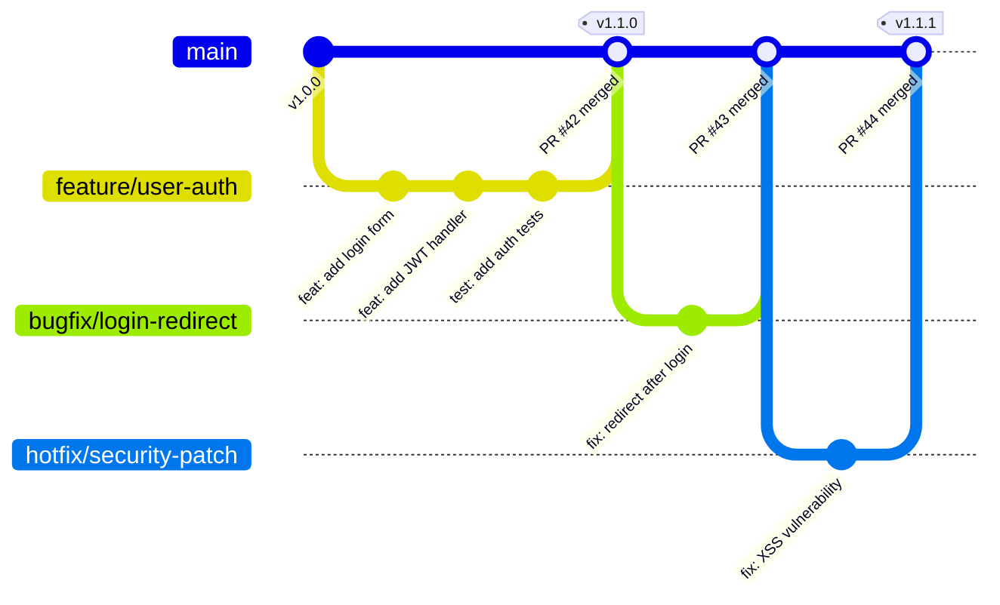
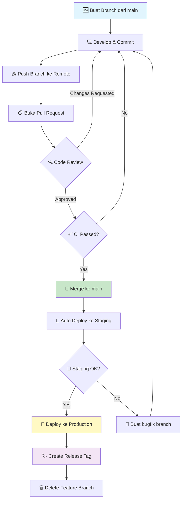
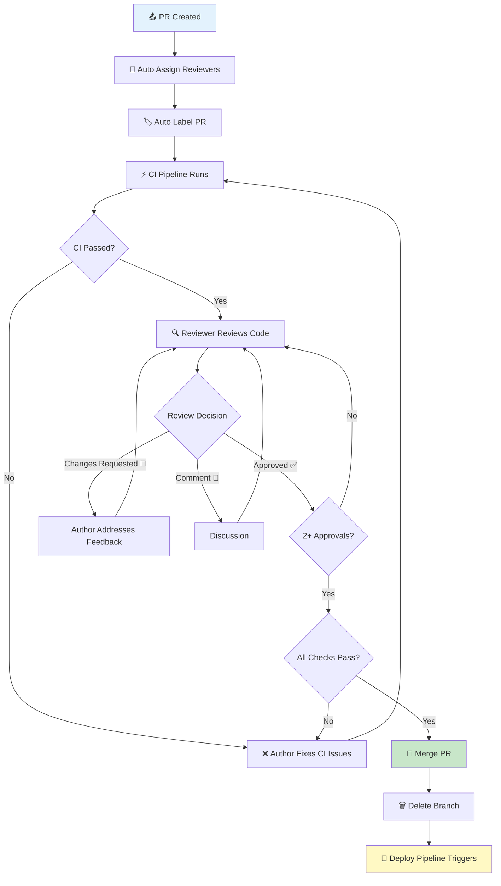
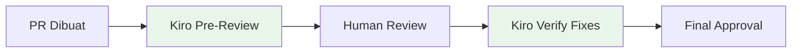
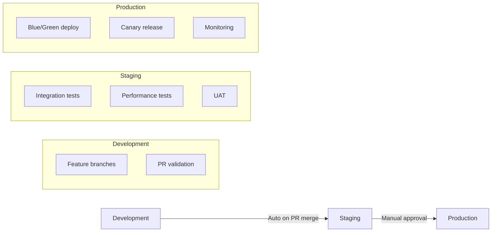

# 15 · GitHub Flow & Pull Request Strategy

> **Versi**: 2.0 · **Terakhir Diperbarui**: 2026-06-17
> **Stack**: .NET 8 · ReactJS 18 · SQL Server 2022
> **Tool**: GitHub, GitHub Actions, Kiro AI, Husky, lint-staged

---

## Daftar Isi

1. [GitHub Flow](#1-github-flow)
2. [Branch Naming Conventions](#2-branch-naming-conventions)
3. [Commit Message Conventions](#3-commit-message-conventions)
4. [Git Hooks Setup](#4-git-hooks-setup)
5. [Gitignore Templates](#5-gitignore-templates)
6. [Pull Request Strategy](#6-pull-request-strategy)
7. [Code Review dengan Kiro](#7-code-review-dengan-kiro)
8. [CI/CD Integration](#8-cicd-integration)
9. [GitHub Actions Workflow Files](#9-github-actions-workflow-files)

---

## 1. GitHub Flow

### 1.1 Filosofi

GitHub Flow adalah model branching yang sederhana namun powerful. Prinsip utamanya:

- **`main` selalu deployable** — setiap commit di `main` harus production-ready
- **Branch dari `main`, merge ke `main`** — tidak ada branch perantara yang long-lived
- **Pull Request sebagai gerbang kualitas** — setiap perubahan melalui PR review
- **Deploy setelah merge** — continuous deployment dari `main`

> [!IMPORTANT]
> Branch `main` adalah **single source of truth**. Tidak boleh ada direct push ke `main`. Semua perubahan harus melalui Pull Request yang sudah di-review dan lulus CI.

### 1.2 Branch Lifecycle



### 1.3 Alur Kerja Detail



### 1.4 Aturan Branch

| Aspek | Aturan |
|-------|--------|
| Branch hidup maksimal | 5 hari kerja (feature), 1 hari (hotfix) |
| Rebase dari main | Minimal 1x sehari |
| Jumlah branch aktif per developer | Maksimal 2 |
| Stale branch cleanup | Otomatis setelah 14 hari |
| Branch protection | `main` — require PR, require CI, require 2 reviewers |

---

## 2. Branch Naming Conventions

### 2.1 Format

```
<type>/<ticket-id>-<short-description>
```

### 2.2 Tipe Branch

| Prefix | Penggunaan | Contoh | Lifetime |
|--------|-----------|--------|----------|
| `feature/` | Fitur baru | `feature/PROJ-123-user-authentication` | 1-5 hari |
| `bugfix/` | Perbaikan bug non-urgent | `bugfix/PROJ-456-login-redirect-loop` | 1-2 hari |
| `hotfix/` | Perbaikan urgent production | `hotfix/PROJ-789-xss-vulnerability` | < 4 jam |
| `release/` | Persiapan release | `release/v2.1.0` | 1-2 hari |
| `chore/` | Maintenance, dependency update | `chore/PROJ-101-update-dotnet-sdk` | 1 hari |
| `docs/` | Dokumentasi saja | `docs/PROJ-102-api-documentation` | 1 hari |
| `refactor/` | Refactoring tanpa behavior change | `refactor/PROJ-103-extract-auth-service` | 1-3 hari |
| `test/` | Penambahan test saja | `test/PROJ-104-integration-tests` | 1-2 hari |
| `perf/` | Performance improvement | `perf/PROJ-105-query-optimization` | 1-3 hari |
| `experiment/` | Explorasi, POC | `experiment/PROJ-106-grpc-migration` | Flexible |

### 2.3 Aturan Naming

```bash
# ✅ BENAR
feature/PROJ-123-add-user-registration
bugfix/PROJ-456-fix-null-reference-exception
hotfix/PROJ-789-patch-sql-injection
release/v2.1.0
chore/update-nuget-packages

# ❌ SALAH
Feature/PROJ-123-add-user-registration     # huruf besar
feature/add-user-registration              # tidak ada ticket ID
feature/PROJ-123                           # tidak ada deskripsi
feature/PROJ-123-Add_User_Registration     # underscore & huruf besar
my-branch                                  # tidak ada prefix
```

### 2.4 Git Alias untuk Branch Creation

```bash
# ~/.gitconfig
[alias]
    # Buat feature branch
    feat = "!f() { git checkout main && git pull && git checkout -b feature/$1; }; f"
    # Buat bugfix branch
    bug = "!f() { git checkout main && git pull && git checkout -b bugfix/$1; }; f"
    # Buat hotfix branch
    hot = "!f() { git checkout main && git pull && git checkout -b hotfix/$1; }; f"
    # Cleanup merged branches
    cleanup = "!git branch --merged main | grep -v 'main' | xargs -n 1 git branch -d"
    # Rebase current branch from main
    rb = "!git fetch origin && git rebase origin/main"
    # Pretty log
    lg = "log --oneline --graph --decorate --all -20"
```

Cara penggunaan:

```bash
git feat PROJ-123-user-authentication
git bug PROJ-456-fix-login
git hot PROJ-789-security-patch
```

---

## 3. Commit Message Conventions

### 3.1 Format (Conventional Commits)

```
<type>(<scope>): <description>

[optional body]

[optional footer(s)]
```

### 3.2 Tipe Commit

| Type | Emoji | Deskripsi | Contoh |
|------|-------|-----------|--------|
| `feat` | ✨ | Fitur baru | `feat(auth): add JWT refresh token` |
| `fix` | 🐛 | Bug fix | `fix(api): handle null reference in UserService` |
| `docs` | 📚 | Dokumentasi | `docs(readme): update API documentation` |
| `style` | 💄 | Formatting (bukan CSS) | `style(api): fix indentation in controllers` |
| `refactor` | ♻️ | Refactoring | `refactor(data): extract repository pattern` |
| `perf` | ⚡ | Performance | `perf(query): optimize user search query` |
| `test` | ✅ | Tests | `test(auth): add unit tests for login` |
| `build` | 📦 | Build system | `build(deps): upgrade to .NET 8.0.3` |
| `ci` | 🔧 | CI configuration | `ci(github): add PR validation workflow` |
| `chore` | 🔨 | Maintenance | `chore(deps): update NuGet packages` |
| `revert` | ⏪ | Revert | `revert: feat(auth): add JWT refresh token` |

### 3.3 Scope yang Digunakan

| Scope | Area |
|-------|------|
| `api` | Backend API (.NET) |
| `web` | Frontend (ReactJS) |
| `db` | Database (SQL Server) |
| `auth` | Authentication & Authorization |
| `infra` | Infrastructure & DevOps |
| `test` | Test infrastructure |
| `deps` | Dependencies |
| `config` | Configuration |

### 3.4 Contoh Commit Message Lengkap

```
feat(api): implement pagination for user list endpoint

- Add keyset pagination using UserID as cursor
- Support configurable page size (default: 20, max: 100)
- Include total count in response headers
- Add ETag support for caching

Performance improvement: Query time reduced from 2.3s to 45ms
for 10M+ row table.

Closes #PROJ-123
Reviewed-by: @senior-dev
```

```
fix(db): resolve deadlock in order processing

Root cause: Two transactions acquiring locks in different order
on Orders and OrderItems tables.

Solution: Standardize lock acquisition order and add ROWLOCK hint
for the OrderItems update statement.

Before: ~15 deadlocks/hour under load
After: 0 deadlocks in 24hr stress test

Fixes #PROJ-456
```

```
perf(api): optimize GetUserProfile response time

- Replace N+1 query pattern with eager loading
- Add Redis caching with 5-minute TTL
- Implement response compression

Benchmark results:
- P50: 230ms → 12ms
- P99: 1.2s → 45ms
- Throughput: 150 req/s → 2,400 req/s

Relates-to #PROJ-789
```

### 3.5 Breaking Changes

```
feat(api)!: change authentication from cookie to bearer token

BREAKING CHANGE: All API consumers must now send authentication
via Authorization header instead of cookies.

Migration guide:
1. Remove cookie-based auth middleware
2. Add Bearer token to request headers
3. Update refresh token endpoint from /auth/refresh-cookie
   to /auth/refresh-token

See migration docs: docs/migration/v2-auth.md
```

---

## 4. Git Hooks Setup

### 4.1 Husky + lint-staged Setup

```bash
# Install di root monorepo
npm init -y
npm install --save-dev husky lint-staged @commitlint/cli @commitlint/config-conventional
npx husky init
```

### 4.2 Package.json Configuration

```json
{
  "name": "project-root",
  "private": true,
  "scripts": {
    "prepare": "husky",
    "lint:frontend": "cd src/frontend && npm run lint",
    "lint:backend": "dotnet format src/backend/Api.sln --verify-no-changes",
    "test:frontend": "cd src/frontend && npm test -- --passWithNoTests",
    "test:backend": "dotnet test src/backend/Api.sln --no-build"
  },
  "lint-staged": {
    "src/frontend/**/*.{ts,tsx}": [
      "eslint --fix",
      "prettier --write"
    ],
    "src/frontend/**/*.{css,scss}": [
      "prettier --write"
    ],
    "src/backend/**/*.cs": [
      "dotnet format --include"
    ],
    "**/*.md": [
      "prettier --write"
    ],
    "**/*.{json,yml,yaml}": [
      "prettier --write"
    ]
  },
  "devDependencies": {
    "husky": "^9.1.0",
    "lint-staged": "^15.2.0",
    "@commitlint/cli": "^19.3.0",
    "@commitlint/config-conventional": "^19.2.0"
  }
}
```

### 4.3 Commitlint Configuration

```javascript
// commitlint.config.js
module.exports = {
  extends: ['@commitlint/config-conventional'],
  rules: {
    'type-enum': [
      2,
      'always',
      [
        'feat', 'fix', 'docs', 'style', 'refactor',
        'perf', 'test', 'build', 'ci', 'chore', 'revert'
      ]
    ],
    'scope-enum': [
      2,
      'always',
      ['api', 'web', 'db', 'auth', 'infra', 'test', 'deps', 'config']
    ],
    'subject-case': [2, 'always', 'lower-case'],
    'subject-max-length': [2, 'always', 100],
    'body-max-line-length': [2, 'always', 120],
    'header-max-length': [2, 'always', 120]
  }
};
```

### 4.4 Husky Hooks

```bash
# .husky/pre-commit
npx lint-staged
```

```bash
# .husky/commit-msg
npx --no -- commitlint --edit ${1}
```

```bash
# .husky/pre-push
#!/usr/bin/env sh

echo "🔍 Running pre-push checks..."

# Run backend tests
echo "📋 Running .NET tests..."
dotnet test src/backend/Api.sln --no-restore --verbosity quiet
if [ $? -ne 0 ]; then
  echo "❌ Backend tests failed. Push aborted."
  exit 1
fi

# Run frontend tests
echo "📋 Running React tests..."
cd src/frontend && npm test -- --watchAll=false --passWithNoTests
if [ $? -ne 0 ]; then
  echo "❌ Frontend tests failed. Push aborted."
  exit 1
fi

echo "✅ All pre-push checks passed!"
```

### 4.5 Custom Hook: Branch Name Validator

```bash
# .husky/pre-commit (tambahan)
#!/usr/bin/env sh

# Validate branch name
BRANCH=$(git rev-parse --abbrev-ref HEAD)
PATTERN="^(feature|bugfix|hotfix|release|chore|docs|refactor|test|perf|experiment)\/.+$"

if [[ "$BRANCH" == "main" ]]; then
  echo "❌ Direct commits to 'main' are not allowed!"
  exit 1
fi

if [[ ! "$BRANCH" =~ $PATTERN ]]; then
  echo "❌ Branch name '$BRANCH' does not match naming convention."
  echo "Expected format: <type>/<ticket-id>-<description>"
  echo "Example: feature/PROJ-123-user-authentication"
  exit 1
fi

npx lint-staged
```

---

## 5. Gitignore Templates

### 5.1 Root .gitignore

```gitignore
# =============================================================================
# ROOT .gitignore — .NET 8 + ReactJS + SQL Server Monorepo
# =============================================================================

# ---- OS Files ----
.DS_Store
.DS_Store?
._*
.Spotlight-V100
.Trashes
Thumbs.db
ehthumbs.db
Desktop.ini

# ---- IDE ----
.vs/
.vscode/settings.json
.idea/
*.suo
*.user
*.userosscache
*.sln.docstates
*.swp
*.swo
*~

# ---- .NET ----
[Bb]in/
[Oo]bj/
[Dd]ebug/
[Rr]elease/
x64/
x86/
[Aa][Rr][Mm]/
[Aa][Rr][Mm]64/
bld/
[Ll]og/
[Ll]ogs/

# NuGet
*.nupkg
**/[Pp]ackages/*
!**/[Pp]ackages/build/
*.nuget.props
*.nuget.targets
project.lock.json
project.fragment.lock.json
artifacts/

# User secrets
secrets.json
appsettings.*.json
!appsettings.json
!appsettings.Development.json.template

# Entity Framework
*.mdf
*.ldf
*.ndf

# ---- ReactJS / Node ----
node_modules/
build/
dist/
.next/
.cache/
*.tsbuildinfo
.env
.env.local
.env.development.local
.env.test.local
.env.production.local
npm-debug.log*
yarn-debug.log*
yarn-error.log*
pnpm-debug.log*
.pnp.*

# ---- Testing ----
coverage/
TestResults/
*.trx
*.coverage
*.coveragexml
lcov.info

# ---- Docker ----
docker-compose.override.yml
.docker/data/

# ---- Terraform / IaC ----
.terraform/
*.tfstate
*.tfstate.*
*.tfvars
!*.tfvars.example

# ---- Secrets & Certificates ----
*.pfx
*.key
*.pem
*.p12
*.cer
!*.cer.example

# ---- Misc ----
*.log
*.tmp
*.temp
*.bak
*.orig
```

### 5.2 Backend .gitignore (src/backend/)

```gitignore
# .NET specific additions for backend
[Bb]in/
[Oo]bj/
*.user
*.dbmdl
*.jfm
appsettings.*.json
!appsettings.json
!appsettings.Development.json.template
launchSettings.json
BundleConfig.json
ScaffoldingReadMe.txt
StyleCopReport.xml
```

### 5.3 Frontend .gitignore (src/frontend/)

```gitignore
# React specific additions for frontend
node_modules/
build/
dist/
coverage/
.env.local
.env.development.local
.env.test.local
.env.production.local
*.tsbuildinfo
.eslintcache
.cache
storybook-static/
```

---

## 6. Pull Request Strategy

### 6.1 PR Template

Simpan sebagai `.github/PULL_REQUEST_TEMPLATE.md`:

```markdown
## 📋 Deskripsi

<!-- Jelaskan perubahan yang dilakukan dan alasannya -->

### Tipe Perubahan

- [ ] ✨ Fitur baru (non-breaking change yang menambah fungsionalitas)
- [ ] 🐛 Bug fix (non-breaking change yang memperbaiki masalah)
- [ ] 💥 Breaking change (fix atau fitur yang mengubah behavior existing)
- [ ] ♻️ Refactoring (tidak ada perubahan behavior)
- [ ] 📚 Dokumentasi
- [ ] ⚡ Performance improvement
- [ ] ✅ Test

### Ticket Reference

- Jira/Azure DevOps: `PROJ-XXX`
- Kiro Spec: <!-- link to Kiro spec if applicable -->

---

## 🔍 Detail Perubahan

### Backend (.NET)
<!-- Jelaskan perubahan backend jika ada -->

### Frontend (ReactJS)
<!-- Jelaskan perubahan frontend jika ada -->

### Database
<!-- Jelaskan perubahan database/migration jika ada -->

---

## 🧪 Testing

### Test yang Ditambahkan/Diupdate
- [ ] Unit tests
- [ ] Integration tests
- [ ] E2E tests

### Manual Testing Steps
1. <!-- Langkah 1 -->
2. <!-- Langkah 2 -->
3. <!-- Expected result -->

### Test Results
```
<!-- Paste test output here -->
```

---

## 📸 Screenshots/Video

<!-- Tambahkan screenshot jika ada perubahan UI -->

| Before | After |
|--------|-------|
| <!-- screenshot --> | <!-- screenshot --> |

---

## ✅ Checklist

### Code Quality
- [ ] Kode mengikuti coding standards proyek
- [ ] Self-review sudah dilakukan
- [ ] Tidak ada console.log / Debug.WriteLine yang tertinggal
- [ ] Error handling sudah proper
- [ ] Tidak ada hardcoded values

### Security
- [ ] Tidak ada credentials/secrets di kode
- [ ] Input validation sudah ditambahkan
- [ ] Authorization checks sudah proper
- [ ] SQL injection protection (parameterized queries)

### Performance
- [ ] Query database sudah optimal (checked execution plan)
- [ ] Tidak ada N+1 query problem
- [ ] Caching sudah dipertimbangkan
- [ ] Large dataset sudah di-handle dengan pagination

### Documentation
- [ ] XML documentation untuk public APIs
- [ ] README diupdate jika perlu
- [ ] API documentation (Swagger) diupdate
- [ ] Migration guide jika breaking change

### Database
- [ ] Migration script sudah dibuat
- [ ] Rollback script tersedia
- [ ] Index sudah dipertimbangkan
- [ ] Data migration sudah ditest

### Deployment
- [ ] Environment variables baru sudah didokumentasikan
- [ ] Feature flag sudah dikonfigurasi (jika ada)
- [ ] Backward compatible dengan versi sebelumnya

---

## 🚀 Deployment Notes

<!-- Catatan khusus untuk deployment, jika ada -->

- [ ] Perlu database migration
- [ ] Perlu environment variable baru
- [ ] Perlu cache invalidation
- [ ] Perlu koordinasi dengan tim lain

---

## 📝 Notes untuk Reviewer

<!-- Catatan tambahan untuk reviewer -->
```

### 6.2 PR Size Guidelines

| Kategori | Lines Changed | Review Time | Defect Rate |
|----------|--------------|-------------|-------------|
| 🟢 **XS** | 1-10 lines | 5 min | Very Low |
| 🟢 **S** | 11-50 lines | 15 min | Low |
| 🟡 **M** | 51-200 lines | 30 min | Medium |
| 🟠 **L** | 201-400 lines | 1 hour | High |
| 🔴 **XL** | 401-1000 lines | 2 hours | Very High |
| ⛔ **XXL** | 1000+ lines | Reject/Split | Extremely High |

> [!WARNING]
> PR dengan **lebih dari 400 lines** harus dipecah menjadi beberapa PR yang lebih kecil. Studi menunjukkan bahwa defect rate meningkat secara eksponensial setelah 200 lines of change.

**Strategi Memecah PR Besar:**

```
# Contoh: Feature User Registration (800 lines total)

PR #1: Database schema & migrations (100 lines)
  └── Tabel Users, indexes, stored procedures

PR #2: Backend domain & data layer (200 lines)
  └── Entity, Repository, Validator

PR #3: Backend API endpoints (150 lines)
  └── Controller, DTOs, Middleware

PR #4: Frontend components (200 lines)
  └── Form, validation, hooks

PR #5: Integration tests & documentation (150 lines)
  └── E2E tests, API docs, README
```

### 6.3 PR Review Process



### 6.4 Required Reviewers Policy

| Perubahan | Min. Reviewers | Wajib Review Dari |
|-----------|---------------|-------------------|
| Feature baru | 2 | 1 Senior + 1 Peer |
| Bug fix | 1 | 1 Peer |
| Hotfix | 1 | 1 Senior (atau Tech Lead) |
| Database migration | 2 | DBA + 1 Senior |
| Security-related | 2 | Security Champion + Tech Lead |
| Architecture change | 3 | Tech Lead + 2 Senior |
| CI/CD pipeline | 1 | DevOps Engineer |
| Documentation only | 1 | 1 Peer |

### 6.5 Auto-Assignment Rules

```yaml
# .github/CODEOWNERS
# Setiap perubahan di area tertentu memerlukan review dari owner

# Backend (.NET)
/src/backend/                    @backend-team
/src/backend/Api/Controllers/    @backend-seniors
/src/backend/Api/Middleware/     @backend-seniors @security-team
/src/backend/Domain/             @backend-seniors
/src/backend/Infrastructure/     @backend-team

# Frontend (ReactJS)
/src/frontend/                   @frontend-team
/src/frontend/src/components/    @frontend-team
/src/frontend/src/hooks/         @frontend-seniors
/src/frontend/src/store/         @frontend-seniors

# Database
/src/database/                   @dba-team
/src/database/migrations/        @dba-team @backend-seniors

# Infrastructure
/.github/                        @devops-team
/infrastructure/                 @devops-team
/docker/                         @devops-team
Dockerfile                       @devops-team

# Security
**/auth*                         @security-team
**/security*                     @security-team

# Documentation
/docs/                           @tech-writers
*.md                             @tech-writers
```

### 6.6 PR Labels Taxonomy

| Label | Warna | Deskripsi |
|-------|-------|-----------|
| `type: feature` | `#0E8A16` | Fitur baru |
| `type: bugfix` | `#D93F0B` | Perbaikan bug |
| `type: hotfix` | `#B60205` | Perbaikan urgent |
| `type: refactor` | `#5319E7` | Refactoring |
| `type: docs` | `#0075CA` | Dokumentasi |
| `type: chore` | `#FBCA04` | Maintenance |
| `type: perf` | `#F9D0C4` | Performance |
| `size: XS` | `#C2E0C6` | 1-10 lines |
| `size: S` | `#C2E0C6` | 11-50 lines |
| `size: M` | `#FEF2C0` | 51-200 lines |
| `size: L` | `#F9D0C4` | 201-400 lines |
| `size: XL` | `#E99695` | 401-1000 lines |
| `size: XXL` | `#B60205` | 1000+ lines (needs splitting) |
| `area: backend` | `#7057FF` | .NET Backend |
| `area: frontend` | `#008672` | ReactJS Frontend |
| `area: database` | `#D876E3` | SQL Server |
| `area: infra` | `#0E8A16` | Infrastructure |
| `priority: critical` | `#B60205` | Critical priority |
| `priority: high` | `#D93F0B` | High priority |
| `priority: medium` | `#FBCA04` | Medium priority |
| `priority: low` | `#0E8A16` | Low priority |
| `status: WIP` | `#FEF2C0` | Work in progress |
| `status: ready-for-review` | `#C2E0C6` | Ready for review |
| `status: blocked` | `#B60205` | Blocked |
| `needs: DBA-review` | `#D876E3` | Needs DBA review |
| `needs: security-review` | `#B60205` | Needs security review |

### 6.7 PR Merge Strategies

| Strategy | Kapan Digunakan | Pro | Kontra |
|----------|----------------|-----|--------|
| **Squash Merge** | Feature branches, bugfixes | Clean history, 1 commit per PR | Kehilangan granular history |
| **Merge Commit** | Release branches, large features | Preserves full history | Noisy git log |
| **Rebase Merge** | Small, clean PRs | Linear history | Memerlukan clean commits |

> [!TIP]
> **Rekomendasi default: Squash Merge** untuk semua PR kecuali release branches. Ini menghasilkan git history yang bersih di `main` dengan 1 commit = 1 PR = 1 fitur/fix.

**Konfigurasi di Repository Settings:**

```yaml
# Default merge strategy
default_merge_strategy: squash

# Per-branch rules
merge_rules:
  feature/*: squash      # Squash semua commits menjadi 1
  bugfix/*: squash        # Squash semua commits menjadi 1
  hotfix/*: squash        # Squash semua commits menjadi 1
  release/*: merge        # Preserve merge history
```

### 6.8 Branch Protection Rules

```json
{
  "branch": "main",
  "protection": {
    "required_status_checks": {
      "strict": true,
      "contexts": [
        "build-backend",
        "build-frontend",
        "test-backend",
        "test-frontend",
        "lint",
        "security-scan"
      ]
    },
    "enforce_admins": true,
    "required_pull_request_reviews": {
      "dismissal_restrictions": {
        "teams": ["tech-leads"]
      },
      "dismiss_stale_reviews": true,
      "require_code_owner_reviews": true,
      "required_approving_review_count": 2,
      "require_last_push_approval": true
    },
    "restrictions": null,
    "required_linear_history": false,
    "allow_force_pushes": false,
    "allow_deletions": false,
    "block_creations": false,
    "required_conversation_resolution": true,
    "required_signatures": false
  }
}
```

---

## 7. Code Review dengan Kiro

### 7.1 Menggunakan Kiro untuk PR Review

Kiro dapat membantu mempercepat dan meningkatkan kualitas code review. Berikut workflow integrasinya:



### 7.2 Kiro Prompts untuk Code Review

**Prompt 1: General Code Review**

```
Review the following C# code changes for:
1. SOLID principle violations
2. Potential null reference exceptions
3. Missing input validation
4. SQL injection vulnerabilities
5. N+1 query problems
6. Missing error handling
7. Thread safety issues
8. Memory leak potential
9. Performance concerns with large datasets
10. Missing unit test scenarios

For each issue found, provide:
- Severity (Critical/High/Medium/Low)
- Line number
- Description of the issue
- Suggested fix with code example

Code to review:
[paste diff here]
```

**Prompt 2: .NET API Review**

```
Review this .NET 8 Web API code for production readiness:

1. Controller design:
   - Is it following thin controller pattern?
   - Are response types properly typed?
   - Is input validation using FluentValidation?

2. Service layer:
   - Is dependency injection properly used?
   - Are interfaces defined for testability?
   - Is error handling consistent?

3. Data access:
   - Are queries optimized?
   - Is connection management proper?
   - Are transactions used correctly?

4. Security:
   - Authorization attributes present?
   - Input sanitization?
   - Rate limiting considerations?

5. Observability:
   - Structured logging present?
   - Metrics instrumented?
   - Trace correlation IDs?

Code:
[paste code here]
```

**Prompt 3: React Component Review**

```
Review this React component for:

1. Component design:
   - Single responsibility?
   - Proper prop typing with TypeScript?
   - Appropriate component size?

2. State management:
   - Unnecessary re-renders?
   - Proper use of useMemo/useCallback?
   - State lifted to correct level?

3. Effects:
   - Proper cleanup in useEffect?
   - Missing dependencies in dep array?
   - Race condition handling in async effects?

4. Accessibility:
   - ARIA attributes?
   - Keyboard navigation?
   - Screen reader support?

5. Error handling:
   - Error boundaries?
   - Loading states?
   - Empty states?

Component code:
[paste code here]
```

**Prompt 4: SQL Query Review**

```
Review this SQL Server query for performance with 10M+ rows:

1. Execution plan analysis:
   - Table scans vs index seeks?
   - Estimated vs actual row counts?
   - Sort operations that could be avoided?

2. Index usage:
   - Are existing indexes being used?
   - Would new indexes help?
   - Are indexes being used efficiently (no key lookups)?

3. Query patterns:
   - Can it be rewritten for better performance?
   - Are there unnecessary JOINs?
   - Is pagination implemented correctly?

4. Concurrency:
   - Lock escalation risk?
   - Deadlock potential?
   - Isolation level appropriate?

Query:
[paste query here]

Table schema:
[paste schema here]

Current row counts:
[paste counts here]
```

### 7.3 Automated Review Checklist

```yaml
# .github/review-checklist.yml
review_checklist:
  backend:
    - category: "Security"
      items:
        - "No hardcoded secrets or connection strings"
        - "Authorization attributes on all endpoints"
        - "Input validation using FluentValidation"
        - "Parameterized SQL queries (no string concatenation)"
        - "CORS properly configured"

    - category: "Performance"
      items:
        - "No N+1 queries (use Include/ThenInclude or explicit JOINs)"
        - "Pagination implemented for list endpoints"
        - "Appropriate caching strategy"
        - "Async/await used correctly (no .Result or .Wait())"
        - "IQueryable used before materialization"

    - category: "Error Handling"
      items:
        - "Global exception handler covers all cases"
        - "Specific exceptions caught (no catch-all)"
        - "Meaningful error messages returned"
        - "Errors logged with context"

    - category: "Testing"
      items:
        - "Unit tests for business logic (≥80% coverage)"
        - "Integration tests for API endpoints"
        - "Edge cases covered (null, empty, boundary values)"
        - "Test data uses builders/fixtures"

  frontend:
    - category: "UX"
      items:
        - "Loading states implemented"
        - "Error states with retry option"
        - "Empty states with helpful messaging"
        - "Responsive design verified"
        - "Accessibility tested (keyboard, screen reader)"

    - category: "Performance"
      items:
        - "Components properly memoized"
        - "Images optimized and lazy loaded"
        - "Bundle size impact checked"
        - "No unnecessary re-renders"

    - category: "Code Quality"
      items:
        - "TypeScript strict mode compliance"
        - "No any types"
        - "Custom hooks extracted for reuse"
        - "Consistent naming conventions"
```

### 7.4 Review Feedback Templates

**Template: Request Changes**

```markdown
## 🔄 Changes Requested

### Critical Issues (must fix before merge)
1. **[Security]** Line 45: SQL query using string interpolation instead of parameterized query
   ```csharp
   // ❌ Current
   var query = $"SELECT * FROM Users WHERE Name = '{name}'";

   // ✅ Suggested
   var query = "SELECT * FROM Users WHERE Name = @Name";
   cmd.Parameters.AddWithValue("@Name", name);
   ```

### Suggestions (nice to have)
1. **[Performance]** Line 78: Consider adding `AsNoTracking()` for read-only queries
2. **[Style]** Line 92: Variable name `x` could be more descriptive

### Questions
1. Line 120: Is this intentionally using eager loading? The `Include()` chain might be expensive.

### Positive Feedback 👍
- Great use of the repository pattern!
- Test coverage looks comprehensive
```

**Template: Approval**

```markdown
## ✅ Approved

### Review Summary
- **Code Quality**: Excellent — clean, well-structured code
- **Testing**: Comprehensive — good coverage of edge cases
- **Performance**: No concerns — queries are well-optimized
- **Security**: Verified — proper input validation and auth

### Minor Suggestions (optional, non-blocking)
1. Line 45: Consider extracting this into a separate method for readability
2. Line 78: `// TODO` comment could have a ticket reference

LGTM! 🚀
```

---

## 8. CI/CD Integration

### 8.1 Pipeline Architecture

```mermaid
flowchart TD
    subgraph "PR Pipeline"
        A["PR Created/Updated"] --> B["Lint & Format Check"]
        B --> C["Build Backend (.NET 8)"]
        C --> D["Build Frontend (React)"]
        D --> E["Run Unit Tests"]
        E --> F["Run Integration Tests"]
        F --> G["Security Scan (SAST)"]
        G --> H["Code Coverage Report"]
        H --> I{"All Checks Pass?"}
        I -->|Yes| J["✅ PR Ready for Review"]
        I -->|No| K["❌ PR Blocked"]
    end

    subgraph "Merge Pipeline"
        L["PR Merged to main"] --> M["Build & Test (full)"]
        M --> N["Build Docker Images"]
        N --> O["Push to Container Registry"]
        O --> P["Deploy to Staging"]
        P --> Q["Run Smoke Tests"]
        Q --> R{"Staging OK?"}
        R -->|Yes| S["Manual Approval Gate"]
        R -->|No| T["❌ Rollback & Alert"]
        S --> U["Deploy to Production"]
        U --> V["Run Prod Smoke Tests"]
        V --> W["Create Release Tag"]
    end

    style J fill:#c8e6c9
    style K fill:#ffcdd2
    style U fill:#fff9c4
    style T fill:#ffcdd2
```



### 8.2 Environment Promotion Strategy



| Environment | Trigger | Tests | Approval |
|-------------|---------|-------|----------|
| **PR** | Push to PR branch | Lint, Unit, Integration | Automated |
| **Staging** | Merge to `main` | All + Smoke + E2E | Automated |
| **Production** | Manual trigger | Smoke + Health check | Manual (Tech Lead) |

---

## 9. GitHub Actions Workflow Files

### 9.1 ci.yml — Build + Test

```yaml
# .github/workflows/ci.yml
name: "🔨 CI — Build & Test"

on:
  push:
    branches: [main]
  pull_request:
    branches: [main]

concurrency:
  group: ci-${{ github.ref }}
  cancel-in-progress: true

env:
  DOTNET_VERSION: "8.0.x"
  NODE_VERSION: "20.x"
  DOTNET_SKIP_FIRST_TIME_EXPERIENCE: true
  DOTNET_NOLOGO: true
  NUGET_PACKAGES: ${{ github.workspace }}/.nuget/packages

jobs:
  # ──────────────────────────────────────────────
  # Job 1: Lint & Format Check
  # ──────────────────────────────────────────────
  lint:
    name: "🔍 Lint & Format"
    runs-on: ubuntu-latest
    steps:
      - name: Checkout
        uses: actions/checkout@v4

      - name: Setup .NET
        uses: actions/setup-dotnet@v4
        with:
          dotnet-version: ${{ env.DOTNET_VERSION }}

      - name: Setup Node.js
        uses: actions/setup-node@v4
        with:
          node-version: ${{ env.NODE_VERSION }}
          cache: "npm"
          cache-dependency-path: src/frontend/package-lock.json

      - name: Check .NET Format
        run: dotnet format src/backend/Api.sln --verify-no-changes --verbosity diagnostic

      - name: Install Frontend Dependencies
        working-directory: src/frontend
        run: npm ci

      - name: Lint Frontend
        working-directory: src/frontend
        run: |
          npm run lint
          npm run type-check

  # ──────────────────────────────────────────────
  # Job 2: Build & Test Backend
  # ──────────────────────────────────────────────
  build-backend:
    name: "🏗️ Build & Test Backend"
    runs-on: ubuntu-latest
    needs: lint
    services:
      sqlserver:
        image: mcr.microsoft.com/mssql/server:2022-latest
        env:
          SA_PASSWORD: "YourStrong@Passw0rd"
          ACCEPT_EULA: "Y"
        ports:
          - 1433:1433
        options: >-
          --health-cmd "/opt/mssql-tools18/bin/sqlcmd -S localhost -U sa -P YourStrong@Passw0rd -C -Q 'SELECT 1'"
          --health-interval 10s
          --health-timeout 5s
          --health-retries 5

    steps:
      - name: Checkout
        uses: actions/checkout@v4

      - name: Setup .NET
        uses: actions/setup-dotnet@v4
        with:
          dotnet-version: ${{ env.DOTNET_VERSION }}

      - name: Cache NuGet Packages
        uses: actions/cache@v4
        with:
          path: ${{ env.NUGET_PACKAGES }}
          key: nuget-${{ hashFiles('**/packages.lock.json') }}
          restore-keys: nuget-

      - name: Restore Dependencies
        run: dotnet restore src/backend/Api.sln

      - name: Build
        run: dotnet build src/backend/Api.sln --configuration Release --no-restore

      - name: Run Unit Tests
        run: |
          dotnet test src/backend/Tests.Unit/Tests.Unit.csproj \
            --configuration Release \
            --no-build \
            --logger "trx;LogFileName=unit-test-results.trx" \
            --collect:"XPlat Code Coverage" \
            --results-directory ./TestResults/Unit
        env:
          DOTNET_ENVIRONMENT: Test

      - name: Run Integration Tests
        run: |
          dotnet test src/backend/Tests.Integration/Tests.Integration.csproj \
            --configuration Release \
            --no-build \
            --logger "trx;LogFileName=integration-test-results.trx" \
            --collect:"XPlat Code Coverage" \
            --results-directory ./TestResults/Integration
        env:
          DOTNET_ENVIRONMENT: Test
          ConnectionStrings__DefaultConnection: "Server=localhost,1433;Database=TestDb;User Id=sa;Password=YourStrong@Passw0rd;TrustServerCertificate=True"

      - name: Generate Coverage Report
        uses: danielpalme/ReportGenerator-GitHub-Action@5
        with:
          reports: "./TestResults/**/coverage.cobertura.xml"
          targetdir: "./TestResults/CoverageReport"
          reporttypes: "HtmlInline_AzurePipelines;Cobertura;MarkdownSummaryGithub"

      - name: Publish Coverage Summary
        if: github.event_name == 'pull_request'
        uses: marocchino/sticky-pull-request-comment@v2
        with:
          path: ./TestResults/CoverageReport/SummaryGithub.md

      - name: Upload Test Results
        if: always()
        uses: actions/upload-artifact@v4
        with:
          name: backend-test-results
          path: ./TestResults/

      - name: Check Coverage Threshold
        run: |
          COVERAGE=$(grep -oP 'line-rate="\K[^"]+' ./TestResults/CoverageReport/Cobertura.xml | head -1)
          COVERAGE_PCT=$(echo "$COVERAGE * 100" | bc)
          echo "Coverage: ${COVERAGE_PCT}%"
          if (( $(echo "$COVERAGE_PCT < 80" | bc -l) )); then
            echo "❌ Code coverage ${COVERAGE_PCT}% is below minimum threshold of 80%"
            exit 1
          fi
          echo "✅ Code coverage ${COVERAGE_PCT}% meets threshold"

  # ──────────────────────────────────────────────
  # Job 3: Build & Test Frontend
  # ──────────────────────────────────────────────
  build-frontend:
    name: "🏗️ Build & Test Frontend"
    runs-on: ubuntu-latest
    needs: lint
    steps:
      - name: Checkout
        uses: actions/checkout@v4

      - name: Setup Node.js
        uses: actions/setup-node@v4
        with:
          node-version: ${{ env.NODE_VERSION }}
          cache: "npm"
          cache-dependency-path: src/frontend/package-lock.json

      - name: Install Dependencies
        working-directory: src/frontend
        run: npm ci

      - name: Run Tests
        working-directory: src/frontend
        run: npm test -- --coverage --watchAll=false --ci
        env:
          CI: true

      - name: Build
        working-directory: src/frontend
        run: npm run build
        env:
          CI: true
          GENERATE_SOURCEMAP: false

      - name: Check Bundle Size
        working-directory: src/frontend
        run: |
          MAX_SIZE_KB=500
          BUNDLE_SIZE=$(du -sk build/static/js/*.js | awk '{total += $1} END {print total}')
          echo "Bundle size: ${BUNDLE_SIZE}KB"
          if [ "$BUNDLE_SIZE" -gt "$MAX_SIZE_KB" ]; then
            echo "⚠️ Bundle size ${BUNDLE_SIZE}KB exceeds ${MAX_SIZE_KB}KB limit"
            exit 1
          fi
          echo "✅ Bundle size OK"

      - name: Upload Build Artifact
        uses: actions/upload-artifact@v4
        with:
          name: frontend-build
          path: src/frontend/build/

      - name: Upload Coverage
        if: github.event_name == 'pull_request'
        uses: actions/upload-artifact@v4
        with:
          name: frontend-coverage
          path: src/frontend/coverage/

  # ──────────────────────────────────────────────
  # Job 4: Security Scan
  # ──────────────────────────────────────────────
  security:
    name: "🔐 Security Scan"
    runs-on: ubuntu-latest
    needs: [build-backend, build-frontend]
    steps:
      - name: Checkout
        uses: actions/checkout@v4

      - name: Run Trivy vulnerability scanner
        uses: aquasecurity/trivy-action@master
        with:
          scan-type: "fs"
          scan-ref: "."
          format: "sarif"
          output: "trivy-results.sarif"
          severity: "CRITICAL,HIGH"

      - name: Upload Trivy scan results
        uses: github/codeql-action/upload-sarif@v3
        with:
          sarif_file: "trivy-results.sarif"

      - name: .NET Security Audit
        run: |
          dotnet list src/backend/Api.sln package --vulnerable --include-transitive 2>&1 | tee security-report.txt
          if grep -q "has the following vulnerable packages" security-report.txt; then
            echo "❌ Vulnerable packages found!"
            exit 1
          fi

      - name: NPM Audit
        working-directory: src/frontend
        run: npm audit --production --audit-level=high
```

### 9.2 cd-staging.yml — Deploy to Staging

```yaml
# .github/workflows/cd-staging.yml
name: "🚀 CD — Deploy to Staging"

on:
  push:
    branches: [main]
  workflow_dispatch:

concurrency:
  group: deploy-staging
  cancel-in-progress: false

env:
  REGISTRY: ghcr.io
  IMAGE_PREFIX: ${{ github.repository }}
  DOTNET_VERSION: "8.0.x"
  NODE_VERSION: "20.x"

jobs:
  # ──────────────────────────────────────────────
  # Job 1: Build & Push Docker Images
  # ──────────────────────────────────────────────
  build-images:
    name: "📦 Build Docker Images"
    runs-on: ubuntu-latest
    permissions:
      contents: read
      packages: write
    outputs:
      image-tag: ${{ steps.meta.outputs.version }}
    steps:
      - name: Checkout
        uses: actions/checkout@v4

      - name: Login to Container Registry
        uses: docker/login-action@v3
        with:
          registry: ${{ env.REGISTRY }}
          username: ${{ github.actor }}
          password: ${{ secrets.GITHUB_TOKEN }}

      - name: Extract metadata
        id: meta
        uses: docker/metadata-action@v5
        with:
          images: ${{ env.REGISTRY }}/${{ env.IMAGE_PREFIX }}
          tags: |
            type=sha,prefix=staging-
            type=raw,value=staging-latest

      - name: Build & Push API Image
        uses: docker/build-push-action@v5
        with:
          context: .
          file: ./docker/Dockerfile.api
          push: true
          tags: |
            ${{ env.REGISTRY }}/${{ env.IMAGE_PREFIX }}/api:staging-${{ github.sha }}
            ${{ env.REGISTRY }}/${{ env.IMAGE_PREFIX }}/api:staging-latest
          cache-from: type=gha
          cache-to: type=gha,mode=max
          build-args: |
            DOTNET_VERSION=${{ env.DOTNET_VERSION }}
            BUILD_CONFIGURATION=Release

      - name: Build & Push Frontend Image
        uses: docker/build-push-action@v5
        with:
          context: .
          file: ./docker/Dockerfile.frontend
          push: true
          tags: |
            ${{ env.REGISTRY }}/${{ env.IMAGE_PREFIX }}/frontend:staging-${{ github.sha }}
            ${{ env.REGISTRY }}/${{ env.IMAGE_PREFIX }}/frontend:staging-latest
          cache-from: type=gha
          cache-to: type=gha,mode=max
          build-args: |
            NODE_VERSION=${{ env.NODE_VERSION }}
            REACT_APP_API_URL=https://api-staging.example.com

  # ──────────────────────────────────────────────
  # Job 2: Run Database Migrations
  # ──────────────────────────────────────────────
  migrate-database:
    name: "🗄️ Database Migration"
    runs-on: ubuntu-latest
    needs: build-images
    environment: staging
    steps:
      - name: Checkout
        uses: actions/checkout@v4

      - name: Setup .NET
        uses: actions/setup-dotnet@v4
        with:
          dotnet-version: ${{ env.DOTNET_VERSION }}

      - name: Install EF Core tools
        run: dotnet tool install --global dotnet-ef

      - name: Run Migrations
        run: |
          dotnet ef database update \
            --project src/backend/Infrastructure \
            --startup-project src/backend/Api \
            --connection "${{ secrets.STAGING_DB_CONNECTION }}"
        env:
          DOTNET_ENVIRONMENT: Staging

  # ──────────────────────────────────────────────
  # Job 3: Deploy to Staging
  # ──────────────────────────────────────────────
  deploy:
    name: "🚀 Deploy to Staging"
    runs-on: ubuntu-latest
    needs: [build-images, migrate-database]
    environment:
      name: staging
      url: https://staging.example.com
    steps:
      - name: Checkout
        uses: actions/checkout@v4

      - name: Setup kubectl
        uses: azure/setup-kubectl@v3

      - name: Set Kubernetes context
        uses: azure/k8s-set-context@v3
        with:
          method: kubeconfig
          kubeconfig: ${{ secrets.STAGING_KUBECONFIG }}

      - name: Deploy to Kubernetes
        run: |
          # Update image tags
          kubectl set image deployment/api-deployment \
            api=${{ env.REGISTRY }}/${{ env.IMAGE_PREFIX }}/api:staging-${{ github.sha }} \
            -n staging

          kubectl set image deployment/frontend-deployment \
            frontend=${{ env.REGISTRY }}/${{ env.IMAGE_PREFIX }}/frontend:staging-${{ github.sha }} \
            -n staging

          # Wait for rollout
          kubectl rollout status deployment/api-deployment -n staging --timeout=300s
          kubectl rollout status deployment/frontend-deployment -n staging --timeout=300s

      - name: Run Smoke Tests
        run: |
          echo "🧪 Running staging smoke tests..."

          # Health check
          HTTP_STATUS=$(curl -s -o /dev/null -w "%{http_code}" https://api-staging.example.com/health)
          if [ "$HTTP_STATUS" != "200" ]; then
            echo "❌ API health check failed: HTTP $HTTP_STATUS"
            exit 1
          fi

          # Frontend check
          HTTP_STATUS=$(curl -s -o /dev/null -w "%{http_code}" https://staging.example.com)
          if [ "$HTTP_STATUS" != "200" ]; then
            echo "❌ Frontend health check failed: HTTP $HTTP_STATUS"
            exit 1
          fi

          echo "✅ Smoke tests passed!"

      - name: Notify Deployment
        if: always()
        uses: slackapi/slack-github-action@v1
        with:
          payload: |
            {
              "text": "${{ job.status == 'success' && '✅' || '❌' }} Staging Deployment ${{ job.status }}",
              "blocks": [
                {
                  "type": "section",
                  "text": {
                    "type": "mrkdwn",
                    "text": "*Staging Deployment ${{ job.status }}*\n• Commit: `${{ github.sha }}`\n• Author: ${{ github.actor }}\n• <https://staging.example.com|View Staging>"
                  }
                }
              ]
            }
        env:
          SLACK_WEBHOOK_URL: ${{ secrets.SLACK_WEBHOOK_STAGING }}
```

### 9.3 cd-production.yml — Deploy to Production

```yaml
# .github/workflows/cd-production.yml
name: "🎯 CD — Deploy to Production"

on:
  workflow_dispatch:
    inputs:
      image_tag:
        description: "Image tag to deploy (e.g., staging-abc1234)"
        required: true
        type: string
      skip_approval:
        description: "Skip manual approval (emergency only)"
        required: false
        type: boolean
        default: false

concurrency:
  group: deploy-production
  cancel-in-progress: false

env:
  REGISTRY: ghcr.io
  IMAGE_PREFIX: ${{ github.repository }}

jobs:
  # ──────────────────────────────────────────────
  # Job 1: Pre-deployment Validation
  # ──────────────────────────────────────────────
  validate:
    name: "✅ Pre-deployment Validation"
    runs-on: ubuntu-latest
    steps:
      - name: Verify image exists
        run: |
          echo "Verifying image tag: ${{ inputs.image_tag }}"
          # Verify the image was tested on staging
          if [[ ! "${{ inputs.image_tag }}" =~ ^staging- ]]; then
            echo "❌ Image tag must start with 'staging-' (must be tested on staging first)"
            exit 1
          fi

      - name: Check staging health
        run: |
          HTTP_STATUS=$(curl -s -o /dev/null -w "%{http_code}" https://api-staging.example.com/health)
          if [ "$HTTP_STATUS" != "200" ]; then
            echo "❌ Staging is unhealthy. Fix staging before deploying to production."
            exit 1
          fi
          echo "✅ Staging is healthy"

  # ──────────────────────────────────────────────
  # Job 2: Manual Approval
  # ──────────────────────────────────────────────
  approval:
    name: "🔐 Manual Approval"
    runs-on: ubuntu-latest
    needs: validate
    if: ${{ !inputs.skip_approval }}
    environment:
      name: production-approval
    steps:
      - name: Approval Granted
        run: echo "✅ Deployment approved by ${{ github.actor }}"

  # ──────────────────────────────────────────────
  # Job 3: Database Migration
  # ──────────────────────────────────────────────
  migrate-database:
    name: "🗄️ Production Database Migration"
    runs-on: ubuntu-latest
    needs: [validate, approval]
    if: always() && needs.validate.result == 'success' && (needs.approval.result == 'success' || needs.approval.result == 'skipped')
    environment: production
    steps:
      - name: Checkout
        uses: actions/checkout@v4

      - name: Setup .NET
        uses: actions/setup-dotnet@v4
        with:
          dotnet-version: "8.0.x"

      - name: Create Migration Backup
        run: |
          echo "📸 Creating pre-migration database backup..."
          # Trigger backup via Azure CLI or custom script
          # az sql db export ...

      - name: Run Migrations
        run: |
          dotnet tool install --global dotnet-ef
          dotnet ef database update \
            --project src/backend/Infrastructure \
            --startup-project src/backend/Api \
            --connection "${{ secrets.PROD_DB_CONNECTION }}"

  # ──────────────────────────────────────────────
  # Job 4: Blue-Green Deployment
  # ──────────────────────────────────────────────
  deploy:
    name: "🎯 Deploy to Production"
    runs-on: ubuntu-latest
    needs: migrate-database
    environment:
      name: production
      url: https://app.example.com
    steps:
      - name: Checkout
        uses: actions/checkout@v4

      - name: Setup kubectl
        uses: azure/setup-kubectl@v3

      - name: Set Kubernetes context
        uses: azure/k8s-set-context@v3
        with:
          method: kubeconfig
          kubeconfig: ${{ secrets.PROD_KUBECONFIG }}

      - name: Deploy Green (new version)
        run: |
          # Deploy to green slot
          IMAGE_TAG="${{ inputs.image_tag }}"
          PROD_TAG="${IMAGE_TAG/staging-/prod-}"

          kubectl set image deployment/api-green \
            api=${{ env.REGISTRY }}/${{ env.IMAGE_PREFIX }}/api:${IMAGE_TAG} \
            -n production

          kubectl set image deployment/frontend-green \
            frontend=${{ env.REGISTRY }}/${{ env.IMAGE_PREFIX }}/frontend:${IMAGE_TAG} \
            -n production

          # Wait for green to be ready
          kubectl rollout status deployment/api-green -n production --timeout=300s
          kubectl rollout status deployment/frontend-green -n production --timeout=300s

      - name: Run Production Smoke Tests (Green)
        run: |
          echo "🧪 Running smoke tests on green deployment..."
          # Test against green service directly
          HTTP_STATUS=$(curl -s -o /dev/null -w "%{http_code}" http://api-green.production.svc:80/health)
          if [ "$HTTP_STATUS" != "200" ]; then
            echo "❌ Green deployment smoke test failed"
            exit 1
          fi
          echo "✅ Green smoke tests passed"

      - name: Switch Traffic to Green
        run: |
          echo "🔄 Switching traffic from blue to green..."
          kubectl patch service api-service -n production \
            -p '{"spec":{"selector":{"slot":"green"}}}'
          kubectl patch service frontend-service -n production \
            -p '{"spec":{"selector":{"slot":"green"}}}'
          echo "✅ Traffic switched to green"

      - name: Verify Production
        run: |
          sleep 10
          HTTP_STATUS=$(curl -s -o /dev/null -w "%{http_code}" https://api.example.com/health)
          if [ "$HTTP_STATUS" != "200" ]; then
            echo "❌ Production verification failed! Initiating rollback..."
            kubectl patch service api-service -n production \
              -p '{"spec":{"selector":{"slot":"blue"}}}'
            kubectl patch service frontend-service -n production \
              -p '{"spec":{"selector":{"slot":"blue"}}}'
            echo "⏪ Rolled back to blue"
            exit 1
          fi
          echo "✅ Production is healthy!"

      - name: Create Release Tag
        run: |
          VERSION=$(date +'v%Y.%m.%d-%H%M')
          git tag -a $VERSION -m "Production release $VERSION"
          git push origin $VERSION

      - name: Notify Production Deployment
        if: always()
        uses: slackapi/slack-github-action@v1
        with:
          payload: |
            {
              "text": "${{ job.status == 'success' && '✅' || '🚨' }} Production Deployment ${{ job.status }}",
              "blocks": [
                {
                  "type": "section",
                  "text": {
                    "type": "mrkdwn",
                    "text": "*${{ job.status == 'success' && '✅ Production Deployment Successful' || '🚨 PRODUCTION DEPLOYMENT FAILED' }}*\n• Image: `${{ inputs.image_tag }}`\n• Deployed by: ${{ github.actor }}\n• <https://app.example.com|View Production>"
                  }
                }
              ]
            }
        env:
          SLACK_WEBHOOK_URL: ${{ secrets.SLACK_WEBHOOK_PRODUCTION }}
```

### 9.4 pr-check.yml — PR Validation

```yaml
# .github/workflows/pr-check.yml
name: "📋 PR Check — Validation"

on:
  pull_request:
    types: [opened, synchronize, reopened, edited, labeled]

permissions:
  contents: read
  pull-requests: write
  checks: write

jobs:
  # ──────────────────────────────────────────────
  # Job 1: PR Metadata Validation
  # ──────────────────────────────────────────────
  pr-metadata:
    name: "📋 PR Metadata Check"
    runs-on: ubuntu-latest
    steps:
      - name: Validate PR Title (Conventional Commits)
        uses: amannn/action-semantic-pull-request@v5
        with:
          types: |
            feat
            fix
            docs
            style
            refactor
            perf
            test
            build
            ci
            chore
            revert
          scopes: |
            api
            web
            db
            auth
            infra
            test
            deps
            config
          requireScope: false
          subjectPattern: ^[a-z].+$
          subjectPatternError: |
            PR title subject must start with a lowercase letter.
            Example: "feat(api): add user registration endpoint"
        env:
          GITHUB_TOKEN: ${{ secrets.GITHUB_TOKEN }}

      - name: Check PR Description
        uses: actions/github-script@v7
        with:
          script: |
            const pr = context.payload.pull_request;
            const body = pr.body || '';

            const errors = [];

            // Check minimum description length
            if (body.length < 50) {
              errors.push('PR description is too short (minimum 50 characters)');
            }

            // Check for required sections
            const requiredSections = ['Deskripsi', 'Testing', 'Checklist'];
            for (const section of requiredSections) {
              if (!body.includes(section)) {
                errors.push(`Missing required section: "${section}"`);
              }
            }

            // Check for ticket reference
            if (!body.match(/PROJ-\d+/)) {
              errors.push('Missing ticket reference (e.g., PROJ-123)');
            }

            if (errors.length > 0) {
              const message = '## ❌ PR Validation Failed\n\n' +
                errors.map(e => `- ${e}`).join('\n') +
                '\n\nPlease update your PR to meet the requirements.';

              await github.rest.issues.createComment({
                owner: context.repo.owner,
                repo: context.repo.repo,
                issue_number: pr.number,
                body: message
              });

              core.setFailed('PR validation failed');
            }

  # ──────────────────────────────────────────────
  # Job 2: Auto-label PR
  # ──────────────────────────────────────────────
  auto-label:
    name: "🏷️ Auto Label"
    runs-on: ubuntu-latest
    steps:
      - name: Label by PR Size
        uses: actions/github-script@v7
        with:
          script: |
            const pr = context.payload.pull_request;
            const additions = pr.additions;
            const deletions = pr.deletions;
            const totalChanges = additions + deletions;

            // Remove existing size labels
            const existingLabels = pr.labels
              .filter(l => l.name.startsWith('size:'))
              .map(l => l.name);

            for (const label of existingLabels) {
              await github.rest.issues.removeLabel({
                owner: context.repo.owner,
                repo: context.repo.repo,
                issue_number: pr.number,
                name: label
              }).catch(() => {});
            }

            // Add new size label
            let sizeLabel;
            if (totalChanges <= 10) sizeLabel = 'size: XS';
            else if (totalChanges <= 50) sizeLabel = 'size: S';
            else if (totalChanges <= 200) sizeLabel = 'size: M';
            else if (totalChanges <= 400) sizeLabel = 'size: L';
            else if (totalChanges <= 1000) sizeLabel = 'size: XL';
            else sizeLabel = 'size: XXL';

            await github.rest.issues.addLabels({
              owner: context.repo.owner,
              repo: context.repo.repo,
              issue_number: pr.number,
              labels: [sizeLabel]
            });

            // Warn for large PRs
            if (totalChanges > 400) {
              await github.rest.issues.createComment({
                owner: context.repo.owner,
                repo: context.repo.repo,
                issue_number: pr.number,
                body: `## ⚠️ Large PR Warning\n\nThis PR has **${totalChanges} lines changed** (${additions} additions, ${deletions} deletions).\n\nPlease consider splitting this into smaller PRs for easier review. PRs under 200 lines have significantly lower defect rates.`
              });
            }

      - name: Label by Files Changed
        uses: actions/labeler@v5
        with:
          repo-token: ${{ secrets.GITHUB_TOKEN }}
          configuration-path: .github/labeler.yml

  # ──────────────────────────────────────────────
  # Job 3: Danger JS Analysis
  # ──────────────────────────────────────────────
  danger:
    name: "⚡ PR Analysis"
    runs-on: ubuntu-latest
    steps:
      - name: Checkout
        uses: actions/checkout@v4

      - name: Check for common issues
        uses: actions/github-script@v7
        with:
          script: |
            const { data: files } = await github.rest.pulls.listFiles({
              owner: context.repo.owner,
              repo: context.repo.repo,
              pull_number: context.payload.pull_request.number,
              per_page: 100
            });

            const warnings = [];
            const errors = [];

            for (const file of files) {
              const filename = file.filename;
              const patch = file.patch || '';

              // Check for console.log in TypeScript/JavaScript
              if (filename.match(/\.(ts|tsx|js|jsx)$/) && patch.includes('console.log')) {
                warnings.push(`\`${filename}\`: Contains \`console.log\` — remove before merging`);
              }

              // Check for Debug.WriteLine in C#
              if (filename.endsWith('.cs') && patch.includes('Debug.WriteLine')) {
                warnings.push(`\`${filename}\`: Contains \`Debug.WriteLine\` — remove before merging`);
              }

              // Check for TODO/FIXME
              if (patch.match(/TODO|FIXME|HACK|XXX/)) {
                warnings.push(`\`${filename}\`: Contains TODO/FIXME comments — ensure they have ticket references`);
              }

              // Check for large files
              if (file.changes > 300) {
                warnings.push(`\`${filename}\`: Has ${file.changes} changes — consider splitting`);
              }

              // Check for sensitive files
              if (filename.match(/\.(env|key|pem|pfx|p12)$/)) {
                errors.push(`🚨 \`${filename}\`: Sensitive file detected!`);
              }

              // Check for lockfile changes without package.json changes
              if (filename === 'package-lock.json') {
                const hasPackageJson = files.some(f => f.filename === 'package.json');
                if (!hasPackageJson) {
                  warnings.push('`package-lock.json` changed without `package.json` — was this intentional?');
                }
              }
            }

            if (errors.length > 0 || warnings.length > 0) {
              let body = '';
              if (errors.length > 0) {
                body += '## 🚨 Errors\n\n' + errors.map(e => `- ${e}`).join('\n') + '\n\n';
              }
              if (warnings.length > 0) {
                body += '## ⚠️ Warnings\n\n' + warnings.map(w => `- ${w}`).join('\n');
              }

              await github.rest.issues.createComment({
                owner: context.repo.owner,
                repo: context.repo.repo,
                issue_number: context.payload.pull_request.number,
                body: body
              });

              if (errors.length > 0) {
                core.setFailed('PR contains sensitive files');
              }
            }
```

### 9.5 Labeler Configuration

```yaml
# .github/labeler.yml
"area: backend":
  - changed-files:
      - any-glob-to-any-file: "src/backend/**"

"area: frontend":
  - changed-files:
      - any-glob-to-any-file: "src/frontend/**"

"area: database":
  - changed-files:
      - any-glob-to-any-file:
          - "src/database/**"
          - "**/*Migration*.cs"

"area: infra":
  - changed-files:
      - any-glob-to-any-file:
          - ".github/**"
          - "docker/**"
          - "infrastructure/**"
          - "Dockerfile"
          - "docker-compose*.yml"

"area: docs":
  - changed-files:
      - any-glob-to-any-file:
          - "docs/**"
          - "**/*.md"

"needs: DBA-review":
  - changed-files:
      - any-glob-to-any-file:
          - "src/database/migrations/**"
          - "**/*Migration*.cs"
          - "**/*.sql"
```

---

## Referensi

| Sumber | Link |
|--------|------|
| GitHub Flow | https://docs.github.com/en/get-started/using-github/github-flow |
| Conventional Commits | https://www.conventionalcommits.org/ |
| Husky | https://typicode.github.io/husky/ |
| lint-staged | https://github.com/lint-staged/lint-staged |
| GitHub Actions | https://docs.github.com/en/actions |
| Branch Protection | https://docs.github.com/en/repositories/configuring-branches-and-merges-in-your-repository |

---

> **Dokumen ini adalah bagian dari Kiro Engineering SOP Series**
> Lihat juga: [16-workflow-azure-devops-jira.md](./16-workflow-azure-devops-jira.md) · [17-workflow-incident-management.md](./17-workflow-incident-management.md)
