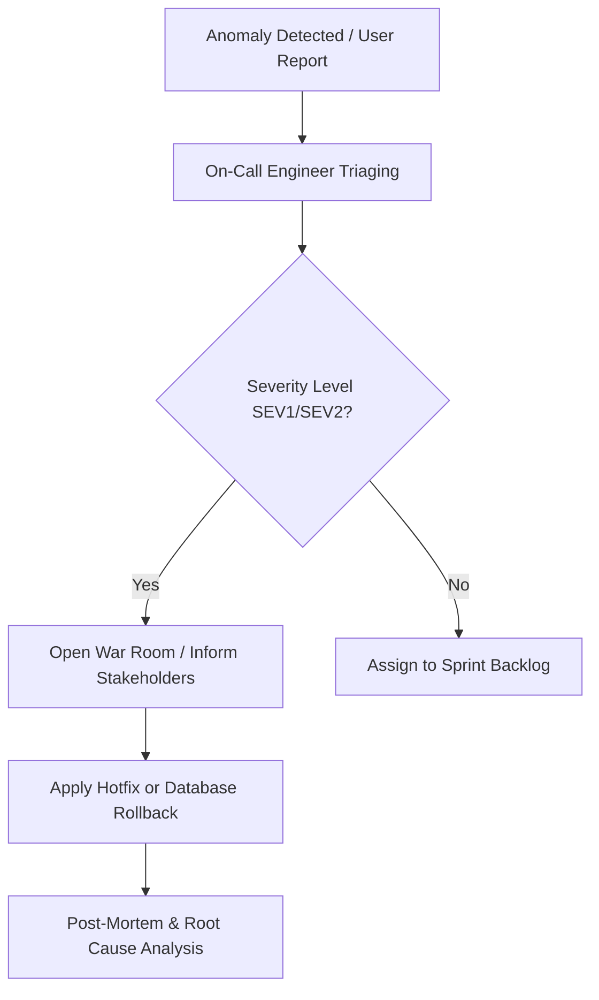

# Incident Management Workflow & Production Support Playbook

Dokumen ini mendefinisikan prosedur standar untuk mendeteksi, menangani, memitigasi, dan mengevaluasi insiden produksi (bugs/outages) pada ekosistem **.NET 8 + ReactJS + SQL Server**.

---

## 1. Incident Classification Matrix (SEV1 - SEV4)

| Severity Level | Deskripsi | SLA Respon | SLA Resolusi | Contoh Skenario |
|----------------|-----------|------------|--------------|-----------------|
| **SEV1 - Critical** | Seluruh sistem mati total (major outage). Proses bisnis inti terhenti. Keamanan data bocor. | 15 Menit | 2 Jam | Database SQL Server mengalami deadlock massal, API Gateway mati total, atau token JWT bocor ke publik. |
| **SEV2 - Major** | Fitur penting terganggu tetapi sistem secara umum masih menyala. Tidak ada workaround yang mudah. | 30 Menit | 6 Jam | Modul Pembayaran / Checkout ReactJS tidak bisa diklik oleh sebagian besar pengguna. |
| **SEV3 - Moderate**| Masalah fungsional kecil. Ada workaround alternatif. Sebagian user terpengaruh. | 2 Jam | 24 Jam | Laporan bulanan PDF gagal di-generate secara periodik, tetapi user bisa men-download format Excel. |
| **SEV4 - Minor** | Masalah kosmetik, salah ketik teks di UI frontend, atau request fitur non-mendesak. | 24 Jam | Next Release| Typo kata "Checkout" di tombol transaksi frontend. |

---

## 2. Incident Response Workflow



### 2.1 Komunikasi Status & Insiden (Template)
Gunakan format berikut saat memposting pemberitahuan di Slack/Teams:
```text
🚨 INCIDENT ALERT [SEV1] 🚨
Incident: SQL Server Database CPU 100% / API Request Timeout
Status: INVESTIGATING
Impact: Users unable to checkout or view orders.
Lead Handler: [Nama On-Call Engineer]
Communication Channel: Teams War Room Link (https://teams.microsoft.com/...)
Next Update: YYYY-MM-DD HH:MM WIB (Max 30 min from now)
```

---

## 3. Resolving Common Production Scenarios

### Skenario 1: Database CPU SQL Server 100% / Query Timeout
* **Penyebab Umum:** Missing Index, Stale Statistics, Parameter Sniffing, atau locking transaction berkepanjangan.
* **Langkah Mitigasi Cepat:**
  1. Identifikasi query terlama yang memakan CPU menggunakan query DMV (lihat [SQL Review Checklist](./09-template-sql-review-checklist.md#L98-L112)).
  2. Jika disebabkan oleh parameter sniffing, jalankan perintah recompile stored procedure terkait:
     ```sql
     EXEC sp_recompile N'dbo.sp_CreateOrderTransaction';
     ```
  3. Jika disebabkan oleh missing index, buat index sementara secara online dengan opsi `ONLINE = ON` (untuk mencegah lock table):
     ```sql
     CREATE NONCLUSTERED INDEX IX_Temp_Production_Fix
     ON dbo.Orders (UserId, CreatedAt)
     WITH (ONLINE = ON);
     ```

### Skenario 2: Out of Memory / High Memory Usage di .NET 8 Web API
* **Penyebab Umum:** Memory leak akibat penyimpanan static cache yang tak terkendali, penyalahgunaan Singleton instance, atau unmanaged resource yang tidak di-dispose.
* **Langkah Mitigasi Cepat:**
  1. Gunakan command tool `dotnet-dump` untuk mengambil memory snapshot di server production:
     ```bash
     dotnet-dump collect -p [PID_Proses_Dotnet]
     ```
  2. Analisis dump file menggunakan `dotnet-dump analyze` untuk mencari objek yang mendominasi memori.
  3. Lakukan rolling restart container Docker .NET API untuk membebaskan RAM selagi tim memperbaiki kode.

---

## 4. Post-Mortem & Root Cause Analysis (RCA) Template

Setiap insiden SEV1 & SEV2 wajib didokumentasikan dalam laporan Post-Mortem maksimal 48 jam setelah insiden berhasil dimitigasi.

```markdown
# INCIDENT POST-MORTEM: [Deskripsi Singkat Insiden]

**Incident Date:** YYYY-MM-DD  
**Incident Duration:** [e.g., 1 hour 15 minutes]  
**Lead Investigator:** [Nama Engineer]  
**Severity:** [SEV1 / SEV2]

## 1. Executive Summary
*Tuliskan ringkasan singkat dari insiden, dampaknya kepada pengguna, dan bagaimana insiden tersebut akhirnya diselesaikan.*

## 2. Timeline Kejadian
* HH:MM WIB - Alert Grafana mendeteksi error rate API > 5%.
* HH:MM WIB - On-call engineer melakukan investigasi awal.
* HH:MM WIB - Diputuskan untuk membuka War Room.
* HH:MM WIB - Database index baru diterapkan, performa kembali normal.
* HH:MM WIB - War Room ditutup.

## 3. Root Cause Analysis (5 Whys)
1. *Mengapa database lambat?* Karena terjadi Table Scan pada tabel Orders.
2. *Mengapa terjadi Table Scan?* Karena non-clustered index yang dibutuhkan tidak sengaja terhapus pada migrasi schema kemarin.
3. *Mengapa migrasi kemarin bisa menghapus index tersebut?* Karena script migrasi rollback tidak diuji di lingkungan Staging sebelum dideploy.
4. *Mengapa tidak diuji di Staging?* Karena Staging deployment dilewati untuk mengejar rilis darurat.
5. ...

## 4. Action Items (Pencegahan Masa Depan)
* [ ] Tambahkan step pengecekan validasi skema database pasca-migrasi otomatis di pipeline CI/CD. (Owner: DevOps Team, Target: YYYY-MM-DD)
* [ ] Buat dashboard peringatan khusus untuk Table Scan rate di SQL Server. (Owner: DBA, Target: YYYY-MM-DD)
```
