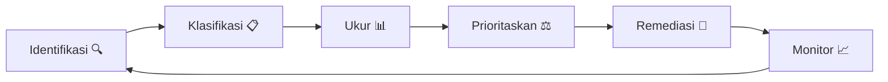
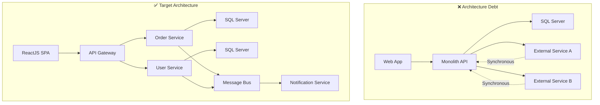
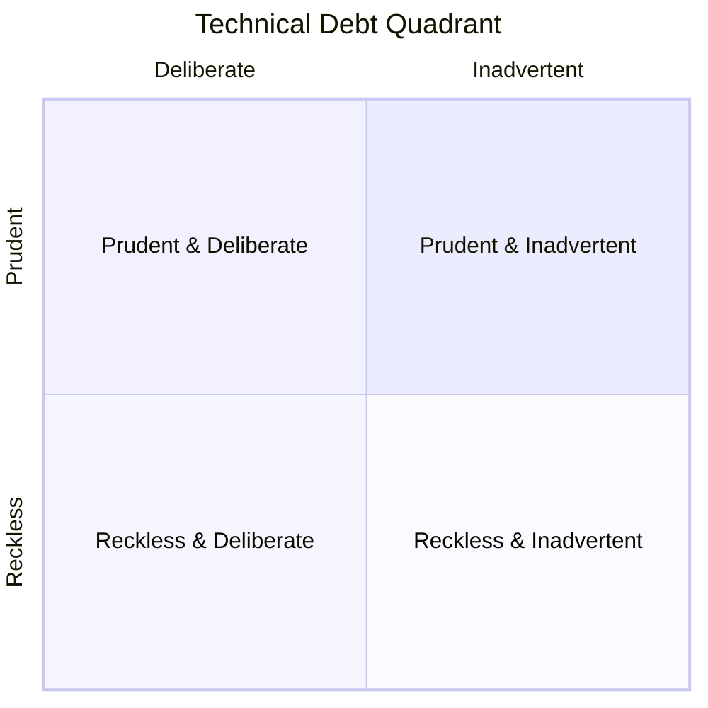
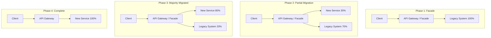
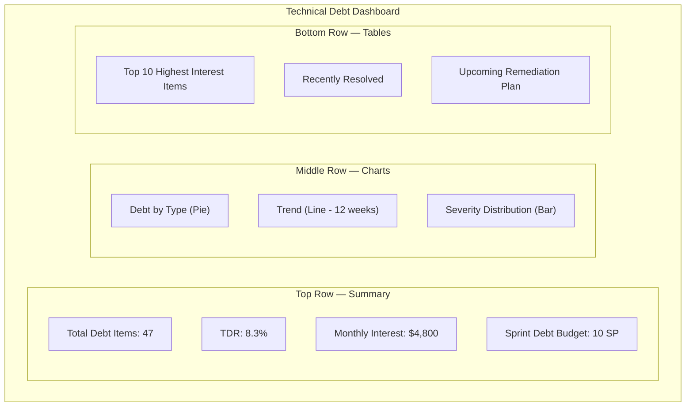
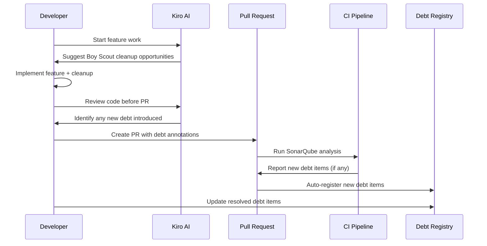

# 20 — Technical Debt Management

> **Versi**: 2.0
> **Terakhir Diperbarui**: 2026-06-17
> **Pemilik Dokumen**: Engineering Lead
> **Stack**: .NET 8 · ReactJS · SQL Server
> **Kiro Compatible**: ✅

---

## Daftar Isi

1. [Pendahuluan](#pendahuluan)
2. [Klasifikasi Technical Debt](#klasifikasi-technical-debt)
3. [Tracking & Measurement](#tracking--measurement)
4. [Strategi Remediasi](#strategi-remediasi)
5. [Reporting & Dashboard](#reporting--dashboard)
6. [Kiro Integration](#kiro-integration)
7. [Referensi](#referensi)

---

## Pendahuluan

Technical debt adalah konsep yang menggambarkan biaya tambahan (cost of rework) yang muncul ketika tim memilih solusi cepat (quick fix) dibanding solusi yang benar. Seperti utang finansial, technical debt memiliki **"bunga"** — semakin lama tidak dibayar, semakin mahal biayanya.

> [!IMPORTANT]
> Technical debt bukan selalu hal buruk. Debt yang **prudent** dan **deliberate** bisa menjadi strategi bisnis yang valid. Yang berbahaya adalah debt yang **tidak teridentifikasi** dan **tidak terkelola**.

### Mengapa Technical Debt Management Penting?

| Aspek | Tanpa Manajemen | Dengan Manajemen |
|---|---|---|
| Velocity | Menurun 15-40% per tahun | Stabil atau meningkat |
| Bug Rate | Meningkat eksponensial | Terkontrol |
| Developer Satisfaction | Rendah (burnout risk) | Tinggi |
| Time to Market | Semakin lambat | Predictable |
| Onboarding Time | 2-4 minggu+ | 1-2 minggu |
| System Reliability | Degradasi bertahap | Stabil |

### Filosofi Manajemen Debt



---

## Klasifikasi Technical Debt

### Tipe-Tipe Technical Debt

#### 1. Code Debt

Code debt muncul dari kode yang tidak mengikuti best practices, sulit dibaca, atau sulit dimaintain.

**Indikator:**
- God classes / God methods (> 500 baris per class, > 50 baris per method)
- Duplikasi kode (copy-paste programming)
- Naming yang tidak deskriptif
- Magic numbers / hardcoded values
- Missing error handling
- Excessive nesting (> 3 level)

**Contoh .NET 8:**

```csharp
// ❌ CODE DEBT: God method, magic numbers, poor naming
public async Task<object> Process(int t, string d, bool f)
{
    if (t == 1)
    {
        var x = await _db.Orders.Where(o => o.Status == 3).ToListAsync();
        foreach (var i in x)
        {
            if (i.Total > 1000000)
            {
                if (f)
                {
                    i.Discount = i.Total * 0.15;
                    i.Status = 5;
                    // ... 200 more lines
                }
            }
        }
    }
    else if (t == 2)
    {
        // ... another 300 lines
    }
    return new { success = true };
}

// ✅ CLEAN: Single responsibility, clear naming, constants
public async Task<ProcessOrderResult> ProcessHighValueOrders(
    ProcessOrderCommand command,
    CancellationToken cancellationToken)
{
    var pendingOrders = await _orderRepository
        .GetPendingOrdersAboveThreshold(
            OrderConstants.HighValueThreshold,
            cancellationToken);

    var results = new List<OrderProcessingResult>();

    foreach (var order in pendingOrders)
    {
        var result = await _discountCalculator
            .ApplyHighValueDiscount(order, command.ApplyDiscount);
        results.Add(result);
    }

    return ProcessOrderResult.FromResults(results);
}
```

**Contoh ReactJS:**

```tsx
// ❌ CODE DEBT: Component melakukan terlalu banyak hal
function Dashboard({ userId }) {
  const [data, setData] = useState(null);
  const [loading, setLoading] = useState(true);
  const [error, setError] = useState(null);
  const [filter, setFilter] = useState('all');
  const [sort, setSort] = useState('date');
  const [page, setPage] = useState(1);
  // ... 20 more useState hooks
  
  useEffect(() => {
    fetch(`/api/users/${userId}/dashboard`)
      .then(res => res.json())
      .then(d => { setData(d); setLoading(false); })
      .catch(e => { setError(e); setLoading(false); });
  }, [userId]);
  
  // ... 500 lines of mixed logic and JSX
}

// ✅ CLEAN: Separated concerns dengan custom hooks
function Dashboard({ userId }: DashboardProps) {
  const { data, isLoading, error } = useDashboardData(userId);
  const { filter, sort, page, handlers } = useDashboardFilters();
  
  if (isLoading) return <DashboardSkeleton />;
  if (error) return <ErrorDisplay error={error} />;
  
  return (
    <DashboardLayout>
      <DashboardFilters {...handlers} />
      <DashboardContent data={data} filter={filter} sort={sort} />
      <Pagination page={page} onPageChange={handlers.setPage} />
    </DashboardLayout>
  );
}
```

#### 2. Architecture Debt

Architecture debt terjadi ketika arsitektur sistem tidak lagi sesuai dengan kebutuhan saat ini.

**Indikator:**
- Tight coupling antar services/modules
- Missing abstraction layers
- Monolith yang seharusnya microservices (atau sebaliknya)
- Database menjadi integration point
- Missing caching layer
- Synchronous calls yang seharusnya async
- Missing message queue untuk eventual consistency

**Contoh Architecture Debt:**



#### 3. Testing Debt

Testing debt muncul dari kurangnya automated tests atau test yang tidak berkualitas.

**Indikator:**
- Code coverage < 70%
- Missing integration tests
- Flaky tests (intermittent failures)
- Slow test suite (> 10 menit)
- Missing edge case tests
- No performance tests
- Outdated test data

**Tingkat Severity Testing Debt:**

| Level | Coverage | Integration Tests | E2E Tests | Severity |
|---|---|---|---|---|
| Critical | < 30% | None | None | 🔴 P0 |
| High | 30-50% | Minimal | None | 🟠 P1 |
| Medium | 50-70% | Some | Minimal | 🟡 P2 |
| Low | 70-80% | Good | Some | 🟢 P3 |
| Target | > 80% | Comprehensive | Key flows | ✅ Healthy |

#### 4. Documentation Debt

Documentation debt terjadi ketika dokumentasi tidak akurat, tidak lengkap, atau tidak ada sama sekali.

**Indikator:**
- Missing API documentation
- Outdated README
- No architecture decision records (ADR)
- Missing runbooks
- Undocumented configuration
- No onboarding guide
- Missing inline code comments untuk logic kompleks

#### 5. Infrastructure Debt

Infrastructure debt muncul dari infrastruktur yang outdated atau tidak optimal.

**Indikator:**
- Manual deployment processes
- Missing infrastructure-as-code
- No auto-scaling
- Missing monitoring/alerting
- Outdated OS/runtime versions
- No disaster recovery plan
- Missing security patches

#### 6. Dependency Debt

Dependency debt terjadi dari penggunaan library atau framework yang outdated.

**Indikator:**
- NuGet packages > 2 major versions behind
- npm packages dengan known vulnerabilities
- Deprecated APIs masih digunakan
- Missing dependency upgrade plan
- Incompatible dependency versions

### Severity Matrix

Gunakan matrix berikut untuk menentukan severity setiap debt item:

```
                    IMPACT
                    Low        Medium      High        Critical
              ┌──────────┬──────────┬──────────┬──────────┐
    Low       │   P4     │   P3     │   P2     │   P1     │
              │ Backlog  │ Backlog  │ Planned  │ Planned  │
U   ├──────────┼──────────┼──────────┼──────────┼──────────┤
R   Medium    │   P3     │   P2     │   P1     │   P0     │
G             │ Backlog  │ Planned  │ Sprint   │ Sprint   │
E   ├──────────┼──────────┼──────────┼──────────┼──────────┤
N   High      │   P2     │   P1     │   P0     │   P0     │
C             │ Planned  │ Sprint   │ Sprint   │ Immediate│
Y   ├──────────┼──────────┼──────────┼──────────┼──────────┤
    Critical  │   P1     │   P0     │   P0     │   P0     │
              │ Sprint   │ Sprint   │ Immediate│ Immediate│
              └──────────┴──────────┴──────────┴──────────┘
```

### Impact Assessment Framework

| Dimensi | Pertanyaan Assessment | Bobot |
|---|---|---|
| **Developer Productivity** | Berapa waktu tambahan yang dihabiskan developer karena debt ini per sprint? | 25% |
| **System Reliability** | Apakah debt ini menyebabkan outage atau degradasi performa? | 25% |
| **Security Risk** | Apakah debt ini membuka celah keamanan? | 20% |
| **Customer Impact** | Apakah customer terdampak langsung oleh debt ini? | 20% |
| **Scalability** | Apakah debt ini menghalangi pertumbuhan sistem? | 10% |

### Debt Quadrant (Martin Fowler)



| Quadrant | Deskripsi | Contoh | Tindakan |
|---|---|---|---|
| **Prudent + Deliberate** | "Kita tahu risikonya, tapi harus ship sekarang" | Skipping refactoring untuk meet deadline | Track dan jadwalkan remediasi |
| **Prudent + Inadvertent** | "Sekarang kita tahu cara yang lebih baik" | Refactor setelah belajar pattern baru | Plan improvement sprint |
| **Reckless + Deliberate** | "Kita tidak punya waktu untuk design" | Skip code review, no tests | Stop dan remediate segera |
| **Reckless + Inadvertent** | "Apa itu layered architecture?" | Junior tanpa guidance | Training + mentoring |

---

## Tracking & Measurement

### Tech Debt Registry Template

Setiap item technical debt harus di-track dalam registry berikut:

```markdown
## Tech Debt Registry

### TD-2026-001: Legacy Payment Module Coupled to Database

| Field | Value |
|---|---|
| **ID** | TD-2026-001 |
| **Title** | Legacy Payment Module Coupled to Database |
| **Type** | Architecture |
| **Quadrant** | Prudent + Deliberate |
| **Severity** | P1 - High |
| **Impact Score** | 8/10 |
| **Interest Rate** | High (slows feature dev by ~2 days/sprint) |
| **Identified By** | @john.doe |
| **Identified Date** | 2026-03-15 |
| **Affected Components** | PaymentService, OrderService, ReportingService |
| **Current Cost** | ~16 dev-hours/sprint (workarounds, bugs) |
| **Remediation Cost** | ~120 dev-hours (estimated) |
| **Remediation Plan** | Implement Repository Pattern + CQRS |
| **Target Resolution** | Sprint 24 (Q3 2026) |
| **Status** | 🟡 In Progress |
| **Related Issues** | #1234, #1456, #1789 |
| **Dependencies** | TD-2026-003 must be resolved first |
```

### JIRA / Azure DevOps Template

```yaml
# Azure DevOps Work Item Template
Title: "[TECH-DEBT] {Judul Singkat}"
Type: "Tech Debt"
Tags:
  - tech-debt
  - type:{code|architecture|testing|documentation|infrastructure|dependency}
  - severity:{p0|p1|p2|p3|p4}
  - quadrant:{prudent-deliberate|prudent-inadvertent|reckless-deliberate|reckless-inadvertent}

Description: |
  ## Deskripsi Debt
  {Jelaskan debt ini secara detail}

  ## Impact
  {Jelaskan dampaknya terhadap development, reliability, security}

  ## Current Workaround
  {Jelaskan workaround yang sedang dilakukan}

  ## Proposed Solution
  {Jelaskan solusi yang diusulkan}

  ## Estimated Effort
  {Story points / dev-hours}

  ## Interest Rate
  {Biaya per sprint jika debt ini tidak diresolvsi}

Acceptance Criteria:
  - [ ] Refactored code mengikuti clean architecture
  - [ ] Unit tests coverage >= 80%
  - [ ] Integration tests passing
  - [ ] Performance tidak degradasi
  - [ ] Documentation updated
  - [ ] Code review approved oleh 2 senior engineers
```

### Scoring System (Interest Rate Metaphor)

Gunakan metafora "interest rate" untuk mengkomunikasikan urgency debt kepada stakeholders:

| Interest Rate | Dev-Hours/Sprint | Deskripsi | Prioritas |
|---|---|---|---|
| 🔴 **Very High** | > 16 hours | Debt ini menyebabkan team kehilangan > 2 hari per sprint | Remediate dalam sprint ini |
| 🟠 **High** | 8-16 hours | Debt ini menyebabkan team kehilangan 1-2 hari per sprint | Remediate dalam 2-3 sprint |
| 🟡 **Medium** | 4-8 hours | Debt ini menyebabkan hambatan yang noticeable | Schedule remediasi |
| 🟢 **Low** | 1-4 hours | Minor inconvenience | Backlog |
| ⚪ **Negligible** | < 1 hour | Minimal impact saat ini | Monitor |

**Rumus Interest Rate:**

```
Monthly Interest = (Developer Hours Lost per Sprint × 2 sprints/month) × Hourly Rate
Annual Interest = Monthly Interest × 12
Payback Period = Remediation Cost ÷ Monthly Interest

Contoh:
- Developer Hours Lost: 12 hours/sprint
- Sprints per Month: 2
- Hourly Rate: $50
- Monthly Interest: 12 × 2 × $50 = $1,200/month
- Annual Interest: $1,200 × 12 = $14,400/year
- Remediation Cost: $6,000 (120 hours × $50)
- Payback Period: $6,000 ÷ $1,200 = 5 months

→ ROI: Invest $6,000 sekarang, save $14,400/year
→ Payback dalam 5 bulan
```

### Code Quality Metrics

#### Cyclomatic Complexity

```csharp
// Tool: .NET Analyzers / SonarQube
// Target: Cyclomatic Complexity per method <= 10

// ❌ Complexity: 15 — terlalu tinggi
public decimal CalculateDiscount(Order order)
{
    decimal discount = 0;
    
    if (order.CustomerType == "VIP")          // +1
    {
        if (order.Total > 1000000)            // +1
        {
            if (order.Items.Count > 10)       // +1
                discount = 0.20m;             
            else if (order.Items.Count > 5)   // +1
                discount = 0.15m;
            else                              
                discount = 0.10m;
        }
        else if (order.Total > 500000)        // +1
        {
            if (order.IsRecurring)            // +1
                discount = 0.12m;
            else
                discount = 0.08m;
        }
        // ... more nested conditions
    }
    else if (order.CustomerType == "Regular") // +1
    {
        // ... more conditions
    }
    
    return discount;
}

// ✅ Complexity: 3 — menggunakan Strategy Pattern
public decimal CalculateDiscount(Order order)
{
    var strategy = _discountStrategyFactory
        .GetStrategy(order.CustomerType);
    
    return strategy.Calculate(order);
}
```

#### Code Coverage Targets

| Layer | Target Coverage | Critical Paths |
|---|---|---|
| Domain / Business Logic | ≥ 90% | 100% |
| Application Services | ≥ 85% | 95% |
| API Controllers | ≥ 80% | 90% |
| Infrastructure | ≥ 70% | 85% |
| UI Components | ≥ 75% | 90% |
| Utilities / Helpers | ≥ 90% | 95% |

#### Code Duplication

```xml
<!-- .editorconfig untuk enforce duplication rules -->
# Duplication Settings
dotnet_diagnostic.CA1502.severity = warning  # Cyclomatic complexity
dotnet_diagnostic.CA1505.severity = warning  # Maintainability index
dotnet_diagnostic.CA1506.severity = warning  # Class coupling

# SonarQube duplication threshold
sonar.cpd.cs.minimumTokens=50
sonar.cpd.cs.minimumLines=10
```

### Technical Debt Ratio

```
Technical Debt Ratio (TDR) = (Remediation Cost / Development Cost) × 100

Interpretasi:
- TDR < 5%   → 🟢 Healthy — debt terkontrol
- TDR 5-10%  → 🟡 Manageable — perlu perhatian
- TDR 10-20% → 🟠 Concerning — alokasikan sprint khusus
- TDR > 20%  → 🔴 Critical — escalate ke management

Contoh:
- Total codebase effort: 10,000 dev-hours
- Estimated remediation effort: 800 dev-hours
- TDR = (800 / 10,000) × 100 = 8% → 🟡 Manageable
```

### SonarQube Integration

#### Setup SonarQube untuk .NET 8

```yaml
# sonar-project.properties
sonar.projectKey=myproject
sonar.projectName=My Project
sonar.projectVersion=1.0

# .NET specific
sonar.cs.opencover.reportsPaths=**/coverage.opencover.xml
sonar.cs.vstest.reportsPaths=**/*.trx

# Quality Gates
sonar.qualitygate.wait=true

# Exclusions
sonar.exclusions=**/Migrations/**,**/obj/**,**/bin/**
sonar.coverage.exclusions=**/Program.cs,**/Startup.cs,**/*Dto.cs

# Duplication
sonar.cpd.cs.minimumTokens=50
```

```yaml
# azure-pipelines.yml — SonarQube step
- task: SonarQubePrepare@5
  inputs:
    SonarQube: 'SonarQubeConnection'
    scannerMode: 'MSBuild'
    projectKey: 'myproject'
    extraProperties: |
      sonar.cs.opencover.reportsPaths=$(Build.SourcesDirectory)/**/coverage.opencover.xml

- script: dotnet build $(solution) --configuration Release
  displayName: 'Build'

- script: dotnet test $(solution) --configuration Release --collect:"XPlat Code Coverage" -- DataCollectionRunSettings.DataCollectors.DataCollector.Configuration.Format=opencover
  displayName: 'Run Tests'

- task: SonarQubeAnalyze@5
  displayName: 'SonarQube Analysis'

- task: SonarQubePublish@5
  displayName: 'Publish SonarQube Results'
```

#### SonarQube Quality Gate Configuration

```json
{
  "qualityGate": {
    "name": "Team Standard Gate",
    "conditions": [
      {
        "metric": "new_reliability_rating",
        "op": "GT",
        "error": "1",
        "description": "No new bugs allowed"
      },
      {
        "metric": "new_security_rating",
        "op": "GT",
        "error": "1",
        "description": "No new vulnerabilities"
      },
      {
        "metric": "new_coverage",
        "op": "LT",
        "error": "80",
        "description": "New code coverage >= 80%"
      },
      {
        "metric": "new_duplicated_lines_density",
        "op": "GT",
        "error": "3",
        "description": "Duplication <= 3%"
      },
      {
        "metric": "new_maintainability_rating",
        "op": "GT",
        "error": "1",
        "description": "Maintainability rating A"
      },
      {
        "metric": "new_security_hotspots_reviewed",
        "op": "LT",
        "error": "100",
        "description": "All security hotspots reviewed"
      }
    ]
  }
}
```

### Kiro-Assisted Debt Detection Prompts

Gunakan prompt berikut dalam Kiro untuk mendeteksi technical debt:

```markdown
## Kiro Prompt: Identify Code Debt

Analyze the following C# file and identify technical debt items:
1. Code smells (long methods, god classes, magic numbers)
2. SOLID principle violations
3. Missing error handling
4. Missing null checks
5. Potential performance issues
6. Missing async/await usage
7. Hardcoded configuration values

For each item found, provide:
- Description of the debt
- Severity (P0-P4)
- Suggested remediation
- Estimated effort (hours)
```

```markdown
## Kiro Prompt: Architecture Debt Analysis

Review the project structure and dependencies:
1. Identify circular dependencies
2. Find tight coupling between modules
3. Detect missing abstraction layers
4. Identify components that should be extracted
5. Find synchronous patterns that should be async
6. Check for proper separation of concerns

Output a debt registry in table format with severity and remediation plan.
```

```markdown
## Kiro Prompt: Dependency Debt Scan

Analyze the project's dependencies:
1. List all NuGet packages with their current and latest versions
2. Flag packages > 1 major version behind
3. Identify deprecated packages
4. Check for known security vulnerabilities (CVE)
5. Suggest migration paths for deprecated packages
6. Calculate dependency freshness score (0-100)
```

---

## Strategi Remediasi

### 20% Rule — Alokasi Kapasitas Sprint

> [!TIP]
> Alokasikan **20% kapasitas sprint** secara konsisten untuk technical debt remediation. Ini sustainable dan mencegah akumulasi debt.

**Implementasi:**

```
Sprint Capacity: 50 story points
Feature Work: 40 story points (80%)
Tech Debt Work: 10 story points (20%)

Per Sprint Planning:
1. Product Owner memprioritaskan 40 SP feature work
2. Tech Lead memprioritaskan 10 SP tech debt work
3. Tech debt items dipilih berdasarkan:
   - Interest rate (highest first)
   - Dependencies (unblock other work)
   - Team pain points (developer happiness)
```

**Sprint Board Layout:**

```
| To Do (Features) | To Do (Tech Debt) | In Progress | Review | Done |
|---|---|---|---|---|
| Feature A - 8 SP | TD-001 Refactor  | Feature B   | TD-002 | ...  |
| Feature C - 5 SP | Payment Module    | 13 SP       |        |      |
|                   | - 5 SP            |             |        |      |
|                   | TD-002 Add Tests  |             |        |      |
|                   | OrderService      |             |        |      |
|                   | - 3 SP            |             |        |      |
```

### Boy Scout Rule Implementation

> "Always leave the code cleaner than you found it." — Robert C. Martin

**Aturan Praktis:**

```markdown
### Saat Mengerjakan Feature/Bug Fix:

1. ✅ Rename variabel yang tidak jelas → clear names
2. ✅ Extract method jika method > 20 baris
3. ✅ Tambah missing null checks
4. ✅ Replace magic numbers dengan constants
5. ✅ Tambah missing XML documentation
6. ✅ Fix minor code style issues
7. ✅ Update outdated comments

### Yang TIDAK Dilakukan (Perlu Story Terpisah):

1. ❌ Refactor arsitektur
2. ❌ Migrate framework/library
3. ❌ Restructure database
4. ❌ Major performance optimization
```

**Boy Scout Rule dalam Code Review:**

```markdown
## PR Review Checklist — Boy Scout Rule

- [ ] Apakah ada variabel/method naming yang diperbaiki?
- [ ] Apakah ada dead code yang di-remove?
- [ ] Apakah ada magic number yang di-replace dengan constant?
- [ ] Apakah ada missing error handling yang ditambahkan?
- [ ] Apakah ada comment yang di-update?
- [ ] Code NET IMPROVEMENT: positif (lebih baik dari sebelumnya)
```

### Strangler Fig Pattern

Pattern ini digunakan untuk mengganti legacy system secara bertahap tanpa big-bang rewrite.



**Implementasi .NET 8:**

```csharp
// Step 1: Create Facade/Anti-Corruption Layer
public interface IOrderService
{
    Task<OrderDto> GetOrderAsync(int orderId, CancellationToken ct);
    Task<OrderDto> CreateOrderAsync(CreateOrderDto dto, CancellationToken ct);
}

// Step 2: Legacy Implementation
public class LegacyOrderService : IOrderService
{
    private readonly LegacyDbContext _legacyDb;

    public async Task<OrderDto> GetOrderAsync(int orderId, CancellationToken ct)
    {
        // Call legacy stored procedure
        var result = await _legacyDb.Database
            .SqlQueryRaw<LegacyOrderResult>("EXEC sp_GetOrder @OrderId", 
                new SqlParameter("@OrderId", orderId))
            .FirstOrDefaultAsync(ct);
        
        return MapToDto(result);
    }
}

// Step 3: New Implementation
public class ModernOrderService : IOrderService
{
    private readonly IOrderRepository _repository;
    private readonly IMapper _mapper;

    public async Task<OrderDto> GetOrderAsync(int orderId, CancellationToken ct)
    {
        var order = await _repository.GetByIdAsync(orderId, ct);
        return _mapper.Map<OrderDto>(order);
    }
}

// Step 4: Strangler Facade with Feature Toggle
public class StranglerOrderService : IOrderService
{
    private readonly LegacyOrderService _legacy;
    private readonly ModernOrderService _modern;
    private readonly IFeatureManager _featureManager;

    public async Task<OrderDto> GetOrderAsync(int orderId, CancellationToken ct)
    {
        if (await _featureManager.IsEnabledAsync("UseModernOrderService"))
        {
            return await _modern.GetOrderAsync(orderId, ct);
        }
        
        return await _legacy.GetOrderAsync(orderId, ct);
    }
}

// Step 5: Registration with DI
services.AddScoped<LegacyOrderService>();
services.AddScoped<ModernOrderService>();
services.AddScoped<IOrderService, StranglerOrderService>();
```

### Incremental Refactoring Strategies

#### Strategy 1: Extract Method

```csharp
// Before: Long method (45 lines)
public async Task<InvoiceResult> ProcessInvoice(Invoice invoice)
{
    // Validate - 10 lines
    if (invoice == null) throw new ArgumentNullException();
    if (invoice.Items.Count == 0) throw new InvalidOperationException();
    // ... more validation

    // Calculate totals - 15 lines
    decimal subtotal = 0;
    foreach (var item in invoice.Items)
    {
        subtotal += item.Quantity * item.UnitPrice;
    }
    // ... tax calculation, discounts

    // Generate PDF - 10 lines
    // ...

    // Send notification - 10 lines
    // ...
}

// After: Extracted methods (5 lines each)
public async Task<InvoiceResult> ProcessInvoice(Invoice invoice)
{
    ValidateInvoice(invoice);
    var totals = CalculateTotals(invoice);
    var pdf = await GenerateInvoicePdf(invoice, totals);
    await SendInvoiceNotification(invoice, pdf);
    return InvoiceResult.Success(invoice.Id, totals);
}
```

#### Strategy 2: Extract Class

```csharp
// Before: OrderService handles too many responsibilities
public class OrderService
{
    // Order CRUD - OK
    // Payment processing - Should be separate
    // Email notifications - Should be separate
    // Report generation - Should be separate
    // Inventory management - Should be separate
}

// After: Single Responsibility
public class OrderService { /* Order CRUD only */ }
public class PaymentService { /* Payment processing */ }
public class NotificationService { /* Email notifications */ }
public class ReportService { /* Report generation */ }
public class InventoryService { /* Inventory management */ }
```

#### Strategy 3: Replace Conditional with Polymorphism

```csharp
// Before
public decimal CalculateShipping(Order order)
{
    switch (order.ShippingMethod)
    {
        case "standard": return order.Weight * 5;
        case "express": return order.Weight * 10 + 15;
        case "overnight": return order.Weight * 20 + 50;
        case "free": return 0;
        default: throw new InvalidOperationException();
    }
}

// After
public interface IShippingCalculator
{
    string Method { get; }
    decimal Calculate(Order order);
}

public class StandardShipping : IShippingCalculator
{
    public string Method => "standard";
    public decimal Calculate(Order order) => order.Weight * 5;
}

// Registration
services.AddScoped<IShippingCalculator, StandardShipping>();
services.AddScoped<IShippingCalculator, ExpressShipping>();
services.AddScoped<IShippingCalculator, OvernightShipping>();
services.AddScoped<IShippingCalculator, FreeShipping>();
services.AddScoped<ShippingCalculatorFactory>();
```

### Prioritization Framework

#### Cost of Delay (CoD)

```
CoD = Business Value Lost per Week if Delayed

Components:
1. User/Business Value: Revenue impact if not resolved
2. Time Criticality: Does the value decrease over time?
3. Risk Reduction: Security, compliance, reliability risk
4. Opportunity Enablement: Does it unblock other valuable work?

CoD Score = User Value + Time Criticality + Risk Reduction
```

#### Weighted Shortest Job First (WSJF)

```
WSJF = Cost of Delay ÷ Job Duration

Higher WSJF = Higher Priority

Example:
| Debt Item | CoD (1-10) | Duration (SP) | WSJF | Priority |
|-----------|-----------|--------------|------|----------|
| TD-001    | 9         | 3            | 3.0  | 1st      |
| TD-002    | 7         | 8            | 0.88 | 3rd      |
| TD-003    | 5         | 2            | 2.5  | 2nd      |
| TD-004    | 3         | 5            | 0.6  | 4th      |
```

---

## Reporting & Dashboard

### Dashboard Design



### Executive Report Template

```markdown
# Technical Debt Report — {Bulan} {Tahun}

## Executive Summary

| Metric | Nilai Saat Ini | Target | Trend |
|---|---|---|---|
| Total Debt Items | 47 | < 30 | ⬇️ (-3 dari bulan lalu) |
| Technical Debt Ratio | 8.3% | < 5% | ⬇️ (-0.7%) |
| Monthly Interest Cost | $4,800 | < $2,000 | ⬇️ (-$600) |
| Items Resolved (Bulan Ini) | 8 | 6+ | ✅ Above target |
| New Debt Added (Bulan Ini) | 5 | < 6 | ✅ Under control |

## Key Wins
1. ✅ Resolved TD-2026-001: Legacy Payment Module refactored (savings: $800/month)
2. ✅ Reduced test debt: Coverage increased from 72% to 78%
3. ✅ Updated 12 NuGet packages to latest stable versions

## Key Risks
1. ⚠️ TD-2026-015: Authentication module tech debt increasing (interest: $1,200/month)
2. ⚠️ SQL Server stored procedures still at 42% coverage
3. ⚠️ 3 deprecated npm packages still in use

## Next Month Plan
1. Focus on TD-2026-015 (Authentication) — estimated 3 sprints
2. Continue 20% allocation (10 SP per sprint)
3. Conduct architecture review for Reporting module

## Budget Impact
- Invested this month: 20 SP (80 dev-hours, ~$4,000)
- Estimated savings: $1,400/month ongoing
- Cumulative ROI: 350% (over 12 months)
```

### Sprint-Level Debt Report

```markdown
# Sprint {N} — Tech Debt Report

## Debt Budget: 10 Story Points

### Completed
| Item | Type | SP | Interest Saved |
|---|---|---|---|
| TD-045: Extract PaymentValidator | Code | 3 | $200/month |
| TD-039: Add Order Service Tests | Testing | 5 | $150/month |
| TD-052: Update Serilog to v4.x | Dependency | 2 | Risk reduction |

### Carried Over
| Item | Type | SP | Reason |
|---|---|---|---|
| TD-041: Refactor ReportGenerator | Code | 8 | Split into 2 smaller items |

### New Debt Introduced
| Item | Type | Severity | Source |
|---|---|---|---|
| TD-055: Temp workaround for API timeout | Code | P3 | Sprint pressure |
| TD-056: Missing i18n in new checkout flow | Code | P4 | Scope decision |

### Net Debt Change: -1 item (3 resolved, 2 added)

### Boy Scout Rule Compliance: 85% PRs had cleanup commits
```

### Trend Analysis

```markdown
## 12-Week Trend Analysis

Week | Total Items | TDR | Interest/Month | Resolved | Added | Net
-----|-------------|-----|----------------|----------|-------|----
W1   | 52          | 9.5%| $5,400         | 2        | 3     | +1
W2   | 50          | 9.2%| $5,200         | 4        | 2     | -2
W3   | 49          | 9.0%| $5,100         | 3        | 2     | -1
W4   | 48          | 8.8%| $5,000         | 3        | 2     | -1
W5   | 47          | 8.6%| $4,900         | 2        | 1     | -1
W6   | 46          | 8.4%| $4,800         | 3        | 2     | -1
W7   | 47          | 8.5%| $4,850         | 1        | 2     | +1
W8   | 45          | 8.2%| $4,700         | 4        | 2     | -2
W9   | 44          | 8.0%| $4,600         | 3        | 2     | -1
W10  | 43          | 7.8%| $4,500         | 2        | 1     | -1
W11  | 42          | 7.6%| $4,400         | 3        | 2     | -1
W12  | 41          | 7.4%| $4,300         | 3        | 2     | -1

Trend: ⬇️ Consistently decreasing — healthy trajectory
Target (Week 24): TDR < 5%, Total Items < 30
```

---

## Kiro Integration

### Menggunakan Kiro untuk Identifikasi Tech Debt

#### Context File untuk Tech Debt Detection

Buat file `.kiro/context/tech-debt.md` di project root:

```markdown
# Technical Debt Context

## Project Stack
- Backend: .NET 8, C# 12, Entity Framework Core 8
- Frontend: ReactJS 18, TypeScript 5, Vite
- Database: SQL Server 2022
- Architecture: Clean Architecture with CQRS (MediatR)

## Code Quality Standards
- Max cyclomatic complexity per method: 10
- Max method length: 30 lines
- Max class length: 300 lines
- Min code coverage: 80%
- Max duplication: 3%
- All public methods must have XML documentation
- No magic numbers — use constants or enums
- All configuration via IOptions<T> pattern

## Known Tech Debt Areas
- /src/Legacy/ — Old payment module, scheduled for refactoring Q3
- /src/Reports/ — Uses raw ADO.NET, migrate to EF Core
- /src/Auth/ — Custom auth implementation, migrate to ASP.NET Identity

## Tech Debt Patterns to Detect
- Static method abuse (should be injected service)
- God classes (> 300 lines)
- God methods (> 30 lines)
- Missing async/await on I/O operations
- Catching generic Exception instead of specific types
- Using string concatenation for SQL queries
- Missing CancellationToken propagation
- Using DateTime.Now instead of IDateTimeProvider
- Direct file system access without abstraction
- Missing IDisposable implementation
```

### Automated Refactoring Suggestions

#### Kiro Prompt: Generate Refactoring Plan

```markdown
## Kiro Task: Generate Refactoring Plan

Analyze the file {filename} and generate a step-by-step refactoring plan:

1. **Identify all code smells** with severity
2. **Suggest specific refactoring techniques** for each smell:
   - Extract Method
   - Extract Class
   - Replace Conditional with Polymorphism
   - Introduce Parameter Object
   - Replace Magic Number with Named Constant
3. **Generate the refactored code** preserving all existing behavior
4. **Generate unit tests** to verify the refactoring doesn't break anything
5. **Estimate the effort** in hours for each refactoring step

Output format:
- Current state analysis
- Refactoring steps (ordered by priority)
- Refactored code
- Test code
- Effort estimate
```

#### Kiro Prompt: Dependency Analysis

```markdown
## Kiro Task: Analyze Project Dependencies

Review all NuGet packages in the .csproj files and npm packages in package.json:

1. List packages by category (framework, testing, utilities, UI)
2. Flag outdated packages (> 1 minor version behind)
3. Flag deprecated packages with migration suggestions
4. Identify unused packages (imported but never used)
5. Check for known CVEs
6. Suggest package consolidation (multiple packages doing the same thing)
7. Calculate a Dependency Health Score (0-100)
```

### Debt-Aware Development Workflow



#### Pre-Commit Kiro Check

```markdown
## Kiro Pre-Commit Prompt

Review the staged changes and check:
1. Does this PR introduce new tech debt? If yes, tag with [TECH-DEBT]
2. Does this PR resolve existing tech debt? If yes, reference TD-{id}
3. Are there Boy Scout Rule opportunities in the changed files?
4. Is the cyclomatic complexity within limits?
5. Are there missing tests for the changed code?
6. Are there hardcoded values that should be configuration?

Output: PR description section summarizing debt impact
```

---

## Referensi

### Buku & Artikel
- *Managing Technical Debt* — Philippe Kruchten, Robert Nord, Ipek Ozkaya
- *Refactoring: Improving the Design of Existing Code* — Martin Fowler
- *Clean Code* — Robert C. Martin
- *Working Effectively with Legacy Code* — Michael Feathers
- *Technical Debt Quadrant* — Martin Fowler (blog post)

### Tools
- **SonarQube / SonarCloud** — Code quality & security analysis
- **NDepend** — .NET code quality tool
- **Snyk** — Dependency vulnerability scanning
- **CodeClimate** — Automated code review
- **Kiro AI** — AI-assisted code analysis & refactoring

### Metrik Benchmarks
- **Elite teams** (DORA): TDR < 3%, resolve debt weekly
- **High-performing teams**: TDR 3-5%, resolve debt bi-weekly
- **Medium teams**: TDR 5-10%, monthly debt sprints
- **Low-performing teams**: TDR > 10%, debt increasing

---

> [!CAUTION]
> **Anti-Pattern Alert**: Jangan pernah menjadwalkan "Tech Debt Sprint" besar setelah berbulan-bulan mengabaikan debt. Ini menandakan kegagalan dalam manajemen debt. Gunakan pendekatan **konsisten 20% per sprint** untuk hasil yang sustainable.

---

*Dokumen ini adalah bagian dari Kiro Engineering SOP. Untuk pertanyaan atau kontribusi, hubungi Engineering Lead.*
