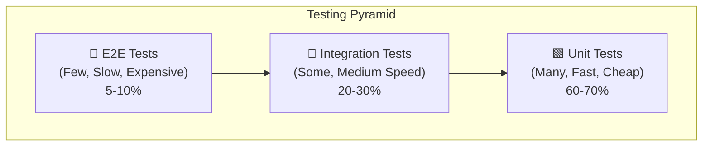

# 22 — Unit Testing Strategy

> **Versi**: 2.0
> **Terakhir Diperbarui**: 2026-06-17
> **Pemilik Dokumen**: QA Lead / Tech Lead
> **Stack**: .NET 8 · ReactJS · SQL Server
> **Kiro Compatible**: ✅

---

## Daftar Isi

1. [Pendahuluan](#pendahuluan)
2. [.NET 8 Testing](#net-8-testing)
3. [ReactJS Testing](#reactjs-testing)
4. [SQL Server Testing](#sql-server-testing)
5. [Testing Metrics](#testing-metrics)
6. [Kiro-Assisted Testing](#kiro-assisted-testing)
7. [Referensi](#referensi)

---

## Pendahuluan

Unit testing adalah fondasi dari software quality. Strategi testing yang solid memastikan kode berjalan sesuai harapan, mencegah regresi, dan memberikan confidence untuk refactoring.

> [!IMPORTANT]
> Testing bukan tentang mencapai angka coverage tertentu. Testing adalah tentang **memvalidasi behavior** dan **mencegah regresi**. Coverage yang tinggi tanpa test yang bermakna sama saja dengan tidak punya test.

### Testing Pyramid



| Tipe Test | Jumlah | Kecepatan | Scope | Tools |
|---|---|---|---|---|
| **Unit Tests** | Banyak (hundreds) | Sangat cepat (ms) | Single class/method | xUnit, Jest |
| **Integration Tests** | Sedang (tens) | Cepat (seconds) | Multiple components | TestContainers, MSW |
| **E2E Tests** | Sedikit (tens) | Lambat (seconds-minutes) | Full system flow | Playwright |

---

## .NET 8 Testing

### xUnit Setup dan Konfigurasi

#### Project Structure

```
tests/
├── MyProject.UnitTests/
│   ├── MyProject.UnitTests.csproj
│   ├── GlobalUsings.cs
│   ├── Application/
│   │   ├── Orders/
│   │   │   ├── Commands/
│   │   │   │   ├── CreateOrderCommandHandlerTests.cs
│   │   │   │   └── CancelOrderCommandHandlerTests.cs
│   │   │   ├── Queries/
│   │   │   │   └── GetOrderByIdQueryHandlerTests.cs
│   │   │   └── Validators/
│   │   │       └── CreateOrderCommandValidatorTests.cs
│   │   └── Customers/
│   │       └── ...
│   ├── Domain/
│   │   ├── Entities/
│   │   │   ├── OrderTests.cs
│   │   │   └── CustomerTests.cs
│   │   └── ValueObjects/
│   │       ├── MoneyTests.cs
│   │       └── EmailTests.cs
│   ├── Infrastructure/
│   │   └── Services/
│   │       └── EmailServiceTests.cs
│   ├── TestData/
│   │   ├── Builders/
│   │   │   ├── OrderBuilder.cs
│   │   │   └── CustomerBuilder.cs
│   │   └── Fakers/
│   │       ├── OrderFaker.cs
│   │       └── CustomerFaker.cs
│   └── Helpers/
│       ├── TestBase.cs
│       └── MockExtensions.cs
├── MyProject.IntegrationTests/
│   ├── MyProject.IntegrationTests.csproj
│   ├── Fixtures/
│   │   ├── DatabaseFixture.cs
│   │   └── ApiFixture.cs
│   ├── Api/
│   │   ├── OrdersControllerTests.cs
│   │   └── CustomersControllerTests.cs
│   └── Repositories/
│       └── OrderRepositoryTests.cs
└── MyProject.E2E/
    ├── MyProject.E2E.csproj
    └── Flows/
        ├── OrderCreationFlowTests.cs
        └── CheckoutFlowTests.cs
```

#### Project File Setup

```xml
<!-- MyProject.UnitTests.csproj -->
<Project Sdk="Microsoft.NET.Sdk">
  <PropertyGroup>
    <TargetFramework>net8.0</TargetFramework>
    <ImplicitUsings>enable</ImplicitUsings>
    <Nullable>enable</Nullable>
    <IsPackable>false</IsPackable>
    <IsTestProject>true</IsTestProject>
  </PropertyGroup>

  <ItemGroup>
    <!-- Test Framework -->
    <PackageReference Include="Microsoft.NET.Test.Sdk" Version="17.10.0" />
    <PackageReference Include="xunit" Version="2.9.0" />
    <PackageReference Include="xunit.runner.visualstudio" Version="2.8.2" />
    
    <!-- Mocking -->
    <PackageReference Include="NSubstitute" Version="5.3.0" />
    <PackageReference Include="NSubstitute.Analyzers.CSharp" Version="1.0.17" />
    
    <!-- Test Data -->
    <PackageReference Include="AutoFixture" Version="4.18.1" />
    <PackageReference Include="AutoFixture.Xunit2" Version="4.18.1" />
    <PackageReference Include="AutoFixture.AutoNSubstitute" Version="4.18.1" />
    <PackageReference Include="Bogus" Version="35.6.1" />
    
    <!-- Assertions -->
    <PackageReference Include="FluentAssertions" Version="7.0.0" />
    
    <!-- Coverage -->
    <PackageReference Include="coverlet.collector" Version="6.0.2" />
  </ItemGroup>

  <ItemGroup>
    <ProjectReference Include="..\..\src\MyProject.Application\MyProject.Application.csproj" />
    <ProjectReference Include="..\..\src\MyProject.Domain\MyProject.Domain.csproj" />
    <ProjectReference Include="..\..\src\MyProject.Infrastructure\MyProject.Infrastructure.csproj" />
  </ItemGroup>
</Project>
```

#### Global Usings

```csharp
// GlobalUsings.cs
global using Xunit;
global using FluentAssertions;
global using NSubstitute;
global using AutoFixture;
global using AutoFixture.Xunit2;
global using AutoFixture.AutoNSubstitute;
global using Microsoft.Extensions.Logging;
```

### Naming Conventions

```csharp
// Pattern: MethodUnderTest_Scenario_ExpectedBehavior
// Alternatif: Should_ExpectedBehavior_When_Scenario

// ✅ Good naming
public class CreateOrderCommandHandlerTests
{
    [Fact]
    public async Task Handle_WithValidCommand_ShouldCreateOrderAndReturnSuccess()
    
    [Fact]
    public async Task Handle_WithInvalidCustomerId_ShouldReturnNotFoundError()
    
    [Fact]
    public async Task Handle_WithEmptyItems_ShouldReturnValidationError()
    
    [Fact]
    public async Task Handle_WithInsufficientInventory_ShouldReturnConflictError()
    
    [Theory]
    [InlineData(0)]
    [InlineData(-1)]
    public async Task Handle_WithInvalidQuantity_ShouldReturnValidationError(int quantity)
}

// ❌ Bad naming
public class OrderTests
{
    [Fact]
    public void Test1()  // Non-descriptive
    
    [Fact]
    public void CreateOrder()  // Doesn't describe scenario/expected behavior
    
    [Fact]
    public void OrderServiceCreateOrderMethodShouldWorkCorrectlyWhenCalledWithValidData()  // Too long
}
```

### AAA Pattern (Arrange-Act-Assert)

```csharp
public class OrderTests
{
    [Fact]
    public void Create_WithValidData_ShouldInitializeOrderCorrectly()
    {
        // ══════════════════════════════════════
        // ARRANGE — Setup test data and dependencies
        // ══════════════════════════════════════
        var customer = new Customer(1, "John Doe", "john@example.com");
        var items = new List<OrderItem>
        {
            OrderItem.Create(productId: 1, quantity: 2, unitPrice: 50_000m),
            OrderItem.Create(productId: 2, quantity: 1, unitPrice: 100_000m),
        };
        var shippingAddress = "Jl. Sudirman No. 1, Jakarta";

        // ══════════════════════════════════════
        // ACT — Execute the method under test
        // ══════════════════════════════════════
        var order = Order.Create(customer, items, shippingAddress);

        // ══════════════════════════════════════
        // ASSERT — Verify the expected outcome
        // ══════════════════════════════════════
        order.Should().NotBeNull();
        order.CustomerId.Should().Be(1);
        order.Items.Should().HaveCount(2);
        order.TotalAmount.Should().Be(200_000m); // (2×50k) + (1×100k)
        order.Status.Should().Be(OrderStatus.Pending);
        order.ShippingAddress.Should().Be(shippingAddress);
        order.CreatedAt.Should().BeCloseTo(
            DateTime.UtcNow, TimeSpan.FromSeconds(1));
    }
}
```

### Test Fixtures dan Data Builders

#### Builder Pattern

```csharp
// TestData/Builders/OrderBuilder.cs
public class OrderBuilder
{
    private int _customerId = 1;
    private string _shippingAddress = "Default Address";
    private OrderStatus _status = OrderStatus.Pending;
    private readonly List<OrderItem> _items = new();
    private DateTime? _createdAt;
    private decimal? _discount;

    public OrderBuilder WithCustomerId(int customerId)
    {
        _customerId = customerId;
        return this;
    }

    public OrderBuilder WithShippingAddress(string address)
    {
        _shippingAddress = address;
        return this;
    }

    public OrderBuilder WithStatus(OrderStatus status)
    {
        _status = status;
        return this;
    }

    public OrderBuilder WithItem(int productId, int quantity, decimal unitPrice)
    {
        _items.Add(OrderItem.Create(productId, quantity, unitPrice));
        return this;
    }

    public OrderBuilder WithItems(int count)
    {
        for (int i = 1; i <= count; i++)
        {
            _items.Add(OrderItem.Create(
                productId: i, 
                quantity: i, 
                unitPrice: 10_000m * i));
        }
        return this;
    }

    public OrderBuilder WithDiscount(decimal discount)
    {
        _discount = discount;
        return this;
    }

    public OrderBuilder CreatedAt(DateTime createdAt)
    {
        _createdAt = createdAt;
        return this;
    }

    public Order Build()
    {
        var customer = new Customer(_customerId, "Test Customer", "test@test.com");
        var items = _items.Count > 0
            ? _items
            : new List<OrderItem> { OrderItem.Create(1, 1, 10_000m) };

        var order = Order.Create(customer, items, _shippingAddress);

        if (_status != OrderStatus.Pending)
            order.SetStatus(_status);

        if (_discount.HasValue)
            order.ApplyDiscount(_discount.Value);

        if (_createdAt.HasValue)
            order.SetCreatedAt(_createdAt.Value);

        return order;
    }

    // Static factory for common scenarios
    public static Order DefaultOrder() => new OrderBuilder().Build();

    public static Order HighValueOrder() => new OrderBuilder()
        .WithItem(1, 5, 500_000m)
        .WithItem(2, 3, 300_000m)
        .Build();

    public static Order CompletedOrder() => new OrderBuilder()
        .WithStatus(OrderStatus.Completed)
        .Build();
}
```

**Penggunaan Builder:**

```csharp
[Fact]
public void ApplyDiscount_OnHighValueOrder_ShouldApplyVipDiscount()
{
    // Arrange
    var order = new OrderBuilder()
        .WithCustomerId(42)
        .WithItem(productId: 1, quantity: 5, unitPrice: 500_000m)
        .WithItem(productId: 2, quantity: 3, unitPrice: 300_000m)
        .Build();

    // Act
    order.ApplyVipDiscount();

    // Assert
    order.DiscountAmount.Should().BeGreaterThan(0);
    order.TotalAfterDiscount.Should().BeLessThan(order.TotalAmount);
}
```

#### Bogus Faker

```csharp
// TestData/Fakers/OrderFaker.cs
public class OrderFaker : Faker<Order>
{
    public OrderFaker()
    {
        RuleFor(o => o.Id, f => f.IndexFaker + 1);
        RuleFor(o => o.OrderNumber, f => f.Random.AlphaNumeric(10).ToUpper());
        RuleFor(o => o.CustomerId, f => f.Random.Int(1, 1000));
        RuleFor(o => o.ShippingAddress, f => f.Address.FullAddress());
        RuleFor(o => o.Status, f => f.PickRandom<OrderStatus>());
        RuleFor(o => o.CreatedAt, f => f.Date.Recent(30));
        RuleFor(o => o.TotalAmount, f => f.Finance.Amount(10_000, 10_000_000));
    }
}

public class CustomerFaker : Faker<Customer>
{
    public CustomerFaker()
    {
        RuleFor(c => c.Id, f => f.IndexFaker + 1);
        RuleFor(c => c.Name, f => f.Name.FullName());
        RuleFor(c => c.Email, f => f.Internet.Email());
        RuleFor(c => c.PhoneNumber, f => f.Phone.PhoneNumber("+62###########"));
        RuleFor(c => c.Address, f => f.Address.FullAddress());
        RuleFor(c => c.CustomerType, f => f.PickRandom<CustomerType>());
    }
}

// Penggunaan:
[Fact]
public void GetCustomerOrders_WithMultipleOrders_ShouldReturnAllOrders()
{
    // Arrange
    var customer = new CustomerFaker().Generate();
    var orders = new OrderFaker()
        .RuleFor(o => o.CustomerId, customer.Id)
        .Generate(5);
    
    // Assert
    orders.Should().HaveCount(5);
    orders.Should().AllSatisfy(o => o.CustomerId.Should().Be(customer.Id));
}
```

### Mocking dengan NSubstitute

```csharp
// Mocking Repositories
public class CreateOrderCommandHandlerTests
{
    private readonly IOrderRepository _orderRepository;
    private readonly ICustomerRepository _customerRepository;
    private readonly IUnitOfWork _unitOfWork;
    private readonly ILogger<CreateOrderCommandHandler> _logger;
    private readonly CreateOrderCommandHandler _sut; // System Under Test

    public CreateOrderCommandHandlerTests()
    {
        _orderRepository = Substitute.For<IOrderRepository>();
        _customerRepository = Substitute.For<ICustomerRepository>();
        _unitOfWork = Substitute.For<IUnitOfWork>();
        _logger = Substitute.For<ILogger<CreateOrderCommandHandler>>();

        _sut = new CreateOrderCommandHandler(
            _orderRepository,
            _customerRepository,
            _unitOfWork,
            _logger);
    }

    [Fact]
    public async Task Handle_WithValidCommand_ShouldCreateOrder()
    {
        // Arrange
        var customer = new CustomerBuilder().WithId(1).Build();
        var command = new CreateOrderCommand(
            CustomerId: 1,
            Items: new List<OrderItemDto>
            {
                new(ProductId: 1, Quantity: 2, UnitPrice: 50_000m)
            },
            ShippingAddress: "Jl. Test No. 1");

        _customerRepository
            .GetByIdAsync(1, Arg.Any<CancellationToken>())
            .Returns(customer);

        _unitOfWork
            .SaveChangesAsync(Arg.Any<CancellationToken>())
            .Returns(1);

        // Act
        var result = await _sut.Handle(command, CancellationToken.None);

        // Assert
        result.IsSuccess.Should().BeTrue();
        result.Value.Should().NotBeNull();

        // Verify interactions
        _orderRepository.Received(1).Add(Arg.Is<Order>(o =>
            o.CustomerId == 1 &&
            o.Items.Count == 1 &&
            o.TotalAmount == 100_000m));

        await _unitOfWork.Received(1)
            .SaveChangesAsync(Arg.Any<CancellationToken>());
    }

    [Fact]
    public async Task Handle_WithNonExistentCustomer_ShouldReturnNotFoundError()
    {
        // Arrange
        var command = new CreateOrderCommand(
            CustomerId: 999,
            Items: new List<OrderItemDto>
            {
                new(ProductId: 1, Quantity: 1, UnitPrice: 10_000m)
            },
            ShippingAddress: "Test");

        _customerRepository
            .GetByIdAsync(999, Arg.Any<CancellationToken>())
            .Returns((Customer?)null);

        // Act
        var result = await _sut.Handle(command, CancellationToken.None);

        // Assert
        result.IsSuccess.Should().BeFalse();
        result.Error.Code.Should().Be("Customer.NotFound");

        // Verify NO order was created
        _orderRepository.DidNotReceive().Add(Arg.Any<Order>());
        await _unitOfWork.DidNotReceive()
            .SaveChangesAsync(Arg.Any<CancellationToken>());
    }
}
```

### AutoFixture untuk Test Data

```csharp
// Setup AutoFixture dengan NSubstitute
public class AutoNSubstituteDataAttribute : AutoDataAttribute
{
    public AutoNSubstituteDataAttribute()
        : base(() =>
        {
            var fixture = new Fixture()
                .Customize(new AutoNSubstituteCustomization());
            
            // Customize specific types
            fixture.Customize<CreateOrderCommand>(c => c
                .With(x => x.CustomerId, 1)
                .With(x => x.Items, new List<OrderItemDto>
                {
                    new(ProductId: 1, Quantity: 2, UnitPrice: 50_000m)
                }));
            
            return fixture;
        })
    { }
}

// Penggunaan
[Theory, AutoNSubstituteData]
public async Task Handle_WithAutoFixtureData_ShouldCreateOrder(
    [Frozen] IOrderRepository orderRepository,
    [Frozen] ICustomerRepository customerRepository,
    [Frozen] IUnitOfWork unitOfWork,
    CreateOrderCommandHandler sut,
    Customer customer,
    CreateOrderCommand command)
{
    // Arrange — AutoFixture sudah generate semua mock dan data
    customerRepository
        .GetByIdAsync(command.CustomerId, Arg.Any<CancellationToken>())
        .Returns(customer);

    unitOfWork.SaveChangesAsync(Arg.Any<CancellationToken>()).Returns(1);

    // Act
    var result = await sut.Handle(command, CancellationToken.None);

    // Assert
    result.IsSuccess.Should().BeTrue();
}
```

### FluentAssertions Usage

```csharp
// Collection Assertions
orders.Should().HaveCount(5);
orders.Should().Contain(o => o.Status == OrderStatus.Completed);
orders.Should().BeInAscendingOrder(o => o.CreatedAt);
orders.Should().AllSatisfy(o => o.TotalAmount.Should().BePositive());
orders.Should().OnlyContain(o => o.CustomerId == 42);
orders.Select(o => o.Id).Should().OnlyHaveUniqueItems();

// Object Assertions
order.Should().BeEquivalentTo(expectedOrder, options => options
    .Excluding(o => o.Id)
    .Excluding(o => o.CreatedAt));

// String Assertions
order.OrderNumber.Should().StartWith("ORD-");
order.OrderNumber.Should().MatchRegex(@"^ORD-\d{10}$");

// Numeric Assertions
order.TotalAmount.Should().BeInRange(10_000m, 10_000_000m);
order.Items.Count.Should().BeGreaterThanOrEqualTo(1);

// DateTime Assertions
order.CreatedAt.Should().BeAfter(DateTime.UtcNow.AddMinutes(-1));
order.CreatedAt.Should().BeCloseTo(DateTime.UtcNow, TimeSpan.FromSeconds(5));

// Exception Assertions
var act = () => Order.Create(null!, items, "address");
act.Should().Throw<ArgumentNullException>()
   .WithParameterName("customer");

// Async Exception Assertions
var act = async () => await sut.Handle(invalidCommand, CancellationToken.None);
await act.Should().ThrowAsync<ValidationException>()
    .WithMessage("*required*");

// Execution Time Assertions
var act = () => sut.ProcessBatchOrders(orders);
act.ExecutionTime().Should().BeLessThan(TimeSpan.FromSeconds(5));
```

### Testing MediatR Handlers

```csharp
public class GetOrderByIdQueryHandlerTests
{
    private readonly IOrderRepository _orderRepository;
    private readonly IMapper _mapper;
    private readonly GetOrderByIdQueryHandler _sut;

    public GetOrderByIdQueryHandlerTests()
    {
        _orderRepository = Substitute.For<IOrderRepository>();
        
        var mapperConfig = new MapperConfiguration(cfg =>
        {
            cfg.AddProfile<OrderMappingProfile>();
        });
        _mapper = mapperConfig.CreateMapper();

        _sut = new GetOrderByIdQueryHandler(_orderRepository, _mapper);
    }

    [Fact]
    public async Task Handle_WithExistingOrder_ShouldReturnOrderDto()
    {
        // Arrange
        var order = new OrderBuilder()
            .WithCustomerId(1)
            .WithItem(1, 2, 50_000m)
            .WithStatus(OrderStatus.Confirmed)
            .Build();

        _orderRepository
            .GetByIdWithItemsAsync(order.Id, Arg.Any<CancellationToken>())
            .Returns(order);

        var query = new GetOrderByIdQuery(order.Id);

        // Act
        var result = await _sut.Handle(query, CancellationToken.None);

        // Assert
        result.IsSuccess.Should().BeTrue();
        result.Value.Should().NotBeNull();
        result.Value.CustomerId.Should().Be(1);
        result.Value.Status.Should().Be("Confirmed");
        result.Value.Items.Should().HaveCount(1);
        result.Value.TotalAmount.Should().Be(100_000m);
    }
}
```

### Testing Controllers

```csharp
public class OrdersControllerTests
{
    private readonly IMediator _mediator;
    private readonly IMapper _mapper;
    private readonly OrdersController _sut;

    public OrdersControllerTests()
    {
        _mediator = Substitute.For<IMediator>();
        _mapper = Substitute.For<IMapper>();
        _sut = new OrdersController(_mediator, _mapper);
    }

    [Fact]
    public async Task CreateOrder_WithValidRequest_ShouldReturn201Created()
    {
        // Arrange
        var request = new CreateOrderRequest
        {
            CustomerId = 1,
            Items = new[] { new OrderItemRequest { ProductId = 1, Quantity = 2 } },
            ShippingAddress = "Jl. Test No. 1"
        };

        var command = new CreateOrderCommand(1, 
            new List<OrderItemDto> { new(1, 2, 0) }, "Jl. Test No. 1");
        
        _mapper.Map<CreateOrderCommand>(request).Returns(command);

        var response = new OrderCreatedResponse(1, "ORD-0000000001");
        _mediator.Send(command, Arg.Any<CancellationToken>())
            .Returns(Result<OrderCreatedResponse>.Success(response));

        // Act
        var result = await _sut.CreateOrder(request, CancellationToken.None);

        // Assert
        var createdResult = result.Should().BeOfType<CreatedAtActionResult>().Subject;
        createdResult.StatusCode.Should().Be(201);
        createdResult.Value.Should().BeEquivalentTo(response);
    }

    [Fact]
    public async Task CreateOrder_WithInvalidRequest_ShouldReturn400BadRequest()
    {
        // Arrange
        var request = new CreateOrderRequest { CustomerId = 0 }; // Invalid

        var command = new CreateOrderCommand(0, new List<OrderItemDto>(), "");
        _mapper.Map<CreateOrderCommand>(request).Returns(command);

        _mediator.Send(command, Arg.Any<CancellationToken>())
            .Returns(Result<OrderCreatedResponse>
                .Failure(DomainErrors.Validation.InvalidInput("Customer ID is required")));

        // Act
        var result = await _sut.CreateOrder(request, CancellationToken.None);

        // Assert
        result.Should().BeOfType<BadRequestObjectResult>();
    }
}
```

### Testing Validators

```csharp
public class CreateOrderCommandValidatorTests
{
    private readonly CreateOrderCommandValidator _sut;

    public CreateOrderCommandValidatorTests()
    {
        _sut = new CreateOrderCommandValidator();
    }

    [Fact]
    public async Task Validate_WithValidCommand_ShouldPassValidation()
    {
        // Arrange
        var command = new CreateOrderCommand(
            CustomerId: 1,
            Items: new List<OrderItemDto>
            {
                new(ProductId: 1, Quantity: 2, UnitPrice: 50_000m)
            },
            ShippingAddress: "Jl. Sudirman No. 1");

        // Act
        var result = await _sut.ValidateAsync(command);

        // Assert
        result.IsValid.Should().BeTrue();
        result.Errors.Should().BeEmpty();
    }

    [Fact]
    public async Task Validate_WithZeroCustomerId_ShouldFail()
    {
        // Arrange
        var command = new CreateOrderCommand(
            CustomerId: 0,
            Items: new List<OrderItemDto> { new(1, 1, 10_000m) },
            ShippingAddress: "Address");

        // Act
        var result = await _sut.ValidateAsync(command);

        // Assert
        result.IsValid.Should().BeFalse();
        result.Errors.Should().Contain(e =>
            e.PropertyName == "CustomerId" &&
            e.ErrorMessage.Contains("required"));
    }

    [Fact]
    public async Task Validate_WithEmptyItems_ShouldFail()
    {
        var command = new CreateOrderCommand(1, new List<OrderItemDto>(), "Address");
        var result = await _sut.ValidateAsync(command);
        result.IsValid.Should().BeFalse();
        result.Errors.Should().Contain(e => e.PropertyName == "Items");
    }

    [Theory]
    [InlineData("")]
    [InlineData(null)]
    [InlineData("  ")]
    public async Task Validate_WithEmptyShippingAddress_ShouldFail(string? address)
    {
        var command = new CreateOrderCommand(1,
            new List<OrderItemDto> { new(1, 1, 10_000m) }, address!);
        var result = await _sut.ValidateAsync(command);
        result.IsValid.Should().BeFalse();
        result.Errors.Should().Contain(e => e.PropertyName == "ShippingAddress");
    }

    [Fact]
    public async Task Validate_WithTooLongShippingAddress_ShouldFail()
    {
        var command = new CreateOrderCommand(1,
            new List<OrderItemDto> { new(1, 1, 10_000m) },
            new string('a', 501));
        var result = await _sut.ValidateAsync(command);
        result.IsValid.Should().BeFalse();
    }

    [Theory]
    [InlineData(0)]
    [InlineData(-1)]
    [InlineData(-100)]
    public async Task Validate_WithInvalidItemQuantity_ShouldFail(int quantity)
    {
        var command = new CreateOrderCommand(1,
            new List<OrderItemDto> { new(1, quantity, 10_000m) },
            "Address");
        var result = await _sut.ValidateAsync(command);
        result.IsValid.Should().BeFalse();
    }
}
```

### Integration Tests dengan TestContainers

```csharp
// Fixtures/DatabaseFixture.cs
public class DatabaseFixture : IAsyncLifetime
{
    private readonly MsSqlContainer _sqlContainer;
    public string ConnectionString => _sqlContainer.GetConnectionString();

    public DatabaseFixture()
    {
        _sqlContainer = new MsSqlBuilder()
            .WithImage("mcr.microsoft.com/mssql/server:2022-latest")
            .WithPassword("Test@Password123!")
            .WithAutoRemove(true)
            .Build();
    }

    public async Task InitializeAsync()
    {
        await _sqlContainer.StartAsync();

        // Apply migrations
        var options = new DbContextOptionsBuilder<AppDbContext>()
            .UseSqlServer(ConnectionString)
            .Options;

        using var context = new AppDbContext(options);
        await context.Database.MigrateAsync();
    }

    public async Task DisposeAsync()
    {
        await _sqlContainer.DisposeAsync();
    }

    public AppDbContext CreateContext()
    {
        var options = new DbContextOptionsBuilder<AppDbContext>()
            .UseSqlServer(ConnectionString)
            .Options;

        return new AppDbContext(options);
    }
}

[CollectionDefinition("Database")]
public class DatabaseCollection : ICollectionFixture<DatabaseFixture>;

// Tests/OrderRepositoryIntegrationTests.cs
[Collection("Database")]
public class OrderRepositoryIntegrationTests
{
    private readonly DatabaseFixture _fixture;

    public OrderRepositoryIntegrationTests(DatabaseFixture fixture)
    {
        _fixture = fixture;
    }

    [Fact]
    public async Task AddAndRetrieve_Order_ShouldPersistCorrectly()
    {
        // Arrange
        using var context = _fixture.CreateContext();
        var repository = new OrderRepository(context);
        var order = OrderBuilder.DefaultOrder();

        // Act
        repository.Add(order);
        await context.SaveChangesAsync();

        // Assert
        using var verifyContext = _fixture.CreateContext();
        var savedOrder = await verifyContext.Orders
            .Include(o => o.Items)
            .FirstOrDefaultAsync(o => o.Id == order.Id);

        savedOrder.Should().NotBeNull();
        savedOrder!.Items.Should().HaveCount(order.Items.Count);
        savedOrder.TotalAmount.Should().Be(order.TotalAmount);
    }
}
```

### API Integration Tests

```csharp
// Fixtures/ApiFixture.cs
public class ApiFixture : IAsyncLifetime
{
    private readonly MsSqlContainer _sqlContainer;
    public WebApplicationFactory<Program> Factory { get; private set; } = default!;
    public HttpClient Client { get; private set; } = default!;

    public ApiFixture()
    {
        _sqlContainer = new MsSqlBuilder()
            .WithImage("mcr.microsoft.com/mssql/server:2022-latest")
            .WithPassword("Test@Password123!")
            .Build();
    }

    public async Task InitializeAsync()
    {
        await _sqlContainer.StartAsync();

        Factory = new WebApplicationFactory<Program>()
            .WithWebHostBuilder(builder =>
            {
                builder.ConfigureServices(services =>
                {
                    // Replace DbContext with test database
                    services.RemoveAll<DbContextOptions<AppDbContext>>();
                    services.AddDbContext<AppDbContext>(options =>
                        options.UseSqlServer(_sqlContainer.GetConnectionString()));
                });
            });

        Client = Factory.CreateClient();

        // Apply migrations
        using var scope = Factory.Services.CreateScope();
        var context = scope.ServiceProvider.GetRequiredService<AppDbContext>();
        await context.Database.MigrateAsync();
    }

    public async Task DisposeAsync()
    {
        Client.Dispose();
        await Factory.DisposeAsync();
        await _sqlContainer.DisposeAsync();
    }
}

// Tests/OrdersApiTests.cs
[Collection("Api")]
public class OrdersApiTests
{
    private readonly ApiFixture _fixture;

    public OrdersApiTests(ApiFixture fixture) => _fixture = fixture;

    [Fact]
    public async Task CreateOrder_WithValidData_ShouldReturn201()
    {
        // Arrange
        var request = new
        {
            CustomerId = 1,
            Items = new[] { new { ProductId = 1, Quantity = 2, UnitPrice = 50_000 } },
            ShippingAddress = "Jl. Test No. 1"
        };

        // Act
        var response = await _fixture.Client.PostAsJsonAsync("/api/v1/orders", request);

        // Assert
        response.StatusCode.Should().Be(HttpStatusCode.Created);
        var body = await response.Content.ReadFromJsonAsync<OrderCreatedResponse>();
        body.Should().NotBeNull();
        body!.OrderId.Should().BeGreaterThan(0);
    }
}
```

---

## ReactJS Testing

### Jest Configuration

```javascript
// jest.config.ts
import type { Config } from 'jest';

const config: Config = {
  preset: 'ts-jest',
  testEnvironment: 'jsdom',
  roots: ['<rootDir>/src'],
  
  // Module resolution
  moduleNameMapper: {
    '^@/(.*)$': '<rootDir>/src/$1',
    '\\.(css|less|scss)$': 'identity-obj-proxy',
    '\\.(jpg|jpeg|png|gif|svg)$': '<rootDir>/src/__mocks__/fileMock.ts',
  },
  
  // Setup files
  setupFilesAfterSetup: ['<rootDir>/src/setupTests.ts'],
  
  // Coverage configuration
  collectCoverageFrom: [
    'src/**/*.{ts,tsx}',
    '!src/**/*.d.ts',
    '!src/**/*.stories.{ts,tsx}',
    '!src/**/index.ts',
    '!src/main.tsx',
    '!src/vite-env.d.ts',
  ],
  coverageThreshold: {
    global: {
      branches: 75,
      functions: 80,
      lines: 80,
      statements: 80,
    },
  },
  
  // Transform
  transform: {
    '^.+\\.tsx?$': ['ts-jest', {
      tsconfig: 'tsconfig.json',
    }],
  },
};

export default config;
```

```typescript
// setupTests.ts
import '@testing-library/jest-dom';
import { server } from './mocks/server';

// MSW setup
beforeAll(() => server.listen({ onUnhandledRequest: 'error' }));
afterEach(() => server.resetHandlers());
afterAll(() => server.close());

// Suppress console.error in tests (optional)
const originalError = console.error;
beforeAll(() => {
  console.error = (...args: any[]) => {
    if (typeof args[0] === 'string' && args[0].includes('Warning:')) return;
    originalError.call(console, ...args);
  };
});
afterAll(() => { console.error = originalError; });
```

### React Testing Library — Component Testing

```tsx
// components/OrderCard/OrderCard.tsx
interface OrderCardProps {
  order: Order;
  onCancel?: (orderId: number) => void;
  onReorder?: (orderId: number) => void;
}

export function OrderCard({ order, onCancel, onReorder }: OrderCardProps) {
  return (
    <div data-testid={`order-card-${order.id}`} className="order-card">
      <h3>Order #{order.orderNumber}</h3>
      <p>Status: <span data-testid="order-status">{order.status}</span></p>
      <p>Total: <span data-testid="order-total">
        {formatCurrency(order.totalAmount)}
      </span></p>
      {order.status === 'Pending' && onCancel && (
        <button onClick={() => onCancel(order.id)} data-testid="cancel-btn">
          Cancel Order
        </button>
      )}
      {order.status === 'Completed' && onReorder && (
        <button onClick={() => onReorder(order.id)} data-testid="reorder-btn">
          Reorder
        </button>
      )}
    </div>
  );
}

// components/OrderCard/OrderCard.test.tsx
import { render, screen, fireEvent } from '@testing-library/react';
import userEvent from '@testing-library/user-event';
import { OrderCard } from './OrderCard';

describe('OrderCard', () => {
  const mockOrder: Order = {
    id: 1,
    orderNumber: 'ORD-001',
    status: 'Pending',
    totalAmount: 150000,
    items: [],
    createdAt: '2026-06-01T00:00:00Z',
  };

  it('renders order information correctly', () => {
    render(<OrderCard order={mockOrder} />);

    expect(screen.getByText('Order #ORD-001')).toBeInTheDocument();
    expect(screen.getByTestId('order-status')).toHaveTextContent('Pending');
    expect(screen.getByTestId('order-total')).toHaveTextContent('Rp 150.000');
  });

  it('shows cancel button for pending orders', () => {
    const onCancel = jest.fn();
    render(<OrderCard order={mockOrder} onCancel={onCancel} />);

    expect(screen.getByTestId('cancel-btn')).toBeInTheDocument();
  });

  it('hides cancel button for non-pending orders', () => {
    const completedOrder = { ...mockOrder, status: 'Completed' as const };
    render(<OrderCard order={completedOrder} onCancel={jest.fn()} />);

    expect(screen.queryByTestId('cancel-btn')).not.toBeInTheDocument();
  });

  it('calls onCancel when cancel button clicked', async () => {
    const user = userEvent.setup();
    const onCancel = jest.fn();
    render(<OrderCard order={mockOrder} onCancel={onCancel} />);

    await user.click(screen.getByTestId('cancel-btn'));

    expect(onCancel).toHaveBeenCalledTimes(1);
    expect(onCancel).toHaveBeenCalledWith(1);
  });

  it('shows reorder button for completed orders', () => {
    const completedOrder = { ...mockOrder, status: 'Completed' as const };
    render(<OrderCard order={completedOrder} onReorder={jest.fn()} />);

    expect(screen.getByTestId('reorder-btn')).toBeInTheDocument();
  });
});
```

### Hook Testing

```tsx
// hooks/useOrderData.ts
export function useOrderData(orderId: number) {
  return useQuery({
    queryKey: ['orders', orderId],
    queryFn: () => orderApi.getById(orderId),
    enabled: orderId > 0,
    staleTime: 5 * 60 * 1000, // 5 minutes
  });
}

// hooks/useOrderData.test.tsx
import { renderHook, waitFor } from '@testing-library/react';
import { QueryClient, QueryClientProvider } from '@tanstack/react-query';
import { http, HttpResponse } from 'msw';
import { server } from '../mocks/server';
import { useOrderData } from './useOrderData';

function createWrapper() {
  const queryClient = new QueryClient({
    defaultOptions: {
      queries: { retry: false },
    },
  });
  
  return ({ children }: { children: React.ReactNode }) => (
    <QueryClientProvider client={queryClient}>
      {children}
    </QueryClientProvider>
  );
}

describe('useOrderData', () => {
  it('fetches order data successfully', async () => {
    const mockOrder = {
      id: 1,
      orderNumber: 'ORD-001',
      status: 'Pending',
      totalAmount: 150000,
    };

    server.use(
      http.get('/api/v1/orders/1', () => {
        return HttpResponse.json(mockOrder);
      })
    );

    const { result } = renderHook(() => useOrderData(1), {
      wrapper: createWrapper(),
    });

    await waitFor(() => {
      expect(result.current.isSuccess).toBe(true);
    });

    expect(result.current.data).toEqual(mockOrder);
  });

  it('handles error when order not found', async () => {
    server.use(
      http.get('/api/v1/orders/999', () => {
        return HttpResponse.json(
          { message: 'Order not found' },
          { status: 404 }
        );
      })
    );

    const { result } = renderHook(() => useOrderData(999), {
      wrapper: createWrapper(),
    });

    await waitFor(() => {
      expect(result.current.isError).toBe(true);
    });
  });

  it('does not fetch when orderId is 0', () => {
    const { result } = renderHook(() => useOrderData(0), {
      wrapper: createWrapper(),
    });

    expect(result.current.isFetching).toBe(false);
  });
});
```

### API Mocking dengan MSW (Mock Service Worker)

```typescript
// mocks/handlers.ts
import { http, HttpResponse } from 'msw';

export const handlers = [
  // GET /api/v1/orders
  http.get('/api/v1/orders', ({ request }) => {
    const url = new URL(request.url);
    const page = Number(url.searchParams.get('page') ?? '1');
    const pageSize = Number(url.searchParams.get('pageSize') ?? '10');

    return HttpResponse.json({
      items: generateMockOrders(pageSize),
      totalCount: 100,
      page,
      pageSize,
    });
  }),

  // GET /api/v1/orders/:id
  http.get('/api/v1/orders/:id', ({ params }) => {
    const id = Number(params.id);
    
    if (id === 999) {
      return HttpResponse.json(
        { title: 'Not Found', detail: `Order ${id} not found` },
        { status: 404 }
      );
    }

    return HttpResponse.json({
      id,
      orderNumber: `ORD-${String(id).padStart(10, '0')}`,
      status: 'Pending',
      totalAmount: 150000,
      items: [
        { productId: 1, productName: 'Widget A', quantity: 2, unitPrice: 50000 },
        { productId: 2, productName: 'Widget B', quantity: 1, unitPrice: 50000 },
      ],
    });
  }),

  // POST /api/v1/orders
  http.post('/api/v1/orders', async ({ request }) => {
    const body = await request.json() as any;
    
    if (!body.customerId || body.customerId === 0) {
      return HttpResponse.json(
        { title: 'Validation Error', errors: { customerId: ['Required'] } },
        { status: 400 }
      );
    }

    return HttpResponse.json(
      { orderId: 42, orderNumber: 'ORD-0000000042' },
      { status: 201 }
    );
  }),
];

// mocks/server.ts
import { setupServer } from 'msw/node';
import { handlers } from './handlers';

export const server = setupServer(...handlers);
```

### Form Testing

```tsx
// components/CreateOrderForm/CreateOrderForm.test.tsx
import { render, screen, waitFor } from '@testing-library/react';
import userEvent from '@testing-library/user-event';
import { CreateOrderForm } from './CreateOrderForm';

describe('CreateOrderForm', () => {
  const mockOnSubmit = jest.fn();

  beforeEach(() => {
    mockOnSubmit.mockClear();
  });

  it('submits form with valid data', async () => {
    const user = userEvent.setup();
    render(<CreateOrderForm onSubmit={mockOnSubmit} />);

    await user.type(screen.getByLabelText(/customer/i), 'John Doe');
    await user.type(screen.getByLabelText(/address/i), 'Jl. Test No. 1');
    await user.click(screen.getByRole('button', { name: /add item/i }));
    await user.type(screen.getByLabelText(/product/i), 'Widget A');
    await user.type(screen.getByLabelText(/quantity/i), '2');
    await user.click(screen.getByRole('button', { name: /submit/i }));

    await waitFor(() => {
      expect(mockOnSubmit).toHaveBeenCalledTimes(1);
      expect(mockOnSubmit).toHaveBeenCalledWith(
        expect.objectContaining({
          customer: 'John Doe',
          address: 'Jl. Test No. 1',
        })
      );
    });
  });

  it('shows validation errors for empty required fields', async () => {
    const user = userEvent.setup();
    render(<CreateOrderForm onSubmit={mockOnSubmit} />);

    await user.click(screen.getByRole('button', { name: /submit/i }));

    await waitFor(() => {
      expect(screen.getByText(/customer is required/i)).toBeInTheDocument();
      expect(screen.getByText(/address is required/i)).toBeInTheDocument();
    });

    expect(mockOnSubmit).not.toHaveBeenCalled();
  });

  it('disables submit button while submitting', async () => {
    const user = userEvent.setup();
    mockOnSubmit.mockImplementation(
      () => new Promise(resolve => setTimeout(resolve, 1000))
    );

    render(<CreateOrderForm onSubmit={mockOnSubmit} />);

    // Fill form...
    await user.type(screen.getByLabelText(/customer/i), 'John');
    await user.type(screen.getByLabelText(/address/i), 'Address');
    await user.click(screen.getByRole('button', { name: /submit/i }));

    expect(screen.getByRole('button', { name: /submitting/i })).toBeDisabled();
  });
});
```

### E2E Testing dengan Playwright

```typescript
// e2e/order-flow.spec.ts
import { test, expect } from '@playwright/test';

test.describe('Order Creation Flow', () => {
  test.beforeEach(async ({ page }) => {
    // Login
    await page.goto('/login');
    await page.fill('[data-testid="email"]', 'test@example.com');
    await page.fill('[data-testid="password"]', 'password123');
    await page.click('[data-testid="login-btn"]');
    await expect(page).toHaveURL('/dashboard');
  });

  test('user can create a new order', async ({ page }) => {
    // Navigate to order creation
    await page.click('[data-testid="create-order-btn"]');
    await expect(page).toHaveURL('/orders/new');

    // Fill order form
    await page.fill('[data-testid="customer-search"]', 'John');
    await page.click('[data-testid="customer-option-1"]');

    await page.click('[data-testid="add-item-btn"]');
    await page.fill('[data-testid="product-search-0"]', 'Widget');
    await page.click('[data-testid="product-option-0"]');
    await page.fill('[data-testid="quantity-0"]', '2');

    await page.fill('[data-testid="shipping-address"]', 'Jl. Sudirman No. 1');

    // Submit
    await page.click('[data-testid="submit-order-btn"]');

    // Verify success
    await expect(page.locator('[data-testid="success-toast"]')).toBeVisible();
    await expect(page).toHaveURL(/\/orders\/\d+/);
    await expect(page.locator('[data-testid="order-status"]'))
      .toHaveText('Pending');
  });

  test('user sees validation errors for incomplete form', async ({ page }) => {
    await page.goto('/orders/new');
    await page.click('[data-testid="submit-order-btn"]');

    await expect(page.locator('[data-testid="error-customer"]'))
      .toHaveText('Customer is required');
    await expect(page.locator('[data-testid="error-items"]'))
      .toHaveText('At least one item is required');
  });
});
```

---

## SQL Server Testing

### tSQLt Framework Setup

```sql
-- Install tSQLt framework
-- Download from https://tsqlt.org/

-- Setup test schema
EXEC tSQLt.NewTestClass 'OrderTests';
EXEC tSQLt.NewTestClass 'CustomerTests';
EXEC tSQLt.NewTestClass 'InventoryTests';
GO
```

### Stored Procedure Testing

```sql
-- Procedure to test
CREATE PROCEDURE usp_GetOrdersByCustomer
    @CustomerId INT,
    @Status NVARCHAR(20) = NULL
AS
BEGIN
    SET NOCOUNT ON;
    
    SELECT 
        o.Id,
        o.OrderNumber,
        o.Status,
        o.TotalAmount,
        o.CreatedAt
    FROM Orders o
    WHERE o.CustomerId = @CustomerId
        AND (@Status IS NULL OR o.Status = @Status)
    ORDER BY o.CreatedAt DESC;
END;
GO

-- Test: Returns orders for valid customer
CREATE PROCEDURE [OrderTests].[test_GetOrdersByCustomer_ReturnsCorrectOrders]
AS
BEGIN
    -- Arrange: Fake the tables
    EXEC tSQLt.FakeTable 'dbo.Orders';
    EXEC tSQLt.FakeTable 'dbo.Customers';
    
    -- Insert test data
    INSERT INTO dbo.Customers (Id, Name, Email)
    VALUES (1, 'John Doe', 'john@test.com');
    
    INSERT INTO dbo.Orders (Id, OrderNumber, CustomerId, Status, TotalAmount, CreatedAt)
    VALUES 
        (1, 'ORD-001', 1, 'Pending', 100000, '2026-06-01'),
        (2, 'ORD-002', 1, 'Completed', 200000, '2026-06-02'),
        (3, 'ORD-003', 2, 'Pending', 150000, '2026-06-03'); -- Different customer

    -- Act: Create expected table
    CREATE TABLE #Expected (
        Id INT, OrderNumber NVARCHAR(20), Status NVARCHAR(20),
        TotalAmount DECIMAL(18,2), CreatedAt DATETIME
    );
    
    INSERT INTO #Expected
    VALUES 
        (2, 'ORD-002', 'Completed', 200000, '2026-06-02'),
        (1, 'ORD-001', 'Pending', 100000, '2026-06-01');

    CREATE TABLE #Actual (
        Id INT, OrderNumber NVARCHAR(20), Status NVARCHAR(20),
        TotalAmount DECIMAL(18,2), CreatedAt DATETIME
    );
    
    INSERT INTO #Actual
    EXEC usp_GetOrdersByCustomer @CustomerId = 1;

    -- Assert
    EXEC tSQLt.AssertEqualsTable '#Expected', '#Actual';
END;
GO

-- Test: Filters by status
CREATE PROCEDURE [OrderTests].[test_GetOrdersByCustomer_FiltersbyStatus]
AS
BEGIN
    EXEC tSQLt.FakeTable 'dbo.Orders';
    
    INSERT INTO dbo.Orders (Id, OrderNumber, CustomerId, Status, TotalAmount, CreatedAt)
    VALUES 
        (1, 'ORD-001', 1, 'Pending', 100000, '2026-06-01'),
        (2, 'ORD-002', 1, 'Completed', 200000, '2026-06-02');

    CREATE TABLE #Actual (
        Id INT, OrderNumber NVARCHAR(20), Status NVARCHAR(20),
        TotalAmount DECIMAL(18,2), CreatedAt DATETIME
    );
    
    INSERT INTO #Actual
    EXEC usp_GetOrdersByCustomer @CustomerId = 1, @Status = 'Pending';

    -- Assert only 1 row returned
    DECLARE @RowCount INT = (SELECT COUNT(*) FROM #Actual);
    EXEC tSQLt.AssertEquals 1, @RowCount;
    
    -- Assert correct status
    DECLARE @ActualStatus NVARCHAR(20) = (SELECT Status FROM #Actual);
    EXEC tSQLt.AssertEquals 'Pending', @ActualStatus;
END;
GO

-- Run all order tests
EXEC tSQLt.Run 'OrderTests';
```

### View Testing

```sql
-- View to test
CREATE VIEW vw_OrderSummary AS
SELECT 
    o.Id AS OrderId,
    o.OrderNumber,
    c.Name AS CustomerName,
    o.Status,
    o.TotalAmount,
    COUNT(oi.Id) AS ItemCount,
    o.CreatedAt
FROM Orders o
INNER JOIN Customers c ON o.CustomerId = c.Id
LEFT JOIN OrderItems oi ON o.Id = oi.OrderId
GROUP BY o.Id, o.OrderNumber, c.Name, o.Status, o.TotalAmount, o.CreatedAt;
GO

-- Test
CREATE PROCEDURE [OrderTests].[test_vw_OrderSummary_CalculatesItemCount]
AS
BEGIN
    EXEC tSQLt.FakeTable 'dbo.Orders';
    EXEC tSQLt.FakeTable 'dbo.Customers';
    EXEC tSQLt.FakeTable 'dbo.OrderItems';
    
    INSERT INTO dbo.Customers VALUES (1, 'John', 'john@test.com');
    INSERT INTO dbo.Orders VALUES (1, 'ORD-001', 1, 'Pending', 200000, GETDATE());
    INSERT INTO dbo.OrderItems VALUES (1, 1, 1, 2, 50000);
    INSERT INTO dbo.OrderItems VALUES (2, 1, 2, 1, 100000);

    DECLARE @ItemCount INT = (
        SELECT ItemCount FROM vw_OrderSummary WHERE OrderId = 1
    );
    
    EXEC tSQLt.AssertEquals 2, @ItemCount;
END;
GO
```

### Database CI/CD Testing

```yaml
# azure-pipelines.yml — Database test step
- task: SqlDacpacDeploymentOnMachineGroup@0
  displayName: 'Deploy Schema to Test DB'
  inputs:
    TaskType: 'sqlQuery'
    SqlFile: '$(Build.SourcesDirectory)/database/schema.sql'
    ServerName: '$(TestDb.Server)'
    DatabaseName: '$(TestDb.Database)'

- task: SqlDacpacDeploymentOnMachineGroup@0
  displayName: 'Install tSQLt Framework'
  inputs:
    TaskType: 'sqlQuery'
    SqlFile: '$(Build.SourcesDirectory)/database/tSQLt/tSQLt.class.sql'

- task: SqlDacpacDeploymentOnMachineGroup@0
  displayName: 'Deploy Test Procedures'
  inputs:
    TaskType: 'sqlQuery'
    SqlFile: '$(Build.SourcesDirectory)/database/tests/*.sql'

- task: SqlDacpacDeploymentOnMachineGroup@0
  displayName: 'Run Database Tests'
  inputs:
    TaskType: 'sqlQuery'
    SqlFile: |
      EXEC tSQLt.RunAll;
      SELECT * FROM tSQLt.TestResult;
```

---

## Testing Metrics

### Code Coverage Targets

| Layer | Line Coverage | Branch Coverage | Metrik Kritis |
|---|---|---|---|
| Domain / Entities | ≥ 90% | ≥ 85% | 100% untuk business rules |
| Application / Handlers | ≥ 85% | ≥ 80% | 100% untuk happy path + error paths |
| Infrastructure / Services | ≥ 70% | ≥ 65% | Focus pada integration points |
| API Controllers | ≥ 80% | ≥ 75% | Semua status codes tested |
| React Components | ≥ 75% | ≥ 70% | Semua user interactions tested |
| React Hooks | ≥ 85% | ≥ 80% | Loading, success, error states |
| Utilities / Helpers | ≥ 90% | ≥ 85% | Edge cases covered |

### Mutation Testing

> Mutation testing mengukur **kualitas** test, bukan hanya coverage. Alat ini memperkenalkan bug kecil (mutants) ke kode dan mengecek apakah test mendeteksinya.

```bash
# .NET — Stryker.NET
dotnet tool install -g dotnet-stryker

# Run mutation testing
dotnet stryker \
  --project src/MyProject.Application/MyProject.Application.csproj \
  --test-project tests/MyProject.UnitTests/MyProject.UnitTests.csproj \
  --reporters "html" "progress" \
  --threshold-high 80 \
  --threshold-low 60 \
  --threshold-break 40
```

```json
// stryker-config.json
{
  "$schema": "https://raw.githubusercontent.com/stryker-mutator/stryker-net/master/src/Stryker.Core/Stryker.Core/stryker-config.schema.json",
  "stryker-config": {
    "reporters": ["html", "progress", "dashboard"],
    "threshold-high": 80,
    "threshold-low": 60,
    "threshold-break": 40,
    "mutate": [
      "src/**/*.cs",
      "!src/**/*Dto.cs",
      "!src/**/Migrations/**"
    ]
  }
}
```

### Test Quality Metrics

| Metric | Target | Cara Mengukur |
|---|---|---|
| **Mutation Score** | ≥ 70% | Stryker.NET / StrykerJS |
| **Test Stability** | ≥ 99% | Flaky test tracker |
| **Test Speed** | < 5 min (unit), < 15 min (all) | CI pipeline duration |
| **Test-to-Code Ratio** | 1:1 to 3:1 | Lines of test code / production code |
| **Defect Escape Rate** | < 5% | Bugs found in production / total bugs |
| **Test Maintenance Cost** | < 20% of dev time | Time spent fixing/updating tests |

---

## Kiro-Assisted Testing

### Generating Tests dengan Kiro

#### Kiro Prompt: Generate Unit Tests

```markdown
## Kiro Task: Generate Unit Tests

Analyze the following C# class and generate comprehensive xUnit tests:

Requirements:
1. Use AAA pattern (Arrange-Act-Assert)
2. Use NSubstitute for mocking
3. Use FluentAssertions for assertions
4. Use Builder pattern for test data
5. Cover ALL public methods
6. Include tests for:
   - Happy path (valid input → expected output)
   - Error paths (invalid input → appropriate error)
   - Edge cases (null, empty, boundary values)
   - Async behavior (CancellationToken, timeouts)
7. Follow naming convention: MethodName_Scenario_ExpectedBehavior
8. Generate the test data builder class as well
9. Aim for 90%+ coverage

Output: Complete test class ready to compile and run.
```

#### Kiro Prompt: Generate React Component Tests

```markdown
## Kiro Task: Generate React Component Tests

Analyze the following React component and generate comprehensive tests:

Requirements:
1. Use React Testing Library with userEvent
2. Test rendering with various props
3. Test user interactions (clicks, typing, form submission)
4. Test conditional rendering
5. Test loading and error states
6. Test accessibility (role-based queries)
7. Mock API calls using MSW handlers
8. Include snapshot tests ONLY for static components

Output: Complete test file with all necessary imports and setup.
```

#### Kiro Prompt: Coverage Gap Analysis

```markdown
## Kiro Task: Test Coverage Gap Analysis

Compare the source file and its test file:

Source: {source file path}
Tests: {test file path}

Identify:
1. Public methods without ANY test coverage
2. Code paths not covered (branches, exception handlers)
3. Edge cases not tested (null, empty, boundary)
4. Missing negative tests (invalid input scenarios)
5. Missing integration test suggestions

For each gap, generate the specific test code to fill it.
Estimate the coverage improvement percentage for each added test.
```

### Test-Driven Development Prompts

```markdown
## Kiro Task: TDD — Write Tests First

I need to implement the following feature:
{feature description}

Generate the tests FIRST, before any implementation:
1. Write failing tests that define the expected behavior
2. Include tests for success cases, error cases, and edge cases
3. Use descriptive test names that serve as specification
4. Generate minimum 5 tests for the feature

After tests, provide:
- The interface/contract that the implementation should follow
- Suggested class structure
- The implementation that makes all tests pass
```

---

## Referensi

### Buku
- *Unit Testing Principles, Practices, and Patterns* — Vladimir Khorikov
- *The Art of Unit Testing* — Roy Osherove
- *Growing Object-Oriented Software, Guided by Tests* — Steve Freeman, Nat Pryce
- *Testing JavaScript Applications* — Lucas da Costa

### Tools
- **xUnit** — .NET test framework
- **NSubstitute** — .NET mocking library
- **FluentAssertions** — .NET assertion library
- **AutoFixture** — .NET test data generation
- **Bogus** — Fake data generator
- **TestContainers** — Dockerized integration test dependencies
- **Stryker.NET** — Mutation testing for .NET
- **Jest** — JavaScript test framework
- **React Testing Library** — React component testing
- **MSW** — API mocking for frontend tests
- **Playwright** — E2E testing framework
- **tSQLt** — SQL Server unit testing framework

---

> [!WARNING]
> **Anti-Pattern**: Jangan menulis test yang **tightly coupled** ke implementasi internal. Test harus menguji **behavior**, bukan **implementation details**. Jika refactoring tanpa mengubah behavior menyebabkan test gagal, test tersebut terlalu fragile.

---

*Dokumen ini adalah bagian dari Kiro Engineering SOP. Untuk pertanyaan atau kontribusi, hubungi QA Lead atau Tech Lead.*
