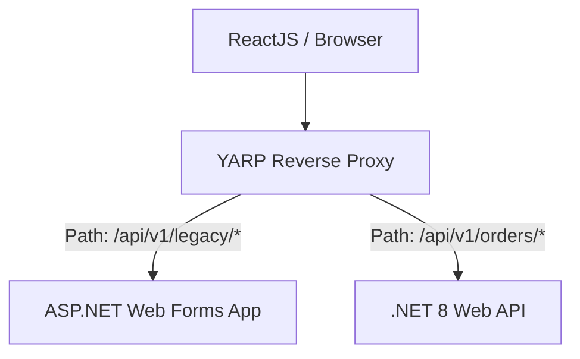

# Refactoring Legacy Systems Playbook (.NET & SQL Server)

Playbook ini mendefinisikan strategi teknis untuk memperbarui (modernisasi) aplikasi warisan (legacy systems) yang berjalan di .NET Framework lama / ASP.NET Web Forms ke arsitektur modern **.NET 8 Clean Architecture** dan **ReactJS Frontend Client**.

---

## 1. Legacy Assessment Matrix

Sebelum menyentuh satu baris kode pun, evaluasi modul legacy menggunakan matriks berikut untuk menentukan tindakan terbaik:

| Kompleksitas Bisnis | Kualitas Kode Legacy | Rekomendasi Modernisasi | Deskripsi Strategi |
|----------------------|----------------------|-------------------------|---------------------|
| **Tinggi** | **Buruk** | **Strangler Fig Pattern** | Lakukan rewrite secara bertahap dengan memotong fitur per modul menjadi API .NET 8 baru, lalu alihkan traffic menggunakan Reverse Proxy. |
| **Rendah** | **Buruk** | **Rebuild (Rewrite total)** | Buat ulang modul dari awal karena kompleksitas bisnis yang rendah meminimalkan risiko bug baru. |
| **Tinggi** | **Baik** | **Refactor / Rehost** | Tingkatkan framework ke .NET 8 dengan mempertahankan struktur logic yang sudah ada. |
| **Rendah** | **Baik** | **Retain (Pertahankan)** | Biarkan sistem berjalan apa adanya jika fungsionalitas stabil dan jarang diubah. |

---

## 2. Strategi Pola Desain Modernisasi

### 2.1 Strangler Fig Pattern
Jangan pernah mematikan aplikasi lama secara sekaligus (big-bang migration). Buatlah aplikasi baru di samping aplikasi lama, lalu gunakan API Gateway (seperti YARP - Yet Another Reverse Proxy) untuk membelah traffic HTTP secara perlahan.



### 2.2 Anti-Corruption Layer (ACL)
Saat sistem baru (.NET 8) perlu berkomunikasi dengan database lama yang skemanya berantakan, buatlah satu layer perantara (ACL) berupa service C# khusus yang menerjemahkan data model berantakan tersebut menjadi DTO modern yang bersih, sehingga domain logic .NET 8 Anda tidak terpolusi oleh skema legacy.

---

## 3. Panduan Migrasi Teknis (.NET Framework ke .NET 8)

### 3.1 Migrasi ADO.NET Raw SQL ke Entity Framework Core 8
Legacy code sering kali penuh dengan inline raw SQL using `SqlConnection` and `SqlCommand`. Ubahlah secara bertahap menggunakan EF Core 8:

* **Legacy Code (ADO.NET):**
  ```csharp
  public List<User> GetActiveUsers()
  {
      var users = new List<User>();
      using (var conn = new SqlConnection(ConnectionString))
      {
          conn.Open();
          using (var cmd = new SqlCommand("SELECT Id, Name FROM Users WHERE IsActive = 1", conn))
          using (var reader = cmd.ExecuteReader())
          {
              while (reader.Read())
              {
                  users.Add(new User { 
                      Id = reader.GetGuid(0), 
                      Name = reader.GetString(1) 
                  });
              }
          }
      }
      return users;
  }
  ```
* **Modern Code (EF Core 8 with LINQ):**
  ```csharp
  public async Task<List<UserDto>> GetActiveUsersAsync(CancellationToken cancellationToken)
  {
      return await dbContext.Users
          .AsNoTracking()
          .Where(u => u.IsActive)
          .Select(u => new UserDto(u.Id, u.Name))
          .ToListAsync(cancellationToken);
  }
  ```

### 3.2 Migrasi WCF (Windows Communication Foundation) ke REST API
* Gantikan service kontrak `[ServiceContract]` WCF yang menggunakan protokol SOAP XML menjadi Controller REST API C# atau Minimal API di .NET 8 yang menggunakan JSON payload.
* Minimal API sangat disarankan untuk modul microservices berukuran kecil karena overhead memory startup-nya yang sangat rendah.

---

## 4. Kiro Prompts untuk Refactoring Legacy Code

Gunakan prompt berikut saat meminta Kiro untuk menata ulang kode warisan Anda:

### Prompt 4.1: Mengubah Legacy Async Wrapper
```text
Convert the following legacy synchronous C# code into modern asynchronous .NET 8 code using TAP (Task-based Asynchronous Pattern).
Ensure:
1. All database calls use async equivalents (e.g., `ExecuteReader` to `ExecuteReaderAsync` / `ToList` to `ToListAsync`).
2. Accept a `CancellationToken` parameter and propagate it down to database calls.
3. Use file-scoped namespaces and clean primary constructor syntax.
Here is the legacy code:
[Paste Legacy Code Here]
```

### Prompt 4.2: Refactor SP Legacy SQL Server ke Entity Framework Core 8
```text
I have a legacy SQL Server Stored Procedure that runs business calculation logic. I want to port this logic directly into a C# Application Layer Command Handler (.NET 8, MediatR, EF Core).
Please analyze the SQL logic and generate the C# class equivalents.
Here is the Stored Procedure:
[Paste SQL SP Here]
```
