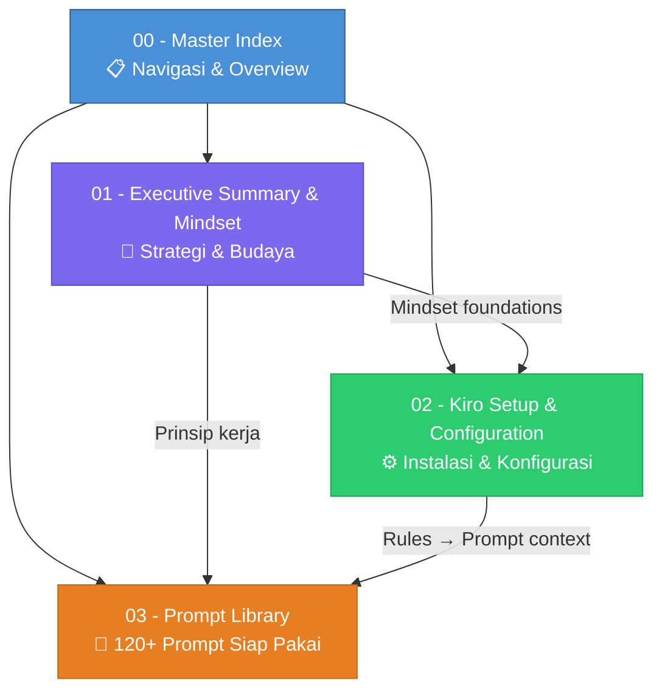
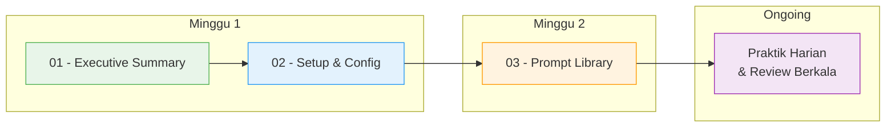
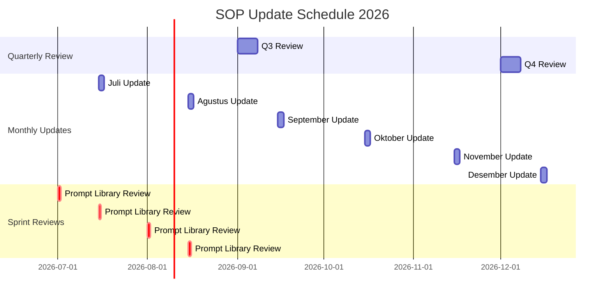
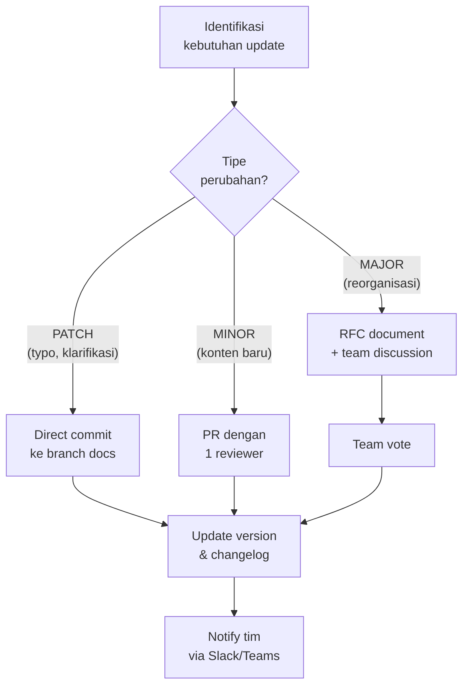
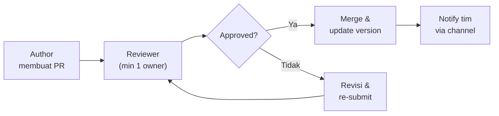

# 🏗️ Kiro Engineering SOP - Complete Engineering Playbook

> **Versi**: 2.0.0 | **Terakhir Diperbarui**: 17 Juni 2026 | **Maintainer**: Engineering Lead  
> **Tech Stack**: .NET 8 · ReactJS 18+ · SQL Server 2022 · Kiro AI

---

> [!IMPORTANT]
> Dokumen ini adalah **single source of truth** untuk seluruh praktik engineering tim kita. Setiap anggota tim **WAJIB** membaca dokumen ini sebelum mulai berkontribusi ke codebase.

## 📋 Deskripsi Proyek

SOP (Standard Operating Procedure) lengkap ini dirancang khusus untuk tim engineering yang menggunakan stack **.NET 8 + ReactJS + SQL Server** dengan bantuan **Kiro AI** sebagai AI-assisted development tool. Dokumen ini mencakup seluruh lifecycle pengembangan software — mulai dari setup environment, penulisan code, testing, deployment, hingga monitoring di production.

### Mengapa SOP Ini Dibuat?

| Masalah | Solusi dalam SOP |
|---------|-----------------|
| Inkonsistensi code style antar developer | Kiro Rules & Steering Files yang terstandarisasi |
| Onboarding developer baru memakan waktu lama | Quick Start Guide & Step-by-step Setup |
| Prompt engineering yang tidak efektif | Library 120+ prompt siap pakai |
| Tidak ada standar code review | Checklist & prompt code review terstruktur |
| Knowledge silos dalam tim | Dokumentasi komprehensif & shared practices |
| Produktivitas belum optimal dengan AI tools | Best practices & anti-patterns guide |

---

## 📑 Table of Contents — Semua Dokumen

Berikut adalah daftar lengkap semua dokumen dalam SOP ini, beserta deskripsi dan target pembaca:

### Dokumen Inti (Core Documents)

| # | Dokumen | Deskripsi | Target Pembaca |
|---|---------|-----------|----------------|
| 00 | **[Master Index](./00-master-index.md)** | Dokumen induk yang menghubungkan semua dokumen SOP | Semua |
| 01 | **[Executive Summary & Mindset](./01-executive-summary-and-mindset.md)** | Ringkasan eksekutif, mindset shift, change management, dan studi kasus | Manager, Tech Lead |
| 02 | **[Kiro Setup & Configuration](./02-kiro-setup-and-configuration.md)** | Panduan instalasi Kiro, rules steering, extensions stack, dan setting IDE | Developer, Tech Lead |
| 03 | **[Prompt Library](./03-prompt-library.md)** | Library 120+ prompt siap pakai untuk backend, frontend, database, & review | Developer, Tech Lead |

### Dokumen Templat & Spesifikasi (Templates & Specs)

| # | Dokumen | Deskripsi | Target Pembaca |
|---|---------|-----------|----------------|
| 04 | **[Template PRD & User Story](./04-template-prd-user-story.md)** | Template PRD, Use Case, dan User Story (Given-When-Then scenario) | Product Manager, Lead |
| 05 | **[Template SRS](./05-template-srs.md)** | Dokumen Software Requirements Specification formal standar IEEE | Analyst, Tech Lead |
| 06 | **[Template Technical Design Document](./06-template-technical-design-document.md)** | Template TDD (skema DB, REST contracts, architecture component) | Developer, Tech Lead |
| 07 | **[Template ADR](./07-template-adr.md)** | Template Architecture Decision Record + 10 contoh keputusan nyata | Tech Lead, Architect |
| 26 | **[Template Architecture Review](./26-template-architecture-review.md)** | Template audit arsitektur sistem (current architecture, risk, technical debt, roadmap) | Architect, Tech Lead |

### Checklist Review & Standardisasi (Reviews & Checklists)

| # | Dokumen | Deskripsi | Target Pembaca |
|---|---------|-----------|----------------|
| 08 | **[Template Code Review Checklist](./08-template-code-review-checklist.md)** | Checklist review kode C# (.NET 8) dan ReactJS | Developer, Tech Lead |
| 09 | **[Template SQL Review Checklist](./09-template-sql-review-checklist.md)** | Checklist optimasi query, index, and stored procedure SQL Server | DBA, Dev Backend |
| 10 | **[Template API Review Checklist](./10-template-api-review-checklist.md)** | Standard RESTful API design, input validation (FluentValidation) | Backend Dev, Lead |
| 10a | **[API Performance Review Checklist](./10a-api-performance-review-checklist.md)** | Deteksi bottleneck API (N+1 query, DbContext, async, LINQ, memory, serialization) | Backend Dev, Lead |
| 11 | **[Template Logging & Observability](./11-template-logging-observability.md)** | Standar Serilog, Correlation ID tracing, & OpenTelemetry integration | DevOps, Lead |

### Panduan Arsitektur & Standard Coding (Architecture & Coding Standards)

| # | Dokumen | Deskripsi | Target Pembaca |
|---|---------|-----------|----------------|
| 12 | **[Template Clean Architecture .NET 8](./12-template-clean-architecture-dotnet8.md)** | Boilerplate code C# lengkap (Domain, Application, Infra, Web API) | Developer, Lead |
| 13 | **[Template ReactJS Frontend Standard](./13-template-reactjs-frontend-standard.md)** | Boilerplate ReactJS (Vite, Zustand, TanStack Query, styling shadcn/ui & Tailwind, Zod validation) | Developer, Lead |
| 14 | **[Spec-Driven Development Playbook](./14-spec-driven-development.md)** | Metodologi coding berbasis OpenAPI specification bersama Kiro | Developer, Lead |

### Alur Kerja & Operasional (Workflows & Playbooks)

| # | Dokumen | Deskripsi | Target Pembaca |
|---|---------|-----------|----------------|
| 15 | **[Workflow GitHub Flow](./15-workflow-github-flow.md)** | Branching, Conventional Commits, PR Template, dan CI/CD Actions | Developer, DevOps |
| 16 | **[Workflow Azure DevOps & Jira](./16-workflow-azure-devops-jira.md)** | Sinkronisasi Agile board (Jira/Azure DevOps) dengan git flow | Semua |
| 17 | **[Workflow Incident Management](./17-workflow-incident-management.md)** | Playbook penanganan insiden SEV1-4, hotfix, dan RCA post-mortem | On-Call Team, Lead |
| 18 | **[Workflow Daily/Weekly/Monthly](./18-workflow-daily-weekly-monthly.md)** | Pembagian waktu ritme kerja engineering harian hingga kuartalan | Semua |
| 19 | **[Playbook Performance Tuning SQL](./19-playbook-performance-tuning-sql.md)** | Panduan tuning database SQL Server skala jutaan record | DBA, Dev Backend |

### Strategi Tim & Pengukuran Metrik (Team Strategy & Metrics)

| # | Dokumen | Deskripsi | Target Pembaca |
|---|---------|-----------|----------------|
| 20 | **[Technical Debt Management](./20-technical-debt-management.md)** | Framework pencatatan, skoring, and pelunasan hutang teknis | Manager, Tech Lead |
| 21 | **[Knowledge Base Strategy](./21-knowledge-base-strategy.md)** | Standar dokumentasi Docs-as-code dan C4 Architecture Model | Developer, Lead |
| 22 | **[Unit Testing Strategy](./22-unit-testing-strategy.md)** | Strategi penulisan automated tests backend (xUnit) dan frontend (Jest) | Developer, Lead |
| 23 | **[Release Readiness Checklists](./23-release-readiness-checklists.md)** | Checklist wajib sebelum PR submit & rilis ke production | Developer, QA, Lead |
| 24 | **[Refactoring Legacy Systems](./24-refactoring-legacy-systems.md)** | Panduan migrasi aplikasi lama (.NET Framework, Web Forms) | Developer, Lead |
| 25 | **[ROI Measurement & KPI](./25-roi-measurement-kpi.md)** | Penerapan DORA metrics dan perhitungan ROI finansial adopsi Kiro | Manager, CTO |
| 27 | **[Playbook Kafka Message Broker](./27-playbook-kafka-message-broker.md)** | Panduan konsep, integrasi .NET 8 Clean Architecture, dan prompt Kafka | Dev Backend, Lead |


### Peta Hubungan Antar Dokumen



### Alur Membaca yang Direkomendasikan



---

## 🚀 Quick Start Guide untuk Anggota Tim Baru

Selamat datang di tim! Ikuti langkah-langkah berikut untuk mulai berkontribusi secepat mungkin:

### Hari 1: Foundation (4-6 jam)

```
✅ Step 1: Baca dokumen 01 (Executive Summary & Mindset)
   └── Fokus pada: Bagian "10 Prinsip Kerja dengan Kiro" dan "Anti-patterns"
   └── Estimasi: 45 menit

✅ Step 2: Setup development environment
   └── Ikuti dokumen 02 (Kiro Setup & Configuration) dari awal sampai akhir
   └── Estimasi: 2-3 jam

✅ Step 3: Verifikasi instalasi
   └── Jalankan checklist verifikasi di akhir dokumen 02
   └── Estimasi: 30 menit

✅ Step 4: Clone repository utama dan jalankan project
   └── git clone <repo-url>
   └── Ikuti README.md di root project
   └── Estimasi: 1 jam
```

### Hari 2: Prompt Mastery (4-6 jam)

```
✅ Step 5: Pelajari Prompt Library (dokumen 03)
   └── Baca semua kategori, bookmark yang relevan dengan role kamu
   └── Estimasi: 2 jam

✅ Step 6: Praktik dengan 5 prompt pertama
   └── Pilih 5 prompt dari kategori yang paling relevan
   └── Coba di project sandbox/playground
   └── Estimasi: 2 jam

✅ Step 7: Pair programming session dengan buddy
   └── Schedule 1 jam session dengan assigned buddy
   └── Fokus: workflow Kiro dalam daily development
   └── Estimasi: 1 jam
```

### Hari 3-5: Deep Dive & Kontribusi Pertama

```
✅ Step 8: Ambil first task (biasanya bug fix atau small feature)
   └── Gunakan prompt dari library untuk membantu
   └── Minta code review dari buddy

✅ Step 9: Ikuti standar yang ada
   └── Pastikan Kiro Rules sudah aktif
   └── Jalankan semua pre-commit hooks

✅ Step 10: Retrospective mini dengan buddy
   └── Diskusikan apa yang berjalan baik dan apa yang perlu diperbaiki
```

### Checklist Onboarding Lengkap

| # | Task | Status | Deadline |
|---|------|--------|----------|
| 1 | Baca Executive Summary (Dok 01) | ⬜ | Hari 1 |
| 2 | Install Kiro & VS Code Extensions (Dok 02) | ⬜ | Hari 1 |
| 3 | Clone repo & jalankan project lokal | ⬜ | Hari 1 |
| 4 | Konfigurasi Kiro Rules & Steering Files | ⬜ | Hari 1 |
| 5 | Pelajari Prompt Library (Dok 03) | ⬜ | Hari 2 |
| 6 | Praktik 5 prompt di sandbox | ⬜ | Hari 2 |
| 7 | Pair programming session | ⬜ | Hari 2 |
| 8 | Setup Docker development environment | ⬜ | Hari 3 |
| 9 | First task/PR submitted | ⬜ | Hari 3-5 |
| 10 | Retrospective dengan buddy | ⬜ | Hari 5 |
| 11 | Feedback ke Engineering Lead tentang SOP | ⬜ | Hari 5 |

---

## 📖 Cara Menggunakan SOP Ini Secara Efektif

### Prinsip Penggunaan

> [!TIP]
> SOP ini bukan untuk dibaca sekali lalu dilupakan. Gunakan sebagai **reference handbook** yang kamu buka setiap kali menghadapi situasi tertentu.

#### 1. Gunakan Sebagai Reference, Bukan Textbook

```
❌ SALAH: Membaca seluruh SOP dari awal sampai akhir dalam satu waktu
✅ BENAR: Membaca yang relevan dengan task saat ini, lalu bookmark untuk referensi
```

#### 2. Ikuti Alur Berdasarkan Situasi

| Situasi | Dokumen yang Dibaca | Bagian Spesifik |
|---------|--------------------|-----------------| 
| Baru join tim | 01 → 02 → 03 | Seluruhnya |
| Mau bikin API baru | 03 | Kategori 2, 5 |
| Mau bikin komponen React | 03 | Kategori 3 |
| Code review PR orang | 03 | Kategori 6 |
| Setup project baru | 02 | Struktur folder, Rules |
| Performance issue | 03 | Kategori 8 |
| Security audit | 03 | Kategori 9 |
| Database migration | 03 | Kategori 14 |
| Presentasi ke management | 01 | Executive Summary |
| Debugging production issue | 03 | Kategori 13, 15 |

#### 3. Kontribusi dan Update

Setiap anggota tim **diharapkan** berkontribusi pada SOP ini:

```markdown
## Cara Berkontribusi

1. Fork/branch dari `docs/sop` branch
2. Edit dokumen yang relevan
3. Submit PR dengan label `sop-update`
4. Minimal 1 reviewer dari Tech Lead
5. Merge setelah approved

## Format Kontribusi Prompt Baru (Dok 03)
Gunakan template berikut:

### PROMPT-[KATEGORI]-[NOMOR]: [Nama Prompt]

| Field | Value |
|-------|-------|
| **Kategori** | [Kategori] |
| **Kapan Digunakan** | [Deskripsi kapan prompt ini berguna] |

**Prompt:**
```text
[Prompt text lengkap]
```

**Contoh Output yang Diharapkan:**
[Brief description]

**Tips Penggunaan:**
- [Tip 1]
- [Tip 2]
```

#### 4. Review Berkala

| Aktivitas | Frekuensi | PIC |
|-----------|-----------|-----|
| Review prompt library | Setiap 2 minggu | All developers |
| Update Kiro rules | Setiap sprint | Tech Lead |
| Full SOP review | Setiap quarter | Engineering Manager |
| Onboarding feedback integration | Setiap ada anggota baru | Engineering Lead |

---

## 📊 Document Versioning dan Update Schedule

### Versioning Schema

Kami menggunakan **Semantic Versioning** untuk SOP ini:

```
MAJOR.MINOR.PATCH

MAJOR = Perubahan fundamental (reorganisasi besar, perubahan stack)
MINOR = Penambahan konten signifikan (kategori prompt baru, dokumen baru)
PATCH = Perbaikan kecil (typo, klarifikasi, update minor)
```

### Changelog

| Versi | Tanggal | Perubahan | Author |
|-------|---------|-----------|--------|
| 2.0.0 | 2026-06-17 | Initial release — 4 dokumen inti | Engineering Lead |
| — | — | — | — |

### Update Schedule



### Proses Update



---

## 👥 Role-Based Reading Guide

### Untuk Developer (Junior - Mid)

Sebagai developer, fokus utama kamu adalah pada **setup environment** dan **prompt mastery**:

#### Prioritas Membaca

```
🔴 WAJIB (Minggu 1):
├── 01 - Executive Summary: Bagian "10 Prinsip Kerja" dan "Anti-patterns"
├── 02 - Kiro Setup: SELURUH dokumen (ikuti step by step)
└── 03 - Prompt Library: Kategori 2 (.NET), 3 (React), 4 (SQL Server)

🟡 PENTING (Minggu 2-3):
├── 03 - Prompt Library: Kategori 5 (API), 6 (Code Review), 7 (Testing)
└── 01 - Executive Summary: Bagian "Mindset Shift"

🟢 NICE TO HAVE (Bulan 1):
├── 03 - Prompt Library: Semua kategori lainnya
└── 01 - Executive Summary: Bagian Cost-Benefit & Stakeholder Communication
```

#### Prompt yang Paling Sering Dipakai Developer

| Aktivitas Harian | Kategori Prompt | Frekuensi |
|-------------------|-----------------|-----------|
| Menulis API endpoint | Kategori 2 & 5 | Setiap hari |
| Membuat komponen React | Kategori 3 | Setiap hari |
| Query database | Kategori 4 | 3-4x/minggu |
| Writing unit tests | Kategori 7 | Setiap PR |
| Debugging | Kategori 13 | Saat ada bug |

---

### Untuk Tech Lead / Senior Developer

Sebagai Tech Lead, fokus kamu pada **architecture decisions**, **code quality**, dan **team standardization**:

#### Prioritas Membaca

```
🔴 WAJIB (Minggu 1):
├── 01 - Executive Summary: SELURUH dokumen
├── 02 - Kiro Setup: Fokus pada Rules, Steering Files, Standardization
└── 03 - Prompt Library: Kategori 1 (Architecture), 6 (Code Review), 9 (Security)

🟡 PENTING (Minggu 2):
├── 03 - Prompt Library: Kategori 8 (Performance), 11 (Refactoring), 12 (DevOps)
└── 02 - Kiro Setup: Custom rules & team configuration

🟢 ONGOING:
├── Review & update Kiro Rules setiap sprint
├── Kurasi prompt library berdasarkan feedback tim
└── Identifikasi prompt patterns baru
```

#### Tanggung Jawab Khusus Tech Lead

| Tanggung Jawab | Dokumen Referensi | Frekuensi |
|---------------|-------------------|-----------|
| Review & update Kiro Rules | Dok 02, Bagian Rules | Setiap sprint |
| Kurasi prompt baru dari tim | Dok 03 | Bi-weekly |
| Standarisasi coding practices | Dok 02 & 03 | Monthly |
| Architecture decision records | Dok 03, Kategori 1 | Per kebutuhan |
| Mentoring junior developers | Dok 01, 02, 03 | Ongoing |
| Performance review terkait Kiro adoption | Dok 01, Bagian Metrics | Quarterly |

---

### Untuk Engineering Manager

Sebagai Engineering Manager, fokus kamu pada **ROI**, **team productivity**, dan **change management**:

#### Prioritas Membaca

```
🔴 WAJIB:
├── 01 - Executive Summary: SELURUH dokumen (terutama Cost-Benefit Analysis)
├── 00 - Master Index: Quick Start & Update Schedule
└── 01 - Executive Summary: Change Management & Stakeholder Communication

🟡 PENTING:
├── 02 - Kiro Setup: Overview saja (tidak perlu detail teknis)
└── 03 - Prompt Library: Skim untuk memahami scope

🟢 ONGOING:
├── Review productivity metrics dari Dok 01
├── Update stakeholder communication templates
└── Ensure SOP compliance dalam sprint retrospectives
```

#### Metrics yang Perlu Dimonitor

| Metric | Target | Sumber Data | Frekuensi Review |
|--------|--------|-------------|-----------------|
| PR cycle time | -40% dari baseline | GitHub/Azure DevOps | Weekly |
| Bug escape rate | -30% dari baseline | Bug tracker | Monthly |
| Onboarding time | < 5 hari productive | Onboarding tracker | Per event |
| Kiro adoption rate | > 90% tim | Survey | Monthly |
| Developer satisfaction | > 4.0/5.0 | Survey | Quarterly |
| Code review turnaround | < 4 jam | GitHub/Azure DevOps | Weekly |
| Test coverage | > 80% | CI pipeline | Per PR |

---

## 🔍 Quick Reference — Cari Dokumen Berdasarkan Topik

### Index A-Z

| Topik | Dokumen | Bagian |
|-------|---------|--------|
| Anti-patterns | 01 | Anti-patterns yang Harus Dihindari |
| API Design | 03 | Kategori 5 |
| Architecture | 03 | Kategori 1 |
| Change Management | 01 | Change Management Strategy |
| CI/CD | 03 | Kategori 12 |
| Code Review | 03 | Kategori 6 |
| Configuration | 02 | Kiro Configuration Files |
| Cost-Benefit | 01 | Cost-Benefit Analysis Framework |
| Database Migration | 03 | Kategori 14 |
| Debugging | 03 | Kategori 13 |
| DevOps | 03 | Kategori 12 |
| Docker | 02 | Docker Development Environment |
| Documentation | 03 | Kategori 10 |
| Environment Setup | 02 | Environment Setup |
| Extensions (VS Code) | 02 | VS Code Extension Stack |
| Folder Structure | 02 | Struktur Folder Project |
| Git Configuration | 02 | Git Configuration |
| Installation | 02 | Instalasi dan Konfigurasi |
| Kafka | 27 | Seluruh Dokumen |
| Kiro Rules | 02 | Kiro Rules dan Steering Files |
| Legacy Code | 03 | Kategori 11 |
| Logging | 03 | Kategori 15 |
| Metrics | 01 | Expected Productivity Gains |
| Message Broker | 27 | Seluruh Dokumen |
| Mindset | 01 | Mindset Shift |
| Monitoring | 03 | Kategori 15 |
| .NET 8 Development | 03 | Kategori 2 |
| Onboarding | 00 | Quick Start Guide |
| Performance | 03 | Kategori 8 |
| Principles | 01 | 10 Prinsip Kerja dengan Kiro |
| Prompt Library | 03 | Semua Kategori |
| ReactJS Development | 03 | Kategori 3 |
| Refactoring | 03 | Kategori 11 |
| Security | 03 | Kategori 9 |
| Setup Guide | 02 | Seluruh Dokumen |
| shadcn/ui | 13 | Section 3.6 |
| SQL Server | 03 | Kategori 4 |
| Stakeholder Communication | 01 | Stakeholder Communication |
| Steering Files | 02 | Kiro Rules dan Steering Files |
| Tailwind CSS | 13 | Section 8 |
| Testing | 03 | Kategori 7 |
| Training | 01 | Training Roadmap |
| Troubleshooting | 02 & 03 | Troubleshooting sections |
| Unit Testing | 03 | Kategori 7 |
| Versioning (SOP) | 00 | Document Versioning |
| VS Code | 02 | VS Code Extension Stack |

---

## 🛡️ Governance dan Ownership

### Document Owners

| Dokumen | Primary Owner | Secondary Owner | Review Cadence |
|---------|--------------|-----------------|----------------|
| 00 - Master Index | Engineering Manager | Tech Lead | Quarterly |
| 01 - Executive Summary | Engineering Manager | CTO | Quarterly |
| 02 - Setup & Config | Tech Lead | Senior Developer | Monthly |
| 03 - Prompt Library | Tech Lead | All Developers | Bi-weekly |

### Proses Approval



### Konvensi Penulisan

| Aspek | Standar |
|-------|---------|
| Bahasa deskripsi | Bahasa Indonesia |
| Bahasa teknis/code | English |
| Format file | Markdown (.md) |
| Heading style | ATX headers (#) |
| Code blocks | Fenced (```) dengan language tag |
| Line length | Max 120 karakter |
| Diagram | Mermaid |
| Alerts | GitHub-style (NOTE, TIP, IMPORTANT, WARNING, CAUTION) |

---

## 📞 Kontak dan Eskalasi

| Kebutuhan | Kontak | Channel |
|-----------|--------|---------|
| Pertanyaan tentang SOP | Engineering Lead | #eng-sop Slack |
| Bug/issue di Kiro setup | Tech Lead | #kiro-support Slack |
| Request prompt baru | Siapapun | PR ke docs/sop branch |
| Eskalasi urgent | Engineering Manager | Direct message |
| Feedback & saran | Siapapun | #eng-feedback Slack |

---

> [!NOTE]
> Dokumen ini akan terus di-update seiring berkembangnya tim dan teknologi. Jika kamu menemukan informasi yang outdated atau ingin menambahkan sesuatu, jangan ragu untuk submit PR. Kontribusi dari semua anggota tim sangat dihargai! 🙌

---

*Dibuat dengan ❤️ oleh Engineering Team — Powered by Kiro AI*

*Terakhir diperbarui: 17 Juni 2026 | Versi: 2.0.0*
