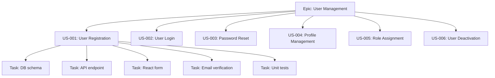
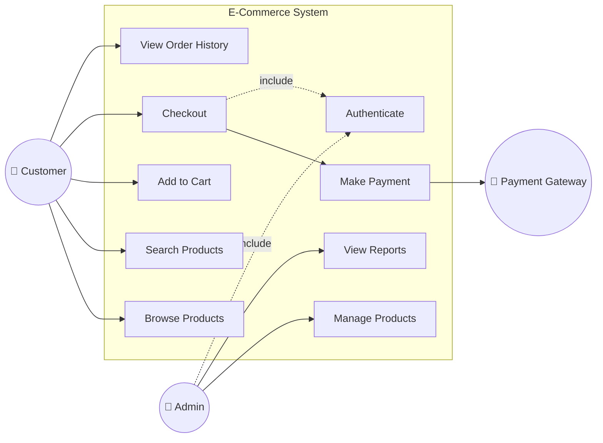

# 📋 Template: PRD, User Story & Use Case

> **Versi:** 2.0
> **Terakhir Diperbarui:** 2026-06-17
> **Tech Stack:** .NET 8 · ReactJS 18 · SQL Server 2022
> **Maintainer:** Engineering Lead

---

## Daftar Isi

- [Bagian A — Product Requirements Document (PRD)](#bagian-a--product-requirements-document-prd)
- [Bagian B — User Story Template](#bagian-b--user-story-template)
- [Bagian C — Use Case Template](#bagian-c--use-case-template)

---

# Bagian A — Product Requirements Document (PRD)

## A.1 Template PRD Lengkap

> [!IMPORTANT]
> PRD adalah dokumen utama yang menjadi **single source of truth** untuk setiap fitur atau produk. Semua stakeholder WAJIB mereview dan menyetujui PRD sebelum development dimulai.

```markdown
# PRD: [Nama Fitur / Produk]

| Field               | Detail                                    |
|---------------------|-------------------------------------------|
| **PRD ID**          | PRD-[YYYY]-[NNN]                          |
| **Author**          | [Nama Product Manager]                    |
| **Created**         | [YYYY-MM-DD]                              |
| **Last Updated**    | [YYYY-MM-DD]                              |
| **Status**          | Draft / In Review / Approved / Superseded |
| **Target Release**  | [Sprint/Quarter]                          |
| **Priority**        | P0-Critical / P1-High / P2-Medium / P3-Low|
| **Reviewers**       | [List nama reviewer]                      |
| **Approvers**       | [List nama approver]                      |

---

## 1. Executive Summary

[Ringkasan eksekutif dalam 2-3 paragraf. Jelaskan APA yang akan dibangun,
MENGAPA fitur ini penting, dan DAMPAK bisnis yang diharapkan.]

## 2. Problem Statement

### 2.1 Current Situation (As-Is)
[Jelaskan kondisi saat ini. Apa yang user alami sekarang?]

### 2.2 Pain Points
| # | Pain Point | Severity | Affected Users | Frequency |
|---|-----------|----------|----------------|-----------|
| 1 |           |          |                |           |
| 2 |           |          |                |           |

### 2.3 Root Cause Analysis
[Gunakan 5 Whys atau Fishbone diagram untuk identifikasi akar masalah]

### 2.4 Impact of Not Solving
[Apa dampaknya jika masalah ini TIDAK diselesaikan?]
- Revenue impact: [estimasi]
- User churn risk: [estimasi]
- Operational cost: [estimasi]

## 3. Goals & Non-Goals

### 3.1 Goals (Dalam Scope)
| # | Goal | Measurable Target | Timeline |
|---|------|--------------------|----------|
| 1 |      |                    |          |
| 2 |      |                    |          |

### 3.2 Non-Goals (Luar Scope)
| # | Non-Goal | Rationale |
|---|----------|-----------|
| 1 |          |           |
| 2 |          |           |

### 3.3 Future Considerations
[Hal-hal yang MUNGKIN masuk scope di fase berikutnya]

## 4. User Personas

### Persona 1: [Nama Persona]
| Attribute      | Detail                          |
|----------------|---------------------------------|
| **Role**       |                                 |
| **Demographics** |                               |
| **Tech Savviness** | Beginner / Intermediate / Advanced |
| **Goals**      |                                 |
| **Frustrations** |                               |
| **Usage Frequency** | Daily / Weekly / Monthly    |
| **Key Scenarios** |                               |

### Persona 2: [Nama Persona]
[Format sama seperti di atas]

## 5. Feature Requirements

### 5.1 Functional Requirements

#### FR-001: [Nama Requirement]
| Field            | Detail                         |
|------------------|--------------------------------|
| **ID**           | FR-001                         |
| **Priority**     | Must Have / Should Have / Could Have / Won't Have |
| **Description**  |                                |
| **User Story**   | As a [role], I want [what], so that [why] |
| **Acceptance Criteria** |                         |
| **Dependencies** |                                |
| **Mockup/Wireframe** | [Link to Figma/design]    |
| **Notes**        |                                |

#### FR-002: [Nama Requirement]
[Format sama]

### 5.2 Non-Functional Requirements

| ID     | Category      | Requirement              | Target         | Priority |
|--------|---------------|--------------------------|----------------|----------|
| NFR-001| Performance   |                          |                |          |
| NFR-002| Security      |                          |                |          |
| NFR-003| Scalability   |                          |                |          |
| NFR-004| Availability  |                          |                |          |
| NFR-005| Usability     |                          |                |          |
| NFR-006| Accessibility |                          |                |          |

## 6. Success Metrics & KPIs

### 6.1 Primary Metrics
| Metric | Current Baseline | Target | Measurement Method | Timeline |
|--------|------------------|--------|--------------------|----------|
|        |                  |        |                    |          |

### 6.2 Secondary Metrics
| Metric | Current Baseline | Target | Measurement Method | Timeline |
|--------|------------------|--------|--------------------|----------|
|        |                  |        |                    |          |

### 6.3 Counter Metrics
[Metrik yang harus dipastikan TIDAK menurun akibat perubahan]
| Metric | Current Baseline | Acceptable Threshold |
|--------|------------------|----------------------|
|        |                  |                      |

### 6.4 Success Criteria
[Definisikan kondisi dimana fitur dianggap SUKSES atau GAGAL]

## 7. Technical Constraints

| # | Constraint | Impact | Mitigation |
|---|-----------|--------|------------|
| 1 | Must use existing .NET 8 backend | | |
| 2 | SQL Server 2022 as primary database | | |
| 3 | Must support IE11+ (if applicable) | | |
| 4 | Max response time < 200ms | | |
| 5 | Must comply with GDPR/data privacy | | |

## 8. Timeline & Milestones

### 8.1 High-Level Timeline
| Phase | Start Date | End Date | Deliverable | Owner |
|-------|-----------|----------|-------------|-------|
| Discovery & Design | | | PRD Approved | PM |
| Technical Design | | | TDD Approved | Tech Lead |
| Sprint 1 - Backend | | | API Endpoints | Backend Dev |
| Sprint 2 - Frontend | | | UI Components | Frontend Dev |
| Sprint 3 - Integration | | | E2E Testing | QA |
| UAT | | | Sign-off | PM + Stakeholder |
| Release | | | Production Deploy | DevOps |

### 8.2 Dependencies & Blockers
| # | Dependency | Owner | Status | ETA |
|---|-----------|-------|--------|-----|
|   |           |       |        |     |

## 9. Risk Assessment

| # | Risk | Probability | Impact | Score | Mitigation | Owner |
|---|------|-------------|--------|-------|------------|-------|
| 1 |      | H/M/L       | H/M/L  |       |            |       |
| 2 |      | H/M/L       | H/M/L  |       |            |       |

### Risk Matrix
| | Low Impact | Medium Impact | High Impact |
|---|-----------|---------------|-------------|
| **High Probability** | Medium | High | Critical |
| **Medium Probability** | Low | Medium | High |
| **Low Probability** | Low | Low | Medium |

## 10. Approval Matrix

| Role | Name | Status | Date | Signature |
|------|------|--------|------|-----------|
| Product Manager | | ⬜ Pending | | |
| Engineering Lead | | ⬜ Pending | | |
| UX Designer | | ⬜ Pending | | |
| QA Lead | | ⬜ Pending | | |
| Security Officer | | ⬜ Pending | | |
| VP/Director | | ⬜ Pending | | |

**Status Legend:** ⬜ Pending | ✅ Approved | ❌ Rejected | 🔄 Revision Requested

## 11. Appendices

### Appendix A: Wireframes & Mockups
[Link to Figma / design files]

### Appendix B: User Research Data
[Link to research documents, survey results]

### Appendix C: Competitive Analysis
[Comparison with competitor solutions]

### Appendix D: Glossary
| Term | Definition |
|------|-----------|
|      |           |

---
## Revision History
| Version | Date | Author | Changes |
|---------|------|--------|---------|
| 0.1     |      |        | Initial draft |
| 1.0     |      |        | Approved version |
```

---

## A.2 Contoh PRD Terisi #1: Fitur Wishlist E-Commerce

```markdown
# PRD: E-Commerce Wishlist Feature

| Field               | Detail                                    |
|---------------------|-------------------------------------------|
| **PRD ID**          | PRD-2026-042                              |
| **Author**          | Sarah Wijaya (Product Manager)            |
| **Created**         | 2026-05-10                                |
| **Last Updated**    | 2026-06-15                                |
| **Status**          | Approved                                  |
| **Target Release**  | Q3 2026 - Sprint 14                       |
| **Priority**        | P1-High                                   |
| **Reviewers**       | Budi Santoso (Tech Lead), Rina Putri (UX) |
| **Approvers**       | Ahmad Fauzi (VP Product)                  |

---

## 1. Executive Summary

Fitur Wishlist memungkinkan pengguna menyimpan produk yang mereka minati untuk
dibeli di kemudian hari. Saat ini, 32% pengguna meninggalkan situs setelah
browsing tanpa melakukan pembelian dan tidak memiliki cara untuk kembali ke
produk yang mereka lihat sebelumnya.

Fitur ini diharapkan meningkatkan conversion rate sebesar 15% dan mengurangi
bounce rate sebesar 10% dalam 3 bulan setelah peluncuran. Berdasarkan riset
kompetitor, 89% e-commerce platform sudah menyediakan fitur wishlist.

## 2. Problem Statement

### 2.1 Current Situation (As-Is)
Pengguna saat ini hanya bisa menambahkan produk ke keranjang belanja (cart).
Tidak ada mekanisme untuk menyimpan produk tanpa niat beli langsung. Pengguna
yang ingin "bookmark" produk terpaksa menggunakan fitur bookmark browser atau
menambahkan item ke cart yang mengacaukan pengalaman checkout.

### 2.2 Pain Points
| # | Pain Point | Severity | Affected Users | Frequency |
|---|-----------|----------|----------------|-----------|
| 1 | Tidak bisa menyimpan produk untuk nanti | High | 85% browsing users | Daily |
| 2 | Cart penuh dengan item yang tidak akan dibeli | Medium | 45% active users | Weekly |
| 3 | Kehilangan produk yang pernah dilihat | High | 70% returning users | Daily |
| 4 | Tidak bisa share list produk ke orang lain | Low | 15% users | Monthly |

### 2.3 Root Cause Analysis
- Why 1: Pengguna meninggalkan situs → Tidak ada fitur save/bookmark produk
- Why 2: Tidak ada fitur save → Belum diprioritaskan dalam roadmap
- Why 3: Belum diprioritaskan → Data menunjukkan dampak baru terlihat di Q1 2026
- Why 4: Data baru tersedia → Implementasi analytics baru di Q4 2025
- Root Cause: Kurangnya fitur product persistence di luar cart

### 2.4 Impact of Not Solving
- Revenue impact: Estimasi kehilangan Rp 2.3M/bulan dari abandoned browsing
- User churn risk: 12% user churn karena pengalaman browsing tidak memadai
- Operational cost: Rp 500K/bulan biaya support untuk pertanyaan "dimana produk yang saya lihat kemarin"

## 3. Goals & Non-Goals

### 3.1 Goals (Dalam Scope)
| # | Goal | Measurable Target | Timeline |
|---|------|--------------------|----------|
| 1 | User dapat menyimpan produk ke wishlist | 100% product pages have wishlist button | Sprint 14 |
| 2 | User dapat melihat dan mengelola wishlist | Wishlist page accessible from nav | Sprint 14 |
| 3 | User dapat memindahkan item dari wishlist ke cart | One-click add to cart from wishlist | Sprint 15 |
| 4 | Notifikasi harga turun untuk item di wishlist | Email notification within 1 hour | Sprint 16 |

### 3.2 Non-Goals (Luar Scope)
| # | Non-Goal | Rationale |
|---|----------|-----------|
| 1 | Social sharing wishlist | Phase 2 consideration, perlu riset privacy |
| 2 | Multiple wishlist collections | Complexity terlalu tinggi untuk MVP |
| 3 | Wishlist analytics dashboard untuk seller | Akan dilakukan di seller portal phase 2 |

## 4. User Personas

### Persona 1: Maya - The Window Shopper
| Attribute      | Detail                          |
|----------------|---------------------------------|
| **Role**       | Regular shopper, 28 tahun       |
| **Demographics** | Female, urban, income Rp 8-15M/bulan |
| **Tech Savviness** | Intermediate                |
| **Goals**      | Membandingkan produk sebelum beli, tunggu diskon |
| **Frustrations** | Lupa produk yang pernah dilihat, cart berantakan |
| **Usage Frequency** | Daily browsing, weekly purchase |
| **Key Scenarios** | Browse 20+ produk, simpan 5, beli 1-2 saat gajian |

### Persona 2: Andi - The Deal Hunter
| Attribute      | Detail                          |
|----------------|---------------------------------|
| **Role**       | Budget-conscious buyer, 35 tahun |
| **Demographics** | Male, suburban, income Rp 5-8M/bulan |
| **Tech Savviness** | Advanced                    |
| **Goals**      | Mendapat harga terbaik, monitoring harga |
| **Frustrations** | Tidak tahu kapan harga turun |
| **Usage Frequency** | Weekly browsing, monthly purchase |
| **Key Scenarios** | Track 10 produk, beli saat flash sale |

## 5. Feature Requirements

### 5.1 Functional Requirements

#### FR-001: Add to Wishlist
| Field            | Detail                         |
|------------------|--------------------------------|
| **ID**           | FR-001                         |
| **Priority**     | Must Have                      |
| **Description**  | User dapat menambahkan produk ke wishlist dari halaman produk dan listing |
| **User Story**   | As a shopper, I want to save products to my wishlist, so that I can buy them later |
| **Acceptance Criteria** | 1. Heart icon pada setiap product card 2. Toggle on/off wishlist 3. Visual feedback saat ditambahkan 4. Persist across sessions (logged in) 5. Max 200 items per wishlist |
| **Dependencies** | Auth service, Product service   |
| **Mockup**       | [Figma - Wishlist Button](#) |

#### FR-002: View Wishlist
| Field            | Detail                         |
|------------------|--------------------------------|
| **ID**           | FR-002                         |
| **Priority**     | Must Have                      |
| **Description**  | Halaman dedicated untuk melihat semua item di wishlist |
| **User Story**   | As a shopper, I want to see all my saved products in one place, so that I can decide what to buy |
| **Acceptance Criteria** | 1. Grid/list view toggle 2. Sort by: date added, price, name 3. Filter by: category, availability 4. Show current price & stock status 5. Pagination (20 items/page) |
| **Dependencies** | Product service, Pricing service |
| **Mockup**       | [Figma - Wishlist Page](#)  |

#### FR-003: Move to Cart
| Field            | Detail                         |
|------------------|--------------------------------|
| **ID**           | FR-003                         |
| **Priority**     | Must Have                      |
| **Description**  | User dapat memindahkan item dari wishlist ke cart |
| **User Story**   | As a shopper, I want to move items from my wishlist to my cart, so that I can purchase them easily |
| **Acceptance Criteria** | 1. "Add to Cart" button per item 2. "Add All to Cart" bulk action 3. Select quantity before adding 4. Handle out-of-stock gracefully 5. Option to remove from wishlist after adding to cart |
| **Dependencies** | Cart service, Inventory service |

#### FR-004: Price Drop Notification
| Field            | Detail                         |
|------------------|--------------------------------|
| **ID**           | FR-004                         |
| **Priority**     | Should Have                    |
| **Description**  | Notifikasi otomatis saat harga produk di wishlist turun |
| **User Story**   | As a deal hunter, I want to be notified when prices drop, so that I can buy at the best price |
| **Acceptance Criteria** | 1. Email notification within 1 hour of price change 2. In-app notification badge 3. Show old price vs new price 4. Deep link to product 5. Notification preferences configurable |
| **Dependencies** | Pricing service, Notification service, Email service |

### 5.2 Non-Functional Requirements

| ID     | Category      | Requirement                           | Target              | Priority   |
|--------|---------------|---------------------------------------|----------------------|------------|
| NFR-001| Performance   | Wishlist page load time               | < 500ms (P95)       | Must Have  |
| NFR-002| Performance   | Add/remove wishlist response time     | < 200ms (P95)       | Must Have  |
| NFR-003| Scalability   | Concurrent wishlist operations        | 10,000 ops/sec      | Must Have  |
| NFR-004| Availability  | Wishlist service uptime               | 99.9%               | Must Have  |
| NFR-005| Security      | Wishlist data isolation per user      | Zero cross-user leak | Must Have  |
| NFR-006| Usability     | Wishlist accessible via keyboard      | WCAG 2.1 AA         | Should Have|

## 6. Success Metrics & KPIs

### 6.1 Primary Metrics
| Metric | Current Baseline | Target | Measurement Method | Timeline |
|--------|------------------|--------|--------------------|----------|
| Conversion rate (browse→purchase) | 3.2% | 3.7% (+15%) | Analytics funnel | 3 months post-launch |
| Wishlist adoption rate | 0% | 25% of active users | Feature usage tracking | 1 month post-launch |
| Items wishlisted per user | 0 | Avg 8 items | Database query | 3 months post-launch |

### 6.2 Secondary Metrics
| Metric | Current Baseline | Target | Measurement Method | Timeline |
|--------|------------------|--------|--------------------|----------|
| Bounce rate | 42% | 38% (-10%) | Google Analytics | 3 months |
| Session duration | 4.2 min | 5.5 min (+30%) | Google Analytics | 3 months |
| Return visit rate | 35% | 45% (+28%) | Analytics | 3 months |

### 6.3 Counter Metrics
| Metric | Current Baseline | Acceptable Threshold |
|--------|------------------|----------------------|
| Cart conversion rate | 68% | Must not drop below 65% |
| Page load time | 1.2s | Must not exceed 1.5s |
| Support tickets/week | 45 | Must not exceed 50 |

## 7. Technical Constraints

| # | Constraint | Impact | Mitigation |
|---|-----------|--------|------------|
| 1 | Must use existing .NET 8 Web API backend | Consistent with architecture | Follow existing patterns |
| 2 | SQL Server 2022 for data storage | ACID compliance ensured | Proper indexing strategy |
| 3 | ReactJS 18 frontend | Component reuse possible | Use existing design system |
| 4 | Max 200 items per wishlist | Prevents DB bloat | Show warning at 180 items |
| 5 | Real-time price sync required | Eventual consistency risk | Use SignalR for live updates |

## 8. Timeline & Milestones

| Phase | Start Date | End Date | Deliverable | Owner |
|-------|-----------|----------|-------------|-------|
| PRD Review & Approval | 2026-06-01 | 2026-06-14 | Approved PRD | Sarah W. |
| Technical Design | 2026-06-15 | 2026-06-21 | Approved TDD | Budi S. |
| Sprint 14 - Core Wishlist | 2026-06-22 | 2026-07-05 | Add/View/Remove | Dev Team |
| Sprint 15 - Cart Integration | 2026-07-06 | 2026-07-19 | Move to Cart | Dev Team |
| Sprint 16 - Notifications | 2026-07-20 | 2026-08-02 | Price drop alerts | Dev Team |
| QA & UAT | 2026-08-03 | 2026-08-16 | Sign-off | QA + PM |
| Production Release | 2026-08-18 | 2026-08-18 | Go Live | DevOps |

## 9. Risk Assessment

| # | Risk | Probability | Impact | Score | Mitigation | Owner |
|---|------|-------------|--------|-------|------------|-------|
| 1 | DB performance degradation with high wishlist volume | Medium | High | High | Implement caching layer with Redis, proper indexing | Budi S. |
| 2 | Price sync delay causing wrong notifications | Medium | Medium | Medium | Use event-driven architecture with retry mechanism | Dev Team |
| 3 | User confusion between wishlist and cart | Low | Medium | Low | Clear UX differentiation, onboarding tooltip | Rina P. |
| 4 | Notification spam annoys users | Medium | High | High | Rate limiting, notification preferences | Dev Team |

## 10. Approval Matrix

| Role | Name | Status | Date | Signature |
|------|------|--------|------|-----------|
| Product Manager | Sarah Wijaya | ✅ Approved | 2026-06-10 | SW |
| Engineering Lead | Budi Santoso | ✅ Approved | 2026-06-12 | BS |
| UX Designer | Rina Putri | ✅ Approved | 2026-06-11 | RP |
| QA Lead | Dedi Firmansyah | ✅ Approved | 2026-06-13 | DF |
| VP Product | Ahmad Fauzi | ✅ Approved | 2026-06-14 | AF |
```

---

## A.3 Contoh PRD Terisi #2: Reporting Dashboard

```markdown
# PRD: Advanced Reporting Dashboard

| Field               | Detail                                    |
|---------------------|-------------------------------------------|
| **PRD ID**          | PRD-2026-058                              |
| **Author**          | Dian Permata (Senior Product Manager)     |
| **Created**         | 2026-06-01                                |
| **Last Updated**    | 2026-06-17                                |
| **Status**          | In Review                                 |
| **Target Release**  | Q4 2026 - Sprint 20                       |
| **Priority**        | P1-High                                   |
| **Reviewers**       | Reza Hakim (Architect), Lisa Chen (UX)    |
| **Approvers**       | Marco Tan (CTO)                           |

---

## 1. Executive Summary

Dashboard Reporting Lanjutan menggantikan sistem reporting manual berbasis
Excel yang saat ini digunakan oleh tim operasional dan manajemen. Sistem
baru akan menyediakan real-time dashboard dengan visualisasi interaktif,
scheduled reports, dan kemampuan drill-down untuk analisis mendalam.

Saat ini tim operasional menghabiskan rata-rata 15 jam/minggu untuk membuat
laporan manual. Dengan dashboard otomatis, waktu ini diharapkan berkurang
menjadi 2 jam/minggu (penghematan 87%) dan mengurangi human error sebesar 95%.

## 2. Problem Statement

### 2.1 Current Situation (As-Is)
Tim operasional mengekstrak data dari SQL Server menggunakan SSMS, memproses
di Excel, dan mendistribusikan via email setiap Senin pagi. Proses ini memakan
waktu 3-4 jam per laporan dan rawan kesalahan copy-paste. Manajemen sering
mendapat data yang outdated karena laporan hanya diperbarui mingguan.

### 2.2 Pain Points
| # | Pain Point | Severity | Affected Users | Frequency |
|---|-----------|----------|----------------|-----------|
| 1 | Pembuatan laporan manual 15 jam/minggu | Critical | 8 ops staff | Weekly |
| 2 | Data sudah outdated saat laporan selesai | High | 25 managers | Daily |
| 3 | Tidak bisa drill-down ke detail | High | 15 analysts | Daily |
| 4 | Format laporan tidak konsisten antar tim | Medium | 40 stakeholders | Weekly |
| 5 | Tidak ada alerting saat metrik anomali | High | 10 managers | Continuous |

### 2.3 Root Cause Analysis
Root Cause: Tidak ada automated data pipeline dan visualization layer
di atas existing SQL Server database.

### 2.4 Impact of Not Solving
- Revenue impact: Keputusan bisnis tertunda rata-rata 3-5 hari
- Operational cost: Rp 45M/tahun untuk labor manual reporting
- Data quality: 8% error rate pada laporan manual

## 3. Goals & Non-Goals

### 3.1 Goals
| # | Goal | Measurable Target | Timeline |
|---|------|--------------------|----------|
| 1 | Real-time dashboard untuk KPI utama | < 5 min data freshness | Sprint 20 |
| 2 | Self-service report builder | 80% reports self-serve | Sprint 22 |
| 3 | Scheduled report delivery | Automated daily/weekly/monthly | Sprint 21 |
| 4 | Role-based dashboard access | 5 role levels configured | Sprint 20 |
| 5 | Export ke PDF/Excel/CSV | All 3 formats supported | Sprint 21 |

### 3.2 Non-Goals
| # | Non-Goal | Rationale |
|---|----------|-----------|
| 1 | Machine learning predictions | Phase 2, perlu data scientist |
| 2 | Natural language query (NLQ) | Terlalu kompleks untuk MVP |
| 3 | Mobile-native dashboard app | Responsive web sufficient |
| 4 | Real-time streaming (< 1 sec) | 5 min freshness acceptable |

## 5. Feature Requirements

### 5.1 Functional Requirements

#### FR-001: Dashboard Viewer
| Field            | Detail                         |
|------------------|--------------------------------|
| **ID**           | FR-001                         |
| **Priority**     | Must Have                      |
| **Description**  | Interactive dashboard dengan chart types: line, bar, pie, area, heatmap, table |
| **User Story**   | As a manager, I want to see real-time KPIs on a dashboard, so that I can make data-driven decisions quickly |
| **Acceptance Criteria** | 1. Min 8 chart types 2. Drag-and-drop layout 3. Date range filter 4. Auto-refresh configurable 5. Responsive design 6. Dark/light mode |

#### FR-002: Report Builder
| Field            | Detail                         |
|------------------|--------------------------------|
| **ID**           | FR-002                         |
| **Priority**     | Must Have                      |
| **Description**  | Visual query builder tanpa perlu menulis SQL |
| **User Story**   | As an analyst, I want to build custom reports without writing SQL, so that I can be self-sufficient |
| **Acceptance Criteria** | 1. Drag-and-drop field selector 2. Filter builder with AND/OR logic 3. Aggregation options (SUM, AVG, COUNT, MIN, MAX) 4. Group by multiple dimensions 5. Preview before save 6. Save & share reports |

#### FR-003: Scheduled Reports
| Field            | Detail                         |
|------------------|--------------------------------|
| **ID**           | FR-003                         |
| **Priority**     | Must Have                      |
| **Description**  | Konfigurasi pengiriman laporan otomatis via email |
| **User Story**   | As an ops manager, I want reports delivered to my email automatically, so that I don't have to check the dashboard every morning |
| **Acceptance Criteria** | 1. Schedule: daily/weekly/monthly/custom cron 2. Recipient list with CC/BCC 3. Export format selection (PDF/Excel/CSV) 4. Conditional delivery (only if data meets criteria) 5. Delivery confirmation log |

#### FR-004: Alert & Threshold
| Field            | Detail                         |
|------------------|--------------------------------|
| **ID**           | FR-004                         |
| **Priority**     | Should Have                    |
| **Description**  | Notifikasi saat metrik melewati threshold yang ditentukan |
| **User Story**   | As a manager, I want to be alerted when KPIs go out of range, so that I can take immediate action |
| **Acceptance Criteria** | 1. Configurable thresholds per metric 2. Alert channels: email, in-app, Slack/Teams 3. Alert severity levels 4. Snooze & acknowledge actions 5. Alert history log |

### 5.2 Non-Functional Requirements

| ID     | Category      | Requirement                           | Target              | Priority   |
|--------|---------------|---------------------------------------|----------------------|------------|
| NFR-001| Performance   | Dashboard render time                 | < 3s for 100K rows  | Must Have  |
| NFR-002| Performance   | Report generation time                | < 30s for 1M rows   | Must Have  |
| NFR-003| Scalability   | Concurrent dashboard users            | 200 simultaneous     | Must Have  |
| NFR-004| Security      | Row-level security on data            | Per role/department  | Must Have  |
| NFR-005| Availability  | Dashboard uptime                      | 99.5% (business hrs)| Must Have  |

## 6. Success Metrics & KPIs

### 6.1 Primary Metrics
| Metric | Current Baseline | Target | Measurement Method | Timeline |
|--------|------------------|--------|--------------------|----------|
| Manual report time/week | 15 hours | 2 hours (-87%) | Time tracking | 2 months |
| Report error rate | 8% | < 0.5% | Error audit | 1 month |
| Data freshness | 7 days | < 5 minutes | System monitoring | At launch |

### 6.2 Secondary Metrics
| Metric | Current Baseline | Target | Measurement Method | Timeline |
|--------|------------------|--------|--------------------|----------|
| Dashboard daily active users | 0 | 50 users | Analytics | 3 months |
| Self-service report adoption | 0% | 80% | Usage tracking | 6 months |
| Decision turnaround time | 3-5 days | < 1 day | Survey | 6 months |

## 7. Technical Constraints

| # | Constraint | Impact | Mitigation |
|---|-----------|--------|------------|
| 1 | Must query existing SQL Server OLTP database | Performance risk on production DB | Read replica for reporting queries |
| 2 | .NET 8 Web API backend required | Consistent architecture | Use existing patterns & DI container |
| 3 | ReactJS 18 frontend with existing design system | Component reuse | Extend design system with chart components |
| 4 | Data cannot leave internal network | No external BI tools | Build in-house solution |
| 5 | Must support datasets up to 10M rows | Memory management critical | Server-side pagination & aggregation |

## 8. Timeline & Milestones

| Phase | Start Date | End Date | Deliverable | Owner |
|-------|-----------|----------|-------------|-------|
| PRD & Design | 2026-06-01 | 2026-06-30 | Approved PRD + Wireframes | Dian P. |
| Technical Design | 2026-07-01 | 2026-07-14 | Approved TDD | Reza H. |
| Sprint 20 - Core Dashboard | 2026-07-15 | 2026-07-28 | Dashboard viewer + RBAC | Dev Team |
| Sprint 21 - Reports | 2026-07-29 | 2026-08-11 | Report builder + scheduler | Dev Team |
| Sprint 22 - Advanced | 2026-08-12 | 2026-08-25 | Alerts + export | Dev Team |
| QA & UAT | 2026-08-26 | 2026-09-08 | Full regression | QA Team |
| Soft Launch (Internal) | 2026-09-09 | 2026-09-22 | Internal rollout | All |
| Production Release | 2026-09-23 | 2026-09-23 | Go Live | DevOps |

## 10. Approval Matrix

| Role | Name | Status | Date | Signature |
|------|------|--------|------|-----------|
| Sr Product Manager | Dian Permata | ✅ Approved | 2026-06-10 | DP |
| Architect | Reza Hakim | 🔄 Revision Requested | 2026-06-15 | - |
| UX Lead | Lisa Chen | ✅ Approved | 2026-06-12 | LC |
| CTO | Marco Tan | ⬜ Pending | - | - |
```

---

# Bagian B — User Story Template

## B.1 Format Standar User Story

> [!TIP]
> User story yang baik mengikuti prinsip **INVEST**: **I**ndependent, **N**egotiable, **V**aluable, **E**stimable, **S**mall, **T**estable.

### Template Dasar

```markdown
## User Story: [US-XXXX] [Judul Singkat]

**Epic:** [Nama Epic]
**Sprint:** [Sprint Number]
**Story Points:** [1/2/3/5/8/13]
**Priority:** [Must/Should/Could/Won't]
**Assignee:** [Developer Name]

### Story
**As a** [tipe user/persona],
**I want** [fitur/kemampuan yang diinginkan],
**So that** [manfaat/nilai bisnis yang didapat].

### Acceptance Criteria

**Scenario 1: [Nama Skenario - Happy Path]**
```
Given [konteks awal / precondition]
  And [kondisi tambahan jika ada]
When [aksi yang dilakukan user]
  And [aksi tambahan jika ada]
Then [hasil yang diharapkan]
  And [hasil tambahan jika ada]
```

**Scenario 2: [Nama Skenario - Alternative Path]**
```
Given [konteks awal]
When [aksi alternatif]
Then [hasil yang diharapkan]
```

**Scenario 3: [Nama Skenario - Error Path]**
```
Given [konteks awal]
When [aksi yang menyebabkan error]
Then [pesan error yang ditampilkan]
  And [sistem tetap dalam state yang valid]
```

### Edge Cases
- [ ] [Edge case 1]
- [ ] [Edge case 2]
- [ ] [Edge case 3]

### Technical Notes
- [Catatan teknis untuk developer]
- [API endpoint yang relevan]
- [Database changes yang diperlukan]

### Dependencies
- [ ] [US-XXXX] - [dependency story]
- [ ] [External dependency]

### Mockup/Wireframe
[Link to design]

### Out of Scope
- [Hal yang TIDAK termasuk dalam story ini]
```

---

## B.2 Panduan Estimasi Story Point

> [!NOTE]
> Story points mengukur **complexity, effort, dan uncertainty** — BUKAN waktu. Gunakan modified Fibonacci sequence: 1, 2, 3, 5, 8, 13.

| Story Points | Complexity | Effort Relatif | Contoh Tipikal | Uncertainty |
|:---:|---|---|---|---|
| **1** | Trivial | < 2 jam | Ubah label, fix typo, ganti warna | Hampir nol |
| **2** | Simple | 2-4 jam | Tambah field di form, simple validation | Sangat rendah |
| **3** | Moderate | 4-8 jam (1 hari) | CRUD sederhana, form baru dengan validasi | Rendah |
| **5** | Complex | 1-2 hari | Fitur baru dengan API + UI + DB, integrasi API eksternal | Sedang |
| **8** | Very Complex | 2-4 hari | Fitur multi-component, refactoring signifikan | Tinggi |
| **13** | Epic-level | 4-7 hari | **⚠️ HARUS di-breakdown lebih lanjut** | Sangat tinggi |

### Referensi Estimasi untuk .NET 8 + ReactJS

| Task Type | 1 SP | 2 SP | 3 SP | 5 SP | 8 SP |
|---|---|---|---|---|---|
| **Backend API** | Fix endpoint bug | Add new simple endpoint | CRUD controller + service | Complex business logic + multi-table | New module with auth + caching |
| **Frontend** | CSS fix, label change | New simple component | Form with validation | Multi-step wizard | Dashboard with charts |
| **Database** | Add column | New simple table | Table + indexes + SP | Migration + data transform | Schema redesign |
| **Integration** | Config change | Simple API call | API with error handling | Event-driven integration | Full 3rd party integration |

---

## B.3 Definition of Ready (DoR) Checklist

> [!WARNING]
> Story yang TIDAK memenuhi Definition of Ready **TIDAK BOLEH** masuk ke Sprint Backlog. Ini adalah gate quality untuk sprint planning.

```markdown
## ✅ Definition of Ready Checklist

### Business Requirements
- [ ] User story ditulis dalam format standar (As a... I want... So that...)
- [ ] Acceptance criteria lengkap dengan format Given-When-Then
- [ ] Priority telah ditentukan (MoSCoW)
- [ ] Business value sudah jelas dan disetujui Product Owner
- [ ] Story memiliki minimal 1 happy path dan 1 error path scenario

### Design & UX
- [ ] Wireframe/mockup sudah tersedia dan di-review
- [ ] UI/UX edge cases sudah didokumentasikan
- [ ] Responsive design requirements sudah jelas
- [ ] Accessibility requirements sudah diidentifikasi (jika applicable)

### Technical Readiness
- [ ] Story cukup kecil untuk diselesaikan dalam 1 sprint (≤ 8 SP)
- [ ] Dependencies sudah diidentifikasi dan tidak ada blocker
- [ ] API contract sudah didefinisikan (jika ada backend work)
- [ ] Database schema changes sudah diidentifikasi
- [ ] Technical approach sudah didiskusikan tim

### Testing
- [ ] Test scenarios sudah diidentifikasi
- [ ] Test data requirements sudah jelas
- [ ] Performance criteria sudah ditentukan (jika applicable)

### Sign-off
- [ ] Product Owner sudah mereview dan menyetujui
- [ ] Tim development sudah memahami dan memberikan estimasi
- [ ] QA sudah mereview acceptance criteria
```

---

## B.4 Definition of Done (DoD) Checklist

```markdown
## ✅ Definition of Done Checklist

### Code Quality
- [ ] Code telah ditulis dan di-commit ke feature branch
- [ ] Code mengikuti coding standards & conventions tim
- [ ] Tidak ada warning atau error dari linter/analyzer
- [ ] Code telah di-review oleh minimal 1 peer (PR approved)
- [ ] Semua PR comments sudah di-resolve

### Backend (.NET 8)
- [ ] Unit tests ditulis (minimum 80% coverage untuk business logic)
- [ ] Integration tests ditulis untuk API endpoints
- [ ] API documentation di-update (Swagger/OpenAPI)
- [ ] Database migration script sudah dibuat dan tested
- [ ] Error handling dan logging sudah diimplementasi
- [ ] No hardcoded values (gunakan configuration/environment variables)

### Frontend (ReactJS)
- [ ] Component tests ditulis (React Testing Library)
- [ ] Responsive design tested (mobile, tablet, desktop)
- [ ] Cross-browser tested (Chrome, Firefox, Safari, Edge)
- [ ] No console errors atau warnings
- [ ] Loading states dan error states sudah di-handle
- [ ] Accessibility checked (keyboard navigation, screen reader)

### Integration
- [ ] API integration tested end-to-end
- [ ] Auth/authorization tested untuk semua roles
- [ ] Error scenarios tested (network error, timeout, 500)

### Quality Assurance
- [ ] Semua acceptance criteria terpenuhi
- [ ] Regression testing passed
- [ ] Performance testing passed (jika applicable)
- [ ] Security scan passed (jika applicable)
- [ ] Bug-free — no known P0/P1 bugs

### Documentation
- [ ] Technical documentation di-update
- [ ] README di-update jika ada setup changes
- [ ] Release notes drafted

### Deployment
- [ ] Feature deployable ke staging environment
- [ ] Smoke test passed di staging
- [ ] Feature flag configured (jika menggunakan feature flags)
- [ ] Rollback plan documented
```

---

## B.5 Sepuluh Contoh User Story Lengkap (.NET 8 + ReactJS)

### US-001: User Login dengan Email

```markdown
## User Story: [US-001] User Login dengan Email dan Password

**Epic:** Authentication & Authorization
**Sprint:** Sprint 10
**Story Points:** 5
**Priority:** Must Have
**Assignee:** Budi Santoso

### Story
**As a** registered user,
**I want** to login using my email and password,
**So that** I can access my personalized dashboard and data securely.

### Acceptance Criteria

**Scenario 1: Successful Login**
```
Given I am on the login page
  And I have a registered account with email "user@example.com"
When I enter valid email "user@example.com" and correct password
  And I click the "Login" button
Then I should be redirected to the dashboard page
  And I should see my name in the navigation bar
  And a JWT token should be stored in httpOnly cookie
  And my last login timestamp should be updated
```

**Scenario 2: Invalid Credentials**
```
Given I am on the login page
When I enter valid email but incorrect password
  And I click the "Login" button
Then I should see error message "Invalid email or password"
  And the password field should be cleared
  And I should remain on the login page
  And a failed login attempt should be logged
```

**Scenario 3: Account Locked After Failed Attempts**
```
Given I am on the login page
  And I have entered incorrect password 4 times
When I enter incorrect password for the 5th time
Then I should see message "Account locked. Please try again in 15 minutes or reset your password."
  And my account should be locked for 15 minutes
  And an email notification should be sent to my email
```

**Scenario 4: Email Validation**
```
Given I am on the login page
When I enter an invalid email format (e.g., "notanemail")
  And I click the "Login" button
Then I should see validation error "Please enter a valid email address"
  And the form should not be submitted
```

### Edge Cases
- [ ] User tries to login with email that has leading/trailing spaces
- [ ] User copy-pastes password with invisible characters
- [ ] User submits form by pressing Enter key
- [ ] Browser autofill populates credentials
- [ ] User navigates directly to login page while already authenticated
- [ ] JWT token expires during active session
- [ ] Concurrent login from multiple devices

### Technical Notes
- Backend: `POST /api/v1/auth/login` endpoint
- Use ASP.NET Core Identity with custom UserManager
- JWT token expiry: 60 minutes, refresh token: 7 days
- Password hashing: bcrypt with cost factor 12
- Rate limiting: 5 attempts per 15 minutes per IP
- Audit log: Log all login attempts to `AuditLog` table

### Dependencies
- [ ] [US-000] Database schema for Users table
- [ ] SMTP service configured for lockout notifications
```

---

### US-002: Product Search dengan Filter

```markdown
## User Story: [US-002] Product Search dengan Filter dan Sorting

**Epic:** Product Discovery
**Sprint:** Sprint 11
**Story Points:** 8
**Priority:** Must Have
**Assignee:** Rina Putri

### Story
**As a** shopper,
**I want** to search products by keyword and filter by category, price range, and rating,
**So that** I can quickly find the products I'm looking for.

### Acceptance Criteria

**Scenario 1: Search by Keyword**
```
Given I am on the product listing page
When I type "wireless headphone" in the search box
  And I press Enter or click the search icon
Then I should see products matching "wireless headphone"
  And the result count should be displayed (e.g., "Showing 24 results")
  And results should be sorted by relevance by default
  And the search term should be highlighted in product titles
```

**Scenario 2: Filter by Price Range**
```
Given I have search results displayed
When I set the price range filter from Rp 100,000 to Rp 500,000
Then the results should update to show only products within that price range
  And the result count should update
  And the active filter should be shown as a removable chip
```

**Scenario 3: No Results Found**
```
Given I am on the product listing page
When I search for "xyznonexistentproduct12345"
Then I should see a friendly "No products found" message
  And I should see search suggestions or popular products
  And the search term should still be visible in the search box
```

**Scenario 4: Filter Combination**
```
Given I have search results for "headphone"
When I apply filters: Category = "Electronics", Price = "100K-500K", Rating >= 4
Then results should match ALL applied filters (AND logic)
  And each active filter should be shown as a removable chip
  And I should be able to clear all filters with one click
```

### Edge Cases
- [ ] Search with SQL injection characters ('; DROP TABLE;--)
- [ ] Search with XSS payload (<script>alert('xss')</script>)
- [ ] Search with unicode/emoji characters
- [ ] Very long search query (>500 characters)
- [ ] Search with only whitespace
- [ ] Price filter: min > max (should show validation error)
- [ ] Rapid successive searches (debounce required)
- [ ] Search result pagination with active filters

### Technical Notes
- Backend: `GET /api/v1/products/search?q={keyword}&category={id}&priceMin={min}&priceMax={max}&rating={min}&sort={field}&page={n}&pageSize={n}`
- Use SQL Server Full-Text Search for keyword matching
- Implement search debounce: 300ms on frontend
- Cache popular searches in Redis (TTL: 5 minutes)
- Max page size: 50 items
- Input sanitization on both frontend and backend

### Dependencies
- [ ] [US-005] Product catalog data seeded
- [ ] Full-text index created on Products table
- [ ] Redis cache configured
```

---

### US-003: Dashboard Chart Rendering

```markdown
## User Story: [US-003] Dashboard Menampilkan Sales Chart

**Epic:** Reporting Dashboard
**Sprint:** Sprint 12
**Story Points:** 5
**Priority:** Must Have
**Assignee:** Eko Prasetyo

### Story
**As a** sales manager,
**I want** to see a sales trend chart on my dashboard,
**So that** I can monitor daily/weekly/monthly revenue performance at a glance.

### Acceptance Criteria

**Scenario 1: Default Chart Display**
```
Given I am logged in as a sales manager
When I navigate to the dashboard page
Then I should see a line chart showing sales data for the last 30 days
  And the Y-axis should show revenue in Rupiah (formatted with thousands separator)
  And the X-axis should show dates
  And hovering over data points should show tooltip with exact values
```

**Scenario 2: Date Range Toggle**
```
Given I am viewing the sales chart
When I select "Last 7 Days" from the date range selector
Then the chart should animate/transition to show the last 7 days
  And the data should update without full page reload
  And the URL should update with the selected range (for bookmarking)
```

**Scenario 3: Data Loading State**
```
Given the dashboard is loading data
When the API request is in progress
Then I should see a skeleton loader in the chart area
  And existing cached data should display while refreshing (stale-while-revalidate)
```

### Edge Cases
- [ ] No sales data for the selected period (show empty state with message)
- [ ] Very large dataset (>10K data points) — implement data aggregation
- [ ] Network timeout during data fetch
- [ ] User resizes browser window (chart should be responsive)
- [ ] Chart rendering on slow devices

### Technical Notes
- Backend: `GET /api/v1/reports/sales-trend?from={date}&to={date}&granularity={day|week|month}`
- Use Recharts or Chart.js for ReactJS charting
- Implement data aggregation on backend for large date ranges
- Response format: `{ data: [{ date, revenue, orderCount }], summary: { total, average, growth } }`
- Cache API response for 5 minutes (data doesn't need real-time)
```

---

### US-004: Bulk Data Export ke Excel

```markdown
## User Story: [US-004] Export Data Laporan ke Excel

**Epic:** Reporting Dashboard
**Sprint:** Sprint 13
**Story Points:** 5
**Priority:** Should Have
**Assignee:** Dina Rahayu

### Story
**As an** operations analyst,
**I want** to export filtered report data to Excel format,
**So that** I can perform further analysis and share with stakeholders who prefer Excel.

### Acceptance Criteria

**Scenario 1: Basic Export**
```
Given I am viewing a report with filtered data
When I click the "Export to Excel" button
Then an .xlsx file should be downloaded
  And the file should contain the same data and filters applied on screen
  And column headers should match the table headers
  And the filename should be "{ReportName}_{Date}_{Time}.xlsx"
```

**Scenario 2: Large Dataset Export**
```
Given the filtered data contains more than 10,000 rows
When I click "Export to Excel"
Then I should see a progress indicator "Generating report..."
  And the export should process in the background
  And I should receive an in-app notification when the file is ready
  And I should be able to download the file from the notification
```

**Scenario 3: Export with Formatting**
```
Given I export data to Excel
Then numeric columns should be formatted as numbers (not text)
  And date columns should be formatted as dates
  And currency columns should have Rupiah format
  And the header row should be bold with background color
  And column widths should auto-fit content
```

### Edge Cases
- [ ] Export with 0 rows (should still generate file with headers only)
- [ ] Export with 500K+ rows (should warn user about large file)
- [ ] Concurrent export requests from same user
- [ ] Network disconnection during download
- [ ] Special characters in data (Unicode, emoji)

### Technical Notes
- Backend: `POST /api/v1/reports/export` with filter parameters in body
- Use EPPlus library (.NET) for Excel generation
- For large exports (>10K rows): use background job with Hangfire
- Max export: 500,000 rows
- File stored temporarily in Azure Blob / local temp (auto-delete after 24h)
```

---

### US-005: Role-Based Menu Visibility

```markdown
## User Story: [US-005] Menu Navigation Berdasarkan Role

**Epic:** Authentication & Authorization
**Sprint:** Sprint 10
**Story Points:** 3
**Priority:** Must Have
**Assignee:** Fajar Nugraha

### Story
**As a** system administrator,
**I want** menu items to be visible only to users with appropriate roles,
**So that** users only see features they have access to, reducing confusion and improving security.

### Acceptance Criteria

**Scenario 1: Admin Sees All Menus**
```
Given I am logged in as an Admin user
When the navigation menu renders
Then I should see all menu items: Dashboard, Products, Orders, Users, Reports, Settings
```

**Scenario 2: Regular User Sees Limited Menus**
```
Given I am logged in as a regular User
When the navigation menu renders
Then I should see only: Dashboard, Products, Orders
  And I should NOT see: Users, Reports, Settings
```

**Scenario 3: Direct URL Access Denied**
```
Given I am logged in as a regular User
When I manually navigate to "/admin/users" via URL
Then I should be redirected to a 403 Forbidden page
  And I should see message "You do not have permission to access this page"
  And the unauthorized access attempt should be logged
```

### Edge Cases
- [ ] User role changes while session is active (should reflect immediately)
- [ ] User with multiple roles (union of permissions)
- [ ] Role with no menu permissions (show only profile/logout)
- [ ] Menu data cached — invalidation on role change

### Technical Notes
- Backend: Role claims embedded in JWT token
- Frontend: React context for auth state, `<ProtectedRoute>` component
- Menu configuration in `menuConfig.ts` with role requirements
- Both frontend (UI hiding) AND backend (API authorization) enforcement required
```

---

### US-006: Form Validasi Real-Time

```markdown
## User Story: [US-006] Real-Time Form Validation pada Registrasi

**Epic:** Authentication & Authorization
**Sprint:** Sprint 10
**Story Points:** 3
**Priority:** Must Have
**Assignee:** Gita Pramesti

### Story
**As a** new user,
**I want** to see validation feedback in real-time as I fill out the registration form,
**So that** I can correct errors immediately without waiting for form submission.

### Acceptance Criteria

**Scenario 1: Valid Email Check**
```
Given I am filling out the registration form
When I finish typing an email and move to the next field (on blur)
Then the email field should show a green checkmark if the format is valid
  And if the email is already registered, show "This email is already taken"
```

**Scenario 2: Password Strength Indicator**
```
Given I am typing in the password field
When I type each character
Then a password strength meter should update in real-time
  And it should show: Weak (red), Fair (orange), Strong (green)
  And requirements checklist should show: 8+ chars ✓, uppercase ✓, number ✓, special char ✓
```

**Scenario 3: Form Submission with Errors**
```
Given I have not filled all required fields
When I click the "Register" button
Then all invalid fields should be highlighted with red border
  And error messages should appear below each invalid field
  And the page should scroll to the first error
  And the submit button should be re-enabled after correction
```

### Edge Cases
- [ ] Copy-paste into fields (should trigger validation)
- [ ] Browser autofill (should trigger validation)
- [ ] Form submission with JavaScript disabled (server-side validation fallback)
- [ ] Rapid field changes (debounce email uniqueness check)

### Technical Notes
- Frontend: Use React Hook Form + Zod for validation schema
- Email uniqueness: `GET /api/v1/auth/check-email?email={email}` with 500ms debounce
- Password: Enforce server-side validation identical to client-side rules
- All validation errors must be i18n-ready
```

---

### US-007: Pagination Server-Side

```markdown
## User Story: [US-007] Server-Side Pagination untuk Data Table

**Epic:** Core Infrastructure
**Sprint:** Sprint 11
**Story Points:** 5
**Priority:** Must Have
**Assignee:** Hadi Wijaya

### Story
**As a** back-office user viewing large datasets,
**I want** data tables to load data page by page from the server,
**So that** the page loads quickly regardless of total data volume.

### Acceptance Criteria

**Scenario 1: Initial Page Load**
```
Given I navigate to the orders listing page
When the page loads
Then I should see the first 20 orders sorted by date descending
  And I should see pagination controls showing "Page 1 of N"
  And I should see total record count "Showing 1-20 of 5,432 records"
```

**Scenario 2: Navigate to Next Page**
```
Given I am on page 1 of the orders table
When I click "Next" or page number "2"
Then the table should show rows 21-40
  And the URL should update to include "?page=2"
  And the current page should be highlighted in pagination
  And the table should show a loading indicator during fetch
```

**Scenario 3: Change Page Size**
```
Given I am viewing the orders table with 20 rows per page
When I change page size to 50
Then the table should reset to page 1
  And show 50 rows per page
  And pagination should recalculate total pages
```

### Edge Cases
- [ ] Navigate to page number beyond total pages (redirect to last page)
- [ ] Data changes between page navigations (handle stale data gracefully)
- [ ] Very fast page clicks (cancel previous request, debounce)
- [ ] Browser back/forward button (restore correct page)

### Technical Notes
- Backend: `GET /api/v1/orders?page={n}&pageSize={n}&sort={field}&order={asc|desc}`
- Response: `{ data: [...], pagination: { page, pageSize, totalItems, totalPages } }`
- Use OFFSET-FETCH in SQL Server for pagination
- Available page sizes: [10, 20, 50, 100]
- Default: page=1, pageSize=20, sort=createdAt, order=desc
```

---

### US-008: Notification Center

```markdown
## User Story: [US-008] In-App Notification Center

**Epic:** Core Infrastructure
**Sprint:** Sprint 14
**Story Points:** 8
**Priority:** Should Have
**Assignee:** Irfan Maulana

### Story
**As a** system user,
**I want** to see all my notifications in a centralized notification center,
**So that** I don't miss important updates and can review them at my convenience.

### Acceptance Criteria

**Scenario 1: Notification Bell Badge**
```
Given I have 3 unread notifications
When I look at the navigation bar
Then the notification bell icon should show a badge with "3"
  And the badge should update in real-time when new notifications arrive
```

**Scenario 2: Notification Dropdown**
```
Given I click the notification bell icon
When the notification panel opens
Then I should see the 10 most recent notifications
  And unread notifications should have a blue dot indicator
  And each notification should show: icon, title, message preview, timestamp
  And there should be a "Mark all as read" button
  And there should be a "View all" link to full notification page
```

**Scenario 3: Real-Time Notification**
```
Given I am actively using the application
When a new notification is triggered (e.g., order status change)
Then a toast notification should appear in the top-right corner
  And the notification bell badge count should increment
  And the toast should auto-dismiss after 5 seconds
  And clicking the toast should navigate to the relevant page
```

### Edge Cases
- [ ] 100+ unread notifications (show "99+" badge)
- [ ] Notification received while notification panel is open
- [ ] Multiple browser tabs open (sync notification state)
- [ ] Network disconnection (queue notifications, deliver on reconnect)
- [ ] Notification for deleted/archived entity

### Technical Notes
- Backend: SignalR hub for real-time notifications
- API: `GET /api/v1/notifications?page={n}&unreadOnly={bool}`
- Mark read: `PATCH /api/v1/notifications/{id}/read`
- Mark all read: `PATCH /api/v1/notifications/read-all`
- Store in SQL Server `Notifications` table with proper indexing
- Frontend: React context + SignalR client
```

---

### US-009: Audit Trail Logging

```markdown
## User Story: [US-009] Audit Trail untuk Semua Perubahan Data Kritis

**Epic:** Security & Compliance
**Sprint:** Sprint 15
**Story Points:** 8
**Priority:** Must Have
**Assignee:** Joko Susanto

### Story
**As a** compliance officer,
**I want** all critical data changes to be recorded in an audit trail,
**So that** I can track who changed what, when, and why for regulatory compliance.

### Acceptance Criteria

**Scenario 1: Record Data Changes**
```
Given a user modifies a customer record
When the change is saved successfully
Then an audit log entry should be created with:
  - UserId of the person making the change
  - Timestamp (UTC)
  - Entity type and ID
  - Action type (Create/Update/Delete)
  - Old values (JSON)
  - New values (JSON)
  - IP address and User-Agent
```

**Scenario 2: View Audit Log**
```
Given I am logged in as a compliance officer
When I navigate to the audit log page
Then I should see audit entries with filtering by:
  - Date range
  - User
  - Entity type
  - Action type
  And entries should be sorted by timestamp descending
  And I should be able to export the filtered results
```

**Scenario 3: Audit Log Immutability**
```
Given audit log entries exist
When any user (including admin) attempts to modify or delete audit entries
Then the operation should be denied
  And an alert should be triggered to security team
```

### Edge Cases
- [ ] Bulk operations (batch insert/update) — each item gets individual audit entry
- [ ] System-initiated changes (background jobs) — log as "SYSTEM" user
- [ ] Concurrent modifications to same entity
- [ ] Very large JSON diff for complex entities
- [ ] Audit log table size management (archival strategy)

### Technical Notes
- Implement as EF Core interceptor (`SaveChangesInterceptor`)
- Audit table: `AuditLogs(Id, UserId, EntityType, EntityId, Action, OldValues, NewValues, Timestamp, IpAddress, UserAgent)`
- Partition audit table by month for performance
- Retention: 7 years (regulatory requirement)
- Index on: (EntityType, EntityId), (UserId, Timestamp), (Timestamp)
```

---

### US-010: Dark Mode Toggle

```markdown
## User Story: [US-010] Fitur Dark Mode Toggle

**Epic:** User Experience
**Sprint:** Sprint 16
**Story Points:** 5
**Priority:** Could Have
**Assignee:** Kartika Sari

### Story
**As a** user who works late hours,
**I want** to switch between light and dark themes,
**So that** I can reduce eye strain when working in low-light environments.

### Acceptance Criteria

**Scenario 1: Toggle Dark Mode**
```
Given I am using the application in light mode
When I click the theme toggle button in the navigation bar
Then the entire application should switch to dark mode
  And the theme preference should be persisted (localStorage)
  And the toggle icon should change from sun to moon
```

**Scenario 2: Persist Theme Preference**
```
Given I have set dark mode as my preference
When I close the browser and reopen the application
Then the application should load in dark mode
  And if I'm logged in, the preference should sync to my profile
```

**Scenario 3: System Preference Fallback**
```
Given I have not explicitly set a theme preference
When I visit the application for the first time
Then the theme should match my OS/browser preference (prefers-color-scheme)
```

### Edge Cases
- [ ] Charts/graphs color contrast in dark mode
- [ ] Third-party embedded content (iframes) not supporting dark mode
- [ ] Email templates (always light mode)
- [ ] Print preview (always light mode)
- [ ] Transition animation between themes (smooth, no flash)
- [ ] Images with transparency on dark backgrounds

### Technical Notes
- Use CSS custom properties (variables) for theming
- React context: `ThemeProvider` with `useTheme` hook
- CSS: `[data-theme="dark"]` selector on `<html>` element
- Persist: localStorage first, then sync to user profile API
- Backend: `PATCH /api/v1/users/me/preferences` with `{ theme: "dark" | "light" | "system" }`
- Ensure WCAG 2.1 AA contrast ratios in both themes
```

---

## B.6 Strategi Breakdown Epic

> [!IMPORTANT]
> Epic yang terlalu besar sulit di-track dan di-deliver. Gunakan strategi breakdown berikut untuk memecah epic menjadi user stories yang actionable.

### Pola Breakdown Epic



### Teknik Breakdown

| Teknik | Deskripsi | Contoh |
|--------|-----------|--------|
| **By Workflow Step** | Pecah berdasarkan langkah proses | Checkout → Cart Review → Address → Payment → Confirmation |
| **By User Role** | Pecah berdasarkan persona | Admin CRUD Users, Manager View Reports, User Self-service |
| **By Data Variation** | Pecah berdasarkan tipe data | Import CSV, Import Excel, Import JSON |
| **By Business Rule** | Pecah berdasarkan aturan bisnis | Standard Pricing, Bulk Discount, Loyalty Pricing |
| **By Interface** | Pecah berdasarkan kanal | Web UI, REST API, Background Job |
| **By CRUD** | Pecah berdasarkan operasi | Create Product, Read Product, Update Product, Delete Product |
| **By Performance** | Pisahkan optimasi dari fungsionalitas | Basic Search → Cached Search → Full-Text Search |
| **By Happy/Sad Path** | Pisahkan error handling | Basic flow → Validation → Error Recovery |

### Template Story Map

```
                    ┌─────────────────────────────────────────────────────────┐
  BACKBONE          │  Browse  →  Search  →  Select  →  Cart  →  Checkout   │
  (User Journey)    └─────────────────────────────────────────────────────────┘
                         │          │          │         │          │
                    ┌────┴────┐ ┌───┴───┐ ┌───┴───┐ ┌──┴───┐ ┌───┴────┐
  RELEASE 1         │ View    │ │Keyword│ │Product │ │Add   │ │Payment │
  (MVP)             │ catalog │ │search │ │detail  │ │to    │ │(CC     │
                    │         │ │       │ │        │ │cart   │ │only)   │
                    └─────────┘ └───────┘ └───────┘ └──────┘ └────────┘
                         │          │          │         │          │
                    ┌────┴────┐ ┌───┴───┐ ┌───┴───┐ ┌──┴───┐ ┌───┴────┐
  RELEASE 2         │Category │ │Filter │ │Reviews │ │Save  │ │Bank    │
                    │filter   │ │by     │ │& rating│ │for   │ │transfer│
                    │         │ │price  │ │        │ │later │ │        │
                    └─────────┘ └───────┘ └───────┘ └──────┘ └────────┘
                         │          │          │         │          │
                    ┌────┴────┐ ┌───┴───┐ ┌───┴───┐ ┌──┴───┐ ┌───┴────┐
  RELEASE 3         │Persona- │ │Auto-  │ │Compare│ │Wish- │ │E-wallet│
  (Nice to have)    │lized    │ │suggest│ │products│ │list  │ │        │
                    │feed     │ │       │ │        │ │share │ │        │
                    └─────────┘ └───────┘ └───────┘ └──────┘ └────────┘
```

---

# Bagian C — Use Case Template

## C.1 Konvensi Use Case Diagram

> [!NOTE]
> Use case diagram menggambarkan interaksi antara aktor (pengguna/sistem eksternal) dengan sistem. Gunakan konvensi berikut untuk konsistensi.

### Elemen Diagram

| Elemen | Simbol | Deskripsi |
|--------|--------|-----------|
| **Actor** | Stick figure | Pengguna atau sistem eksternal |
| **Use Case** | Oval/ellipse | Fungsi sistem |
| **System Boundary** | Rectangle | Batas sistem |
| **Association** | Solid line | Hubungan aktor-use case |
| **Include** | Dashed arrow + `<<include>>` | Use case yang SELALU dipanggil |
| **Extend** | Dashed arrow + `<<extend>>` | Use case OPSIONAL |
| **Generalization** | Solid arrow (triangle head) | Inheritance antar actor/use case |

### Contoh Diagram (Mermaid)



---

## C.2 Template Use Case Detail

```markdown
# Use Case: [UC-XXX] [Nama Use Case]

| Field | Detail |
|-------|--------|
| **Use Case ID** | UC-XXX |
| **Use Case Name** | [Nama deskriptif] |
| **Version** | 1.0 |
| **Created** | [YYYY-MM-DD] |
| **Last Updated** | [YYYY-MM-DD] |
| **Author** | [Nama] |
| **Status** | Draft / Reviewed / Approved |

## 1. Brief Description
[1-2 kalimat yang menjelaskan tujuan use case ini]

## 2. Actors

### Primary Actor
- **[Nama Actor]**: [Deskripsi singkat dan motivasi]

### Secondary Actors
- **[Nama Actor]**: [Deskripsi dan peran dalam use case]

## 3. Preconditions
1. [Kondisi yang HARUS terpenuhi sebelum use case dimulai]
2. [Kondisi ke-2]

## 4. Postconditions

### Success Postconditions
1. [State sistem setelah use case berhasil]
2. [State ke-2]

### Failure Postconditions
1. [State sistem jika use case gagal]

## 5. Trigger
[Event yang memicu dimulainya use case]

## 6. Main Flow (Happy Path)

| Step | Actor | System |
|------|-------|--------|
| 1 | [Aksi actor] | |
| 2 | | [Response sistem] |
| 3 | [Aksi actor] | |
| 4 | | [Response sistem] |
| ... | | |

## 7. Alternative Flows

### AF-1: [Nama Alternative Flow]
**Branching point:** Step [N] of Main Flow
| Step | Actor | System |
|------|-------|--------|
| N.1 | | |
| N.2 | | |
**Rejoin:** Step [M] of Main Flow / End

### AF-2: [Nama Alternative Flow]
[Format sama]

## 8. Exception Flows

### EF-1: [Nama Exception]
**Trigger point:** Step [N] of Main Flow
| Step | Actor | System |
|------|-------|--------|
| N.E1 | | [Error condition] |
| N.E2 | | [Error handling/message] |
**Result:** [Use case terminates / retries from step X]

## 9. Business Rules
| Rule ID | Description |
|---------|-------------|
| BR-001 | [Aturan bisnis] |
| BR-002 | [Aturan bisnis] |

## 10. Special Requirements
- [Non-functional requirement khusus use case ini]
- [Performance, security, dll]

## 11. Data Requirements
| Data Element | Type | Required | Validation |
|-------------|------|----------|------------|
| | | | |

## 12. Frequency
[Seberapa sering use case ini digunakan: X times per day/week/month]

## 13. Assumptions
1. [Asumsi]
2. [Asumsi]

## 14. Open Issues
| # | Issue | Status | Owner |
|---|-------|--------|-------|
| 1 | | | |
```

---

## C.3 Contoh Use Case #1: User Registration

```markdown
# Use Case: [UC-001] User Registration

| Field | Detail |
|-------|--------|
| **Use Case ID** | UC-001 |
| **Use Case Name** | User Registration |
| **Version** | 1.2 |
| **Created** | 2026-05-01 |
| **Last Updated** | 2026-06-15 |
| **Author** | Budi Santoso |
| **Status** | Approved |

## 1. Brief Description
Use case ini memungkinkan pengguna baru membuat akun di sistem dengan
mengisi formulir registrasi dan memverifikasi email mereka.

## 2. Actors

### Primary Actor
- **Visitor**: Pengguna yang belum memiliki akun dan ingin mendaftar untuk
  mengakses fitur-fitur platform.

### Secondary Actors
- **Email Service**: Sistem email eksternal (SMTP) yang mengirimkan email
  verifikasi.
- **reCAPTCHA Service**: Google reCAPTCHA untuk mencegah bot registration.

## 3. Preconditions
1. Sistem dalam keadaan online dan accessible
2. Email service tersedia dan terkonfigurasi
3. User belum memiliki akun dengan email yang sama

## 4. Postconditions

### Success Postconditions
1. Akun user baru terbuat di database dengan status "Pending Verification"
2. Email verifikasi terkirim ke alamat email user
3. User diarahkan ke halaman "Check Your Email"
4. Audit log entry tercatat untuk event registrasi

### Failure Postconditions
1. Tidak ada akun baru yang terbuat di database
2. User mendapat pesan error yang sesuai
3. Sistem kembali ke state sebelumnya (form registrasi)

## 5. Trigger
User mengklik tombol "Register" atau "Sign Up" pada halaman utama atau login page.

## 6. Main Flow (Happy Path)

| Step | Actor | System |
|------|-------|--------|
| 1 | User mengklik "Register" | |
| 2 | | Menampilkan form registrasi dengan fields: Full Name, Email, Password, Confirm Password, Terms checkbox |
| 3 | User mengisi semua field dengan data valid | |
| 4 | User mencentang "I agree to Terms & Conditions" | |
| 5 | User menyelesaikan reCAPTCHA challenge | |
| 6 | User mengklik tombol "Create Account" | |
| 7 | | Validasi semua input (format email, password strength, password match) |
| 8 | | Cek apakah email sudah terdaftar di database |
| 9 | | Hash password menggunakan bcrypt |
| 10 | | Simpan user baru ke database (status: PendingVerification) |
| 11 | | Generate email verification token (valid 24 jam) |
| 12 | | Kirim email verifikasi via SMTP service |
| 13 | | Catat audit log: "User Registered" |
| 14 | | Redirect user ke halaman "Check Your Email" |
| 15 | User membuka email dan klik link verifikasi | |
| 16 | | Validasi token (belum expired, belum digunakan) |
| 17 | | Update user status menjadi "Active" |
| 18 | | Redirect ke login page dengan pesan "Email verified. Please login." |

## 7. Alternative Flows

### AF-1: Email Already Registered
**Branching point:** Step 8 of Main Flow
| Step | Actor | System |
|------|-------|--------|
| 8.1 | | Detect email sudah terdaftar |
| 8.2 | | Tampilkan pesan "This email is already registered. Please login or reset your password." |
| 8.3 | | Tampilkan link ke login page dan forgot password page |
**Result:** Use case terminates, no account created.

### AF-2: User Navigates Away Before Email Verification
**Branching point:** Step 15 of Main Flow
| Step | Actor | System |
|------|-------|--------|
| 15.1 | User tidak membuka email dalam 24 jam | |
| 15.2 | | Verification token expires |
| 15.3 | User mencoba login | |
| 15.4 | | Tampilkan "Please verify your email. Resend verification email?" |
| 15.5 | User klik "Resend" | |
| 15.6 | | Generate token baru dan kirim ulang email |
**Rejoin:** Step 15 of Main Flow

### AF-3: Social Login (OAuth)
**Branching point:** Step 2 of Main Flow
| Step | Actor | System |
|------|-------|--------|
| 2.1 | User klik "Register with Google" | |
| 2.2 | | Redirect ke Google OAuth consent screen |
| 2.3 | User authorize di Google | |
| 2.4 | | Terima OAuth callback dengan user profile |
| 2.5 | | Cek apakah email sudah terdaftar |
| 2.6 | | Create user dengan verified status (email dari Google sudah verified) |
| 2.7 | | Login user dan redirect ke dashboard |
**Result:** Use case completed, user registered and logged in.

## 8. Exception Flows

### EF-1: Email Service Unavailable
**Trigger point:** Step 12 of Main Flow
| Step | Actor | System |
|------|-------|--------|
| 12.E1 | | SMTP service timeout/error |
| 12.E2 | | User tetap terbuat (status PendingVerification) |
| 12.E3 | | Queue email untuk retry (max 3 retries, 5 min interval) |
| 12.E4 | | Tampilkan "Account created. Verification email will be sent shortly." |
| 12.E5 | | Log error ke monitoring system |
**Result:** User created, email queued for retry.

### EF-2: Database Connection Failure
**Trigger point:** Step 10 of Main Flow
| Step | Actor | System |
|------|-------|--------|
| 10.E1 | | Database connection timeout/error |
| 10.E2 | | Tampilkan "Something went wrong. Please try again later." |
| 10.E3 | | Log error dengan full stack trace |
| 10.E4 | | Alert DevOps team via PagerDuty |
**Result:** No account created, user can retry.

### EF-3: reCAPTCHA Validation Failure
**Trigger point:** Step 5 of Main Flow
| Step | Actor | System |
|------|-------|--------|
| 5.E1 | | reCAPTCHA verification failed |
| 5.E2 | | Tampilkan "CAPTCHA verification failed. Please try again." |
| 5.E3 | | Reset reCAPTCHA widget |
| 5.E4 | | Log potential bot attempt |
**Result:** Form not submitted, user must complete CAPTCHA again.

## 9. Business Rules
| Rule ID | Description |
|---------|-------------|
| BR-001 | Password harus minimal 8 karakter, mengandung uppercase, lowercase, number, dan special character |
| BR-002 | Email verification token valid selama 24 jam |
| BR-003 | Maksimum 3 kali resend verification email per 24 jam |
| BR-004 | Account pending verification selama > 30 hari akan dihapus otomatis |
| BR-005 | Satu email hanya bisa digunakan untuk satu akun |

## 10. Special Requirements
- Response time untuk form submission: < 3 detik
- Password harus di-hash menggunakan bcrypt dengan cost factor 12
- Verification email harus dikirim dalam waktu < 30 detik setelah registrasi
- CAPTCHA required untuk mencegah automated registration
- Comply dengan GDPR: consent checkbox untuk data processing

## 11. Data Requirements
| Data Element | Type | Required | Validation |
|-------------|------|----------|------------|
| Full Name | String(100) | Yes | Min 2 chars, alphabetic + spaces |
| Email | String(255) | Yes | RFC 5322 format, unique in system |
| Password | String | Yes | Min 8 chars, complexity rules |
| Confirm Password | String | Yes | Must match Password |
| Terms Agreed | Boolean | Yes | Must be true |

## 12. Frequency
Estimasi 500-1,000 registrations per day (based on marketing projections).

## 13. Assumptions
1. User memiliki akses email yang valid
2. Browser mendukung JavaScript (untuk reCAPTCHA)
3. SMTP relay service tersedia 24/7
```

---

## C.4 Contoh Use Case #2: Order Checkout

```markdown
# Use Case: [UC-010] Order Checkout

| Field | Detail |
|-------|--------|
| **Use Case ID** | UC-010 |
| **Use Case Name** | Order Checkout |
| **Version** | 2.0 |
| **Created** | 2026-04-15 |
| **Last Updated** | 2026-06-10 |
| **Author** | Sarah Wijaya |
| **Status** | Approved |

## 1. Brief Description
Use case ini memungkinkan customer yang sudah login untuk menyelesaikan
pembelian produk dari keranjang belanja melalui proses checkout multi-step:
alamat pengiriman, metode pengiriman, pembayaran, dan konfirmasi order.

## 2. Actors

### Primary Actor
- **Customer**: User yang sudah login dan memiliki item di cart.

### Secondary Actors
- **Payment Gateway**: Midtrans/Xendit untuk pemrosesan pembayaran.
- **Shipping Service**: API jasa pengiriman (JNE, J&T, SiCepat) untuk kalkulasi ongkir.
- **Inventory Service**: Sistem internal untuk stock reservation.

## 3. Preconditions
1. Customer sudah authenticated (logged in)
2. Cart memiliki minimal 1 item
3. Semua item di cart available (in stock)
4. Payment gateway service available

## 4. Postconditions

### Success Postconditions
1. Order record terbuat di database dengan status "Payment Pending" atau "Paid"
2. Stock ter-reserve untuk item yang dipesan
3. Payment transaction recorded
4. Order confirmation email terkirim ke customer
5. Order muncul di customer's order history

### Failure Postconditions
1. Cart tetap intact (tidak berubah)
2. Tidak ada stock yang ter-reserve
3. Tidak ada charge ke payment method customer
4. Customer mendapat informasi error yang jelas

## 5. Trigger
Customer mengklik tombol "Checkout" pada halaman cart.

## 6. Main Flow (Happy Path)

| Step | Actor | System |
|------|-------|--------|
| 1 | Customer klik "Checkout" di cart page | |
| 2 | | Validasi cart items (stock availability, price accuracy) |
| 3 | | Tampilkan Step 1: Shipping Address (pre-fill jika ada saved address) |
| 4 | Customer pilih atau input alamat pengiriman | |
| 5 | Customer klik "Continue to Shipping" | |
| 6 | | Query shipping API untuk available methods & rates |
| 7 | | Tampilkan Step 2: Shipping Method dengan opsi & harga |
| 8 | Customer pilih shipping method | |
| 9 | Customer klik "Continue to Payment" | |
| 10 | | Calculate order total (items + shipping - discount) |
| 11 | | Tampilkan Step 3: Payment Method |
| 12 | Customer pilih payment method dan input detail | |
| 13 | Customer klik "Place Order" | |
| 14 | | Reserve stock untuk semua items (with timeout 30 min) |
| 15 | | Create order record (status: PaymentPending) |
| 16 | | Submit payment ke Payment Gateway |
| 17 | | Terima payment confirmation dari Gateway |
| 18 | | Update order status ke "Paid" |
| 19 | | Clear customer's cart |
| 20 | | Send order confirmation email |
| 21 | | Tampilkan Step 4: Order Confirmation page |

## 7. Alternative Flows

### AF-1: Use Saved Address
**Branching point:** Step 4
| Step | Actor | System |
|------|-------|--------|
| 4.1 | Customer pilih dari saved addresses dropdown | |
| 4.2 | | Auto-fill address fields |
**Rejoin:** Step 5

### AF-2: Apply Promo Code
**Branching point:** Step 10
| Step | Actor | System |
|------|-------|--------|
| 10.1 | Customer input promo code dan klik "Apply" | |
| 10.2 | | Validate promo code (exists, not expired, applicable) |
| 10.3 | | Recalculate total dengan discount |
| 10.4 | | Tampilkan discount breakdown |
**Rejoin:** Step 11

### AF-3: Virtual Account Payment (Async)
**Branching point:** Step 16
| Step | Actor | System |
|------|-------|--------|
| 16.1 | | Generate Virtual Account number via Payment Gateway |
| 16.2 | | Update order status ke "WaitingPayment" |
| 16.3 | | Tampilkan VA number dengan payment instructions & deadline |
| 16.4 | | Start payment deadline timer (24 jam) |
| 16.5 | Customer transfer via banking | |
| 16.6 | | Terima webhook notification dari Payment Gateway |
| 16.7 | | Update order status ke "Paid" |
| 16.8 | | Send confirmation email |
**Result:** Order confirmed asynchronously

## 8. Exception Flows

### EF-1: Item Out of Stock During Checkout
**Trigger point:** Step 2 or Step 14
| Step | Actor | System |
|------|-------|--------|
| 14.E1 | | Stock reservation fails (item out of stock) |
| 14.E2 | | Tampilkan "Sorry, [Product Name] is no longer available" |
| 14.E3 | | Offer options: remove item and continue, or return to cart |
| 14.E4 | | Update cart to reflect current stock |
**Result:** Customer decides to continue without item or abort checkout

### EF-2: Payment Declined
**Trigger point:** Step 17
| Step | Actor | System |
|------|-------|--------|
| 17.E1 | | Payment Gateway returns declined status |
| 17.E2 | | Release reserved stock |
| 17.E3 | | Tampilkan "Payment was declined. Please try another payment method." |
| 17.E4 | | Kembali ke Step 11 (Payment Method) |
| 17.E5 | | Log failed payment attempt |
**Result:** Customer can retry with different payment method

### EF-3: Payment Timeout (VA not paid within deadline)
**Trigger point:** AF-3 Step 16.4
| Step | Actor | System |
|------|-------|--------|
| 16.4.E1 | | 24-hour deadline exceeded |
| 16.4.E2 | | Cancel order (status: "Expired") |
| 16.4.E3 | | Release reserved stock |
| 16.4.E4 | | Send email "Your order has expired" |
**Result:** Order cancelled, stock released

## 9. Business Rules
| Rule ID | Description |
|---------|-------------|
| BR-010 | Minimum order value: Rp 10,000 |
| BR-011 | Maximum items per order: 50 |
| BR-012 | Stock reservation timeout: 30 minutes |
| BR-013 | VA payment deadline: 24 hours |
| BR-014 | Free shipping for orders above Rp 500,000 |
| BR-015 | Promo code limited to 1 per order |
| BR-016 | Price lock during checkout session (max 30 min) |

## 10. Special Requirements
- Checkout page must load within 2 seconds
- Payment processing must complete within 30 seconds
- PCI DSS compliance for payment data handling
- All monetary calculations must use decimal(18,2) precision
- SSL/TLS required for all checkout pages
- Stock reservation must use database transaction with row-level locking

## 11. Data Requirements
| Data Element | Type | Required | Validation |
|-------------|------|----------|------------|
| Shipping Name | String(100) | Yes | Min 2 chars |
| Shipping Address | String(500) | Yes | Min 10 chars |
| City | String(100) | Yes | From city master data |
| Postal Code | String(10) | Yes | 5 digits |
| Phone | String(20) | Yes | Indonesian phone format |
| Shipping Method | Enum | Yes | From available methods |
| Payment Method | Enum | Yes | CC/VA/E-Wallet |
| Promo Code | String(20) | No | Alphanumeric |

## 12. Frequency
Estimasi 2,000-5,000 checkout attempts per day, 70% completion rate.
```

---

## C.5 Contoh Use Case #3: Report Generation

```markdown
# Use Case: [UC-025] Generate Scheduled Report

| Field | Detail |
|-------|--------|
| **Use Case ID** | UC-025 |
| **Use Case Name** | Generate Scheduled Report |
| **Version** | 1.0 |
| **Created** | 2026-06-01 |
| **Last Updated** | 2026-06-15 |
| **Author** | Reza Hakim |
| **Status** | Reviewed |

## 1. Brief Description
Use case ini memungkinkan manager untuk membuat jadwal pembuatan laporan
otomatis yang dikirim via email pada waktu yang ditentukan.

## 2. Actors

### Primary Actor
- **Manager**: User dengan role manager yang perlu laporan berkala.

### Secondary Actors
- **Scheduler Service**: Background job service (Hangfire) yang menjalankan job pada waktu yang ditentukan.
- **Email Service**: SMTP service untuk pengiriman laporan.
- **Report Engine**: Service yang menghasilkan report dalam format yang diminta.

## 3. Preconditions
1. Manager sudah authenticated dan memiliki akses ke reporting module
2. Report template sudah tersedia di sistem
3. Data source untuk report accessible

## 6. Main Flow (Happy Path)

| Step | Actor | System |
|------|-------|--------|
| 1 | Manager navigasi ke "Reports > Scheduled Reports" | |
| 2 | | Tampilkan daftar scheduled reports yang sudah ada |
| 3 | Manager klik "Create New Schedule" | |
| 4 | | Tampilkan form: Report template, Parameters, Schedule, Recipients, Format |
| 5 | Manager pilih report template (e.g., "Monthly Sales Summary") | |
| 6 | | Load parameter fields sesuai template yang dipilih |
| 7 | Manager isi parameters (date range: "Last Month", department: "All") | |
| 8 | Manager set schedule (e.g., "Every 1st of month at 08:00 WIB") | |
| 9 | Manager input recipient emails | |
| 10 | Manager pilih format output (PDF) | |
| 11 | Manager klik "Preview & Test" | |
| 12 | | Generate report preview dengan sample data |
| 13 | | Tampilkan preview dalam modal |
| 14 | Manager review dan klik "Save Schedule" | |
| 15 | | Validasi semua input |
| 16 | | Create schedule entry di database |
| 17 | | Register recurring job di Hangfire |
| 18 | | Tampilkan confirmation "Schedule created successfully" |
| 19 | | [Saat jadwal tiba] Execute report generation job |
| 20 | | Query data dari database sesuai parameters |
| 21 | | Render report ke format yang diminta (PDF) |
| 22 | | Send email dengan report attachment ke semua recipients |
| 23 | | Log delivery status |

## 7. Alternative Flows

### AF-1: Edit Existing Schedule
**Branching point:** Step 3
| Step | Actor | System |
|------|-------|--------|
| 3.1 | Manager klik "Edit" pada existing schedule | |
| 3.2 | | Load schedule data ke form |
| 3.3 | Manager modify parameters/schedule/recipients | |
| 3.4 | Manager klik "Update Schedule" | |
| 3.5 | | Update schedule di database dan Hangfire |
**Result:** Schedule updated

### AF-2: Pause/Resume Schedule
**Branching point:** Step 2
| Step | Actor | System |
|------|-------|--------|
| 2.1 | Manager toggle "Pause" pada active schedule | |
| 2.2 | | Update schedule status ke "Paused" |
| 2.3 | | Disable Hangfire job (do not delete) |
| 2.4 | | Tampilkan "Schedule paused" confirmation |
**Result:** Schedule paused, can be resumed later

## 8. Exception Flows

### EF-1: Report Generation Timeout
| Step | Actor | System |
|------|-------|--------|
| 20.E1 | | Query execution exceeds 5-minute timeout |
| 20.E2 | | Cancel query and log timeout error |
| 20.E3 | | Send error notification email to Manager: "Report generation failed - timeout" |
| 20.E4 | | Mark job as failed, schedule retry in 1 hour |
**Result:** Report not delivered, retry scheduled

### EF-2: Email Delivery Failure
| Step | Actor | System |
|------|-------|--------|
| 22.E1 | | SMTP delivery fails for some/all recipients |
| 22.E2 | | Log failed deliveries |
| 22.E3 | | Retry failed deliveries (max 3 retries) |
| 22.E4 | | If all retries fail, notify Manager in-app |
| 22.E5 | | Store generated report for manual download |
**Result:** Report available for download even if email fails

## 9. Business Rules
| Rule ID | Description |
|---------|-------------|
| BR-025 | Minimum schedule interval: 1 hour |
| BR-026 | Maximum recipients per schedule: 20 |
| BR-027 | Report file size limit: 50MB |
| BR-028 | Schedules auto-pause setelah 3x consecutive failures |
| BR-029 | Report data retention: 90 hari |
| BR-030 | Only Managers and Admins can create schedules |

## 12. Frequency
Estimasi 50 scheduled reports aktif, generating 200+ reports per day.
```

---

> [!TIP]
> **Kiro Integration** — Gunakan prompt berikut di Kiro untuk generate user story dari PRD:
> ```
> Analyze this PRD and generate user stories with acceptance criteria
> in Given-When-Then format. Include edge cases, technical notes,
> and story point estimates for a .NET 8 + ReactJS team.
> Group stories by epic and suggest sprint allocation.
> ```

---

## Revision History

| Versi | Tanggal | Author | Perubahan |
|-------|---------|--------|-----------|
| 1.0 | 2026-06-17 | Engineering Team | Initial creation |
| 2.0 | 2026-06-17 | Engineering Team | Added complete examples and Kiro integration |
