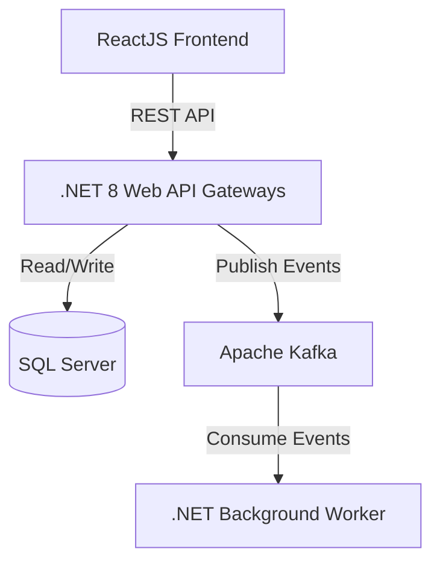
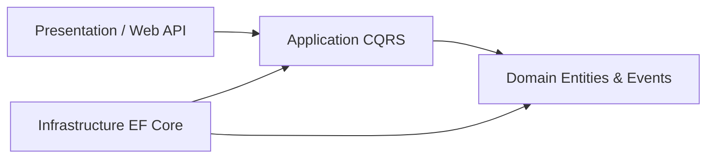
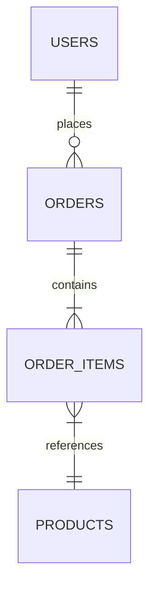

# Technical Design Document (TDD) Template
**Project Name:** [Insert Project Name]  
**Feature/Module:** [Insert Feature/Module Name]  
**Author:** [Insert Author Name]  
**Status:** [Draft / Under Review / Approved / Superseded]  
**Date:** [YYYY-MM-DD]  
**Target Release:** [Sprint X / Version Y]

---

## 1. Executive Summary & Context

### 1.1 Problem Statement
*Deskripsikan secara detail masalah bisnis atau teknis yang melatarbelakangi kebutuhan fitur ini. Mengapa fitur ini penting? Apa hambatan yang dirasakan oleh pengguna saat ini?*

### 1.2 Proposed Solution
*Ringkasan solusi teknis yang akan diimplementasikan. Bagaimana solusi ini menyelesaikan masalah di atas?*

### 1.3 Scope (In-Scope & Out-of-Scope)
*Tentukan batas-batas pekerjaan secara tegas.*

| In-Scope (Akan Dikerjakan) | Out-of-Scope (TIDAK Akan Dikerjakan) |
|-----------------------------|--------------------------------------|
| - Implementasi endpoint API | - Migrasi data historis tahun lalu   |
| - UI Form input profil      | - Integrasi dengan payment gateway X |

---

## 2. Architecture & High-Level Design

### 2.1 System Context
*Gambarkan interaksi antara sistem baru dengan sistem lama atau pihak ketiga (SaaS/External API).*



### 2.2 Component Level Architecture
*Bagaimana kode diorganisasikan dalam Clean Architecture layer (.NET 8)?*



---

## 3. Database Design

### 3.1 Entity Relationship Diagram (ERD)
*Tunjukkan perubahan skema database.*



### 3.2 Schema Updates & SQL Definition
*Tuliskan rancangan script DDL.*

```sql
-- Example Schema Creation
CREATE TABLE dbo.Orders (
    Id UNIQUEIDENTIFIER CONSTRAINT PK_Orders PRIMARY KEY DEFAULT NEWID(),
    UserId UNIQUEIDENTIFIER NOT NULL,
    OrderNumber NVARCHAR(50) NOT NULL CONSTRAINT UQ_Orders_Number UNIQUE,
    Status TINYINT NOT NULL CONSTRAINT DF_Orders_Status DEFAULT 1, -- 1: Pending, 2: Paid
    TotalAmount DECIMAL(18,2) NOT NULL,
    CreatedAt DATETIMEOFFSET NOT NULL CONSTRAINT DF_Orders_CreatedAt DEFAULT SYSDATETIMEOFFSET(),
    UpdatedAt DATETIMEOFFSET NULL
);

-- Indexing Strategy
CREATE NONCLUSTERED INDEX IX_Orders_UserId_Status 
ON dbo.Orders (UserId, Status) 
INCLUDE (TotalAmount, CreatedAt);
```

### 3.3 Data Migration Plan
*Bagaimana data yang sudah ada dimigrasi? Apakah ada query update massal yang perlu dijalankan dalam batch?*

---

## 4. API Design & Integration Contracts

### 4.1 REST API Endpoints

#### POST `/api/v1/orders`
* **Description:** Create a new order.
* **Authentication:** JWT Token required.
* **Request Payload (`application/json`):**
  ```json
  {
    "userId": "3fa85f64-5717-4562-b3fc-2c963f66afa6",
    "items": [
      {
        "productId": "41a238d2-43bb-4d69-b5fe-f094e24ef573",
        "quantity": 2
      }
    ]
  }
  ```
* **Response Payload (`201 Created`):**
  ```json
  {
    "orderId": "b1b01a61-9457-410a-8bf8-927915606d44",
    "orderNumber": "ORD-20260617-001",
    "status": "Pending",
    "totalAmount": 150000.00
  }
  ```

---

## 5. Security & Compliance

* **Authorization Strategy:** Gunakan RBAC atau Policy-based authorization (contoh: `[Authorize(Policy = "RequireAdminRole")]`).
* **Data Protection:** Apakah ada PII (Personally Identifiable Information) seperti nomor HP atau NIK yang perlu di-encrypt di level SQL Server?
* **Rate Limiting:** Terapkan rate limit pada endpoint sensitif (misal: maximum 10 requests per minute untuk checkout).

---

## 6. Performance & Scalability Considerations

* **Caching:** Manfaatkan Redis Distributed Cache untuk data katalog produk yang jarang berubah.
* **SQL Server Millions Record Strategy:**
  - Pastikan tidak terjadi *table scan* dengan menguji query execution plan.
  - Hindari penggunaan function dalam `WHERE` clause yang merusak kemampuan index seek (SARGability).
* **Asynchronous Processing:** Logic pengiriman email konfirmasi order harus dilempar ke queue dan diproses oleh Background Worker secara async agar response time API tetap di bawah 200ms.

---

## 7. Testing & Quality Assurance Plan

* **Unit Testing:**
  - Mock database context menggunakan NSubstitute / Moq.
  - Target coverage untuk domain logic: **min 90%**.
* **Integration Testing:**
  - Gunakan Testcontainers untuk membuat instance SQL Server ephemeral saat menjalankan testing di CI/CD.
* **Manual QA Scenario:**
  - Uji scenario input data kosong, email salah format, and concurrent checkout (race conditions).

---

## 8. Rollback & Deployment Strategy

* **Rollout Plan:**
  - Deploy script database terlebih dahulu (pastikan bersifat backward compatible).
  - Deploy backend API .NET 8.
  - Deploy ReactJS Frontend.
* **Rollback Plan:**
  - Jika terjadi failure, matikan server API baru dan rollback image Docker ke versi sebelumnya.
  - Jalankan script SQL Rollback untuk memulihkan skema database tanpa menghapus data transaksi yang sudah masuk.
