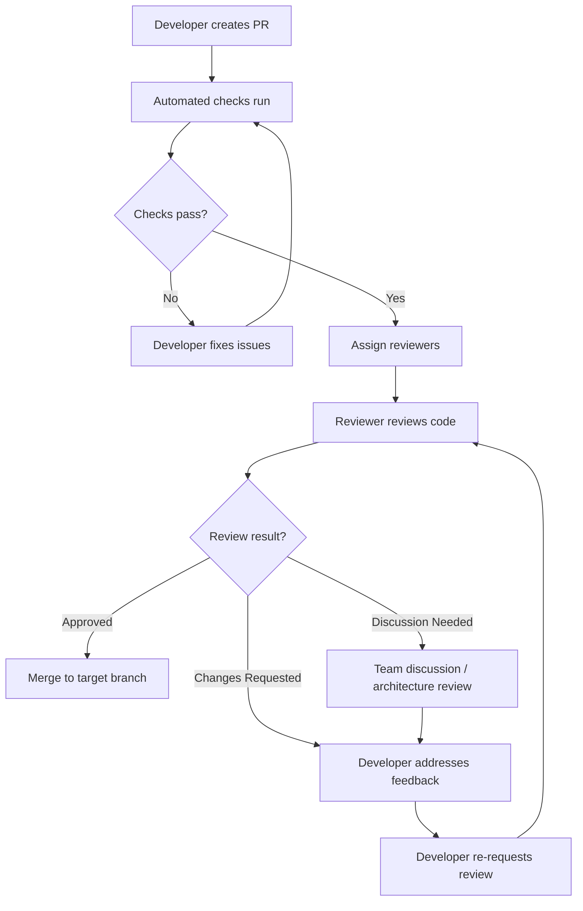

# 📋 Code Review Checklist — Engineering SOP

> **Versi**: 2.0  
> **Terakhir Diperbarui**: 2026-06-17  
> **Stack**: .NET 8 · ReactJS 18+ · TypeScript · SQL Server  
> **Pemilik**: Engineering Lead  

---

## Daftar Isi

- [1. Pendahuluan](#1-pendahuluan)
- [2. Tingkat Severity Review](#2-tingkat-severity-review)
- [3. General Code Review Checklist](#3-general-code-review-checklist)
- [4. .NET 8 Specific Checklist](#4-net-8-specific-checklist)
- [5. ReactJS Specific Checklist](#5-reactjs-specific-checklist)
- [6. Pull Request Template](#6-pull-request-template)
- [7. Automated Review dengan Kiro](#7-automated-review-dengan-kiro)
- [8. Review Workflow & SLA](#8-review-workflow--sla)
- [9. Panduan untuk Reviewer](#9-panduan-untuk-reviewer)
- [10. Panduan untuk Author](#10-panduan-untuk-author)

---

## 1. Pendahuluan

### 1.1 Tujuan Dokumen

Dokumen ini menetapkan standar komprehensif untuk proses code review di seluruh tim engineering. Code review bukan hanya tentang menemukan bug — ini adalah proses pembelajaran kolaboratif, penjaga kualitas, dan mekanisme transfer pengetahuan yang kritis.

### 1.2 Filosofi Code Review

Setiap code review harus menjawab pertanyaan-pertanyaan berikut:

1. **Correctness**: Apakah kode melakukan apa yang seharusnya?
2. **Clarity**: Apakah developer lain bisa memahami kode ini tanpa penjelasan tambahan?
3. **Consistency**: Apakah kode mengikuti konvensi yang sudah disepakati?
4. **Completeness**: Apakah semua edge case ditangani?
5. **Confidence**: Apakah kode ini aman untuk di-deploy ke production?

### 1.3 Prinsip Utama

> [!IMPORTANT]
> Code review harus bersifat **konstruktif**, **objektif**, dan **berfokus pada kode**, bukan pada orangnya. Gunakan bahasa yang inklusif dan berikan contoh solusi ketika memberikan kritik.

- **Hormati waktu reviewer** — PR yang kecil dan fokus lebih mudah di-review
- **Hormati feedback** — setiap komentar layak dipertimbangkan
- **Automate yang bisa diotomasi** — gunakan linter, formatter, dan static analysis
- **Dokumentasikan keputusan** — komentar review yang penting harus didokumentasikan

---

## 2. Tingkat Severity Review

Setiap temuan dalam code review harus dikategorikan berdasarkan tingkat severity berikut:

### 2.1 Tabel Severity

| Level | Label | Emoji | Deskripsi | Tindakan | Contoh |
|-------|-------|-------|-----------|----------|--------|
| **Critical** | `[CRITICAL]` | 🔴 | Bug, security vulnerability, data loss risk, production breaking | **WAJIB diperbaiki** sebelum merge | SQL injection, hardcoded credentials, race condition |
| **Major** | `[MAJOR]` | 🟠 | Pelanggaran arsitektur, performance issue signifikan, maintainability risk | **WAJIB diperbaiki** sebelum merge | Missing error handling, N+1 query, missing validation |
| **Minor** | `[MINOR]` | 🟡 | Style issue, minor improvement, best practice deviation | **SEBAIKNYA diperbaiki**, bisa di-track sebagai tech debt | Naming convention, missing XML docs, suboptimal LINQ |
| **Suggestion** | `[SUGGESTION]` | 🔵 | Nice-to-have, alternative approach, learning opportunity | **Opsional**, diskusi terbuka | Alternative design pattern, refactoring idea |
| **Praise** | `[PRAISE]` | 🟢 | Kode yang bagus, solusi yang elegan, improvement yang baik | **Tidak perlu tindakan**, apresiasi | Clean abstraction, clever optimization |

### 2.2 Contoh Format Komentar Review

```markdown
🔴 [CRITICAL] SQL Injection vulnerability
Parameter `userId` langsung dimasukkan ke dalam query string tanpa parameterization.

**Saat ini:**
```csharp
var query = $"SELECT * FROM Users WHERE Id = {userId}";
```

**Seharusnya:**
```csharp
var user = await _context.Users.FindAsync(userId);
```

Referensi: OWASP SQL Injection Prevention Cheat Sheet
```

### 2.3 Ambang Batas Approval

| Kondisi | Boleh di-Merge? |
|---------|----------------|
| Ada temuan `CRITICAL` | ❌ Tidak boleh |
| Ada temuan `MAJOR` | ❌ Tidak boleh |
| Hanya `MINOR` + `SUGGESTION` | ✅ Boleh (dengan tracking) |
| Hanya `SUGGESTION` + `PRAISE` | ✅ Boleh |

---

## 3. General Code Review Checklist

### 3.1 Readability & Naming Conventions

| # | Item | Severity | Keterangan |
|---|------|----------|------------|
| G-01 | Nama variabel deskriptif dan bermakna | Minor | `customerOrderCount` bukan `x` atau `cnt` |
| G-02 | Nama method menjelaskan apa yang dilakukan | Minor | `CalculateMonthlyRevenue()` bukan `Calc()` |
| G-03 | Nama class menggunakan noun/noun phrase | Minor | `OrderProcessor` bukan `ProcessOrder` |
| G-04 | Nama boolean dimulai dengan `is`, `has`, `can`, `should` | Minor | `isActive`, `hasPermission`, `canDelete` |
| G-05 | Tidak ada magic numbers/strings | Minor | Gunakan constants atau enums |
| G-06 | Komentar menjelaskan "mengapa", bukan "apa" | Minor | Kode yang baik self-documenting untuk "apa" |
| G-07 | Konsisten dengan bahasa (English untuk kode) | Minor | Tidak campuran Bahasa Indonesia di nama variabel |
| G-08 | Panjang method tidak lebih dari 30 baris | Minor | Jika lebih, pertimbangkan extraction |
| G-09 | Panjang class tidak lebih dari 300 baris | Minor | Jika lebih, kemungkinan SRP dilanggar |
| G-10 | Nesting depth tidak lebih dari 3 level | Minor | Gunakan early return / guard clauses |

```csharp
// ❌ BURUK — Magic number, nama tidak jelas
public decimal Calc(int t) 
{
    if (t == 1) return 0.1m;
    if (t == 2) return 0.15m;
    return 0.05m;
}

// ✅ BAIK — Self-documenting, enum-driven
public decimal CalculateDiscountRate(CustomerTier tier) => tier switch
{
    CustomerTier.Gold => 0.10m,
    CustomerTier.Platinum => 0.15m,
    CustomerTier.Standard => 0.05m,
    _ => throw new ArgumentOutOfRangeException(nameof(tier))
};
```

### 3.2 SOLID Principles Compliance

| # | Item | Severity | Keterangan |
|---|------|----------|------------|
| G-11 | **Single Responsibility**: Class hanya punya satu alasan untuk berubah | Major | Pisahkan concerns yang berbeda |
| G-12 | **Open/Closed**: Extensible tanpa modifikasi | Major | Gunakan abstractions dan strategy pattern |
| G-13 | **Liskov Substitution**: Derived class bisa menggantikan base class | Major | Tidak ada unexpected behavior di derived class |
| G-14 | **Interface Segregation**: Interface kecil dan focused | Minor | Tidak ada "fat interfaces" |
| G-15 | **Dependency Inversion**: Depend on abstractions | Major | Constructor injection, bukan `new` langsung |

```csharp
// ❌ BURUK — Melanggar SRP dan DIP
public class OrderService
{
    public void CreateOrder(OrderDto dto)
    {
        // Validasi langsung di sini
        if (string.IsNullOrEmpty(dto.CustomerName))
            throw new Exception("Name required");
            
        // Akses database langsung
        using var conn = new SqlConnection("...");
        conn.Open();
        // ... SQL langsung
        
        // Kirim email langsung
        var smtp = new SmtpClient("smtp.example.com");
        smtp.Send(new MailMessage(...));
    }
}

// ✅ BAIK — Mengikuti SOLID
public class OrderService : IOrderService
{
    private readonly IOrderRepository _orderRepository;
    private readonly IOrderValidator _validator;
    private readonly INotificationService _notificationService;
    private readonly ILogger<OrderService> _logger;

    public OrderService(
        IOrderRepository orderRepository,
        IOrderValidator validator,
        INotificationService notificationService,
        ILogger<OrderService> logger)
    {
        _orderRepository = orderRepository;
        _validator = validator;
        _notificationService = notificationService;
        _logger = logger;
    }

    public async Task<Result<Order>> CreateOrderAsync(
        CreateOrderCommand command, 
        CancellationToken ct = default)
    {
        var validationResult = await _validator.ValidateAsync(command, ct);
        if (!validationResult.IsValid)
            return Result<Order>.Failure(validationResult.Errors);

        var order = Order.Create(command);
        await _orderRepository.AddAsync(order, ct);
        
        await _notificationService.SendOrderConfirmationAsync(order, ct);
        
        _logger.LogInformation("Order {OrderId} created for customer {CustomerId}", 
            order.Id, order.CustomerId);

        return Result<Order>.Success(order);
    }
}
```

### 3.3 Design Patterns Usage

| # | Item | Severity | Keterangan |
|---|------|----------|------------|
| G-16 | Pattern yang digunakan sesuai dengan konteks masalah | Major | Tidak over-engineering |
| G-17 | Repository pattern digunakan untuk data access | Minor | Konsisten di seluruh codebase |
| G-18 | Strategy pattern untuk business rules yang bervariasi | Suggestion | Memudahkan extensibility |
| G-19 | Factory pattern untuk object creation yang kompleks | Minor | Encapsulate creation logic |
| G-20 | Mediator pattern (MediatR) untuk CQRS jika dipakai | Minor | Konsisten di semua commands/queries |

### 3.4 Error Handling

| # | Item | Severity | Keterangan |
|---|------|----------|------------|
| G-21 | Tidak ada empty `catch` blocks | Critical | Semua exception harus di-handle atau di-log |
| G-22 | Tidak catch `Exception` generik tanpa alasan | Major | Catch specific exceptions |
| G-23 | Error messages tidak mengekspos internal details | Critical | Jangan ekspos stack trace ke user |
| G-24 | Null checks dilakukan untuk parameter publik | Major | Gunakan `ArgumentNullException.ThrowIfNull()` |
| G-25 | Result pattern digunakan untuk expected failures | Minor | `Result<T>` bukan exceptions untuk business logic |
| G-26 | Exception tidak digunakan untuk flow control | Major | Exception untuk exceptional situations saja |

```csharp
// ❌ BURUK — Empty catch, generic exception, internal detail exposure
try
{
    var result = await ProcessPayment(order);
}
catch (Exception) { } // Silent failure!

// ❌ BURUK — Exception untuk flow control
try
{
    var user = await _repo.GetByIdAsync(id);
    return user;
}
catch (NotFoundException)
{
    return null; // Ini expected behavior, bukan exception
}

// ✅ BAIK — Specific handling, proper logging
try
{
    var result = await _paymentGateway.ProcessAsync(payment, ct);
    return Result<PaymentResult>.Success(result);
}
catch (PaymentDeclinedException ex)
{
    _logger.LogWarning(ex, "Payment declined for order {OrderId}: {Reason}", 
        order.Id, ex.DeclineReason);
    return Result<PaymentResult>.Failure($"Payment declined: {ex.DeclineReason}");
}
catch (PaymentGatewayException ex)
{
    _logger.LogError(ex, "Payment gateway error for order {OrderId}", order.Id);
    throw; // Re-throw unexpected gateway errors
}
```

### 3.5 Security Vulnerabilities

| # | Item | Severity | Keterangan |
|---|------|----------|------------|
| G-27 | Tidak ada hardcoded credentials/secrets | Critical | Gunakan Azure Key Vault / User Secrets |
| G-28 | Input selalu divalidasi dan di-sanitize | Critical | Server-side validation wajib |
| G-29 | Tidak ada SQL injection vulnerability | Critical | Gunakan parameterized queries / EF Core |
| G-30 | Tidak ada XSS vulnerability | Critical | Encode output, gunakan Content Security Policy |
| G-31 | Sensitive data tidak di-log | Critical | Mask PII, password, token |
| G-32 | Authentication/Authorization ter-enforce | Critical | `[Authorize]` pada semua protected endpoints |
| G-33 | HTTPS enforced | Critical | Redirect HTTP ke HTTPS |
| G-34 | File upload divalidasi (type, size, content) | Critical | Whitelist extensions, scan content |

### 3.6 Performance Considerations

| # | Item | Severity | Keterangan |
|---|------|----------|------------|
| G-35 | Tidak ada N+1 query problem | Major | Gunakan `.Include()` / `.ThenInclude()` |
| G-36 | Pagination diimplementasikan untuk list endpoints | Major | Tidak return seluruh dataset |
| G-37 | Caching dipertimbangkan untuk data yang jarang berubah | Minor | `IMemoryCache` atau `IDistributedCache` |
| G-38 | Async/await digunakan untuk I/O operations | Major | Jangan block thread pool |
| G-39 | `StringBuilder` digunakan untuk string concatenation dalam loop | Minor | Menghindari memory allocation berlebihan |
| G-40 | `IDisposable` resources di-dispose dengan benar | Major | `using` statement atau `using` declaration |

### 3.7 Code Duplication

| # | Item | Severity | Keterangan |
|---|------|----------|------------|
| G-41 | Tidak ada copy-paste code yang identik | Minor | Extract ke shared method/class |
| G-42 | Shared logic diextract ke base class atau utility | Minor | DRY principle |
| G-43 | Konfigurasi tidak diduplikasi antar environments | Minor | Gunakan hierarchical configuration |
| G-44 | Common validation rules diextract | Minor | Shared FluentValidation validators |

### 3.8 Complexity Metrics

| # | Item | Severity | Keterangan |
|---|------|----------|------------|
| G-45 | Cyclomatic complexity per method ≤ 10 | Major | Refactor jika lebih dari 10 |
| G-46 | Cognitive complexity per method ≤ 15 | Minor | Sulit dipahami jika terlalu tinggi |
| G-47 | Parameter count per method ≤ 5 | Minor | Gunakan parameter object / command |
| G-48 | Inheritance depth ≤ 3 | Minor | Prefer composition over inheritance |
| G-49 | Class coupling rendah | Minor | Minimize dependencies |
| G-50 | Lines of code per file ≤ 500 | Minor | Split jika terlalu besar |

---

## 4. .NET 8 Specific Checklist

### 4.1 Controller Design

| # | Item | Severity | Keterangan |
|---|------|----------|------------|
| N-01 | Controller hanya berisi routing logic | Major | Business logic di service layer |
| N-02 | `[ApiController]` attribute digunakan | Minor | Enable automatic model validation |
| N-03 | Route menggunakan `[Route("api/v{version}/[controller]")]` | Minor | Versioned API routes |
| N-04 | Action methods return `ActionResult<T>` atau `IActionResult` | Minor | Consistent return types |
| N-05 | `[ProducesResponseType]` attributes didefinisikan | Minor | Swagger documentation |
| N-06 | `CancellationToken` di-pass ke semua async operations | Major | Graceful request cancellation |
| N-07 | Tidak ada business logic di controller | Major | Controller = thin layer |
| N-08 | Model binding attributes digunakan dengan benar | Minor | `[FromBody]`, `[FromQuery]`, `[FromRoute]` |

```csharp
// ✅ Controller yang baik — Thin, focused, well-documented
[ApiController]
[ApiVersion("1.0")]
[Route("api/v{version:apiVersion}/orders")]
[Produces("application/json")]
[Authorize]
public sealed class OrdersController : ControllerBase
{
    private readonly ISender _mediator;
    private readonly ILogger<OrdersController> _logger;

    public OrdersController(ISender mediator, ILogger<OrdersController> logger)
    {
        _mediator = mediator;
        _logger = logger;
    }

    /// <summary>
    /// Membuat order baru
    /// </summary>
    /// <param name="command">Data order yang akan dibuat</param>
    /// <param name="ct">Cancellation token</param>
    /// <returns>Order yang baru dibuat</returns>
    [HttpPost]
    [ProducesResponseType(typeof(OrderResponse), StatusCodes.Status201Created)]
    [ProducesResponseType(typeof(ProblemDetails), StatusCodes.Status400BadRequest)]
    [ProducesResponseType(typeof(ProblemDetails), StatusCodes.Status409Conflict)]
    public async Task<IActionResult> CreateOrder(
        [FromBody] CreateOrderCommand command,
        CancellationToken ct)
    {
        var result = await _mediator.Send(command, ct);

        return result.Match(
            success: order => CreatedAtAction(
                nameof(GetOrder), 
                new { id = order.Id }, 
                order),
            failure: errors => Problem(
                statusCode: StatusCodes.Status400BadRequest,
                title: "Validation Error",
                detail: string.Join("; ", errors))
        );
    }

    [HttpGet("{id:guid}")]
    [ProducesResponseType(typeof(OrderResponse), StatusCodes.Status200OK)]
    [ProducesResponseType(StatusCodes.Status404NotFound)]
    public async Task<IActionResult> GetOrder(
        [FromRoute] Guid id, 
        CancellationToken ct)
    {
        var query = new GetOrderByIdQuery(id);
        var result = await _mediator.Send(query, ct);
        
        return result is null 
            ? NotFound() 
            : Ok(result);
    }

    [HttpGet]
    [ProducesResponseType(typeof(PagedResult<OrderResponse>), StatusCodes.Status200OK)]
    public async Task<IActionResult> GetOrders(
        [FromQuery] GetOrdersQuery query, 
        CancellationToken ct)
    {
        var result = await _mediator.Send(query, ct);
        return Ok(result);
    }
}
```

### 4.2 Service Layer Patterns

| # | Item | Severity | Keterangan |
|---|------|----------|------------|
| N-09 | Services diregistrasi sebagai interface | Major | `services.AddScoped<IOrderService, OrderService>()` |
| N-10 | Service lifetime sesuai (Scoped vs Transient vs Singleton) | Critical | Mismatch lifetime = memory leaks |
| N-11 | Services tidak depend pada HttpContext langsung | Major | Gunakan abstraction jika perlu |
| N-12 | Cross-cutting concerns di-handle via decorators/middleware | Minor | Logging, caching, validation |
| N-13 | Unit of Work pattern diimplementasikan jika multi-repo | Major | Konsistensi transaksi |

```csharp
// ✅ Service registration yang terstruktur
public static class ServiceCollectionExtensions
{
    public static IServiceCollection AddApplicationServices(
        this IServiceCollection services)
    {
        // Scoped — per-request lifetime (default untuk business services)
        services.AddScoped<IOrderService, OrderService>();
        services.AddScoped<ICustomerService, CustomerService>();
        services.AddScoped<IUnitOfWork, UnitOfWork>();
        
        // Transient — new instance setiap kali di-resolve
        services.AddTransient<IEmailTemplateRenderer, EmailTemplateRenderer>();
        services.AddTransient<IDateTimeProvider, DateTimeProvider>();
        
        // Singleton — shared across all requests
        services.AddSingleton<ICacheService, RedisCacheService>();
        services.AddSingleton<IFeatureFlagService, LaunchDarklyFeatureFlagService>();
        
        // MediatR handlers
        services.AddMediatR(cfg => {
            cfg.RegisterServicesFromAssembly(typeof(ServiceCollectionExtensions).Assembly);
            cfg.AddBehavior(typeof(IPipelineBehavior<,>), typeof(ValidationBehavior<,>));
            cfg.AddBehavior(typeof(IPipelineBehavior<,>), typeof(LoggingBehavior<,>));
            cfg.AddBehavior(typeof(IPipelineBehavior<,>), typeof(PerformanceBehavior<,>));
        });
        
        // FluentValidation
        services.AddValidatorsFromAssemblyContaining<CreateOrderCommandValidator>();
        
        return services;
    }
}
```

### 4.3 Repository Patterns

| # | Item | Severity | Keterangan |
|---|------|----------|------------|
| N-14 | Repository interface mendefinisikan kontrak yang jelas | Major | Tidak expose `IQueryable` keluar |
| N-15 | Generic repository untuk CRUD dasar | Minor | `IRepository<T>` base interface |
| N-16 | Specific repositories untuk query kompleks | Minor | `IOrderRepository : IRepository<Order>` |
| N-17 | Specification pattern untuk query reusable | Suggestion | Mengurangi duplikasi query logic |
| N-18 | No tracking queries untuk read-only scenarios | Major | `.AsNoTracking()` |

```csharp
// ✅ Repository pattern yang baik
public interface IRepository<T> where T : BaseEntity
{
    Task<T?> GetByIdAsync(Guid id, CancellationToken ct = default);
    Task<IReadOnlyList<T>> GetAllAsync(CancellationToken ct = default);
    Task<T> AddAsync(T entity, CancellationToken ct = default);
    Task UpdateAsync(T entity, CancellationToken ct = default);
    Task DeleteAsync(T entity, CancellationToken ct = default);
}

public interface IOrderRepository : IRepository<Order>
{
    Task<PagedResult<Order>> GetOrdersAsync(
        OrderFilter filter, 
        PaginationParams pagination,
        CancellationToken ct = default);
    
    Task<Order?> GetOrderWithItemsAsync(
        Guid orderId, 
        CancellationToken ct = default);
    
    Task<IReadOnlyList<Order>> GetOrdersByCustomerAsync(
        Guid customerId, 
        CancellationToken ct = default);
    
    Task<bool> HasPendingOrdersAsync(
        Guid customerId, 
        CancellationToken ct = default);
}

public class OrderRepository : Repository<Order>, IOrderRepository
{
    public OrderRepository(AppDbContext context) : base(context) { }

    public async Task<Order?> GetOrderWithItemsAsync(
        Guid orderId, 
        CancellationToken ct = default)
    {
        return await _context.Orders
            .Include(o => o.Items)
                .ThenInclude(i => i.Product)
            .Include(o => o.Customer)
            .AsSplitQuery() // Menghindari cartesian explosion
            .FirstOrDefaultAsync(o => o.Id == orderId, ct);
    }

    public async Task<PagedResult<Order>> GetOrdersAsync(
        OrderFilter filter, 
        PaginationParams pagination,
        CancellationToken ct = default)
    {
        var query = _context.Orders
            .AsNoTracking()
            .Where(o => !o.IsDeleted);

        // Apply filters
        if (filter.Status.HasValue)
            query = query.Where(o => o.Status == filter.Status.Value);
        
        if (filter.FromDate.HasValue)
            query = query.Where(o => o.CreatedAt >= filter.FromDate.Value);
        
        if (!string.IsNullOrWhiteSpace(filter.SearchTerm))
            query = query.Where(o => 
                o.OrderNumber.Contains(filter.SearchTerm) ||
                o.Customer.Name.Contains(filter.SearchTerm));

        var totalCount = await query.CountAsync(ct);
        
        var items = await query
            .OrderByDescending(o => o.CreatedAt)
            .Skip(pagination.Skip)
            .Take(pagination.PageSize)
            .Select(o => new OrderSummary
            {
                Id = o.Id,
                OrderNumber = o.OrderNumber,
                CustomerName = o.Customer.Name,
                Status = o.Status,
                TotalAmount = o.TotalAmount,
                CreatedAt = o.CreatedAt
            })
            .ToListAsync(ct);

        return new PagedResult<Order>(items, totalCount, pagination);
    }
}
```

### 4.4 Middleware

| # | Item | Severity | Keterangan |
|---|------|----------|------------|
| N-19 | Middleware pipeline order benar | Critical | Authentication → Authorization → etc. |
| N-20 | Global exception handler middleware ada | Major | Catch unhandled exceptions |
| N-21 | Request/Response logging middleware | Minor | Structured logging |
| N-22 | Correlation ID middleware | Minor | Distributed tracing |
| N-23 | Performance monitoring middleware | Minor | Request duration tracking |

```csharp
// ✅ Middleware pipeline order yang benar
var app = builder.Build();

// 1. Exception Handling (paling luar)
app.UseExceptionHandler("/error");

// 2. HSTS & HTTPS
if (!app.Environment.IsDevelopment())
{
    app.UseHsts();
}
app.UseHttpsRedirection();

// 3. Correlation ID (sebelum logging)
app.UseMiddleware<CorrelationIdMiddleware>();

// 4. Request Logging
app.UseSerilogRequestLogging(options =>
{
    options.EnrichDiagnosticContext = (diagnosticContext, httpContext) =>
    {
        diagnosticContext.Set("RequestHost", httpContext.Request.Host.Value);
        diagnosticContext.Set("UserAgent", httpContext.Request.Headers.UserAgent.ToString());
    };
});

// 5. Static Files
app.UseStaticFiles();

// 6. Routing
app.UseRouting();

// 7. CORS
app.UseCors("DefaultPolicy");

// 8. Authentication
app.UseAuthentication();

// 9. Authorization
app.UseAuthorization();

// 10. Rate Limiting
app.UseRateLimiter();

// 11. Response Caching
app.UseResponseCaching();

// 12. Custom Middleware
app.UseMiddleware<PerformanceMonitoringMiddleware>();

// 13. Endpoints
app.MapControllers();
app.MapHealthChecks("/health");
```

### 4.5 Dependency Injection

| # | Item | Severity | Keterangan |
|---|------|----------|------------|
| N-24 | Constructor injection digunakan (bukan property injection) | Major | Explicit dependencies |
| N-25 | Tidak ada service locator anti-pattern | Major | Jangan inject `IServiceProvider` |
| N-26 | Captive dependency dihindari | Critical | Singleton tidak boleh depend pada Scoped |
| N-27 | `IOptions<T>` pattern untuk konfigurasi | Minor | Type-safe configuration |
| N-28 | Keyed services digunakan untuk multiple implementations (.NET 8) | Suggestion | `[FromKeyedServices("key")]` |

```csharp
// ❌ BURUK — Service Locator anti-pattern
public class BadService
{
    private readonly IServiceProvider _provider;
    
    public BadService(IServiceProvider provider) 
    {
        _provider = provider;
    }
    
    public void DoWork()
    {
        // Hidden dependency! Tidak terlihat di constructor
        var repo = _provider.GetRequiredService<IOrderRepository>();
    }
}

// ✅ BAIK — Explicit constructor injection
public class GoodService : IGoodService
{
    private readonly IOrderRepository _orderRepo;
    private readonly IOptions<OrderSettings> _settings;
    
    public GoodService(
        IOrderRepository orderRepo,
        IOptions<OrderSettings> settings)
    {
        _orderRepo = orderRepo;
        _settings = settings;
    }
}

// ✅ .NET 8 — Keyed services untuk multiple implementations
builder.Services.AddKeyedScoped<INotificationSender, EmailSender>("email");
builder.Services.AddKeyedScoped<INotificationSender, SmsSender>("sms");
builder.Services.AddKeyedScoped<INotificationSender, PushNotificationSender>("push");

public class NotificationService
{
    public NotificationService(
        [FromKeyedServices("email")] INotificationSender emailSender,
        [FromKeyedServices("sms")] INotificationSender smsSender)
    {
        // ...
    }
}
```

### 4.6 Async/Await Patterns

| # | Item | Severity | Keterangan |
|---|------|----------|------------|
| N-29 | Semua I/O operations menggunakan async | Major | Database, HTTP, file system |
| N-30 | `ConfigureAwait(false)` di library code | Minor | Menghindari deadlock di library |
| N-31 | Tidak ada `async void` (kecuali event handler) | Critical | Exception tidak ter-catch |
| N-32 | `Task.WhenAll` untuk parallel operations yang independent | Major | Optimasi performance |
| N-33 | `CancellationToken` selalu di-propagate | Major | Graceful cancellation |
| N-34 | Tidak ada `.Result` atau `.Wait()` (sync-over-async) | Critical | Menyebabkan deadlock |
| N-35 | `ValueTask` untuk hot-path methods yang sering return synchronously | Suggestion | Mengurangi allocation |

```csharp
// ❌ BURUK — Sync-over-async, missing cancellation token
public OrderDto GetOrder(Guid id)
{
    var order = _repo.GetByIdAsync(id).Result; // DEADLOCK RISK!
    return MapToDto(order);
}

// ❌ BURUK — Async void
public async void ProcessOrder(Order order)
{
    await _service.ProcessAsync(order); // Exception hilang!
}

// ✅ BAIK — Proper async patterns
public async Task<OrderDto> GetOrderAsync(Guid id, CancellationToken ct)
{
    var order = await _repo.GetByIdAsync(id, ct);
    return MapToDto(order);
}

// ✅ BAIK — Parallel independent operations
public async Task<DashboardData> GetDashboardAsync(CancellationToken ct)
{
    // Fire semua queries secara parallel
    var ordersTask = _orderRepo.GetRecentOrdersAsync(ct);
    var statsTask = _statsService.GetDailyStatsAsync(ct);
    var alertsTask = _alertService.GetActiveAlertsAsync(ct);

    await Task.WhenAll(ordersTask, statsTask, alertsTask);

    return new DashboardData
    {
        RecentOrders = await ordersTask,
        DailyStats = await statsTask,
        ActiveAlerts = await alertsTask
    };
}
```

### 4.7 Exception Handling in .NET 8

| # | Item | Severity | Keterangan |
|---|------|----------|------------|
| N-36 | Global exception handler menggunakan `IExceptionHandler` (.NET 8) | Major | Centralized error handling |
| N-37 | Problem Details (RFC 7807) untuk error responses | Minor | Standar industry |
| N-38 | Custom exceptions extend `Exception` properly | Minor | Serializable, proper constructors |
| N-39 | Exception filters digunakan di ASP.NET Core | Minor | `IExceptionFilter` untuk specific handling |

```csharp
// ✅ .NET 8 IExceptionHandler
public class GlobalExceptionHandler : IExceptionHandler
{
    private readonly ILogger<GlobalExceptionHandler> _logger;

    public GlobalExceptionHandler(ILogger<GlobalExceptionHandler> logger)
    {
        _logger = logger;
    }

    public async ValueTask<bool> TryHandleAsync(
        HttpContext httpContext,
        Exception exception,
        CancellationToken ct)
    {
        var (statusCode, title, detail) = exception switch
        {
            ValidationException ex => (
                StatusCodes.Status400BadRequest, 
                "Validation Error",
                string.Join("; ", ex.Errors.Select(e => e.ErrorMessage))),
            
            NotFoundException ex => (
                StatusCodes.Status404NotFound, 
                "Resource Not Found", 
                ex.Message),
            
            ConflictException ex => (
                StatusCodes.Status409Conflict, 
                "Conflict", 
                ex.Message),
            
            UnauthorizedAccessException => (
                StatusCodes.Status403Forbidden, 
                "Forbidden", 
                "You do not have permission to access this resource."),
            
            _ => (
                StatusCodes.Status500InternalServerError, 
                "Internal Server Error", 
                "An unexpected error occurred.")
        };

        _logger.LogError(exception, 
            "Unhandled exception occurred. TraceId: {TraceId}", 
            httpContext.TraceIdentifier);

        var problemDetails = new ProblemDetails
        {
            Status = statusCode,
            Title = title,
            Detail = detail,
            Instance = httpContext.Request.Path,
            Extensions =
            {
                ["traceId"] = httpContext.TraceIdentifier,
                ["timestamp"] = DateTimeOffset.UtcNow
            }
        };

        httpContext.Response.StatusCode = statusCode;
        await httpContext.Response.WriteAsJsonAsync(problemDetails, ct);
        
        return true;
    }
}
```

### 4.8 Configuration Management

| # | Item | Severity | Keterangan |
|---|------|----------|------------|
| N-40 | Secrets tidak di-commit ke source control | Critical | Gunakan User Secrets / Key Vault |
| N-41 | `IOptions<T>` digunakan untuk typed configuration | Minor | Bukan `Configuration["key"]` langsung |
| N-42 | Configuration validation di startup | Major | `ValidateOnStart()` |
| N-43 | Environment-specific config terpisah | Minor | `appsettings.{Environment}.json` |

```csharp
// ✅ Typed configuration with validation
public class DatabaseSettings
{
    public const string SectionName = "Database";
    
    [Required]
    public string ConnectionString { get; init; } = string.Empty;
    
    [Range(1, 100)]
    public int MaxRetryCount { get; init; } = 3;
    
    [Range(1, 300)]
    public int CommandTimeoutSeconds { get; init; } = 30;
    
    public bool EnableSensitiveDataLogging { get; init; } = false;
}

// Registration with validation
builder.Services
    .AddOptions<DatabaseSettings>()
    .BindConfiguration(DatabaseSettings.SectionName)
    .ValidateDataAnnotations()
    .ValidateOnStart(); // Fail fast at startup!
```

### 4.9 Logging Practices

| # | Item | Severity | Keterangan |
|---|------|----------|------------|
| N-44 | Structured logging digunakan | Major | Template strings, bukan string interpolation |
| N-45 | Log level yang sesuai | Minor | Trace → Debug → Info → Warn → Error → Fatal |
| N-46 | Sensitive data tidak di-log | Critical | PII, passwords, tokens |
| N-47 | Correlation ID disertakan | Minor | Untuk distributed tracing |

```csharp
// ❌ BURUK — String interpolation, sensitive data
_logger.LogInformation($"User {user.Email} logged in with password {password}");

// ✅ BAIK — Structured logging, no sensitive data
_logger.LogInformation("User {UserId} authenticated successfully from {IpAddress}", 
    user.Id, httpContext.Connection.RemoteIpAddress);
```

### 4.10 Entity Framework Core Usage

| # | Item | Severity | Keterangan |
|---|------|----------|------------|
| N-48 | `.AsNoTracking()` untuk read-only queries | Major | Performance improvement |
| N-49 | `.AsSplitQuery()` untuk multiple includes | Major | Menghindari cartesian explosion |
| N-50 | Explicit loading vs eager loading sesuai konteks | Minor | Jangan over-include |
| N-51 | Migrations dilakukan via code, bukan manual | Minor | Repeatable deployments |
| N-52 | Concurrency token/RowVersion digunakan | Major | Optimistic concurrency |
| N-53 | Bulk operations menggunakan library (EFCore.BulkExtensions) | Suggestion | Performance untuk mass operations |
| N-54 | `ExecuteUpdateAsync` / `ExecuteDeleteAsync` untuk bulk (.NET 8) | Suggestion | Menghindari loading semua entities |

```csharp
// ✅ .NET 8 Bulk operations tanpa load entities
await _context.Products
    .Where(p => p.CategoryId == categoryId)
    .ExecuteUpdateAsync(s => s
        .SetProperty(p => p.IsActive, false)
        .SetProperty(p => p.UpdatedAt, DateTimeOffset.UtcNow), ct);

await _context.AuditLogs
    .Where(a => a.CreatedAt < cutoffDate)
    .ExecuteDeleteAsync(ct);
```

### 4.11 LINQ Best Practices

| # | Item | Severity | Keterangan |
|---|------|----------|------------|
| N-55 | Query dibentuk di database, bukan di memory | Major | Jangan `.ToList()` lalu filter |
| N-56 | `Any()` bukan `Count() > 0` untuk existence check | Minor | Performance |
| N-57 | Projection (`.Select()`) untuk data yang dibutuhkan saja | Major | Mengurangi data transfer |
| N-58 | `FirstOrDefault` bukan `SingleOrDefault` jika data bisa duplikat | Minor | Sesuai semantik |

### 4.12 API Response Patterns & Validation

| # | Item | Severity | Keterangan |
|---|------|----------|------------|
| N-59 | Consistent response wrapper | Minor | `ApiResponse<T>` pattern |
| N-60 | FluentValidation untuk complex validation | Minor | Separation of concerns |
| N-61 | Model state validation otomatis via `[ApiController]` | Minor | Jangan manual check `ModelState` |

---

## 5. ReactJS Specific Checklist

### 5.1 Component Design

| # | Item | Severity | Keterangan |
|---|------|----------|------------|
| R-01 | Functional components digunakan (bukan class) | Minor | Hooks-based design |
| R-02 | Component single responsibility | Major | Satu component = satu tugas |
| R-03 | Props ditype dengan TypeScript interface | Major | Type safety |
| R-04 | Default props didefinisikan | Minor | Defensive programming |
| R-05 | Component tidak lebih dari 200 baris | Minor | Split jika terlalu besar |
| R-06 | Presentation vs Container component dipisahkan | Minor | Separation of concerns |
| R-07 | Component export menggunakan named export | Minor | Lebih mudah di-refactor |
| R-08 | `React.forwardRef` digunakan jika expose ref | Minor | Proper ref forwarding |

```tsx
// ✅ Component yang baik — Typed, focused, well-structured
interface OrderListProps {
  customerId: string;
  initialFilter?: OrderFilter;
  onOrderSelect: (orderId: string) => void;
  className?: string;
}

export const OrderList: React.FC<OrderListProps> = ({
  customerId,
  initialFilter = { status: 'all' },
  onOrderSelect,
  className,
}) => {
  const { data, isLoading, error } = useOrders(customerId, initialFilter);
  
  if (isLoading) return <OrderListSkeleton />;
  if (error) return <ErrorDisplay error={error} />;
  if (!data?.items.length) return <EmptyState message="No orders found" />;

  return (
    <div className={cn('order-list', className)}>
      {data.items.map((order) => (
        <OrderListItem
          key={order.id}
          order={order}
          onClick={() => onOrderSelect(order.id)}
        />
      ))}
      <Pagination
        currentPage={data.currentPage}
        totalPages={data.totalPages}
      />
    </div>
  );
};
```

### 5.2 Hooks Usage

| # | Item | Severity | Keterangan |
|---|------|----------|------------|
| R-09 | Hooks rules diikuti (top-level, no conditionals) | Critical | React rules of hooks |
| R-10 | Custom hooks untuk reusable logic | Minor | `use` prefix |
| R-11 | `useEffect` dependency array benar dan lengkap | Critical | Stale closures jika salah |
| R-12 | `useEffect` cleanup function diimplementasikan | Major | Memory leaks prevention |
| R-13 | `useRef` untuk mutable values yang tidak trigger re-render | Minor | Timer IDs, DOM refs |
| R-14 | `useReducer` untuk complex state logic | Suggestion | Lebih predictable dari `useState` |

```tsx
// ✅ Custom hook yang baik — Reusable, typed, handles cleanup
function useDebounce<T>(value: T, delay: number): T {
  const [debouncedValue, setDebouncedValue] = useState<T>(value);

  useEffect(() => {
    const timer = setTimeout(() => setDebouncedValue(value), delay);
    return () => clearTimeout(timer); // ✅ Cleanup!
  }, [value, delay]);

  return debouncedValue;
}

// ✅ Data fetching hook with proper error handling
function useOrders(customerId: string, filter: OrderFilter) {
  return useQuery({
    queryKey: ['orders', customerId, filter],
    queryFn: ({ signal }) => orderApi.getOrders(customerId, filter, signal),
    staleTime: 5 * 60 * 1000, // 5 minutes
    placeholderData: keepPreviousData,
    enabled: !!customerId,
  });
}
```

### 5.3 State Management

| # | Item | Severity | Keterangan |
|---|------|----------|------------|
| R-15 | State diletakkan sedekat mungkin dengan penggunaannya | Major | Avoid unnecessary lifting |
| R-16 | Server state menggunakan React Query / TanStack Query | Major | Bukan manual `useEffect` + `useState` |
| R-17 | Global state minimal (Zustand / Context) | Minor | Hanya untuk truly global state |
| R-18 | Form state menggunakan React Hook Form | Minor | Performance + validation |
| R-19 | URL state untuk filter/pagination | Minor | Shareable & bookmarkable |
| R-20 | Derived state dihitung, bukan disimpan | Major | Menghindari state sync issues |

```tsx
// ❌ BURUK — Derived state disimpan sebagai state
const [items, setItems] = useState<Item[]>([]);
const [filteredItems, setFilteredItems] = useState<Item[]>([]);
const [totalPrice, setTotalPrice] = useState(0);

useEffect(() => {
  setFilteredItems(items.filter(i => i.active));
}, [items]);

useEffect(() => {
  setTotalPrice(filteredItems.reduce((sum, i) => sum + i.price, 0));
}, [filteredItems]);

// ✅ BAIK — Derived values dihitung langsung
const [items, setItems] = useState<Item[]>([]);
const filteredItems = useMemo(
  () => items.filter(i => i.active), 
  [items]
);
const totalPrice = useMemo(
  () => filteredItems.reduce((sum, i) => sum + i.price, 0),
  [filteredItems]
);
```

### 5.4 Performance Optimization

| # | Item | Severity | Keterangan |
|---|------|----------|------------|
| R-21 | `React.memo()` untuk components yang sering re-render | Minor | Shallow comparison |
| R-22 | `useMemo()` untuk expensive computations | Minor | Bukan untuk semua values |
| R-23 | `useCallback()` untuk callback props | Minor | Stable references |
| R-24 | Virtualized list untuk data besar (react-window) | Major | Jangan render 1000+ items |
| R-25 | Code splitting dengan `React.lazy()` + `Suspense` | Minor | Reduce initial bundle |
| R-26 | Image optimization (lazy loading, proper sizing) | Minor | Performance |
| R-27 | Tidak ada unnecessary re-renders | Major | React DevTools profiler |
| R-28 | Keys yang stable dan unique (bukan array index) | Major | Correct reconciliation |

```tsx
// ✅ Proper memoization
const MemoizedOrderRow = React.memo<OrderRowProps>(
  ({ order, onSelect }) => (
    <tr onClick={() => onSelect(order.id)}>
      <td>{order.orderNumber}</td>
      <td>{order.customerName}</td>
      <td>{formatCurrency(order.totalAmount)}</td>
    </tr>
  ),
  (prevProps, nextProps) => 
    prevProps.order.id === nextProps.order.id &&
    prevProps.order.status === nextProps.order.status
);

// ✅ Code splitting
const OrderDetails = React.lazy(() => import('./OrderDetails'));
const Analytics = React.lazy(() => import('./Analytics'));

function App() {
  return (
    <Suspense fallback={<PageSkeleton />}>
      <Routes>
        <Route path="/orders/:id" element={<OrderDetails />} />
        <Route path="/analytics" element={<Analytics />} />
      </Routes>
    </Suspense>
  );
}
```

### 5.5 Accessibility (a11y)

| # | Item | Severity | Keterangan |
|---|------|----------|------------|
| R-29 | Semantic HTML digunakan | Major | `<button>`, `<nav>`, `<main>`, `<article>` |
| R-30 | ARIA attributes ditambahkan jika diperlukan | Major | `aria-label`, `aria-describedby` |
| R-31 | Keyboard navigation berfungsi | Major | Tab order, Enter/Space activation |
| R-32 | Color contrast ratio memenuhi WCAG 2.1 AA | Minor | Minimum 4.5:1 untuk text |
| R-33 | Focus management untuk modal dan dialog | Major | Focus trap, restore focus |
| R-34 | Alt text untuk semua images | Minor | Deskriptif dan bermakna |
| R-35 | Form labels ter-associate dengan input | Major | `htmlFor` attribute |

### 5.6 Error Boundaries & Error Handling

| # | Item | Severity | Keterangan |
|---|------|----------|------------|
| R-36 | Error boundaries di setiap page/feature area | Major | Prevent full app crash |
| R-37 | Error boundaries menampilkan fallback UI yang informatif | Minor | Bukan blank screen |
| R-38 | API errors ditangani dan ditampilkan ke user | Major | Proper error messages |
| R-39 | Loading states ditampilkan | Minor | Skeleton / spinner |
| R-40 | Empty states ditangani | Minor | Meaningful empty message |

```tsx
// ✅ Error Boundary with proper fallback
class ErrorBoundary extends React.Component<
  { children: React.ReactNode; fallback?: React.ReactNode },
  { hasError: boolean; error: Error | null }
> {
  state = { hasError: false, error: null };

  static getDerivedStateFromError(error: Error) {
    return { hasError: true, error };
  }

  componentDidCatch(error: Error, errorInfo: React.ErrorInfo) {
    logErrorToService(error, errorInfo);
  }

  render() {
    if (this.state.hasError) {
      return this.props.fallback ?? (
        <ErrorFallback 
          error={this.state.error} 
          onRetry={() => this.setState({ hasError: false, error: null })}
        />
      );
    }
    return this.props.children;
  }
}
```

### 5.7 TypeScript Types

| # | Item | Severity | Keterangan |
|---|------|----------|------------|
| R-41 | Tidak ada `any` type | Major | Gunakan `unknown` jika perlu |
| R-42 | Interface untuk props, bukan inline types | Minor | Reusability |
| R-43 | API response types match backend DTOs | Major | Shared types atau codegen |
| R-44 | Discriminated unions untuk state machines | Suggestion | Type-safe state transitions |
| R-45 | Utility types digunakan (`Partial`, `Pick`, `Omit`) | Minor | DRY types |

### 5.8 CSS & Styling

| # | Item | Severity | Keterangan |
|---|------|----------|------------|
| R-46 | CSS modules atau Tailwind CSS (konsisten) | Minor | Scoped styling |
| R-47 | Responsive design diimplementasikan | Major | Mobile-first |
| R-48 | Dark mode support (jika diperlukan) | Minor | CSS custom properties |
| R-49 | Tidak ada inline styles (kecuali dynamic values) | Minor | Maintainability |

### 5.9 Testing

| # | Item | Severity | Keterangan |
|---|------|----------|------------|
| R-50 | Unit tests untuk custom hooks | Major | Testing Library |
| R-51 | Component tests untuk user interactions | Major | User-event based |
| R-52 | Integration tests untuk critical flows | Major | Full page render |
| R-53 | Mock API calls dengan MSW | Minor | Realistic testing |
| R-54 | Accessibility tests (jest-axe) | Minor | Automated a11y checks |

---

## 6. Pull Request Template

### 6.1 Template PR Standar

Gunakan template berikut untuk setiap Pull Request:

````markdown
## 📋 Deskripsi

<!-- Jelaskan perubahan yang dilakukan dan mengapa -->

### Tipe Perubahan
- [ ] 🐛 Bug fix (perubahan yang memperbaiki issue)
- [ ] ✨ New feature (perubahan yang menambah fitur baru)
- [ ] 💥 Breaking change (perubahan yang menyebabkan fitur lain tidak berfungsi)
- [ ] 📝 Documentation (perubahan pada dokumentasi saja)
- [ ] ♻️ Refactoring (perubahan kode yang tidak mengubah behavior)
- [ ] ⚡ Performance improvement
- [ ] 🔒 Security fix

### Ticket/Issue
- Jira: [PROJECT-XXX](#)
- Related PRs: #xxx

---

## 🔍 Checklist Review

### General
- [ ] Kode mengikuti coding conventions tim
- [ ] Self-review sudah dilakukan
- [ ] Komentar ditambahkan di bagian yang kompleks
- [ ] Tidak ada TODO/HACK/FIXME baru tanpa ticket
- [ ] Tidak ada hardcoded values/secrets

### Testing
- [ ] Unit tests ditambahkan/diupdate
- [ ] Integration tests ditambahkan/diupdate (jika relevan)
- [ ] Semua existing tests masih pass
- [ ] Edge cases sudah dicover
- [ ] Test coverage ≥ 80%

### .NET (jika applicable)
- [ ] Async/await patterns benar
- [ ] CancellationToken di-propagate
- [ ] Error handling sesuai standard
- [ ] Logging terstruktur ditambahkan
- [ ] FluentValidation rules ditambahkan
- [ ] Migration script (jika ada perubahan schema)

### React (jika applicable)
- [ ] TypeScript types lengkap (no `any`)
- [ ] Loading/Error/Empty states ditangani
- [ ] Accessibility (keyboard nav, ARIA labels)
- [ ] Performance (memo, lazy loading jika perlu)
- [ ] Responsive design

### Database (jika applicable)
- [ ] Query performance diverifikasi (execution plan)
- [ ] Index baru ditambahkan jika diperlukan
- [ ] Migration script idempotent
- [ ] Rollback script tersedia

### Security
- [ ] Input validation ada di server-side
- [ ] Authorization ter-enforce
- [ ] Sensitive data tidak di-log
- [ ] Tidak ada SQL injection risk

---

## 📸 Screenshots / Demo

<!-- Tambahkan screenshot atau recording jika ada perubahan UI -->

| Before | After |
|--------|-------|
| N/A | N/A |

---

## 🚀 Deployment Notes

<!-- Catatan khusus untuk deployment -->
- [ ] Tidak ada perubahan konfigurasi
- [ ] Environment variables baru: _[list]_
- [ ] Database migration diperlukan
- [ ] Cache perlu di-clear
- [ ] Feature flag: _[flag name]_

---

## 📝 Catatan Tambahan

<!-- Informasi lain yang perlu diketahui reviewer -->
````

### 6.2 Template PR untuk Hotfix

````markdown
## 🚨 HOTFIX

### Issue
**Severity**: Critical / High
**Impact**: [Jelaskan dampak ke production]
**Users Affected**: [Estimasi jumlah user terdampak]

### Root Cause
[Analisis root cause]

### Fix
[Jelaskan fix yang dilakukan]

### Verification
- [ ] Fix diverifikasi di staging
- [ ] Monitoring alert teratasi
- [ ] Rollback plan tersedia

### Post-Mortem
- [ ] Post-mortem scheduled: [tanggal]
- [ ] Preventive measures identified
````

---

## 7. Automated Review dengan Kiro

### 7.1 Kiro Steering Prompt untuk Code Review

Buat file `.kiro/steering/code-review.md` di repository:

```markdown
# Code Review Assistant

## Konteks
Kamu adalah code reviewer untuk proyek .NET 8 + ReactJS + SQL Server.
Gunakan checklist berikut saat melakukan review.

## Instruksi Review

### Saat mereview kode .NET:
1. Periksa apakah controller hanya berisi routing logic
2. Pastikan async/await digunakan untuk semua I/O operations
3. Verifikasi CancellationToken di-propagate ke semua async methods
4. Pastikan structured logging digunakan (bukan string interpolation)
5. Cek apakah FluentValidation digunakan untuk input validation
6. Verifikasi exception handling menggunakan IExceptionHandler pattern
7. Pastikan `.AsNoTracking()` digunakan untuk read-only queries
8. Cek apakah DI lifetime (Scoped/Transient/Singleton) sesuai

### Saat mereview kode React:
1. Pastikan TypeScript types lengkap (no `any`)
2. Verifikasi React Query digunakan untuk server state
3. Cek loading, error, dan empty states
4. Pastikan accessibility (semantic HTML, ARIA)
5. Verifikasi memoization hanya di tempat yang tepat
6. Cek apakah hooks rules diikuti

### Saat mereview SQL:
1. Periksa apakah ada index yang mendukung query
2. Pastikan parameterized queries digunakan
3. Verifikasi transaction handling yang benar
4. Cek potensi deadlock patterns

## Format Output
Gunakan format:
[SEVERITY] Description
- Current code: ...
- Suggested code: ...
- Reason: ...
```

### 7.2 Kiro Spec untuk Review Automation

Buat file `.kiro/specs/code-review-automation.md`:

```markdown
# Code Review Automation Spec

## Requirement
Otomasi proses code review untuk memastikan konsistensi dan kecepatan feedback.

## Tasks

### Task 1: Pre-Review Checks
- [ ] Jalankan linter (ESLint untuk React, dotnet format untuk .NET)
- [ ] Jalankan unit tests
- [ ] Periksa test coverage threshold (minimum 80%)
- [ ] Verifikasi tidak ada TODO tanpa ticket reference
- [ ] Scan untuk hardcoded secrets menggunakan pattern matching

### Task 2: Architecture Review
- [ ] Verifikasi layer separation (Controller → Service → Repository)
- [ ] Cek dependency direction (inner layers tidak depend pada outer)
- [ ] Pastikan interfaces digunakan untuk cross-layer communication
- [ ] Verifikasi naming conventions

### Task 3: Security Review
- [ ] Scan untuk SQL injection patterns
- [ ] Verifikasi [Authorize] attributes pada protected endpoints
- [ ] Cek input validation presence
- [ ] Scan untuk hardcoded credentials
- [ ] Verifikasi CORS configuration

### Task 4: Performance Review
- [ ] Detect N+1 query patterns
- [ ] Check for missing .AsNoTracking()
- [ ] Verify pagination on list endpoints
- [ ] Check for synchronous I/O in async context
```

### 7.3 Kiro Custom Prompt untuk Review Spesifik

```markdown
# Prompt: Review Pull Request

Review kode berikut berdasarkan checklist engineering team kami:

## Fokus Review
1. **Security**: Identifikasi semua potensi security vulnerability
2. **Performance**: Temukan bottleneck dan optimasi yang bisa dilakukan
3. **Maintainability**: Evaluasi apakah kode mudah dipahami dan di-maintain
4. **Testing**: Identifikasi test cases yang kurang

## Format Temuan
Untuk setiap temuan, berikan:
- Severity: [CRITICAL | MAJOR | MINOR | SUGGESTION]
- File dan line number
- Deskripsi masalah
- Kode saat ini
- Kode yang disarankan
- Alasan

## Tambahan
- Berikan juga PRAISE untuk kode yang bagus
- Ringkas temuan di akhir dalam bentuk tabel
- Berikan overall assessment: APPROVE / REQUEST CHANGES / NEEDS DISCUSSION
```

---

## 8. Review Workflow & SLA

### 8.1 Review Flow



### 8.2 SLA untuk Code Review

| Metrik | Target | Eskalasi |
|--------|--------|----------|
| Time to first review | ≤ 4 jam kerja | Reminder otomatis setelah 4 jam |
| Time to re-review | ≤ 2 jam kerja | Reminder otomatis setelah 2 jam |
| PR size (lines changed) | ≤ 400 baris | Wajib split jika > 400 baris |
| Number of reviewers | Minimum 1, disarankan 2 | Tech lead sebagai second reviewer untuk fitur baru |
| Max PR age | ≤ 3 hari kerja | Eskalasi ke tech lead |

### 8.3 Reviewer Assignment Rules

| Tipe Perubahan | Reviewer Minimum | Reviewer Disarankan |
|----------------|-------------------|---------------------|
| Bug fix (< 50 baris) | 1 peer | - |
| Feature (< 200 baris) | 1 peer | 1 senior |
| Feature (> 200 baris) | 1 peer + 1 senior | Tech lead |
| Architecture change | 1 senior + Tech lead | 2 seniors |
| Security-related | 1 peer + Security champion | Tech lead |
| Database migration | 1 DBA / DB specialist | Tech lead |
| Hotfix | 1 senior (async review OK) | - |

---

## 9. Panduan untuk Reviewer

### 9.1 Mindset

> [!TIP]
> **Reviewer yang baik** bertanya "mengapa", bukan hanya mengatakan "salah". Tujuan review adalah membantu author menulis kode yang lebih baik, bukan menunjukkan superioritas.

### 9.2 Step-by-Step Review Process

1. **Baca deskripsi PR** — Pahami konteks dan tujuan perubahan
2. **Jalankan kode** (jika perlu) — Untuk perubahan UI atau flow yang kompleks
3. **Review high-level** — Apakah pendekatan arsitekturnya benar?
4. **Review detail** — Periksa setiap file sesuai checklist
5. **Tulis komentar** — Berikan feedback yang konstruktif dengan contoh
6. **Berikan keputusan** — Approve, Request Changes, atau Comment

### 9.3 Template Komentar Review

```markdown
## 📊 Review Summary

### Findings
| Severity | Count |
|----------|-------|
| 🔴 Critical | 0 |
| 🟠 Major | 2 |
| 🟡 Minor | 3 |
| 🔵 Suggestion | 1 |
| 🟢 Praise | 2 |

### Overall Assessment
**Decision**: ✅ APPROVE / ❌ REQUEST CHANGES / 💬 NEEDS DISCUSSION

### Key Findings
1. [MAJOR] Missing error handling in PaymentService — line 45
2. [MAJOR] N+1 query detected in OrderRepository — line 89

### Positive Notes
1. [PRAISE] Clean separation of concerns in the new CustomerModule
2. [PRAISE] Excellent test coverage for edge cases
```

---

## 10. Panduan untuk Author

### 10.1 Sebelum Membuat PR

- [ ] Self-review kode sendiri menggunakan checklist ini
- [ ] Pastikan semua tests pass
- [ ] Update dokumentasi jika ada perubahan API
- [ ] Tulis deskripsi PR yang jelas dan lengkap
- [ ] Tambahkan screenshots untuk perubahan UI
- [ ] Link ke Jira ticket terkait

### 10.2 Merespons Feedback

| Situasi | Tindakan |
|---------|----------|
| Setuju dengan feedback | Perbaiki kode, reply "Done ✅" |
| Tidak setuju | Jelaskan alasan dengan referensi, diskusikan |
| Butuh klarifikasi | Tanya kembali, jangan assume |
| Feedback sudah addressed | Re-request review |
| Tidak akan fix saat ini | Buat ticket untuk tech debt, reply dengan ticket link |

### 10.3 Self-Review Checklist Cepat

Sebelum submit PR, jawab pertanyaan berikut:

1. ✅ Apakah saya akan memahami kode ini 6 bulan dari sekarang?
2. ✅ Apakah semua edge cases sudah ditangani?
3. ✅ Apakah error handling sudah lengkap?
4. ✅ Apakah ada security concern yang perlu diperhatikan?
5. ✅ Apakah perubahan ini bisa di-rollback jika bermasalah?
6. ✅ Apakah tests sudah mencakup happy path DAN error scenarios?
7. ✅ Apakah perubahan ini backward compatible?
8. ✅ Apakah logging sudah ditambahkan di titik-titik penting?

---

> [!IMPORTANT]
> Checklist ini adalah **living document**. Tim harus melakukan review dan update berkala (setiap quarter) untuk menambahkan item baru berdasarkan lessons learned dari production incidents dan code review findings.

---

**Dokumen ini terakhir diperbarui pada 2026-06-17 dan akan di-review ulang pada 2026-09-17.**
