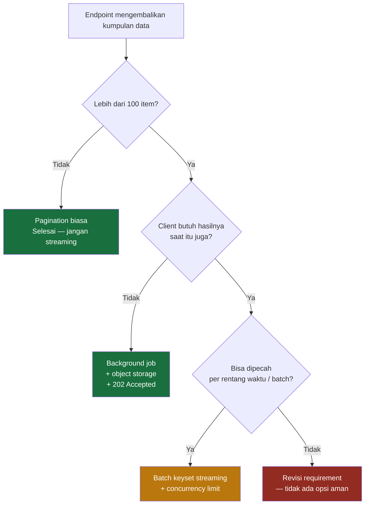

# API Performance Review Checklist (.NET 8 & EF Core)

Dokumen ini mendefinisikan panduan audit performa API untuk mendeteksi bottleneck I/O, pemborosan memori CPU, dan masalah konkurensi pada backend **.NET 8 Web API** yang terintegrasi dengan **SQL Server**.

---

## 1. N+1 Query Problem

### 1.1 Masalah (Problem)
N+1 query terjadi ketika aplikasi melakukan 1 query utama untuk mendapatkan daftar entitas, kemudian untuk setiap entitas yang dikembalikan, aplikasi menjalankan query tambahan untuk mengambil entitas relasinya. Hal ini memicu ratusan round-trip I/O ke SQL Server.

### 1.2 Contoh Kode & Rekomendasi
* **Bad (N+1 Query Triggered):**
  ```csharp
  // Mengambil orders, lalu melakukan loop untuk memuat Customer Name satu per satu
  var orders = await dbContext.Orders.ToListAsync(); 
  foreach (var order in orders)
  {
      // TRIGGER: EF Core memicu query ke DB secara terpisah untuk setiap baris!
      order.CustomerName = (await dbContext.Customers.FindAsync(order.CustomerId))?.Name;
  }
  ```
* **Good (Eager Loading with Include & Projection):**
  ```csharp
  // Mereduksi menjadi hanya 1 query tunggal menggunakan JOIN di SQL Server
  var orders = await dbContext.Orders
      .AsNoTracking()
      .Select(o => new OrderDto(
          o.Id,
          o.TotalAmount,
          o.Customer.Name // Otomatis diterjemahkan menjadi LEFT JOIN di SQL
      ))
      .ToListAsync(cancellationToken);
  ```

---

## 2. Multiple DbContext Calls in Single Transaction

### 2.1 Masalah (Problem)
Instansiasi atau pemanggilan `SaveChanges()` pada `DbContext` berkali-kali dalam satu request transaksi yang sama memicu pembukaan/penutupan koneksi database berulang kali (network latency overhead) serta risiko hilangnya transaksi atomik (rollback fail).

### 2.2 Contoh Kode & Rekomendasi
* **Bad (Multiple SaveChanges):**
  ```csharp
  public async Task CreateOrderAsync(Order order, OrderItem item)
  {
      dbContext.Orders.Add(order);
      await dbContext.SaveChangesAsync(); // Panggilan 1 (Koneksi dibuka & ditutup)
      
      item.OrderId = order.Id;
      dbContext.OrderItems.Add(item);
      await dbContext.SaveChangesAsync(); // Panggilan 2 (Koneksi dibuka & ditutup lagi!)
  }
  ```
* **Good (Unit of Work / Batch SaveChanges):**
  ```csharp
  public async Task CreateOrderAsync(Order order, List<OrderItem> items)
  {
      dbContext.Orders.Add(order);
      foreach(var item in items)
      {
          order.Items.Add(item);
      }
      
      // Dipanggil CUKUP 1 KALI di akhir proses transaksi. 
      // EF Core secara cerdas melakukan batching SQL insert dalam 1 round-trip.
      await dbContext.SaveChangesAsync(cancellationToken); 
  }
  ```

---

## 3. Asynchronous Issues (Thread Pool Starvation)

### 3.1 Masalah (Problem)
Pencampuran kode synchronous dan asynchronous (Sync-over-Async) seperti menggunakan `.Result`, `.GetAwaiter().GetResult()`, atau `.Wait()` akan mengunci thread utama (blocking) dan dengan cepat memicu *Thread Pool Starvation* yang mengakibatkan request API menjadi timeout secara massal.

### 3.2 Contoh Kode & Rekomendasi
* **Bad (Deadlock Risk / Blocking):**
  ```csharp
  [HttpGet("{id}")]
  public IActionResult GetOrder(Guid id)
  {
      // TRIGGER: Thread terkunci menunggu hasil async (.Result)
      var order = dbContext.Orders.FindAsync(id).Result; 
      return Ok(order);
  }
  ```
* **Good (Pure Async & Propagation):**
  ```csharp
  [HttpGet("{id}")]
  public async Task<IActionResult> GetOrder(Guid id, CancellationToken ct)
  {
      // Thread dibebaskan kembali ke thread pool selama menunggu DB merespon
      var order = await dbContext.Orders.FindAsync(new object[] { id }, ct); 
      return Ok(order);
  }
  ```

---

## 4. Unnecessary LINQ to Objects (Memory vs DB)

### 4.1 Masalah (Problem)
Memindahkan data mentah (raw data) dalam jumlah besar dari SQL Server ke memori server API (.NET RAM) dengan memicu pemanggilan `.ToList()` sebelum memfilter data menggunakan LINQ.

### 4.2 Contoh Kode & Rekomendasi
* **Bad (Filter di Memory):**
  ```csharp
  // Database mengirim JUTAAN record ke RAM server API, baru kemudian difilter
  var users = dbContext.Users.ToList() 
      .Where(u => u.RegisterDate > cutoffDate)
      .ToList();
  ```
* **Good (Filter di SQL Server - IQueryable):**
  ```csharp
  // EF Core mengeksekusi filter WHERE di SQL Server. Hanya data yang cocok yang dikirim ke API.
  var users = await dbContext.Users
      .Where(u => u.RegisterDate > cutoffDate)
      .AsNoTracking()
      .ToListAsync(cancellationToken);
  ```

---

## 5. JSON Serialization Bottlenecks

### 5.1 Masalah (Problem)
Proses serialisasi payload JSON berukuran besar ke respons HTTP HTTP menggunakan reflection runtime memakan resource CPU tinggi.

### 5.2 Contoh Kode & Rekomendasi
* **Rekomendasi Utama (.NET 8 Source Generators):**
  Gunakan **System.Text.Json Source Generator** untuk menghilangkan overhead reflection saat runtime (mengompilasi serialization code saat build time).

```csharp
using System.Text.Json.Serialization;

namespace App.Application.Contexts;

// Definisikan context serialisasi JSON secara statis
[JsonSerializable(typeof(List<OrderDto>))]
[JsonSerializable(typeof(OrderDto))]
public partial class OrderJsonContext : JsonSerializerContext
{
}

// Konfigurasi di Program.cs
// builder.Services.ConfigureHttpJsonOptions(options => {
//    options.SerializerOptions.TypeInfoResolverChain.Insert(0, OrderJsonContext.Default);
// });
```

---

## 6. Memory Allocation & Boxing Issues

### 6.1 Masalah (Problem)
Alokasi memori berlebih yang terus-menerus memicu kerja *Garbage Collector (GC)* berulang kali, yang memperlambat kinerja aplikasi (GC Pause). Masalah ini dipicu oleh manipulasi string berulang dalam loop (string immutable) atau boxing (tipe data value ke object).

### 6.2 Contoh Kode & Rekomendasi
* **Bad (Heavy Memory Allocation):**
  ```csharp
  // String concatenation di dalam loop membuat objek string baru di RAM setiap perulangan
  string logMessage = "";
  foreach (var item in orderItems)
  {
      logMessage += $"Item: {item.Name}, Qty: {item.Quantity}; "; 
  }
  ```
* **Good (StringBuilder Allocation Saver):**
  ```csharp
  // Menggunakan internal buffer terpusat untuk meminimalkan beban Garbage Collector
  var sb = new StringBuilder();
  foreach (var item in orderItems)
  {
      sb.Append("Item: ").Append(item.Name).Append(", Qty: ").Append(item.Quantity).Append("; ");
  }
  string logMessage = sb.ToString();
  ```
---

## 7. Budget & Ambang Performa

Section 1 sampai 6 mengidentifikasi bottleneck berdasarkan pola kode. Sebagian kasus — khususnya yang menyangkut ukuran alokasi dan volume data — tidak bisa diputuskan hanya dari pola, karena kode yang benar dan yang bermasalah terlihat sama. Section ini menetapkan ambang angka untuk kasus-kasus tersebut.

### 7.1 Tabel Budget

| # | Metrik | Ambang | Severity | Dasar Penetapan |
|---|--------|--------|----------|-----------------|
| P-01 | Working set memory (p95) | ≤ 70% dari container memory limit | Minor | Rasio, bukan angka absolut — menyisakan headroom untuk GC dan lonjakan traffic |
| P-02 | Buffer / array ≥ 85 KB | Wajib `ArrayPool<T>`, bukan `new byte[]` | Major | 85 KB adalah ambang Large Object Heap (LOH) di .NET |
| P-03 | Percentage of time in GC | ≤ 5% | Minor | Konvensi umum batas sehat untuk aplikasi server |
| P-04 | Gen 2 collection count | Tidak naik linear terhadap jumlah request | Minor | Indikator kebocoran referensi — pola, bukan nilai absolut |
| P-05 | Payload atau file > 10 MB | Wajib streaming (`IAsyncEnumerable<T>`, `FileStreamResult`) | Major | Selaras dengan batas upload 10 MB pada Rule 23 (`02-kiro-setup-and-configuration.md`) |
| P-06 | Result set query | Tidak ada query tanpa batas — maksimal 100 item per page | Major | Mencegah unbounded materialization ke memory |

Definisi severity mengikuti [Code Review Checklist](./08-template-code-review-checklist.md) section 2.1. Temuan `Major` wajib diperbaiki sebelum merge.

Dokumen ini adalah acuan dasar untuk banyak project, bukan konfigurasi satu sistem tertentu. Karena itu angka di tabel atas tidak semuanya bersifat sama:

| Metrik | Sifat | Penjelasan |
|---|---|---|
| P-02 (85 KB) | Universal | Ambang Large Object Heap di runtime .NET — sama di semua project, tidak perlu disesuaikan |
| P-05 (10 MB), P-06 (100 item) | Konvensi | Boleh berbeda kalau ada alasan teknis, tapi default ini aman untuk mayoritas kasus |
| P-01 (70%), P-03 (5%) | Bergantung lingkungan | Angka yang tepat berbeda antara container 512Mi dan 4Gi, dan antara aplikasi CRUD dengan aplikasi yang memang alokasi-berat |

> [!IMPORTANT]
> P-01 dan P-03 adalah **nilai default yang dibawa project baru sebagai titik awal**, bukan angka yang menunggu diperbaiki di dokumen ini. Setiap project mengukur sendiri dengan `dotnet-counters` atau APM, lalu mencatat hasilnya sebagai ADR di repo project tersebut memakai [Template ADR](./07-template-adr.md). Selama pengukuran belum dilakukan, keduanya tidak boleh dipakai menolak PR.

### 7.2 Alasan Pembagian Severity

Pembagiannya bukan berdasarkan tingkat bahaya, melainkan berdasarkan **apakah temuan bisa dibuktikan tanpa menjalankan aplikasi**.

| Kelompok | Metrik | Cara verifikasi |
|---|---|---|
| Major | P-02, P-05, P-06 | Terlihat langsung dari membaca kode — reviewer bisa menunjuk barisnya |
| Minor | P-01, P-03, P-04 | Butuh profiling runtime — tidak adil dijadikan blocker tanpa data |

Konsekuensinya: P-02, P-05, dan P-06 bisa ditegakkan sejak hari pertama sebuah project dibuat, sebelum ada satu pun metrik terkumpul. P-01, P-03, dan P-04 baru punya kekuatan setelah project memasang monitoring.

### 7.3 P-02 — Buffer di Atas Ambang LOH

Objek berukuran ≥ 85 KB dialokasikan langsung di Large Object Heap, yang tidak di-compact secara default dan memicu fragmentasi.

* **Bad (Alokasi LOH berulang):**
  ```csharp
  // Setiap pemanggilan mengalokasikan 100 KB baru di LOH
  public async Task<string> ReadDocumentAsync(Stream source, CancellationToken ct)
  {
      byte[] buffer = new byte[100_000];
      await source.ReadAsync(buffer, ct);
      return Encoding.UTF8.GetString(buffer);
  }
  ```
* **Good (Buffer dipinjam dari pool):**
  ```csharp
  // Buffer dikembalikan ke pool, tidak menambah tekanan LOH
  public async Task<string> ReadDocumentAsync(Stream source, CancellationToken ct)
  {
      byte[] buffer = ArrayPool<byte>.Shared.Rent(100_000);
      try
      {
          var bytesRead = await source.ReadAsync(buffer, ct);
          return Encoding.UTF8.GetString(buffer, 0, bytesRead);
      }
      finally
      {
          ArrayPool<byte>.Shared.Return(buffer);
      }
  }
  ```

### 7.4 P-05 — Streaming untuk Payload Besar

Melewati ambang 10 MB tidak otomatis berarti "pakai streaming". Pendekatannya ditentukan oleh volume sekaligus sifat kebutuhannya:

| Volume / Sifat | Pendekatan | Severity kalau dilanggar |
|---|---|---|
| ≤ 100 item per response | Pagination biasa (P-06) — jangan streaming | Major |
| Besar, tidak harus realtime | Background job + object storage, endpoint membalas `202 Accepted` | Major |
| Besar, harus selesai dalam satu request | Batch keyset **dan** concurrency limit — wajib keduanya | Major |

* **Bad (seluruh dataset di-buffer ke memory):**
  ```csharp
  // 500.000 baris dimaterialisasi lengkap sebelum satu byte pun terkirim
  var rows = await dbContext.Orders.AsNoTracking().ToListAsync(ct);
  return Ok(rows);
  ```
* **Belum cukup (streaming tanpa batas):**
  ```csharp
  // Memory sisi API turun, tapi tabel tetap discan penuh dan
  // koneksi database ditahan sampai byte terakhir terkirim ke client
  public IAsyncEnumerable<OrderDto> ExportAsync(CancellationToken ct) =>
      dbContext.Orders
          .AsNoTracking()
          .Select(o => new OrderDto(o.Id, o.TotalAmount, o.Customer.Name))
          .AsAsyncEnumerable();
  ```

Contoh kedua sering dianggap solusi, padahal ia hanya memindahkan masalah dari RAM ke connection pool. Implementasi yang benar untuk ketiga pendekatan di tabel ada di [section 8](#8-panduan-implementasi-streaming--export-besar).

> [!WARNING]
> Tiga hal yang wajib diketahui sebelum memilih streaming:
>
> - **Bergantung formatter.** MVC berhenti mem-buffer `IAsyncEnumerable<T>` sejak ASP.NET Core 6 untuk System.Text.Json. Dengan formatter Newtonsoft.Json, buffering tetap terjadi dan streaming tidak memberi manfaat apa pun.
> - **Koneksi tertahan.** Query tunggal yang di-stream menahan satu koneksi selama seluruh durasi response, termasuk saat menunggu client mengunduh.
> - **Error tidak bisa dikoreksi.** Begitu byte pertama terkirim, response sudah berstatus `200`. Exception di tengah stream tidak bisa lagi dikembalikan sebagai `500`.

### 7.5 Checklist Review

* [ ] Tidak ada `new byte[]` atau array ≥ 85 KB tanpa `ArrayPool<T>` (P-02)
* [ ] Endpoint export besar mengikuti tabel keputusan 7.4 — `AsAsyncEnumerable()` tanpa batas dan tanpa concurrency limit **tidak** dihitung memenuhi (P-05)
* [ ] Setiap query list punya batas eksplisit `Take()` atau pagination (P-06)
* [ ] Tidak ada konkatenasi string di dalam loop — gunakan `StringBuilder` (section 6)
* [ ] Metrik P-01, P-03, P-04 dipantau di dashboard, bukan diperiksa manual saat review

---

## 8. Panduan Implementasi Streaming & Export Besar

Section 7.4 menetapkan pendekatan mana yang boleh dipakai. Section ini menjelaskan cara membangunnya.

### 8.1 Memilih Pendekatan



Jalur hijau adalah pilihan utama. Batch keyset ditandai kuning karena tetap membebani koneksi, jadi hanya dipakai kalau background job benar-benar tidak memungkinkan.

### 8.2 Batch Keyset Streaming

Idenya: ganti satu query panjang menjadi banyak query pendek. Koneksi dipinjam dan dikembalikan ke pool per batch, bukan ditahan sampai baris terakhir.

```csharp
using System.Runtime.CompilerServices;

// OrderExportDto membawa kolom cursor (CreatedAt, Id), berbeda dari OrderDto di section 1
public async IAsyncEnumerable<OrderExportDto> ExportAsync(
    DateTimeOffset from,
    DateTimeOffset to,
    [EnumeratorCancellation] CancellationToken ct = default)
{
    const int BatchSize = 1_000;

    DateTimeOffset? lastCreatedAt = null;
    Guid? lastId = null;

    while (true)
    {
        var query = _dbContext.Orders
            .AsNoTracking()
            .Where(o => o.CreatedAt >= from && o.CreatedAt < to);

        // Keyset cursor — bukan Skip(), supaya tetap index seek di batch ke-10.000
        if (lastCreatedAt is not null)
        {
            query = query.Where(o =>
                o.CreatedAt > lastCreatedAt ||
                (o.CreatedAt == lastCreatedAt && o.Id > lastId));
        }

        // Koneksi dipinjam dan dilepas di dalam ToListAsync ini saja
        var batch = await query
            .OrderBy(o => o.CreatedAt).ThenBy(o => o.Id)
            .Take(BatchSize)
            .Select(o => new OrderExportDto(o.Id, o.CreatedAt, o.TotalAmount, o.Customer.Name))
            .ToListAsync(ct);

        if (batch.Count == 0)
            yield break;

        foreach (var row in batch)
            yield return row;

        lastCreatedAt = batch[^1].CreatedAt;
        lastId = batch[^1].Id;
    }
}
```

| Aspek | Hasil |
|---|---|
| Memory sisi API | O(`BatchSize`), bukan O(jumlah baris) |
| Durasi koneksi ditahan | Selama satu query 1.000 baris, bukan selama client mengunduh |
| Pola akses index | Index seek konsisten — keyset, bukan `Skip()` |

Dua detail yang mudah terlewat. `[EnumeratorCancellation]` wajib, tanpa itu `CancellationToken` dari ASP.NET Core tidak diteruskan ke query. Dan kolom cursor (`CreatedAt`, `Id`) harus ikut di-`Select()` ke DTO, karena nilainya dipakai untuk batch berikutnya.

### 8.3 Background Job untuk Export Besar

Pendekatan yang benar untuk export sesungguhnya. Request user tidak lagi menunggu, dan beban database pindah ke worker yang bisa dijadwalkan.

| Langkah | Tanggung jawab |
|---|---|
| 1 | Endpoint `POST /api/v1/orders/exports` memvalidasi rentang, membuat job, membalas `202 Accepted` + `exportId` |
| 2 | Worker (Hangfire) menjalankan batch keyset dari 8.2, menulis hasilnya ke object storage |
| 3 | Worker memperbarui status job: `Pending` → `Processing` → `Completed` / `Failed` |
| 4 | Client polling `GET /api/v1/orders/exports/{id}` untuk memantau status |
| 5 | Setelah `Completed`, client mengunduh via pre-signed URL berumur pendek |

Job wajib idempotent dan mendukung cancellation, mengikuti Rule 24 di [Kiro Setup & Configuration](./02-kiro-setup-and-configuration.md). File hasil export diberi masa retensi supaya storage tidak tumbuh tanpa batas.

### 8.4 Isolasi Connection Pool

Batch keyset memperpendek durasi koneksi, tapi tidak membatasi jumlah request yang berjalan bersamaan. Tanpa pembatas, 50 user yang menekan tombol export serentak tetap menghabiskan pool.

| Tindakan | Fungsi |
|---|---|
| Concurrency limiter pada endpoint export | Batasi jumlah export bersamaan via `Microsoft.AspNetCore.RateLimiting`. Mencegah kehabisan pool secara struktural |
| Connection string terpisah untuk export | Pool sendiri dengan `Application Name` berbeda — pola bulkhead, sehingga export yang melambat tidak mematikan jalur transaksional |
| Read replica untuk export | Beban baca pindah seluruhnya dari database OLTP |
| Batas waktu di level request | `CommandTimeout` hanya berlaku per operasi dan tidak membatasi total durasi streaming |

Dua yang pertama adalah minimum. Tanpa concurrency limiter, batch keyset pun masih bisa menghabiskan pool.

### 8.5 Tradeoff yang Harus Diterima

| Pendekatan | Yang dibayar |
|---|---|
| Pagination | Client harus melakukan banyak request |
| Background job | Kompleksitas tambahan: state job, storage, retensi, dan polling di sisi client |
| Batch keyset streaming | Hasil bukan snapshot konsisten — baris yang berubah antar batch bisa terlewat atau terbaca dua kali |
| Streaming apa pun | Status `200` sudah terkirim sebelum proses selesai, sehingga error di tengah jalan tidak bisa dikoreksi |

Kalau konsistensi snapshot bersifat mutlak, misalnya untuk laporan keuangan, batch keyset tidak memenuhi syarat. Gunakan background job dengan snapshot isolation.

### 8.6 Checklist Review

* [ ] Pendekatan yang dipilih sesuai tabel keputusan 7.4
* [ ] Streaming in-request memakai batch keyset, bukan satu query panjang
* [ ] Endpoint export punya concurrency limiter
* [ ] `[EnumeratorCancellation]` terpasang pada method `async IAsyncEnumerable<T>`
* [ ] Kolom cursor ikut di-`Select()` dan urutannya deterministik
* [ ] Background job idempotent, mendukung cancellation, dan file hasilnya punya masa retensi
* [ ] Kebutuhan konsistensi snapshot sudah dikonfirmasi sebelum memilih batch keyset
