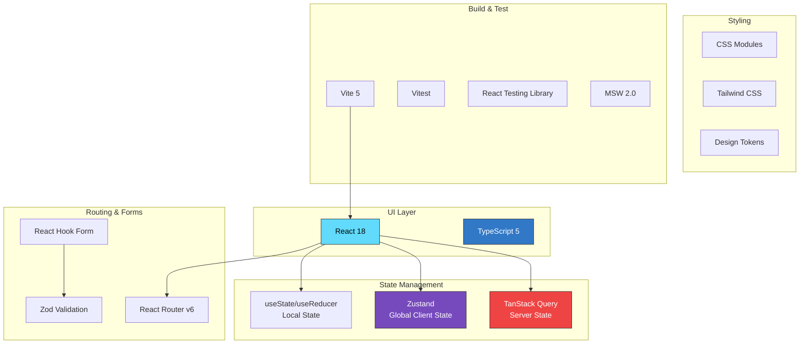
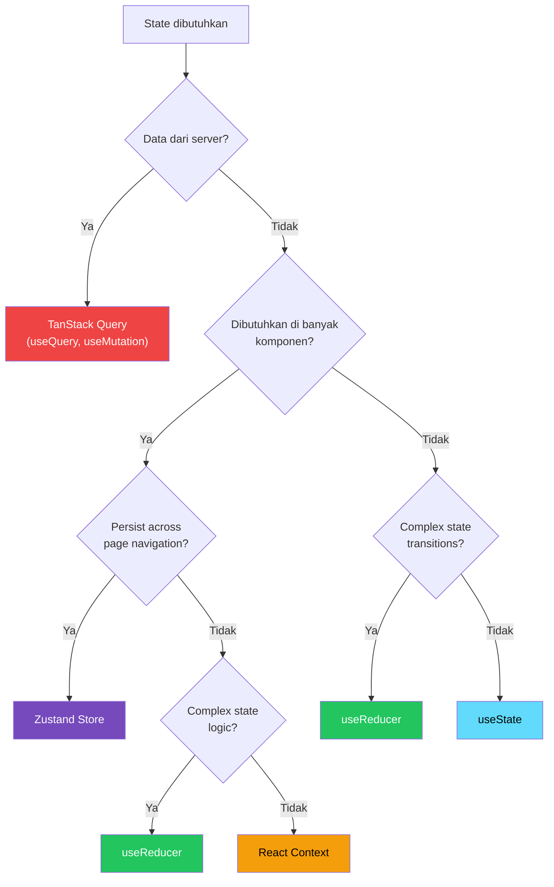

# ⚛️ Template: ReactJS Frontend Standard

> **Versi**: 2.0
> **Terakhir Diperbarui**: 2026-06-17
> **Stack**: React 18 · TypeScript 5 · Vite · TanStack Query · Zustand · React Hook Form · Zod
> **Maintainer**: Frontend Engineering Lead

---

## Daftar Isi

1. [Ringkasan & Prinsip](#1-ringkasan--prinsip)
2. [Struktur Proyek](#2-struktur-proyek)
3. [Standar Komponen](#3-standar-komponen)
4. [State Management](#4-state-management)
5. [Routing](#5-routing)
6. [Integrasi API](#6-integrasi-api)
7. [Forms & Validasi](#7-forms--validasi)
8. [Styling & Theming](#8-styling--theming)
9. [Testing](#9-testing)
10. [Performa & Optimisasi](#10-performa--optimisasi)
11. [Build & Deploy](#11-build--deploy)

---

## 1. Ringkasan & Prinsip

### 1.1 Prinsip Arsitektur Frontend

| Prinsip | Penjelasan |
|---------|-----------|
| **Feature-Based** | Kode diorganisasikan berdasarkan fitur/domain, bukan berdasarkan tipe file |
| **Colocation** | File yang saling terkait ditempatkan berdekatan dalam folder yang sama |
| **Single Responsibility** | Setiap komponen / hook memiliki satu tanggung jawab |
| **Composition over Inheritance** | Gunakan komposisi komponen dan hooks, hindari class-based patterns |
| **Type Safety** | TypeScript strict mode — no `any` allowed |
| **Server State ≠ Client State** | Server state dikelola TanStack Query, client state dikelola Zustand/useState |

### 1.2 Technology Stack Decision Matrix



> [!IMPORTANT]
> Setiap developer frontend WAJIB menggunakan TypeScript strict mode. File `.js` atau `.jsx` **tidak diizinkan** dalam codebase.

---

## 2. Struktur Proyek

### 2.1 Folder Structure Lengkap

```
src/
├── app/                                 # Application shell & providers
│   ├── App.tsx                          # Root component
│   ├── providers.tsx                    # All providers wrapped
│   └── routes.tsx                       # Route configuration
│
├── assets/                              # Static assets
│   ├── images/
│   ├── icons/
│   └── fonts/
│
├── components/                          # Shared/reusable components
│   ├── ui/                              # Atomic UI components
│   │   ├── Button/
│   │   │   ├── Button.tsx
│   │   │   ├── Button.module.css
│   │   │   ├── Button.test.tsx
│   │   │   └── index.ts
│   │   ├── Input/
│   │   ├── Modal/
│   │   ├── Table/
│   │   ├── Select/
│   │   ├── Toast/
│   │   ├── Spinner/
│   │   ├── Badge/
│   │   ├── Card/
│   │   ├── Pagination/
│   │   ├── Skeleton/
│   │   └── index.ts                     # Barrel export
│   ├── layout/                          # Layout components
│   │   ├── MainLayout/
│   │   │   ├── MainLayout.tsx
│   │   │   ├── Header.tsx
│   │   │   ├── Sidebar.tsx
│   │   │   ├── Footer.tsx
│   │   │   └── MainLayout.module.css
│   │   ├── AuthLayout/
│   │   └── ErrorLayout/
│   └── shared/                          # Shared composite components
│       ├── DataTable/
│       ├── ConfirmDialog/
│       ├── FileUpload/
│       ├── EmptyState/
│       ├── ErrorBoundary/
│       └── LoadingOverlay/
│
├── features/                            # Feature modules
│   ├── auth/
│   │   ├── api/                         # API calls for this feature
│   │   │   └── auth.api.ts
│   │   ├── components/                  # Feature-specific components
│   │   │   ├── LoginForm.tsx
│   │   │   ├── RegisterForm.tsx
│   │   │   └── ForgotPasswordForm.tsx
│   │   ├── hooks/                       # Feature-specific hooks
│   │   │   ├── useAuth.ts
│   │   │   └── useLogin.ts
│   │   ├── pages/                       # Route pages
│   │   │   ├── LoginPage.tsx
│   │   │   └── RegisterPage.tsx
│   │   ├── stores/                      # Feature-level stores
│   │   │   └── auth.store.ts
│   │   ├── types/                       # Feature-specific types
│   │   │   └── auth.types.ts
│   │   └── index.ts                     # Public API
│   │
│   ├── products/
│   │   ├── api/
│   │   │   └── products.api.ts
│   │   ├── components/
│   │   │   ├── ProductCard.tsx
│   │   │   ├── ProductForm.tsx
│   │   │   ├── ProductFilters.tsx
│   │   │   └── ProductTable.tsx
│   │   ├── hooks/
│   │   │   ├── useProducts.ts
│   │   │   ├── useProduct.ts
│   │   │   ├── useCreateProduct.ts
│   │   │   ├── useUpdateProduct.ts
│   │   │   └── useDeleteProduct.ts
│   │   ├── pages/
│   │   │   ├── ProductListPage.tsx
│   │   │   ├── ProductDetailPage.tsx
│   │   │   └── ProductFormPage.tsx
│   │   ├── types/
│   │   │   └── product.types.ts
│   │   ├── utils/
│   │   │   └── product.utils.ts
│   │   └── index.ts
│   │
│   ├── orders/
│   ├── customers/
│   └── dashboard/
│
├── hooks/                               # Global shared hooks
│   ├── useDebounce.ts
│   ├── useLocalStorage.ts
│   ├── useMediaQuery.ts
│   ├── usePagination.ts
│   ├── useClickOutside.ts
│   └── index.ts
│
├── lib/                                 # Library configurations
│   ├── api-client.ts                    # Axios instance & interceptors
│   ├── query-client.ts                  # TanStack Query client config
│   └── dayjs.ts                         # Date library config
│
├── stores/                              # Global stores (Zustand)
│   ├── ui.store.ts                      # UI state (sidebar, theme)
│   └── notification.store.ts            # Notification / toast state
│
├── styles/                              # Global styles
│   ├── globals.css
│   ├── variables.css                    # CSS custom properties / tokens
│   ├── animations.css
│   └── typography.css
│
├── types/                               # Global TypeScript types
│   ├── api.types.ts                     # API response types
│   ├── common.types.ts                  # Shared types
│   └── env.d.ts                         # Environment variable types
│
├── utils/                               # Utility functions
│   ├── cn.ts                            # Class name utility
│   ├── format.ts                        # Formatting (date, currency)
│   ├── storage.ts                       # localStorage/sessionStorage wrapper
│   ├── validation.ts                    # Shared validation schemas
│   └── constants.ts                     # App constants
│
├── main.tsx                             # Entry point
└── vite-env.d.ts
```

### 2.2 Penjelasan Struktur

| Folder | Tujuan |
|--------|--------|
| `app/` | Application shell — providers, routes, root component |
| `components/ui/` | Komponen atomik yang reusable di seluruh app (Button, Input, Modal) |
| `components/layout/` | Layout wrappers (header, sidebar, footer) |
| `components/shared/` | Komponen komposit yang digunakan di banyak fitur |
| `features/` | **Inti organisasi kode** — setiap fitur mandiri dengan api, hooks, pages, types |
| `hooks/` | Custom hooks global yang tidak spesifik ke satu fitur |
| `lib/` | Konfigurasi library pihak ketiga |
| `stores/` | Global state stores (hanya untuk state yang benar-benar global) |
| `types/` | Tipe TypeScript global |
| `utils/` | Pure functions yang bisa digunakan di mana saja |

> [!TIP]
> Aturan sederhana: jika sebuah file hanya digunakan di satu fitur, letakkan di folder fitur tersebut. Jika digunakan di 2+ fitur, naikkan ke `components/shared/` atau `hooks/`.

---

## 3. Standar Komponen

### 3.1 Pola Komponen Fungsional

```tsx
// components/ui/Button/Button.tsx
import { forwardRef, type ButtonHTMLAttributes, type ReactNode } from 'react';
import { cn } from '@/utils/cn';
import styles from './Button.module.css';

// ---- Types ----
type ButtonVariant = 'primary' | 'secondary' | 'outline' | 'ghost' | 'danger';
type ButtonSize = 'sm' | 'md' | 'lg';

interface ButtonProps extends ButtonHTMLAttributes<HTMLButtonElement> {
  /** Visual variant of the button */
  variant?: ButtonVariant;
  /** Size of the button */
  size?: ButtonSize;
  /** Show loading spinner */
  isLoading?: boolean;
  /** Icon to show before label */
  leftIcon?: ReactNode;
  /** Icon to show after label */
  rightIcon?: ReactNode;
  /** Full width button */
  fullWidth?: boolean;
}

// ---- Component ----
const Button = forwardRef<HTMLButtonElement, ButtonProps>(
  (
    {
      variant = 'primary',
      size = 'md',
      isLoading = false,
      leftIcon,
      rightIcon,
      fullWidth = false,
      disabled,
      className,
      children,
      ...props
    },
    ref
  ) => {
    return (
      <button
        ref={ref}
        className={cn(
          styles.button,
          styles[variant],
          styles[size],
          fullWidth && styles.fullWidth,
          isLoading && styles.loading,
          className
        )}
        disabled={disabled || isLoading}
        {...props}
      >
        {isLoading && <span className={styles.spinner} aria-hidden="true" />}
        {!isLoading && leftIcon && <span className={styles.icon}>{leftIcon}</span>}
        <span>{children}</span>
        {!isLoading && rightIcon && <span className={styles.icon}>{rightIcon}</span>}
      </button>
    );
  }
);

Button.displayName = 'Button';

export { Button, type ButtonProps };
```

```css
/* components/ui/Button/Button.module.css */
.button {
  display: inline-flex;
  align-items: center;
  justify-content: center;
  gap: 0.5rem;
  border-radius: var(--radius-md);
  font-weight: 500;
  cursor: pointer;
  transition: all 0.15s ease;
  border: 1px solid transparent;
  outline: none;
}

.button:focus-visible {
  outline: 2px solid var(--color-primary-500);
  outline-offset: 2px;
}

.button:disabled {
  opacity: 0.6;
  cursor: not-allowed;
}

/* Variants */
.primary {
  background-color: var(--color-primary-600);
  color: white;
}
.primary:hover:not(:disabled) {
  background-color: var(--color-primary-700);
}

.secondary {
  background-color: var(--color-gray-100);
  color: var(--color-gray-800);
}
.secondary:hover:not(:disabled) {
  background-color: var(--color-gray-200);
}

.outline {
  border-color: var(--color-gray-300);
  color: var(--color-gray-700);
  background: transparent;
}
.outline:hover:not(:disabled) {
  background-color: var(--color-gray-50);
}

.ghost {
  background: transparent;
  color: var(--color-gray-700);
}
.ghost:hover:not(:disabled) {
  background-color: var(--color-gray-100);
}

.danger {
  background-color: var(--color-red-600);
  color: white;
}
.danger:hover:not(:disabled) {
  background-color: var(--color-red-700);
}

/* Sizes */
.sm { padding: 0.375rem 0.75rem; font-size: 0.8125rem; }
.md { padding: 0.5rem 1rem; font-size: 0.875rem; }
.lg { padding: 0.625rem 1.25rem; font-size: 1rem; }

.fullWidth { width: 100%; }

.icon { display: flex; align-items: center; }

.spinner {
  width: 1em;
  height: 1em;
  border: 2px solid currentColor;
  border-top-color: transparent;
  border-radius: 50%;
  animation: spin 0.6s linear infinite;
}

.loading { position: relative; }

@keyframes spin {
  to { transform: rotate(360deg); }
}
```

### 3.2 Barrel Export Pattern

```ts
// components/ui/Button/index.ts
export { Button, type ButtonProps } from './Button';

// components/ui/index.ts — Barrel export untuk semua UI components
export { Button, type ButtonProps } from './Button';
export { Input, type InputProps } from './Input';
export { Modal, type ModalProps } from './Modal';
export { Select, type SelectProps } from './Select';
export { Table, type TableProps, type Column } from './Table';
export { Badge, type BadgeProps } from './Badge';
export { Card, type CardProps } from './Card';
export { Spinner } from './Spinner';
export { Skeleton } from './Skeleton';
export { Pagination, type PaginationProps } from './Pagination';
export { Toast } from './Toast';
```

### 3.3 Component Composition Pattern

```tsx
// components/ui/Card/Card.tsx
import { type HTMLAttributes, type ReactNode } from 'react';
import { cn } from '@/utils/cn';
import styles from './Card.module.css';

// ---- Compound Component Pattern ----
interface CardProps extends HTMLAttributes<HTMLDivElement> {
  children: ReactNode;
  padding?: 'none' | 'sm' | 'md' | 'lg';
  hoverable?: boolean;
}

function Card({ children, padding = 'md', hoverable = false, className, ...props }: CardProps) {
  return (
    <div
      className={cn(
        styles.card,
        styles[`padding-${padding}`],
        hoverable && styles.hoverable,
        className
      )}
      {...props}
    >
      {children}
    </div>
  );
}

function CardHeader({ children, className, ...props }: HTMLAttributes<HTMLDivElement>) {
  return (
    <div className={cn(styles.header, className)} {...props}>
      {children}
    </div>
  );
}

function CardBody({ children, className, ...props }: HTMLAttributes<HTMLDivElement>) {
  return (
    <div className={cn(styles.body, className)} {...props}>
      {children}
    </div>
  );
}

function CardFooter({ children, className, ...props }: HTMLAttributes<HTMLDivElement>) {
  return (
    <div className={cn(styles.footer, className)} {...props}>
      {children}
    </div>
  );
}

// Attach sub-components
Card.Header = CardHeader;
Card.Body = CardBody;
Card.Footer = CardFooter;

export { Card, type CardProps };
```

Contoh penggunaan:

```tsx
// Usage
<Card hoverable>
  <Card.Header>
    <h3>Judul Kartu</h3>
  </Card.Header>
  <Card.Body>
    <p>Konten kartu di sini.</p>
  </Card.Body>
  <Card.Footer>
    <Button size="sm">Aksi</Button>
  </Card.Footer>
</Card>
```

### 3.4 Custom Hooks Pattern

```tsx
// hooks/useDebounce.ts
import { useState, useEffect } from 'react';

/**
 * Debounce a value. Useful for search inputs.
 *
 * @example
 * const [search, setSearch] = useState('');
 * const debouncedSearch = useDebounce(search, 300);
 * // debouncedSearch updates 300ms after last search change
 */
export function useDebounce<T>(value: T, delay: number = 500): T {
  const [debouncedValue, setDebouncedValue] = useState<T>(value);

  useEffect(() => {
    const timer = setTimeout(() => setDebouncedValue(value), delay);
    return () => clearTimeout(timer);
  }, [value, delay]);

  return debouncedValue;
}
```

```tsx
// hooks/useLocalStorage.ts
import { useState, useCallback } from 'react';

/**
 * Persistent state in localStorage with type safety.
 */
export function useLocalStorage<T>(key: string, initialValue: T) {
  const [storedValue, setStoredValue] = useState<T>(() => {
    try {
      const item = window.localStorage.getItem(key);
      return item ? (JSON.parse(item) as T) : initialValue;
    } catch {
      return initialValue;
    }
  });

  const setValue = useCallback(
    (value: T | ((val: T) => T)) => {
      try {
        const valueToStore = value instanceof Function ? value(storedValue) : value;
        setStoredValue(valueToStore);
        window.localStorage.setItem(key, JSON.stringify(valueToStore));
      } catch (error) {
        console.error(`Error setting localStorage key "${key}":`, error);
      }
    },
    [key, storedValue]
  );

  const removeValue = useCallback(() => {
    try {
      window.localStorage.removeItem(key);
      setStoredValue(initialValue);
    } catch (error) {
      console.error(`Error removing localStorage key "${key}":`, error);
    }
  }, [key, initialValue]);

  return [storedValue, setValue, removeValue] as const;
}
```

```tsx
// hooks/useClickOutside.ts
import { useEffect, useRef, type RefObject } from 'react';

/**
 * Detect clicks outside a referenced element.
 * Useful for dropdowns, modals, popovers.
 */
export function useClickOutside<T extends HTMLElement>(
  handler: () => void
): RefObject<T | null> {
  const ref = useRef<T>(null);

  useEffect(() => {
    const listener = (event: MouseEvent | TouchEvent) => {
      if (!ref.current || ref.current.contains(event.target as Node)) {
        return;
      }
      handler();
    };

    document.addEventListener('mousedown', listener);
    document.addEventListener('touchstart', listener);

    return () => {
      document.removeEventListener('mousedown', listener);
      document.removeEventListener('touchstart', listener);
    };
  }, [handler]);

  return ref;
}
```

### 3.5 Error Boundary

```tsx
// components/shared/ErrorBoundary/ErrorBoundary.tsx
import { Component, type ErrorInfo, type ReactNode } from 'react';

interface ErrorBoundaryProps {
  children: ReactNode;
  fallback?: ReactNode;
  onError?: (error: Error, errorInfo: ErrorInfo) => void;
}

interface ErrorBoundaryState {
  hasError: boolean;
  error: Error | null;
}

class ErrorBoundary extends Component<ErrorBoundaryProps, ErrorBoundaryState> {
  state: ErrorBoundaryState = { hasError: false, error: null };

  static getDerivedStateFromError(error: Error): ErrorBoundaryState {
    return { hasError: true, error };
  }

  componentDidCatch(error: Error, errorInfo: ErrorInfo) {
    console.error('ErrorBoundary caught an error:', error, errorInfo);
    this.props.onError?.(error, errorInfo);
  }

  render() {
    if (this.state.hasError) {
      if (this.props.fallback) {
        return this.props.fallback;
      }

      return (
        <div style={{ padding: '2rem', textAlign: 'center' }}>
          <h2>Terjadi Kesalahan</h2>
          <p style={{ color: '#666' }}>
            {this.state.error?.message || 'Sesuatu yang tidak diharapkan terjadi.'}
          </p>
          <button
            onClick={() => this.setState({ hasError: false, error: null })}
            style={{
              marginTop: '1rem',
              padding: '0.5rem 1rem',
              borderRadius: '0.375rem',
              border: '1px solid #ddd',
              cursor: 'pointer',
            }}
          >
            Coba Lagi
          </button>
        </div>
      );
    }

    return this.props.children;
  }
}

export { ErrorBoundary };
```

### 3.6 Standardisasi Component Library (shadcn/ui)

Pola UI kita menggunakan **shadcn/ui** sebagai standar pustaka komponen. Berbeda dari UI library tradisional, shadcn/ui mendistribusikan kode komponen langsung ke dalam struktur folder lokal proyek kita di `src/components/ui/`.

#### 3.6.1 Prinsip Kerja & Cara Menambahkan Komponen
1. **Instalasi**: Menambahkan komponen baru dilakukan menggunakan CLI ke folder atomic `components/ui/`:
   ```bash
   npx shadcn-ui@latest add [nama-komponen]
   ```
2. **Kustomisasi**: Karena kode komponen ada di dalam folder lokal kita, tim diperbolehkan untuk memodifikasi struktur JSX atau menambahkan props baru sesuai dengan kebutuhan branding atau bisnis perusahaan.
3. **Pola Penggabungan Kelas Tailwind (`cn`)**: Selalu gunakan fungsi pembantu `cn` (class name merger) untuk menggabungkan class bawaan shadcn dengan class kustom dari luar:
   ```tsx
   import { cn } from "@/utils/cn";

   export interface MyComponentProps extends React.HTMLAttributes<HTMLDivElement> {}

   export function MyComponent({ className, ...props }: MyComponentProps) {
     return (
       <div className={cn("rounded-lg border bg-card p-4 text-card-foreground shadow-sm", className)} {...props} />
     );
   }
   ```

#### 3.6.2 Aturan Aksesibilitas (Radix Primitives)
Jangan menghapus pembungkus (*wrapper*) atau atribut ARIA dari Radix UI primitives di dalam komponen shadcn/ui. Primitive tersebut menjamin keyboard navigation, focus management, dan aksesibilitas screen reader bekerja secara *out-of-the-box*.

---

## 4. State Management

### 4.1 Decision Tree — Kapan Menggunakan Apa



> [!WARNING]
> **JANGAN** gunakan Zustand atau Context untuk menyimpan data server (API responses). Gunakan TanStack Query — ia menangani caching, refetching, background updates, dan stale data secara otomatis.

### 4.2 TanStack Query — Server State

```tsx
// lib/query-client.ts
import { QueryClient } from '@tanstack/react-query';

export const queryClient = new QueryClient({
  defaultOptions: {
    queries: {
      staleTime: 5 * 60 * 1000,       // Data dianggap fresh selama 5 menit
      gcTime: 10 * 60 * 1000,          // Cache disimpan selama 10 menit
      retry: 2,                         // Retry 2x saat gagal
      refetchOnWindowFocus: false,      // Tidak refetch saat focus window
      refetchOnReconnect: true,         // Refetch saat koneksi kembali
    },
    mutations: {
      retry: 0,                         // Mutations tidak di-retry
    },
  },
});
```

```tsx
// features/products/hooks/useProducts.ts
import { useQuery, keepPreviousData } from '@tanstack/react-query';
import { productsApi } from '../api/products.api';
import type { ProductFilters } from '../types/product.types';

/**
 * Query key factory — memastikan konsistensi key di seluruh app.
 */
export const productKeys = {
  all: ['products'] as const,
  lists: () => [...productKeys.all, 'list'] as const,
  list: (filters: ProductFilters) => [...productKeys.lists(), filters] as const,
  details: () => [...productKeys.all, 'detail'] as const,
  detail: (id: string) => [...productKeys.details(), id] as const,
};

/**
 * Hook untuk mengambil daftar produk dengan pagination & filter.
 */
export function useProducts(filters: ProductFilters) {
  return useQuery({
    queryKey: productKeys.list(filters),
    queryFn: () => productsApi.getProducts(filters),
    placeholderData: keepPreviousData, // Tampilkan data lama saat pindah halaman
  });
}

/**
 * Hook untuk mengambil detail produk.
 */
export function useProduct(id: string) {
  return useQuery({
    queryKey: productKeys.detail(id),
    queryFn: () => productsApi.getProduct(id),
    enabled: !!id, // Hanya fetch jika ID tersedia
  });
}
```

```tsx
// features/products/hooks/useCreateProduct.ts
import { useMutation, useQueryClient } from '@tanstack/react-query';
import { productsApi } from '../api/products.api';
import { productKeys } from './useProducts';
import { useNotificationStore } from '@/stores/notification.store';
import type { CreateProductRequest } from '../types/product.types';

export function useCreateProduct() {
  const queryClient = useQueryClient();
  const { addNotification } = useNotificationStore();

  return useMutation({
    mutationFn: (data: CreateProductRequest) => productsApi.createProduct(data),

    onSuccess: (newProduct) => {
      // Invalidate product lists so they refetch
      queryClient.invalidateQueries({ queryKey: productKeys.lists() });

      addNotification({
        type: 'success',
        title: 'Produk Berhasil Dibuat',
        message: `Produk "${newProduct.name}" telah berhasil ditambahkan.`,
      });
    },

    onError: (error: Error) => {
      addNotification({
        type: 'error',
        title: 'Gagal Membuat Produk',
        message: error.message,
      });
    },
  });
}
```

```tsx
// features/products/hooks/useUpdateProduct.ts
import { useMutation, useQueryClient } from '@tanstack/react-query';
import { productsApi } from '../api/products.api';
import { productKeys } from './useProducts';
import type { UpdateProductRequest } from '../types/product.types';

export function useUpdateProduct() {
  const queryClient = useQueryClient();

  return useMutation({
    mutationFn: ({ id, data }: { id: string; data: UpdateProductRequest }) =>
      productsApi.updateProduct(id, data),

    // Optimistic update
    onMutate: async ({ id, data }) => {
      // Cancel outgoing refetches
      await queryClient.cancelQueries({ queryKey: productKeys.detail(id) });

      // Snapshot previous value
      const previousProduct = queryClient.getQueryData(productKeys.detail(id));

      // Optimistically update
      queryClient.setQueryData(productKeys.detail(id), (old: any) => ({
        ...old,
        ...data,
      }));

      return { previousProduct };
    },

    // Rollback on error
    onError: (_err, { id }, context) => {
      if (context?.previousProduct) {
        queryClient.setQueryData(productKeys.detail(id), context.previousProduct);
      }
    },

    // Refetch after success or error
    onSettled: (_data, _error, { id }) => {
      queryClient.invalidateQueries({ queryKey: productKeys.detail(id) });
      queryClient.invalidateQueries({ queryKey: productKeys.lists() });
    },
  });
}
```

```tsx
// features/products/hooks/useDeleteProduct.ts
import { useMutation, useQueryClient } from '@tanstack/react-query';
import { productsApi } from '../api/products.api';
import { productKeys } from './useProducts';

export function useDeleteProduct() {
  const queryClient = useQueryClient();

  return useMutation({
    mutationFn: (id: string) => productsApi.deleteProduct(id),

    onSuccess: () => {
      queryClient.invalidateQueries({ queryKey: productKeys.lists() });
    },
  });
}
```

### 4.3 Zustand — Global Client State

```tsx
// stores/ui.store.ts
import { create } from 'zustand';
import { persist } from 'zustand/middleware';

interface UiState {
  // State
  sidebarOpen: boolean;
  theme: 'light' | 'dark' | 'system';

  // Actions
  toggleSidebar: () => void;
  setSidebarOpen: (open: boolean) => void;
  setTheme: (theme: 'light' | 'dark' | 'system') => void;
}

export const useUiStore = create<UiState>()(
  persist(
    (set) => ({
      sidebarOpen: true,
      theme: 'system',

      toggleSidebar: () => set((state) => ({ sidebarOpen: !state.sidebarOpen })),
      setSidebarOpen: (open) => set({ sidebarOpen: open }),
      setTheme: (theme) => set({ theme }),
    }),
    {
      name: 'ui-storage', // localStorage key
      partialize: (state) => ({
        sidebarOpen: state.sidebarOpen,
        theme: state.theme,
      }),
    }
  )
);
```

```tsx
// stores/notification.store.ts
import { create } from 'zustand';

interface Notification {
  id: string;
  type: 'success' | 'error' | 'warning' | 'info';
  title: string;
  message?: string;
  duration?: number;
}

interface NotificationState {
  notifications: Notification[];
  addNotification: (notification: Omit<Notification, 'id'>) => void;
  removeNotification: (id: string) => void;
  clearAll: () => void;
}

export const useNotificationStore = create<NotificationState>((set) => ({
  notifications: [],

  addNotification: (notification) => {
    const id = crypto.randomUUID();
    const duration = notification.duration ?? 5000;

    set((state) => ({
      notifications: [...state.notifications, { ...notification, id }],
    }));

    // Auto-remove after duration
    if (duration > 0) {
      setTimeout(() => {
        set((state) => ({
          notifications: state.notifications.filter((n) => n.id !== id),
        }));
      }, duration);
    }
  },

  removeNotification: (id) =>
    set((state) => ({
      notifications: state.notifications.filter((n) => n.id !== id),
    })),

  clearAll: () => set({ notifications: [] }),
}));

// ---- Slices Pattern Example ----
// Menggunakan Slices Pattern untuk mengelompokkan store yang besar
interface UserSlice {
  username: string;
  setUsername: (name: string) => void;
}

interface SettingsSlice {
  theme: 'light' | 'dark';
  setTheme: (theme: 'light' | 'dark') => void;
}

// Menggabungkan beberapa slice dalam satu store
export const useAppStore = create<UserSlice & SettingsSlice>((set) => ({
  username: '',
  theme: 'light',
  setUsername: (name) => set({ username: name }),
  setTheme: (theme) => set({ theme }),
}));

// ---- Auth Store (JWT & Refresh Token) Boilerplate ----
// stores/auth.store.ts
interface AuthState {
  accessToken: string | null;
  refreshToken: string | null;
  isAuthenticated: boolean;
  setTokens: (accessToken: string, refreshToken: string) => void;
  logout: () => void;
}

export const useAuthStore = create<AuthState>()(
  persist(
    (set) => ({
      accessToken: null,
      refreshToken: null,
      isAuthenticated: false,
      setTokens: (accessToken, refreshToken) =>
        set({ accessToken, refreshToken, isAuthenticated: true }),
      logout: () =>
        set({ accessToken: null, refreshToken: null, isAuthenticated: false }),
    }),
    {
      name: 'auth-storage',
      partialize: (state) => ({
        accessToken: state.accessToken,
        refreshToken: state.refreshToken,
        isAuthenticated: state.isAuthenticated,
      }),
    }
  )
);
```

### 4.4 Local State — useState & useReducer

```tsx
// Contoh useReducer untuk complex form state
import { useReducer } from 'react';

// ---- Types ----
interface FilterState {
  search: string;
  category: string;
  status: string;
  priceRange: { min: number; max: number };
  sortBy: string;
  sortOrder: 'asc' | 'desc';
  page: number;
  pageSize: number;
}

type FilterAction =
  | { type: 'SET_SEARCH'; payload: string }
  | { type: 'SET_CATEGORY'; payload: string }
  | { type: 'SET_STATUS'; payload: string }
  | { type: 'SET_PRICE_RANGE'; payload: { min: number; max: number } }
  | { type: 'SET_SORT'; payload: { sortBy: string; sortOrder: 'asc' | 'desc' } }
  | { type: 'SET_PAGE'; payload: number }
  | { type: 'SET_PAGE_SIZE'; payload: number }
  | { type: 'RESET' };

// ---- Reducer ----
const initialState: FilterState = {
  search: '',
  category: '',
  status: '',
  priceRange: { min: 0, max: 999999999 },
  sortBy: 'createdAt',
  sortOrder: 'desc',
  page: 1,
  pageSize: 10,
};

function filterReducer(state: FilterState, action: FilterAction): FilterState {
  switch (action.type) {
    case 'SET_SEARCH':
      return { ...state, search: action.payload, page: 1 }; // Reset page on search
    case 'SET_CATEGORY':
      return { ...state, category: action.payload, page: 1 };
    case 'SET_STATUS':
      return { ...state, status: action.payload, page: 1 };
    case 'SET_PRICE_RANGE':
      return { ...state, priceRange: action.payload, page: 1 };
    case 'SET_SORT':
      return { ...state, ...action.payload };
    case 'SET_PAGE':
      return { ...state, page: action.payload };
    case 'SET_PAGE_SIZE':
      return { ...state, pageSize: action.payload, page: 1 };
    case 'RESET':
      return initialState;
    default:
      return state;
  }
}

// ---- Hook ----
export function useProductFilters() {
  const [filters, dispatch] = useReducer(filterReducer, initialState);

  return {
    filters,
    setSearch: (search: string) => dispatch({ type: 'SET_SEARCH', payload: search }),
    setCategory: (category: string) => dispatch({ type: 'SET_CATEGORY', payload: category }),
    setStatus: (status: string) => dispatch({ type: 'SET_STATUS', payload: status }),
    setPriceRange: (range: { min: number; max: number }) =>
      dispatch({ type: 'SET_PRICE_RANGE', payload: range }),
    setSort: (sortBy: string, sortOrder: 'asc' | 'desc') =>
      dispatch({ type: 'SET_SORT', payload: { sortBy, sortOrder } }),
    setPage: (page: number) => dispatch({ type: 'SET_PAGE', payload: page }),
    setPageSize: (pageSize: number) => dispatch({ type: 'SET_PAGE_SIZE', payload: pageSize }),
    resetFilters: () => dispatch({ type: 'RESET' }),
  };
}
```

### 4.5 Offline Storage — IndexedDB (idb)

Untuk penyimpanan offline skala besar dan terstruktur, gunakan **IndexedDB** dengan bantuan library `idb` (wrapper Promise-based). Hindari menggunakan `localStorage` untuk data bisnis besar karena `localStorage` bersifat synchronous dan memblokir thread utama.

```typescript
// lib/db.ts
import { openDB, type DBSchema, type IDBPDatabase } from 'idb';

interface AppDB extends DBSchema {
  products: {
    key: string;
    value: {
      id: string;
      name: string;
      price: number;
      stock: number;
      updatedAt: string;
    };
    indexes: { 'by-price': number };
  };
}

let dbPromise: Promise<IDBPDatabase<AppDB>> | null = null;

export function getDB() {
  if (!dbPromise) {
    dbPromise = openDB<AppDB>('app-local-db', 1, {
      upgrade(db) {
        const productStore = db.createObjectStore('products', {
          keyPath: 'id',
        });
        productStore.createIndex('by-price', 'price');
      },
    });
  }
  return dbPromise;
}

// React Custom Hook untuk integrasi IndexedDB
import { useState, useEffect } from 'react';

export function useLocalProducts() {
  const [products, setProducts] = useState<any[]>([]);
  const [loading, setLoading] = useState(true);

  useEffect(() => {
    async function loadData() {
      const db = await getDB();
      const allProducts = await db.getAll('products');
      setProducts(allProducts);
      setLoading(false);
    }
    loadData();
  }, []);

  const saveProduct = async (product: any) => {
    const db = await getDB();
    await db.put('products', product);
    setProducts((prev) => {
      const index = prev.findIndex((p) => p.id === product.id);
      if (index > -1) {
        const next = [...prev];
        next[index] = product;
        return next;
      }
      return [...prev, product];
    });
  };

  return { products, loading, saveProduct };
}
```

---

## 5. Routing

### 5.1 Konfigurasi Route

```tsx
// app/routes.tsx
import { lazy, Suspense } from 'react';
import { createBrowserRouter, Navigate } from 'react-router-dom';
import { MainLayout } from '@/components/layout/MainLayout/MainLayout';
import { AuthLayout } from '@/components/layout/AuthLayout/AuthLayout';
import { LoadingOverlay } from '@/components/shared/LoadingOverlay/LoadingOverlay';
import { ErrorBoundary } from '@/components/shared/ErrorBoundary/ErrorBoundary';
import { ProtectedRoute } from './ProtectedRoute';

// ---- Lazy-loaded Pages ----
const DashboardPage = lazy(() => import('@/features/dashboard/pages/DashboardPage'));
const ProductListPage = lazy(() => import('@/features/products/pages/ProductListPage'));
const ProductDetailPage = lazy(() => import('@/features/products/pages/ProductDetailPage'));
const ProductFormPage = lazy(() => import('@/features/products/pages/ProductFormPage'));
const OrderListPage = lazy(() => import('@/features/orders/pages/OrderListPage'));
const LoginPage = lazy(() => import('@/features/auth/pages/LoginPage'));
const RegisterPage = lazy(() => import('@/features/auth/pages/RegisterPage'));
const NotFoundPage = lazy(() => import('@/pages/NotFoundPage'));

// ---- Suspense Wrapper ----
function SuspenseWrapper({ children }: { children: React.ReactNode }) {
  return (
    <ErrorBoundary>
      <Suspense fallback={<LoadingOverlay />}>{children}</Suspense>
    </ErrorBoundary>
  );
}

// ---- Router ----
export const router = createBrowserRouter([
  {
    path: '/',
    element: (
      <ProtectedRoute>
        <MainLayout />
      </ProtectedRoute>
    ),
    children: [
      {
        index: true,
        element: <Navigate to="/dashboard" replace />,
      },
      {
        path: 'dashboard',
        element: (
          <SuspenseWrapper>
            <DashboardPage />
          </SuspenseWrapper>
        ),
      },
      {
        path: 'products',
        children: [
          {
            index: true,
            element: (
              <SuspenseWrapper>
                <ProductListPage />
              </SuspenseWrapper>
            ),
          },
          {
            path: 'new',
            element: (
              <SuspenseWrapper>
                <ProductFormPage />
              </SuspenseWrapper>
            ),
          },
          {
            path: ':id',
            element: (
              <SuspenseWrapper>
                <ProductDetailPage />
              </SuspenseWrapper>
            ),
          },
          {
            path: ':id/edit',
            element: (
              <SuspenseWrapper>
                <ProductFormPage />
              </SuspenseWrapper>
            ),
          },
        ],
      },
      {
        path: 'orders',
        element: (
          <SuspenseWrapper>
            <OrderListPage />
          </SuspenseWrapper>
        ),
      },
    ],
  },
  {
    path: '/auth',
    element: <AuthLayout />,
    children: [
      {
        path: 'login',
        element: (
          <SuspenseWrapper>
            <LoginPage />
          </SuspenseWrapper>
        ),
      },
      {
        path: 'register',
        element: (
          <SuspenseWrapper>
            <RegisterPage />
          </SuspenseWrapper>
        ),
      },
    ],
  },
  {
    path: '*',
    element: (
      <SuspenseWrapper>
        <NotFoundPage />
      </SuspenseWrapper>
    ),
  },
]);
```

### 5.2 Protected Route

```tsx
// app/ProtectedRoute.tsx
import { Navigate, useLocation } from 'react-router-dom';
import { useAuthStore } from '@/features/auth/stores/auth.store';
import { LoadingOverlay } from '@/components/shared/LoadingOverlay/LoadingOverlay';

interface ProtectedRouteProps {
  children: React.ReactNode;
  requiredRoles?: string[];
}

export function ProtectedRoute({ children, requiredRoles }: ProtectedRouteProps) {
  const location = useLocation();
  const { isAuthenticated, isLoading, user } = useAuthStore();

  if (isLoading) {
    return <LoadingOverlay />;
  }

  if (!isAuthenticated) {
    return <Navigate to="/auth/login" state={{ from: location }} replace />;
  }

  if (requiredRoles && requiredRoles.length > 0) {
    const hasRequiredRole = requiredRoles.some((role) =>
      user?.roles.includes(role)
    );

    if (!hasRequiredRole) {
      return <Navigate to="/unauthorized" replace />;
    }
  }

  return <>{children}</>;
}
```

---

## 6. Integrasi API

### 6.1 Axios Configuration

```tsx
// lib/api-client.ts
import axios, { type AxiosError, type InternalAxiosRequestConfig } from 'axios';
import { useAuthStore } from '@/features/auth/stores/auth.store';

// ---- Create Instance ----
export const apiClient = axios.create({
  baseURL: import.meta.env.VITE_API_BASE_URL || 'http://localhost:5000/api/v1',
  timeout: 30000,
  headers: {
    'Content-Type': 'application/json',
  },
});

// ---- Request Interceptor ----
apiClient.interceptors.request.use(
  (config: InternalAxiosRequestConfig) => {
    // Add auth token
    const token = useAuthStore.getState().accessToken;
    if (token) {
      config.headers.Authorization = `Bearer ${token}`;
    }

    // Add correlation ID
    config.headers['X-Correlation-ID'] = crypto.randomUUID();

    // Add timezone
    config.headers['X-Timezone'] = Intl.DateTimeFormat().resolvedOptions().timeZone;

    return config;
  },
  (error) => Promise.reject(error)
);

// ---- Response Interceptor ----
apiClient.interceptors.response.use(
  (response) => response,
  async (error: AxiosError<ApiErrorResponse>) => {
    const originalRequest = error.config as InternalAxiosRequestConfig & { _retry?: boolean };

    // Handle 401 — Token expired, try refresh
    if (error.response?.status === 401 && !originalRequest._retry) {
      originalRequest._retry = true;

      try {
        const { refreshToken, setTokens } = useAuthStore.getState();

        if (refreshToken) {
          const { data } = await axios.post(
            `${import.meta.env.VITE_API_BASE_URL}/auth/refresh`,
            { refreshToken }
          );

          setTokens(data.accessToken, data.refreshToken);
          originalRequest.headers.Authorization = `Bearer ${data.accessToken}`;

          return apiClient(originalRequest);
        }
      } catch {
        // Refresh failed — logout
        useAuthStore.getState().logout();
        window.location.href = '/auth/login';
      }
    }

    // Transform error
    const apiError = transformError(error);
    return Promise.reject(apiError);
  }
);

// ---- Error Transformation ----
interface ApiErrorResponse {
  success: false;
  message: string;
  errors?: string[];
}

function transformError(error: AxiosError<ApiErrorResponse>): Error {
  if (error.response?.data) {
    const { message, errors } = error.response.data;

    if (errors && errors.length > 0) {
      return new ApiError(errors.join('; '), error.response.status, errors);
    }

    return new ApiError(
      message || 'Terjadi kesalahan pada server.',
      error.response.status
    );
  }

  if (error.code === 'ECONNABORTED') {
    return new ApiError('Koneksi timeout. Silakan coba lagi.', 408);
  }

  if (!error.response) {
    return new ApiError('Tidak dapat terhubung ke server. Periksa koneksi internet Anda.', 0);
  }

  return new ApiError('Terjadi kesalahan yang tidak diketahui.', 500);
}

export class ApiError extends Error {
  constructor(
    message: string,
    public statusCode: number,
    public errors: string[] = []
  ) {
    super(message);
    this.name = 'ApiError';
  }
}
```

### 6.2 API Types

```tsx
// types/api.types.ts

/** Standard API response wrapper */
export interface ApiResponse<T> {
  success: boolean;
  data: T;
  message?: string;
  errors?: string[];
  meta?: ApiMeta;
}

/** Pagination metadata */
export interface ApiMeta {
  page: number;
  pageSize: number;
  totalCount: number;
  totalPages: number;
}

/** Paginated response */
export interface PaginatedResponse<T> {
  items: T[];
  meta: ApiMeta;
}

/** Common query params */
export interface PaginationParams {
  page?: number;
  pageSize?: number;
  search?: string;
  sortBy?: string;
  sortOrder?: 'asc' | 'desc';
}
```

### 6.3 Feature API Module

```tsx
// features/products/api/products.api.ts
import { apiClient } from '@/lib/api-client';
import type { ApiResponse, PaginatedResponse } from '@/types/api.types';
import type {
  Product,
  ProductDetail,
  CreateProductRequest,
  UpdateProductRequest,
  ProductFilters,
} from '../types/product.types';

export const productsApi = {
  getProducts: async (filters: ProductFilters): Promise<PaginatedResponse<Product>> => {
    const { data } = await apiClient.get<ApiResponse<Product[]>>('/products', {
      params: {
        search: filters.search || undefined,
        categoryId: filters.categoryId || undefined,
        page: filters.page,
        pageSize: filters.pageSize,
      },
    });

    return {
      items: data.data,
      meta: data.meta!,
    };
  },

  getProduct: async (id: string): Promise<ProductDetail> => {
    const { data } = await apiClient.get<ApiResponse<ProductDetail>>(`/products/${id}`);
    return data.data;
  },

  createProduct: async (request: CreateProductRequest): Promise<Product> => {
    const { data } = await apiClient.post<ApiResponse<Product>>('/products', request);
    return data.data;
  },

  updateProduct: async (id: string, request: UpdateProductRequest): Promise<Product> => {
    const { data } = await apiClient.put<ApiResponse<Product>>(`/products/${id}`, {
      id,
      ...request,
    });
    return data.data;
  },

  deleteProduct: async (id: string): Promise<void> => {
    await apiClient.delete(`/products/${id}`);
  },
};
```

### 6.4 Feature Types

```tsx
// features/products/types/product.types.ts
import type { PaginationParams } from '@/types/api.types';

export interface Product {
  id: string;
  name: string;
  sku: string;
  price: number;
  currency: string;
  stockQuantity: number;
  status: ProductStatus;
  categoryName: string;
  thumbnailUrl: string | null;
  createdAt: string;
}

export interface ProductDetail extends Product {
  description: string;
  categoryId: string;
  images: ProductImage[];
  tags: string[];
  lastModifiedAt: string | null;
}

export interface ProductImage {
  id: string;
  url: string;
  altText: string;
  displayOrder: number;
}

export type ProductStatus = 'Draft' | 'Active' | 'Inactive' | 'Discontinued';

export interface ProductFilters extends PaginationParams {
  categoryId?: string;
  status?: ProductStatus;
}

export interface CreateProductRequest {
  name: string;
  description: string;
  sku: string;
  price: number;
  currency: string;
  stockQuantity: number;
  categoryId: string;
  tags?: string[];
}

export interface UpdateProductRequest {
  name: string;
  description: string;
  price: number;
  currency: string;
}
```

---

## 7. Forms & Validasi

### 7.1 React Hook Form + Zod

```tsx
// features/products/components/ProductForm.tsx
import { useForm } from 'react-hook-form';
import { zodResolver } from '@hookform/resolvers/zod';
import { z } from 'zod';
import { Button, Input, Select } from '@/components/ui';
import { useCategories } from '@/features/products/hooks/useCategories';
import type { ProductDetail } from '../types/product.types';

// ---- Validation Schema ----
const productFormSchema = z.object({
  name: z
    .string()
    .min(1, 'Nama produk wajib diisi')
    .max(200, 'Nama produk maksimal 200 karakter'),
  description: z
    .string()
    .max(2000, 'Deskripsi maksimal 2000 karakter')
    .default(''),
  sku: z
    .string()
    .min(1, 'SKU wajib diisi')
    .max(50, 'SKU maksimal 50 karakter')
    .regex(/^[A-Z0-9-]+$/, 'SKU hanya boleh huruf kapital, angka, dan tanda hubung'),
  price: z
    .number({ invalid_type_error: 'Harga harus berupa angka' })
    .min(0, 'Harga tidak boleh negatif'),
  currency: z
    .string()
    .length(3, 'Currency harus 3 karakter'),
  stockQuantity: z
    .number({ invalid_type_error: 'Stok harus berupa angka' })
    .int('Stok harus bilangan bulat')
    .min(0, 'Stok tidak boleh negatif'),
  categoryId: z
    .string()
    .min(1, 'Kategori wajib dipilih'),
  tags: z
    .array(z.string())
    .max(10, 'Maksimal 10 tag')
    .optional(),
});

type ProductFormValues = z.infer<typeof productFormSchema>;

// ---- Component ----
interface ProductFormProps {
  initialData?: ProductDetail;
  onSubmit: (values: ProductFormValues) => Promise<void>;
  isSubmitting?: boolean;
}

export function ProductForm({ initialData, onSubmit, isSubmitting }: ProductFormProps) {
  const { data: categories } = useCategories();

  const {
    register,
    handleSubmit,
    formState: { errors, isDirty },
    reset,
  } = useForm<ProductFormValues>({
    resolver: zodResolver(productFormSchema),
    defaultValues: {
      name: initialData?.name ?? '',
      description: initialData?.description ?? '',
      sku: initialData?.sku ?? '',
      price: initialData?.price ?? 0,
      currency: initialData?.currency ?? 'IDR',
      stockQuantity: initialData?.stockQuantity ?? 0,
      categoryId: initialData?.categoryId ?? '',
      tags: initialData?.tags ?? [],
    },
  });

  const handleFormSubmit = async (values: ProductFormValues) => {
    await onSubmit(values);
  };

  return (
    <form onSubmit={handleSubmit(handleFormSubmit)} noValidate>
      <div style={{ display: 'grid', gap: '1rem' }}>
        {/* Name */}
        <div>
          <label htmlFor="name">Nama Produk *</label>
          <Input
            id="name"
            {...register('name')}
            error={errors.name?.message}
            placeholder="Masukkan nama produk"
          />
        </div>

        {/* Description */}
        <div>
          <label htmlFor="description">Deskripsi</label>
          <textarea
            id="description"
            {...register('description')}
            rows={4}
            placeholder="Deskripsi produk (opsional)"
          />
          {errors.description && (
            <span style={{ color: 'red', fontSize: '0.875rem' }}>
              {errors.description.message}
            </span>
          )}
        </div>

        {/* SKU & Category */}
        <div style={{ display: 'grid', gridTemplateColumns: '1fr 1fr', gap: '1rem' }}>
          <div>
            <label htmlFor="sku">SKU *</label>
            <Input
              id="sku"
              {...register('sku')}
              error={errors.sku?.message}
              placeholder="PROD-001"
              disabled={!!initialData} // SKU cannot be changed after creation
            />
          </div>
          <div>
            <label htmlFor="categoryId">Kategori *</label>
            <Select
              id="categoryId"
              {...register('categoryId')}
              error={errors.categoryId?.message}
              options={
                categories?.map((c) => ({ value: c.id, label: c.name })) ?? []
              }
              placeholder="Pilih kategori"
            />
          </div>
        </div>

        {/* Price & Stock */}
        <div style={{ display: 'grid', gridTemplateColumns: '1fr 1fr 1fr', gap: '1rem' }}>
          <div>
            <label htmlFor="price">Harga *</label>
            <Input
              id="price"
              type="number"
              {...register('price', { valueAsNumber: true })}
              error={errors.price?.message}
            />
          </div>
          <div>
            <label htmlFor="currency">Currency</label>
            <Select
              id="currency"
              {...register('currency')}
              options={[
                { value: 'IDR', label: 'IDR' },
                { value: 'USD', label: 'USD' },
              ]}
            />
          </div>
          <div>
            <label htmlFor="stockQuantity">Stok *</label>
            <Input
              id="stockQuantity"
              type="number"
              {...register('stockQuantity', { valueAsNumber: true })}
              error={errors.stockQuantity?.message}
            />
          </div>
        </div>

        {/* Actions */}
        <div style={{ display: 'flex', gap: '0.5rem', justifyContent: 'flex-end' }}>
          <Button type="button" variant="outline" onClick={() => reset()}>
            Reset
          </Button>
          <Button
            type="submit"
            isLoading={isSubmitting}
            disabled={!isDirty || isSubmitting}
          >
            {initialData ? 'Perbarui Produk' : 'Buat Produk'}
          </Button>
        </div>
      </div>
    </form>
  );
}
```

### 7.2 File Upload Component

```tsx
// components/shared/FileUpload/FileUpload.tsx
import { useCallback, useState, type DragEvent } from 'react';
import styles from './FileUpload.module.css';

interface FileUploadProps {
  accept?: string;
  maxSizeMB?: number;
  multiple?: boolean;
  onUpload: (files: File[]) => void;
  onError?: (message: string) => void;
}

export function FileUpload({
  accept = 'image/*',
  maxSizeMB = 5,
  multiple = false,
  onUpload,
  onError,
}: FileUploadProps) {
  const [isDragging, setIsDragging] = useState(false);
  const [preview, setPreview] = useState<string[]>([]);

  const validateFiles = useCallback(
    (files: File[]): File[] => {
      const maxBytes = maxSizeMB * 1024 * 1024;
      const valid: File[] = [];

      for (const file of files) {
        if (file.size > maxBytes) {
          onError?.(`File "${file.name}" melebihi batas ${maxSizeMB}MB.`);
          continue;
        }
        valid.push(file);
      }

      return valid;
    },
    [maxSizeMB, onError]
  );

  const handleDrop = useCallback(
    (e: DragEvent<HTMLDivElement>) => {
      e.preventDefault();
      setIsDragging(false);

      const files = Array.from(e.dataTransfer.files);
      const valid = validateFiles(files);

      if (valid.length > 0) {
        onUpload(valid);
        // Generate preview for images
        valid.forEach((file) => {
          if (file.type.startsWith('image/')) {
            const url = URL.createObjectURL(file);
            setPreview((prev) => [...prev, url]);
          }
        });
      }
    },
    [onUpload, validateFiles]
  );

  const handleChange = useCallback(
    (e: React.ChangeEvent<HTMLInputElement>) => {
      const files = Array.from(e.target.files ?? []);
      const valid = validateFiles(files);

      if (valid.length > 0) {
        onUpload(valid);
      }
    },
    [onUpload, validateFiles]
  );

  return (
    <div
      className={`${styles.dropzone} ${isDragging ? styles.dragging : ''}`}
      onDragOver={(e) => {
        e.preventDefault();
        setIsDragging(true);
      }}
      onDragLeave={() => setIsDragging(false)}
      onDrop={handleDrop}
    >
      <input
        type="file"
        accept={accept}
        multiple={multiple}
        onChange={handleChange}
        className={styles.input}
        id="file-upload"
      />
      <label htmlFor="file-upload" className={styles.label}>
        <span className={styles.icon}>📁</span>
        <span>Drag & drop file di sini, atau klik untuk memilih</span>
        <span className={styles.hint}>Maks. {maxSizeMB}MB per file</span>
      </label>

      {preview.length > 0 && (
        <div className={styles.previews}>
          {preview.map((url, i) => (
            
          ))}
        </div>
      )}
    </div>
  );
}
```

---

## 8. Styling & Theming

### 8.1 Design Tokens (CSS Custom Properties)

```css
/* styles/variables.css */
:root {
  /* ---- Colors ---- */
  --color-primary-50: #eff6ff;
  --color-primary-100: #dbeafe;
  --color-primary-200: #bfdbfe;
  --color-primary-300: #93c5fd;
  --color-primary-400: #60a5fa;
  --color-primary-500: #3b82f6;
  --color-primary-600: #2563eb;
  --color-primary-700: #1d4ed8;
  --color-primary-800: #1e40af;
  --color-primary-900: #1e3a8a;

  --color-gray-50: #f9fafb;
  --color-gray-100: #f3f4f6;
  --color-gray-200: #e5e7eb;
  --color-gray-300: #d1d5db;
  --color-gray-400: #9ca3af;
  --color-gray-500: #6b7280;
  --color-gray-600: #4b5563;
  --color-gray-700: #374151;
  --color-gray-800: #1f2937;
  --color-gray-900: #111827;

  --color-red-500: #ef4444;
  --color-red-600: #dc2626;
  --color-red-700: #b91c1c;

  --color-green-500: #22c55e;
  --color-green-600: #16a34a;

  --color-yellow-500: #eab308;

  /* ---- Spacing ---- */
  --space-1: 0.25rem;
  --space-2: 0.5rem;
  --space-3: 0.75rem;
  --space-4: 1rem;
  --space-5: 1.25rem;
  --space-6: 1.5rem;
  --space-8: 2rem;
  --space-10: 2.5rem;
  --space-12: 3rem;
  --space-16: 4rem;

  /* ---- Typography ---- */
  --font-sans: 'Inter', -apple-system, BlinkMacSystemFont, 'Segoe UI', sans-serif;
  --font-mono: 'JetBrains Mono', 'Fira Code', monospace;

  --text-xs: 0.75rem;
  --text-sm: 0.875rem;
  --text-base: 1rem;
  --text-lg: 1.125rem;
  --text-xl: 1.25rem;
  --text-2xl: 1.5rem;
  --text-3xl: 1.875rem;

  /* ---- Borders ---- */
  --radius-sm: 0.25rem;
  --radius-md: 0.375rem;
  --radius-lg: 0.5rem;
  --radius-xl: 0.75rem;
  --radius-full: 9999px;

  /* ---- Shadows ---- */
  --shadow-sm: 0 1px 2px 0 rgb(0 0 0 / 0.05);
  --shadow-md: 0 4px 6px -1px rgb(0 0 0 / 0.1);
  --shadow-lg: 0 10px 15px -3px rgb(0 0 0 / 0.1);
  --shadow-xl: 0 20px 25px -5px rgb(0 0 0 / 0.1);

  /* ---- Z-Index ---- */
  --z-dropdown: 1000;
  --z-sticky: 1020;
  --z-fixed: 1030;
  --z-modal-backdrop: 1040;
  --z-modal: 1050;
  --z-popover: 1060;
  --z-tooltip: 1070;
  --z-toast: 1080;

  /* ---- Transitions ---- */
  --transition-fast: 150ms ease;
  --transition-normal: 200ms ease;
  --transition-slow: 300ms ease;

  /* ---- Layout ---- */
  --sidebar-width: 260px;
  --header-height: 64px;
  --container-max: 1280px;
}

/* ---- Dark Mode ---- */
[data-theme='dark'] {
  --color-gray-50: #1f2937;
  --color-gray-100: #374151;
  --color-gray-200: #4b5563;
  --color-gray-300: #6b7280;
  --color-gray-400: #9ca3af;
  --color-gray-500: #d1d5db;
  --color-gray-600: #e5e7eb;
  --color-gray-700: #f3f4f6;
  --color-gray-800: #f9fafb;
  --color-gray-900: #ffffff;

  --shadow-sm: 0 1px 2px 0 rgb(0 0 0 / 0.3);
  --shadow-md: 0 4px 6px -1px rgb(0 0 0 / 0.4);
}
```

### 8.2 Dark Mode Implementation

```tsx
// hooks/useTheme.ts
import { useEffect } from 'react';
import { useUiStore } from '@/stores/ui.store';

export function useTheme() {
  const { theme, setTheme } = useUiStore();

  useEffect(() => {
    const root = document.documentElement;

    if (theme === 'system') {
      const mediaQuery = window.matchMedia('(prefers-color-scheme: dark)');
      const systemTheme = mediaQuery.matches ? 'dark' : 'light';
      root.setAttribute('data-theme', systemTheme);

      const handler = (e: MediaQueryListEvent) => {
        root.setAttribute('data-theme', e.matches ? 'dark' : 'light');
      };

      mediaQuery.addEventListener('change', handler);
      return () => mediaQuery.removeEventListener('change', handler);
    } else {
      root.setAttribute('data-theme', theme);
    }
  }, [theme]);

  return { theme, setTheme };
}
```

### 8.3 className Utility

```tsx
// utils/cn.ts

/**
 * Merge class names, filtering out falsy values.
 * Lightweight alternative to clsx.
 *
 * @example
 * cn('base', isActive && 'active', className)
 * // → "base active extra-class"
 */
export function cn(...classes: (string | boolean | undefined | null)[]): string {
  return classes.filter(Boolean).join(' ');
}
```

---

## 9. Testing

### 9.1 Setup Vitest + React Testing Library

```tsx
// vitest.config.ts
import { defineConfig } from 'vitest/config';
import react from '@vitejs/plugin-react';
import path from 'path';

export default defineConfig({
  plugins: [react()],
  resolve: {
    alias: {
      '@': path.resolve(__dirname, './src'),
    },
  },
  test: {
    globals: true,
    environment: 'jsdom',
    setupFiles: ['./src/test/setup.ts'],
    css: {
      modules: { classNameStrategy: 'non-scoped' },
    },
    coverage: {
      provider: 'v8',
      reporter: ['text', 'json', 'html'],
      exclude: [
        'node_modules/',
        'src/test/',
        '**/*.d.ts',
        '**/*.config.*',
        '**/index.ts',
      ],
      thresholds: {
        branches: 70,
        functions: 70,
        lines: 70,
        statements: 70,
      },
    },
  },
});
```

```tsx
// src/test/setup.ts
import '@testing-library/jest-dom/vitest';
import { cleanup } from '@testing-library/react';
import { afterEach, vi } from 'vitest';
import { server } from './mocks/server';

// MSW server lifecycle
beforeAll(() => server.listen({ onUnhandledRequest: 'error' }));
afterEach(() => {
  server.resetHandlers();
  cleanup();
});
afterAll(() => server.close());

// Mock IntersectionObserver
const IntersectionObserverMock = vi.fn(() => ({
  disconnect: vi.fn(),
  observe: vi.fn(),
  takeRecords: vi.fn(),
  unobserve: vi.fn(),
}));

vi.stubGlobal('IntersectionObserver', IntersectionObserverMock);

// Mock matchMedia
Object.defineProperty(window, 'matchMedia', {
  writable: true,
  value: vi.fn().mockImplementation((query: string) => ({
    matches: false,
    media: query,
    onchange: null,
    addListener: vi.fn(),
    removeListener: vi.fn(),
    addEventListener: vi.fn(),
    removeEventListener: vi.fn(),
    dispatchEvent: vi.fn(),
  })),
});
```

### 9.2 MSW Mocks

```tsx
// src/test/mocks/handlers.ts
import { http, HttpResponse } from 'msw';

const API_URL = 'http://localhost:5000/api/v1';

export const handlers = [
  // GET /products
  http.get(`${API_URL}/products`, ({ request }) => {
    const url = new URL(request.url);
    const page = Number(url.searchParams.get('page') ?? 1);
    const pageSize = Number(url.searchParams.get('pageSize') ?? 10);

    return HttpResponse.json({
      success: true,
      data: [
        {
          id: '1',
          name: 'Test Product 1',
          sku: 'SKU-001',
          price: 100000,
          currency: 'IDR',
          stockQuantity: 50,
          status: 'Active',
          categoryName: 'Electronics',
          thumbnailUrl: null,
          createdAt: '2024-01-01T00:00:00Z',
        },
        {
          id: '2',
          name: 'Test Product 2',
          sku: 'SKU-002',
          price: 200000,
          currency: 'IDR',
          stockQuantity: 30,
          status: 'Draft',
          categoryName: 'Clothing',
          thumbnailUrl: null,
          createdAt: '2024-01-02T00:00:00Z',
        },
      ],
      meta: {
        page,
        pageSize,
        totalCount: 2,
        totalPages: 1,
      },
    });
  }),

  // GET /products/:id
  http.get(`${API_URL}/products/:id`, ({ params }) => {
    const { id } = params;

    if (id === 'not-found') {
      return HttpResponse.json(
        { success: false, message: 'Produk tidak ditemukan.' },
        { status: 404 }
      );
    }

    return HttpResponse.json({
      success: true,
      data: {
        id,
        name: 'Test Product Detail',
        description: 'This is a test product',
        sku: 'SKU-001',
        price: 100000,
        currency: 'IDR',
        stockQuantity: 50,
        status: 'Active',
        categoryId: 'cat-1',
        categoryName: 'Electronics',
        images: [],
        tags: ['electronics', 'gadget'],
        createdAt: '2024-01-01T00:00:00Z',
        lastModifiedAt: null,
      },
    });
  }),

  // POST /products
  http.post(`${API_URL}/products`, async ({ request }) => {
    const body = (await request.json()) as Record<string, unknown>;

    return HttpResponse.json(
      {
        success: true,
        data: {
          id: crypto.randomUUID(),
          ...body,
          status: 'Draft',
          categoryName: 'Test Category',
          thumbnailUrl: null,
          createdAt: new Date().toISOString(),
        },
        message: 'Produk berhasil dibuat.',
      },
      { status: 201 }
    );
  }),
];
```

```tsx
// src/test/mocks/server.ts
import { setupServer } from 'msw/node';
import { handlers } from './handlers';

export const server = setupServer(...handlers);
```

### 9.3 Component Test Examples

```tsx
// components/ui/Button/Button.test.tsx
import { render, screen } from '@testing-library/react';
import userEvent from '@testing-library/user-event';
import { describe, it, expect, vi } from 'vitest';
import { Button } from './Button';

describe('Button', () => {
  it('renders with default props', () => {
    render(<Button>Click me</Button>);

    const button = screen.getByRole('button', { name: /click me/i });
    expect(button).toBeInTheDocument();
    expect(button).toBeEnabled();
  });

  it('calls onClick handler when clicked', async () => {
    const user = userEvent.setup();
    const handleClick = vi.fn();

    render(<Button onClick={handleClick}>Click me</Button>);

    await user.click(screen.getByRole('button'));
    expect(handleClick).toHaveBeenCalledTimes(1);
  });

  it('is disabled when isLoading is true', () => {
    render(<Button isLoading>Click me</Button>);

    expect(screen.getByRole('button')).toBeDisabled();
  });

  it('is disabled when disabled prop is true', () => {
    render(<Button disabled>Click me</Button>);

    expect(screen.getByRole('button')).toBeDisabled();
  });

  it('does not call onClick when disabled', async () => {
    const user = userEvent.setup();
    const handleClick = vi.fn();

    render(
      <Button disabled onClick={handleClick}>
        Click me
      </Button>
    );

    await user.click(screen.getByRole('button'));
    expect(handleClick).not.toHaveBeenCalled();
  });

  it('shows loading spinner when isLoading', () => {
    render(<Button isLoading>Loading</Button>);

    // The spinner has aria-hidden
    const spinner = document.querySelector('[aria-hidden="true"]');
    expect(spinner).toBeInTheDocument();
  });
});
```

```tsx
// features/products/hooks/useProducts.test.tsx
import { renderHook, waitFor } from '@testing-library/react';
import { describe, it, expect } from 'vitest';
import { useProducts } from './useProducts';
import { createQueryWrapper } from '@/test/utils';

describe('useProducts', () => {
  it('fetches products successfully', async () => {
    const { result } = renderHook(
      () => useProducts({ page: 1, pageSize: 10 }),
      { wrapper: createQueryWrapper() }
    );

    // Initially loading
    expect(result.current.isLoading).toBe(true);

    // Wait for data
    await waitFor(() => {
      expect(result.current.isSuccess).toBe(true);
    });

    // Verify data
    expect(result.current.data?.items).toHaveLength(2);
    expect(result.current.data?.items[0].name).toBe('Test Product 1');
    expect(result.current.data?.meta.totalCount).toBe(2);
  });
});
```

```tsx
// src/test/utils.tsx
import { QueryClient, QueryClientProvider } from '@tanstack/react-query';
import { type ReactNode } from 'react';

export function createQueryWrapper() {
  const queryClient = new QueryClient({
    defaultOptions: {
      queries: {
        retry: false,
        gcTime: 0,
      },
    },
  });

  return function Wrapper({ children }: { children: ReactNode }) {
    return (
      <QueryClientProvider client={queryClient}>{children}</QueryClientProvider>
    );
  };
}
```

### 9.4 E2E Testing — Playwright

Gunakan **Playwright** untuk pengujian End-to-End (E2E) untuk memastikan alur kerja utama aplikasi (seperti login, penambahan produk, checkout) berfungsi dengan baik dari ujung ke ujung.

#### Setup Konfigurasi
```typescript
// playwright.config.ts
import { defineConfig, devices } from '@playwright/test';

export default defineConfig({
  testDir: './tests/E2E',
  fullyParallel: true,
  forbidOnly: !!process.env.CI,
  retries: process.env.CI ? 2 : 0,
  workers: process.env.CI ? 1 : undefined,
  reporter: 'html',
  use: {
    baseURL: 'http://localhost:5173',
    trace: 'on-first-retry',
    screenshot: 'only-on-failure',
  },
  projects: [
    {
      name: 'chromium',
      use: { ...devices['Desktop Chrome'] },
    },
    {
      name: 'firefox',
      use: { ...devices['Desktop Firefox'] },
    },
  ],
});
```

#### Contoh Page Object Model (POM) & Test Case
```typescript
// tests/E2E/pages/LoginPage.ts
import { type Page, type Locator } from '@playwright/test';

export class LoginPage {
  private readonly usernameInput: Locator;
  private readonly passwordInput: Locator;
  private readonly submitButton: Locator;

  constructor(private readonly page: Page) {
    this.usernameInput = page.locator('input[name="username"]');
    this.passwordInput = page.locator('input[name="password"]');
    this.submitButton = page.locator('button[type="submit"]');
  }

  async goto() {
    await this.page.goto('/auth/login');
  }

  async login(user: string, pass: string) {
    await this.usernameInput.fill(user);
    await this.passwordInput.fill(pass);
    await this.submitButton.click();
  }
}

// tests/E2E/auth.spec.ts
import { test, expect } from '@playwright/test';
import { LoginPage } from './pages/LoginPage';

test.describe('Authentication Flow', () => {
  test('User sukses login dengan kredensial yang valid', async ({ page }) => {
    const loginPage = new LoginPage(page);
    await loginPage.goto();
    await loginPage.login('admin', 'SecretPassword123');

    // Pastikan diarahkan ke dashboard
    await expect(page).toHaveURL('/dashboard');
    await expect(page.locator('h1')).toContainText('Dashboard');
  });
});
```

---

## 10. Performa & Optimisasi

### 10.1 React.memo, useMemo, useCallback Guide

```tsx
// ---- KAPAN MENGGUNAKAN React.memo ----

// ✅ GUNAKAN: Komponen yang menerima props stabil tapi parent sering re-render
const ProductCard = React.memo(function ProductCard({ product }: { product: Product }) {
  return (
    <Card>
      <h3>{product.name}</h3>
      <p>{product.price}</p>
    </Card>
  );
});

// ❌ JANGAN: Komponen yang props-nya selalu berubah (sia-sia)
// ❌ JANGAN: Komponen sederhana yang cepat render (overhead memo > benefit)

// ---- KAPAN MENGGUNAKAN useMemo ----

// ✅ GUNAKAN: Perhitungan mahal
const sortedProducts = useMemo(() => {
  return [...products].sort((a, b) => {
    if (sortBy === 'price') return a.price - b.price;
    return a.name.localeCompare(b.name);
  });
}, [products, sortBy]);

// ✅ GUNAKAN: Object/array yang jadi dependency di useEffect atau child prop
const filters = useMemo(() => ({
  search: debouncedSearch,
  category: selectedCategory,
  page: currentPage,
}), [debouncedSearch, selectedCategory, currentPage]);

// ❌ JANGAN: Simple value yang langsung tersedia
// const fullName = useMemo(() => `${first} ${last}`, [first, last]); // overkill!

// ---- KAPAN MENGGUNAKAN useCallback ----

// ✅ GUNAKAN: Callback yang dikirim ke child dengan React.memo
const handleDelete = useCallback((id: string) => {
  deleteProduct.mutate(id);
}, [deleteProduct]);

// ✅ GUNAKAN: Callback yang jadi dependency di useEffect
const fetchData = useCallback(async () => {
  const data = await api.getData();
  setData(data);
}, [api]);

// ❌ JANGAN: Event handler yang hanya dipakai di komponen yang sama
// const handleClick = useCallback(() => setOpen(true), []); // tidak perlu
```

### 10.2 Code Splitting Best Practices

```tsx
// ✅ Route-level splitting (sudah di routes.tsx)
const DashboardPage = lazy(() => import('./features/dashboard/pages/DashboardPage'));

// ✅ Feature-level splitting untuk modal besar
const HeavyModal = lazy(() => import('./components/shared/HeavyModal'));

function ProductPage() {
  const [showModal, setShowModal] = useState(false);

  return (
    <>
      <Button onClick={() => setShowModal(true)}>Open</Button>
      {showModal && (
        <Suspense fallback={<Spinner />}>
          <HeavyModal onClose={() => setShowModal(false)} />
        </Suspense>
      )}
    </>
  );
}
```

### 10.3 Image Optimization

```tsx
// components/shared/OptimizedImage/OptimizedImage.tsx
import { useState, useRef, useEffect } from 'react';

interface OptimizedImageProps {
  src: string;
  alt: string;
  width: number;
  height: number;
  loading?: 'lazy' | 'eager';
  className?: string;
}

export function OptimizedImage({
  src,
  alt,
  width,
  height,
  loading = 'lazy',
  className,
}: OptimizedImageProps) {
  const [isLoaded, setIsLoaded] = useState(false);
  const imgRef = useRef<HTMLImageElement>(null);

  useEffect(() => {
    if (imgRef.current?.complete) {
      setIsLoaded(true);
    }
  }, []);

  return (
    <div
      style={{
        position: 'relative',
        width,
        height,
        backgroundColor: isLoaded ? 'transparent' : '#f3f4f6',
        overflow: 'hidden',
        borderRadius: 'var(--radius-md)',
      }}
    >
       setIsLoaded(true)}
        className={className}
        style={{
          opacity: isLoaded ? 1 : 0,
          transition: 'opacity 0.3s ease',
          objectFit: 'cover',
          width: '100%',
          height: '100%',
        }}
      />
    </div>
  );
}
```

---

## 11. Build & Deploy

### 11.1 Vite Configuration

```tsx
// vite.config.ts
import { defineConfig, type UserConfig } from 'vite';
import react from '@vitejs/plugin-react';
import path from 'path';

export default defineConfig(({ mode }): UserConfig => {
  return {
    plugins: [react()],

    resolve: {
      alias: {
        '@': path.resolve(__dirname, './src'),
      },
    },

    server: {
      port: 3000,
      proxy: {
        '/api': {
          target: 'http://localhost:5000',
          changeOrigin: true,
        },
      },
    },

    build: {
      outDir: 'dist',
      sourcemap: mode === 'development',
      minify: 'esbuild',

      rollupOptions: {
        output: {
          manualChunks: {
            'vendor-react': ['react', 'react-dom', 'react-router-dom'],
            'vendor-query': ['@tanstack/react-query'],
            'vendor-form': ['react-hook-form', '@hookform/resolvers', 'zod'],
          },
        },
      },

      chunkSizeWarningLimit: 500,
    },

    css: {
      modules: {
        localsConvention: 'camelCase',
      },
    },
  };
});
```

### 11.2 Environment Variables

```bash
# .env.development
VITE_API_BASE_URL=http://localhost:5000/api/v1
VITE_APP_NAME=MyApp
VITE_APP_VERSION=$npm_package_version
VITE_ENABLE_MOCK=true

# .env.production
VITE_API_BASE_URL=https://api.myapp.com/api/v1
VITE_APP_NAME=MyApp
VITE_ENABLE_MOCK=false
```

```tsx
// types/env.d.ts
/// <reference types="vite/client" />

interface ImportMetaEnv {
  readonly VITE_API_BASE_URL: string;
  readonly VITE_APP_NAME: string;
  readonly VITE_APP_VERSION: string;
  readonly VITE_ENABLE_MOCK: string;
}

interface ImportMeta {
  readonly env: ImportMetaEnv;
}
```

### 11.3 Dockerfile

```dockerfile
# ---- Build Stage ----
FROM node:20-alpine AS build

WORKDIR /app

# Install dependencies (layer caching)
COPY package.json package-lock.json ./
RUN npm ci

# Copy source & build
COPY . .
ARG VITE_API_BASE_URL
ENV VITE_API_BASE_URL=$VITE_API_BASE_URL
RUN npm run build

# ---- Production Stage ----
FROM nginx:1.25-alpine AS production

# Copy custom nginx config
COPY nginx.conf /etc/nginx/conf.d/default.conf

# Copy built files
COPY --from=build /app/dist /usr/share/nginx/html

# Security headers
RUN echo 'server_tokens off;' >> /etc/nginx/nginx.conf

EXPOSE 80

CMD ["nginx", "-g", "daemon off;"]
```

```nginx
# nginx.conf
server {
    listen 80;
    server_name _;
    root /usr/share/nginx/html;
    index index.html;

    # Gzip compression
    gzip on;
    gzip_vary on;
    gzip_min_length 1024;
    gzip_types text/plain text/css application/json application/javascript text/xml application/xml;

    # Cache static assets
    location ~* \.(js|css|png|jpg|jpeg|gif|ico|svg|woff2?)$ {
        expires 1y;
        add_header Cache-Control "public, immutable";
    }

    # SPA fallback — all routes serve index.html
    location / {
        try_files $uri $uri/ /index.html;
    }

    # Security headers
    add_header X-Frame-Options "SAMEORIGIN" always;
    add_header X-Content-Type-Options "nosniff" always;
    add_header X-XSS-Protection "1; mode=block" always;
    add_header Referrer-Policy "strict-origin-when-cross-origin" always;
}
```

### 11.4 App Providers

```tsx
// app/providers.tsx
import { QueryClientProvider } from '@tanstack/react-query';
import { ReactQueryDevtools } from '@tanstack/react-query-devtools';
import { queryClient } from '@/lib/query-client';
import { ErrorBoundary } from '@/components/shared/ErrorBoundary/ErrorBoundary';

interface AppProvidersProps {
  children: React.ReactNode;
}

export function AppProviders({ children }: AppProvidersProps) {
  return (
    <ErrorBoundary>
      <QueryClientProvider client={queryClient}>
        {children}
        {import.meta.env.DEV && <ReactQueryDevtools initialIsOpen={false} />}
      </QueryClientProvider>
    </ErrorBoundary>
  );
}
```

```tsx
// app/App.tsx
import { RouterProvider } from 'react-router-dom';
import { AppProviders } from './providers';
import { router } from './routes';
import { useTheme } from '@/hooks/useTheme';

function AppContent() {
  useTheme(); // Initialize theme
  return <RouterProvider router={router} />;
}

export default function App() {
  return (
    <AppProviders>
      <AppContent />
    </AppProviders>
  );
}
```

```tsx
// main.tsx
import { StrictMode } from 'react';
import { createRoot } from 'react-dom/client';
import App from './app/App';
import '@/styles/variables.css';
import '@/styles/globals.css';

createRoot(document.getElementById('root')!).render(
  <StrictMode>
    <App />
  </StrictMode>
);
```

---

> [!NOTE]
> Dokumen ini adalah standar hidup yang diperbarui seiring berkembangnya best practices React dan ekosistemnya. Setiap perubahan harus melalui PR review oleh minimal 2 frontend engineers.

---

> **Dokumen ini adalah template hidup** — diperbarui seiring evolusi stack dan best practices tim.
