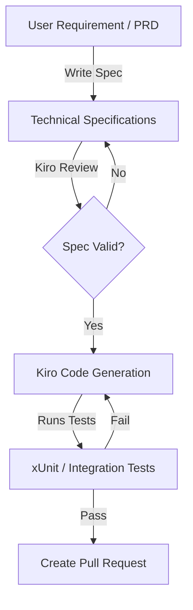
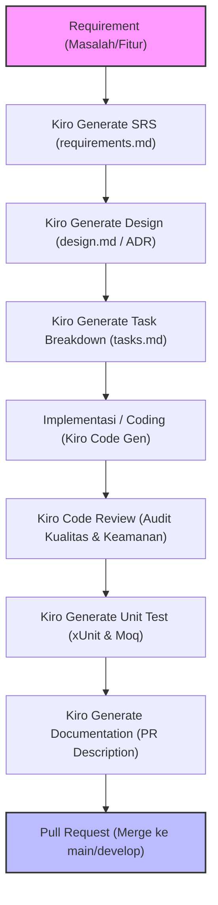

# Spec-Driven Development (SDD) Playbook with Kiro

Playbook ini menjelaskan metodologi **Spec-Driven Development (SDD)**, di mana penulisan spesifikasi teknis (specs) mendahului penulisan kode sumber. Metodologi ini dirancang secara optimal agar bekerja sinergis dengan asisten AI **Kiro**.

---

## 1. Konsep Spec-Driven Development (SDD)

Pada pengembangan tradisional, alur kerja developer adalah:
`Requirement -> Coding -> Testing -> Docs (Opsional)`

Sedangkan pada **Spec-Driven Development dengan Kiro**, alurnya bergeser menjadi:
`Requirement -> Technical Specs (API/DB Schema) -> Kiro Code Generation -> Automated Verification -> Code Quality Audit`



### 1.1. Workflow Produktivitas Harian dengan Kiro

Berikut adalah visualisasi alur kerja pengembangan harian dari penemuan requirement hingga pengajuan Pull Request menggunakan bantuan asisten AI Kiro:




### Mengapa Sangat Efektif bersama Kiro?
1. **Mengurangi Halusinasi AI:** Dengan menyuplai Kiro dengan file spesifikasi yang terdefinisi dengan jelas (seperti file `.openapi.yaml` atau skema database `.sql`), Kiro memiliki basis kebenaran (*ground truth*) yang kuat dan meminimalisir pembuatan kode di luar cakupan.
2. **Deterministic Code Generation:** Spesifikasi bertindak sebagai instruksi berskala tinggi, sehingga Kiro dapat menghasilkan implementasi C# (.NET 8 Clean Architecture) dan TypeScript (ReactJS) secara konsisten.

---

## 2. API Specification Standard (OpenAPI v3)

Sebelum menulis controller C#, buatlah API Specification terlebih dahulu. Letakkan file ini di folder `/docs/api/order-api.yaml`.

```yaml
openapi: 3.0.3
info:
  title: Order Processing API
  version: 1.0.0
paths:
  /api/v1/orders:
    post:
      summary: Place a new order
      operationId: CreateOrder
      requestBody:
        required: true
        content:
          application/json:
            schema:
              $ref: '#/components/schemas/CreateOrderRequest'
      responses:
        '210':
          description: Order successfully created
          content:
            application/json:
              schema:
                $ref: '#/components/schemas/OrderResponse'
        '400':
          description: Invalid input data
components:
  schemas:
    CreateOrderRequest:
      type: object
      required:
        - userId
        - totalAmount
      properties:
        userId:
          type: string
          format: uuid
        totalAmount:
          type: number
          format: double
    OrderResponse:
      type: object
      properties:
        orderId:
          type: string
          format: uuid
        orderNumber:
          type: string
        status:
          type: string
```

---

## 3. Workflow Implementasi dengan Kiro

### Step 1: Feed Spec ke Kiro
Berikan spesifikasi API di atas kepada Kiro, lalu gunakan prompt:
```text
Read the API spec at /docs/api/order-api.yaml.
Generate a .NET 8 API Controller that satisfies the CreateOrder endpoint.
Ensure:
1. It maps request payload to a MediatR Command named `CreateOrderCommand`.
2. It returns 201 Created with the location of the newly created order.
3. Keep clean code and file-scoped namespace.
```

### Step 2: Hasilkan Unit Test dari Spec
Minta Kiro untuk membuat unit test berdasarkan spesifikasi perilaku API:
```text
Write unit tests using xUnit and NSubstitute for the MediatR handler of `CreateOrderCommand`.
Test scenarios:
1. Handle method should return success when input payload is valid.
2. Handle method should publish OrderCreatedEvent on success.
3. Handler should throw a validation exception if totalAmount is negative.
```

### Step 3: Implementasikan UI Frontend dari Spec
Minta Kiro untuk menghasilkan client API service di frontend ReactJS yang memetakan model request/response yang sama:
```text
Based on the OpenAPI spec at /docs/api/order-api.yaml:
1. Generate the TypeScript interface representing CreateOrderRequest and OrderResponse.
2. Create an Axios POST request function that calls this endpoint.
3. Write a TanStack Query mutation hook for submitting this form.
```

---

## 4. Keuntungan Utama dari SDD
* **Dokumentasi Hidup (Living Documentation):** Dokumentasi API tidak pernah tertinggal dibanding code, karena code dibuat berdasarkan dokumentasi.
* **Integrasi Paralel:** Tim ReactJS dan .NET 8 dapat bekerja secara paralel segera setelah file OpenAPI disepakati, tanpa harus menunggu salah satu tim selesai coding terlebih dahulu.
* **Mudah Dimigrasi:** Jika di masa depan terjadi migrasi framework (misal dari React ke Next.js), spesifikasi API tetap dapat dipakai tanpa perubahan.
