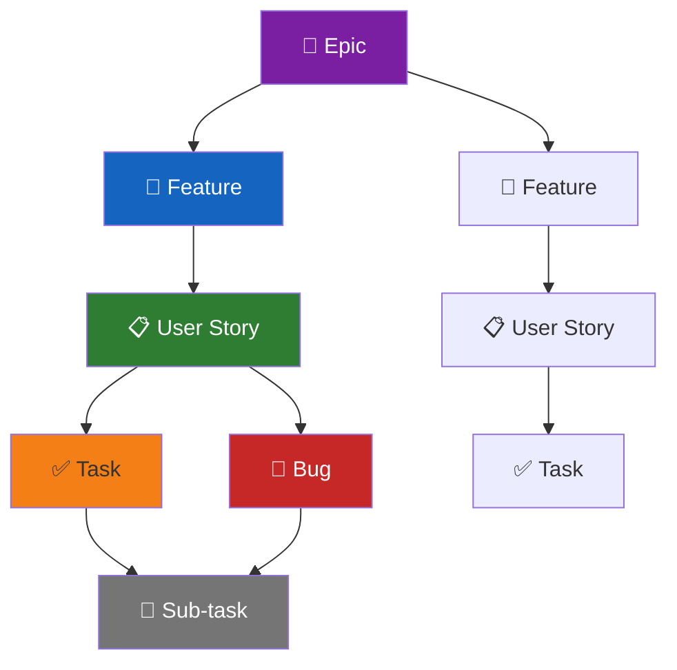
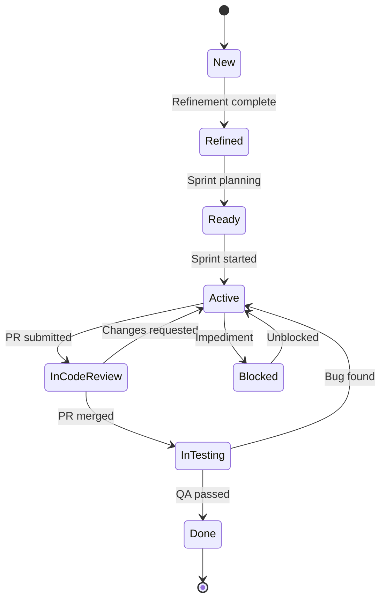
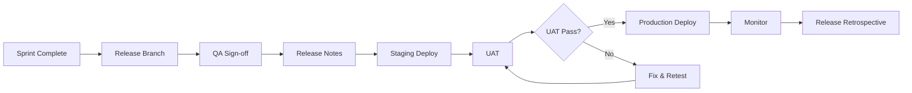
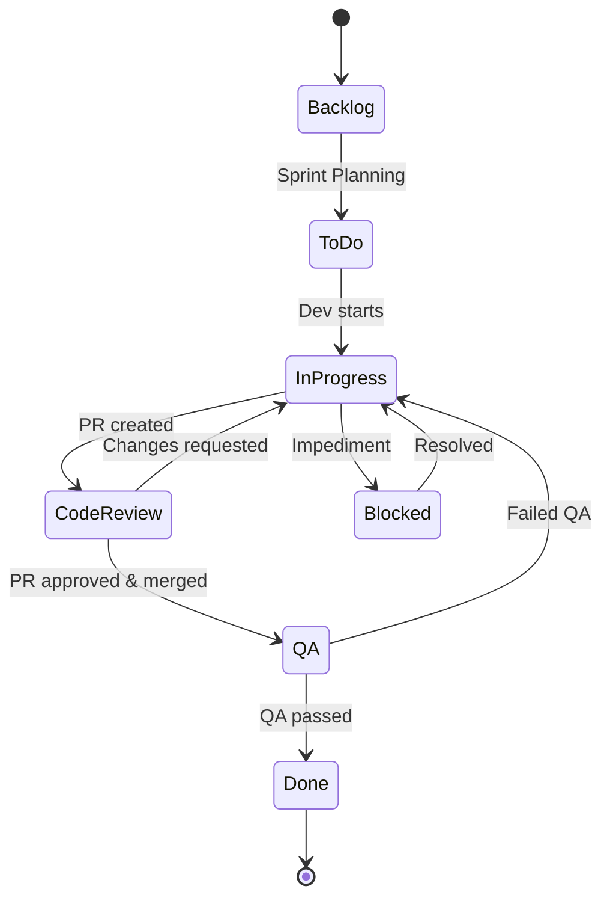
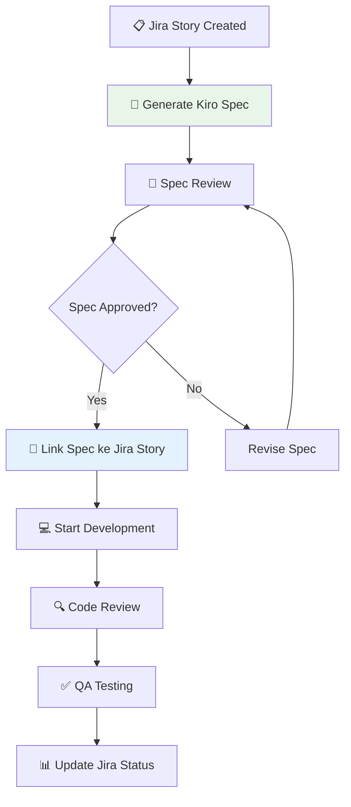

# 16 · Azure DevOps & Jira Workflow Integration

> **Versi**: 2.0 · **Terakhir Diperbarui**: 2026-06-17
> **Stack**: .NET 8 · ReactJS 18 · SQL Server 2022
> **Tool**: Azure DevOps, Jira, Kiro AI, GitHub

---

## Daftar Isi

1. [Azure DevOps Workflow](#1-azure-devops-workflow)
2. [Azure Pipelines YAML Templates](#2-azure-pipelines-yaml-templates)
3. [Jira Workflow](#3-jira-workflow)
4. [Integration dengan Kiro](#4-integration-dengan-kiro)
5. [Reporting Templates](#5-reporting-templates)

---

## 1. Azure DevOps Workflow

### 1.1 Board Configuration

#### Work Item Types dan Hierarchy



| Work Item Type | Deskripsi | Contoh | Owner |
|---------------|-----------|--------|-------|
| **Epic** | Inisiatif besar yang berlangsung 1-3 bulan | "Implementasi Modul Inventory" | Product Manager |
| **Feature** | Kapabilitas yang bisa di-deliver dalam 1-2 sprint | "Manajemen Stock Opname" | Product Owner |
| **User Story** | Unit deliverable dari perspektif user | "Sebagai Warehouse Staff, saya ingin scan barcode untuk stock opname" | Product Owner |
| **Task** | Pekerjaan teknis untuk menyelesaikan story | "Implementasi Barcode Scanner API" | Developer |
| **Bug** | Defect yang perlu diperbaiki | "Stock count tidak terupdate setelah scan" | Developer |
| **Sub-task** | Breakdown detail dari task/bug | "Write unit tests for scanner service" | Developer |

### 1.2 Custom Work Item States



**State Definitions:**

| State | Deskripsi | Siapa yang Mengubah | Warna Board |
|-------|-----------|-------------------|-------------|
| **New** | Baru dibuat, belum di-refine | Anyone | 🔵 Blue |
| **Refined** | Sudah di-refine, acceptance criteria jelas | Product Owner | 🟣 Purple |
| **Ready** | Siap dikerjakan di sprint berikutnya | Scrum Master | 🟢 Green |
| **Active** | Sedang dikerjakan | Developer | 🟡 Yellow |
| **In Code Review** | PR sudah dibuat, menunggu review | Developer | 🟠 Orange |
| **In Testing** | Di-test oleh QA | QA Engineer | 🔵 Blue |
| **Blocked** | Ada impediment | Anyone | 🔴 Red |
| **Done** | Selesai dan di-deploy | QA/Scrum Master | ⚫ Dark |

### 1.3 Sprint Planning Process

#### Pre-Sprint Planning (1 hari sebelum)

```markdown
## 📋 Sprint Planning Preparation Checklist

### Product Owner
- [ ] Backlog sudah di-prioritize (top 20 items)
- [ ] Acceptance criteria sudah lengkap untuk top 15 items
- [ ] Technical dependencies sudah diidentifikasi
- [ ] Mockups/wireframes sudah tersedia (jika ada)

### Scrum Master
- [ ] Velocity historis sudah dihitung (3 sprint terakhir)
- [ ] Team capacity sudah dihitung
- [ ] Carryover items sudah diidentifikasi
- [ ] Sprint goal sudah di-draft

### Tech Lead
- [ ] Technical feasibility sudah direview
- [ ] Architecture decisions sudah dibuat
- [ ] Tech debt items sudah di-prioritize
- [ ] Dependencies antar story sudah diidentifikasi
```

#### Sprint Planning Meeting

```markdown
## 🎯 Sprint Planning — Sprint [NUMBER]

### Informasi Sprint
- **Durasi**: [START_DATE] — [END_DATE] (2 minggu)
- **Sprint Goal**: [GOAL]
- **Team Capacity**: [X] story points

### Velocity Reference
| Sprint | Committed | Completed | Velocity |
|--------|-----------|-----------|----------|
| Sprint N-3 | 40 | 35 | 35 |
| Sprint N-2 | 38 | 38 | 38 |
| Sprint N-1 | 42 | 40 | 40 |
| **Average** | | | **37.7** |

### Capacity Calculation
| Team Member | Available Days | Daily Hours | Capacity (pts) |
|------------|---------------|-------------|----------------|
| Dev A | 10 | 6 | 8 |
| Dev B | 8 | 6 | 6 |
| Dev C | 10 | 6 | 8 |
| QA A | 10 | 6 | 5 |
| **Total** | | | **27** |

*Note: 1 point ≈ 1 ideal day (6 productive hours)*

### Sprint Backlog
| # | Story | Points | Assignee | Priority |
|---|-------|--------|----------|----------|
| 1 | [STORY-001] User login with MFA | 5 | Dev A | P1 |
| 2 | [STORY-002] Password reset flow | 3 | Dev B | P1 |
| 3 | [BUG-015] Fix session timeout | 2 | Dev A | P1 |
| 4 | [STORY-003] User profile edit | 5 | Dev C | P2 |
| 5 | [TECH-008] Upgrade to .NET 8.0.3 | 3 | Dev B | P2 |
| | **Total** | **18** | | |

### Risks & Dependencies
- [ ] Story-001 depends on Azure AD configuration (ETA: Day 2)
- [ ] Story-003 blocked until UI mockup approved
- [ ] Tech-008 may introduce breaking changes — allocate buffer
```

### 1.4 Backlog Management

#### Backlog Refinement Template

```markdown
## 🔧 Backlog Refinement Session — [DATE]

### Agenda
1. Review new items (15 min)
2. Refine top 5 items (30 min)
3. Estimate refined items (15 min)

### Items to Refine

#### Item 1: [STORY-XXX] [Title]
**As a** [role]
**I want** [capability]
**So that** [benefit]

**Acceptance Criteria:**
- [ ] Given [context], When [action], Then [outcome]
- [ ] Given [context], When [action], Then [outcome]
- [ ] Given [context], When [action], Then [outcome]

**Technical Notes:**
- Backend: [API changes needed]
- Frontend: [UI changes needed]
- Database: [Schema changes needed]

**Estimation:**
- Complexity: [Low/Medium/High]
- Story Points: [1/2/3/5/8/13]
- Spike needed: [Yes/No]

**Dependencies:**
- Depends on: [STORY-YYY]
- Blocks: [STORY-ZZZ]
```

#### Definition of Ready (DoR)

```markdown
## ✅ Definition of Ready

Sebuah User Story dianggap "Ready" jika memenuhi semua kriteria berikut:

### Wajib
- [ ] User Story ditulis dalam format "As a... I want... So that..."
- [ ] Acceptance criteria minimal 3 item, menggunakan format Given-When-Then
- [ ] Story sudah di-estimate oleh development team
- [ ] Story sudah di-prioritize oleh Product Owner
- [ ] Dependencies sudah diidentifikasi dan tidak ada blocker
- [ ] Story cukup kecil untuk diselesaikan dalam 1 sprint (≤ 8 points)

### Desain
- [ ] UI mockup/wireframe tersedia (jika ada perubahan UI)
- [ ] UX flow sudah di-review
- [ ] Mobile responsiveness requirement jelas

### Teknis
- [ ] API contract sudah didefinisikan (jika ada)
- [ ] Database schema changes sudah di-review oleh DBA
- [ ] Performance requirements jelas (response time, throughput)
- [ ] Security requirements sudah diidentifikasi
```

#### Definition of Done (DoD)

```markdown
## ✅ Definition of Done

Sebuah User Story dianggap "Done" jika memenuhi semua kriteria berikut:

### Kode
- [ ] Kode sudah di-review dan di-approve (minimal 2 reviewer)
- [ ] Kode mengikuti coding standards yang telah disepakati
- [ ] Tidak ada SonarQube critical/blocker issues
- [ ] Technical debt yang diperkenalkan sudah di-log

### Testing
- [ ] Unit tests ditulis (coverage ≥ 80%)
- [ ] Integration tests ditulis dan passed
- [ ] Manual testing oleh QA passed
- [ ] Edge cases sudah di-test
- [ ] Regression tests passed

### Documentation
- [ ] API documentation (Swagger) diupdate
- [ ] README diupdate jika ada perubahan setup
- [ ] Inline code documentation (XML comments) lengkap
- [ ] Release notes entry dibuat

### Deployment
- [ ] Berhasil di-deploy ke staging environment
- [ ] Smoke tests passed di staging
- [ ] Rollback plan tersedia
- [ ] Monitoring/alerting sudah dikonfigurasi

### Product Owner
- [ ] Demo ke Product Owner completed
- [ ] Acceptance criteria semua terpenuhi
- [ ] Product Owner memberikan sign-off
```

### 1.5 Custom Fields

| Field Name | Type | Applicable To | Deskripsi |
|-----------|------|---------------|-----------|
| `Technical Area` | Dropdown | All | Backend, Frontend, Database, DevOps, Full-stack |
| `Risk Level` | Dropdown | Story, Bug | Low, Medium, High, Critical |
| `Architecture Impact` | Boolean | Story, Feature | Apakah ada perubahan arsitektur |
| `Performance Impact` | Boolean | Story, Bug | Apakah ada dampak performance |
| `Kiro Spec Link` | URL | Story, Task | Link ke Kiro specification |
| `Estimated Review Time` | Number | Task | Estimasi waktu review (jam) |
| `Tech Debt Category` | Dropdown | Task | Code, Test, Infra, Docs, Security |
| `Customer Impact` | Dropdown | Bug | None, Low, Medium, High, Critical |

### 1.6 Azure DevOps Dashboards

#### Team Dashboard Widgets

```markdown
## 📊 Sprint Dashboard Configuration

### Row 1: Sprint Overview
| Widget | Type | Size |
|--------|------|------|
| Sprint Burndown | Burndown | 3x2 |
| Sprint Velocity | Velocity | 3x2 |
| Sprint Goal | Markdown | 2x1 |
| Team Members | Team Members | 2x1 |

### Row 2: Work Status
| Widget | Type | Size |
|--------|------|------|
| Cumulative Flow | CFD | 4x2 |
| Work Item Status | Chart | 3x2 |
| Blocked Items | Query Results | 3x2 |

### Row 3: Quality
| Widget | Type | Size |
|--------|------|------|
| Open Bugs | Query Results | 3x2 |
| Code Coverage Trend | Test Results | 3x2 |
| Build Status | Build History | 2x2 |
| Deploy Status | Release | 2x2 |
```

### 1.7 Test Plans Integration

```markdown
## 🧪 Test Plan Structure

### Test Suite Hierarchy
├── Sprint [N] Test Plan
│   ├── 📁 Smoke Tests
│   │   ├── Login flow
│   │   ├── Homepage load
│   │   └── API health check
│   ├── 📁 Feature Tests
│   │   ├── [STORY-001] User Registration
│   │   │   ├── TC-001: Valid registration
│   │   │   ├── TC-002: Duplicate email
│   │   │   ├── TC-003: Invalid password
│   │   │   └── TC-004: Email verification
│   │   └── [STORY-002] Password Reset
│   │       ├── TC-005: Valid reset request
│   │       └── TC-006: Invalid token
│   ├── 📁 Regression Tests
│   │   ├── Authentication suite
│   │   ├── Authorization suite
│   │   └── Data integrity suite
│   └── 📁 Performance Tests
│       ├── Load test: 1000 concurrent users
│       └── Stress test: peak capacity
```

### 1.8 Release Management



---

## 2. Azure Pipelines YAML Templates

### 2.1 Multi-Stage Pipeline

```yaml
# azure-pipelines.yml
trigger:
  branches:
    include:
      - main
      - release/*
  paths:
    exclude:
      - docs/**
      - "*.md"

pr:
  branches:
    include:
      - main
  paths:
    exclude:
      - docs/**

pool:
  vmImage: "ubuntu-latest"

variables:
  - group: "project-common"
  - name: dotnetVersion
    value: "8.0.x"
  - name: nodeVersion
    value: "20.x"
  - name: buildConfiguration
    value: "Release"

stages:
  # ════════════════════════════════════════
  # STAGE 1: Build & Test
  # ════════════════════════════════════════
  - stage: Build
    displayName: "🔨 Build & Test"
    jobs:
      - job: BuildBackend
        displayName: "Build .NET Backend"
        steps:
          - task: UseDotNet@2
            displayName: "Install .NET SDK"
            inputs:
              packageType: "sdk"
              version: $(dotnetVersion)

          - task: DotNetCoreCLI@2
            displayName: "Restore NuGet Packages"
            inputs:
              command: "restore"
              projects: "src/backend/**/*.csproj"
              feedsToUse: "config"
              nugetConfigPath: "NuGet.config"

          - task: DotNetCoreCLI@2
            displayName: "Build Solution"
            inputs:
              command: "build"
              projects: "src/backend/**/*.csproj"
              arguments: "--configuration $(buildConfiguration) --no-restore"

          - task: DotNetCoreCLI@2
            displayName: "Run Unit Tests"
            inputs:
              command: "test"
              projects: "src/backend/**/Tests.Unit.csproj"
              arguments: >-
                --configuration $(buildConfiguration)
                --no-build
                --collect:"XPlat Code Coverage"
                --logger "trx;LogFileName=unit-tests.trx"
              publishTestResults: true

          - task: DotNetCoreCLI@2
            displayName: "Run Integration Tests"
            inputs:
              command: "test"
              projects: "src/backend/**/Tests.Integration.csproj"
              arguments: >-
                --configuration $(buildConfiguration)
                --no-build
                --collect:"XPlat Code Coverage"
                --logger "trx;LogFileName=integration-tests.trx"
              publishTestResults: true

          - task: PublishCodeCoverageResults@2
            displayName: "Publish Code Coverage"
            inputs:
              codeCoverageTool: "Cobertura"
              summaryFileLocation: "$(Agent.TempDirectory)/**/coverage.cobertura.xml"

          - task: DotNetCoreCLI@2
            displayName: "Publish API"
            inputs:
              command: "publish"
              projects: "src/backend/Api/Api.csproj"
              arguments: "--configuration $(buildConfiguration) --output $(Build.ArtifactStagingDirectory)/api"
              publishWebProjects: false

          - task: PublishBuildArtifacts@1
            displayName: "Upload API Artifact"
            inputs:
              pathToPublish: "$(Build.ArtifactStagingDirectory)/api"
              artifactName: "api"

      - job: BuildFrontend
        displayName: "Build React Frontend"
        steps:
          - task: NodeTool@0
            displayName: "Install Node.js"
            inputs:
              versionSpec: $(nodeVersion)

          - script: npm install -g pnpm
            displayName: "Install pnpm"

          - task: Cache@2
            displayName: "Cache pnpm store"
            inputs:
              key: pnpm | "$(Agent.OS)" | src/frontend/pnpm-lock.yaml
              path: $(HOME)/.local/share/pnpm/store
              restoreKeys: |
                pnpm | "$(Agent.OS)"

          - script: pnpm install --frozen-lockfile
            displayName: "Install Dependencies"
            workingDirectory: src/frontend

          - script: pnpm run lint
            displayName: "Lint"
            workingDirectory: src/frontend

          - script: pnpm run type-check
            displayName: "Type Check"
            workingDirectory: src/frontend

          - script: pnpm test -- --coverage --watchAll=false --ci
            displayName: "Run Tests"
            workingDirectory: src/frontend
            env:
              CI: true

          - script: pnpm run build
            displayName: "Build Production"
            workingDirectory: src/frontend
            env:
              CI: true
              GENERATE_SOURCEMAP: false

          - task: PublishBuildArtifacts@1
            displayName: "Upload Frontend Artifact"
            inputs:
              pathToPublish: "src/frontend/build"
              artifactName: "frontend"

  # ════════════════════════════════════════
  # STAGE 2: Security Scan
  # ════════════════════════════════════════
  - stage: Security
    displayName: "🔐 Security Scan"
    dependsOn: Build
    jobs:
      - job: SecurityScan
        displayName: "Run Security Scans"
        steps:
          - task: UseDotNet@2
            inputs:
              packageType: "sdk"
              version: $(dotnetVersion)

          - script: |
              dotnet list src/backend/Api.sln package --vulnerable --include-transitive 2>&1 | tee vulnerability-report.txt
              if grep -q "has the following vulnerable packages" vulnerability-report.txt; then
                echo "##vso[task.logissue type=warning]Vulnerable NuGet packages found"
              fi
            displayName: "NuGet Vulnerability Check"

          - script: |
              cd src/frontend && pnpm audit --prod --audit-level high
            displayName: "PNPM Security Audit"
            continueOnError: true

  # ════════════════════════════════════════
  # STAGE 3: Deploy to Staging
  # ════════════════════════════════════════
  - stage: DeployStaging
    displayName: "🚀 Deploy to Staging"
    dependsOn: [Build, Security]
    condition: and(succeeded(), eq(variables['Build.SourceBranch'], 'refs/heads/main'))
    jobs:
      - deployment: DeployToStaging
        displayName: "Deploy to Staging"
        environment: "staging"
        strategy:
          runOnce:
            deploy:
              steps:
                - task: AzureWebApp@1
                  displayName: "Deploy API to Staging"
                  inputs:
                    azureSubscription: "$(azureSubscription)"
                    appType: "webAppLinux"
                    appName: "$(stagingApiAppName)"
                    package: "$(Pipeline.Workspace)/api/**/*.zip"
                    runtimeStack: "DOTNETCORE|8.0"

                - task: AzureWebApp@1
                  displayName: "Deploy Frontend to Staging"
                  inputs:
                    azureSubscription: "$(azureSubscription)"
                    appType: "webAppLinux"
                    appName: "$(stagingFrontendAppName)"
                    package: "$(Pipeline.Workspace)/frontend"

                - script: |
                    echo "Running staging smoke tests..."
                    curl -f https://$(stagingApiUrl)/health || exit 1
                    curl -f https://$(stagingFrontendUrl) || exit 1
                    echo "Smoke tests passed!"
                  displayName: "Smoke Tests"

  # ════════════════════════════════════════
  # STAGE 4: Deploy to Production
  # ════════════════════════════════════════
  - stage: DeployProduction
    displayName: "🎯 Deploy to Production"
    dependsOn: DeployStaging
    condition: succeeded()
    jobs:
      - deployment: DeployToProduction
        displayName: "Deploy to Production"
        environment: "production"
        strategy:
          runOnce:
            deploy:
              steps:
                - task: AzureAppServiceManage@0
                  displayName: "Swap Staging to Production (API)"
                  inputs:
                    azureSubscription: "$(azureSubscription)"
                    action: "Swap Slots"
                    webAppName: "$(prodApiAppName)"
                    resourceGroupName: "$(resourceGroup)"
                    sourceSlot: "staging"
                    targetSlot: "production"

                - script: |
                    echo "Verifying production health..."
                    for i in {1..5}; do
                      HTTP_STATUS=$(curl -s -o /dev/null -w "%{http_code}" https://$(prodApiUrl)/health)
                      if [ "$HTTP_STATUS" == "200" ]; then
                        echo "Production healthy!"
                        exit 0
                      fi
                      echo "Attempt $i: HTTP $HTTP_STATUS, retrying in 10s..."
                      sleep 10
                    done
                    echo "Production health check failed!"
                    exit 1
                  displayName: "Production Health Check"
```

### 2.2 Pipeline Templates (Reusable)

```yaml
# templates/build-dotnet.yml
parameters:
  - name: solution
    type: string
  - name: buildConfiguration
    type: string
    default: "Release"
  - name: dotnetVersion
    type: string
    default: "8.0.x"

steps:
  - task: UseDotNet@2
    displayName: "Install .NET SDK ${{ parameters.dotnetVersion }}"
    inputs:
      packageType: "sdk"
      version: ${{ parameters.dotnetVersion }}

  - task: DotNetCoreCLI@2
    displayName: "Restore"
    inputs:
      command: "restore"
      projects: ${{ parameters.solution }}

  - task: DotNetCoreCLI@2
    displayName: "Build"
    inputs:
      command: "build"
      projects: ${{ parameters.solution }}
      arguments: "--configuration ${{ parameters.buildConfiguration }} --no-restore"

  - task: DotNetCoreCLI@2
    displayName: "Test"
    inputs:
      command: "test"
      projects: ${{ parameters.solution }}
      arguments: "--configuration ${{ parameters.buildConfiguration }} --no-build --collect:\"XPlat Code Coverage\""
      publishTestResults: true
```

```yaml
# templates/build-react.yml
parameters:
  - name: workingDirectory
    type: string
    default: "src/frontend"
  - name: nodeVersion
    type: string
    default: "20.x"

steps:
  - task: NodeTool@0
    displayName: "Install Node.js ${{ parameters.nodeVersion }}"
    inputs:
      versionSpec: ${{ parameters.nodeVersion }}

  - script: npm install -g pnpm
    displayName: "Install pnpm"

  - script: pnpm install --frozen-lockfile
    displayName: "Install Dependencies"
    workingDirectory: ${{ parameters.workingDirectory }}

  - script: pnpm run lint && pnpm run type-check
    displayName: "Lint & Type Check"
    workingDirectory: ${{ parameters.workingDirectory }}

  - script: pnpm test -- --coverage --watchAll=false --ci
    displayName: "Run Tests"
    workingDirectory: ${{ parameters.workingDirectory }}
    env:
      CI: true

  - script: pnpm run build
    displayName: "Build"
    workingDirectory: ${{ parameters.workingDirectory }}
    env:
      CI: true
```

---

## 3. Jira Workflow

### 3.1 Project Configuration

#### Project Setup Checklist

```markdown
## 📋 Jira Project Setup Checklist

### Project Info
- [ ] Project key: [PROJ] (3-4 huruf uppercase)
- [ ] Project name: [Full Project Name]
- [ ] Project lead: [Name]
- [ ] Project type: Scrum / Kanban
- [ ] Sprint duration: 2 weeks

### Issue Types
- [ ] Epic (enabled)
- [ ] Story (enabled)
- [ ] Task (enabled)
- [ ] Sub-task (enabled)
- [ ] Bug (enabled)
- [ ] Technical Debt (custom)
- [ ] Spike (custom)

### Workflow
- [ ] Custom workflow configured
- [ ] Transitions defined
- [ ] Validators set
- [ ] Post-functions configured

### Board
- [ ] Columns mapped to workflow states
- [ ] Swimlanes configured
- [ ] Quick filters created
- [ ] Card layout configured

### Automation
- [ ] Auto-assign rules
- [ ] Status transition rules
- [ ] Notification rules
- [ ] SLA rules (if applicable)
```

### 3.2 Issue Types dan Workflows

#### Custom Issue Type: Technical Debt

```json
{
  "name": "Technical Debt",
  "description": "Technical improvements that reduce complexity or improve maintainability",
  "iconUrl": "wrench",
  "fields": {
    "required": [
      "summary",
      "description",
      "priority",
      "tech_debt_category",
      "estimated_impact"
    ],
    "optional": [
      "affected_area",
      "code_smell_type",
      "effort_estimate"
    ]
  },
  "tech_debt_categories": [
    "Code Quality",
    "Test Coverage",
    "Documentation",
    "Infrastructure",
    "Security",
    "Performance",
    "Dependencies"
  ]
}
```

#### Custom Issue Type: Spike

```json
{
  "name": "Spike",
  "description": "Research or investigation task with time-boxed effort",
  "iconUrl": "lightning",
  "fields": {
    "required": [
      "summary",
      "description",
      "time_box",
      "research_question",
      "expected_outcome"
    ],
    "optional": [
      "related_stories",
      "poc_required"
    ]
  }
}
```

### 3.3 Jira Workflow States



### 3.4 Custom Fields

| Field | Type | Issue Types | Deskripsi |
|-------|------|-------------|-----------|
| `Story Points` | Number | Story, Bug | Estimation |
| `Sprint Goal Alignment` | Select | Story | How this aligns with sprint goal |
| `Technical Area` | Multi-select | All | Backend, Frontend, DB, DevOps |
| `Risk Level` | Select | Story, Bug | Low, Medium, High, Critical |
| `Kiro Spec URL` | URL | Story, Task | Link ke Kiro AI spec |
| `PR Link` | URL | Task, Bug | GitHub PR link |
| `Architecture Decision` | Text | Story | ADR reference if applicable |
| `Performance Impact` | Select | Story, Bug | None, Positive, Negative |
| `Customer Impact` | Select | Bug | None, Low, Medium, High |
| `Root Cause` | Text | Bug | Root cause description |

### 3.5 Sprint Board Configuration

#### Columns

| Column | Mapped States | WIP Limit | Sub-columns |
|--------|--------------|-----------|-------------|
| **Backlog** | Backlog | - | - |
| **To Do** | To Do | 10 | - |
| **In Progress** | In Progress | 5 | Development, Blocked |
| **Code Review** | Code Review | 3 | - |
| **QA** | QA | 3 | Testing, Failed |
| **Done** | Done | - | - |

#### Quick Filters

| Filter | JQL |
|--------|-----|
| My Issues | `assignee = currentUser()` |
| Blocked | `status = Blocked` |
| High Priority | `priority in (Critical, High)` |
| Bugs Only | `issuetype = Bug` |
| Tech Debt | `issuetype = "Technical Debt"` |
| No Story Points | `issuetype in (Story, Bug) AND "Story Points" is EMPTY` |
| Stale (>5 days) | `status = "In Progress" AND updated <= -5d` |

#### Swimlanes

```yaml
swimlanes:
  - name: "Expedite"
    query: "priority = Critical"
    color: "#FF0000"

  - name: "Bugs"
    query: "issuetype = Bug"
    color: "#FFA500"

  - name: "Stories"
    query: "issuetype = Story"
    color: "#4CAF50"

  - name: "Tech Debt"
    query: "issuetype = 'Technical Debt'"
    color: "#9C27B0"

  - name: "Others"
    query: ""
    color: "#607D8B"
```

### 3.6 Automation Rules

#### Rule 1: Auto-assign PR Reviewer

```yaml
# When PR is created → assign reviewer
name: "Auto-assign PR Reviewer"
trigger:
  type: "development_trigger"
  event: "pull_request_created"
conditions:
  - field: "issuetype"
    operator: "in"
    value: ["Story", "Task", "Bug"]
actions:
  - type: "transition_issue"
    target_status: "Code Review"
  - type: "add_comment"
    body: |
      🔍 PR telah dibuat dan issue otomatis berpindah ke Code Review.
      PR: {{pullRequest.url}}
```

#### Rule 2: Auto-close Subtasks

```yaml
name: "Auto-close Subtasks when Parent Done"
trigger:
  type: "issue_transitioned"
  target_status: "Done"
conditions:
  - field: "issuetype"
    operator: "in"
    value: ["Story", "Task"]
  - field: "subtasks"
    operator: "is_not_empty"
actions:
  - type: "transition_subtasks"
    target_status: "Done"
  - type: "add_comment"
    body: "✅ Semua sub-task otomatis di-close karena parent sudah Done."
```

#### Rule 3: Stale Issue Alert

```yaml
name: "Alert for Stale Issues"
trigger:
  type: "scheduled"
  cron: "0 9 * * 1-5"  # Setiap hari kerja jam 9 pagi
conditions:
  - field: "status"
    operator: "in"
    value: ["In Progress"]
  - field: "updated"
    operator: "less_than"
    value: "-3d"
actions:
  - type: "add_comment"
    body: |
      ⚠️ Issue ini belum diupdate selama lebih dari 3 hari.
      @{{issue.assignee}}, mohon update status atau pindahkan ke Blocked jika ada impediment.
  - type: "send_notification"
    recipients: ["{{issue.assignee}}"]
    subject: "Stale Issue Alert: {{issue.key}}"
```

#### Rule 4: Auto-transition on PR Merge

```yaml
name: "Move to QA on PR Merge"
trigger:
  type: "development_trigger"
  event: "pull_request_merged"
conditions:
  - field: "status"
    operator: "equals"
    value: "Code Review"
actions:
  - type: "transition_issue"
    target_status: "QA"
  - type: "add_comment"
    body: |
      🔀 PR telah di-merge. Issue otomatis berpindah ke QA.
      Build: {{build.url}}
```

#### Rule 5: Bug SLA Tracking

```yaml
name: "Bug SLA Escalation"
trigger:
  type: "scheduled"
  cron: "0 */2 * * 1-5"  # Setiap 2 jam pada hari kerja
conditions:
  - field: "issuetype"
    operator: "equals"
    value: "Bug"
  - field: "priority"
    operator: "equals"
    value: "Critical"
  - field: "status"
    operator: "not_in"
    value: ["Done", "Closed"]
  - field: "created"
    operator: "less_than"
    value: "-4h"
actions:
  - type: "escalate"
    notify: ["tech-lead", "engineering-manager"]
    message: |
      🚨 Critical bug {{issue.key}} telah berumur lebih dari 4 jam tanpa resolusi.
      Assignee: {{issue.assignee}}
      Created: {{issue.created}}
```

### 3.7 JQL Queries untuk Common Reports

```sql
-- 1. Sprint Burndown Data
-- Issues yang masih open di sprint aktif
project = PROJ AND sprint in openSprints() AND status != Done
ORDER BY priority DESC, created ASC

-- 2. Bugs Created This Sprint
project = PROJ AND issuetype = Bug AND sprint in openSprints()
AND created >= startOfSprint()
ORDER BY priority DESC

-- 3. Carryover Issues (dari sprint sebelumnya)
project = PROJ AND sprint in closedSprints()
AND sprint in openSprints() AND status != Done
ORDER BY priority DESC

-- 4. Unestimated Stories
project = PROJ AND issuetype = Story
AND "Story Points" is EMPTY AND status != Done
ORDER BY priority DESC

-- 5. My Open Issues
project = PROJ AND assignee = currentUser()
AND status not in (Done, Closed)
ORDER BY priority DESC, updated DESC

-- 6. Blocked Issues
project = PROJ AND status = Blocked
ORDER BY priority DESC, updated ASC

-- 7. Issues Without Acceptance Criteria
project = PROJ AND issuetype = Story
AND description !~ "Acceptance Criteria"
AND status not in (Done, Closed)

-- 8. Tech Debt Backlog
project = PROJ AND issuetype = "Technical Debt"
AND status not in (Done, Closed)
ORDER BY priority DESC, created ASC

-- 9. Recently Resolved (last 7 days)
project = PROJ AND status = Done
AND resolved >= -7d
ORDER BY resolved DESC

-- 10. Bugs by Component
project = PROJ AND issuetype = Bug
AND status not in (Done, Closed)
ORDER BY component ASC, priority DESC

-- 11. Epic Progress
project = PROJ AND issuetype = Epic
AND status not in (Done, Closed)
ORDER BY priority DESC

-- 12. Velocity Data (stories completed per sprint)
project = PROJ AND issuetype = Story AND status = Done
AND sprint in closedSprints()
ORDER BY resolved DESC

-- 13. Aging Work in Progress
project = PROJ AND status = "In Progress"
AND updated <= -3d
ORDER BY updated ASC

-- 14. High-Risk Items
project = PROJ AND "Risk Level" in (High, Critical)
AND status not in (Done, Closed)
ORDER BY "Risk Level" DESC, priority DESC

-- 15. Items Needing Kiro Spec
project = PROJ AND issuetype in (Story, Task)
AND "Kiro Spec URL" is EMPTY
AND status not in (Done, Closed, Backlog)
```

### 3.8 Integration dengan GitHub

#### GitHub for Jira Configuration

```yaml
# Jira-GitHub Integration Setup
integration:
  type: "GitHub for Jira"
  features:
    - smart_commits: true      # Jira transitions via commit messages
    - development_panel: true  # Show PR/branch info in Jira
    - automation_triggers: true # Trigger Jira automation from GitHub events

smart_commit_syntax:
  # Transition issue
  - "PROJ-123 #done"
  - "PROJ-123 #in-progress"

  # Log time
  - "PROJ-123 #time 2h 30m"

  # Add comment
  - "PROJ-123 #comment Fixed the null reference in UserService"

  # Combined
  - "PROJ-123 #time 1h #comment Implemented validation #done"

branch_naming:
  # Jira auto-creates branch with issue key
  pattern: "feature/PROJ-123-{summary-slug}"
```

### 3.9 Epic/Story/Task Hierarchy — Real Example

```markdown
## 🎯 Epic: PROJ-100 — Modul Manajemen Pengguna

### 📖 Feature: PROJ-101 — Registrasi Pengguna
├── 📋 Story: PROJ-110 — Halaman Registrasi
│   ├── ✅ Task: PROJ-111 — Design database schema (Users table)
│   ├── ✅ Task: PROJ-112 — Implement UserRegistrationService
│   ├── ✅ Task: PROJ-113 — Create POST /api/users endpoint
│   ├── ✅ Task: PROJ-114 — Build registration form component
│   ├── ✅ Task: PROJ-115 — Add form validation (frontend)
│   ├── ✅ Task: PROJ-116 — Write unit tests (backend)
│   └── ✅ Task: PROJ-117 — Write component tests (frontend)
│
├── 📋 Story: PROJ-120 — Email Verification
│   ├── ✅ Task: PROJ-121 — Implement email sending service
│   ├── ✅ Task: PROJ-122 — Create verification token logic
│   ├── ✅ Task: PROJ-123 — Build verification page
│   └── ✅ Task: PROJ-124 — Write integration tests
│
└── 📋 Story: PROJ-130 — Social Login (Google, Microsoft)
    ├── ✅ Task: PROJ-131 — Configure OAuth providers
    ├── ✅ Task: PROJ-132 — Implement OAuth callback handler
    └── ✅ Task: PROJ-133 — Build social login buttons

### 📖 Feature: PROJ-102 — Autentikasi
├── 📋 Story: PROJ-140 — Login dengan Email/Password
├── 📋 Story: PROJ-150 — Multi-Factor Authentication
└── 📋 Story: PROJ-160 — Reset Password
```

---

## 4. Integration dengan Kiro

### 4.1 Linking Kiro Specs ke Work Items

#### Workflow: Story → Kiro Spec → Implementation



#### Kiro Spec Template Linked to Jira

```markdown
## Kiro Specification

### Jira Reference
- **Epic**: PROJ-100 — Modul Manajemen Pengguna
- **Story**: PROJ-110 — Halaman Registrasi
- **Sprint**: Sprint 15 (June 17 - June 30, 2026)

### Requirements (from Jira Acceptance Criteria)
1. User can register with email and password
2. Email validation (format + uniqueness)
3. Password must meet complexity requirements
4. Email verification sent after registration
5. User redirected to login after verification

### Technical Implementation
[Generate with Kiro based on requirements above]

### Kiro Prompts Used
1. "Generate a .NET 8 API endpoint for user registration with FluentValidation"
2. "Create a React registration form with real-time validation"
3. "Design SQL Server schema for user management with proper indexing"
```

### 4.2 Automated Status Updates

```yaml
# Automation: Update Jira dari development events
triggers:
  - event: "branch_created"
    action: "transition_to_in_progress"
    comment: "🌿 Branch dibuat: {{branch.name}}"

  - event: "pr_created"
    action: "transition_to_code_review"
    comment: "📤 PR dibuat: {{pr.title}} ({{pr.url}})"

  - event: "pr_approved"
    action: "add_comment"
    comment: "✅ PR di-approve oleh {{reviewer.name}}"

  - event: "pr_merged"
    action: "transition_to_qa"
    comment: "🔀 PR merged ke main. Build: {{build.url}}"

  - event: "deploy_staging"
    action: "add_comment"
    comment: "🚀 Deploy ke staging berhasil. URL: {{staging.url}}"

  - event: "deploy_production"
    action: "transition_to_done"
    comment: "🎯 Deploy ke production berhasil!"
```

### 4.3 Sprint Velocity Tracking

```markdown
## 📊 Velocity Tracking — Team Alpha

### Last 6 Sprints

| Sprint | Committed | Completed | Velocity | Carry-over |
|--------|-----------|-----------|----------|------------|
| Sprint 10 | 34 | 28 | 28 | 6 |
| Sprint 11 | 32 | 30 | 30 | 2 |
| Sprint 12 | 35 | 35 | 35 | 0 |
| Sprint 13 | 38 | 33 | 33 | 5 |
| Sprint 14 | 36 | 36 | 36 | 0 |
| Sprint 15 | 37 | - | - | - |

### Velocity Metrics
- **Average (6 sprints)**: 32.4 points
- **Median**: 33 points
- **Standard Deviation**: 3.2
- **Recommended Commitment**: 30-33 points (conservative)

### Velocity Trend
- 📈 Trend: Improving (+2.3 points/sprint average)
- 🎯 Target: 35 points/sprint by Sprint 18
- ⚠️ Risk: Sprint 13 had scope creep (5 points carry-over)
```

### 4.4 Kiro-Powered Sprint Planning

```markdown
## Kiro Prompt untuk Sprint Planning

### Estimasi Story Points
"Given the following user story and our team's average velocity of 33 points/sprint,
help me estimate story points using the Fibonacci scale:

Story: [paste story with acceptance criteria]

Consider:
- Backend complexity (.NET 8 API development)
- Frontend complexity (React components)
- Database changes (SQL Server)
- Testing effort
- Integration complexity

Provide breakdown by task and suggested total points."

### Risk Assessment
"Analyze the following sprint backlog for risks:
[paste sprint backlog]

Consider:
- Technical dependencies between stories
- Team capacity (2 developers, 1 QA)
- External dependencies (APIs, third-party services)
- Historical velocity: 33 points average
- Previous sprint carry-over patterns

Provide risk matrix with mitigation strategies."
```

---

## 5. Reporting Templates

### 5.1 Sprint Report Template

```markdown
# 📊 Sprint Report — Sprint [NUMBER]

## Sprint Overview
| Metric | Value |
|--------|-------|
| **Sprint** | Sprint [N] |
| **Duration** | [START] — [END] |
| **Sprint Goal** | [GOAL] |
| **Goal Achieved** | ✅ Yes / ❌ No |

## Delivery Summary
| Metric | Committed | Completed | % |
|--------|-----------|-----------|---|
| Story Points | 35 | 32 | 91% |
| Stories | 8 | 7 | 87.5% |
| Tasks | 24 | 22 | 91.7% |
| Bugs Fixed | 5 | 5 | 100% |
| Tech Debt | 2 | 1 | 50% |

## Completed Items
| Key | Type | Summary | Points | Assignee |
|-----|------|---------|--------|----------|
| PROJ-110 | Story | User registration | 5 | Dev A |
| PROJ-120 | Story | Email verification | 3 | Dev B |
| PROJ-140 | Story | Login flow | 5 | Dev A |
| BUG-201 | Bug | Fix null reference | 2 | Dev C |
| ... | ... | ... | ... | ... |

## Carry-over Items
| Key | Type | Summary | Points | Reason |
|-----|------|---------|--------|--------|
| PROJ-130 | Story | Social login | 5 | External dependency delay |

## Bugs
| Metric | Count |
|--------|-------|
| Bugs found this sprint | 3 |
| Bugs fixed this sprint | 5 |
| Bug backlog (total open) | 8 |
| Critical bugs open | 0 |

## Retrospective Summary
### What went well 🟢
1. Strong collaboration between frontend and backend teams
2. CI/CD pipeline improvements reduced deployment time by 40%
3. Kiro-assisted code reviews caught issues early

### What needs improvement 🟡
1. Sprint planning accuracy — committed 35, delivered 32
2. External dependency management (OAuth provider delay)
3. Test coverage for edge cases

### Action Items
| Action | Owner | Due Date | Status |
|--------|-------|----------|--------|
| Add buffer for external dependencies | SM | Next sprint | 🔵 New |
| Improve estimation for OAuth-related stories | Dev A | Sprint N+1 | 🔵 New |
| Add retry logic for flaky integration tests | Dev B | Sprint N+1 | 🔵 New |
```

### 5.2 Velocity Report

```markdown
# 📈 Velocity Report — Q[X] 2026

## Team: [Team Name]

### Quarterly Velocity Trend
| Sprint | Committed | Completed | Accuracy | Carry-over |
|--------|-----------|-----------|----------|------------|
| Sprint 10 | 34 | 28 | 82% | 6 |
| Sprint 11 | 32 | 30 | 94% | 2 |
| Sprint 12 | 35 | 35 | 100% | 0 |
| Sprint 13 | 38 | 33 | 87% | 5 |
| Sprint 14 | 36 | 36 | 100% | 0 |
| Sprint 15 | 37 | 34 | 92% | 3 |

### Key Metrics
| Metric | Value | Target | Status |
|--------|-------|--------|--------|
| Avg Velocity | 32.7 pts/sprint | 35 | 🟡 |
| Planning Accuracy | 92.5% | 90% | 🟢 |
| Avg Carry-over | 2.7 items | < 3 | 🟢 |
| Bug Ratio | 18% | < 20% | 🟢 |
| Tech Debt Allocation | 12% | 20% | 🔴 |

### Recommendations
1. **Increase tech debt allocation** — currently 12% vs target 20%
2. **Velocity is stabilizing** — consider gradual increase to 35 pts
3. **Planning accuracy is good** — maintain current estimation approach
```

### 5.3 Bug Trends Report

```markdown
# 🐛 Bug Trends Report — [MONTH] 2026

## Summary
| Metric | This Month | Last Month | Trend |
|--------|-----------|------------|-------|
| Bugs Created | 15 | 22 | 📉 -32% |
| Bugs Resolved | 18 | 20 | 📉 -10% |
| Bug Backlog | 12 | 15 | 📉 -20% |
| Critical Bugs | 1 | 3 | 📉 -67% |
| Avg Resolution Time | 2.3 days | 3.1 days | 📉 -26% |

## Bugs by Severity
| Severity | Open | Created | Resolved |
|----------|------|---------|----------|
| Critical | 1 | 1 | 3 |
| High | 4 | 5 | 6 |
| Medium | 5 | 6 | 7 |
| Low | 2 | 3 | 2 |

## Bugs by Component
| Component | Count | % of Total |
|-----------|-------|-----------|
| Authentication | 4 | 27% |
| API Gateway | 3 | 20% |
| Frontend UI | 3 | 20% |
| Database | 2 | 13% |
| Payment | 2 | 13% |
| Other | 1 | 7% |

## Root Cause Analysis
| Root Cause | Count | % |
|-----------|-------|---|
| Missing validation | 5 | 33% |
| Race condition | 3 | 20% |
| Null reference | 2 | 13% |
| Configuration error | 2 | 13% |
| Edge case not handled | 2 | 13% |
| Other | 1 | 7% |

## Action Items
1. Focus validation training — 33% of bugs from missing validation
2. Implement automated null-check analysis in CI pipeline
3. Add concurrency tests for race condition prone areas
```

### 5.4 Technical Debt Report

```markdown
# 🏗️ Technical Debt Report — [QUARTER] 2026

## Debt Inventory
| Category | Items | Estimated Effort | Priority |
|----------|-------|-----------------|----------|
| Code Quality | 12 | 40 hours | Medium |
| Test Coverage | 8 | 25 hours | High |
| Documentation | 6 | 15 hours | Low |
| Infrastructure | 4 | 30 hours | High |
| Security | 3 | 20 hours | Critical |
| Performance | 5 | 35 hours | Medium |
| Dependencies | 7 | 15 hours | Medium |
| **Total** | **45** | **180 hours** | |

## Top Priority Items
| # | Item | Category | Effort | Impact | Risk |
|---|------|----------|--------|--------|------|
| 1 | Upgrade vulnerable NuGet packages | Security | 8h | High | Critical |
| 2 | Add missing integration tests for auth | Test | 12h | High | High |
| 3 | Migrate to containerized CI/CD | Infra | 20h | High | High |
| 4 | Remove deprecated API endpoints | Code | 8h | Medium | Medium |
| 5 | Optimize slow dashboard queries | Perf | 15h | High | Medium |

## Debt Trend
| Quarter | New Debt | Paid Debt | Net | Total Backlog |
|---------|----------|-----------|-----|---------------|
| Q1 2026 | 15 | 10 | +5 | 40 |
| Q2 2026 | 12 | 7 | +5 | 45 |
| **Target Q3** | 10 | 15 | **-5** | **40** |

## Sprint Allocation
- **Current**: 12% of sprint capacity → tech debt
- **Target**: 20% of sprint capacity → tech debt
- **Recommendation**: Dedicate 1 full sprint per quarter to tech debt

## Cost of Inaction
| Item | Risk if Not Addressed | Timeline |
|------|----------------------|----------|
| Vulnerable packages | Security breach potential | Immediate |
| Missing auth tests | Auth bugs in production | 1 month |
| Slow queries | User experience degradation | 2 months |
| Deprecated APIs | Breaking changes for consumers | 3 months |
```

### 5.5 Team Capacity Report

```markdown
# 👥 Team Capacity Report — Sprint [N]

## Team Composition
| Member | Role | Availability | Notes |
|--------|------|-------------|-------|
| Dev A | Senior Backend | 100% | - |
| Dev B | Fullstack | 80% | Training 1 day |
| Dev C | Frontend | 100% | - |
| Dev D | Junior Backend | 100% | Needs mentoring |
| QA A | QA Engineer | 100% | - |
| SM | Scrum Master | 50% | Shared with Team B |

## Capacity Calculation
| Member | Work Days | Ceremony Days | Available Days | Daily Capacity | Sprint Capacity |
|--------|----------|--------------|---------------|---------------|----------------|
| Dev A | 10 | 1 | 9 | 6h | 54h |
| Dev B | 8 | 1 | 7 | 6h | 42h |
| Dev C | 10 | 1 | 9 | 6h | 54h |
| Dev D | 10 | 1.5 | 8.5 | 5h | 42.5h |
| QA A | 10 | 1 | 9 | 6h | 54h |
| **Total** | | | | | **246.5h** |

## Capacity Allocation
| Activity | % | Hours |
|----------|---|-------|
| Feature Development | 60% | 147.9h |
| Bug Fixes | 15% | 37.0h |
| Tech Debt | 10% | 24.7h |
| Code Review | 10% | 24.7h |
| Learning/Growth | 5% | 12.3h |

## Story Point Capacity
- **Historical velocity/hour**: ~0.13 pts/hour
- **Estimated capacity**: ~32 story points
- **Recommended commitment**: 28-32 story points (with buffer)
```

---

## Referensi

| Sumber | Link |
|--------|------|
| Azure DevOps Docs | https://learn.microsoft.com/en-us/azure/devops/ |
| Jira Automation | https://www.atlassian.com/software/jira/guides/automation |
| Azure Pipelines YAML | https://learn.microsoft.com/en-us/azure/devops/pipelines/yaml-schema |
| JQL Reference | https://support.atlassian.com/jira-software-cloud/docs/jql-fields/ |

---

> **Dokumen ini adalah bagian dari Kiro Engineering SOP Series**
> Lihat juga: [15-workflow-github-flow.md](./15-workflow-github-flow.md) · [17-workflow-incident-management.md](./17-workflow-incident-management.md)
