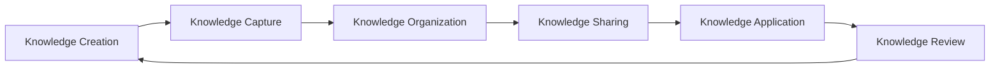
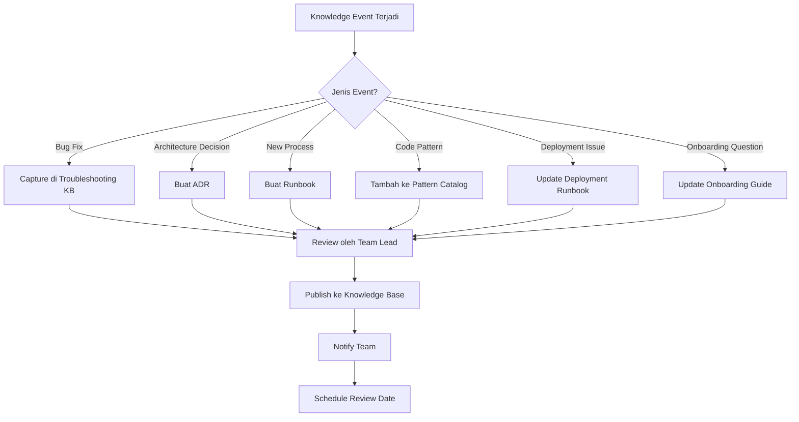
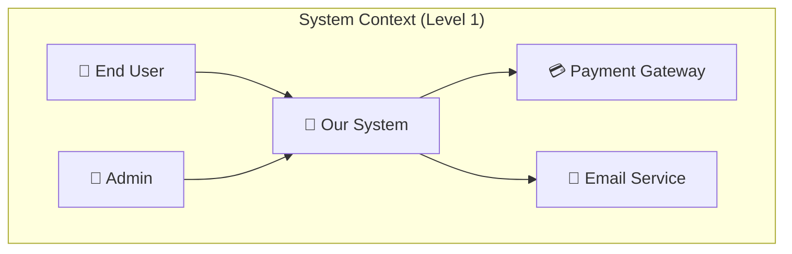
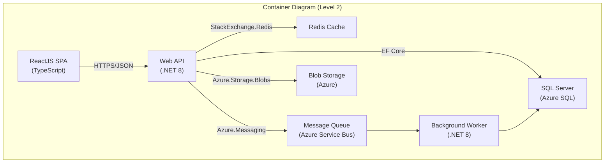

# 21 — Knowledge Base Strategy

> **Versi**: 2.0
> **Terakhir Diperbarui**: 2026-06-17
> **Pemilik Dokumen**: Engineering Lead
> **Stack**: .NET 8 · ReactJS · SQL Server
> **Kiro Compatible**: ✅

---

## Daftar Isi

1. [Pendahuluan](#pendahuluan)
2. [Knowledge Management Framework](#knowledge-management-framework)
3. [Kiro Knowledge Base](#kiro-knowledge-base)
4. [Documentation Standards](#documentation-standards)
5. [Knowledge Base Maintenance](#knowledge-base-maintenance)
6. [Tools & Integration](#tools--integration)
7. [Referensi](#referensi)

---

## Pendahuluan

Knowledge base yang terstruktur dengan baik adalah fondasi dari tim engineering yang produktif dan resilient. Tanpa knowledge base, tim akan mengalami **knowledge silos**, **bus factor risk**, dan **slow onboarding**.

> [!IMPORTANT]
> Tujuan utama knowledge base strategy bukan hanya mengumpulkan dokumentasi, tetapi memastikan **pengetahuan yang tepat tersedia bagi orang yang tepat pada waktu yang tepat**.

### Dampak Knowledge Management yang Baik

| Aspek | Tanpa KB | Dengan KB | Improvement |
|---|---|---|---|
| Onboarding Time | 4-6 minggu | 1-2 minggu | 60-75% |
| Bug Resolution Time | 4-8 jam | 1-2 jam | 50-75% |
| Context Switching Cost | Tinggi | Rendah | 40-60% |
| Tribal Knowledge Risk | Tinggi | Rendah | 70-90% |
| Decision Consistency | Rendah | Tinggi | Signifikan |
| Developer Satisfaction | Rendah | Tinggi | Signifikan |



---

## Knowledge Management Framework

### Tipe-Tipe Knowledge

#### 1. Tribal Knowledge (Pengetahuan Tak Tertulis)

Pengetahuan yang hanya ada di kepala satu atau beberapa orang. Ini adalah **risiko terbesar** untuk tim engineering.

**Contoh:**
- "Hanya Budi yang tahu cara deploy ke production"
- "Payment module punya quirk khusus yang perlu di-handle manual"
- "Kalau API timeout, restart service X terlebih dahulu"
- "Database Y perlu di-vacuum setiap Minggu malam"

**Cara Mengidentifikasi Tribal Knowledge:**

## Tribal Knowledge Audit Checklist

Untuk setiap team member, jawab pertanyaan berikut:

1. Apakah ada proses/sistem yang HANYA orang ini yang bisa handle?
   - [ ] Deployment process
   - [ ] Database administration
   - [ ] Third-party integration management
   - [ ] Legacy system maintenance
   - [ ] Infrastructure management
   - [ ] Security/compliance tasks

2. Apakah ada "unwritten rules" yang hanya diketahui orang ini?
   - [ ] Configuration quirks
   - [ ] Workarounds untuk known issues
   - [ ] Business logic edge cases
   - [ ] Performance tuning tips
   - [ ] Vendor-specific knowledge

3. Bus Factor Score (1-5):
   - [ ] 1 = Hanya 1 orang yang tahu (CRITICAL RISK)
   - [ ] 2 = 2 orang yang tahu (HIGH RISK)
   - [ ] 3 = 3 orang yang tahu (MODERATE RISK)
   - [ ] 4 = 4+ orang yang tahu (LOW RISK)
   - [ ] 5 = Documented & automated (MINIMAL RISK)

**Strategi Mengurangi Tribal Knowledge:**

| Strategi | Deskripsi | Effort |
|---|---|---|
| Pair Programming | Berdua mengerjakan task sensitif | Low |
| Knowledge Transfer Sessions | Sesi khusus berbagi pengetahuan | Medium |
| Shadow Rotations | Junior mengikuti senior selama 1-2 minggu | Medium |
| Documentation Sprints | Alokasi waktu khusus untuk mendokumentasikan | High |
| Video Walkthroughs | Rekam proses kompleks dalam video | Medium |
| Runbook Creation | Buat step-by-step guide untuk setiap proses | High |

#### 2. Documented Knowledge (Pengetahuan Terdokumentasi)

Pengetahuan yang sudah ditulis dalam bentuk dokumentasi formal.

**Kategori:**
- Architecture Decision Records (ADR)
- API Documentation (OpenAPI/Swagger)
- README files
- Confluence/Wiki pages
- Code comments & XML documentation
- Runbooks & Playbooks
- Onboarding guides

**Kualitas Documented Knowledge:**

| Level | Karakteristik | Score |
|---|---|---|
| 🔴 Poor | Outdated, incomplete, scattered, no ownership | 1-2 |
| 🟠 Basic | Exists but not comprehensive, rarely updated | 3-4 |
| 🟡 Good | Reasonably complete, occasionally reviewed | 5-6 |
| 🟢 Very Good | Comprehensive, regularly reviewed, discoverable | 7-8 |
| 🔵 Excellent | Living docs, automated updates, measured quality | 9-10 |

#### 3. Automated Knowledge (Pengetahuan Terotomatisasi)

Pengetahuan yang sudah di-encode ke dalam kode, scripts, atau tooling.

**Contoh:**
- Infrastructure as Code (Terraform, Bicep)
- CI/CD Pipelines (konfigurasi sebagai dokumentasi)
- Automated tests (spesifikasi sebagai tes)
- Code generators / templates
- Health checks & monitoring alerts
- Kiro context files & prompts

> [!TIP]
> Urutan prioritas pengetahuan: **Automated > Documented > Tribal**. Setiap tribal knowledge harus di-documented, dan setiap documented knowledge harus di-automated jika memungkinkan.

### Knowledge Capture Workflow



### Knowledge Sharing Culture

Budaya berbagi pengetahuan harus dibangun secara intentional:

| Aktivitas | Frekuensi | Format | Audience |
|---|---|---|---|
| Tech Talks | Bi-weekly | 30 min presentasi | Seluruh engineering |
| Brown Bag Sessions | Weekly | Informal lunch & learn | Team |
| Code Review | Every PR | Written feedback | PR participants |
| Architecture Review | Monthly | Workshop 2 jam | Senior engineers |
| Retrospective | End of sprint | Discussion | Scrum team |
| Onboarding Buddy | Per new hire | 1-on-1 mentoring | New hire + buddy |
| Blog Posts | Monthly (encouraged) | Written article | Engineering + public |
| Knowledge Base Day | Quarterly | Full day documentation | Seluruh engineering |

**Mengukur Knowledge Sharing:**

```markdown
## Knowledge Sharing KPIs

| Metric | Target | Current |
|---|---|---|
| KB articles created/month | ≥ 10 | ____ |
| KB articles updated/month | ≥ 20 | ____ |
| Tech Talks delivered/quarter | ≥ 6 | ____ |
| Average Bus Factor Score | ≥ 3 | ____ |
| Onboarding satisfaction score | ≥ 4/5 | ____ |
| Time to find answer in KB | < 5 min | ____ |
| KB search success rate | ≥ 80% | ____ |
```

---

## Kiro Knowledge Base

### Setting Up Kiro Context Files

Kiro menggunakan context files untuk memahami project secara mendalam. Struktur yang tepat akan meningkatkan kualitas assistance yang diberikan Kiro secara signifikan.

#### Struktur Direktori `.kiro/`

```
.kiro/
├── context/
│   ├── project-overview.md          # High-level project description
│   ├── architecture.md              # System architecture details
│   ├── tech-stack.md                # Technology stack specifications
│   ├── coding-standards.md          # Coding conventions & standards
│   ├── database-schema.md           # Database design documentation
│   ├── api-contracts.md             # API specifications
│   ├── business-domain.md           # Domain-specific terminology
│   ├── deployment.md                # Deployment architecture
│   ├── testing-strategy.md          # Testing approach
│   └── known-issues.md              # Known issues & workarounds
├── prompts/
│   ├── code-review.md               # Code review prompt
│   ├── bug-fix.md                   # Bug fixing prompt
│   ├── feature-development.md       # Feature development prompt
│   ├── refactoring.md               # Refactoring prompt
│   ├── testing.md                   # Test generation prompt
│   └── documentation.md             # Documentation generation prompt
├── templates/
│   ├── service-template.md          # Service class template
│   ├── controller-template.md       # Controller template
│   ├── test-template.md             # Test class template
│   └── migration-template.md        # DB migration template
└── patterns/
    ├── cqrs-handler.md              # CQRS handler pattern
    ├── repository.md                # Repository pattern
    ├── validation.md                # Validation pattern
    ├── error-handling.md            # Error handling pattern
    └── api-response.md              # API response pattern
```

### Project Knowledge Files

#### `.kiro/context/project-overview.md`

```markdown
# Project Overview

## Nama Project
{Nama Project} — {Tagline singkat}

## Deskripsi
{Deskripsi lengkap project, tujuan bisnis, dan target pengguna}

## Team
- Product Owner: {Nama}
- Tech Lead: {Nama}
- Backend Engineers: {Daftar}
- Frontend Engineers: {Daftar}
- QA Engineers: {Daftar}
- DevOps: {Daftar}

## Key Business Metrics
- DAU: {Daily Active Users}
- Revenue Model: {Subscription / Transaction / etc.}
- SLA: {99.9% uptime}
- Peak Load: {requests/second}

## Key Dates
- Project Start: {tanggal}
- MVP Launch: {tanggal}
- Current Phase: {Development / Maintenance / Enhancement}
- Next Major Release: {tanggal}

## Repositories
- Backend: {repo URL}
- Frontend: {repo URL}
- Infrastructure: {repo URL}
- Documentation: {repo URL}

## Environments
| Environment | URL | Purpose |
|---|---|---|
| Development | dev.example.com | Daily development |
| Staging | staging.example.com | Pre-production testing |
| Production | app.example.com | Production |
```

#### `.kiro/context/architecture.md`

```markdown
# System Architecture

## Architecture Style
Clean Architecture with CQRS pattern using MediatR.

## Layer Structure
```
src/
├── Domain/           # Entities, Value Objects, Domain Events
├── Application/      # Commands, Queries, Handlers, DTOs, Validators
├── Infrastructure/   # EF Core, External Services, Email, Storage
├── WebAPI/           # Controllers, Middleware, Filters
└── WebApp/           # ReactJS SPA
```

## Key Patterns
- **CQRS**: Commands (write) and Queries (read) are separated
- **MediatR**: Used for command/query dispatch
- **Repository Pattern**: Abstraction over EF Core DbContext
- **Unit of Work**: Managed by EF Core SaveChangesAsync
- **Result Pattern**: All service methods return Result<T> instead of throwing
- **Domain Events**: Published via MediatR notifications
- **Specification Pattern**: For complex query filtering

## External Dependencies
| Service | Purpose | Protocol | Auth |
|---|---|---|---|
| Azure Blob Storage | File uploads | REST | Managed Identity |
| SendGrid | Email delivery | REST | API Key |
| Stripe | Payment processing | REST | API Key |
| Redis | Distributed caching | TCP | Connection String |

## Database
- SQL Server 2022 (Azure SQL)
- EF Core 8 Code-First Migrations
- Read replicas for reporting queries
- Key tables: Users, Orders, Products, Payments, AuditLogs

## Authentication & Authorization
- ASP.NET Identity with JWT Bearer tokens
- Role-based authorization (Admin, Manager, User)
- Policy-based authorization for fine-grained access

## Infrastructure
- Azure App Service (API)
- Azure Static Web Apps (ReactJS)
- Azure SQL Database
- Azure Redis Cache
- Azure Key Vault (Secrets)
- Azure Monitor (Logging & Metrics)
```

#### `.kiro/context/coding-standards.md`

```markdown
# Coding Standards

## C# / .NET 8

### Naming Conventions
- Classes: PascalCase (e.g., OrderService)
- Interfaces: IPascalCase (e.g., IOrderRepository)
- Methods: PascalCase (e.g., GetOrderByIdAsync)
- Properties: PascalCase (e.g., OrderTotal)
- Private fields: _camelCase (e.g., _orderRepository)
- Parameters: camelCase (e.g., orderId)
- Constants: PascalCase (e.g., MaxRetryCount)
- Async methods: suffix with Async (e.g., GetOrderAsync)

### Code Structure Rules
- Max method length: 30 lines
- Max class length: 300 lines
- Max parameters: 4 (use parameter object if more)
- Cyclomatic complexity: ≤ 10 per method
- Always use CancellationToken for async operations
- Always use ILogger<T> for logging
- Never catch generic Exception — use specific types
- Always use ValueTask for hot paths that often complete synchronously

### Dependency Injection
- All services registered in DI container
- Scoped for request-level services
- Singleton for stateless services
- Transient for lightweight, stateless objects
- Never resolve services manually (no Service Locator)

### Error Handling
- Use Result<T> pattern for expected failures
- Use exceptions for unexpected/programmer errors
- Log all errors with structured logging (Serilog)
- Include correlation ID in all error responses

## TypeScript / ReactJS

### Naming Conventions
- Components: PascalCase (e.g., OrderDetails)
- Hooks: useCamelCase (e.g., useOrderData)
- Files: PascalCase for components, camelCase for utils
- Constants: UPPER_SNAKE_CASE
- Types/Interfaces: PascalCase, prefix with T/I optional

### Component Rules
- Functional components only (no class components)
- Max component length: 150 lines
- Extract custom hooks for reusable logic
- Use TypeScript strict mode
- Props interface defined above component
- Default exports for page components, named exports for shared

### State Management
- React Query (TanStack Query) for server state
- React Context for global UI state
- Local state (useState) for component-level state
- Zustand for complex client-side state (if needed)

## SQL Server

### Naming Conventions
- Tables: PascalCase, plural (e.g., Orders)
- Columns: PascalCase (e.g., OrderDate)
- Primary Keys: Id
- Foreign Keys: {RelatedTable}Id (e.g., CustomerId)
- Indexes: IX_{Table}_{Column} (e.g., IX_Orders_CustomerId)
- Stored Procedures: usp_{Action}_{Entity} (e.g., usp_GetOrdersByCustomer)
- Views: vw_{Description} (e.g., vw_OrderSummary)
```

### Architecture Knowledge Base

Dokumentasi arsitektur harus mengikuti C4 Model:

```markdown
# Architecture Knowledge Base

## Level 1: System Context
Bagaimana sistem berinteraksi dengan pengguna dan sistem eksternal.

## Level 2: Container
Komponen high-level (API, SPA, Database, Message Queue).

## Level 3: Component
Komponen di dalam setiap container (Controllers, Services, Repositories).

## Level 4: Code
Detail implementasi kode untuk komponen kritis.
```





### Decision Log (ADR — Architecture Decision Records)

Setiap keputusan arsitektur penting harus didokumentasikan menggunakan ADR:

```markdown
# ADR-{NNN}: {Judul Keputusan}

## Status
{Proposed | Accepted | Deprecated | Superseded by ADR-{NNN}}

## Tanggal
{YYYY-MM-DD}

## Konteks
{Jelaskan konteks dan masalah yang memicu keputusan ini}

## Keputusan
{Jelaskan keputusan yang diambil}

## Opsi yang Dipertimbangkan

### Opsi 1: {Nama}
- ✅ Pro: {keuntungan}
- ❌ Con: {kerugian}

### Opsi 2: {Nama}
- ✅ Pro: {keuntungan}
- ❌ Con: {kerugian}

### Opsi 3: {Nama}
- ✅ Pro: {keuntungan}
- ❌ Con: {kerugian}

## Konsekuensi
{Jelaskan dampak positif dan negatif dari keputusan ini}

## Catatan
{Informasi tambahan, referensi, atau follow-up items}
```

**Contoh ADR:**

```markdown
# ADR-005: Menggunakan MediatR untuk CQRS Pattern

## Status
Accepted

## Tanggal
2026-01-15

## Konteks
Tim membutuhkan cara untuk memisahkan command (write) dan query (read) operations
untuk meningkatkan maintainability dan testability. Beberapa opsi yang dipertimbangkan:
CQRS manual, MediatR library, atau Wolverine.

## Keputusan
Menggunakan MediatR sebagai mediator untuk implementasi CQRS pattern.

## Opsi yang Dipertimbangkan

### Opsi 1: MediatR
- ✅ Mature library, well-documented
- ✅ Large community, banyak contoh
- ✅ Pipeline behaviors untuk cross-cutting concerns
- ✅ Simple API
- ❌ Adds indirection (harder to navigate code)
- ❌ Performance overhead (minimal)

### Opsi 2: Wolverine
- ✅ More feature-rich (built-in saga, scheduling)
- ✅ Better performance
- ❌ Smaller community
- ❌ Steeper learning curve
- ❌ Heavier dependency

### Opsi 3: Manual CQRS (no library)
- ✅ No external dependency
- ✅ Full control
- ❌ More boilerplate code
- ❌ Need to implement pipeline manually
- ❌ Inconsistent implementations across team

## Konsekuensi
- Semua use cases diimplementasikan sebagai MediatR IRequest<T>
- Pipeline behaviors untuk: Logging, Validation, Transaction, Caching
- Handler classes harus small dan focused (single responsibility)
- Navigasi kode memerlukan "Go to Implementation" daripada "Go to Definition"
```

### Common Patterns Catalog

```markdown
# Pattern Catalog

## Backend Patterns

### 1. CQRS Command Handler
Gunakan untuk semua write operations.

### 2. CQRS Query Handler
Gunakan untuk semua read operations.

### 3. Repository Pattern
Abstraksi untuk data access.

### 4. Specification Pattern
Untuk complex query filtering.

### 5. Result Pattern
Return Result<T> instead of throwing exceptions.

### 6. Domain Event Pattern
Publish events setelah domain operations.

### 7. Validation Pipeline
FluentValidation via MediatR pipeline behavior.

## Frontend Patterns

### 1. Container/Presenter Pattern
Separate data fetching dari rendering.

### 2. Custom Hook Pattern
Encapsulate reusable logic dalam hooks.

### 3. Compound Component Pattern
Untuk complex, composable UI components.

### 4. Render Props Pattern
Untuk sharing behavior between components.

### 5. Error Boundary Pattern
Graceful error handling di component tree.
```

**Contoh Pattern Detail:**

```csharp
// Pattern: CQRS Command Handler

// 1. Command Definition
public record CreateOrderCommand(
    int CustomerId,
    List<OrderItemDto> Items,
    string ShippingAddress
) : IRequest<Result<OrderCreatedResponse>>;

// 2. Validator
public class CreateOrderCommandValidator 
    : AbstractValidator<CreateOrderCommand>
{
    public CreateOrderCommandValidator()
    {
        RuleFor(x => x.CustomerId)
            .GreaterThan(0)
            .WithMessage("Customer ID is required");
        
        RuleFor(x => x.Items)
            .NotEmpty()
            .WithMessage("Order must have at least one item");
        
        RuleFor(x => x.ShippingAddress)
            .NotEmpty()
            .MaximumLength(500);
        
        RuleForEach(x => x.Items).ChildRules(item =>
        {
            item.RuleFor(x => x.ProductId).GreaterThan(0);
            item.RuleFor(x => x.Quantity).GreaterThan(0);
        });
    }
}

// 3. Handler
public class CreateOrderCommandHandler 
    : IRequestHandler<CreateOrderCommand, Result<OrderCreatedResponse>>
{
    private readonly IOrderRepository _orderRepository;
    private readonly ICustomerRepository _customerRepository;
    private readonly IUnitOfWork _unitOfWork;
    private readonly ILogger<CreateOrderCommandHandler> _logger;

    public CreateOrderCommandHandler(
        IOrderRepository orderRepository,
        ICustomerRepository customerRepository,
        IUnitOfWork unitOfWork,
        ILogger<CreateOrderCommandHandler> logger)
    {
        _orderRepository = orderRepository;
        _customerRepository = customerRepository;
        _unitOfWork = unitOfWork;
        _logger = logger;
    }

    public async Task<Result<OrderCreatedResponse>> Handle(
        CreateOrderCommand request,
        CancellationToken cancellationToken)
    {
        var customer = await _customerRepository
            .GetByIdAsync(request.CustomerId, cancellationToken);
        
        if (customer is null)
            return Result<OrderCreatedResponse>
                .Failure(DomainErrors.Customer.NotFound(request.CustomerId));

        var order = Order.Create(
            customer,
            request.Items.Select(i => OrderItem.Create(
                i.ProductId, i.Quantity, i.UnitPrice)).ToList(),
            request.ShippingAddress);

        _orderRepository.Add(order);
        await _unitOfWork.SaveChangesAsync(cancellationToken);

        _logger.LogInformation(
            "Order {OrderId} created for customer {CustomerId}",
            order.Id, customer.Id);

        return Result<OrderCreatedResponse>.Success(
            new OrderCreatedResponse(order.Id, order.OrderNumber));
    }
}

// 4. Controller
[HttpPost]
[ProducesResponseType(typeof(OrderCreatedResponse), StatusCodes.Status201Created)]
[ProducesResponseType(typeof(ProblemDetails), StatusCodes.Status400BadRequest)]
public async Task<IActionResult> CreateOrder(
    [FromBody] CreateOrderRequest request,
    CancellationToken cancellationToken)
{
    var command = _mapper.Map<CreateOrderCommand>(request);
    var result = await _mediator.Send(command, cancellationToken);
    
    return result.IsSuccess
        ? CreatedAtAction(nameof(GetOrder), 
            new { id = result.Value.OrderId }, result.Value)
        : BadRequest(result.ToProblemDetails());
}
```

### Troubleshooting Knowledge Base

```markdown
# Troubleshooting Knowledge Base

## Format Template

### TSB-{NNN}: {Judul Masalah}

**Symptoms**: {Gejala yang diamati}
**Root Cause**: {Penyebab akar masalah}
**Impact**: {Dampak terhadap sistem/pengguna}
**Resolution**: {Langkah-langkah penyelesaian}
**Prevention**: {Langkah pencegahan agar tidak terulang}
**Related**: {Link ke issue, ADR, atau TSB lain}
**Last Occurred**: {Tanggal terakhir terjadi}
```

**Contoh Troubleshooting Entry:**

```markdown
### TSB-023: SQL Server Deadlock pada Order Processing

**Symptoms**:
- Error log: "Transaction was deadlocked on lock resources"
- Order creation fails intermittently during peak hours
- HTTP 500 responses pada POST /api/orders

**Root Cause**:
Dua concurrent transactions mengakses tabel Orders dan OrderItems
dalam urutan yang berbeda, menyebabkan deadlock:
- Transaction A: INSERT Orders → UPDATE Inventory
- Transaction B: UPDATE Inventory → INSERT Orders

**Impact**:
- ~2% order creation failures during peak hours (10 AM - 2 PM)
- Customer impact: Need to retry order submission

**Resolution**:
1. Pastikan semua transactions mengakses tabel dalam urutan yang sama:
   ```sql
   -- Always: Inventory → Orders → OrderItems
   BEGIN TRANSACTION
     UPDATE Inventory SET Quantity = Quantity - @Qty WHERE ProductId = @ProductId
     INSERT INTO Orders (...) VALUES (...)
     INSERT INTO OrderItems (...) VALUES (...)
   COMMIT
   ```

2. Tambahkan retry logic di application layer:
   ```csharp
   services.AddDbContext<AppDbContext>(options =>
       options.UseSqlServer(connectionString, sqlOptions =>
           sqlOptions.EnableRetryOnFailure(
               maxRetryCount: 3,
               maxRetryDelay: TimeSpan.FromSeconds(5),
               errorNumbersToAdd: new[] { 1205 }) // 1205 = deadlock
       ));
   ```

3. Tambahkan `WITH (UPDLOCK, ROWLOCK)` hint pada query yang competitive.

**Prevention**:
- Document table access order dalam Architecture KB
- Code review harus check transaction ordering
- Monitor deadlock frequency via SQL Server DMV
- Set up alert jika deadlock count > 5/hour

**Related**: ADR-012, TSB-018
**Last Occurred**: 2026-05-20
```

### Onboarding Knowledge Package

```markdown
# Onboarding Package — New Engineer

## Week 1: Foundation

### Day 1: Setup & Introduction
- [ ] Laptop & account setup (IT ticket #____)
- [ ] Access to repositories (GitHub / Azure DevOps)
- [ ] Access to communication tools (Slack, Teams)
- [ ] Access to project management (JIRA, Azure Boards)
- [ ] Meet the team (scheduled by People Ops)
- [ ] Read: Project Overview (.kiro/context/project-overview.md)
- [ ] Read: Architecture Overview (.kiro/context/architecture.md)
- [ ] Setup local development environment (see README.md)

### Day 2: Codebase Orientation
- [ ] Clone all repositories
- [ ] Run the application locally
- [ ] Walk through the folder structure with buddy
- [ ] Read: Coding Standards (.kiro/context/coding-standards.md)
- [ ] Read: Git Workflow (CONTRIBUTING.md)
- [ ] Complete: First "hello world" PR (update your name in TEAM.md)

### Day 3: Architecture Deep Dive
- [ ] Review C4 architecture diagrams
- [ ] Walk through a request lifecycle (API → Service → DB → Response)
- [ ] Understand CQRS pattern with MediatR
- [ ] Review Pattern Catalog
- [ ] Read: ADR-001 through ADR-005

### Day 4: Database & Testing
- [ ] Review database schema (ERD diagrams)
- [ ] Understand EF Core migrations workflow
- [ ] Run the test suite
- [ ] Write your first unit test
- [ ] Read: Testing Strategy (.kiro/context/testing-strategy.md)

### Day 5: Deployment & Operations
- [ ] Understand CI/CD pipeline
- [ ] Review deployment environments (dev/staging/production)
- [ ] Walk through monitoring dashboards
- [ ] Review runbook for common operations
- [ ] Read: Deployment Guide (docs/deployment.md)

## Week 2: Hands-On

### Day 6-7: First Feature
- [ ] Pick a "good first issue" from backlog
- [ ] Implement with guidance from buddy
- [ ] Write unit tests
- [ ] Submit PR for review
- [ ] Address review feedback

### Day 8-9: Deep Dive into Assigned Area
- [ ] Deep dive into the module you'll be working on
- [ ] Review all related ADRs
- [ ] Review existing tests
- [ ] Identify any gaps in documentation
- [ ] Add to Knowledge Base (at least 1 contribution)

### Day 10: Onboarding Review
- [ ] Present what you've learned to the team (15 min)
- [ ] Provide onboarding feedback
- [ ] Identify remaining knowledge gaps
- [ ] Set up 30-day learning goals with manager

## Onboarding Buddy Responsibilities
1. Answer all questions (no question is too basic)
2. Daily 15-min sync for first 2 weeks
3. Review first 5 PRs with detailed feedback
4. Introduce to key stakeholders
5. Share "tribal knowledge" that isn't in docs
6. Collect onboarding feedback for KB improvement
```

---

## Documentation Standards

### README.md Template

```markdown
# {Project Name}

{Deskripsi singkat project (1-2 kalimat)}

## 🏗️ Tech Stack

| Layer | Technology | Version |
|---|---|---|
| Backend | .NET | 8.0 |
| Frontend | React | 18.x |
| Database | SQL Server | 2022 |
| Cache | Redis | 7.x |
| CI/CD | Azure DevOps | - |

## 🚀 Quick Start

### Prerequisites
- .NET 8 SDK
- Node.js 20 LTS
- SQL Server 2022 (or Docker)
- Redis (or Docker)

### Setup

```bash
# Clone repository
git clone {repo-url}
cd {project-name}

# Backend
cd src/WebAPI
dotnet restore
dotnet ef database update
dotnet run

# Frontend
cd src/WebApp
npm install
npm run dev
```

### Environment Variables

| Variable | Description | Default | Required |
|---|---|---|---|
| `ConnectionStrings__DefaultConnection` | SQL Server connection | `Server=localhost;...` | ✅ |
| `Redis__ConnectionString` | Redis connection | `localhost:6379` | ✅ |
| `Jwt__Secret` | JWT signing key | - | ✅ |
| `Jwt__Issuer` | JWT issuer | `https://localhost` | ❌ |
| `SendGrid__ApiKey` | Email service key | - | ❌ |

## 📁 Project Structure

```
src/
├── Domain/           # Business entities & logic
├── Application/      # Use cases (CQRS handlers)
├── Infrastructure/   # External concerns (DB, APIs)
├── WebAPI/           # HTTP API layer
└── WebApp/           # React SPA
tests/
├── Unit/             # Unit tests
├── Integration/      # Integration tests
└── E2E/              # End-to-end tests
docs/
├── architecture/     # Architecture documentation
├── api/              # API documentation
├── adr/              # Architecture Decision Records
└── runbooks/         # Operational runbooks
```

## 🧪 Testing

```bash
# Run all tests
dotnet test

# Run with coverage
dotnet test --collect:"XPlat Code Coverage"

# Run frontend tests
cd src/WebApp && npm test

# Run E2E tests
cd tests/E2E && npx playwright test
```

## 📦 Deployment

See [Deployment Guide](docs/deployment.md) for detailed instructions.

## 📖 Documentation

- [Architecture](docs/architecture/)
- [API Reference](docs/api/)
- [ADRs](docs/adr/)
- [Runbooks](docs/runbooks/)
- [Contributing](CONTRIBUTING.md)

## 👥 Team

| Role | Name | Contact |
|---|---|---|
| Product Owner | {Name} | {email} |
| Tech Lead | {Name} | {email} |
| Engineers | {Names} | - |

## 📄 License

{License information}
```

### API Documentation (OpenAPI/Swagger)

```csharp
// Program.cs — Swagger Configuration
builder.Services.AddSwaggerGen(options =>
{
    options.SwaggerDoc("v1", new OpenApiInfo
    {
        Title = "MyProject API",
        Version = "v1",
        Description = "API untuk {deskripsi project}",
        Contact = new OpenApiContact
        {
            Name = "Engineering Team",
            Email = "engineering@company.com"
        }
    });
    
    // Include XML comments
    var xmlFile = $"{Assembly.GetExecutingAssembly().GetName().Name}.xml";
    var xmlPath = Path.Combine(AppContext.BaseDirectory, xmlFile);
    options.IncludeXmlComments(xmlPath);
    
    // JWT Authentication
    options.AddSecurityDefinition("Bearer", new OpenApiSecurityScheme
    {
        Type = SecuritySchemeType.Http,
        Scheme = "bearer",
        BearerFormat = "JWT",
        Description = "Enter JWT token"
    });
    
    options.AddSecurityRequirement(new OpenApiSecurityRequirement
    {
        {
            new OpenApiSecurityScheme
            {
                Reference = new OpenApiReference
                {
                    Type = ReferenceType.SecurityScheme,
                    Id = "Bearer"
                }
            },
            Array.Empty<string>()
        }
    });
});
```

```csharp
// Controller dengan XML Documentation lengkap
/// <summary>
/// Manages order lifecycle operations including creation,
/// retrieval, updates, and cancellation.
/// </summary>
[ApiController]
[Route("api/v1/[controller]")]
[Produces("application/json")]
public class OrdersController : ControllerBase
{
    /// <summary>
    /// Creates a new order for the specified customer.
    /// </summary>
    /// <param name="request">The order creation details.</param>
    /// <param name="cancellationToken">Cancellation token.</param>
    /// <returns>The created order details.</returns>
    /// <response code="201">Order created successfully.</response>
    /// <response code="400">Invalid order data.</response>
    /// <response code="404">Customer not found.</response>
    /// <response code="409">Insufficient inventory for one or more items.</response>
    /// <remarks>
    /// Sample request:
    ///
    ///     POST /api/v1/orders
    ///     {
    ///         "customerId": 123,
    ///         "items": [
    ///             { "productId": 456, "quantity": 2 }
    ///         ],
    ///         "shippingAddress": "Jl. Sudirman No. 1, Jakarta"
    ///     }
    ///
    /// </remarks>
    [HttpPost]
    [ProducesResponseType(typeof(OrderCreatedResponse), StatusCodes.Status201Created)]
    [ProducesResponseType(typeof(ValidationProblemDetails), StatusCodes.Status400BadRequest)]
    [ProducesResponseType(typeof(ProblemDetails), StatusCodes.Status404NotFound)]
    [ProducesResponseType(typeof(ProblemDetails), StatusCodes.Status409Conflict)]
    public async Task<IActionResult> CreateOrder(
        [FromBody] CreateOrderRequest request,
        CancellationToken cancellationToken)
    {
        // Implementation
    }
}
```

### Runbook Documentation Template

```markdown
# Runbook: {Nama Operasi}

## Metadata
| Field | Value |
|---|---|
| **Owner** | {Nama Team/Person} |
| **Last Updated** | {YYYY-MM-DD} |
| **Review Cadence** | Quarterly |
| **Severity** | {P0/P1/P2/P3} |
| **Estimated Duration** | {waktu} |

## Deskripsi
{Kapan runbook ini digunakan dan apa tujuannya}

## Prerequisites
- [ ] Access ke {environment/tool}
- [ ] Credentials untuk {service}
- [ ] Approval dari {person/role} (jika required)

## Langkah-langkah

### Step 1: {Judul Step}
```bash
{command}
```
**Expected Output**: {apa yang seharusnya terlihat}
**If Error**: {apa yang dilakukan jika gagal}

### Step 2: {Judul Step}
```bash
{command}
```

## Rollback
Jika operasi gagal, ikuti langkah berikut:

### Rollback Step 1:
```bash
{rollback command}
```

## Verification
Setelah operasi selesai, verifikasi dengan:
- [ ] {Check 1}
- [ ] {Check 2}
- [ ] {Check 3}

## Communication
- Notify: {channel/person} sebelum memulai
- Update: {channel/person} setelah selesai
- Escalate: {person/team} jika ada masalah

## History
| Date | Executor | Result | Notes |
|---|---|---|---|
| {date} | {name} | {success/failure} | {notes} |
```

### ADR (Architecture Decision Record) Template

Template ADR sudah disertakan di bagian [Decision Log](#decision-log-adr--architecture-decision-records) di atas.

### Code Documentation Standards

```csharp
// .NET XML Documentation Standards

/// <summary>
/// Provides functionality for managing customer orders, including
/// creation, retrieval, status updates, and cancellation.
/// </summary>
/// <remarks>
/// This service implements the IOrderService interface and uses
/// CQRS pattern via MediatR for all operations. All methods
/// are transactional and publish domain events upon successful
/// completion.
/// 
/// Dependencies:
/// - IOrderRepository: Data access for orders
/// - ICustomerRepository: Customer validation
/// - IUnitOfWork: Transaction management
/// - IMediator: Domain event publishing
/// </remarks>
/// <example>
/// <code>
/// var orderService = serviceProvider.GetRequiredService&lt;IOrderService&gt;();
/// var result = await orderService.CreateOrderAsync(command, cancellationToken);
/// 
/// if (result.IsSuccess)
///     Console.WriteLine($"Order created: {result.Value.OrderNumber}");
/// </code>
/// </example>
public class OrderService : IOrderService
{
    /// <summary>
    /// Creates a new order for the specified customer with the given items.
    /// </summary>
    /// <param name="command">
    /// The order creation command containing customer ID, items, and shipping details.
    /// </param>
    /// <param name="cancellationToken">
    /// Token to cancel the operation. Propagated to all downstream calls.
    /// </param>
    /// <returns>
    /// A <see cref="Result{T}"/> containing <see cref="OrderCreatedResponse"/> on success,
    /// or error details on failure.
    /// </returns>
    /// <exception cref="ArgumentNullException">
    /// Thrown when <paramref name="command"/> is null.
    /// </exception>
    public async Task<Result<OrderCreatedResponse>> CreateOrderAsync(
        CreateOrderCommand command,
        CancellationToken cancellationToken)
    {
        // Implementation
    }
}
```

```tsx
// ReactJS/TypeScript Documentation Standards

/**
 * OrderDetails component displays comprehensive order information
 * including items, totals, shipping status, and customer details.
 *
 * @component
 * @example
 * ```tsx
 * <OrderDetails
 *   orderId={123}
 *   showActions={true}
 *   onCancel={(id) => handleCancel(id)}
 * />
 * ```
 *
 * @remarks
 * This component uses `useOrderData` hook for data fetching with
 * React Query. It supports real-time updates via WebSocket
 * subscription when the order is in "processing" status.
 */
interface OrderDetailsProps {
  /** Unique identifier for the order to display */
  orderId: number;
  /** Whether to show action buttons (cancel, reorder) */
  showActions?: boolean;
  /** Callback fired when user cancels the order */
  onCancel?: (orderId: number) => void;
}

export function OrderDetails({
  orderId,
  showActions = false,
  onCancel,
}: OrderDetailsProps) {
  // Implementation
}
```

---

## Knowledge Base Maintenance

### Review Cadence

| Tipe Dokumen | Review Cadence | Reviewer |
|---|---|---|
| Architecture Docs | Quarterly | Tech Lead + Senior Engineers |
| ADRs | On significant changes | Architecture Review Board |
| API Documentation | Every sprint | Backend Team Lead |
| Runbooks | Monthly | DevOps + On-call team |
| Onboarding Guide | Setiap onboarding baru | Latest onboardee + buddy |
| Pattern Catalog | Bi-monthly | Senior Engineers |
| Troubleshooting KB | Monthly | All engineers (rotate) |
| README files | Every major release | Team Lead |
| Coding Standards | Quarterly | All engineers (vote) |

### Freshness Indicators

Gunakan badge berikut di setiap dokumen:

```markdown
<!-- Freshness Indicators -->

🟢 **Fresh** — Last reviewed within review cadence
🟡 **Stale** — 1 review cycle overdue
🟠 **Outdated** — 2+ review cycles overdue
🔴 **Expired** — 3+ review cycles overdue, may be inaccurate

<!-- Add to document header -->
> **Last Reviewed**: 2026-05-15 | **Next Review**: 2026-08-15 | **Status**: 🟢 Fresh
```

**Automated Freshness Checking Script:**

```bash
#!/bin/bash
# check-kb-freshness.sh
# Scans all markdown files for "Last Reviewed" date and reports stale documents

echo "📋 Knowledge Base Freshness Report"
echo "==================================="
echo ""

STALE_COUNT=0
TODAY=$(date +%s)

find docs/ .kiro/ -name "*.md" | while read file; do
    REVIEWED=$(grep -oP 'Last Reviewed.*?\K\d{4}-\d{2}-\d{2}' "$file" 2>/dev/null)
    
    if [ -z "$REVIEWED" ]; then
        echo "⚪ NO DATE: $file"
        continue
    fi
    
    REVIEWED_EPOCH=$(date -d "$REVIEWED" +%s 2>/dev/null)
    DAYS_AGO=$(( (TODAY - REVIEWED_EPOCH) / 86400 ))
    
    if [ $DAYS_AGO -gt 180 ]; then
        echo "🔴 EXPIRED ($DAYS_AGO days): $file"
        STALE_COUNT=$((STALE_COUNT + 1))
    elif [ $DAYS_AGO -gt 120 ]; then
        echo "🟠 OUTDATED ($DAYS_AGO days): $file"
        STALE_COUNT=$((STALE_COUNT + 1))
    elif [ $DAYS_AGO -gt 90 ]; then
        echo "🟡 STALE ($DAYS_AGO days): $file"
    else
        echo "🟢 FRESH ($DAYS_AGO days): $file"
    fi
done

echo ""
echo "Total stale documents: $STALE_COUNT"
```

### Ownership Matrix

| Knowledge Area | Primary Owner | Backup Owner | Contributors |
|---|---|---|---|
| Architecture Docs | Tech Lead | Senior Engineer A | All seniors |
| Backend Patterns | Backend Lead | Senior Backend | Backend team |
| Frontend Patterns | Frontend Lead | Senior Frontend | Frontend team |
| Database Docs | DBA / Backend Lead | Senior Backend | Backend team |
| DevOps Runbooks | DevOps Lead | Senior DevOps | DevOps team |
| API Documentation | Backend Lead | API owners | Backend team |
| Onboarding Guide | Engineering Manager | HR + Tech Lead | Recent hires |
| Security Docs | Security Lead | Tech Lead | Security team |
| Testing Strategy | QA Lead | Tech Lead | All engineers |

### Contribution Guidelines

```markdown
# Knowledge Base Contribution Guidelines

## Siapa yang Boleh Berkontribusi?
Semua engineer diharapkan berkontribusi ke Knowledge Base.

## Kapan Harus Berkontribusi?
1. Setelah menyelesaikan bug fix yang kompleks → Troubleshooting KB
2. Setelah membuat keputusan arsitektur → ADR
3. Setelah menemukan pattern baru → Pattern Catalog
4. Setelah onboarding → Update Onboarding Guide
5. Setelah resolving incident → Post-mortem + Runbook update
6. Setelah learning session → Tech Talk notes

## Format Kontribusi
1. Fork/branch dari `main`
2. Buat/edit file markdown sesuai template
3. Submit Pull Request
4. Request review dari Knowledge Owner area tersebut
5. Merge setelah approved

## Quality Checklist
- [ ] Mengikuti template yang sudah ada
- [ ] Include contoh kode jika applicable
- [ ] Bahasa jelas dan ringkas
- [ ] Links ke dokumen terkait
- [ ] "Last Reviewed" date di-update
- [ ] Spell-check passed
- [ ] Code blocks tested & correct

## Recognition
- Monthly "KB Contributor of the Month" recognition
- Kontribusi KB diperhitungkan dalam performance review
- Leaderboard kontribusi dipublish quarterly
```

### Quality Metrics

```markdown
## Knowledge Base Quality Metrics

| Metric | Cara Mengukur | Target |
|---|---|---|
| **Coverage** | % systems/processes yang terdokumentasi | ≥ 90% |
| **Freshness** | % dokumen yang still within review cadence | ≥ 85% |
| **Usage** | Unique visitors ke KB per month | Increasing trend |
| **Search Success** | % search queries yang menghasilkan relevant result | ≥ 80% |
| **Completeness** | Average template completion score per doc | ≥ 4/5 |
| **Accuracy** | Issues reported due to incorrect documentation | < 2/quarter |
| **Time to Answer** | Average time to find answer in KB | < 5 minutes |
| **Contribution Rate** | New/updated articles per sprint | ≥ 5 |
| **Bus Factor** | Average across all critical knowledge areas | ≥ 3 |
| **NPS** | Developer satisfaction with KB (survey) | ≥ 40 |
```

---

## Tools & Integration

### Confluence vs Wiki vs Docs-as-Code

| Aspek | Confluence | GitHub Wiki | Docs-as-Code |
|---|---|---|---|
| **Version Control** | Built-in (limited) | Git-based | Git-based |
| **Code Review** | ❌ No | ❌ Limited | ✅ Full PR review |
| **Search** | ✅ Excellent | 🟡 Basic | 🟡 Depends on tool |
| **Rich Editor** | ✅ WYSIWYG | 🟡 Markdown | 🟡 Markdown |
| **Access Control** | ✅ Fine-grained | 🟡 Repo-level | 🟡 Repo-level |
| **Integration** | ✅ Jira, Slack | ✅ GitHub | ✅ CI/CD |
| **Offline Access** | ❌ No | ✅ Git clone | ✅ Git clone |
| **Cost** | 💰 Paid | ✅ Free | ✅ Free |
| **Stays in Sync** | 🟡 Manual | 🟡 Manual | ✅ Auto (CI) |
| **AI-Friendly** | 🟡 Export needed | ✅ Markdown | ✅ Markdown |

> [!TIP]
> **Rekomendasi**: Gunakan **Docs-as-Code** (Markdown di repository) untuk technical documentation yang terkait erat dengan kode. Gunakan **Confluence** untuk process documentation, meeting notes, dan non-technical docs.

### Docs-as-Code Setup

```yaml
# .github/workflows/docs.yml
name: Documentation CI

on:
  push:
    paths:
      - 'docs/**'
      - '.kiro/**'
    branches: [main]
  pull_request:
    paths:
      - 'docs/**'
      - '.kiro/**'

jobs:
  validate-docs:
    runs-on: ubuntu-latest
    steps:
      - uses: actions/checkout@v4
      
      - name: Check markdown links
        uses: gaurav-nelson/github-action-markdown-link-check@v1
        with:
          use-quiet-mode: 'yes'
          config-file: '.markdown-link-check.json'
      
      - name: Spell check
        uses: streetsidesoftware/cspell-action@v5
        with:
          files: 'docs/**/*.md'
      
      - name: Check freshness
        run: ./scripts/check-kb-freshness.sh
      
      - name: Build docs site
        run: npx docusaurus build
        working-directory: docs-site

  deploy-docs:
    needs: validate-docs
    if: github.ref == 'refs/heads/main'
    runs-on: ubuntu-latest
    steps:
      - uses: actions/checkout@v4
      - name: Deploy to GitHub Pages
        uses: peaceiris/actions-gh-pages@v3
        with:
          github_token: ${{ secrets.GITHUB_TOKEN }}
          publish_dir: ./docs-site/build
```

### Search Optimization

Agar knowledge base mudah ditemukan, terapkan strategi berikut:

```markdown
## Search Optimization Checklist

### Metadata di Setiap Dokumen
- [ ] Title yang deskriptif (H1)
- [ ] Tags/keywords di frontmatter
- [ ] Summary/description di awal dokumen
- [ ] "See Also" section dengan related docs
- [ ] Table of Contents untuk dokumen panjang

### YAML Frontmatter Template
```yaml
---
title: "Troubleshooting SQL Server Deadlocks"
tags: [sql-server, deadlock, troubleshooting, database]
category: troubleshooting
author: "@john.doe"
created: 2026-03-15
last_reviewed: 2026-06-01
next_review: 2026-09-01
status: fresh
related:
  - docs/runbooks/database-operations.md
  - docs/architecture/database-design.md
  - docs/adr/ADR-012-transaction-strategy.md
---
```

### Indexing Strategy
1. Use consistent naming conventions across all docs
2. Create an index page (docs/INDEX.md) linking to all docs
3. Tag documents with relevant keywords
4. Cross-reference related documents
5. Use consistent headings for similar document types
```

### Cross-Referencing Strategy

```markdown
## Cross-Referencing Rules

1. **Every ADR** must reference:
   - Related source code files
   - Related architecture diagrams
   - Superseded ADRs (if any)

2. **Every Runbook** must reference:
   - Related monitoring dashboards
   - Related troubleshooting entries
   - Related architecture docs

3. **Every Troubleshooting Entry** must reference:
   - Related runbooks
   - Related source code
   - Related ADRs (if relevant)

4. **Every Pattern** must reference:
   - Example implementation in codebase
   - Related ADR explaining why this pattern was chosen
   - Alternatives and when to use them

## Link Format
- Internal docs: `[Document Title](relative/path/to/doc.md)`
- Source code: `[ClassName](../../src/Module/ClassName.cs)`
- External: `[Resource Name](https://url)`
- ADR: `[ADR-{NNN}](../adr/ADR-{NNN}.md)`
```

---

## Referensi

### Buku & Artikel
- *Docs Like Code* — Anne Gentle
- *Living Documentation* — Cyrille Martraire
- *The Knowledge Creating Company* — Ikujiro Nonaka, Hirotaka Takeuchi
- *Team Topologies* — Matthew Skelton, Manuel Pais (Chapter on Knowledge Sharing)

### Tools
- **Docusaurus** — Documentation site generator
- **MkDocs** — Python-based documentation generator
- **Confluence** — Enterprise wiki platform
- **Notion** — Collaborative workspace
- **Kiro AI** — AI-assisted documentation & knowledge management
- **Algolia DocSearch** — Documentation search engine

### Templates Repository
Semua template yang disebutkan dalam dokumen ini tersedia di:
```
.kiro/templates/
├── adr-template.md
├── runbook-template.md
├── troubleshooting-template.md
├── pattern-template.md
├── readme-template.md
└── onboarding-checklist.md
```

---

> [!CAUTION]
> **Anti-Pattern**: Jangan membuat knowledge base "write-only" di mana dokumen ditulis tapi tidak pernah dibaca atau di-update. Knowledge base yang tidak di-maintain lebih berbahaya daripada tidak punya knowledge base sama sekali — karena memberikan informasi yang salah.

---

*Dokumen ini adalah bagian dari Kiro Engineering SOP. Untuk pertanyaan atau kontribusi, hubungi Engineering Lead.*
