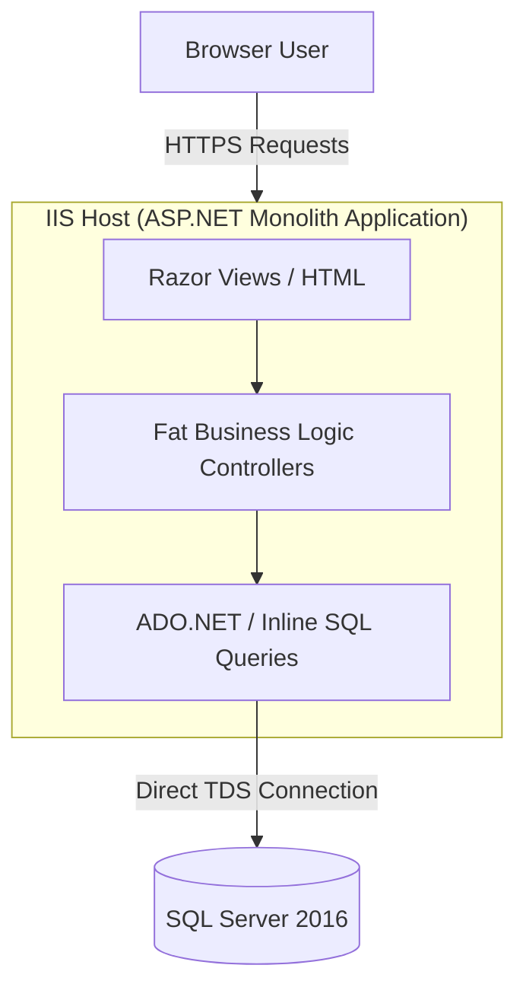

# 📄 Template: Enterprise Architecture Review

Dokumen ini mendefinisikan templat standar untuk mendokumentasikan hasil audit arsitektur tingkat tinggi (*Enterprise Architecture Review*) pada sistem enterprise. Templat ini membagi evaluasi ke dalam 4 pilar utama: **Current Architecture**, **Risk Analysis**, **Technical Debt**, dan **Refactoring Roadmap**.

> [!NOTE]
> **Kapan Menggunakan Dokumen Ini:**
> - Ketika mengambil alih sistem lama (*legacy application*) untuk dimodernisasi.
> - Sebagai hasil luaran (*deliverables*) saat menjalankan **Prompt 1.6 (Enterprise Architecture & Risk Review)** di Kiro AI.
> - Sebelum merancang ADR (*Architecture Decision Record*) berskala besar.

---

# Bagian A — Templat Kosong Architecture Review

*Salin bagian di bawah ini untuk memulai dokumen review arsitektur baru Anda.*

```markdown
# High-Level Architecture Review: [Nama Sistem / Solusi]

| Info Audit | Keterangan |
|---|---|
| **Tanggal Audit** | [DD-MM-YYYY] |
| **Auditor / Architect** | [Nama Architect] |
| **Versi Solusi** | [e.g., v1.5.0-legacy] |
| **Target Modernisasi** | [e.g., Migrasi ke .NET 8 & Clean Architecture] |

---

## 1. Executive Summary
*Berikan ringkasan eksekutif 1-2 paragraf mengenai status kesehatan arsitektur saat ini, tantangan utama yang dihadapi bisnis akibat arsitektur ini, serta arah strategis perbaikan yang diusulkan.*

---

## 2. Current Architecture (Arsitektur Saat Ini)

### 2.1 Peta Komponen & Subsistem
*Gambarkan komponen-komponen utama sistem (Frontend, Backend, Database, Shared Services, API Gateway) menggunakan diagram Mermaid.*

```mermaid
graph TD
    %% Gambarkan komponen di sini
```

### 2.2 Deskripsi Tech Stack
*Tuliskan tabel teknologi yang saat ini digunakan beserta keterangannya.*

| Layer | Komponen / Teknologi | Versi | Status Support / Dukungan |
|---|---|---|---|
| **Presentation** | | | |
| **Application Logic** | | | |
| **Database & Cache** | | | |
| **Deployment / Infra** | | | |

### 2.3 Alur Data Utama
*Jelaskan alur data terpenting (misal: proses checkout, proses sinkronisasi data) dan tunjukkan di mana letak bottleneck atau inefisiensi yang terjadi.*

---

## 3. Risk Analysis (Analisis Risiko)

*Gunakan tabel ini untuk memetakan risiko sistem saat ini berdasarkan kategori dampak (Tinggi, Sedang, Rendah).*

| ID Risiko | Area (Security/Scalability/Reliability/Maintainability) | Deskripsi Risiko | Dampak (H/M/L) | Kemungkinan (H/M/L) | Mitigasi yang Direkomendasikan |
|---|---|---|---|---|---|
| **RSK-01** | | | | | |
| **RSK-02** | | | | | |

---

## 4. Technical Debt Registry (Pencatatan Hutang Teknis)

*Petakan hutang teknis utama yang ditemukan di dalam codebase saat ini. Rujuk kategori skoring pada [Technical Debt Management](file:///Users/agandazhari/kiro-engineering-sop/docs/20-technical-debt-management.md).*

| ID Debt | Nama / Deskripsi Hutang Teknis | Lokasi File / Modul | Kategori (Code/Architecture/Test/Infra) | Urgensi Pelunasan (High/Medium/Low) | Estimasi Remediasi (S/M/L/XL) |
|---|---|---|---|---|---|
| **DBT-01** | | | | | |
| **DBT-02** | | | | | |

---

## 5. Refactoring & Modernization Roadmap

### 5.1 Matriks Prioritas Perbaikan (Urgency vs Effort)
*Kelompokkan perbaikan berdasarkan matriks urgensi dan tingkat kesulitan untuk menentukan Quick Wins.*

```
         Tinggi |  [Quick Wins]       |  [Strategic Projects]
                |  - Mitigasi RSK-01  |  - Refactor ke Clean Arch
   URGENSI      |  - Upgrade Versi db |  - Migrasi Database
                |                     |
         Rendah |  - Perbaikan kecil  |  - Pengurangan minor debt
                +---------------------+----------------------
                        Rendah                  Tinggi
                                EFFORT
```

### 5.2 Rencana Kerja Bertahap (Roadmap Milestones)

#### 📍 Fase 1: Fondasi & Mitigasi Risiko Kritis (Bulan 1-2)
* **Fokus:** Menyelesaikan risiko keamanan (PII) dan stabilitas infrastruktur dasar.
* **Deliverables:**
  - `[ ]` [Tugas 1]
  - `[ ]` [Tugas 2]

#### 📍 Fase 2: Dekomposisi & Refactoring Core (Bulan 3-4)
* **Fokus:** Pemisahan *Fat Services* dan implementasi CQRS/MediatR pada domain inti.
* **Deliverables:**
  - `[ ]` [Tugas 1]
  - `[ ]` [Tugas 2]

#### 📍 Fase 3: Otomatisasi & Skalabilitas (Bulan 5-6)
* **Fokus:** Peningkatan unit testing, CI/CD pipeline, dan pembersihan hutang teknis minor.
* **Deliverables:**
  - `[ ]` [Tugas 1]
```

---

# Bagian B — Contoh Laporan Terisi: Sistem "OrderLegacy"

Berikut adalah contoh sebagian dokumen *Architecture Review* yang sudah terisi untuk sistem penjualan tiket bus lama milik perusahaan.

```markdown
# High-Level Architecture Review: Sistem "OrderLegacy" (Tiket Bus Online)

| Info Audit | Keterangan |
|---|---|
| **Tanggal Audit** | 18-06-2026 |
| **Auditor / Architect** | Antigravity MVP |
| **Versi Solusi** | v2.1.0 (ASP.NET MVC + .NET Framework 4.7.2) |
| **Target Modernisasi** | Porting ke .NET 8 Clean Architecture & ReactJS Frontend |

---

## 1. Executive Summary
Sistem **OrderLegacy** saat ini berjalan di atas framework .NET lama (.NET Framework 4.7.2) dengan arsitektur Monolith ketat di mana logika bisnis, UI rendering (Razor Views), dan akses database langsung (ADO.NET) berada dalam satu project tunggal. 

Tantangan utama yang dihadapi saat ini adalah database SQL Server sering mengalami *deadlock* saat *high season* (mudik Lebaran) akibat query pencarian kursi bus yang tidak terindeks dengan baik dan tidak adanya mekanisme *caching*. Selain itu, karena tingginya *coupling* kode, menambahkan fitur baru membutuhkan waktu rilis berminggu-minggu dengan risiko regresi yang tinggi.

---

## 2. Current Architecture (Arsitektur Saat Ini)

### 2.1 Peta Komponen & Subsistem
Arsitektur Monolith saat ini berjalan di satu Windows Server IIS dan terhubung langsung ke satu DB Server.



### 2.2 Deskripsi Tech Stack

| Layer | Komponen / Teknologi | Versi | Status Support / Dukungan |
|---|---|---|---|
| **Presentation** | ASP.NET MVC (Razor Views), jQuery | 5.2 / 3.3 | Deprecated / Rentan Keamanan |
| **Application Logic** | C# (.NET Framework) | 4.7.2 | EoL (End of Life) Soon |
| **Database & Cache** | SQL Server (On-Premises) | 2016 SP2 | Extended Support Only |
| **Deployment / Infra** | Windows Server VM (Manual Deploy) | 2016 | Manual provisioning |

---

## 3. Risk Analysis (Analisis Risiko)

| ID Risiko | Area | Deskripsi Risiko | Dampak | Kemungkinan | Mitigasi yang Direkomendasikan |
|---|---|---|---|---|---|
| **RSK-01** | Scalability | Database deadlock pada tabel `dbo.SeatReservations` saat peak traffic (tiket mudik). | High | High | Pisahkan pencarian tiket ke *Read Replika* database dan implementasikan Redis caching untuk ketersediaan kursi bus. |
| **RSK-02** | Security | Parameter database dikirim menggunakan SQL Concatenation (bukan query parameter), memicu SQL Injection. | High | Medium | Refactor seluruh pemanggilan ADO.NET untuk menggunakan parametrized queries atau migrasi ke EF Core. |
| **RSK-03** | Maintainability | Tidak ada Automated Unit Test. Setiap rilis harus melalui tes manual oleh tim QA selama 3 hari. | Medium | High | Terapkan unit testing dasar pada *Application Layer* menggunakan xUnit, FluentAssertions, dan Moq. |

---

## 4. Technical Debt Registry (Pencatatan Hutang Teknis)

| ID Debt | Nama / Deskripsi Hutang Teknis | Lokasi File / Modul | Kategori | Urgensi Pelunasan | Estimasi Remediasi |
|---|---|---|---|---|---|
| **DBT-01** | *Fat Controller* (Controller menampung > 1500 baris logika bisnis) | `Controllers/BookingController.cs` | Architecture | High | L (Dekomposisi kelas & migrasi ke MediatR Handlers) |
| **DBT-02** | Koneksi Database Terbuka Manual (tidak terbungkus dalam `using` block) | `DataAccess/DbHelper.cs` | Code | High | S (Ganti ke ADO.NET `using` statement atau EF Core `DbContext`) |
| **DBT-03** | Penggunaan library enkripsi MD5 lama untuk data password user | `Security/Cryptography.cs` | Security | Medium | M (Ganti ke BCrypt / Argon2 menggunakan API .NET modern) |

---

## 5. Refactoring & Modernization Roadmap

### 5.1 Matriks Prioritas Perbaikan (Urgency vs Effort)

```
         Tinggi |  [Quick Wins]                     |  [Strategic Projects]
                |  - Parameterized Query (RSK-02)   |  - Migrasi Backend ke .NET 8 (DBT-01)
   URGENSI      |  - Redis Cache ketersediaan tiket |  - Dekomposisi UI ke ReactJS (Fase 2)
                |                                   |
         Rendah |  - Ganti enkripsi MD5 (DBT-03)   |  - Tambah unit test cakupan > 80%
                +-----------------------------------+-----------------------------------
                        Rendah                                Tinggi
                                              EFFORT
```

### 5.2 Rencana Kerja Bertahap (Roadmap Milestones)

#### 📍 Fase 1: Stabilisasi Keamanan & Perbaikan Query Kritis (Bulan 1)
* **Fokus:** Menghapus celah SQL injection dan mitigasi deadlock kursi bus.
* **Deliverables:**
  - `[ ]` Refactor SQL string concatenation di `DbHelper.cs` menjadi SQL Parameterized Queries.
  - `[ ]` Buat non-clustered index baru pada `dbo.SeatReservations (ScheduleId, Status) INCLUDE (SeatNumber)`.

#### 📍 Fase 2: Porting Core Backend ke .NET 8 Clean Architecture (Bulan 2-4)
* **Fokus:** Porting logika bisnis booking dan pembayaran tiket dari ASP.NET MVC (.NET Framework) ke .NET 8 Web API.
* **Deliverables:**
  - `[ ]` Inisialisasi arsitektur dasar mengikuti standar [Clean Architecture](file:///Users/agandazhari/kiro-engineering-sop/docs/12-template-clean-architecture-dotnet8.md).
  - `[ ]` Dekomposisi Controller raksasa di `BookingController.cs` menjadi MediatR Command/Query Handlers di Application Layer.
  - `[ ]` Integrasi dengan EF Core 8 untuk akses data database utama.

#### 📍 Fase 3: Migrasi Frontend ke ReactJS & CI/CD Pipeline (Bulan 5-6)
* **Fokus:** Modernisasi tampilan user interface menggunakan ReactJS tunggal (SPA) dan otomatisasi deployment.
* **Deliverables:**
  - `[ ]` Implementasi UI booking interaktif menggunakan ReactJS sesuai standar [ReactJS Frontend Standard](file:///Users/agandazhari/kiro-engineering-sop/docs/13-template-reactjs-frontend-standard.md).
  - `[ ]` Pembuatan GitHub Actions workflow untuk otomatisasi build, test, dan deployment ke Cloud Hosting (Azure/AWS).
```
