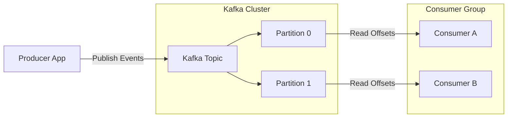

# 27 — Playbook Kafka Message Broker

> **Versi**: 2.0.0
> **Terakhir Diperbarui**: 2026-06-18
> **Pemilik Dokumen**: Tech Lead / Senior Developer
> **Stack**: .NET 8 · ReactJS · SQL Server · Apache Kafka
> **Kiro Compatible**: ✅

---

## Daftar Isi

1. [Pendahuluan](#pendahuluan)
2. [Konsep Dasar Apache Kafka](#konsep-dasar-apache-kafka)
3. [Arsitektur Integrasi di Clean Architecture](#arsitektur-integrasi-di-clean-architecture)
4. [Panduan Integrasi Teknis .NET 8](#panduan-integrasi-teknis-net-8)
   - [4.1 Instalasi dan Konfigurasi](#41-instalasi-dan-konfigurasi)
   - [4.2 Implementasi Kafka Producer](#42-implementasi-kafka-producer)
   - [4.3 Implementasi Kafka Consumer (Background Service)](#43-implementasi-kafka-consumer-background-service)
   - [4.4 Registrasi Dependency Injection](#44-registrasi-dependency-injection)
5. [Penanganan Error dan Resiliensi](#penanganan-error-dan-resiliensi)
6. [Kiro Prompt Library untuk Kafka](#kiro-prompt-library-untuk-kafka)

---

## Pendahuluan

Dokumen ini mendefinisikan standar teknis penggunaan **Apache Kafka** sebagai *distributed event streaming platform* untuk komunikasi asinkronus antar layanan (*microservices*) dan pengolahan data berkinerja tinggi. 

Panduan ini bertujuan untuk memastikan seluruh integrasi Kafka di dalam aplikasi berbasis **.NET 8** diimplementasikan dengan memisahkan detail infrastruktur eksternal dari logika bisnis utama sesuai dengan prinsip **Clean Architecture**.

---

## Konsep Dasar Apache Kafka

Apache Kafka menggunakan pola *Publish-Subscribe* (Pub/Sub) yang didistribusikan secara terkluster demi keandalan (*durability*) dan skalabilitas yang tinggi.



### Komponen Utama:
* **Broker**: Server tunggal Kafka yang mengelola penyimpanan pesan dan melayani request dari client. Broker bekerja dalam bentuk *cluster*.
* **Topic**: Kategori atau kanal spesifik tempat data disimpan. Topic bersifat *append-only log*, artinya pesan yang masuk selalu ditambahkan di akhir dan tidak bisa diubah (*immutable*).
* **Partition**: Pembagian fisik sebuah *Topic* untuk didistribusikan ke berbagai broker. Partition memungkinkan pemrosesan pesan secara paralel dan meningkatkan throughput.
* **Offset**: ID berupa nomor urut unik yang diberikan kepada setiap pesan di dalam sebuah partisi. Offset melacak sejauh mana *Consumer* telah sukses memproses pesan.
* **Producer**: Aplikasi client yang mengirimkan event/pesan ke satu atau beberapa *Topic* Kafka.
* **Consumer**: Aplikasi client yang berlangganan (*subscribe*) ke *Topic* untuk membaca dan memproses event.
* **Consumer Group**: Sekelompok consumer yang berkolaborasi untuk mengonsumsi data dari suatu *Topic* secara paralel. Setiap partisi hanya dapat dikonsumsi oleh maksimal satu consumer di dalam satu grup untuk mencegah duplikasi pemrosesan.

---

## Arsitektur Integrasi di Clean Architecture

Untuk menjaga agar *Core Domain* dan *Application Layer* tidak terpolusi oleh pustaka pihak ketiga seperti `Confluent.Kafka`, seluruh ketergantungan Kafka harus diisolasi di dalam **Infrastructure Layer**.

```
Src/
├── Core/
│   ├── Domain/              # Domain Events & Aggregate Roots
│   └── Application/         # IEventPublisher interface, CQRS Command & Handlers
├── Infrastructure/          # KafkaProducer, KafkaConsumerBackgroundService, NuGet Confluent.Kafka
└── Presentation/            # Web API Controllers, Minimal APIs
```

* **Interface Abstraction**: Didefinisikan di `Application` layer tanpa referensi ke Kafka (menggunakan objek DTO umum).
* **Konfigurasi**: Disimpan di `appsettings.json` dan dipetakan di `Infrastructure` layer menggunakan opsi strongly-typed.
* **CQRS MediatR**: Consumer di `Infrastructure` menerima data dari Kafka, mendeserialisasinya, lalu mengirimkannya ke handler bisnis di `Application` melalui `IMediator.Send()`.

---

## Panduan Integrasi Teknis .NET 8

### 4.1 Instalasi dan Konfigurasi

Tambahkan paket NuGet resmi Confluent ke proyek `Infrastructure`:
```bash
dotnet add Src/Infrastructure/Infrastructure.csproj package Confluent.Kafka
```

Tambahkan pengaturan konfigurasi Kafka pada `appsettings.json`:
```json
{
  "KafkaSettings": {
    "BootstrapServers": "localhost:9092",
    "GroupId": "engineering-sop-service-group",
    "AutoOffsetReset": "Earliest",
    "EnableAutoCommit": false
  }
}
```

Definisikan strongly-typed options di `Infrastructure`:
```csharp
namespace MyProject.Infrastructure.Messaging.Kafka;

public class KafkaSettings
{
    public string BootstrapServers { get; set; } = string.Empty;
    public string GroupId { get; set; } = string.Empty;
    public string AutoOffsetReset { get; set; } = "Earliest";
    public bool EnableAutoCommit { get; set; } = false;
}
```

### 4.2 Implementasi Kafka Producer

Buatlah interface abstraksi pengiriman event di `Application` layer:

```csharp
namespace MyProject.Application.Common.Interfaces;

public interface IEventPublisher
{
    Task PublishAsync<T>(string topic, T @event, CancellationToken cancellationToken) where T : class;
}
```

Implementasikan interface tersebut di `Infrastructure` menggunakan `ProducerBuilder` dari Kafka:

```csharp
using System.Text.Json;
using Confluent.Kafka;
using Microsoft.Extensions.Options;
using MyProject.Application.Common.Interfaces;

namespace MyProject.Infrastructure.Messaging.Kafka;

public class KafkaProducer : IEventPublisher, IDisposable
{
    private readonly IProducer<string, string> _producer;

    public KafkaProducer(IOptions<KafkaSettings> settings)
    {
        var config = new ProducerConfig
        {
            BootstrapServers = settings.Value.BootstrapServers,
            ClientId = "engineering-sop-producer",
            Acks = Acks.All // Menjamin konsistensi data di semua replica broker
        };

        _producer = new ProducerBuilder<string, string>(config).Build();
    }

    public async Task PublishAsync<T>(string topic, T @event, CancellationToken cancellationToken) where T : class
    {
        var messagePayload = JsonSerializer.Serialize(@event);
        
        var message = new Message<string, string>
        {
            Key = Guid.NewGuid().ToString(),
            Value = messagePayload
        };

        try
        {
            var result = await _producer.ProduceAsync(topic, message, cancellationToken);
            // Logging sukses menggunakan Metadata Broker
        }
        catch (ProduceException<string, string> ex)
        {
            throw new InvalidOperationException($"Gagal mempublikasikan pesan ke Kafka: {ex.Error.Reason}", ex);
        }
    }

    public void Dispose()
    {
        _producer.Flush(TimeSpan.FromSeconds(10));
        _producer.Dispose();
    }
}
```

### 4.3 Implementasi Kafka Consumer (Background Service)

Gunakan `BackgroundService` bawaan .NET untuk melakukan polling pesan secara asinkronus tanpa memblokir thread HTTP utama.

```csharp
using System.Text.Json;
using Confluent.Kafka;
using MediatR;
using Microsoft.Extensions.DependencyInjection;
using Microsoft.Extensions.Hosting;
using Microsoft.Extensions.Logging;
using Microsoft.Extensions.Options;
using MyProject.Application.Orders.Commands.CreateOrder;

namespace MyProject.Infrastructure.Messaging.Kafka;

public class KafkaOrderConsumerService : BackgroundService
{
    private readonly IConsumer<string, string> _consumer;
    private readonly IServiceProvider _serviceProvider;
    private readonly ILogger<KafkaOrderConsumerService> _logger;
    private const string TargetTopic = "order-created-topic";

    public KafkaOrderConsumerService(
        IOptions<KafkaSettings> settings,
        IServiceProvider serviceProvider,
        ILogger<KafkaOrderConsumerService> _logger)
    {
        _serviceProvider = serviceProvider;
        this._logger = _logger;

        var config = new ConsumerConfig
        {
            BootstrapServers = settings.Value.BootstrapServers,
            GroupId = settings.Value.GroupId,
            AutoOffsetReset = Enum.Parse<AutoOffsetReset>(settings.Value.AutoOffsetReset, true),
            EnableAutoCommit = settings.Value.EnableAutoCommit
        };

        _consumer = new ConsumerBuilder<string, string>(config).Build();
    }

    protected override async Task ExecuteAsync(CancellationToken stoppingToken)
    {
        _consumer.Subscribe(TargetTopic);
        _logger.LogInformation("Kafka Consumer terhubung ke topic: {Topic}", TargetTopic);

        while (!stoppingToken.IsCancellationRequested)
        {
            try
            {
                // Melakukan polling dengan timeout singkat agar berkala mendeteksi CancellationToken
                var consumeResult = _consumer.Consume(TimeSpan.FromMilliseconds(100));
                if (consumeResult == null) continue;

                _logger.LogInformation("Pesan Kafka diterima dari partisi {Partition} dengan offset {Offset}", 
                    consumeResult.Partition, consumeResult.Offset);

                // Jalankan proses bisnis di Scope terpisah karena BackgroundService bersifat Singleton
                using (var scope = _serviceProvider.CreateScope())
                {
                    var mediator = scope.ServiceProvider.GetRequiredService<IMediator>();
                    
                    var orderEvent = JsonSerializer.Deserialize<OrderCreatedEventDto>(consumeResult.Message.Value);
                    if (orderEvent != null)
                    {
                        var command = new CreateOrderFromKafkaCommand(orderEvent);
                        await mediator.Send(command, stoppingToken);
                    }
                }

                // Commit offset secara manual setelah pesan sukses diproses untuk menjamin At-Least-Once delivery
                _consumer.Commit(consumeResult);
            }
            catch (ConsumeException ex)
            {
                _logger.LogError(ex, "Terjadi kesalahan fatal saat membaca event dari Kafka.");
            }
            catch (Exception ex)
            {
                _logger.LogError(ex, "Gagal memproses pesan Kafka.");
            }
        }
    }

    public override void Dispose()
    {
        _consumer.Close();
        _consumer.Dispose();
        base.Dispose();
    }
}
```

### 4.4 Registrasi Dependency Injection

Tambahkan konfigurasi Dependency Injection di file registrasi `DependencyInjection.cs` milik Infrastructure layer:

```csharp
using Microsoft.Extensions.Configuration;
using Microsoft.Extensions.DependencyInjection;
using MyProject.Application.Common.Interfaces;
using MyProject.Infrastructure.Messaging.Kafka;

namespace MyProject.Infrastructure;

public static class DependencyInjection
{
    public static IServiceCollection AddInfrastructure(this IServiceCollection services, IConfiguration configuration)
    {
        // Bind Settings
        services.Configure<KafkaSettings>(configuration.GetSection("KafkaSettings"));

        // Register Producer
        services.AddSingleton<IEventPublisher, KafkaProducer>();

        // Register Consumer Background Service
        services.AddHostedService<KafkaOrderConsumerService>();

        return services;
    }
}
```

---

## Penanganan Error dan Resiliensi

Integrasi Kafka di produksi wajib memperhatikan aspek ketangguhan (*resilience*):

1. **At-Least-Once Delivery**: Selalu nonaktifkan `EnableAutoCommit` (atur ke `false`) dan lakukan `Commit` manual setelah handler di Application Layer berhasil mengeksekusi pesan tanpa error.
2. **Dead Letter Queue (DLQ)**: Jika pemrosesan pesan gagal secara berulang setelah percobaan ulang (retry), kirim pesan gagal tersebut ke topic khusus (misal: `order-created-dead-letter-topic`) agar partisi utama tidak terhambat (*poison pill prevention*).
3. **Idempotency**: Selalu gunakan ID unik (seperti `Correlation ID` atau `Message ID`) di tingkat Application Layer agar jika terjadi pengiriman pesan berulang (duplikasi), database tidak memproses perintah yang sama dua kali.

---

## Kiro Prompt Library untuk Kafka

Berikut adalah templat prompt profesional yang dapat Anda gunakan di Kiro IDE untuk meminta asisten menulis kode Kafka:

### Prompt: Membuat Publisher Event Berbasis Kafka
```text
Buatkan implementasi integration event publisher berbasis Apache Kafka di .NET 8 menggunakan Clean Architecture.
Pastikan:
1. Interface abstraksi diletakkan di Core Application layer (bebas dari library Kafka).
2. Implementasi konkret menggunakan Confluent.Kafka diletakkan di Infrastructure layer.
3. Gunakan primary constructor, file-scoped namespaces, dan asuransikan Acks diatur ke 'All' demi ketahanan data.
4. Serialisasi pesan menggunakan System.Text.Json.
```

### Prompt: Membuat Consumer Background Service
```text
Buatlah background service (.NET BackgroundService) untuk mengonsumsi pesan dari Kafka topic bernama 'billing-events'.
Aturan:
1. Inject IServiceProvider untuk membuat scope lokal saat memanggil MediatR Handler.
2. Matikan autocommit offset, dan panggil Commit secara manual hanya setelah MediatR handler sukses mengeksekusi command.
3. Tangani ConsumeException dengan aman menggunakan ILogger, dan pastikan loop tidak crash/berhenti jika terjadi error di satu pesan.
4. Teruskan CancellationToken dari parameter ExecuteAsync ke pemrosesan MediatR.
```
